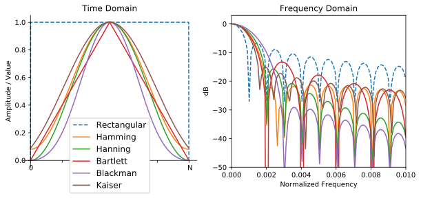

.. _freq-domain-chapter:

#####################
Domaine fréquentiel
#####################

Ce chapitre présente le domaine fréquentiel d'un signal et couvre les séries de Fourier, la transformée de Fourier, ses propriétés, la FFT, le fenêtrage et les spectrogrammes, à l'aide d'exemples Python.
 
L'une des conséquences indirectes les plus intéressantes de l'apprentissage du DSP (en anglais *digital signal processing* pour *traitements numériques du signal* en français) et des communications sans fil est que vous apprendrez également à raisonner dans le domaine fréquentiel.  L'expérience de la plupart des gens en matière de *manipulation* dans le domaine fréquenciel se limite à l'ajustement de boutons de réglage des basses, des médiums et des aigus sur le système audio d'une voiture.  L'expérience de la plupart des gens en matière de visualisation d'un signal dans le domaine fréquenciel se limite à voir un égaliseur audio, comme cette animation :

.. image:: ../_images/audio_equalizer.webp
   :align: center
   

À la fin de ce chapitre, vous comprendrez ce que signifie réellement le domaine fréquentiel, comment basculer entre le domaine temporel et fréquentiel (et ce qui se passe lorsque nous le faisons), ainsi que certains principes intéressants que nous utiliserons tout au long de nos études de DSP et de SDR (*Software-Defined Radio* en anglaie pour *radio logicielle* en français). À la fin de ce manuel, vous deviendrez un maître dans l'art de manipuler un signal dans le domaine fréquentiel, c'est garanti!

Tout d'abord, pourquoi aimons-nous regarder les signaux dans le domaine des fréquences?  Voici deux exemples de signaux, présentés à la fois dans le domaine temporel et dans le domaine fréquentiel:

.. image:: ../_images/time_and_freq_domain_example_signals.png
   :scale: 40 %
   :align: center   

Comme vous pouvez le voir, dans le domaine temporel, ils ressemblent tous les deux à du bruit, mais dans le domaine fréquentiel, nous pouvons voir des caractéristiques différentes.  Dans le domaine temporel, tout se trouve sous sa forme *naturelle*; lorsque nous échantillonnons des signaux, nous le faisons dans le domaine temporel, car vous ne pouvez pas échantillonner *directement* un signal dans le domaine fréquentiel. Et pourtant, les choses les plus intéressantes se passent généralement dans le domaine des fréquences. 

***************
Séries de Fourier
***************

Les bases du domaine fréquentiel commencent par comprendre que tout signal peut être représenté par la somme d'ondes sinusoïdales. Lorsque nous décomposons un signal en ses ondes sinusoïdales, on obtient ce qu'on appelle une série de Fourier. Voici un exemple de signal composé de seulement deux ondes sinusoïdales:

.. image:: ../_images/summing_sinusoids.svg
   :align: center
   :target: ../_images/summing_sinusoids.svg
   
Voici un autre exemple: la courbe rouge ci-dessous reproduit approximativement une onde en dents de scie en additionnant jusqu'à 10 ondes sinusoïdales. On peut observer qu'il ne s'agit pas d'une reconstruction parfaite - il faudrait en fait sommer un nombre infini d'ondes sinusoïdales pour reproduire le signal en dents de scie à cause des transitions abruptes:

.. image:: ../_images/fourier_series_triangle.gif
   :scale: 70 %   
   :align: center  
   
Certains signaux nécessitent ainsi de sommer plus d'ondes sinusoïdales que d'autres, alors que d'autres ont besoin d'un nombre infini, bien qu'ils puissent toujours être approximés avec un nombre limité.  Voici un autre exemple de décomposition d'un signal en une série d'ondes sinusoïdales :

.. image:: ../_images/fourier_series_arbitrary_function.gif
   :scale: 70 %   
   :align: center  

Pour comprendre comment décomposer un signal en somme de sinusoïdes, nous devons d'abord définir les trois paramètres d'une onde sinusoïdale :

#. Amplitude
#. Phase
#. Fréquence

**L'amplitude** indique la "force" de l'onde, tandis que la **phase** est utilisée pour représenter la façon dont l'onde sinusoïdale est décalée dans le temps, de 0 à 360 degrés (ou de 0 à :math:`2\pi`).  La **fréquence** est le nombre d'ondulations par seconde.

.. image:: ../_images/amplitude_phase_period.svg
   :align: center
   :target: ../_images/amplitude_phase_period.svg
   
À ce stade, vous avez peut-être compris qu'un "signal" n'est essentiellement qu'une fonction, généralement représentée "dans le temps" (c'est-à-dire sur l'axe des x). Un autre attribut facile à retenir est la **période**, qui est l'inverse de la **fréquence**. La **période** d'une sinusoïde est le temps, en secondes, que met l'onde pour terminer un cycle.  Ainsi, l'unité de fréquence est 1/seconde, ou Hz.
   
Lorsque nous décomposons un signal en une somme d'ondes sinusoïdales, chacune d'entre elles aura une certaine **amplitude**, **phase** et **fréquence**.  L'**amplitude** de chaque onde sinusoïdale nous indique l'intensité de la **fréquence** présente dans le signal d'origine.  Ne vous préoccupez pas trop de la **phase** pour l'instant, si ce n'est pour réaliser que la seule différence entre sin() et cos() est un déphasage (décalage temporel).

Il est plus important de comprendre le concept sous-jacent que les équations réelles pour résoudre une série de Fourier, mais pour ceux qui sont intéressés par les équations, je vous renvoie à l'explication concise de Wolfram : https://mathworld.wolfram.com/FourierSeries.html.

********************
La dualité temps-fréquence
********************

Nous avons expliqué que les signaux peuvent être représentés comme des ondes sinusoïdales, chacune ayant plusieurs paramètres. Maintenant, voyons comment tracer ces signaux dans le domaine des fréquences. Là où la représentation dans le domaine temporel montre comment un signal évolue dans le temps, le domaine fréquentiel, lui, montre la proportion du signal qui se trouve dans telle ou telle fréquence. De ce fait, l'axe des x ne sera plus le temps mais la fréquence. Nous pouvons représenter un signal donné à la fois en temps *et* en fréquence. Prenons quelques exemples simples pour commencer.

Voici à quoi ressemble une onde sinusoïdale, de fréquence f, dans le domaine temporel et fréquentiel:

.. image:: ../_images/sine-wave.png
   :scale: 70 % 
   :align: center  

Le domaine temporel devrait vous sembler très familier. Il s'agit tout simplement d'une fonction oscillante. Ne vous souciez pas de savoir à quel moment du cycle elle commence à l'instant t=0 ou combien de temps elle dure.  Ce qu'il faut retenir, c'est que le signal a une **unique fréquence**, c'est pourquoi nous voyons un seul pic dans le domaine des fréquences.  Quelle que soit la fréquence à laquelle cette onde sinusoïdale oscille, c'est là que nous verrons le pic dans le domaine des fréquences.  Le nom mathématique d'un pic de ce type est appelé "impulsion".

Maintenant, et si nous avions une impulsion dans le domaine temporel ?  Imaginez l'enregistrement sonore d'une personne tapant dans ses mains ou frappant un clou avec un marteau.  Cette paire temps-fréquence est un peu moins intuitive.

.. image:: ../_images/impulse.png
   :scale: 70 % 
   :align: center  

Comme nous pouvons le voir, un pic/impulsion dans le domaine temporel est un plat dans le domaine fréquentiel; il contient théoriquement toutes les fréquences. Il n'existe pas d'impulsion théoriquement parfaite, car elle devrait être infiniment courte dans le domaine temporel. Comme pour l'onde sinusoïdale, l'endroit où l'impulsion se produit dans le domaine temporel n'a pas d'importance. Ce qu'il faut retenir ici, c'est que les changements rapides dans le domaine temporel entraînent l'apparition de nombreuses fréquences dans le domaine fréquentiel.

Examinons mainteant les tracés d'une onde carrée dans le domaine temporel et fréquentiel:

.. image:: ../_images/square-wave.svg
   :align: center 
   :target: ../_images/square-wave.svg

Cet exemple est également pas très intuitif, mais nous pouvons dans un premier temps observer que la présence d'une forte pointe à 10 Hz, qui est la fréquence de l'onde carrée. En revanche, on observe aussi que les fréquences ne s'arrête pas à ce pic mais continue au delà. Cela est dû au changements rapides qu'on peut observer dans le domaine temporel, tout comme dans l'exemple précédent. Toutefois, la courbe dans le domaine fréquentiel ici n'est plus plate. Elle présente plutôt des pics à certains intervalles, et le niveau décroît lentement (bien qu'il se poursuive indéfiniment). Une onde carrée dans le domaine temporel a la forme de la fonction sin(x)/x dans le domaine fréquentiel (fonction aussi appelée sinc).

Maintenant, que se passe-t-il si nous avons un signal constant dans le domaine temporel? Un signal constant n'a pas de "fréquence".  Voyons voir :

.. image:: ../_images/dc-signal.png
   :scale: 100 % 
   :align: center 

Comme il n'y a pas de fréquence, nous avons un pic à 0 Hz dans le domaine des fréquences. C'est logique si vous y réfléchissez.  Le domaine des fréquences ne sera pas "vide", car cela ne se produit que lorsqu'il n'y aucun signal de présent (c'est-à-dire un signal de valeur dans le domaine temporel).  Nous appelons ce 0Hz dans le domaine des fréquences la "CC" (pour *courant continue*) ou souvent "DC" (pour *direct current* en anglais), car il est causé par un signal continu et constant dans le temps.  Notez que si nous augmentons l'amplitude de notre signal DC dans le domaine temporel, le pic à 0 Hz dans le domaine fréquentiel augmentera également.

Nous verrons plus tard ce que signifie exactement l'axe des y dans le graphique du domaine des fréquences, mais pour l'instant, vous pouvez le considérer comme une sorte d'amplitude qui vous indique la quantité de cette fréquence présente dans le signal temporel.
   
*****************
Transformée de Fourier
*****************

Mathématiquement, la "transformation" que nous utilisons pour passer du domaine temporel au domaine fréquentiel ou inversement s'appelle la transformation de Fourier. Elle est définie comme suit :

.. math::
   X(f) = \int x(t) e^{-j2\pi ft} dt

Pour un signal temporel x(t), nous pouvons obtenir sa version dans le domaine fréquentiel, X(f), en utilisant cette formule.  Nous représenterons la version temporelle d'une fonction par x(t) ou y(t), et la version fréquentielle correspondante par X(f) et Y(f).  Notez qu'on utlise la variable "t" pour le temps, et "f" pour la fréquence. Le "j" est simplement l'unité imaginaire pure. Vous l'avez peut-être vu sous la forme "i" en cours de mathématiques au lycée.  Nous utilisons "j" en ingénierie et en informatique car "i" fait souvent référence au courant, et en programmation, il est souvent utilisé comme itérateur de boucle.

Pour revenir au domaine temporel à partir de la fréquence, c'est presque la même chose, à part un une constante multiplicative et un signe négatif :

.. math::
   x(t) = \frac{1}{2 \pi} \int X(f) e^{j2\pi ft} df

Notez que de nombreux manuels utilisent plutôt :math:`w` à la place de :math:`2\pi f`. :math:`w` est la fréquence angulaire en radians par seconde, alors que :math:`f` est en Hz.  Tout ce que vous devez savoir, c'est que

.. math::
   \omega = 2 \pi f

Même si cela ajoute un terme :math:`2 \pi` à de nombreuses équations, il est plus facile de s'en tenir à la fréquence en Hz. En fin de compte, vous travaillerez avec des Hz dans votre application SDR.

L'équation ci-dessus pour la transformée de Fourier est la forme continue, que vous ne verrez que dans les problèmes de mathématiques. La forme discrète est beaucoup plus proche de ce qui est mis en œuvre dans les implémentations matérielles:

.. math::
   X_k = \sum_{n=0}^{N-1} x_n e^{-\frac{j2\pi}{N}kn}
   
Notez que la principale différence est que nous avons remplacé l'intégrale par une sommation. L'indice :math:`k` va de 0 à N-1.  

Ce n'est pas grave si aucune de ces équations ne vous intéresse. En fait, nous n'avons pas besoin de les utiliser directement pour faire des trucs cool avec les DSP et les SDR!

*************************
Propriétés temps-fréquence
*************************

Earlier we examined examples of how signals appear in the time domain and the frequency domain.  Now, we will cover five important "Fourier properties".  These are properties that tell us if we do ____ to our time domain signal, then ____ happens to our frequency domain signal.  It will give us an important insight into the type of Digital Signal Processing (DSP) we will perform on time domain signals in practice.

Nous avons examiné précédemment des exemples de la manière dont les signaux apparaissent dans le domaine temporel et dans le domaine fréquentiel. Nous allons maintenant aborder cinq importantes "propriétés de Fourier".  Il s'agit de propriétés qui nous disent que si nous appliquons ____ à notre signal dans le domaine temporel, alors ____ s'appliquera à notre signal dans le domaine fréquentiel. Cela nous donnera un aperçu important du type de traitement numérique du signal (DSP) que nous effectuerons sur les signaux du domaine temporel dans la pratique.

1. Propriété de linéarité:

.. math::
   a x(t) + b y(t) \leftrightarrow a X(f) + b Y(f)

Cette propriété est probablement la plus facile à comprendre.  Si nous additionnons deux signaux dans le temps, la version dans le domaine des fréquences sera également la somme de la représentation fréquentielle des deux signaux.  Elle nous indique également que si nous multiplions l'un ou l'autre par une constante, l'équivalent fréquentiel sera également multiplié par la même quantité. L'utilité de cette propriété deviendra plus évidente lorsque nous additionnerons plusieurs signaux à la fois.

1. Propriété du décalage de fréquence:

.. math::
   e^{2 \pi j f_0 t}x(t) \leftrightarrow X(f-f_0)

Le terme à gauche de x(t) est ce que nous appelons une "sinusoïde complexe" ou une "exponentielle complexe". Pour l'instant, il nous suffit de savoir qu'il s'agit essentiellement d'une onde sinusoïdale à la fréquence :math:`f_0`. Cette propriété nous indique que si nous prenons un signal :math:`x(t)` et que nous le multiplions par une onde sinusoïdale, nous obtenons dans le domaine fréquentiel :math:`X(f)` sauf qu'il est décalé d'une certaine fréquence, :math:`f_0`. Ce décalage en fréquence peut être plus facile à comprendre avec une visualisation:

.. image:: ../_images/freq-shift.svg
   :align: center 
   :target: ../_images/freq-shift.svg

Le décalage de fréquence fait partie intégrante du DSP parce que nous voulons décaler les signaux vers le haut et vers le bas en fréquence pour de nombreuses raisons. Cette propriété nous indique comment le faire (en multipliant par une onde sinusoïdale).  Voici une autre façon de visualiser cette propriété:

.. image:: ../_images/freq-shift-diagram.svg
   :align: center
   :target: ../_images/freq-shift-diagram.svg
   
1. Propriété du changement d'échelle dans le temps:

.. math::
   x(at) \leftrightarrow X\left(\frac{f}{a}\right)

Sur la partie gauche de l'équation, nous pouvons voir que nous faisons un changement d'échelle de notre signal x(t) dans le domaine temporel. Voici un exemple du changement d'échelle d'un signal temporel, puis ce qu'il advient des versions dans le domaine des fréquences de chacun d'entre eux.

.. image:: ../_images/time-scaling.svg
   :align: center
   :target: ../_images/time-scaling.svg

Le changement d'échelle dans le temps a pour effet de rétrécir ou d'étendre le signal sur l'axe des x.  Cette propriété nous indique que la mise à l'échelle dans le domaine temporel entraîne une mise à l'échelle inverse dans le domaine fréquentiel. Par exemple, lorsque nous transmettons des bits plus rapidement, nous devons utiliser davantage de fréquences. Cette propriété permet d'expliquer pourquoi les signaux à haut débit de données occupent une plus grande largeur de bande/spectre. Si l'échelle temps-fréquence était proportionnelle et non inversement proportionnelle, les opérateurs de téléphonie mobile pourraient transmettre tous les bits par seconde qu'ils souhaitent sans avoir à payer des milliards pour avoir accès à plus de spectre!

Les personnes déjà familiarisées avec cette propriété remarqueront peut-être l'absence d'une constante multiplicative, qui a été laissé de côté pour des raisons de simplicité. En pratique, cela ne fait pas de différence.

1. Propriété de la convolution dans le temps:

.. math::
   \int x(\tau) y(t-\tau) d\tau  \leftrightarrow X(f)Y(f)

On l'appelle la propriété de convolution car, dans le domaine temporel, nous convoluons x(t) et y(t). Vous ne connaissez peut-être pas encore l'opération de convolution. Pour l'instant, imaginez-la comme une corrélation croisée. Lorsque nous convoluons des signaux du domaine temporel, cela revient à multiplier les versions du domaine fréquentiel de ces deux signaux. C'est très différent de juste la sommation de deux signaux. Lorsque vous additionnez deux signaux, comme nous l'avons vu, rien ne se passe vraiment, vous additionnez simplement les versions du domaine fréquentiel. Mais lorsque vous convoluez deux signaux, c'est comme si vous créiez un nouveau signal à partir de ceux-ci. La convolution est la technique la plus importante du traitement numérique des signaux, même si nous devons d'abord comprendre le fonctionnement des filtres pour l'appréhender pleinement.

Avant de poursuivre, pour expliquer brièvement pourquoi cette propriété est si importante, considérez la situation suivante: vous avez un signal que vous voulez recevoir, et il y a un signal d'interférence à côté.

.. image:: ../_images/two-signals.svg
   :align: center
   :target: ../_images/two-signals.svg
   
Le concept de masquage est très utilisé en programmation, alors utilisons-le ici. Et si nous pouvions créer le masque ci-dessous, et le multiplier par le signal ci-dessus afin de masquer celui que nous ne voulons pas ?

.. image:: ../_images/masking.svg
   :align: center
   :target: ../_images/masking.svg

Nous effectuons généralement des opérations de traitement numérique des signaux dans le domaine temporel, alors utilisons la propriété de convolution pour voir comment nous pouvons effectuer ce masquage dans le domaine temporel. Disons que x(t) est notre signal reçu. Soit Y(f) le masque que nous voulons appliquer dans le domaine des fréquences. Cela signifie que y(t) est la représentation dans le domaine temporel de notre masque, et que si nous le convolvons avec x(t), nous pouvons "filtrer" le signal que nous ne voulons pas.

.. image:: ../_images/masking-equation.png
   :scale: 100 % 
   :align: center 
   
Lorsque nous aborderons le filtrage, la propriété de convolution prendra tout son sens.

1. Convolution en propriété de fréquence:

Enfin, je tiens à souligner que la propriété de convolution fonctionne en sens inverse, même si nous ne l'utiliserons pas autant que la convolution dans le domaine temporel :

.. math::
   x(t)y(t)  \leftrightarrow  \int X(g) Y(f-g) dg

Il existe d'autres propriétés, mais les cinq ci-dessus sont, à mon avis, les plus importantes à comprendre. Même si nous n'avons pas démontré chaque propriété, le fait est que nous utilisons les propriétés mathématiques pour comprendre ce qui arrive aux signaux réels lorsque nous les analysons et les traitons. Ne vous attardez pas sur les équations. Assurez-vous de bien comprendre la description de chaque propriété.

******************************
Transformée de Fourier rapide (FFT)
******************************

Revenons maintenant à la Transformée de Fourier. Je vous ai montré l'équation de la transformée de Fourier discrète, mais ce que vous utiliserez en codant 99,9% du temps sera la fonction *fft()*. La transformée de Fourier rapide (FFT pour *Fast Fourier Transform*) est simplement un algorithme permettant de calculer la transformée de Fourier discrète. Il a été développé il y a plusieurs dizaines d'années, et même s'il existe plusieurs variations dans son implémentation, il reste le principal algorithme de calcul de la transformée de Fourier discrète. Une chance pour nous, vu qu'ils ont utilisé le mot "rapide" dans le nom.

La FFT est donc une fonction avec une seul entrée et une seul sortie. Elle convertit un signal temporel en sa représentation fréquentielle: 

.. image:: ../_images/fft-block-diagram.svg
   :align: center
   :target: ../_images/fft-block-diagram.svg
   
Dans ce manuel, nous ne traiterons que des FFT à une dimension (la 2D est utilisée pour le traitement des images et d'autres applications). Pour nos besoins, considérez la fonction FFT comme ayant une entrée: un vecteur d'échantillons, et une sortie: la version dans le domaine fréquentiel de ce vecteur d'échantillons. La taille de la sortie est toujours la même que celle de l'entrée. Si j'introduis 1024 échantillons dans la FFT, j'obtiendrai 1024 échantillons en sortie. Ce qui est déroutant, c'est que la sortie sera toujours dans le domaine des fréquences, et donc l'intervalle de l'axe des x si nous devions la tracer ne change pas en fonction du nombre d'échantillons dans le domaine temporel de l'entrée. Visualisons cela en regardant les tableaux d'entrée et de sortie, ainsi que les unités de leurs indices:

.. image:: ../_images/fft-io.svg
   :align: center
   :target: ../_images/fft-io.svg

La sortie étant dans le domaine fréquentiel, l'intervalle de l'axe des x est basé sur le taux d'échantillonnage, que nous aborderons au chapitre suivant. Lorsque nous utilisons plus d'échantillons pour le vecteur d'entrée, nous obtenons une meilleure résolution dans le domaine fréquentiel (en plus de traiter plus d'échantillons à la fois). Nous ne "voyons" pas réellement plus de fréquences en ayant une entrée plus grande. Le seul moyen serait d'augmenter la fréquence d'échantillonnage (c-à-d diminuer la période d'échantillonnage :math:`\Delta t`).

Comment faire pour tracer cette sortie? Imaginons par exemple que notre fréquence d'échantillonnage soit de 1 million d'échantillons par seconde (1 MHz). Comme nous l'apprendrons au chapitre suivant, cela signifie que nous ne pouvons voir que les signaux jusqu'à 0.5 MHz, quel que soit le nombre d'échantillons introduits dans la FFT.  La façon dont la sortie de la FFT est représentée est la suivante :

.. image:: ../_images/negative-frequencies.svg
   :align: center
   :target: ../_images/negative-frequencies.svg

La sortie de la FFT montrera toujours :math:`\text{-} f_s/2` à :math:`f_s/2` où :math:`f_s` est la fréquence d'échantillonnage. C'est-à-dire que la sortie aura toujours une partie négative et une partie positive. Si l'entrée est complexe, les portions négative et positive seront différentes, mais si elle est réelle, elles seront identiques. 

En ce qui concerne l'intervalle de fréquence, chaque case correspond à :math:`f_s/N` Hz, c'est-à-dire que si vous ajoutez plus d'échantillons à chaque FFT, vous obtiendrez une meilleure résolution dans votre sortie. Un détail très mineur qui peut vous être inconnu si vous êtes nouveau: mathématiquement, le tout dernier indice ne correspond pas *exactement* à :math:`f_s/2`, mais plutôt à :math:`f_s/2 - f_s/N` qui, pour un grand :math:`N`, sera approximativement :math:`f_s/2`.

********************
Fréquences négatives
********************

Mais qu'est-ce qu'une fréquence négative? Pour l'instant, sachez simplement qu'elle existe car nous utilions des nombres complexes (nombres imaginaires) - il n'existe pas vraiment de "fréquence négative" dans la pratique, c'est juste une représentation que nous utilisons. Voici une façon intuitive de la comprendre.  Imaginons que nous demandions à notre SDR de se régler sur 100 MHz (la bande radio FM) et d'échantillonner à une fréquence de 10 MHz. En d'autres termes, nous allons visualiser le spectre de 95 MHz à 105 MHz. Peut-être qu'il y a trois signaux présents dans cette bande:

.. image:: ../_images/negative-frequencies2.svg
   :align: center
   :target: ../_images/negative-frequencies2.svg
   
Maintenant, quand le SDR nous donne les échantillons, cela apparaîtra comme ceci:

.. image:: ../_images/negative-frequencies3.svg
   :align: center
   :target: ../_images/negative-frequencies3.svg

Rappelez-vous que nous avons réglé le SDR sur 100 MHz.  Le signal qui était à environ 97,5 MHz apparaît donc à -2,5 MHz, ce qui est une fréquence négative.  En réalité, il s'agit simplement d'une fréquence inférieure à la fréquence centrale. Cela aura plus de sens lorsque nous en saurons plus sur l'échantillonnage et que nous utiliserons nos SDR.

****************************
L'ordre dans le domaine temporel n'a pas d'importance
****************************
Une dernière propriété avant de passer aux FFT. La fonction FFT "mélange" en quelque sorte le signal d'entrée pour former la sortie, qui a une échelle et des unités différentes. Après tout, nous ne sommes plus dans le domaine temporel. Une bonne façon de comprendre cette différence entre les domaines est de réaliser que le fait de changer l'ordre des choses dans le domaine temporel ne change pas les composantes de fréquence du signal.  Par exemple, la FFT des deux signaux suivants présentera les deux mêmes pics parce que le signal n'est que deux ondes sinusoïdales à des fréquences différentes. Le fait de changer l'ordre dans lequel les ondes sinusoïdales se produisent ne change pas le fait qu'il s'agit de deux ondes sinusoïdales à des fréquences différentes.

.. image:: ../_images/fft_signal_order.png
   :scale: 50 % 
   :align: center 
   
Techniquement, la phase de la FFT change en raison du décalage temporel des sinusoïdes. Cependant, dans 99% des cas, seule la magnitude de la FFT nous intéresse, comme nous allons l'apprendre sous peu.
   
*******************
FFT en Python
*******************

Maintenant que nous avons appris ce qu'est une FFT et comment le résultat est représenté, regardons un peu de code Python et utilisons la fonction FFT de Numpy, np.fft.fft(). Il est recommandé d'utiliser une console/IDE Python complète sur votre ordinateur, mais en cas de besoin, vous pouvez utiliser la console Python en ligne sur le Web dont le lien se trouve en bas de la barre de navigation à gauche.

Tout d'abord, nous devons créer un signal dans le domaine temporel.  N'hésitez pas à suivre avec votre propre console Python. Pour garder les choses simples, nous allons créer une simple onde sinusoïdale à 0.15Hz.  Nous utiliserons également une fréquence d'échantillonnage de 1Hz, ce qui signifie que dans le temps, nous échantillonnons à 0, 1, 2, 3 secondes etc.

.. code-block:: python

 import numpy as np
 t = np.arange(100)
 s = np.sin(0.15*2*np.pi*t)

Si nous traçons :code:`s` cela ressemble à:

.. image:: ../_images/fft-python1.png
   :scale: 70 % 
   :align: center 

Utilisons ensuite la fonction FFT de Numpy:

.. code-block:: python

 S = np.fft.fft(s)

Si nous regardons :code:`S`, nous voyons que c'est un tableau de nombres complexes:

.. code-block:: python

    S =  array([-0.01865008 +0.00000000e+00j, -0.01171553 -2.79073782e-01j,0.02526446 -8.82681208e-01j,  3.50536075 -4.71354150e+01j, -0.15045671 +1.31884375e+00j, -0.10769903 +7.10452463e-01j, -0.09435855 +5.01303240e-01j, -0.08808671 +3.92187956e-01j, -0.08454414 +3.23828386e-01j, -0.08231753 +2.76337148e-01j, -0.08081535 +2.41078885e-01j, -0.07974909 +2.13663710e-01j,...

Conseil: indépendamment de ce que vous faites, si vous rencontrez des nombres complexes, essayez de calculer la magnitude et la phase et voyez si elles ont plus de sens. Faisons exactement cela et traçons la magnitude et la phase. Dans la plupart des langages, abs() est la fonction pour le module d'un nombre complexe. La fonction pour obtenir la phase varie, mais en Python c'est :code:`np.angle()`.

.. code-block:: python

 import matplotlib.pyplot as plt
 S_mag = np.abs(S)
 S_phase = np.angle(S)
 plt.plot(t,S_mag,'.-')
 plt.plot(t,S_phase,'.-')

.. image:: ../_images/fft-python2.png
   :scale: 80 % 
   :align: center 

Pour l'instant, nous ne fournissons pas d'axe x aux graphiques, il s'agit simplement de l'index du tableau (en comptant à partir de 0). Pour des raisons mathématiques, la sortie de la FFT a le format suivant:

.. image:: ../_images/fft-python3.svg
   :align: center
   :target: ../_images/fft-python3.svg
   
Mais nous voulons 0Hz (DC) au centre et les fréquences négatives à gauche (c'est ainsi que nous aimons classiquement visualiser les choses).  Ainsi, chaque fois que nous effectuons une FFT, nous devons effectuer un "décalage FFT", qui n'est qu'une simple opération de réarrangement de tableau, un peu comme un décalage circulaire, mais plus du type "mettez ceci ici et cela là". Le diagramme ci-dessous définit entièrement ce que fait l'opération de décalage FFT :

.. image:: ../_images/fft-python4.svg
   :align: center
   :target: ../_images/fft-python4.svg

Pour notre confort, Numpy possède une fonction de décalage FFT, :code:`np.fft.fftshift()`. Remplacez la ligne np.fft.fft() par :

.. code-block:: python

 S = np.fft.fftshift(np.fft.fft(s))

Nous devons également déterminer les valeurs/labels de l'axe des x.  Rappelez-vous que nous avons utilisé une fréquence d'échantillonnage de 1Hz pour garder les choses simples. Cela signifie que le bord gauche du graphique du domaine fréquentiel sera de -0.5Hz et le bord droit de 0.5Hz. Si cela n'a pas de sens, cela en aura après avoir lu le chapitre sur :ref:`sampling-chapter`.  Restons-en à l'hypothèse que notre fréquence d'échantillonnage était de 1Hz, et traçons la magnitude et la phase de la sortie de la FFT avec un label approprié sur l'axe des x. Voici la version finale de cet exemple Python ainsi que sa sortie:

.. code-block:: python

 import numpy as np
 import matplotlib.pyplot as plt
 
 Fs = 1 # Hz
 N = 100 # le nombre de points à simuler, et la taille de notre FFT
 
 t = np.arange(N) # parce que notre taux d'échantillonnage est de 1 Hz
 s = np.sin(0.15*2*np.pi*t)
 S = np.fft.fftshift(np.fft.fft(s))
 S_mag = np.abs(S)
 S_phase = np.angle(S)
 f = np.arange(Fs/-2, Fs/2, Fs/N)
 plt.figure(0)
 plt.plot(f, S_mag,'.-')
 plt.figure(1)
 plt.plot(f, S_phase,'.-')
 plt.show()

.. image:: ../_images/fft-python5.png
   :scale: 80 % 
   :align: center 

Notez que nous voyons notre pic à 0.15Hz, qui est la fréquence que nous avons utilisée pour créer l'onde sinusoïdale. Cela signifie donc que notre FFT a fonctionné! Si nous ne connaissions pas le code utilisé pour générer cette onde sinusoïdale, mais qu'on nous donnait simplement la liste des échantillons, nous pourrions utiliser la FFT pour déterminer la fréquence. La raison pour laquelle nous voyons également un pic à -0.15 Hz est liée au fait qu'il s'agissait d'un signal réel, non complexe, et nous y reviendrons plus tard. 

******************************
Fenêtrage
******************************

Lorsque nous utilisons une FFT pour mesurer les composantes de fréquence de notre signal, la FFT suppose qu'on lui fournit un morceau de signal *périodique*. Elle se comporte comme si le morceau de signal que nous avons fourni continuait à se répéter indéfiniment. C'est comme si le dernier échantillon de la tranche était relié au premier échantillon. Cela découle de la théorie de la transformation de Fourier. Cela signifie que nous voulons éviter les transitions soudaines entre le premier et le dernier échantillon, car les transitions soudaines dans le domaine temporel ressemblent à la somme de nombreuses hautes fréquences, alors qu'en réalité, c'est juste notre dernier échantillon qui ne se "connecte" pas à notre premier échantillon. Pour dire plus simplemenet: si nous faisons une FFT de 100 échantillons, en utilisant :code:`np.fft.fft(x)`, nous voulons que :code:`x[0]` et :code:`x[99]` soient égaux ou proches en valeur.

La façon dont nous compensons cette propriété cyclique est le "fenêtrage".  Juste avant la FFT, nous multiplions la tranche de signal par une fonction de fenêtrage, c'est-à-dire n'importe quelle fonction qui se tend vers zéro aux deux extrémités. Cela garantit que la tranche de signal commencera et finira à zéro, formant ainsi une transition lisse. Les fonctions de fenêtre courantes sont Hamming, Hanning, Blackman et Kaiser. Lorsque vous n'appliquez aucun fenêtrage, on dit que vous utilisez une fenêtre "rectangulaire" car cela revient à multiplier par un rectangle de uns.   Voici à quoi ressemblent plusieurs fonctions de fenêtrage :

Une approche simple pour les débutants est de s'en tenir à une fenêtre de Hamming, qui peut être créée en Python avec :code:`np.hamming(N)` où N est le nombre d'éléments du tableau, qui est tout simplement la taille de votre FFT. Dans l'exercice ci-dessus, nous appliquerons la fenêtre juste avant la FFT. Après la 2ème ligne de code, nous insérons :

.. code-block:: python

 s = s * np.hamming(100)

Si vous avez peur de choisir la mauvaise fenêtre, ne le soyez pas. Les différences entre les fenêtres de Hamming, Hanning, Blackman et Kaiser sont très minimes par rapport à l'absence totale de fenêtre, car elles tendent toutes à zéro des deux côtés et résolvent le problème de discontinuité.

*******************
Taille de la FFT
*******************

La dernière chose à pointer est la taille de la FFT. La meilleure taille de FFT est toujours une puissance de 2 en raison de la façon dont la FFT est implémentée. Vous pouvez utiliser une taille qui n'est pas d'un ordre de 2, mais elle ne sera plus rapide. Les tailles courantes se situent entre 128 et 4 096, mais vous pouvez certainement aller plus loin. Dans la pratique, nous pouvons être amenés à traiter des signaux de plusieurs millions ou milliards d'échantillons, ce qui nous oblige à décomposer le signal et à effectuer de nombreuses FFT. Cela signifie que nous obtiendrons de nombreuses sorties. Nous pouvons soit en faire la moyenne, soit les tracer dans le temps (en particulier lorsque notre signal évolue dans le temps).  Il n'est pas nécessaire de soumettre *chaque* échantillon d'un signal à une FFT pour obtenir une bonne représentation du domaine fréquentiel de ce dernier. Par exemple, vous pouvez ne soumettre à la FFT que 1024 échantillons sur 100k d'un signal et le résultat sera probablement satisfaisant, à condition que le signal soit toujours présent.

*********************
Spectrogramme
*********************

Un spectrogramme est le graphique qui montre l'évolution des fréquences en fonction du temps. Il s'agit simplement d'un ensemble de FFT empilées ensemble (verticalement, si vous voulez que la fréquence soit sur l'axe horizontal).  On peut aussi le visualiser en temps réel. L'analyseur de spectre est l'appareil qui permet d'afficher ce spectrogramme. Voici un exemple de spectrogramme, avec la fréquence sur l'axe horizontal et le temps sur l'axe vertical. Le bleu représente l'amplitude la plus faible et le rouge la plus élevée. Nous pouvons voir qu'il y a un pic fort à DC (0 Hz) au centre avec un signal variable autour de lui.  Le bleu représente notre plancher de bruit.

.. image:: ../_images/waterfall.png
   :scale: 120 % 
   :align: center 

Comme exercice, essayez d'écrire le code Python nécessaire pour produire un spectrogramme. N'oubliez pas qu'il s'agit simplement de "rangées" de FFT empilées les unes sur les autres, chaque rangée représentant une FFT.  Veillez à découper votre signal d'entrée en tranches de la taille de votre FFT (par exemple, 1024 échantillons par tranche). Pour simplifier les choses, vous pouvez rentrer un signal réel et éliminer simplement la moitié négative des fréquences avant de tracer le spectrogramme.  Voici un exemple de signal que vous pouvez utiliser, il s'agit simplement d'un tonnalité dans un bruit blanc:

.. code-block:: python

 import numpy as np
 import matplotlib.pyplot as plt
 
 sample_rate = 1e6
 
 # Générer une tonnalité plus un bruit
 t = np.arange(1024*1000)/sample_rate # vecteur de temps
 f = 50e3 # fréquence de la tonnalité
 x = np.sin(2*np.pi*f*t) + 0.2*np.random.randn(len(t))

Voici à quoi cela ressemble dans le domaine temporel (200 premiers échantillons) :

.. image:: ../_images/spectrogram_time.svg
   :align: center
   :target: ../_images/spectrogram_time.svg

.. raw:: html

   

   
Exemple de code de spectrogramme (essayez d'abord de l'écrire vous-même !)

.. code-block:: python

 # simuler le signal ci-dessus, ou utiliser votre propre signal
  
 fft_size = 1024
 num_rows = int(np.floor(len(x)/fft_size))
 spectrogram = np.zeros((num_rows, fft_size))
 for i in range(num_rows):
     spectrogram[i,:] = 10*np.log10(np.abs(np.fft.fftshift(np.fft.fft(x[i*fft_size:(i+1)*fft_size])))**2)
 spectrogram = spectrogram[:,fft_size//2:] # se débarrasser des fréquences négatives parce que nous avons simulé un signal réel
 
 plt.imshow(spectrogram, aspect='auto', extent = [0, sample_rate/2/1e6, 0, len(x)/sample_rate])
 plt.xlabel("Frequency [MHz]")
 plt.ylabel("Time [s]")
 plt.show()

Ce qui devrait produire le spectrogramme suivant, qui n'est pas le plus intéressant car il n'y a pas de comportement variable dans le temps.  Comme exercice supplémentaire, essayez d'ajouter un comportement variable dans le temps, par exemple en faisant en sorte que la tonnalité commence et s'arrête.

.. image:: ../_images/spectrogram.svg
   :align: center
   :target: ../_images/spectrogram.svg
   
.. raw:: html

   

