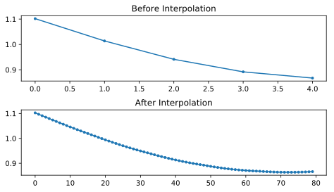
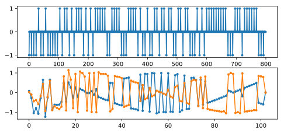
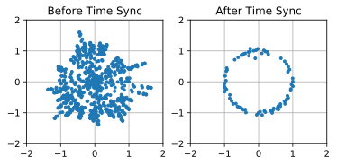
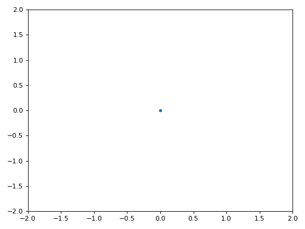
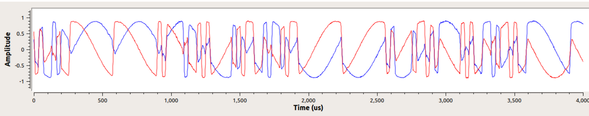
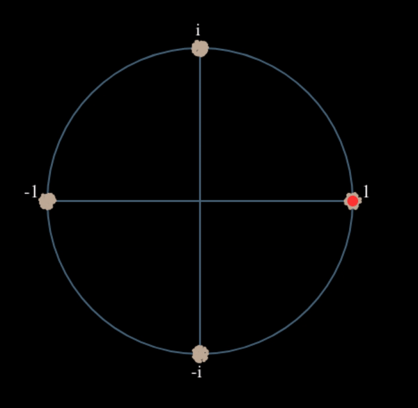
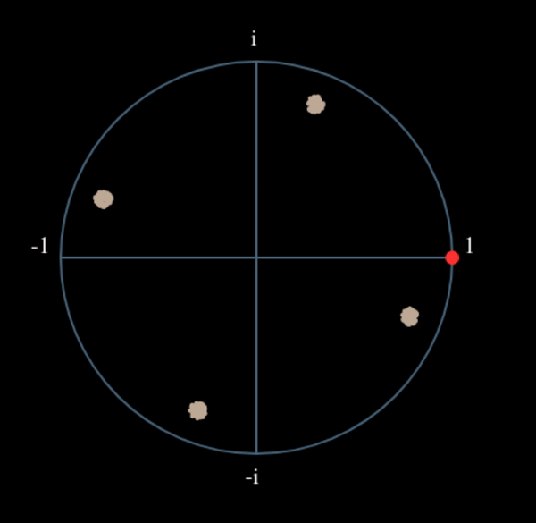

.. _sync-chapter:

################
Synchronisation
################

Ce chapitre traite de la synchronisation des signaux sans fil en temps et en fréquence, afin de corriger les décalages de la fréquence porteuse et d'effectuer un alignement temporel au niveau des symboles et des trames.  Nous utiliserons la technique de récupération d'horloge de Mueller et Muller, ainsi que la boucle de Costas, en Python. 

***************************
Introduction
***************************

Nous avons vu comment transmettre numériquement par voie hertzienne, en utilisant un schéma de modulation numérique comme la QPSK et en appliquant une mise en forme des impulsions pour limiter la largeur de bande du signal.  Le codage de canal peut être utilisé pour traiter les canaux bruyants, par exemple lorsque le rapport signal/bruit est faible au niveau du récepteur.  Il est toujours utile de filtrer autant que possible le signal avant de le traiter numériquement.  Dans ce chapitre, nous allons étudier la manière dont la synchronisation est effectuée du côté de la réception.  La synchronisation est un ensemble de traitements qui se produisent *avant* la démodulation et le décodage du canal.  La chaîne globale tx-canal-rx est représentée ci-dessous, avec les blocs abordés dans ce chapitre surlignés en jaune.  (Ce diagramme n'est pas exhaustif : la plupart des systèmes incluent également l'égalisation et le multiplexage).

.. image:: ../_images/sync-diagram.svg
   :align: center 
   :target: ../_images/sync-diagram.svg

*********************************
Simulation d'un canal sans fil
*********************************

Avant d'apprendre à mettre en œuvre la synchronisation temporelle et fréquentielle, nous devons rendre nos signaux simulés plus réalistes.  Sans l'ajout d'un retard aléatoire, la synchronisation dans le temps est triviale.  En fait, il suffit de prendre en compte le retard d'échantillonnage de tous les filtres que vous utilisez.  Nous voulons également simuler un décalage de fréquence car, comme nous le verrons, les oscillateurs ne sont pas parfaits; il y aura toujours un certain décalage entre la fréquence centrale de l'émetteur et celle du récepteur.

Examinons maintenant le code Python permettant de simuler un retard non entier et un décalage de fréquence. Le code Python de ce chapitre part du code que nous avons écrit lors de l'exercice Python de mise en forme des impulsions (cliquez ci-dessous si vous en avez besoin); vous pouvez le considérer comme le point de départ du code de ce chapitre, et le nouveau code viendra ensuite.

.. raw:: html

   

   
Code Python de la mise en forme des impulsions

.. code-block:: python

    import numpy as np
    import matplotlib.pyplot as plt
    from scipy import signal
    import math

    # cette partie provient de l'exercice des impulsions de mise en forme
    num_symbols = 100
    sps = 8
    bits = np.random.randint(0, 2, num_symbols) # Nos données à transmettre: des 1 et des 0.
    pulse_train = np.array([])
    for bit in bits:
        pulse = np.zeros(sps)
        pulse[0] = bit*2-1 # définir la première valeur à 1 ou -1
        pulse_train = np.concatenate((pulse_train, pulse)) # ajouter les 8 échantillons au signal

    # Créer notre filtre à base de cosinus surélevé
    num_taps = 101
    beta = 0.35
    Ts = sps # Supposons que la fréquence d'échantillonnage est de 1Hz, donc la période d'échantillonnage est de 1, donc la période du *symbole* est de 8.
    t = np.arange(-51, 52) # n'oubliez pas que le nombre final n'est pas inclus
    h = np.sinc(t/Ts) * np.cos(np.pi*beta*t/Ts) / (1 - (2*beta*t/Ts)**2)

    # Filtrer notre signal, afin d'appliquer l'impulsion de mise en forme
    samples = np.convolve(pulse_train, h)

.. raw:: html

   

Nous laisserons de côté le code relatif au tracé car vous avez probablement déjà appris à tracer n'importe quel signal. Pour que les tracés soient jolis, comme c'est souvent le cas dans ce manuel, il faut beaucoup de code supplémentaire qu'il n'est pas nécessaire de comprendre.

Ajouter un délai
#################

Nous pouvons facilement simuler un retard en décalant les échantillons, mais cela ne simule qu'un retard qui est un multiple entier de notre période d'échantillonnage.  Dans le monde réel, le retard sera une fraction de la période d'échantillonnage.  Nous pouvons simuler le retard d'une fraction d'échantillon en créant un filtre à "retard fractionnel", qui laisse passer toutes les fréquences mais retarde les échantillons d'une certaine quantité qui n'est pas limitée à l'intervalle d'échantillonnage.  Vous pouvez l'imaginer comme un filtre passe-tout qui applique le même déphasage à toutes les fréquences.  (Rappelez-vous qu'un retard temporel et un déphasage sont équivalents.) Le code Python permettant de créer ce filtre est présenté ci-dessous:

.. code-block:: python

    # Créer et appliquer un filtre à retard fractionnel
    delay = 0.4 # délai fractionné, en échantillons
    N = 21 # nombre de taps
    n = np.arange(-N//2, N//2) # ...-3,-2,-1,0,1,2,3...
    h = np.sinc(n - delay) # calcul des taps du filtre
    h *= np.hamming(N) # fenêtre du filtre pour s'assurer qu'il décroit vers 0 des deux côtés
    h /= np.sum(h) # normaliser pour obtenir un gain unitaire, nous ne voulons pas changer l'amplitude/puissance
    samples = np.convolve(samples, h) # appliquer le filtre
    
Comme vous pouvez le voir, nous calculons les prises du filtre à l'aide d'une fonction sinc().  Une fonction sinc dans le domaine temporel est un rectangle dans le domaine fréquentiel, et notre rectangle pour ce filtre couvre toute la gamme de fréquences de notre signal.  Ce filtre ne remodèle pas le signal, il le retarde simplement dans le temps.  Dans notre exemple, nous retardons de 0.4 échantillon.  N'oubliez pas que l'application de *n'importe quel* filtre retarde un signal de la moitié des taps du filtre moins un, en raison de la convolution du signal à travers le filtre.

Si nous traçons le graphique "avant" et "après" le filtrage d'un signal, nous pouvons observer le retard fractionnel.  Dans notre graphique, nous ne zoomons que sur quelques symboles.  Sinon, le retard fractionnel n'est pas visible.

.. image:: ../_images/fractional-delay-filter.svg
   :align: center
   :target: ../_images/fractional-delay-filter.svg

Ajout d'un décalage de fréquence
################################

Pour rendre notre signal simulé plus réaliste, nous allons appliquer un décalage de fréquence.  Disons que notre fréquence d'échantillonnage dans cette simulation est de 1 MHz (la valeur n'a pas vraiment d'importance, mais vous verrez pourquoi il est plus facile de choisir un nombre).  Si nous voulons simuler un décalage de fréquence de 13 kHz (un nombre arbitraire), nous pouvons le faire via le code suivant:

.. code-block:: python

    # appliquer un décalage de fréquence
    fs = 1e6 # supposons que notre fréquence d'échantillonnage est de 1 MHz
    fo = 13000 # simuler le décalage de la fréquence
    Ts = 1/fs # période d'échantillonnage
    t = np.arange(0, Ts*len(samples), Ts) # créer un vecteur temps
    samples = samples * np.exp(1j*2*np.pi*fo*t) # effectuer un décalage de fréquence
 
La figure ci-dessous montre le signal avant et après l'application du décalage de fréquence.
 
.. image:: ../_images/sync-freq-offset.svg
   :align: center
   :target: ../_images/sync-freq-offset.svg

Nous n'avons pas représenté graphiquement la partie Q puisque nous transmettions en BPSK, ce qui fait que la partie Q est toujours nulle.  Maintenant que nous ajoutons un décalage de fréquence pour simuler les canaux sans fil, l'énergie s'étend sur I et Q. À partir de maintenant, nous devrions tracer à la fois I et Q. N'hésitez pas à substituer un décalage de fréquence différent pour votre code.  Si vous abaissez le décalage à environ 1 kHz, vous serez en mesure de voir la sinusoïde dans l'enveloppe du signal car elle oscille suffisamment lentement pour couvrir plusieurs symboles.

En ce qui concerne le choix d'une fréquence d'échantillonnage arbitraire, si vous examinez le code, vous remarquerez que ce qui importe est le rapport entre :code:`fo` et :code:`fs`.

Vous pouvez prétendre que les deux blocs de code présentés précédemment simulent un canal sans fil.  Le code devrait venir après le code côté émission (ce que nous avons fait dans le chapitre sur les impulsions de mise en forme) et avant le code côté réception, qui est ce que nous allons explorer dans le reste de ce chapitre.

***************************
Synchronisation du temps
***************************

Lorsque nous transmettons un signal sans fil, il arrive au récepteur avec un déphasage aléatoire dû au temps parcouru.  Nous ne pouvons pas simplement commencer à échantillonner les symboles à notre débit de symboles car il est peu probable que nous l'échantillonnions au bon endroit dans l'impulsion, comme nous l'avons vu à la fin du chapitre :ref:`pulse-shaping-chapter`.  Revoyez les trois figures à la fin de ce chapitre si vous ne suivez pas.

La plupart des techniques de synchronisation prennent la forme d'une boucle à verrouillage de phase (ou PLL en anglais pour *phase locked loop*). Nous n'étudierons pas les PLL ici, mais il est important de connaître ce terme et vous pouvez vous documenter sur le sujet si vous êtes intéressé.  Les PLL sont des systèmes en boucle fermée qui utilisent la rétroaction pour ajuster continuellement un paramètre; dans notre cas, un décalage temporel nous permet d'échantillonner au pic des symboles numériques.

Vous pouvez vous représenter la récupération du temps comme un bloc dans le récepteur, qui accepte un flux d'échantillons et sort un autre flux d'échantillons (similaire à un filtre).  Nous programmons ce bloc de récupération du temps avec des informations sur notre signal, la plus importante étant le nombre d'échantillons par symbole (ou notre meilleure estimation de celui-ci, si nous ne sommes pas sûrs à 100 % de ce qui a été transmis).  Ce bloc agit comme un "décimateur", c'est-à-dire que notre échantillon de sortie sera une fraction du nombre d'échantillons d'entrée.  Nous voulons un échantillon par symbole numérique, donc le taux de décimation est simplement les échantillons par symbole.  Si l'émetteur transmet à 1M symboles par seconde et que nous échantillonnons à 16 Msps, nous recevrons 16 échantillons par symbole.  Ce sera le taux d'échantillonnage entrant dans le bloc de synchronisation.  Le taux d'échantillonnage sortant du bloc sera de 1 Msps car nous voulons un échantillon par symbole numérique.

La plupart des méthodes de récupération du temps reposent sur le fait que nos symboles numériques montent puis descendent, et que la crête est le point auquel nous voulons échantillonner le symbole. En d'autres termes, nous échantillonnons le point maximum après avoir pris la valeur absolue :

.. image:: ../_images/symbol_sync2.png
   :scale: 40 % 
   :align: center 

Il existe de nombreuses méthodes de récupération du temps, la plupart ressemblant à une PLL. La différence entre elles réside généralement dans l'équation utilisée pour effectuer la "correction" du décalage temporel, que nous désignons par :math:`\mu` ou :code:`mu` dans le code.  La valeur de :code:`mu` est mise à jour à chaque itération de la boucle.  Elle est exprimée en unités d'échantillons, et vous pouvez l'imaginer comme le décalage que nous devons faire pour pouvoir échantillonner au moment "parfait".  Ainsi, si :code:`mu = 3.61`, cela signifie que nous devons décaler l'entrée de 3.61 échantillons pour échantillonner au bon endroit.  Comme nous avons 8 échantillons par symbole, si :code:`mu` dépasse 8, il revient simplement à zéro.

Le code Python suivant implémente la technique de récupération d'horloge de Mueller et Muller.

.. code-block:: python

    mu = 0 # estimation initiale de la phase de l'échantillon
    out = np.zeros(len(samples) + 10, dtype=np.complex)
    out_rail = np.zeros(len(samples) + 10, dtype=np.complex) # stocke les valeurs, à chaque itération nous avons besoin des 2 valeurs précédentes plus la valeur actuelle.
    i_in = 0 # index des échantillons d'entrée
    i_out = 2 # indice de sortie (les deux premières sorties sont 0)
    while i_out < len(samples) and i_in+16 < len(samples):
        out[i_out] = samples[i_in + int(mu)] # prendre ce que nous pensons être le "meilleur" échantillon.
        out_rail[i_out] = int(np.real(out[i_out]) > 0) + 1j*int(np.imag(out[i_out]) > 0)
        x = (out_rail[i_out] - out_rail[i_out-2]) * np.conj(out[i_out-1])
        y = (out[i_out] - out[i_out-2]) * np.conj(out_rail[i_out-1])
        mm_val = np.real(y - x)
        mu += sps + 0.3*mm_val
        i_in += int(np.floor(mu)) # arrondir à l'entier le plus proche puisque nous l'utilisons comme un index
        mu = mu - np.floor(mu) # supprimer la partie entière de mu
        i_out += 1 # incrémenter l'indice de sortie
    out = out[2:i_out] # supprimer les deux premiers, et tout ce qui suit i_out (qui n'a jamais été rempli)
    samples = out # n'incluez cette ligne que si vous voulez connecter cet extrait de code avec la boucle Costas plus tard

Le bloc de récupération du timing reçoit les échantillons "reçus" et produit un échantillon de sortie un par un (notez que :code:`i_out` est incrémenté de 1 à chaque itération de la boucle).  Le bloc de récupération n'utilise pas seulement les échantillons "reçus" l'un après l'autre à cause de la façon dont la boucle ajuste :code:`i_in`.  Elle sautera quelques échantillons pour essayer de tirer le "bon" échantillon, qui serait celui au pic de l'impulsion.  Au fur et à mesure que la boucle traite les échantillons, elle se synchronise lentement sur le symbole, ou du moins elle tente de le faire en ajustant :code:`mu`.  Étant donné la structure du code, la partie entière de :code:`mu` est ajoutée à :code:`i_in`, puis retirée de :code:`mu` (gardez à l'esprit que :code:`mm_val` peut être négatif ou positif à chaque boucle).  Une fois qu'elle est complètement synchronisée, la boucle ne devrait tirer que l'échantillon central de chaque symbole/impulsion.  Vous pouvez ajuster la constante 0.3, qui modifiera la vitesse de réaction de la boucle de rétroaction; une valeur plus élevée la fera réagir plus rapidement, mais avec un risque plus élevé de problèmes de stabilité.

Le graphique suivant montre un exemple de sortie où nous avons *désactivé* le délai fractionnel ainsi que le décalage de fréquence.  Nous montrons seulement I parce que Q est tout à fait nul avec le décalage de fréquence désactivé.  Les trois graphiques sont empilés les uns sur les autres pour montrer comment les bits sont alignés verticalement.

**Graphique du haut**
    Symboles BPSK originaux, c'est-à-dire des 1 et des -1.  Rappelez-vous qu'il y a des zéros entre les deux car nous voulons 8 échantillons par symbole.
**Graphique du milieu**
    Echantillons après l'impulsion de mise en forme mais avant le synchronisation.
**Graphique du bas**
    Sortie de la synchronisation de symboles, qui fournit seulement 1 échantillon par symbole.  Cela signifie que ces échantillons peuvent être introduits directement dans un démodulateur, qui, pour la BPSK, vérifie si la valeur est supérieure ou inférieure à 0.

.. image:: ../_images/time-sync-output.svg
   :align: center
   :target: ../_images/time-sync-output.svg

Concentrons-nous sur le graphique du bas, qui est la sortie de la synchronisation.  Il a fallu près de 30 symboles pour que la synchronisation se verrouille sur le bon délai.  En raison inévitablement du temps nécessaire aux synchroniseurs pour se verrouiller, de nombreux protocoles de communication utilisent un préambule contenant une séquence de synchronisation: il sert à annoncer l'arrivée d'un nouveau paquet et donne au récepteur le temps de se synchroniser sur celui-ci.  Mais après ces ~30 échantillons, la synchronisation fonctionne parfaitement.  Nous nous retrouvons avec des 1 et des -1 parfaits qui correspondent aux données d'entrée.  Il est utile que cet exemple n'ait pas eu de bruit ajouté.  N'hésitez pas à ajouter du bruit ou des décalages temporels et voyez comment la synchronisation se comporte.  Si nous utilisions la QPSK, nous aurions affaire à des nombres complexes, mais l'approche serait la même.

**********************************************
Synchronisation du temps avec interpolation
**********************************************

Les synchroniseurs de symboles ont tendance à interpoler les échantillons d'entrée par un certain nombre, par exemple 16, afin de pouvoir se décaler d'une *fraction* d'échantillon.  Le retard aléatoire causé par le canal sans fil ne sera probablement pas un multiple exact d'un échantillon, de sorte que le pic du symbole peut ne pas se produire réellement sur un échantillon.  C'est particulièrement vrai dans le cas où il n'y aurait que 2 ou 4 échantillons par symbole reçu.  L'interpolation des échantillons nous permet d'échantillonner "entre" les échantillons réels, afin d'atteindre le pic de chaque symbole.  La sortie du synchroniseur n'est toujours qu'un échantillon par symbole. Les échantillons d'entrée sont eux-mêmes interpolés.

Le code Python de synchronisation temporelle que nous avons implémenté ci-dessus n'incluait pas d'interpolation.  Pour étendre notre code, activez le retard temporel fractionnaire que nous avons implémenté au début de ce chapitre afin que notre signal reçu ait un retard plus réaliste.  Laissez le décalage de fréquence désactivé pour le moment.  Si vous relancez la simulation, vous constaterez que la synchronisation ne parvient pas à se synchroniser complètement sur le signal.  C'est parce que nous n'interpolons pas, et que le code n'a aucun moyen "d'échantillonner entre les échantillons" pour compenser le retard fractionnel.  Ajoutons l'interpolation.

Un moyen rapide d'interpoler un signal en Python est d'utiliser :code:`signal.resample` ou :code:`signal.resample_poly` de scipy.  Ces deux fonctions font la même chose mais fonctionnent différemment.  Nous utiliserons la dernière fonction car elle a tendance à être plus rapide.  Interpolons par 16, c'est-à-dire que nous allons insérer 15 échantillons supplémentaires entre chaque échantillon.  Cela peut être fait en une ligne de code, et cela devrait se faire *avant* d'effectuer la synchronisation temporelle (avant le gros extrait de code ci-dessus).  Nous allons également tracer le graphique avant et après pour voir la différence:

.. code-block:: python

 samples_interpolated = signal.resample_poly(samples, 16, 1)
 
 # Tracez l'ancien et le nouveau
 plt.figure('avant interp')
 plt.plot(samples,'.-')
 plt.figure('après interp')
 plt.plot(samples_interpolated,'.-')
 plt.show()

Si on zoome *beaucoup*, on voit que c'est le même signal, mais avec 16x plus de points :

J'espère que la raison pour laquelle nous devons interpoler à l'intérieur du bloc de synchronisation temporelle devient claire.  Ces échantillons supplémentaires nous permettront de prendre en compte une fraction d'un échantillon de retard.  En plus de calculer :code:`samples_interpolated`, nous devons également modifier une ligne de code dans notre synchronisation temporelle.  Nous allons changer la première ligne à l'intérieur de la boucle *while* pour devenir:

.. code-block:: python

 out[i_out] = samples_interpolated[i_in*16 + int(mu*16)]

Nous avons fait plusieurs choses ici.  D'abord, nous ne pouvons plus utiliser :code:`i_in` comme index de l'échantillon d'entrée.  Nous devons le multiplier par 16 car nous avons interpolé nos échantillons d'entrée par 16.  Rappelez-vous que la boucle de rétroaction ajuste la variable :code:`mu`.  Elle représente le délai qui nous permet d'échantillonner au bon moment.  Rappelez-vous également qu'après avoir calculé la nouvelle valeur de :code:`mu`, nous avons ajouté la partie entière à :code:`i_in`.  Maintenant, nous allons utiliser la partie restante, qui est un flottant de 0 à 1, et qui représente la fraction d'échantillon que nous devons retarder.  Avant, nous n'étions pas capables de retarder d'une fraction d'échantillon, mais maintenant nous le pouvons, au moins par incréments de 16ème d'échantillon.  Il faut donc multiplier :code:`mu` par 16 pour savoir de combien d'échantillons de notre signal interpolé nous devons retarder.  Ensuite, nous devons arrondir ce nombre, car la valeur entre parenthèses est finalement un index et doit être un nombre entier.  Si ce paragraphe n'a pas eu de sens, essayez de revenir au code initial de récupération d'horloge de Mueller et Muller, et lisez également les commentaires à côté de chaque ligne de code.

Le résultat du tracé de ce nouveau code devrait être à peu près le même que précédemment.  Tout ce que nous avons fait, c'est rendre notre simulation plus réaliste en ajoutant un retard d'échantillon fractionnaire, puis nous avons ajouté l'interpolateur à la synchronisation afin de compenser ce retard d'échantillon fractionnaire.

N'hésitez pas à jouer avec différents facteurs d'interpolation, c'est-à-dire à remplacer tous les 16 par une autre valeur.  Vous pouvez également essayer d'activer le décalage de fréquence, ou d'ajouter un bruit blanc gaussien au signal avant qu'il ne soit reçu, pour voir comment cela affecte les performances de synchronisation (indice : vous devrez peut-être ajuster le multiplicateur de 0.3).

Si nous activons uniquement le décalage de fréquence en utilisant une fréquence de 1kHz, nous obtenons les performances de synchronisation suivantes.  Nous devons montrer à la fois I et Q maintenant que nous avons ajouté un décalage de fréquence :

C'est peut-être difficile à voir, mais la synchronisation du temps fonctionne toujours très bien.  Il faut environ 20 à 30 symboles avant qu'elle ne soit verrouillée.  Cependant, il y a un motif sinusoïdal parce que nous avons encore un décalage de fréquence, et nous allons apprendre à le gérer dans la section suivante.

La figure ci-dessous montre le graphique IQ (aussi appelé constellation) du signal avant et après la synchronisation.  Rappelez-vous que vous pouvez tracer des échantillons sur un graphique IQ en utilisant un nuage de points : :code:`plt.plot(np.real(samples), np.imag(samples), '.')`.  Dans l'animation ci-dessous, nous avons spécifiquement laissé de côté les 30 premiers symboles.  Ils sont apparus avant la fin de la synchronisation temporelle.  Les symboles restants sont tous approximativement sur le cercle des unités en raison du décalage de fréquence.

    
Pour en savoir encore plus, nous pouvons observer la constellation dans le temps afin de discerner ce qui arrive réellement aux symboles.  Au tout début, pendant une courte période de temps, les symboles ne sont pas à 0 ou sur le cercle unitaire.  C'est la période pendant laquelle la synchronisation temporelle trouve le bon délai.  C'est très rapide, regardez bien! La rotation est juste le décalage de fréquence.  La fréquence est un changement constant de la phase, donc un décalage de fréquence provoque une rotation de la BPSK (créant un cercle dans le tracé statique/persistant ci-dessus).

Nous espérons qu'en voyant un exemple de synchronisation temporelle, vous avez une idée de ce qu'elle fait et une idée générale de son fonctionnement.  En pratique, la boucle while que nous avons créée ne fonctionnerait que sur un petit nombre d'échantillons à la fois (par exemple, 1000).  Vous devez vous souvenir de la valeur de :code:`mu` entre les appels à la fonction sync, ainsi que des deux dernières valeurs de :code:`out` et :code:`out_rail`.

Ensuite, nous allons étudier la synchronisation de la fréquence, que nous divisons en synchro de fréquence grossière et fine.  La synchronisation grossière vient généralement avant la synchronisation temporelle, tandis que la synchronisation fine vient après.

**********************************************
Synchronisation grossière des fréquences
**********************************************

Même si nous demandons à l'émetteur et au récepteur de fonctionner sur la même fréquence centrale, il y aura un léger décalage de fréquence entre les deux en raison d'imperfections matérielles (par exemple, l'oscillateur) ou d'un décalage Doppler dû au mouvement.  Ce décalage de fréquence sera minuscule par rapport à la fréquence porteuse, mais même un petit décalage peut perturber un signal numérique.  Le décalage évoluera probablement dans le temps, ce qui nécessite une boucle de rétroaction permanente pour corriger le décalage.  Par exemple, l'oscillateur à l'intérieur du Pluto a une spécification de décalage maximale de 25 PPM.  C'est-à-dire 25 parties par million par rapport à la fréquence centrale.  Si vous êtes réglé sur 2.4 GHz, le décalage maximal serait de +/- 60 kHz.  Les échantillons que notre SDR nous fournit sont en bande de base, ce qui fait que tout décalage de fréquence se manifeste dans ce signal en bande de base.  Un signal BPSK avec un petit décalage de la porteuse ressemblera au tracé temporel ci-dessous, ce qui n'est évidemment pas idéal pour démoduler des bits.  Nous devons supprimer tout décalage de fréquence avant la démodulation.

La synchronisation de fréquence est généralement décomposée en synchronisation grossière et synchronisation fine, où la synchronisation grossière corrige les grands décalages de l'ordre du kHz ou plus, tandis que la synchronisation fine corrige ce qui reste.  La synchronisation grossière intervient avant la synchronisation temporelle, tandis que la synchronisation fine intervient après.

Mathématiquement, si nous disposons d'un signal en bande de base :math:`s(t)` et qu'il subit un décalage de fréquence (aussi appelé porteuse) de :math:`f_o` Hz, nous pouvons représenter ce qui est reçu comme suit:

.. math::

 r(t) = s(t) e^{j2\pi f_o t} + n(t)

où :math:`n(t)` est le bruit.  

La première astuce que nous allons apprendre, afin d'effectuer une estimation grossière du décalage de fréquence (si nous pouvons estimer la fréquence de décalage, alors nous pouvons la compenser), est de prendre le carré de notre signal.  Ignorons le bruit pour l'instant, afin de garder les mathématiques plus simples :

.. math::

 r^2(t) = s^2(t) e^{j4\pi f_o t}

Voyons ce qui se passe lorsque nous prenons le carré de notre signal :math:`s(t)` en considérant ce que ferait la QPSK.  L'élévation au carré de nombres complexes donne lieu à un comportement intéressant, surtout lorsqu'il s'agit de constellations comme la BPSK et la QPSK.  L'animation suivante montre ce qui se passe lorsqu'on élève au carré une QPSK, puis si on l'élève encore une deuxième fois.  J'ai utilisé spécifiquement la QPSK au lieu de la BPSK parce que vous pouvez voir que lorsque vous érigez la QPSK une fois, vous obtenez essentiellement la BPSK.  Et après un autre carré, on obtient un cluster.  (Merci à http://ventrella.com/ComplexSquaring/ qui a créé cette belle application web).

 
Voyons ce qui se passe lorsqu'on applique à notre signal QPSK une petite rotation de phase et une mise à l'échelle de l'amplitude, ce qui est plus réaliste :
 

Il s'agit toujours d'un seul groupe, mais avec un déphasage.  Ce qu'il faut retenir, c'est que si vous mettez la QPSK au carré deux fois (et la BPSK une fois), les quatre groupes de points seront fusionnés en un seul groupe.  Pourquoi cela est-il utile?  En fusionnant les groupes, nous supprimons essentiellement la modulation!  Si tous les points sont maintenant dans le même groupe, c'est comme si on avait un tas de constantes dans une rangée.  C'est comme s'il n'y avait plus de modulation, et que la seule chose qui restait était la sinusoïde causée par le décalage de fréquence (nous avons aussi du bruit, mais ignorons-le pour l'instant).  Il s'avère que vous devez élever le signal au carré N fois, où N est l'ordre du schéma de modulation utilisé, ce qui signifie que cette astuce ne fonctionne que si vous connaissez le schéma de modulation à l'avance.  L'équation est en fait la suivante :

.. math::

 r^N(t) = s^N(t) e^{j2N\pi f_o t}

Pour notre cas de BPSK, nous avons un schéma de modulation d'ordre 2, nous utiliserons donc l'équation suivante pour notre synchronisation grossière de la fréquence:

.. math::

 r^2(t) = s^2(t) e^{j4\pi f_o t}

Nous avons découvert ce qui arrive à la partie :math:`s(t)` de l'équation, mais qu'en est-il de la partie sinusoïde (alias exponentielle complexe)?  Comme on peut le voir, on ajoute le terme :math:`N`, ce qui la rend équivalente à une sinusoïde à une fréquence de :math:`Nf_o` au lieu de :math:`f_o`.  Une méthode simple pour déterminer :math:`nf_o` est de prendre la FFT du signal après l'avoir élevé au carré N fois et de voir où le pic se produit.  Faisons une simulation en Python.  Nous allons retourner à la génération de notre signal BPSK, et au lieu de lui appliquer un retard fractionnel, nous allons appliquer un décalage de fréquence en multipliant le signal par :math:`e^{j2\pi f_o t}` comme nous l'avons fait dans le chapitre :ref:`filters-chapter` pour convertir un filtre passe-bas en un filtre passe-haut.

En utilisant le code du début de ce chapitre, appliquez un décalage de fréquence de +13 kHz à votre signal numérique.  Cela peut se produire juste avant ou juste après l'ajout du retard fractionné; cela n'a pas d'importance. Quoi qu'il en soit, cela doit se faire *après* l'impulsion de mise en forme, mais avant d'effectuer toute fonction côté réception, comme la synchronisation temporelle.

Maintenant que nous avons un signal avec un décalage de fréquence de 13kHz, traçons la FFT avant et après la mise au carré, pour voir ce qui se passe. Vous devriez maintenant savoir comment effectuer une FFT, y compris les opérations abs() et fftshift(). Pour cet exercice, peu importe que vous preniez ou non le logarithme ou que vous éleviez au carré le signal après avoir effectué l'opération abs().

Regardez d'abord le signal avant de l'élever au carré (juste une FFT normale):

.. code-block:: python

    psd = np.fft.fftshift(np.abs(np.fft.fft(samples)))
    f = np.linspace(-fs/2.0, fs/2.0, len(psd))
    plt.plot(f, psd)
    plt.show()

.. image:: ../_images/coarse-freq-sync-before.svg
   :align: center
   :target: ../_images/coarse-freq-sync-before.svg
   
On ne voit pas vraiment de pic associé au décalage de la porteuse.  Il est couvert par notre signal.

Maintenant avec l'élévation au carré ajoutée (juste une puissance de 2 parce que c'est une BPSK) :

.. code-block:: python

    # Ajoutez ceci avant la ligne FFT
    samples = samples**2

Il faut zoomer pour voir sur quelle fréquence se trouve le pic :

.. image:: ../_images/coarse-freq-sync.svg
   :align: center
   :target: ../_images/coarse-freq-sync.svg

Vous pouvez essayer d'augmenter le nombre de symboles simulés (par exemple, 1000 symboles) afin d'avoir suffisamment d'échantillons pour travailler.  Plus il y a d'échantillons dans notre FFT, plus notre estimation du décalage de fréquence sera précise.  Pour rappel, le code ci-dessus doit venir *avant* la synchornisation de temps.

Le pic de fréquence apparaît à :math:`Nf_o`.  Nous devons diviser cette valeur (26.6kHz) par 2 pour trouver notre réponse finale, qui est très proche du décalage de fréquence de 13kHz que nous avons appliqué au début du chapitre!  Si vous avez joué avec ce nombre et qu'il n'est plus de 13kHz, ce n'est pas grave.  Assurez-vous simplement que vous êtes conscient de ce que vous avez réglé.

Comme notre fréquence d'échantillonnage est de 1 MHz, les fréquences maximales que nous pouvons voir sont de -500kHz à 500kHz.  Si nous portons notre signal à la puissance N, cela signifie que nous ne pouvons "voir" les décalages de fréquence que jusqu'à :math:`500e3/N`, ou dans le cas de la BPSK +/- 250kHz.  Si nous recevions un signal QPSK, il ne serait que de +/- 125kHz, et un décalage de la porteuse supérieur ou inférieur à cette valeur serait hors de notre portée avec cette technique.  Pour vous donner une idée du décalage Doppler, si vous transmettez dans la bande des 2.4GHz et que l'émetteur ou le récepteur se déplace à 96km/h (c'est la vitesse relative qui compte), cela entraînera un décalage de fréquence de 214Hz.  Le décalage dû à un oscillateur de mauvaise qualité sera probablement le principal coupable dans cette situation.

En fait, la correction de ce décalage de fréquence se fait exactement comme nous avons simulé le décalage en premier lieu: en multipliant par une exponentielle complexe, mais avec un signe négatif puisque nous voulons supprimer le décalage.

.. code-block:: python

    max_freq = f[np.argmax(psd)]
    Ts = 1/fs # période d'échantillonnage
    t = np.arange(0, Ts*len(samples), Ts) # vecteur de temps
    samples = samples * np.exp(-1j*2*np.pi*max_freq*t/2.0)

C'est à vous de décider si vous voulez le corriger ou modifier le décalage de fréquence initial que nous avons appliqué au début à un nombre plus petit (comme 500Hz) pour tester la synchronisation de fréquence fine que nous allons maintenant apprendre à faire.

****************************************
Synchronisation fine de la fréquence
****************************************

Ensuite, nous allons passer à la synchronisation fine de la fréquence. L'astuce précédente est plutôt destinée à l'évanouissement grossier, et ce n'est pas une opération en boucle fermée (de type feedback).  Mais pour la synchronisation fine de la fréquence, nous aurons besoin d'une boucle de rétroaction par laquelle nous ferons passer des échantillons, ce qui sera une fois de plus une forme de PLL.  Notre objectif est de ramener le décalage de fréquence à zéro et de l'y maintenir, même si le décalage change au fil du temps.  Nous devons continuellement suivre le décalage.  Les techniques de synchronisation fine de la fréquence fonctionnent mieux avec un signal qui a déjà été synchronisé dans le temps au niveau du symbole, donc le code dont nous parlons dans cette section viendra *après* la synchronisation temporelle.

Nous allons utiliser une technique appelée boucle de Costas.  Il s'agit d'une forme de PLL spécialement conçue pour la correction du décalage de la fréquence de la porteuse pour les signaux numériques tels que BPSK et QPSK.  Elle a été inventée par John P. Costas chez General Electric dans les années 1950 et a eu un impact majeur sur les communications numériques modernes.  La boucle de Costas supprime le décalage de fréquence tout en fixant le décalage de phase.  L'énergie est alignée avec l'axe I.  La fréquence n'est qu'un changement de phase, ils peuvent donc être suivis comme un tout.  La boucle de Costas est résumée à l'aide du diagramme suivant (notez que les 1/2 ont été laissés de côté dans les équations car ils n'ont pas d'importance fonctionnelle).

.. image:: ../_images/costas-loop.svg
   :align: center 
   :target: ../_images/costas-loop.svg

L'oscillateur commandé en tension (ou VCO en anglais pour *voltage controlled oscillator*) est simplement un générateur d'ondes sin/cos qui utilise une fréquence basée sur l'entrée.  Dans notre cas, puisque nous simulons un canal sans fil, il ne s'agit pas d'une tension, mais plutôt d'un niveau représenté par une variable.  Elle détermine la fréquence et la phase des ondes sinus et cosinus générées.  Ce qu'il fait, c'est multiplier le signal reçu par une sinusoïde générée en interne, afin de tenter d'annuler le décalage de fréquence et de phase.  Ce comportement est similaire à celui d'une SDR qui effectue une conversion de fréquence et crée les branches I et Q.

Voici le code Python qui constitue notre boucle Costas:

.. code-block:: python

    N = len(samples)
    phase = 0
    freq = 0
    # Ces deux paramètres suivants sont ce qu'il faut ajuster, pour rendre la boucle de rétroaction plus rapide ou plus lente (ce qui a un impact sur la stabilité).
    alpha = 0.132
    beta = 0.00932
    out = np.zeros(N, dtype=np.complex)
    freq_log = []
    for i in range(N):
        out[i] = samples[i] * np.exp(-1j*phase) # ajuster l'échantillon d'entrée par l'inverse du décalage de phase estimé
        error = np.real(out[i]) * np.imag(out[i]) # Voici la formule d'erreur pour une boucle de Costas de 2ème ordre (par exemple pour BPSK)
        
        # Avancer la boucle (recalculer la phase et le décalage de fréquence)
        freq += (beta * error)
        freq_log.append(freq * fs / (2*np.pi)) # convertir de la vitesse angulaire en Hz pour la journalisation
        phase += freq + (alpha * error)
        
        # Facultatif: Ajustez la phase de façon à ce qu'elle soit toujours entre 0 et 2pi, rappelez-vous que la phase s'enroule autour de chaque 2pi
        while phase >= 2*np.pi:
            phase -= 2*np.pi
        while phase < 0:
            phase += 2*np.pi

    # Tracez la fréquence en fonction du temps pour voir combien de temps il faut pour atteindre le bon décalage.
    plt.plot(freq_log,'.-')
    plt.show()

Il y a beaucoup de choses ici, alors passons-les en revue.  Certaines lignes sont simples et d'autres sont super compliquées. :code:`samples` est notre entrée, et :code:`out` les échantillons de sortie. :code:`phase` et :code:`frequency` sont comme le :code:`mu` du code de synchronisation temporelle.  Ils contiennent les estimations du décalage actuel, et à chaque itération de la boucle, nous créons les échantillons de sortie en multipliant les échantillons d'entrée par :code:`np.exp(-1j*phase)`.  La variable :code:`error` contient la métrique d'erreur, et pour une boucle de Costas d'ordre 2, c'est une équation très simple.  Nous multiplions la partie réelle de l'échantillon (I) par la partie imaginaire (Q), et parce que Q devrait être égal à zéro pour la BPSK, la fonction d'erreur est minimisée lorsqu'il n'y a pas de décalage de phase ou de fréquence qui fait passer l'énergie de I à Q. Pour une boucle de Costas d'ordre 4, c'est encore relativement simple mais pas tout à fait une ligne, car I et Q auront de l'énergie même lorsqu'il n'y a pas de décalage de phase ou de fréquence, pour la QPSK.  Si vous êtes curieux de voir à quoi cela ressemble, cliquez ci-dessous, mais nous ne l'utiliserons pas dans notre code pour le moment.  La raison pour laquelle cela fonctionne pour la QPSK est que lorsque vous prenez la valeur absolue de I et Q, vous obtenez +1+1j, et s'il n'y a pas de décalage de phase ou de fréquence, la différence entre la valeur absolue de I et Q devrait être proche de zéro.

.. raw:: html

   

   
Équation d'erreur de la boucle de Costas de l'ordre 4 (pour les curieux)

.. code-block:: python

    # For QPSK
    def phase_detector_4(sample):
        if sample.real > 0:
            a = 1.0
        else:
            a = -1.0
        if sample.imag > 0:
            b = 1.0
        else:
            b = -1.0   
        return a * sample.imag - b * sample.real

.. raw:: html

   

Les variables :code:`alpha` et :code:`beta` définissent la vitesse de mise à jour de la phase et de la fréquence, respectivement.  Il y a une certaine théorie derrière le choix de ces deux valeurs, mais nous ne l'aborderons pas ici.  Si vous êtes curieux, vous pouvez essayer de modifier :code:`alpha` et/ou :code:`beta` pour voir ce qui se passe.

Nous enregistrons la valeur de :code:`freq` à chaque itération afin de pouvoir la tracer à la fin, pour voir comment la boucle de Costas converge vers le décalage de fréquence correct.  Nous devons multiplier :code:`freq` par la fréquence d'échantillonnage et convertir la fréquence angulaire en Hz, en la divisant par :math:`2\pi`.  Notez que si vous avez effectué une synchronisation temporelle avant la boucle Costas, vous devrez également diviser par votre facteur de suréchantillonnage :code:`sps` (par exemple, 8), car les échantillons provenant de la synchronisation temporelle sont à un taux égal à votre taux d'échantillonnage original divisé par :code:`sps`. 

Enfin, après avoir recalculé la phase, nous ajoutons ou supprimons suffisamment de :math:`2 \pi`'s pour maintenir la phase entre 0 et :math:`2 \pi`'s, ce qui enroule la phase autour.

Notre signal avant et après la boucle de Costas ressemble à ceci:

.. image:: ../_images/costas-loop-output.svg
   :align: center
   :target: ../_images/costas-loop-output.svg

Et l'estimation du décalage de fréquence au fil du temps, se stabilisant sur le décalage correct (un décalage de -300Hz a été utilisé dans cet exemple de signal) :

.. image:: ../_images/costas-loop-freq-tracking.svg
   :align: center
   :target: ../_images/costas-loop-freq-tracking.svg

Il faut près de 70 échantillons pour que l'algorithme se verrouille complètement sur le décalage de fréquence.  Vous pouvez voir que dans mon exemple simulé, il restait environ -300 Hz après la synchronisation grossière de la fréquence.  Les vôtres peuvent varier.  Comme je l'ai déjà mentionné, vous pouvez désactiver la synchronisation grossière de la fréquence et définir le décalage initial de la fréquence à la valeur de votre choix et voir si la boucle de Costas s'en rend compte.

La boucle de Costas, en plus de supprimer le décalage de fréquence, a aligné notre signal BPSK pour qu'il soit sur la partie I, ce qui rend Q à nouveau nul.  Il s'agit d'un effet secondaire pratique de la boucle de Costas, et il permet à la boucle de Costas d'agir essentiellement comme notre démodulateur.  Maintenant, tout ce que nous avons à faire est de prendre I et de voir s'il est supérieur ou inférieur à zéro.  Nous ne saurons pas vraiment comment transformer un négatif et un positif en 0 et 1 parce qu'il peut y avoir ou non une inversion; il n'y a aucun moyen pour la boucle de Costas (ou notre synchronisation temporelle) de le savoir.  C'est là que le codage différentiel entre en jeu.  Il lève l'ambiguïté car les 1 et les 0 sont basés sur le fait que le symbole a changé ou non, et non sur le fait qu'il était +1 ou -1.  Si on ajoute le codage différentiel, on utilise toujours la BPSK.  Nous ajouterions un bloc de codage différentiel juste avant la modulation du côté Tx et juste après la démodulation du côté Rx.

Vous trouverez ci-dessous une animation de la synchronisation temporelle et de la synchronisation de fréquence. La synchronisation temporelle se produit presque immédiatement, mais la synchronisation de fréquence prend presque toute l'animation pour s'installer complètement, et ce parce que :code:`alpha` et :code:`beta` ont été réglés trop bas, à 0.005 et 0.001 respectivement.  Le code utilisé pour générer cette animation peut être trouvé `ici <https://github.com/777arc/textbook/blob/master/figure-generating-scripts/costas_loop_animation.py>`_. 

.. image:: ../_images/costas_animation.gif
   :align: center 

***************************
Synchronisation des trames
***************************

Nous avons vu comment corriger les décalages de temps, de fréquence et de phase dans notre signal reçu.  Mais la plupart des protocoles de communication modernes ne se contentent pas de transmettre des bits en continu à un taux d'utilisation de 100%.  Ils utilisent plutôt des paquets/trames.  Au niveau du récepteur, nous devons être en mesure d'identifier le début d'une nouvelle trame.  Habituellement, l'en-tête de trame (au niveau de la couche MAC) indique le nombre d'octets contenus dans la trame.  Nous pouvons utiliser cette information pour connaître la longueur de la trame, par exemple, en unités d'échantillons ou de symboles.  Néanmoins, la détection du début de la trame est une tâche totalement distincte.  Vous trouverez ci-dessous un exemple de structure de trame WiFi.  Notez que la toute première chose transmise est un en-tête de la couche PHY, et que la première moitié de cet en-tête est un "préambule".  Ce préambule contient une séquence de synchronisation que le récepteur utilise pour détecter le début des trames, et c'est une séquence connue d'avance par le récepteur.

.. image:: ../_images/wifi-frame.png
   :scale: 60 % 
   :align: center 

Une méthode courante et simple de détection de ces séquences au niveau du récepteur consiste à effectuer une corrélation croisée entre les échantillons reçus et la séquence connue.  Lorsque la séquence se produit, cette intercorrélation ressemble à une autocorrélation (avec du bruit ajouté).  Typiquement, les séquences choisies pour les préambules auront de belles propriétés d'autocorrélation, telles que l'autocorrélation de la séquence crée un seul pic fort à 0 et aucun autre pic.  Les codes de Barker en sont un exemple. Dans la norme 802.11/WiFi, une séquence de Barker de longueur 11 est utilisée pour les débits de 1 et 2Mbit/sec :

.. code-block::

    +1 +1 +1 −1 −1 −1 +1 −1 −1 +1 −1

On peut l'assimiler à 11 symboles BPSK.  Nous pouvons regarder l'autocorrélation de cette séquence très facilement en Python :

.. code-block:: python

    import numpy as np
    import matplotlib.pyplot as plt
    x = [1,1,1,-1,-1,-1,1,-1,-1,1,-1]
    plt.plot(np.correlate(x,x,'same'),'.-')
    plt.grid()
    plt.show()
    
.. image:: ../_images/barker-code.svg
   :align: center
   :target: ../_images/barker-code.svg

Vous pouvez voir qu'il y a 11 (longueur de la séquence) au centre, et -1 ou 0 pour tous les autres délais.  Il fonctionne bien pour trouver le début d'une trame car il intègre essentiellement 11 symboles d'énergie dans une tentative de créer un pic de 1 bit dans la sortie de la corrélation croisée.  En fait, la partie la plus difficile de la détection du début d'une trame est de trouver un bon seuil.  Vous ne voulez pas que des trames qui ne font pas réellement partie de votre protocole le déclenchent.  Cela signifie qu'en plus de la corrélation croisée, vous devez également effectuer une sorte de normalisation de la puissance, que nous n'examinerons pas ici.  En décidant d'un seuil, vous devez faire un compromis entre la probabilité de détection et la probabilité de fausses alarmes.  Rappelez-vous que l'en-tête de trame lui-même contiendra des informations, donc certaines fausses alarmes sont acceptables; vous découvrirez rapidement qu'il ne s'agit pas d'une trame lorsque vous décoderez l'en-tête et que le CRC échouera inévitablement (parce qu'il ne s'agissait pas d'une trame).  Cependant, si certaines fausses alarmes sont acceptables, manquer complètement la détection d'une trame est une mauvaise chose.

Les séquences de Zadoff-Chu, utilisées en LTE, sont une autre séquence présentant d'excellentes propriétés d'autocorrélation.  Elles ont l'avantage de se présenter sous forme d'ensembles; vous pouvez avoir plusieurs séquences différentes qui ont toutes de bonnes propriétés d'autocorrélation, mais elles ne se déclencheront pas les unes les autres (c'est-à-dire qu'elles ont également de bonnes propriétés de corrélation croisée, lorsque vous corrèlez différentes séquences de l'ensemble).  Grâce à cette fonctionnalité, des séquences différentes seront attribuées à différentes stations de bases, de sorte qu'un téléphone puisse non seulement trouver le début de la trame mais aussi savoir de quelle station il reçoit.

