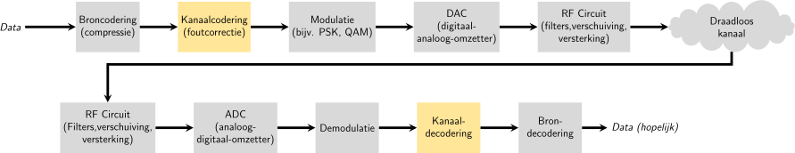

.. _channel-coding-chapter:

#####################
Kanaalcodering
#####################

Dit hoofdstuk introduceert de basis van kanaalcodering, bekend als voorwaartse foutcorrectie (Forward Error Correction: FEC), de Shannon-Limiet, Hamming-codes, Turbo- en LDPC-codes.
Kanaalcodering is een enorm gebied binnen de draadloze communicatie. Het is een tak van de "informatietheorie" wat de studie is over de kwantificatie, opslag en communicatie van informatie.

*************************************
Waarom we kanaalcodering nodig hebben
*************************************

Zoals we hebben geleerd in het :ref:`noise-chapter` hoofdstuk, hebben draadloze kanalen last van ruis en komen onze symbolen dus niet perfect bij de ontvanger aan.
Mocht je een cursus over netwerken hebben gedaan dan weet je waarschijnlijk al iets over cyclic redundancy checks (CRC) wat fouten **detecteert** bij de ontvanger.
Het doel van kanaalcodering is niet alleen om bij de ontvanger fouten te herkennen, maar ook te **repareren**.
Als we wat fouten toelaten dan is het mogelijk om een hogere orde van modulatieschema toe te passen zonder verlies van kwaliteit. 
Bekijk, voor een visueel voorbeeld, de onderstaande constellatiediagrammen voor QPSK (links) en 16QAM (rechts) met dezelfde hoeveelheid ruis.
QPSK geeft 2 bits per symbool, terwijl 16QAM een dubbele datasnelheid heeft van 4 bits per symbool. Maar zie hoe, voor QPSK, de symbolen niet de beslissingsgrens (x- en y-as) overlappen en dus de symbolen correct worden ontvangen. Tegelijkertijd overlappen de clusters wel in het 16QAM-diagram, met als resultaat dat er een hoop verkeerde symbolen worden ontvangen.

.. image:: ../_images/qpsk_vs_16qam.png
   :scale: 90 % 
   :align: center 

Een CRC-fout resulteert bij een protocol als TCP meestal in het opnieuw verzenden van een pakket.
Als Alice een bericht naar Bob stuurt zouden we liever niet Bob nog een bericht naar Alice laten sturen om de informatie opnieuw aan te vragen.   
Het doel van kanaalcodering is om overtollige of **redundante** informatie te sturen.
Door redundante data mee te sturen bouwen we een failsafe in om foute pakketten, hertransmissies en verloren data te kunnen voorkomen. 

Nu we weten waarom het nodig is kunnen we zien waar het wordt toegepast in de communicatieketen:

Er vinden meerdere stappen van codering plaats in de keten. Broncodering, de eerste stap, lijkt op kanaalcodering; broncodering heeft als doel de data zoveel mogelijk te comprimeren voordat het verzonden wordt, net als een bestandje zippen voordat je het e-mailt.
In andere woorden, de uitgang van de broncodering zal **kleiner** zijn dan de data ingang, maar de uitgang van kanaalcodering zal langer zijn dan de ingang want er is redundante informatie toegevoegd.

***************************
Typen Codes
***************************

Om kanaalcodering uit te voeren moeten we een "foutcorrectiecode" gebruiken. 
Deze code vertelt ons, gegeven de te versturen bits, welke bits we echt moeten versturen.
De meest simpele vorm wordt een "herhalingscode" genoemd; we herhalen een bit N keer op een rij.
Voor een herhalings-3 code zouden we elk bit driemaal versturen:

.. role::  raw-html(raw)
    :format: html

- 0 :raw-html:`&rarr;` 000
- 1 :raw-html:`&rarr;` 111

Het bericht 10010110 wordt na de kanaalcodering dan verstuurd als 111000000111000111111000.

Sommige van de codes werken op blokken van bits terwijl anderen op een stroom van bits werken.
De codes die op blokken werken worden "blokcodes" genoemd, de codes die op stromen werken heten "convolutionele codes". Dit zijn de twee primaire codes. Onze herhalings-3 code is een blokcode dat werkt op blokken van drie bits.

Trouwens, deze codes worden niet alleen voor draadloze kanalen gebruikt. Ooit eens data op een harde schijf of SSD gezet en afgevraagd waarom dat altijd goed gaat? Geheugen schrijven en dan lezen is vergelijkbaar met een communicatiesysteem. Harde schijf/SSD controllers hebben foutcorrectie ingebouwd. Dit is volledig onzichtbaar voor het OS omdat het in de controller zit ingebouwd. Cd-roms gebruikten de gestandaardiseerde Reed-Solomon codes.

***************************
Code-snelheid
***************************

Elke foutcorrectiecode bevat een vorm van redundantie. Dit betekent dat wanneer we 100 bits aan informatie willen versturen dat we eigenlijk **meer dan** 100 bits nodig hebben.
De snelheid is dan de verhouding tussen de informatie bits en het totale aantal bits dat is verzonden (dus informatie plus de redundante bits).
Als we teruggaan naar ons voorbeeld van herhaling-3, als ik 100 bits aan informatie verstuur, dan kunnen we de snelheid als volgt bepalen:

- 300 bits worden verstuurt
- Slechts 100 bits aan informatie
- Code-snelheid = 100/300 = 1/3

De code-snelheid zal altijd minder zijn dan 1; er is een afweging tussen redundantie en doorvoersnelheid.
Een lagere code-snelheid betekent meer redundantie maar minder doorvoer.

***************************
Modulatie en codering
***************************

In het :ref:`modulation-chapter` hoofdstuk hebben we de invloed van ruis op modulatieschema’s bekeken. Bij een lage signaal-ruisverhouding heb je een lager orde van modulatieschema nodig (bijv. QPSK) om met de ruis om te kunnen gaan. Bij een hoge SNR kun je een schema als 256QAM toepassen om meer bits per seconden over te kunnen sturen. Kanaalcodering werkt hetzelfde; je wilt een lagere codesnelheid bij lage signaal-ruisverhoudingen en bij hoge signaal-ruisverhoudingen wil je een codesnelheid van bijna 1 gebruiken. Moderne communicatiesystemen gebruiken combinaties van modulatie- en codeschema’s, MCS. Elke MCS specificeert een modulatie- plus codeschema wat bij een specifieke SNR gebruikt moet worden.

Moderne systemen passen de MCS real-time aan op basis van de draadloze kanaalcondities. De ontvanger geeft feedback aan de zender over de kanaalkwaliteit.
Deze feedback moet worden gegeven voordat de kwaliteit van het draadloze kanaal verandert, wat in ms kan gebeuren.
Deze adaptieve aanpak leidt tot de hoogst mogelijke doorvoersnelheid, en wordt door moderne technologieën gebruikt zoals LTE, 5G en wifi.
Hieronder zie je hoe een telefoontoren de MCS aanpast op basis van de afstand tot de gebruiker.

.. image:: ../_images/adaptive_mcs.svg
   :align: center 
   :target: ../_images/adaptive_mcs.svg

Wanneer de MCS wordt aangepast, als je dit uitzet tegenover de SNR, dan krijg je een stapvormige grafiek zoals het figuur hieronder. Protocollen zoals LTE hebben vaak een tabel wat aangeeft welke MCS gebruikt zou moeten worden bij welke SNR.

.. image:: ../_images/adaptive_mcs2.svg
   :align: center 
   :target: ../_images/adaptive_mcs2.svg

***************************
Hamming Code
***************************

Laten we eens kijken naar simpele foutcorrectiecodes. De Hamming-code was de eerste niet-triviale code dat werd ontwikkeld.
Aan het einde van 1940, bij Bell Laboratories, werkte Richard Hamming met een elektromechanische computer die ponskaarten gebruikte.
Wanneer er fouten werden gevonden moest de computer stoppen en de bedienden moesten de kaarten repareren.
Hamming raakte gefrustreerd dat zijn programma telkens bij een fout opnieuw opgestart moest worden.
Hij zei, "Damn it, als de machine een fout kan detecteren, waarom kan hij de fout niet vinden en ongedaan maken?".
De volgende paar jaren spendeerde hij om de Hamming-code te ontwikkelen die precies dat voor elkaar kreeg.

In Hamming-code worden extra bits toegevoegd, pariteits- of controlebits, om redundantie in te bouwen.
Alle bitposities op machten van 2 zijn pariteitsbits: 1,2,4,8, etc.
De andere bitposities bevatten de informatie.
De onderstaande tabel laat de pariteitsbits in het groen zien.
Elke pariteitsbit :math:`p_x` is *verantwoordelijk* voor alle databits :math:`d_n` waarbij de bitpositie van de databits en de bitwise AND operatie met de pariteitsbit, een getal oplevert ongelijk aan 0.
Dit is met een rode X hieronder aangegeven.
Wanneer we dan een databit willen gebruiken, dan hebben we de pariteitsbits nodig die hier verantwoordelijk voor zijn. 
Om databit :math:`d_{11}` te gebruiken zouden we pariteitsbit :math:`p_8` ,en alle pariteitsbits die daarvoor kwamen, nodig hebben. 
De tabel vertelt ons dan hoeveel pariteitsbits we nodig hebben voor elke databit. Dit patroon gaat oneindig door.

.. image:: ../_images/hamming.svg
   :align: center 
   :target: ../_images/hamming.svg

De hamming-code is een blokcode wat opereert op N databits per keer.
Met 3 pariteitsbits kunnen we opereren op een blok van 4 databits per keer.
Dit schema zouden we aangeven als Hamming(7,4), waarbij het eerste getal aangeeft hoeveel bits in totaal worden overgestuurd en het tweede getal hoeveel databits daarin zitten.

.. image:: ../_images/hamming2.svg
   :align: center 
   :target: ../_images/hamming2.svg

Hier volgen belangrijke eigenschappen van de Hamming-code:

- Het kan een bitfout repareren
- Het kan twee fouten detecteren maar niet repareren

Het proces van databits met de Hamming-code coderen kan worden gedaan door een matrixvermenigvuldiging uit te voeren met de "generator matrix".
In het onderstaande voorbeeld is 1011 de databit-vector dat we willen coderen en naar de ontvanger sturen.
De 2D matrix is de "generator matrix" dat het codeschema definieert. Het resultaat van de vermenigvuldiging is een *code-woord* dat we willen versturen.

.. This equals the picture. 
.. math::

   \vec{x}=\vec{a}G
   =\begin{pmatrix}1&0&1&1\end{pmatrix}
   \begin{pmatrix}1&0&0&0&1&1&0\\0&1&0&0&1&0&1\\0&0&1&0&0&1&1\\0&0&0&1&1&1&1\end{pmatrix}
   =\begin{pmatrix}1&0&1&1&2&3&2\end{pmatrix}
   =\begin{pmatrix}1&0&1&1&0&1&0\end{pmatrix}

.. .. image:: ../_images/hamming3.png
..    :scale: 60 % 
..    :align: center 

De laatste vector is verkregen door modulo-2 uit te voeren.
De reden waarom we even in Hamming-codes zijn gedoken is om te proeven hoe foutcodering werkt.
De blokcodes volgen ditzelfde concept.
Convolutionele codes werken anders, maar daar zullen we niet dieper op in gaan; meestal gebruiken ze Trellis-stijl decodering wat kan worden weergeven in zo'n soort diagram:

.. image:: ../_images/trellis.svg
   :align: center 

***************************
Soft vs Hard Decodering
***************************

Demodulatie gebeurt bij de ontvanger voor het decoderen. De demodulator kan zijn beste inschatting geven over welk symbool was verzonden, of het geeft een "zachte" waarde. Voor BPSK, in plaats van 1 of 0, zou het bijvoorbeeld 0.23345 of -1.75634 kunnen geven, of wat de zachte waarde ook was.
Er wordt nu onderscheid gemaakt tussen het hard of zacht decoderen:

- **zachte beslissingsdecodering** – gebruik de zachte waarden
- **Harde beslissingsdecodering** – gebruikt alleen de 1'en en 0'en

Zachte decodering is robuuster omdat we meer informatie tot onze beschikking hebben, maar tegelijkertijd is het ook complexer om te implementeren.
De Hamming-codes van eerder, gebruiken harde beslissingen, convolutionele codes gebruiken meestal zachte beslissingen.

***************************
Shannon Limiet
***************************

De limiet van Shannon, of de capaciteit van Shannon, is een ongelofelijk stuk theorie dat ons vertelt hoeveel bits-per-seconde foutvrij kan worden verzonden:

.. math::
 C = B \cdot log_2 \left( 1 + \frac{S}{N}   \right)

- C – Kanaalcapaciteit [bits/sec]
- B – Bandbreedte kanaal [Hz]
- S – Gemiddelde signaalvermogen ontvanger [Watt]
- N – Gemiddelde ruisvermogen [Watt]

Deze vergelijking laat zien welke snelheid een MCS zou kunnen bereiken om zonder fouten data over te sturen bij een gegeven SNR.
Het zou iets logischer zijn om de limiet in bits/sec/Hz uit te drukken i.p.v. bits/sec per spectrumdeel:

.. math::
 \frac{C}{B} = log_2 \left( 1 + \mathrm{SNR}   \right)

Hierbij is de SNR lineair gegeven (niet dB). 
Maar bij het plotten geven we voor het gemak de SNR meestal wel in dB:

.. image:: ../_images/shannon_limit.svg
   :align: center 

Soms wordt de Shannon-limiet in "signaal/ruisenergie per bit" weergeven of :math:`E_n/N_0`; dit is gewoon een alternatief voor SNR.

Het kan helpen om te beseffen dat wanneer de SNR vrij hoog is (bijv. boven de 10 dB) de Shannon-limiet benaderd kan worden met :math:`log_2 \left( \mathrm{SNR} \right)`, wat ongeveer gelijk is aan :math:`\mathrm{SNR_{dB}}/3` (`(wordt hier uitgelegd) <https://en.wikipedia.org/wiki/Shannon%E2%80%93Hartley_theorem#Bandwidth-limited_case>`_).  
Als je bijvoorbeeld een SNR hebt van 24 dB, dan komt dat overeen met ongeveer 8 bits/sec/Hz, dus als je 1 MHz moet gebruiken, dan geeft dat 8 Mbps.
Nu denk je misschien "Dat is alleen theoretisch", maar moderne communicatiesystemen komen erg dicht bij die limiet, dus het geeft je tenminste een grove inschatting om naartoe te werken.
Je zou dat getal altijd kunnen halveren om rekening te houden met de overhead die pakketjes of frames introduceren en een niet-ideale MCS.

De maximale snelheid dat 802.11n wifi in de 2.4 GHz band kan halen, met een kanaalbreedte van 20 MHz, is 300 Mbps volgens de specificaties.
Een optie om die snelheid te halen is om pal naast de router te gaan zitten.
In dit geval krijg je misschien een SNR van 60 dB, maar om praktische redenen heeft de snelste MCS waarschijnlijk niet zo'n hoge SNR nodig.
Je zou zelfs naar de `MCS lijst voor 802.11n <https://en.wikipedia.org/wiki/IEEE_802.11n-2009#Data_rates>`_ kunnen kijken.  
802.11n gaat tot 64-QAM, gecombineerd met kanaalcodering heeft het een SNR van ongeveer 25 dB nodig volgens `deze tabel <https://d2cpnw0u24fjm4.cloudfront.net/wp-content/uploads/802.11n-and-802.11ac-MCS-SNR-and-RSSI.pdf>`_.  
Dat betekent dus dat zelfs bij 60 dB het wifi signaal nog steeds 64-QAM zal gebruiken.
Bij 25 dB is de Shannon-limiet ongeveer 8.3 bits/sec/Hz, dus 166 Mbps bij een bandbreedte van 20 MHz.
Als we ook rekening houden met MIMO, dit wordt later behandeld, dan krijgen we 4 64-QAM signalen tegelijkertijd met een totale snelheid van 664 Mbps.
Als we dat getal halveren dan komen we behoorlijk in de buurt van de 300 Mbps dat 802.11n wifi belooft op de 2.4 GHz band.

Het bewijs achter de Shannon-limiet is best gestoord; dit heeft wiskunde wat hierop lijkt:

.. image:: ../_images/shannon_limit_proof.png
   :scale: 70 % 
   :align: center

Kijk voor meer informatie `hier <https://en.wikipedia.org/wiki/Shannon%E2%80%93Hartley_theorem>`_.

***************************
State of the Art Codes
***************************

Momenteel zijn de beste kanaalcoderingsschema’s:

1. Turbo codes, dit wordt gebruikt in 3G, 4G, NASA’s ruimtevaartuigen.
2. LDPC-codes, gebruikt in DVB-S2, WiMAX, IEEE 802.11n.

Beide codes benaderen de Shannon-limiet (dus onder bepaalde signaal-ruisverhoudingen wordt de limiet bijna gehaald).
Hamming-codes of andere simpele codes komen niet eens in de buurt van de Shannon-limiet.
Voor wat betreft onderzoek valt er niet veel meer te halen in het verbeteren van de codes voor wat betreft toegevoegde overhead. Huidig onderzoek is meer gericht op het verbeteren van het decoderen; minder rekenintensief maken en kunnen omgaan met kanaalfeedback.

Low-density parity-check (LDPC) codes zijn een groep van hele efficiënte lineaire blokcodes. 
In 1960 werden deze codes geïntroduceerd door Robert G. Gallager in zijn doctoraat aan de MIT-universiteit.
Helaas waren deze codes zo rekenintensief dat het genegeerd werd tot de jaren 90!
Op het moment van schrijven (2022) is hij 91 en heeft hij vele prijzen gewonnen voor zijn werk (decennia nadat hij het had uitgevonden). LPDC heeft geen patenten en is daarom vrij te gebruiken (in tegenstelling tot Turbo-codes) en dat is de reden waarom het in vele open protocollen wordt toegepast.

Turbo-codes zijn convolutionair. Dit is een klasse codes dat gebruik maakt van twee of meerdere simpele convolutionele codes en een samenvoeger (interleaver).
De fundamentele patentaanvraag voor turbo-codes is van 23 April 1991.
De uitvinders waren Frans, en toen Qualcomm de turbo-codes wou toepassen in CDMA voor 3G moesten ze een licentieovereenkomst aangaan met de Franse Telecom.
Het eerste patent is verlopen op 29 Augustus 2013.
