.. _modulation-chapter:

###################
Digitale Modulatie
###################

In dit hoofdstuk gaan we met behulp van digitale modulatie data *echt versturen* en draadloze symbolen behandelen! We gaan signalen ontwerpen die "informatie" bevatten, dus 1'en en 0'en, door gebruik van modulatietechnieken zoals ASK, PSK, QAM en FSK. We zullen ook IQ-diagrammen en constellaties behandelen en het hoofdstuk afsluiten met wat Python voorbeelden.

Het grote doel van moduleren is om zoveel mogelijk data in een zo klein mogelijk spectrum te proppen. Technisch gezegd willen we de "spectrale efficiëntie" (bits/sec/Hz) maximaliseren. 1'en en 0'en sneller versturen zal de bandbreedte van ons signaal groter doen maken (denk aan de :ref:`Tijd-Frequentie Eigenschappen`), wat betekent dat meer van het spectrum wordt gebruikt. Naast snellere transmissie zullen we ook andere technieken bekijken. Er zijn veel afwegingen voor de modulatiekeuze, maar er is ook vrijheid voor creativiteit.

*******************
Symbolen
*******************
Waarschuwing: nieuwe term! Het uitgaande signaal zal worden opgebouwd uit "symbolen". Elk symbool zal een aantal bits aan informatie bevatten en we willen symbolen achter elkaar versturen, duizenden of miljoenen in een rij.

Als een versimpeld voorbeeld, laten we zeggen dat we 1'en en 0'en sturen met hoge en lage spanningsniveaus. Een symbool is zo'n 1 of 0:

.. image:: ../_images/symbols.png
   :scale: 60 % 
   :align: center 

In het bovenstaande voorbeeld stelt een symbool slechts een bit voor. Hoe kunnen we meerdere bits per symbool overbrengen? Laten we gaan kijken hoe signalen over ethernetkabels worden gestuurd, dit is vastgelegd in een IEEE standaard genaamd IEEE 802.3 1000BASE-T. In normale situaties gebruikt ethernet amplitude modulatie met 4 niveaus (2 bits per symbool) en 8 ns symbolen.

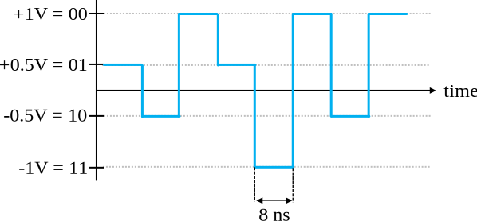

Neem een moment om deze vragen te beantwoorden:

1. Hoeveel bits per seconde worden overgestuurd in het bovenstaande voorbeeld?
2. Hoeveel data-draden zouden nodig zijn om 1 gigabit/sec te versturen?
3. Als een modulatieschema 16 verschillende niveaus heeft, hoeveel bits per symbool is dat?
4. Met 16 verschillende niveaus en 8ns symbolen, hoeveel bits per seconde is dat?

.. raw:: html

   

   
Antwoorden

1. 250 Mbps - (1/8e-9)*2
2. Vier (wat ethernet kabels ook hebben)
3. 4 bits per symbool - log_2(16)
4. 0.5 Gbps - (1/8e-9)*4

.. raw:: html

   

*******************
Draadloze Symbolen
*******************
Vraag: Waarom kunnen we niet het ethernet signaal van hierboven direct versturen? Er zijn vele redenen, maar de belangrijkste zijn:

1. Lage frequenties hebben *enorme* antennes nodig
2. Blokgolven nemen voor het aantal bits-per-seconde een *overbodige* hoeveelheid ruimte van het spectrum in -- herinner van het  :ref:`freq-domain-chapter` hoofdstuk dat scherpe veranderingen in het tijddomein een grote hoeveelheid bandbreedte/spectrum gebruiken:

.. image:: ../_images/square-wave.svg
   :align: center 
   :target: ../_images/square-wave.svg

Wat we voor draadloze signalen doen is beginnen met een draaggolf, wat gewoon een sinusoïde is. FM-radio gebruikt bijvoorbeeld een draaggolf als 101.1 MHz of 100.3 MHz. We moduleren die draaggolf op een bepaalde manier (er zijn vele). In geval van FM-radio is dit analoge modulatie, niet digitaal, maar het concept is hetzelfde als bij digitale modulatie. 

Op wat voor manier kunnen we de draaggolf moduleren? Een andere manier om dit te vragen is: Wat zijn de verschillende eigenschappen van een sinusoïde?

1. Amplitude
2. Fase
3. Frequentie

We kunnen onze data op een draaggolf moduleren door een of meerdere van deze drie aan te passen.

****************************
Amplitude Shift Keying (ASK)
****************************

Amplitude Shift Keying (ASK) (Nederlands: amplitudeverschuivingsmodulatie) is het eerste digitale modulatieschema dat we zullen bespreken want het is van de drie sinusoïde eigenschappen het simpelst te visualiseren. We moduleren letterlijk de **amplitude** van de draaggolf. Hier is een voorbeeld van ASK met 2 niveaus, genaamd 2-ASK:

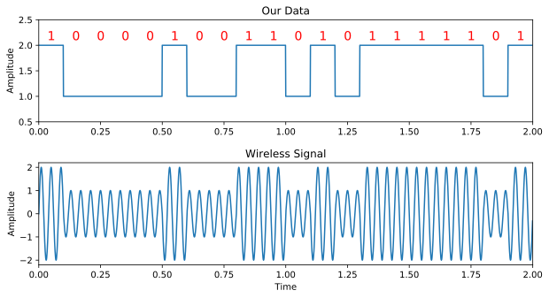

Let op hoe de gemiddelde waarde nul is; dit heeft altijd onze voorkeur.

We kunnen meer dan twee niveaus gebruiken om meer bits per symbool te versturen. Hieronder een voorbeeld van 4-ASK. In dit geval bevat elk symbool 2 bits aan informatie.

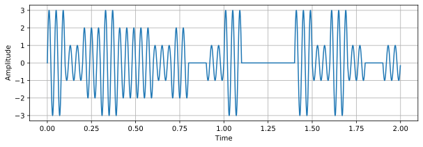

Vraag: Hoeveel symbolen kun je in het signaal hierboven onderscheiden? Hoeveel bits worden in totaal verzonden?

.. raw:: html

   

   
Antwoorden

20 symbolen, dus 40 bits aan informatie

.. raw:: html

   

Hoe kunnen we eigenlijk dit signaal met code creëren? 
Het enige wat we hoeven te doen, is een vector van N samples per symbool maken, en dat vermenigvuldigen met een sinusoïde. 
Dit moduleert ons signaal op de draaggolf (de sinusoïde is die draaggolf). Het voorbeeld hieronder laat 2-ASK zien met 10 symbolen per seconde.

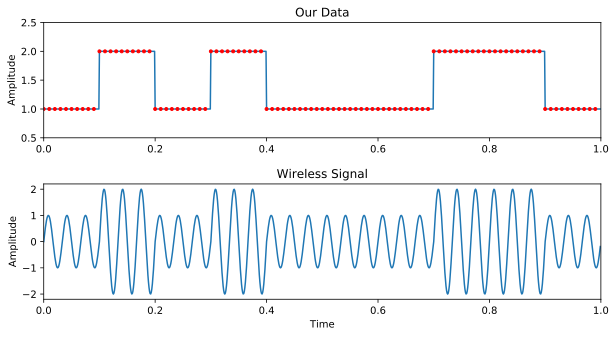

Het bovenste figuur laat de discrete samples zien als rode punten, dus ons digitale signaal. Het onderste figuur laat zien hoe het resulterende gemoduleerde signaal eruitziet, dit zou verzonden kunnen worden door de lucht. In echte systemen is de frequentie van de draaggolf veel hoger dan de snelheid waarmee de symbolen afwisselen. In ons voorbeeld zijn er maar 3 perioden van de draaggolf per symbool, maar in de praktijk zouden er duizenden kunnen zijn, afhankelijk van hoe hoog in het spectrum het verzonden wordt.

************************
Phase Shift Keying (PSK)
************************

Laten we overwegen om de fase te moduleren op dezelfde manier als we met de amplitude hebben gedaan. De simpelste vorm is Binaire PSK (BPSK) waar er twee faseniveaus zijn:

1. Geen faseverandering
2. 180 graden faseverandering

Voorbeeld van BPSK (let op de faseveranderingen):

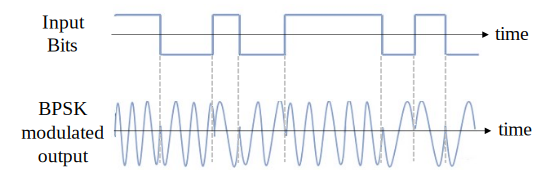

Het is niet zo leuk om naar figuren te kijken als deze:

.. image:: ../_images/bpsk2.svg
   :align: center 
   :target: ../_images/bpsk2.svg

In plaats daarvan laten we de fase meestal zien in het complexe vlak.

***************************
IQ Diagrammen/Constellaties
***************************
Je hebt al eerder complexe nummers in IQ-diagrammen gezien in het :ref:`Complexe Getallen` deel, maar nu gaan we ze op een nieuwe en grappige manier gebruiken.  
We kunnen de amplitude en fase in een IQ-diagram laten zien voor een gegeven symbool.
In geval van het BPSK-voorbeeld hadden we fasen van 0 en 180 graden. 
Laten we die punten eens plaatsen in het IQ-diagram.
We gaan uit van een modulus/amplitude van 1.
In de praktijk maakt het niet echt uit welke modulus je gebruikt; een hogere waarde betekent een hoger signaalvermogen, je zou ook gewoon de versterking hoger kunnen zetten.

.. image:: ../_images/bpsk_iq.png
   :scale: 80 % 
   :align: center 

Het bovenstaande IQ-diagram laat zien wat, of eigenlijk de set van symbolen waaruit, we versturen.
Het laat de draaggolf niet zien, dus je kunt dit zien als basisband-symbolen.
Wanneer we voor een modulatieschema de mogelijke set van symbolen laten zien, noemen we dat de "constellatie". 
Vele modulatieschema’s kunnen door hun constellaties worden gedefinieerd.

Om BPSK te ontvangen en decoderen kunnen we IQ-sampling toepassen, zoals we hebben geleerd in het vorige hoofdstuk, en bekijken waar de punten terechtkomen in het IQ-diagram.
Door het draadloze kanaal zal er echter wel een willekeurige faserotatie plaatsvinden, want het signaal loopt een willekeurige vertraging op wanneer het door de lucht voortplant tussen de antennes.
Verschillende methodes waar we later over leren kunnen deze willekeurige faserotatie tenietdoen. 
Hier zijn een paar voorbeelden van hoe het BPSK-signaal eruit zou kunnen zien bij de ontvanger (zonder ruis).

.. image:: ../_images/bpsk3.png
   :scale: 60 % 
   :align: center 

Terug naar PSK. Wat als we vier verschillende fasen zouden willen? Bijv., 0, 90, 180 en 270 graden. 
Dat zou op deze manier getoond kunnen worden in het IQ-diagram, dit vormt het Quadrature Phase Shift Keying (QPSK) schema:

.. image:: ../_images/qpsk.png
   :scale: 60 % 
   :align: center 

We hebben voor PSK altijd N verschillende hoeken/fasen, voor het beste resultaat evenredig verdeeld over de 360 graden.
Meestal laten we ook de eenheidscirkel zien om aan te geven dat alle punten dezelfde modulus hebben:

.. image:: ../_images/psk_set.png
   :scale: 60 % 
   :align: center 

Vraag: Is er wat mis met het gebruik van het onderstaande PSK-schema? Is dit een PSK-modulatieschema?

.. image:: ../_images/weird_psk.png
   :scale: 60 % 
   :align: center 

.. raw:: html

   

   
Antwoord

Er is niets onmogelijks aan dit PSK-schema. Je kunt het zeker gebruiken, maar, het schema is niet zo effectief als mogelijk omdat de symbolen niet uniform verdeeld zijn.
Wanneer we ruis op onze symbolen gaan behandelen wordt schema-efficiëntie duidelijk.
Het korte antwoord is dat we zoveel mogelijk 'ruimte' tussen de symbolen willen houden voor het geval er ruis is, zodanig dat bij de ontvanger een symbool niet wordt opgevat als een van de andere (incorrecte) symbolen. 
We willen niet een 0 ontvangen als een 1.

.. raw:: html

   

Even terug naar ASK. Net als PSK kun je ASK ook laten zien in het IQ-diagram. Hier is het IQ-diagram van 2-ASK, 4-ASK, en 8-ASK, in bipolaire vorm, en ook 2-ASK en 4-ASK in de unipolaire vorm.

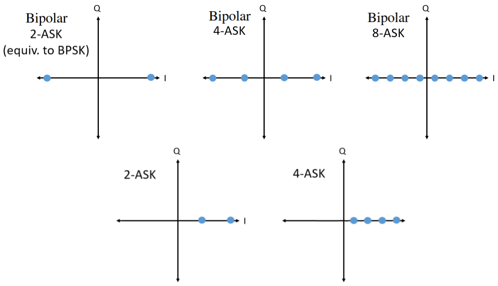

Misschien is het je al opgevallen, de bipolaire 2-ASK en BPSK zijn hetzelfde. Een fasedraaiing van 180 graden is hetzelfde als een sinusoïde vermenigvuldigen met -1. We noemen het waarschijnlijk BPSK omdat dit veel meer gebruikt wordt dan ASK.

**************************************
Quadrature Amplitude Modulation (QAM)
**************************************
En wat gebeurt er als we ASK en PSK combineren? Dit modulatieschema noemen we Quadrature Amplitude Modulation (QAM) (Nederlands: kwadratuuramplitudemodulatie). QAM ziet er meestal ongeveer zo uit:

.. image:: ../_images/64qam.png
   :scale: 90 % 
   :align: center 
   
En nog wat voorbeelden van QAM:

.. image:: ../_images/qam.png
   :scale: 50 % 
   :align: center 

Technisch gezien, omdat de fase *en* amplitude gemoduleerd worden, kunnen we voor QAM de punten op het IQ-diagram plaatsen waar we willen. 
Voor een gegeven QAM-schema zijn de "parameters" het best te beschrijven met een QAM-constellatie. 
Aan de andere kant zou je de I en Q waarden voor elk punt kunnen beschrijven, zoals hieronder voor QPSK:

.. image:: ../_images/qpsk_list.png
   :scale: 80 % 
   :align: center 

Hierbij de opmerking dat de meeste modulatieschema's, behalve sommige ASK's en BPSK, vrij moeilijk te herkennen zijn in het tijddomein. 
Om dit punt thuis te brengen is hier een voorbeeld van hoe QAM in het tijddomein eruitziet. 
Kun jij van elk symbool de fase onderscheiden in het onderstaande figuur? 
Dat is lastig.

.. image:: ../_images/qam_time_domain.png
   :scale: 50 % 
   :align: center 

Gezien de uitdaging om in het tijddomein modulatieschema’s te herkennen, gebruiken we liever IQ-diagrammen dan een tijddomein figuur. 
Toch zouden we een tijddomein-signaal laten zien wanneer een bepaalde pakketopbouw of volgorde van symbolen van invloed is.

****************************
Frequency Shift Keying (FSK)
****************************

De laatste op ons lijstje is Frequency Shift Keying (FSK) (Nederlands: Frequentieverschuivingsmodulatie).
FSK is niet moeilijk te vatten -- we schuiven tussen N frequenties waarbij elke frequentie een symbool voorstelt. Omdat we een draaggolf moduleren, is het eigenlijk de draaggolffrequentie +/- deze N frequenties. Als we bijv. een draaggolf hebben van 1.2 GHz, dan zouden we kunnen schuiven tussen deze vier frequenties:

1. 1.2005 GHz
2. 1.2010 GHz
3. 1.1995 GHz
4. 1.1990 GHz

Dit zou dan om 4-FSK gaan met twee bits per symbool.
In het frequentiedomein zou 4-FSK er zo uit kunnen zien:

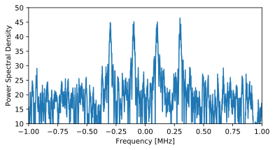

Een belangrijke vraag die je jezelf moet stellen is: Welke afstand moet ik aanhouden tussen de frequenties? 
Deze afstand wordt vaak aangegeven als :math:`\Delta f` in Hz. 
We willen vermijden dat signalen in het frequentiedomein overlappen, dus :math:`\Delta f` moet groot genoeg zijn.  
De bandbreedte van elke draaggolf is een functie van de symboolsnelheid.
Meer symbolen per seconde geeft kortere symbolen en dus een grotere bandbreedte (denk aan de inverse relatie tussen tijd en frequentie).
Hoe sneller we symbolen gaan oversturen, hoe breder elke draaggolf wordt en dus hoe groter we :math:`\Delta f` moeten maken om te voorkomen dat de draaggolven elkaar overlappen.

.. image:: ../_images/fsk2.svg
   :align: center
   :target: ../_images/fsk2.svg

Als bijzaak, FM-radio gebruikt frequentiemodulatie (FM). 
Dit is een analoge versie van FSK.
In plaats van het springen tussen discrete frequenties, gebruikt de FM-zender een continu audiosignaal waarmee het de frequentie van de draaggolf moduleert. 
Hieronder is een voorbeeld te zien van FM- en AM-modulatie, waarbij het "signaal" waarmee gemoduleerd wordt, in het bovenste figuur te zien is.

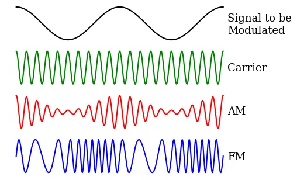

In dit boek maken we ons vooral druk over de digitale vormen van modulatie.

**********************
Differentiële Codering
**********************
.. 
   todo - This chapter  has a bunch of terms that haven't come up yet in the book, this doesn't help readers understand the material. Also the bitsequence in the text didn't correspond with the image, another possible source of confusion.
Je zult waarschijnlijk in de meeste draadloze (en bedraade) communicatieprotocollen tegen iets aanlopen wat differentiële codering wordt genoemd.
Om het nut hiervan aan te tonen, gaan we kijken naar de ontvangst van een BPSK-signaal.
Zoals eerder verteld, wanneer dit signaal door de lucht vliegt ervaart het een willekeurige vertraging tussen zender en ontvanger, dit veroorzaakt een willekeurige draaiing/rotatie in de constellatie.
De ontvanger zal nu proberen te synchroniseren en de BPSK uit te lijnen met de I-as, maar het heeft geen idee of het 180 graden uit fase loopt of niet, de constellaties zien er exact hetzelfde uit.

.. 
   todo - this is confusing, talking about clusters the reader hasn't even encountered yet. Same with coherent receivers, this hasn't been mentioned yet before
In plaats van absolute symbolen te versturen om absoluut aan te geven wat een 1 of 0 voorstelt, kan het kiezen om differentiële codering toe te passen en zich hier niet eens zorgen om te maken.

..
   De differentiële codering stelt ons ook in staat om niet-coherente ontvangers te gebruiken, welke simpeler zijn dan coherente ontvangers.

De meest eenvoudige vorm van differentiële codering, wat door D-BPSK wordt gebruikt, is om een 0 te versturen wanneer de huidige ingangsbit gelijk is aan de vorige uitgangsbit, en een 1 te versturen als de huidig ingangsbit anders is dan de vorige uitgangsbit.
We sturen nog steeds dezelfde hoeveelheid bits (plus een extra om de reeks te starten) maar we hoeven ons niet meer druk te maken over een mogelijke 180 graden draaiing. 

Laten we naar een voorbeeld kijken om aan te geven hoe dit werkt. 
Stel we versturen [1, 1, 0, 0, 1, 1, 1] met BPSK.
We beginnen de uitgangsreeks met een 1; dit maakt niets uit, 1 of 0.
Na het toepassen van de differentiële codering versturen we uiteindelijk [1, 0, 1, 1, 1, 0, 1, 0].
De 1'en en 0'en worden nog steeds aan de positieve (1+0j) en negatieve (-1+0j) symbolen gekoppeld.
Dit is makkelijker voor te stellen wanneer we de in- en uitgangsreeksen op elkaar stapelen:

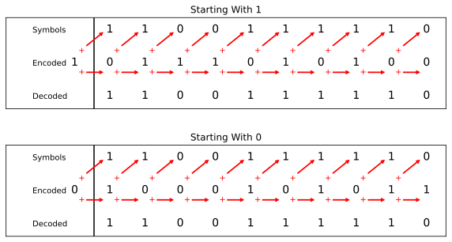

Het grote nadeel van differentiële codering is dat een verkeerde bit tot twee bitfouten zal leiden.
Een alternatief voor differentiële codering is om periodiek piloot-symbolen te sturen, dit zijn symbolen die de ontvanger al kent, hiermee zou de ontvanger kunnen herkennen of er een faseverschuiving van 180 graden heeft plaatsgevonden. 
Het probleem met deze oplossing is dat een draadloos kanaal snel kan veranderen, helemaal als de zender/ontvanger in beweging zijn, dus dan moet je die piloot-symbolen vaak genoeg versturen om dit te kunnen verhelpen.
Differentiële codering is veel eenvoudiger om te implementeren, dus als eenvoud belangrijker is dan hier en daar een verloren bit, dan zal dit de voorkeur hebben. 
In het :ref:`rds-chapter`hoofdstuk, behandelen we RDS, dit gebruikt dus de (minder complexe) differentiële codering.

*******************
Python Voorbeeld
*******************

Laten we als een voorbeeld QPSK in de basisband genereren en tonen in een constellatiediagram met Python.

We zouden een lijstje van complexe symbolen kunnen intypen, maar laten we beginnen met het feit dat QPSK vier symbolen heeft met afstanden van 90-graden op de eenheidscirkel.
We gaan 45, 135, 225 en 315 graden gebruiken voor onze punten/symbolen.  
Voordat we het omzetten naar radialen zullen we eerst een duizend symbolen genereren, die willekeurig een getal krijgen tussen de 0 en 3.

.. code-block:: python

 import numpy as np
 import matplotlib.pyplot as plt
 
 aantal_symbolen = 1000
 
 x_int = np.random.randint(0, 4, aantal_symbolen) # 0 tm 3
 x_graden = x_int*360/4.0 + 45 # 45, 135, 225, 315 graden
 x_radialen = x_graden*np.pi/180.0 # sin() en cos() willen radialen
 x_symbolen = np.cos(x_radialen) + 1j*np.sin(x_radialen) # Dit genereert onze complexe QPSK symbolen
 plt.plot(np.real(x_symbolen), np.imag(x_symbolen), '.')
 plt.grid(True)
 plt.show()

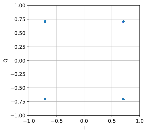

Zie hoe alle symbolen overlappen? 
Er is geen ruis dus de symbolen hebben exact dezelfde waarden.
We gaan wat ruis toevoegen:

.. code-block:: python

 n = (np.random.randn(aantal_symbolen) + 1j*np.random.randn(aantal_symbolen))/np.sqrt(2) # AWGN met vermogen van 1
 ruisvermogen = 0.01
 r = x_symbolen + n * np.sqrt(ruisvermogen)
 plt.plot(np.real(r), np.imag(r), '.')
 plt.grid(True)
 plt.show()

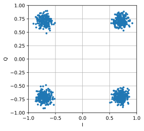

De additieve witte Gaussische ruis (AWGN) veroorzaakt een spreiding rondom elk constellatiepunt.
Ruis wordt behandeld in het :ref:`Gaussische ruis` hoofdstuk.
Het punt is, als er te veel ruis wordt toegevoegd dan zullen sommige symbolen/samples over de grens (de vier kwadranten) gaan en incorrect geïnterpreteerd worden.
Probeer dit zelf uit door het ruisvermogen toe te laten nemen.

Je zou ook de faseruis kunnen simuleren, wat zou kunnen ontstaan door variaties in de lokale oscillator (LO), door :code:`r` te vervangen met:

.. code-block:: python

 fase_ruis = np.random.randn(len(x_symbolen)) * 0.1 # de "kracht" van de faseruis verandert met de vermenigvuldingsfactor
 r = x_symbolen * np.exp(1j*fase_ruis)

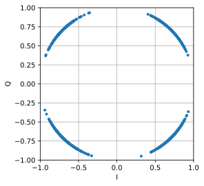

Je zou zelfs AWGN kunnen combineren met de faseruis om het probleem volledig te ervaren:

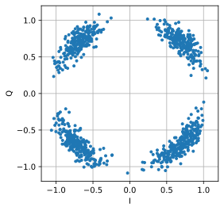

We gaan op dit punt stoppen.
Als we de tijddomein-versie van het QPSK-signaal zouden willen zien dan zouden we meerdere samples per symbool moeten genereren (in dit voorbeeld was het 1 sample per symbool).
Wanneer we het over pulsvorming gaan hebben zul je leren hoe je meerdere samples per symbool genereert.
Het Python-voorbeeld in het :ref:`pulse-shaping-chapter` hoofdstuk zal verder gaan waar we nu zijn gestopt.

*******************
Extra Leesmateriaal
*******************

#. https://en.wikipedia.org/wiki/Differential_coding
