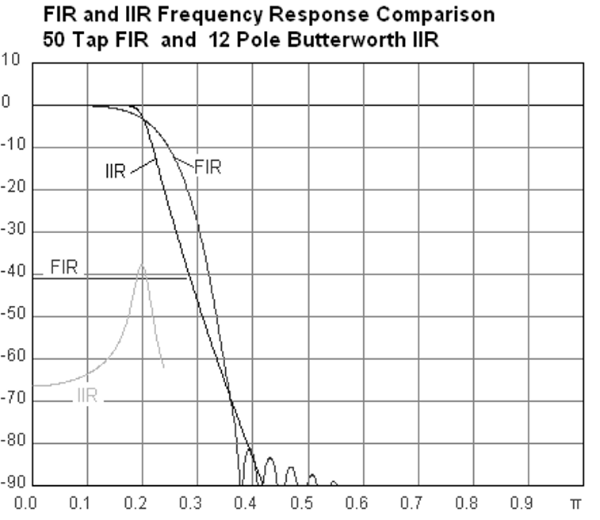
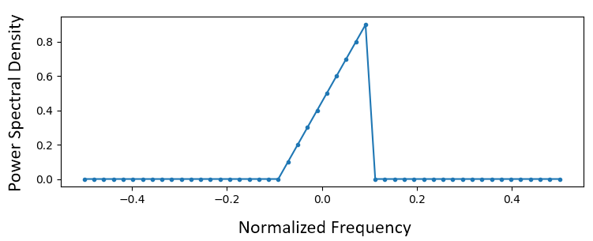
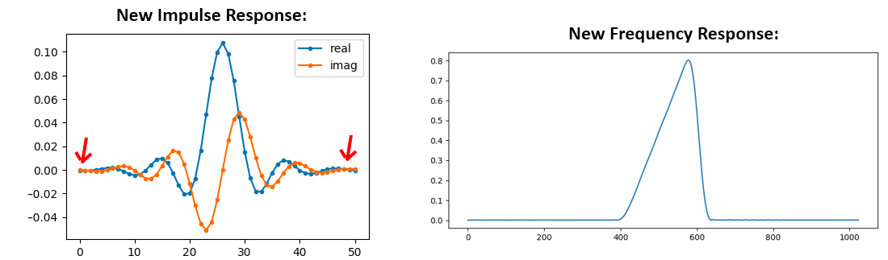
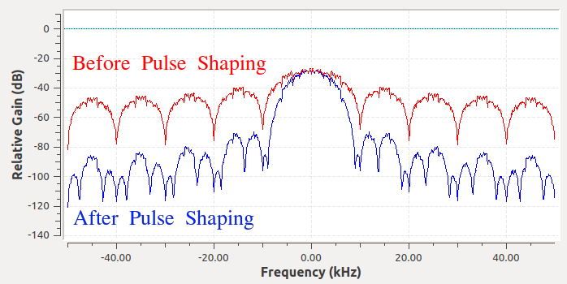
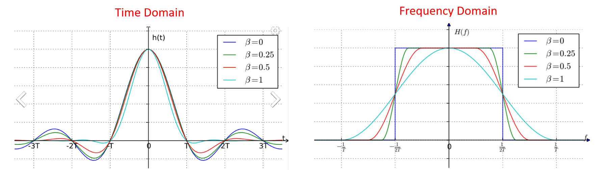

.. _filters-chapter:

#############
Filters
#############

We gaan in dit hoofdstuk over digitale filters in Python leren.
We zullen de type filters behandelen (FIR/IIR en laagdoorlaat/hoogdoorlaat/banddoorlaat/bandstop), hoe ze digitaal eruit zien, en hoe ze ontworpen worden.
Als laatste zullen we eindigen met een introductie over 'pulse shaping' (Nederlands: pulsvorming), wat zal worden uitgediept in het :ref:`pulse-shaping-chapter` hoofdstuk.

*************************
Basis van Filters
*************************

Veel disciplines maken gebruik van filters.
Beeldverwerking maakt bijvoorbeeld uitvoerig gebruik van 2D filters waarbij de in- en uitgangen figuren betreft.
Wellicht gebruik je elke morgen een koffiefilter om de vaste en vloeibare stoffen te scheiden.
Maar in digitale signaalbewerking worden filters voornamelijk toegepast voor het:

1. Scheiden van gecombineerde signalen (dus het gewenste signaal extraheren)
2. Verwijderen van overbodige ruis na ontvangst van een signaal
3. Herstellen van signalen die zijn vervormd (een audio equalizer is bijv. een filter)

Natuurlijk zijn er nog meer toepassingen, maar de bedoeling van dit hoofdstuk is om het concept te introduceren in plaats van alle filtertoepassingen.

Misschien denk je dat we alleen geïnteresseerd zijn in digitale filters; het is ten slotte een DSP boek.
Het is echter belangrijk om te begrijpen dat veel filters analoog zullen zijn, zoals de filters die in jouw SDR voor de ADC's zijn gezet.
Het volgende figuur plaatst een schema van een analoog filter tegenover het schematisch ontwerp van een digitaal filter.

.. annotate image in tikz with text.
.. tikz:: [font=\sffamily\Large\bfseries]
   \node[anchor=south west,inner sep=0](image) at (0,0) {\includegraphics[scale=1.5]{analog_digital_filter_nolabel.png}};
   \begin{scope}[x={(image.south east)},y={(image.north west)}]
      \node[] at (0.25,0.9) {Analoog filter};
      \node[] at (0.75,0.9) {Digitaal filter};
   \end{scope}
  
DSP's hebben signalen als in- en uitgangen. Een filter heeft een ingangssignaal en een uitgangssignaal:

.. tikz:: [font=\sffamily\Large\bfseries, scale=2]
   \definecolor{babyblueeyes}{rgb}{0.36, 0.61, 0.83}
   \node [draw,
    color=white,
    fill=babyblueeyes,
    minimum width=4cm,
    minimum height=2.4cm
   ]  (filter) {Filter};
   \draw[<-, very thick] (filter.west) -- ++(-2,0) node[left,align=center]{Ingang\\(tijddomein)} ;
   \draw[->, very thick] (filter.east) -- ++(2,0) node[right,align=center]{Uitgang\\(tijddomein)};   
   :libs: positioning

.. .. image:: ../_images/filter.png
..    :scale: 70 % 
..    :align: center 

Je kunt niet twee verschillende signalen in een enkel filter stoppen zonder ze eerst samen te voegen of een andere operatie uit te voeren.
Op dezelfde manier zal de uitgang altijd een signaal betreffen, bijv. een 1D array van getallen.

Er zijn vier basistypen filters: laagdoorlaat, hoogdoorlaat, banddoorlaat en bandstop (of sper).
Elke type bewerkt signalen zodanig dat de focus op verschillende gebieden aan frequenties ligt.
De onderstaande grafieken laten voor elk van de typen zien hoe de frequenties worden gefilterd.
We merken op dat onderstaande figuren ook de negatieve frequenties tonen. Zolang de filters "reëel" zijn, zullen de filters gespiegeld zijn rondom 0 Hz.

.. the only way i could manage to get the tikz drawings next each other
.. was to use a html table... In a pdf the pictures would be beneath each
.. other
.. raw:: html

   <table><tbody><tr><td>

.. This draw the lowpass filter
.. tikz:: [font=\sffamily\Large]    
   \draw[->, thick] (-5,0) -- (5,0) node[below]{Frequentie};
   \draw[->, thick] (0,-0.5) node[below]{0 Hz} -- (0,5) node[left=1cm]{\textbf{Laag-doorlaat}};
   \draw[red, thick, smooth] plot[tension=0.5] coordinates{(-5,0) (-2.5,0.5) (-1.5,3) (1.5,3) (2.5,0.5) (5,0)};

.. raw:: html

   </td><td>

.. this draws the highpass filter
.. tikz:: [font=\sffamily\Large]    
   \draw[->, thick] (-5,0) -- (5,0) node[below]{Frequentie};
   \draw[->, thick] (0,-0.5) node[below]{0 Hz} -- (0,5) node[left=1cm]{\textbf{Hoog-doorlaat}};
   \draw[red, thick, smooth] plot[tension=0.5] coordinates{(-5,3) (-2.5,2.5) (-1.5,0.3) (1.5,0.3) (2.5,2.5) (5,3)};

.. raw:: html

   </td><td>

.. this draws the bandpass filter
.. tikz:: [font=\sffamily\Large]    
   \draw[->, thick] (-5,0) -- (5,0) node[below]{Frequentie};
   \draw[->, thick] (0,-0.5) node[below]{0 Hz} -- (0,5) node[left=1cm]{\textbf{Band-doorlaat}};
   \draw[red, thick, smooth] plot[tension=0.5] coordinates{(-5,0) (-4.5,0.3) (-3.5,3) (-2.5,3) (-1.5,0.3) (1.5, 0.3) (2.5,3) (3.5, 3) (4.5,0.3) (5,0)};

.. raw:: html

   </td><td>

.. and finally the bandstop filter
.. tikz:: [font=\sffamily\Large]    
   \draw[->, thick] (-5,0) -- (5,0) node[below]{Frequentie};
   \draw[->, thick] (0,-0.5) node[below]{0 Hz} -- (0,5) node[left=1cm]{\textbf{Band-stop}};
   \draw[red, thick, smooth] plot[tension=0.5] coordinates{(-5,3) (-4.5,2.7) (-3.5,0.3) (-2.5,0.3) (-1.5,2.7) (1.5, 2.7) (2.5,0.3) (3.5, 0.3) (4.5,2.7) (5,3)};   
   
.. raw:: html

   </td></tr></tbody></table>

.. .......................... end of filter plots in tikz

.. .. image:: ../_images/filter_types.png
..    :scale: 70 % 
..    :align: center 

Elk filter laat bepaalde frequenties in een signaal door terwijl het andere frequenties blokkeert.
Het bereik aan frequenties wat wordt doorgelaten heet de "doorlaatband", en wat wordt geblokkeerd heet de "stopband".
In het geval van een laagdoorlaatfilter worden lage frequenties doorgelaten en hoge frequenties geblokkeerd, dus 0Hz zal altijd in de doorlaatband vallen.
Bij hoog- en banddoorlaatfilters bevindt 0 Hz zich altijd in de stopband.

Verwar deze filtertypes niet met de implementatietypes (dus IIR en FIR).
Omdat we regelmatig signalen in de basisband gebruiken, wordt het laag-doorlaat filter (LPF) veruit het meeste gebruikt.
Een LPF staat ons toe om alles "rond" ons signaal, zoals ruis en andere signalen, weg te filteren.

*************************
Filter opbouw
*************************

De meeste digitale filters die we tegen zullen komen (zoals FIR) kunnen we beschrijven met een array van floating point getallen.
Filters die in het frequentiedomein symmetrisch zijn, bestaan uit (meestal een oneven aantal) reële getallen (i.p.v. complex).
We noemen deze array van getallen "coëfficiënten" of in het Engels "taps".
Meestal gebruiken we :math:`h` als symbool voor deze filter coëfficiënten/taps. 
Hier zijn een aantal voorbeeld coëfficiënten van een enkel filter:

.. code-block:: python

    h =  [ 9.92977939e-04  1.08410297e-03  8.51595307e-04  1.64604862e-04
     -1.01714338e-03 -2.46268845e-03 -3.58236429e-03 -3.55412543e-03
     -1.68583512e-03  2.10562324e-03  6.93100252e-03  1.09302641e-02
      1.17766532e-02  7.60955496e-03 -1.90555639e-03 -1.48306750e-02
     -2.69313236e-02 -3.25659606e-02 -2.63400086e-02 -5.04184562e-03
      3.08099470e-02  7.64264738e-02  1.23536693e-01  1.62377258e-01
      1.84320776e-01  1.84320776e-01  1.62377258e-01  1.23536693e-01
      7.64264738e-02  3.08099470e-02 -5.04184562e-03 -2.63400086e-02
     -3.25659606e-02 -2.69313236e-02 -1.48306750e-02 -1.90555639e-03
      7.60955496e-03  1.17766532e-02  1.09302641e-02  6.93100252e-03
      2.10562324e-03 -1.68583512e-03 -3.55412543e-03 -3.58236429e-03
     -2.46268845e-03 -1.01714338e-03  1.64604862e-04  8.51595307e-04
      1.08410297e-03  9.92977939e-04]

Voorbeeldtoepassing
########################

Om te leren hoe onze filters worden gebruikt gaan we kijken naar een voorbeeld waarin we onze SDR afstemmen op een frequentie van een bestaand signaal. Rondom dat signaal zijn andere signalen die we weg willen halen.
Vergeet niet dat, terwijl we onze SDR afstemmen op een RF-frequentie, de samples die de SDR teruggeeft in de basisband zitten. Dit betekent dat het signaal dus gecentreerd zal zijn rond de 0 Hz.
We moeten zelf onthouden op welke frequentie we de SDR hadden ingesteld.
Dit zouden we dan kunnen ontvangen:

.. annotate filter spectrum image in tikz with text.
.. tikz:: [font=\sffamily\Large\bfseries]
   \node[anchor=south west,inner sep=0](image) at (0,0) {\includegraphics[scale=0.7]{filter_use_case_nolabel.png}};
   \begin{scope}[x={(image.south east)},y={(image.north west)}]
      \draw[red, ->] (0.3, 0.7) node[above left, align=center]{Gewenste\\signaal} -- (0.45, 0.6);
      \draw[red, ->] (0.9, 0.8) node[above right, align=center]{Ongewenst\\signaal} -- (0.8, 0.7);
      \draw[red, ->] (0.25, 0.2) node[below, align=center]{Ruisvloer} -- (0.3, 0.4);      
   \end{scope}

.. .. image:: ../_images/filter_use_case_nolabel.png
..    :scale: 40 % 
..    :align: center 

We weten dat we een laagdoorlaatfilter nodig hebben omdat ons signaal al rond DC (0 Hz) is gecentreerd.
We moeten de "kantelfrequentie" (Engels "cutoff") kiezen waar de doorlaatband overgaat in de stopband.
De kantelfrequentie wordt altijd in Hz gegeven.
In dit voorbeeld lijkt 3 kHz wel een goede waarde:

.. annotate filter spectrum image in tikz with text.
.. tikz:: [font=\sffamily\Large\bfseries]
   \node[anchor=south west,inner sep=0](image) at (0,0) {\includegraphics[scale=0.7]{filter_use_case_nolabel.png}};
   \begin{scope}[x={(image.south east)},y={(image.north west)}]
      \draw[red, ->] (0.3, 0.7) node[above left, align=center]{Gewenste\\signaal} -- (0.45, 0.6);
      \draw[red, ->] (0.9, 0.8) node[above right, align=center]{Ongewenst\\signaal} -- (0.8, 0.7);
      \draw[red, ->] (0.25, 0.2) node[below, align=center]{Ruisvloer} -- (0.3, 0.4); 
      \draw[red, dashed, very thick] (0.62, 0.1) -- (0.62,0.7);
   \end{scope}

Maar, gezien hoe de meeste laagdoorlaatfilters werken, zal de negatieve kantelfrequentie ook op (-)3 kHz liggen.
Het is dus symmetrisch rond DC (later zien we waarom).
Onze kantelfrequenties zien er dan ongeveer zo uit (de doorlaatband ligt tussen):

.. annotate filter spectrum image in tikz with text.
.. tikz:: [font=\sffamily\Large\bfseries]
   \node[anchor=south west,inner sep=0](image) at (0,0) {\includegraphics[scale=0.7]{filter_use_case_nolabel.png}};
   \begin{scope}[x={(image.south east)},y={(image.north west)}]
      \draw[red, ->] (0.3, 0.7) node[above left, align=center]{Gewenste\\signaal} -- (0.45, 0.6);
      \draw[red, ->] (0.9, 0.8) node[above right, align=center]{Ongewenst\\signaal} -- (0.8, 0.7);
      \draw[red, ->] (0.25, 0.2) node[below, align=center]{Ruisvloer} -- (0.3, 0.4); 
      \draw[red, dashed, very thick] (0.622, 0.1) -- (0.622,0.7);
      \draw[red, dashed, very thick] (0.455, 0.1) -- (0.455,0.7);
   \end{scope}

Na het maken en toepassen van een filter met een kantelfrequentie van 3 kHz krijgen we:

.. image:: ../_images/filter_use_case4.png
   :scale: 70 % 
   :align: center 

Dit gefilterde signaal ziet er misschien verwarrend uit totdat je beseft dat de ruisvloer rond de groene lijn *zat* op -70 dB.
Ook al zien we het signaal rond de 10 kHz nog steeds, het is *sterk* in vermogen afgenomen.
Het is zelfs zwakker geworden dan de oude ruisvloer!
Daarnaast hebben we dus ook de meeste ruis in de stopband verwijdert. 

Een andere belangrijke instelling van ons laagdoorlaatfilter, naast de kantelfrequentie, is de transitiebreedte (Engels: "Transition width").
Dit wordt uitgedrukt in Hz en vertelt het filter hoe *snel* het moet overgaan van de doorlaatband naar de stopband, want een directe overgang is onmogelijk.

Laten we de transitiebreedte bekijken.
In het onderstaande figuur laat de :green:`groene` lijn de ideale filterresponsie zien met een transitiebreedte van 0 Hz.
De :red:`rode` lijn laat een realistisch filter zien, met een golvend gedrag in de doorlaat- en stopband en met een bepaalde transitiebreedte.
De frequentie in dit figuur is genormaliseerd met de sample-frequentie.

.. image:: ../_images/realistic_filter.png
   :scale: 100 % 
   :align: center 

Nu vraag je je misschien af waarom we niet gewoon een zo'n kleine transitiebreedte als mogelijk kiezen. 
De voornaamste reden is dat een kleinere breedte tot meer coëfficiënten zal leiden, en hoe meer coëfficiënten hoe intensiever het wordt om te berekenen. 
Een filter met 50 coëfficiënten kan heel de dag draaien en nog geen 1% de CPU belasten op een RaspberryPi, terwijl een filter met 50000 coëfficiënten de CPU doet ontploffen!
Meestal gebruiken we een filterontwerpprogramma om te zien over hoe veel coëfficiënten het gaat. Als dit veel te veel is (bijv. meer dan 100) dan verbreden we de transitie. 
Natuurlijk hangt dit allemaal af van de toepassing en de hardware waarop het filter draait.

In het filtervoorbeeld hierboven hebben we een kantelfrequentie van 3 kHz en een transitiebreedte van 1 kHz gebruikt. Het resulterende filter gebruikte 77 coëfficiënten.

Terug naar filteropbouw.
Ook al gebruiken we een lijst van coëfficiënten voor een filter, meestal visualiseren we een filter in het frequentiedomein.
Dit wordt de frequentieresponsie van het filter genoemd en laat het gedrag in frequentie zien.
Hier is de frequentieresponsie van het filter dat we zojuist gebruikten:

.. image:: ../_images/filter_use_case5.png
   :scale: 100 % 
   :align: center 

Let op dat wat hier getoond wordt *niet* een signaal is, het is de frequentieresponsie van het filter.
Misschien is het moeilijk om je vinger hierop te leggen, terwijl we voorbeelden en programma's bekijken zal het duidelijker worden.

Een filter heeft ook een tijddomein-versie; dit heet de "impulsrespons" van het filter. Dit heet zo omdat een impuls aan de ingang deze responsie aan de uitgang geeft. Google de "dirac delta functie" voor meer informatie over zo'n impuls.
Voor een geven FIR-filter is de impulsresponsie gelijk aan de coëfficiënten zelf.
Voor dat filter met 77 coëfficiënten van eerder is dat:

.. code-block:: python

    h =  [-0.00025604525581002235, 0.00013669139298144728, 0.0005385575350373983,
    0.0008378280326724052, 0.000906112720258534, 0.0006353431381285191,
    -9.884083502996931e-19, -0.0008822851814329624, -0.0017323142383247614,
    -0.0021665366366505623, -0.0018335371278226376, -0.0005912294145673513,
    0.001349081052467227, 0.0033936649560928345, 0.004703888203948736,
    0.004488115198910236, 0.0023609865456819534, -0.0013707970501855016,
    -0.00564080523326993, -0.008859002031385899, -0.009428252466022968,
    -0.006394983734935522, 4.76480351940553e-18, 0.008114570751786232,
    0.015200719237327576, 0.018197273835539818, 0.01482443418353796,
    0.004636279307305813, -0.010356673039495945, -0.025791890919208527,
    -0.03587324544787407, -0.034922562539577484, -0.019146423786878586,
    0.011919975280761719, 0.05478153005242348, 0.10243935883045197,
    0.1458890736103058, 0.1762896478176117, 0.18720689415931702,
    0.1762896478176117, 0.1458890736103058, 0.10243935883045197,
    0.05478153005242348, 0.011919975280761719, -0.019146423786878586,
    -0.034922562539577484, -0.03587324544787407, -0.025791890919208527,
    -0.010356673039495945, 0.004636279307305813, 0.01482443418353796,
    0.018197273835539818, 0.015200719237327576, 0.008114570751786232,
    4.76480351940553e-18, -0.006394983734935522, -0.009428252466022968,
    -0.008859002031385899, -0.00564080523326993, -0.0013707970501855016,
    0.0023609865456819534, 0.004488115198910236, 0.004703888203948736,
    0.0033936649560928345, 0.001349081052467227, -0.0005912294145673513,
    -0.0018335371278226376, -0.0021665366366505623, -0.0017323142383247614,
    -0.0008822851814329624, -9.884083502996931e-19, 0.0006353431381285191,
    0.000906112720258534, 0.0008378280326724052, 0.0005385575350373983,
    0.00013669139298144728, -0.00025604525581002235]

Ook al hebben we nog niets geleerd over filterontwerp, hieronder kun je de code van dat filter vinden:

.. code-block:: python

    import numpy as np
    from scipy import signal
    import matplotlib.pyplot as plt

    num_taps = 51 # aantal coëfficiënten
    cut_off = 3000 # kantelfrequentie in Hz
    sample_rate = 32000 # Hz

    # laag-doorlaatfilter
    h = signal.firwin(num_taps, cut_off, nyq=sample_rate/2)

    # impulsrespons weergeven
    plt.plot(h, '.-')
    plt.show()

Wanneer we deze coëfficiënten in de tijd weergeven dan krijgen we de impulsrespons:

.. image:: ../_images/impulse_response.png
   :scale: 100 % 
   :align: center 

De code om de frequentieresponsie van eerder te genereren wordt hieronder getoond. 
Dit is iets ingewikkelder omdat we een x-as voor de frequenties moeten opzetten.

.. code-block:: python

    # Frequentieresponsie
    H = np.abs(np.fft.fft(h, 1024)) # neem een 1024-punten FFT met modulus
    H = np.fft.fftshift(H) # frequenties op juiste plek zetten
    w = np.linspace(-sample_rate/2, sample_rate/2, len(H)) # x-as
    plt.plot(w, H, '.-')
    plt.show()

Reële versus Complexe filters
#############################

Voor zover hebben de filters reële coëfficiënten, maar de coëfficiënten kunnen ook complex zijn. 
Of de coëfficiënten reëel of complex zijn heeft niets te maken met de ingang, je kunt een reëel signaal in een complex filter stoppen en andersom.
Wanneer de coëfficiënten reëel zijn dan is de frequentieresponsie symmetrisch rondom DC (0Hz).
We gebruiken complexe coëfficiënten alleen wanneer we een asymmetrisch filter willen, wat niet vaak het geval is.

.. draw real vs complex filter
.. tikz:: [font=\sffamily\Large,scale=2] 
   \definecolor{babyblueeyes}{rgb}{0.36, 0.61, 0.83}   
   \draw[->, thick] (-5,0) node[below]{$-\frac{f_s}{2}$} -- (5,0) node[below]{$\frac{f_s}{2}$};
   \draw[->, thick] (0,-0.5) node[below]{0 Hz} -- (0,1);
   \draw[babyblueeyes, smooth, line width=3pt] plot[tension=0.1] coordinates{(-5,0) (-1,0) (-0.5,2) (0.5,2) (1,0) (5,0)};
   \draw[->,thick] (6,0) node[below]{$-\frac{f_s}{2}$} -- (16,0) node[below]{$\frac{f_s}{2}$};
   \draw[->,thick] (11,-0.5) node[below]{0 Hz} -- (11,1);
   \draw[babyblueeyes, smooth, line width=3pt] plot[tension=0] coordinates{(6,0) (11,0) (11,2) (11.5,2) (12,0) (16,0)};
   \draw[font=\huge\bfseries] (0,2.5) node[above,align=center]{Een laagdoorlaatfilter met\\reële coëfficiënten};
   \draw[font=\huge\bfseries] (11,2.5) node[above,align=center]{Een laagdoorlaatfilter met\\complexe coëfficiënten};

.. .. image:: ../_images/complex_taps.png
..    :scale: 80 % 
..    :align: center 

Als een voorbeeld voor complexe coëfficiënten nemen het eerdere spectrum, maar deze keer zullen we het andere signaal proberen te ontvangen zonder de SDR opnieuw in te stellen.
Dit betekent dat we een (niet symmetrisch) banddoorlaatfilter willen gebruiken.
We willen alleen de frequenties rond 7 tot 13 kHz gebruiken, maar niet de frequenties van -13 tot -7 kHz:

.. image:: ../_images/filter_use_case6.png
   :scale: 70 % 
   :align: center 

Een manier om dit filter te maken is om een laagdoorlaatfilter te nemen met een kantelfrequentie van 3 kHz en daarna op te schuiven in frequentie.
We kunnen een frequentieverschuiving aan x(t) (tijddomein) geven door het te vermenigvuldigen met :math:`e^{j2\pi f_0t}`.  
In dit geval moet dan :math:`f_0` 10 kHz zijn wat het filter 10 kHz zou opschuiven.
In het bovenstaande voorbeeld beschreef :math:`h` de coëfficiënten van het laagdoorlaatfilter.
Dus om ons banddoorlaatfilter te maken zullen we de coëfficiënten moeten vermenigvuldigen met :math:`e^{j2\pi f_0t}`, dit houdt in dat we aan elk sample (coëfficiënt) de juiste tijd moeten koppelen (de inverse van onze sample-frequentie):

.. code-block:: python

    # (h staat in eerder gegeven code)

    # Verschuif het filter in frequentie door te vermenigvuldigen met exp(j*2*pi*f0*t)
    f0 = 10e3 # we verschuiven 10k
    Ts = 1.0/sample_rate # sample-frequentie
    t = np.arange(0.0, Ts*len(h), Ts) # vector met tijden van samples. (start, stop, stap)
    exponential = np.exp(2j*np.pi*f0*t) # dit is een complexe sinus

    h_band_pass = h * exponential # verschuiving uitvoeren

    # impulsresponsie weergeven
    plt.figure('impulse')
    plt.plot(np.real(h_band_pass), '.-')
    plt.plot(np.imag(h_band_pass), '.-')
    plt.legend(['real', 'imag'], loc=1)

    # frequentieresponsie weergeven
    H = np.abs(np.fft.fft(h_band_pass, 1024)) # 1024-punts FFT met modulus
    H = np.fft.fftshift(H) # frequenties op juiste plek zetten
    w = np.linspace(-sample_rate/2, sample_rate/2, len(H)) # x-as
    plt.figure('freq')
    plt.plot(w, H, '.-')
    plt.xlabel('Frequency [Hz]')
    plt.show()

De impuls- en frequentieresponsie worden hieronder weergeven:

.. annotate filter spectrum image in tikz with text.
.. tikz:: [font=\sffamily\Large\bfseries]
   \node[anchor=south west,inner sep=0](image) at (0,0) {\includegraphics[scale=0.7]{shifted_filter_nolabel.png}};
   \begin{scope}[x={(image.south east)},y={(image.north west)}]
      \draw 
      (0.25, 0) node[align=center] {Tijddomein}
      (0.25, 1) node[align=center] {Impulsresponsie}
      (0.75, 1) node[align=center] {Frequentieresponsie};
   \end{scope}

.. .. image:: ../_images/shifted_filter.png
..    :scale: 60 % 
..    :align: center 

Omdat ons filter niet rond 0 Hz symmetrisch is, moeten we complexe coëfficiënten gebruiken en hebben we twee lijnen nodig om het te weergeven.
Wat aan de linkerkant van het bovenstaande figuur te zien is, is deze complexe impulsresponsie.
De rechterkant valideert dat we inderdaad het gewenste filter hebben verkregen; het filtert alles weg, behalve de frequenties rondom 10 kHz.
Let nogmaals op dat het bovenstaande figuur *geen* signaal is, maar de responsie van het filter.
Dit kan lastig zijn om te vatten want we passen het filter toe op een signaal en weergeven de uitgang in het frequentiedomein, wat in veel gevallen bijna overeenkomt met de frequentieresponsie van het filter.

Maak je geen zorgen als dit stuk nog meer verwarring heeft veroorzaakt, 99% van de tijd gebruiken we alleen laagdoorlaatfilters met reële coëfficiënten.

*************************
Filterimplementatie
*************************

We zullen niet te diep in de stof van filterimplementatie duiken.
Ik leg liever de nadruk op filterontwerp (je kunt toch bruikbare implementaties vinden voor elke taal).
Voor nu draait het om een ding: Om een signaal met een FIR-filter te filteren voer je convolutie uit tussen de impulsresponsie (de coëfficiënten) en het ingangssignaal.
In de discrete wereld gebruiken we digitale convolutie (voorbeeld hieronder).

De driehoeken met een :math:`b_x` ernaast zijn de coëfficiënten en de driehoeken met :math:`z^{-1}` geven een vertraging aan van 1 tijdstap.

.. image:: ../_images/discrete_convolution.png
   :scale: 80 % 
   :align: center 

Je ziet nu misschien wel waarom de coëfficiënten in het Engels "taps" worden genoemd, dit komt voort uit hoe het filter wordt geïmplementeerd.

FIR vs IIR
##############

Er zijn grofweg twee verschillende typen filters: FIR en IIR

1. Finite impulse response (FIR)
2. Infinite impulse response (IIR)

We zullen niet te diep op theorie ingaan maar onthoud voor nu dat FIR filters gemakkelijker te ontwerpen zijn en alles kunnen doen als er maar genoeg coëfficiënten worden gegeven.
IIR-filters zijn efficiënter en zouden hetzelfde kunnen bereiken met minder coëfficiënten maar met het risico dat het filter instabiel wordt en niet goed werkt.
Als een lijst coëfficiënten wordt gegeven, dan is dit over het algemeen voor een FIR-filter.
Als er wordt gesproken over "polen" dan betreft het een IIR-filter.
In dit boek zullen we het bij FIR-filters houden.

Het onderstaande figuur laat het verschil zien tussen een FIR en IIR-filter. Ze hebben hetzelfde gedrag maar het FIR-filter gebruikt 50 coëfficiënten en het IIR filter maar 12. Toch hebben ze beiden ongeveer dezelfde transitiebreedte.

Wat je hieruit kunt leren is dat het FIR-filter veel meer computerkracht vereist dan een IIR-filter voor hetzelfde gedrag.

Hieronder staan wat voorbeelden van FIR en IIR-filters die je misschien in het echt al hebt gebruikt.

Wanneer je een "moving average" (voortschrijdend gemiddelde) filter over een lijst getallen toepast, dan is dat gewoon een FIR-filter met coëfficiënten van 1.  

Vragen: Het is ook een laagdoorlaatfilter; waarom? Wat is het verschil tussen coëfficiënten van alleen 1'en of coëfficiënten die richting 0 vervallen?

.. raw:: html

   

   
Antwoorden

Een "moving average" filter is een laagdoorlaatfilter omdat het snelle veranderingen uitsmeert, de reden waarom mensen het willen gebruiken.
Een reden om coëfficiënten te gebruiken die aan beide kanten richting 0 gaan is om plotselinge verandering aan de uitgang te voorkomen, zoals zou gebeuren als de ingang een tijd nul is en dan plotseling omhoog springt.

.. raw:: html

   

Voor een IIR-voorbeeld. Als je zoiets hebt gedaan:

    x = x*0.99 + nieuwe_waarde*0.01

Waar de 0.99 en 0.01 de snelheid aangeven waarmee de waarde verandert.
Dit is een handige manier om een variabele te veranderen zonder de vorige waarden te onthouden.
Dit is een laagdoorlaat IIR-filter.
Hopelijk kun je zien waarom dit minder stabiel is. De waarden zullen nooit volledig verdwijnen!

*************************
Filterontwerptools
*************************

In de praktijk gebruiken de meeste mensen een design tool of een functie om het filter te ontwerpen.
Er zijn veel van zulk soort tools maar de studenten raad ik aan om deze gemakkelijke web app te gebruiken: http://t-filter.engineerjs.com. Het is gemaakt door Peter Isza en laat je de impuls- en frequentieresponsie zien. 
Op het moment van schrijven is de tool standaard ingesteld op een laagdoorlaatfilter met een doorlaatband van 0 tot 400 Hz en een stopband van 500 Hz en hoger.
De sample-frequentie staat ingesteld op 2 kHz, dus de maximaal "zichtbare" frequentie is 1 kHz.

.. image:: ../_images/filter_designer1.png
   :scale: 70 % 
   :align: center 

Klik op de "Design Filter" knop om de coëfficiënten te genereren en de frequentieresponsie te weergeven.

.. image:: ../_images/filter_designer2.png
   :scale: 70 % 
   :align: center 

Klik op de "Impulse Response" link boven de grafiek om de impulsresponsie te zien, wat een weergave is van de coëfficiënten omdat dit een FIR filter betreft.

.. image:: ../_images/filter_designer3.png
   :scale: 70 % 
   :align: center 

De app kan zelfs de C broncode genereren waarmee je dit filter kunt implementeren en gebruiken.
De app heeft geen manier om een IIR-filter te implementeren omdat deze over het algemeen veel lastiger zijn om te ontwerpen.

*************************
Convolutie
*************************

We nemen een korte omleiding om de convolutie operatie te introduceren.
Voel je vrij deze sectie over te slaan als je er al bekend mee bent.

Een manier om twee signalen samen te voegen is door ze op te tellen.
In het :ref:`freq-domain-chapter` hoofdstuk hebben we ontdekt hoe lineariteit geldt wanneer we twee signalen optellen.
Convolutie is een andere manier om twee signalen te combineren, maar het is compleet anders dan optellen.
Convolutie van twee signalen is alsof je ze over elkaar schuift en dan integreert.
Het lijkt *enorm* op kruiscorrelatie, als je daar bekend mee bent.
Het is in veel gevallen eigenlijk hetzelfde als kruiscorrelatie.

Ik ben overtuigd dat je convolutie het beste leert met hulp van voorbeelden.
In dit eerste voorbeeld convolueren we twee blokgolven met elkaar.

.. image:: ../_images/convolution_animation1.gif
   :scale: 100 % 
   :align: center 

Omdat het gewoon schuivende integratie is, is het resultaat een driehoek met zijn maximum op het punt waar de twee golven perfect overlappen.
Laten we eens kijken wat er gebeurt wanneer we convolutie uitvoeren op een vierkant- en een driehoeksignaal:

.. image:: ../_images/convolution_animation2.gif
   :scale: 150 % 
   :align: center 

In beide voorbeeld hebben we twee ingangssignalen (rood en blauw) en het resultaat van de convolutie.
Je ziet dat de uitgang gelijk is aan de integratie van de twee signalen terwijl ze over elkaar schuiven.
Vanwege dit geschuif is de lengte van de uitgang groter dan de ingang. 
Als het ene signaal :code:`M` samples heeft en het ander signaal :code:`N` samples, dan geeft de convolutie van de twee signalen :code:`N+M-1` samples.  
Desalniettemin hebben functies zoals :code:`numpy.convolve()` een manier om aan te geven of je de volledige uitgang (:code:`max(M, N)` samples) wilt hebben, of alleen de samples waar de signalen overlapten(:code:`max(M, N) - min(M, N) + 1` als je nieuwsgierig was).
Geen reden om in deze details verstrikt te raken. 
Probeer hieruit op te pikken dat de uitgang van een convolutie niet de lengte heeft van de ingangen.

En waarom is convolutie interessant in digitale signaalbewerking?
Om te beginnen, om een signaal te filteren, kunnen we simpelweg de impulsresponsie van het filter nemen en convolueren met het signaal. Een FIR-filter voert dus convolutie uit.

.. image:: ../_images/filter_convolve.png
   :scale: 70 % 
   :align: center 

Dit is misschien verwarrend gezien we eerder zeiden dat convolutie twee ingangen en een uitgang heeft. 
De convolutie voert een wiskundige actie uit op twee 1D arrays. Een van die 1D arrays is de impulsresponsie van het filter, de andere 1D array kan een stuk van het ingangssignaal zijn, en de uitgang is dan de gefilterde versie van de ingang.

Laten we naar nog een voorbeeld kijken om dit duidelijk te maken. In het onderstaande voorbeeld stelt de driehoek de impulsresponsie van ons filter voor. Het :green:`groene` signaal is het signaal wat gefilterd wordt.

.. image:: ../_images/convolution.gif
   :scale: 70 % 
   :align: center 

De :red:`rode` uitgang is het gefilterde signaal.  

Vraag: wat voor type filter was de driehoek?

.. raw:: html

   

   
Antwoord:

Het heeft de hoge frequentiecomponenten van het groen signaal gladgestreken (de scherpe overgangen van het vierkant) dus het gedraagt zich als een laagdoorlaatfilter.

.. raw:: html

   

Nu dat je convolutie begint te begrijpen zal ik de wiskundige vergelijking ervan geven. De asterisk (*) wordt normaal gebruikt om convolutie aan te geven:

.. math::

 (f * g)(t) = \int f(\tau) g(t - \tau) d\tau
 
In de bovenstaande vergelijking is :math:`g(t)` een van de twee signalen, het wordt omgedraaid en over :math:`f(t)` heen geschoven. Je kunt :math:`g(t)` en :math:`f(t)` omwisselen zonder gevolgen, het blijft dezelfde vergelijking.
Meestal wordt het kortere signaal gebruikt als zijnde :math:`g(t)`.
Convolutie staat gelijk aan de kruiscorrelatie, :math:`\int f(\tau) g(t+\tau)`, in het geval dat :math:`g(t)` symmetrisch is, dus wanneer het omdraaien geen effect heeft.

*************************
Filterontwerp in Python
*************************
Nu gaan we een manier bekijken om in Python FIR-filters te ontwerpen.
Er zijn vele manieren om een filter te ontwerpen, wij zullen in het frequentiedomein starten en terugwerken naar de impulsresponsie. Uiteindelijk wordt het filter ook zo beschreven (in coëfficiënten).

Je begint met het plaatsen van jouw gewenste frequentieresponsie in een vector.
Dus laten we een willekeurig laagdoorlaatfilter maken zoals hieronder:

De code waarmee dit filter gemaakt wordt is vrij simpel:

.. code-block:: python

    import numpy as np
    import matplotlib.pyplot as plt
    H = np.hstack((np.zeros(20), np.arange(10)/10, np.zeros(20)))
    w = np.linspace(-0.5, 0.5, 50)
    plt.plot(w, H, '.-')
    plt.show()

Je kunt arrays aan elkaar plakken met bijv. de :code:`hstack()` functie.
We weten dat dit zal leiden tot een filter met complexe coëfficiënten. Waarom?

.. raw:: html

   

   
Antwoord:

Het is niet symmetrisch rondom 0 Hz.

.. raw:: html

   

Ons doel is om de coëfficiënten van dit filter te vinden zodat we het kunnen implementeren.
Hoe krijgen we de coëfficiënten uit deze frequentieresponsie?
Nou, hoe zetten we het frequentiedomein terug naar het tijddomein?
Met de geïnverteerde FFT (IFFT)!
De IFFT-functie is vrijwel gelijk aan de FFT functie.
We zullen eerst een IFFTshift moeten uitvoeren op ons gewenste frequentieresponsie voor de IFFT, en nog een IFFTshift na de IFFT (Nee, dit heft elkaar niet op, probeer maar).
Dit lijkt een verwarrend proces, maar onthoud dat je altijd een FFTshift na een FFT en een IFFTshift na een IFFT moet uitvoeren.

.. code-block:: python

    h = np.fft.ifftshift(np.fft.ifft(np.fft.ifftshift(H)))
    plt.plot(np.real(h))
    plt.plot(np.imag(h))
    plt.legend(['real','imag'], loc=1)
    plt.show()

.. image:: ../_images/filter_design2.png
   :scale: 90 % 
   :align: center 

We gebruiken de bovenstaande coëfficiënten voor ons filter.
We weten ook dat de impulsresponsie en coëfficiënten hetzelfde zijn, dus wat we hierboven zien *is* onze impulsresponsie.
Laten we een FFT op onze coëfficiënten uitvoeren om te zien hoe het frequentiedomein eruit zou zien.
We nemen een 1024-punten FFT om een hoge resolutie te krijgen:

.. code-block:: python

    H_fft = np.fft.fftshift(np.abs(np.fft.fft(h, 1024)))
    plt.plot(H_fft)
    plt.show()

.. image:: ../_images/filter_design3.png
   :scale: 70 % 
   :align: center 

De frequentieresponsie is niet zo recht.... het komt niet echt overeen met het origineel, als je bedenkt wat voor vorm we hadden gemaakt.
Een belangrijke reden hiervoor is omdat onze impulsresponsie nog niet was uitgedoofd, dus de linker- en rechterkant gaan niet naar nul.
Er zijn twee opties om dit wel voor elkaar te krijgen:

**Optie 1:** We passen een "venster" op de impulsresponsie toe, zodanig dat beide kanten naar 0 aflopen. Dit komt neer op een "vensterfunctie", dat begint en eindigt bij 0, vermenigvuldigen met onze impulsresponsie.

.. code-block:: python

    # Na h aangemaakt te hebben in het vorige stuk code
    # het venster maken en toepassen
    window = np.hamming(len(h))
    h = h * window

**Optie 2:** We maken een nieuwe impulsresponsie die wel tijd heeft om naar 0 te gaan.
We zullen de originele frequentieresponsie in resolutie moeten doen toenemen (dit heet interpoleren).

.. code-block:: python

    H = np.hstack((np.zeros(200), np.arange(100)/100, np.zeros(200)))
    w = np.linspace(-0.5, 0.5, 500)
    plt.plot(w, H, '.-')
    plt.show()
    # (de rest van de code blijft hetzelfde)

.. image:: ../_images/filter_design5.png
   :scale: 60 % 
   :align: center 

.. image:: ../_images/filter_design6.png
   :scale: 70 % 
   :align: center 

.. image:: ../_images/filter_design7.png
   :scale: 50 % 
   :align: center 

Beide versies werken. Welke zou jij kiezen?
De tweede methode resulteerde in meer coëfficiënten, maar de eerste methode resulteerde in een frequentieresponsie die niet zo scherp of steil was.
Er zijn vele manieren om een filter te ontwerpen, elk met zijn eigen afwegingen.
Veel mensen beschouwen filterontwerp als een kunst.

*****************************
Introductie tot Pulse Shaping
*****************************

We zullen kort een interessant onderwerp binnen de DSP introduceren, pulse shaping, of pulsvorming in het Nederlands.
In een later hoofdstuk zullen we dit onderwerp beter bestuderen, zie :ref:`pulse-shaping-chapter`.
Wat wel handig is om te benoemen is dat pulsvorming uiteindelijk ook een type filter is, voor een specifiek doel, met specifieke eigenschappen.

Zoals we hebben geleerd, gebruiken digitale signalen symbolen, om een of meerdere bits aan informatie aan te geven.
We gebruiken modulatieschema's zoals ASK, PSK, QAM, FSK, etc., om een draaggolf te moduleren zodat deze informatie draadloos verzonden kan worden.
Toen we in het :ref:`modulation-chapter` hoofdstuk QPSK simuleerden, gebruikten we alleen 1 sample per symbool.
In de praktijk gebruiken we meerdere samples per symbool en dat heeft te maken met filters.

We gebruiken filters om onze symbolen te "vormen" in het tijddomein, want dit beïnvloedt de vorm in het frequentiedomein.
Het frequentiedomein laat zien hoeveel spectrum ons signaal in beslag neemt, en dit is iets wat we gewoonlijk willen minimaliseren.
Hierbij is het belangrijk om te beseffen dat de spectrale eigenschappen (frequentiedomein) van het signaal in de basisband niet zullen veranderen wanneer we een draaggolf ermee moduleren; het verschuift de basisband naar een hogere frequentie, maar de vorm, en bandbreedte, blijven hetzelfde.
Wanneer we een enkele sample per symbool gebruiken is het alsof we een blokgolf versturen.
In het geval van BPSK met 1 sample per symbool *is* het ook echt een blokgolf van 1'en en -1'en:

.. image:: ../_images/bpsk.svg
   :align: center 
   :target: ../_images/bpsk.svg

Maar zoals we eerder hebben geleerd, zijn blokgolven niet efficiënt want ze gebruiken een overbodige hoeveelheid van het spectrum:

.. image:: ../_images/square-wave.svg
   :align: center 

Dus wat we doen is de blokkige symbolen "vormgeven" (dus pulse shaping) zodanig dat ze minder ruimte van het frequentiedomein innemen.
We passen "pulse shaping" toe wanneer we een laagdoorlaatfilter gebruiken, want dit gooit de hogere frequentiecomponenten in onze symbolen weg.
Hieronder is een voorbeeld te zien van een signaal met symbolen in de tijd (boven) en frequentie (onder), voor en na het vormgevende filter is toegepast.

.. image:: ../_images/pulse_shaping.png
   :scale: 70 % 
   :align: center 

|

Kijk eens hoeveel sneller het signaal zakt in het frequentiedomein.
De lobben aan de zijkant zijn ~30 dB zwakker na de pulsvorming; dat is 1000x minder!
Nog belangrijker is dat de middelste lobbe smaller is, dus er wordt minder van het spectrum gebruikt voor dezelfde hoeveelheid bits per seconde.

De meest gebruikte filters om pulsvorming te realiseren zijn:

1. Raised-cosine filter
2. Root raised-cosine filter
3. Sinc filter
4. Gaussian filter

Deze filters hebben over het algemeen een parameter die je kunt instellen om de gebruikte bandbreedte te verminderen.
Hieronder zie je een voorbeeld wat het tijd- en frequentiedomein laat zien van een raised-cosine filter met verschillende waarden voor :math:`\beta`, de parameter die bepaalt hoe steil het filter afloopt.

Hier is te zien dat een lagere waarde van :math:`\beta` het gebruikte spectrum vermindert (voor dezelfde hoeveelheid data). 
Maar, wanneer deze waarde te klein wordt dan zullen de tijddomein symbolen meer tijd nodig hebben om naar 0 te vervallen.
En wanneer :math:`\beta` 0 is zullen de symbolen nooit naar 0 gaan wat inhoudt dat we dit in de praktijk niet kunnen versturen. Een waarde van 0.35 is normaal voor :math:`\beta`.

Je leert nog een hoop meer over pulsvorming, inclusief speciale eigenschappen waaraan de filters moeten voldoen, in het :ref:`pulse-shaping-chapter` hoofdstuk.
