.. _freq-domain-chapter:

#####################
Het Frequentiedomein
#####################

Dit hoofdstuk introduceert het frequentiedomein en behandelt de Fourierreeks, Fouriertransformatie, Fourier eigenschappen, FFT, vensterfuncties en spectrogrammen, door gebruik te maken van Python voorbeelden.

Een van de coolste gevolgen van het leren over DSP en draadloze communicatie is dat je ook leert te denken in het frequentiedomein. De ervaring met het werken in het frequentiedomein voor de meeste mensen is gelimiteerd tot het aanpassen van de bas/mid/treble knoppen op het audiosysteem van een auto. De ervaring met het *zien* van het frequentiedomein voor de meeste mensen is gelimiteerd tot het zien van een audio equalizer, zoals deze clip:

.. image:: ../_images/audio_equalizer.webp
   :align: center

Wanneer je dit hoofdstuk hebt afgerond zul je begrijpen wat het frequentiedomein echt betekent. 
Je leert hoe je kunt schakelen tussen tijd en frequentie (en wat er gebeurt als we dit doen) en wat andere interessante principes die we zullen gebruiken door ons onderzoek naar DSP en SDR. 
Wanneer je dit boek hebt afgerond zul je een master zijn in het werken in het frequentiedomein. Gegarandeerd!

Als eerste, waarom willen we naar signalen kijken in het frequentiedomein? Nou, hieronder staan twee voorbeelden, weergeven in beide het tijd- en frequentiedomein.

.. image:: ../_images/time_and_freq_domain_example_signals.png
   :scale: 40 %
   :align: center   

Zoals je ziet, in het tijddomein lijken beide figuren op ruis, maar in het frequentiedomein kunnen we verschillende eigenschappen van de signalen onderscheiden. Alles is van nature in het tijddomein; wanneer we signalen samplen, doen we dit in het tijddomein, want je kunt een signaal niet *direct* samplen in het frequentiedomein.

***************
Fourierreeks
***************

Het begrip dat elk signaal gerepresenteerd kan worden door een optelling van sinussen is de basis van het frequentiedomein. Wanneer we een signaal opbreken in sinussen noemen we dat de Fourierreeks. Hier is een voorbeeld van een signaal wat slechts uit twee sinussen bestaat:

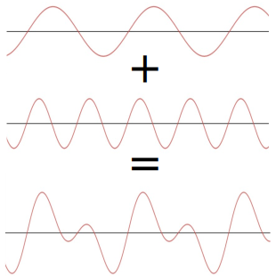
   
Hier is nog een voorbeeld; de rode curve in de animatie benadert een zaagtandsignaal door het optellen van 10 sinussen. We kunnen zien dat dit geen perfecte reconstructie is van de zaagtand - er zou een oneindig aantal sinussen nodig zijn om de scherpe transities van de zaagtand te kunnen reproduceren.

.. image:: ../_images/fourier_series_triangle.gif
   :scale: 70 %   
   :align: center  

Sommige signalen hebben meer sinussen nodig dan andere, en sommige een oneindig aantal, maar ze kunnen altijd worden benaderd met een beperkt aantal. Hier is nog een voorbeeld van een signaal wat wordt opgebouwd door een reeks van sinussen.

.. image:: ../_images/fourier_series_arbitrary_function.gif
   :scale: 70 %   
   :align: center  

Om te begrijpen hoe een signaal kan worden opgebroken in sinussen, of sinusoïden, moeten we eerst de drie eigenschappen van een sinus bekijken:

#. Amplitude
#. Frequentie
#. Fase

**Amplitude** geeft de "kracht" van de golf, terwijl **frequentie** het aantal golven per seconde geeft. **Fase** wordt gebruikt om aan te geven hoever het signaal is verschoven in de tijd, alles tussen 0 en 180 graden (of 0 en :math:`2\pi`). Dit moet wel relatief zijn aan iets anders, zoals twee sinussen met dezelfde frequentie die 30 graden uit fase lopen met elkaar, om wat te kunnen betekenen.

.. image:: images/amplitude_phase_period.svg
   :align: center
   :target: images/amplitude_phase_period.svg
   
Je hebt nu waarschijnlijk door dat een "signaal" in feite een functie is "van de tijd" (dus, de x-as). Een andere makkelijk onthoudbare eigenschap is **periode**, de inverse van **frequentie**. De **periode** van een sinusoïde is de hoeveelheid tijd, in seconden, dat de golf nodig heeft om 1 ronde af te maken. Dus, de eenheid van frequentie is 1/seconden, of Hz.

Wanneer een signaal wordt opgebroken in een sommatie van sinussen, dan zal elke een eigen **amplitude**, **fase** en **frequentie** hebben. De **amplitude** van elke sinus verteld ons hoe sterk deze **frequentie** aanwezig was in het originele signaal. Het enige wat je voor nu over **fase** moet beseffen is dat het verschil tussen een sin() en cos() een faseverschuiving (tijdverschuiving) is.

Het is belangrijker om de onderliggende concepten van de Fourierreeks te begrijpen, dan de vergelijkingen op te kunnen lossen. Maar voor hen die geïnteresseerd zijn verwijs ik je naar de beknopte uitleg van Wolfram: https://mathworld.wolfram.com/FourierSeries.html.  

*********************
Tijd-Frequentie paren
*********************
We hebben vastgesteld dat signalen voorgesteld kunnen worden door een reeks sinussen, die een aantal attributen hebben. 
Laten we nu leren hoe we deze signalen kunnen weergeven in het frequentiedomein.
Terwijl het tijddomein laat zien hoe het signaal varieert over de tijd, laat het frequentiedomein zien hoe sterk het signaal aanwezig is in welke frequenties. 
De x-as stelt dan geen tijd, maar frequentie voor. 
We kunnen een signaal beide in het tijddomein *en* frequentiedomein tonen.
Laten we om te beginnen naar een paar simpele voorbeelden kijken.

Dit is hoe een sinus met frequentie f eruitziet in het tijd- en frequentiedomein:

.. image:: ../_images/sine-wave.png
   :scale: 70 % 
   :align: center  

Het tijddomein moet er bekend uitzien. 
Het is een oscillerende golf. 
Maak je geen zorgen over wanneer de golf start of hoe lang een periode is, wat je moet onthouden is dat het een *enkele frequentie* heeft, waardoor we slechts een enkele piek in het frequentiedomein zien. 
Op welke frequentie de sinus ook oscilleert, dat is de frequentie waar die piek zich zal bevinden in het frequentiedomein. 
De wiskundige naam voor zo'n piek is een "impuls".

En wat als we een impuls in het tijddomein hadden? 
Stel je een opname voor van iemand die in zijn handen klapt of met een hamer slaat. 
Dit tijd-frequentie paar is minder intuïtief.

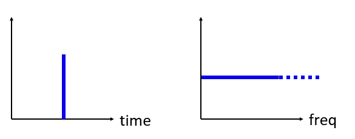

Zoals je ziet, een piek in het tijddomein is een vlakke lijn in het frequentiedomein, en theoretisch bevat het elke frequentie. 
Er is geen praktisch perfecte piek in het tijddomein, want dit zou oneindig kort moeten duren. 
Net als de sinus maakt het niet uit waar in het tijddomein de piek plaatsvindt. 
Wat je moet onthouden is dat snelle veranderingen in het tijddomein zullen leiden tot vele frequenties.

Laten we nu naar de tijd- en frequentiedomein-figuren kijken van een blokgolf:

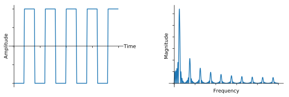

Dit is ook minder intuïtief, maar we kunnen wel een sterke piek in het frequentiedomein zien op 10 Hz, wat de frequentie is van de blokgolf. Het lijkt door te blijven gaan. 
Dit komt door de snelle overgangen in het tijddomein, net als het vorige voorbeeld. 
Het is echter niet vlak in frequentie, maar het heeft pieken op verschillende afstanden en de amplitude neemt langzaam (en oneindig) af. 
Een blokgolf in het tijddomein heeft een sin(x)/x vorm in het frequentiedomein.

En wat als we een constante hebben in het tijddomein? 
Een constant signaal heeft geen "frequentie". 
Kijk maar:

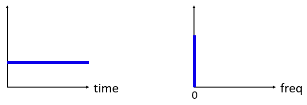
   
Omdat er geen frequentie is, ontstaat er een piek op 0 Hz in het frequentiedomein. 
Als je er over nadenkt, is dit logisch. 
Het frequentiedomein is niet "leeg", want dat zou alleen gebeuren als er helemaal geen signaal is (alleen nullen in het tijddomein). 
We noemen 0 Hz in het frequentiedomein DC omdat het ontstaat door een dc-signaal in de tijd (een constant signaal wat niet verandert). 
Let op dat wanneer we de amplitude van het dc-signaal groter maken, de piek op 0 Hz in het frequentiedomein ook groter wordt.

Later leren we wat precies de y-as in het frequentiedomein betekent. 
Voor nu kun je het bekijken als een soort amplitude dat beschrijft hoe sterk een frequentie aanwezig was in het tijddomein-signaal.

********************
Fouriertransformatie
********************

Wiskundig gezien wordt de "transformatie" die we gebruiken om tussen het tijd- en frequentiedomein te wisselen de Fouriertransformatie genoemd. 
Het is als volgt gedefinieerd:

.. math::
   X(f) = \int x(t) e^{-j2\pi ft} dt

Voor een tijdsignaal x(t) kunnen we de frequentiedomein-versie, X(f), vinden met deze formule. 
We willen de tijddomein-versie van een functie met x(t) of y(t) aangeven, en de corresponderende frequentiedomein-versie met X(f) en Y(F). 
Hierbij staat de "t" voor tijd en "f" voor frequentie. 
De "j" is simpelweg de imaginaire eenheid. 
Misschien herken je dit als "i" van de wiskundelessen. 
We gebruiken "j" in de elektrotechniek en computerkunde omdat "i" vaak gebruikt wordt voor stroom en bij programmeren voor een iterator. 

Teruggaan naar het tijddomein vanuit het frequentiedomein is bijna hetzelfde, afgezien van een vermenigvuldigingsfactor en het minteken:

.. math::
   x(t) = \frac{1}{2 \pi} \int X(f) e^{j2\pi ft} df

Let op dat veel boeken :math:`w` gebruiken in plaats van :math:`2\pi f`.  :math:`w` is de hoekfrequentie in radialen per seconde terwijl  :math:`f` in Hz is. Het enige wat je moet weten is

.. math::
   \omega = 2 \pi f

Ook al voegt dit een :math:`2 \pi`` term toe aan de vergelijkingen, het is toch makkelijker om frequentie in Hz te blijven gebruiken.
Uiteindelijk gebruik je ook Hz in je SDR-applicatie.

De bovenstaande vergelijking voor de Fouriertransformatie, wat je alleen in wiskunde problemen tegenkomt, is in de continue vorm. 
De discrete versie lijkt veel meer op hoe het in de programmacode wordt geïmplementeerd. 

.. math::
   X_k = \sum_{n=0}^{N-1} x_n e^{-\frac{j2\pi}{N}kn}
   
Het grootste verschil hierbij is dat de integraal is vervangen door een sommatie. 
De index :math:`k` loopt van 0 tot N-1.  

Het geeft niet als deze vergelijkingen voor jou niets betekenen. 
We hoeven ze eigenlijk niet eens direct te gebruiken om coole dingen te doen met DSP en SDR's!

*****************************
Tijd-Frequentie Eigenschappen
*****************************

We hebben eerder gekeken naar hoe signalen eruitzien in het tijd- en frequentiedomein. 
Nu zullen we vijf belangrijke "Fourier eigenschappen" gaan behandelen. 
Deze eigenschappen verklaren dat als we ____ doen op het tijdsignaal, dat er ____ gebeurt op het signaal in het frequentiedomein. 
Dit zal ons belangrijke inzichten verschaffen over welke Digitale Signaal Bewerkingen (DSP) we in de praktijk zullen toepassen op onze signalen in het tijddomein.

1. Lineariteit:

.. math::
   a x(t) + b y(t) \leftrightarrow a X(f) + b Y(f)

Deze eigenschap is waarschijnlijk het makkelijkst om te begrijpen. Als we twee signalen optellen in de tijd dan zal de frequentiedomein-versie ook bestaan uit twee opgetelde frequentiedomein-signalen. 
Dit vertelt ons ook dat als we enig signaal vermenigvuldigen met een factor, het signaal in het frequentiedomein met dezelfde factor zal groeien/krimpen. 
Het nut van deze eigenschap zal duidelijker worden wanneer we meerdere signalen gaan optellen.

1. Frequentieverschuiving:

.. math::
   e^{2 \pi j f_0 t}x(t) \leftrightarrow X(f-f_0)

De term links van :math:`x(t)` noemen we een "complexe sinusoïde" of een "complex exponent". 
Voor nu hoef je alleen te weten dat dit effectief gewoon een sinus is met frequentie :math:`f_0`.  
Deze eigenschap vertelt ons dat wanneer we :math:`x(t)` vermenigvuldigen met een sinus, we in het frequentiedomein :math:`X(f)` krijgen, maar verschoven met een frequentie :math:`f_0`. 
Het is makkelijker om deze frequentieverschuiving visueel te weergeven:

.. image:: ../_images/freq-shift.svg
   :align: center 
   :target: ../_images/freq-shift.svg

De frequentieverschuiving is een belangrijk onderdeel van DSP omdat we veel redenen hebben om signalen heen en weer te verschuiven in frequentie. 
Deze eigenschap legt uit hoe we dat kunnen doen (vermenigvuldigen met een sinusoïde). 
Hier is nog een manier om deze eigenschap te laten zien:

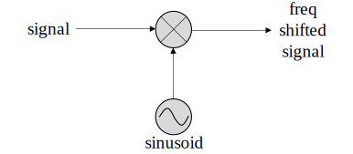
   
3. Vermenigvuldigen in de tijd

.. math::
   x(at) \leftrightarrow X\left(\frac{f}{a}\right)

Aan de linkerkant van de vergelijking zien we dat we ons signaal :math:`x(t)` vermenigvuldigen in de tijd. 
Hieronder een voorbeeld van een signaal wat in de tijd wordt vermenigvuldigd, en wat er gebeurt in de frequentieversie van het signaal.

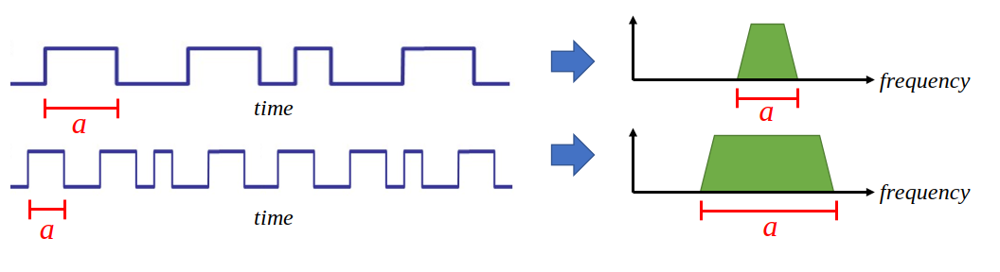

Effectief betekent vermenigvuldigen in de tijd dat je het signaal uitrekt of krimpt in de x-as richting. 
Deze eigenschap vertelt ons dat vermenigvuldigen in de tijd een deling tot effect heeft in het bereik van frequenties. 
Als voorbeeld, wanneer we bits sneller oversturen zullen we meer frequenties moeten gebruiken. 
Deze eigenschap helpt dus uit te leggen waarom signalen met een hogere bitrate ook meer bandbreedte/spectrum innemen. 
Als tijd-frequentie vermenigvuldiging recht evenredig zou zijn in plaats van omgekeerd evenredig, dan zouden de telefoonmaatschappijen zoveel bits per seconden kunnen versturen als ze wilden, zonder hiervoor miljarden uit te geven voor het spectrum!

Diegenen die bekend zijn met deze eigenschap valt het misschien op dat er een factor mist; deze is weggelaten voor de eenvoud.
Praktisch gezien heeft deze factor geen invloed.

4. Convolutie in de tijd

.. math::
   \int x(\tau) y(t-\tau) d\tau  \leftrightarrow X(f)Y(f)

Dit heet de convolutie eigenschap omdat we in het tijddomein :math:`x(t)` en :math:`y(t)` convolueren. Misschien ken je de convolutie-operatie nog niet, dus bekijk het voor nu als een kruiscorrelatie. 
Wanneer we tijddomein-signalen convolueren is dit gelijkwaardig aan het vermenigvuldigen van de frequentiedomein-signalen. 
Het is totaal anders dan twee signalen bij elkaar optellen. 
Wanneer je twee signalen bij elkaar optelt, gebeurt er bijna niets, zoals je hebt gezien, je telt gewoon de frequentiedomein-versies bij elkaar op. 
Maar wanneer je twee signalen convolueert is het alsof je een derde signaal creëert. 
Convolutie is de belangrijkste techniek in DSP, maar we moeten eerst begrijpen hoe filters werken om dit te laten bezinken.

Om uit te leggen hoe belangrijk deze eigenschap is, kijken we eerst naar deze situatie voor we verder gaan: Je hebt een signaal dat je wilt ontvangen en er staat een interfererend signaal naast. 

.. image:: ../_images/two-signals.svg
   :align: center
   :target: ../_images/two-signals.svg
   
Het concept van maskeren wordt bij programmeren veel toegepast, dus laten we dat hier ook doen. 
Wat als we het onderstaande masker zouden kunnen maken, en dit kunnen vermenigvuldigen met het bovenstaande signaal om het signaal wat we niet willen te maskeren?

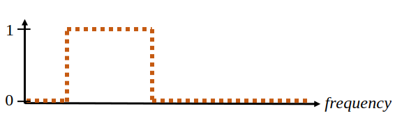

Meestal voeren we DSP-operaties uit in het tijddomein, dus laten we de convolutie eigenschap gebruiken om te kijken hoe we dit in het tijddomein voor elkaar kunnen krijgen. 
Laten we zeggen dat :math:`x(t)` ons ontvangen signaal is. 
Laat :math:`Y(f)` het masker zijn wat we in het frequentiedomein willen toepassen. 
Dat zou betekenen dat :math:`y(t)` de tijddomein-versie is van ons masker, en wanneer we dit convolueren met :math:`x(t)` het signaal "wegfilteren" dat we niet willen.

.. This shows the carrier wave formula
.. tikz:: [font=\Large\bfseries\sffamily]
   \definecolor{babyblueeyes}{rgb}{0.36, 0.61, 0.83}
   \draw (0,0) node[align=center,babyblueeyes]           {Bijv. ons ontvangen signaal};
   \draw (0,-4) node[below, align=center,babyblueeyes]   {Bijv. ons masker}; 
   \draw (0,-2) node[align=center,scale=2]{$\int x(\tau)y(t-\tau)d\tau \leftrightarrow X(f)Y(f)$};   
   \draw[->,babyblueeyes,thick] (-4,0) -- (-5.5,-1.2);
   \draw[->,babyblueeyes,thick] (2.5,-0.5) -- (3,-1.3);
   \draw[->,babyblueeyes,thick] (-2.5,-4) -- (-3.8,-2.8);
   \draw[->,babyblueeyes,thick] (3,-4) -- (5.2,-2.8);
     

.. .. image:: ../_images/masking-equation.png
..    :scale: 100 % 
..    :align: center 

Wanneer we filters gaan behandelen zal de convolutie eigenschap duidelijker worden.

1. Convolutie in Frequentie:

Als laatste wil ik opmerken dat de convolutie eigenschap ook omgekeerd werkt, maar dit zullen we niet zoveel gebruiken als convolutie in het tijddomein:

.. math::
   x(t)y(t)  \leftrightarrow  \int X(g) Y(f-g) dg

Er zijn nog meer eigenschappen, maar de bovenstaande vijf zijn naar mijn mening de meest cruciale om te begrijpen. 
Ook al zijn we niet door alle bewijzen heengelopen, de crux is dat we wiskundige eigenschappen gebruiken om inzicht te verschaffen in wat er gebeurt met echte signalen wanneer we deze analyseren en bewerken. 
Blijf niet hangen op de vergelijkingen, zorg ervoor dat je de beschrijving van elke eigenschap begrijpt.

****************************
Fast Fourier Transform (FFT)
****************************

Terug naar de Fouriertransformatie. 
Ik heb je de vergelijking van de discrete Fouriertransformatie al laten zien, maar wat je voor 99.9% van de tijd zult gebruiken bij het programmeren is de FFT functie, fft(). 
De Fast Fourier Transform (FFT) (Nederlands: Snelle Fouriertransformatie) is simpelweg een algoritme om de discrete Fouriertransformatie uit te voeren. 
Ook al is het decennia geleden bedacht en zijn er vele variaties op de implementatie, het is nog steeds het meest gebruikte algoritme om de discrete Fouriertransformatie te berekenen. 
Gelukkig maar, gezien ze "Fast" of "Snel" in de naam hebben gebruikt.

De FFT is een functie met een in- en uitgang. Het zet een signaal om van tijd naar frequentie:

.. image:: ../_images/fft-block-diagram.svg
   :align: center
   :target: ../_images/fft-block-diagram.svg
   
In dit boek zullen we alleen 1-dimensionale FFT's gebruiken (2D wordt bijvoorbeeld toegepast voor beeldverwerking). Voor ons doel, behandel de FFT als iets met een ingang: een vector van samples (samples), en een output: de frequentiedomein-versie van die vector met samples. 
De lengte van de uitgang is altijd gelijk aan de ingang. 
Als ik 1024 samples in de FFT stop, krijg ik er 1024 uit. Het verwarrende is dat de uitgang altijd in het frequentiedomein zit, dus het "bereik" van de frequentie-as verandert niet met het aantal samples van de tijddomein-ingang. We kunnen dit visualiseren door de in- en uitgangsvectoren en de eenheid van de elementen te bekijken:

.. image:: ../_images/fft-io.svg
   :align: center
   :target: ../_images/fft-io.svg

Omdat de uitgang in het frequentiedomein zit, is het bereik van de frequentie-as gebaseerd op de sample-frequentie (sample rate). Dit zal volgend hoofdstuk behandeld worden. 
Als we meer samples gebruiken voor de ingangsvector dan krijgen we een hogere resolutie in het frequentiedomein (en we behandelen meer samples per keer). We zien niet "meer" (een groter bereik aan) frequenties wanneer we de ingang groter maken. 
De enige manier om dat te bereiken is door de sample-frequentie te verhogen (en de periodetijd :math:`\Delta t` te verlagen).

Hoe kunnen we de uitgang weergeven? 
Ga er als voorbeeld van uit dat de sample-frequentie 1 miljoen samples per seconde was (1 MHz). Zoals we volgend hoofdstuk zullen leren betekent dit, dat we enkel signalen tot een 0.5 MHz zullen zien, onafhankelijk van de hoeveelheid samples aan de ingang van de FFT. 
We kunnen de uitgang als volgt representeren:

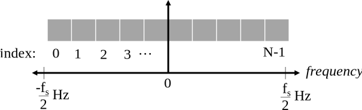

Dit is altijd het geval; de uitgang van de FFT zal :math:`\text{-} f_s/2` tot :math:`f_s/2` laten zien, waar :math:`f_s` de sample-frequentie is.  
Dat betekent dat de uitgang altijd een positief en negatief deel heeft. Als de ingang complex is dan zijn beide helften verschillend, als de ingang reëel is dan zijn de helften identiek.

Over het bereik van frequenties; elk equidistant punt (Engels: bin) komt overeen met :math:`f_s/N` Hz, d.w.z., meer samples aan de ingang geven zal leiden tot een hogere resolutie/kleinere stapjes aan de uitgang. 
Een klein detail wat je kunt negeren als je nieuw bent: wiskundig gezien hoort het laatste element niet *precies* bij :math:`f_s/2`, maar bij :math:`f_s/2 - f_s/N` wat voor grote :math:`N` gelijk wordt aan :math:`f_s/2`.

*********************
Negatieve Frequenties
*********************

Wat is nu weer een negatieve frequentie? Voor nu heeft dit te maken met complexe (imaginaire) getallen, er is niet zoiets als "negatieve frequentie" bij het verzenden/ontvangen van RF-signalen. 
Het is slechts hoe we dingen weergeven. 
Hier is een intuïtieve manier om erover na te denken. 
Stel voor dat we onze SDR instellen op een middenfrequentie van 100 MHz (de FM-radio band) en dit samplen op een frequentie van 10 MHz. 
In andere woorden, we bekijken het spectrum van 95 MHz tot 105 MHz. 
Misschien zijn er drie signalen aanwezig:

.. image:: ../_images/negative-frequencies2.svg
   :align: center
   :target: ../_images/negative-frequencies2.svg
   
Wanner de SDR ons de samples teruggeeft ziet het er zo uit:

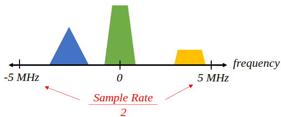

Vergeet niet dat we de SDR op 100 MHz hebben ingesteld. 
Dus het signaal dat op ongeveer 97.5 MHz zat, is wanneer we het digitaal bekijken, te zien op -2.5 MHz, wat technisch gezien een negatieve frequentie is. 
Reëel gezien is dit gewoon een frequentie die lager is dan de middenfrequentie. 
Dit wordt logischer wanneer we meer over samplen leren en ervaring opdoen met onze SDR's.

**********************************
Volgorde in de tijd maakt niet uit
**********************************
Nog een laatste eigenschap voordat we naar het gebruik van de FFT gaan. 
De FFT "mixt" soort van het ingangssignaal naar de uitgang, wat een andere schaal en eenheden heeft. 
We zitten namelijk niet langer in het tijddomein. 
Een goede manier om dit te onthouden is om te beseffen dat de volgorde waarin dingen gebeuren in het tijddomein geen invloed heeft op hoe het frequentiedomein er uit ziet. 
D.w.z., de FFT van het volgende signaal zal dezelfde twee pieken laten zien, want het signaal bestaat gewoon uit twee sinussen met verschillende frequenties. 
Het feit dat er twee frequenties zijn, verandert niet wanneer we de volgorde van de sinussen omdraaien.

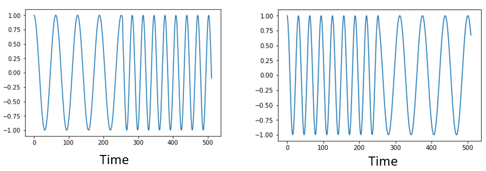

Technisch gezien zal de fase van de FFT-waarden wel veranderen vanwege het verschuiven in de tijd van de sinussen. 
We zullen echter ons alleen druk maken over de amplitude voor de volgende paar hoofdstukken van dit boek.

*************
FFT in Python
*************

Nu we hebben gezien wat een FFT is en hoe de uitgang eruit ziet, zullen we gaan kijken naar wat Python code en NumPy's FFT functie, :code:`np.fft.fft()`, toepassen. Het wordt aangeraden dat je een Python console/IDE op je computer gebruikt, maar eventueel zou je ook de online Python console kunnen gebruiken dat je onderaan de linker navigatiebalk kunt vinden.

Eerst moeten we een signaal maken in het tijddomein. Voel je vrij om zelf met de Python console mee te doen. Om dingen eenvoudig te houden maken we een enkele sinus op 0.15 Hz. We nemen ook een sample-frequentie van 1 Hz, wat betekent dat we samples nemen op 0, 1, 2, 3 seconden, etc.

.. code-block:: python

 import numpy as np
 t = np.arange(100)
 s = np.sin(0.15*2*np.pi*t)

Als we :code:`s` plotten lijkt dit op:

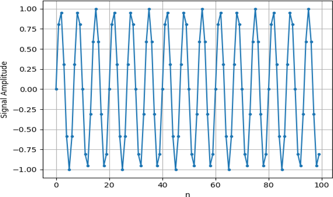

Laten we nu Numpy's FFT-functie gebruiken:

.. code-block:: python

 S = np.fft.fft(s)

Als we de inhoud van :code:`S` bekijken, zien we dat het een array is van complexe getallen: 

.. code-block:: python

    S =  array([-0.01865008 +0.00000000e+00j, -0.01171553 -2.79073782e-01j,0.02526446 -8.82681208e-01j,  3.50536075 -4.71354150e+01j, -0.15045671 +1.31884375e+00j, -0.10769903 +7.10452463e-01j, -0.09435855 +5.01303240e-01j, -0.08808671 +3.92187956e-01j, -0.08454414 +3.23828386e-01j, -0.08231753 +2.76337148e-01j, -0.08081535 +2.41078885e-01j, -0.07974909 +2.13663710e-01j,...

Hint: Wat je ook aan het doen bent, als je ooit complexe getallen tegenkomt, bereken dan de modulus en fase en bekijk of dat er logischer uitziet. Laten we dat doen en de modulus en fase weergeven. In de meeste talen geeft de abs()-functie de modulus van een complex getal. De functie om de fase te bepalen varieert, maar in Python kan dit met :code:`np.angle()`.

.. code-block:: python

 import matplotlib.pyplot as plt
 S_mod = np.abs(S)
 S_fase = np.angle(S)
 plt.plot(t,S_mod,'.-')
 plt.plot(t,S_fase,'.-')

.. image:: ../_images/fft-python2.png
   :scale: 80 % 
   :align: center 

Momenteel hebben we de plot nog geen x-as gegeven, het is gewoon de index van de array (tellen vanaf 0). Door wiskundige redenen heeft de uitgang van de FFT deze vorm:

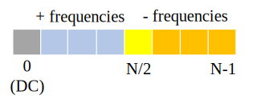
   
Maar we willen 0 Hz (DC) in het midden hebben, en de negatieve frequenties daar links van (zo willen we dat gewoon zien). 
Dus telkens wanneer we een FFT uitvoeren, moeten we ook een "FFT shift" of verschuiving doen. 
Dit is simpelweg een herordening van de array, dit lijkt op een circulaire verschuiving, maar is meer een "stop dit daar en dat hier" operatie. 
Het diagram hieronder laat zien wat deze FFT-shift doet:

.. image:: ../_images/fft-python4.svg
   :align: center
   :target: ../_images/fft-python4.svg

Voor ons gemak heeft Numpy een FFT-shift functie :code:`np.fft.fftshift()`.  Vervang de np.fft.fft() regel met:

.. code-block:: python

 S = np.fft.fftshift(np.fft.fft(s))

Nu moeten we nog de x-as waardes/label uitvogelen. We hebben een sample-frequentie van 1 Hz gebruikt om dingen simpel te houden. Dat betekent dat de linker kant van de frequentiedomein-plot -0.5 Hz zal zijn en de rechter kant 0.5 Hz. Als dat nu nog niet logisch klinkt, wordt dat duidelijker in het hoofdstuk over :ref:`sampling-chapter`.  Laten we ervan uitgaan dat onze sample-frequentie 1 Hz is en de modulus en fase tonen van de uitgang van de FFT. Hier is de volledige versie van dit Python voorbeeld:

.. code-block:: python

 import numpy as np
 import matplotlib.pyplot as plt
 
 Fs = 1 # Hz
 N = 100 # aantal punten om te simuleren, en onze FFT lengte
 
 t = np.arange(N) # want de sample-frequentie is 1 Hz
 s = np.sin(0.15*2*np.pi*t)
 S = np.fft.fftshift(np.fft.fft(s))
 S_mod = np.abs(S)
 S_fase = np.angle(S)
 f = np.arange(Fs/-2, Fs/2, Fs/N)
 plt.figure(0)
 plt.plot(f, S_mod,'.-')
 plt.figure(1)
 plt.plot(f, S_fase,'.-')
 plt.show()

.. image:: ../_images/fft-python5.png
   :scale: 80 % 
   :align: center 

We zien onze piek op 0.15 Hz, de frequentie die we gebruikten voor onze sinus. Dit betekent dat onze FFT werkt! Als we de code dat onze sinus genereert niet hadden, maar wel een lijst met samples, dan zouden we de FFT kunnen gebruiken om de frequentie te bepalen! De reden dat we ook een piek zien op -0.15 Hz is omdat we werken met een reëel signaal, niet complex. Daar gaan we later dieper op in. 

**************
Vensterfunctie
**************

Wanneer we een FFT gebruiken om de frequenties in ons signaal te bepalen, gaat de FFT ervan uit dat de ingang een *periodiek* signaal bevat. Het gedraagt zich alsof het signaal dat we geven zich oneindig herhaald. Het is alsof het laatste sample verbonden is aan het eerste sample. Dit vindt zijn basis in de theorie achter de Fouriertransformatie. Het betekent ook dat we plotselinge overgangen willen voorkomen tussen het eerste en laatste sample, want plotselinge veranderingen lijken op een boel frequenties. In werkelijkheid verbindt ons laatste sample niet met het eerste. Simpel gezegd: Wanneer we een FFT uitvoeren van 100 samples met :code:`np.fft.fft(x)`, willen we dat :code:`x[0]` en :code:`x[99]` (bijna) gelijk zijn.

We kunnen aan deze cyclische eigenschap voldoen met behulp van een "venster". Net voor de FFT vermenigvuldigen we het signaal met een vensterfunctie. Dit is een functie dat aan beide kanten naar 0 gaat. Dit zal ervoor zorgen dat het deel van het signaal zal beginnen en eindigen bij 0, en dus zal verbinden. Veel voorkomende vensterfuncties zijn Hamming, Hanning, Blackman en Kaiser. Wanneer je geen venster toepast heet het een "rechthoekig" venster want het is alsof je het vermenigvuldigt met een array vol enen. Dit is hoe diverse vensterfuncties eruitzien:

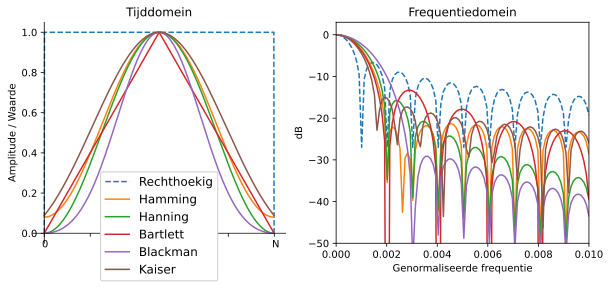

Een simpele benadering voor beginners is om gewoon het Hamming venster te gebruiken. Dit kun je in Python maken met :code:`np.hamming(N)` waarbij N het aantal elementen in de array en onze FFT-grootte is. In het bovenstaande voorbeeld zouden we het venster toepassen net voor de FFT. Achter de tweede lijn code voegen we toe:

.. code-block:: python

   s = s*np.hamming(100)

Niet bang zijn om het verkeerde venster te kiezen. Het verschil tussen Hamming, Hanning, Blackman en Kaiser is minimaal vergeleken met werken zonder venster. Ze gaan allemaal aan beide kanten naar 0 toe en lossen het onderliggende probleem op.

***********
FFT grootte
***********

Het laatste om te behandelen is de FFT-grootte. Vanwege de manier waarop de FFT is geïmplementeerd is de beste lengte van de FFT altijd een macht van 2. Je kunt wel een andere lengte gebruiken, maar dat is langzamer. Veelgebruikte lengtes zijn tussen de 128 en 4096, maar het kan zeker langer zijn. In de praktijk moeten we signalen verwerken die misschien wel miljoenen of miljarden samples lang zijn, en dus moeten opbreken in vele FFT’s. Dit betekent dat we ook vele uitgangen krijgen. We kunnen al die uitgangen middelen of weergeven over de tijd (zeker wanneer het signaal verandert over de tijd). Je hoeft niet *elk* sample van een signaal in de FFT te stoppen om een goede voorstelling te krijgen van de frequentiedomein-versie van dat signaal. Je zou bijvoorbeeld een 1024 FFT kunnen uitvoeren op elke 100e3 samples in een signaal en het zal er waarschijnlijk nog steeds goed uitzien, zolang het signaal altijd aan blijft.

********************
Spectrogram/Waterval
********************

Een spectrogram is een plot dat de frequentieverandering over de tijd laat zien. Het is simpel weg een hoop FFT’s op elkaar gestapeld (verticaal als je de frequentie op de horizontale as wilt hebben). We kunnen het ook real-time laten zien, dit heet meestal een waterval. Een spectrumanalyzer is het apparaat wat dit spectrogram/waterval laat zien. Hier is een voorbeeld van een spectrogram, met de frequentie op de horizontale/x-as en tijd op de verticale/y-as. Blauw stelt de laagste energie voor, en rood de hoogste. We zien in het midden een sterke piek op DC (0 Hz) met daarom heen een variërend signaal. Blauw laat hier onze ruisvloer zien.

.. image:: ../_images/waterfall.png
   :scale: 120 % 
   :align: center 

Probeer als oefening de Python code te schrijven waarmee we zo'n spectrogram kunnen maken. Bedenk dat het slechts op elkaar gestapelde rijen van FFT’s zijn. Elke rij is 1 FFT. Zorg ervoor dat je het tijdsignaal opbreekt in delen van jouw FFT-grootte (bijv. 1024 samples per deel). Om dingen simpel te houden kun je een reëel signaal invoeren en simpelweg het negatieve deel van de frequenties weggooien voordat je het spectrogram plot. Je kunt het volgende signaal als voorbeeld gebruiken, een enkele toon met witte ruis:

.. code-block:: python

 import numpy as np
 import matplotlib.pyplot as plt
 
 sample_rate = 1e6
 
 # Genereer de toon met ruis
 t = np.arange(1024*1000)/sample_rate # tijd vector
 f = 50e3 # freq van toon
 x = np.sin(2*np.pi*f*t) + 0.2*np.random.randn(len(t))

Zo ziet het eruit in het tijddomein (de eerste 200 samples):

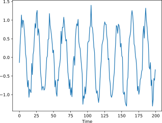

.. raw:: html

   

   
Voorbeeld spectrogram code (Probeer het eerst zelf te schrijven!)

.. code-block:: python

 # Simuleer het bovenstaande signaal, of gebruik je eigen signaal
  
 fft_lengte = 1024
 aantal_rijen = int(np.floor(len(x)/fft_lengte))
 spectrogram = np.zeros((aantal_rijen, fft_lengte))
 for i in range(aantal_rijen):
     spectrogram[i,:] = 10*np.log10(np.abs(np.fft.fftshift(np.fft.fft(x[i*fft_lengte:(i+1)*fft_lengte])))**2)
 spectrogram = spectrogram[:,fft_lengte//2:] # negatieve frequenties weggooien want ons signaal is reeel
 
 plt.imshow(spectrogram, aspect='auto', extent = [0, sample_rate/2/1e6, 0, len(x)/sample_rate])
 plt.xlabel("Frequency [MHz]")
 plt.ylabel("Time [s]")
 plt.show()

Dit zou het volgende moeten opleveren, wat niet zo spannend is want er is geen tijd variërend gedrag. Als extra oefening kun je het signaal laten variëren in de tijd, bekijk bijv. of je de toon kunt laten starten en stoppen.

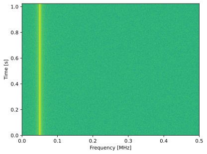
   
.. raw:: html

   

