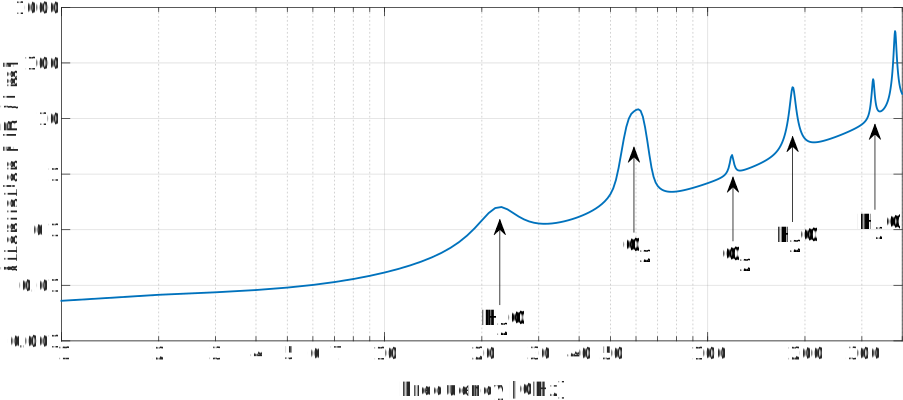

.. _link-budgets-chapter:

##################
Link Budgets
##################

In dit hoofdstuk gaan we het hebben over "link budgetten". Een groot deel hiervan is het begrip van zend- en ontvangstvermogen, transmissieverlies, antenneversterking, ruis en signaal-ruisverhouding (SNR). We zullen eindigen met een voorbeeldbudget voor ADS-B, een signaal wat door commerciële vliegtuigen wordt uitgezonden om hun positie en overige informatie door te geven.

*************************
Introductie
*************************

Een "link" budget is een opsomming van alle winsten en verliezen tussen de zender en ontvanger van een communicatiesysteem.
Het beschrijft een richting van een draadloos kanaal.
De meeste communicatiesystemen zijn echter bi directioneel en hebben dus aparte up- en downlink budgetten.
Het resultaat van zo'n budget geeft je een grove inschatting van de signaal-ruisverhouding (SNR) die je kunt verwachten bij de ontvanger.
Na verdere analyse kun je dan besluiten of de SNR hoog genoeg is voor jouw doel.

We bestuderen linkbudgetten niet zodat je er zelf een op kunt stellen, maar meer om een beeld te krijgen van draadloze communicatie op systeemniveau.

Eerst zullen we het budget van het ontvangen signaal beschouwen, dan het ruisvermogensbudget en als laatste zullen we die combineren om de SNR te vinden (Signaalvermogen gedeeld door ruisvermogen).

*************************
Signaalvermogensbudget
*************************

Hieronder zie je het meest simpele diagram wat je zou kunnen opstellen voor een algemene draadloze keten.
In dit hoofdstuk zullen we een richting behandelen, namelijk vanaf de zender (Tx) naar ontvanger (Rx).
We weten voor een gegeven systeem wat het zendvermogen is; dit is meestal een instelling bij de zender.
Maar hoe bepalen we het vermogen wat aankomt bij de ontvanger?

.. tikz:: [auto, node distance=2cm,>=latex',font=\sffamily]
  \tikzset{block/.style = {draw, fill=white, rectangle,
                    minimum height=3em, minimum width=2cm},
          input/.style = {coordinate},
          output/.style = {coordinate},
          pinstyle/.style = {pin edge={to-,t,black}}
      }
  \node[block](tx)                          {zender};
  \node[antenna](txant) at (tx.north) {};
  \draw[snake=expanding waves] (txant.north east) -- ++(1,0);
  \node[block,right = 6cm of tx](rx)        {ontvanger};
  \node[antenna,xscale=-1] at (rx.north) {};
  :libs: positioning,shapes,arrows,snakes
  :xscale: 80

.. .. image:: ../_images/tx_rx_system.svg
..    :align: center 
..    :target: ../_images/tx_rx_system.svg

We hebben vier systeemparameters nodig om het ontvangen vermogen te bepalen. Deze zijn hieronder opgesomd samen met de meest gebruikte (Engelstalige) afkortingen.
We zullen ieder apart behandelen in dit hoofdstuk.

- **Pt** - Vermogen van zender (Power transmitter)
- **Gt** - Antenneversterking zender (Gain transmitter)
- **Gr** - Antenneversterking ontvanger (Gain receiver)
- **Lt** - Afstand tussen zender en ontvanger dus hoeveelheid transmissieverlies (Path Loss)

.. tikz:: [auto, node distance=2cm,>=latex',font=\sffamily\small]
  \tikzset{block/.style = {draw, fill=white, rectangle,
                    minimum height=3em, minimum width=2cm},
          input/.style = {coordinate},
          output/.style = {coordinate},
          pinstyle/.style = {pin edge={to-,t,black}}
      }
  \node[block](tx)                            {zender};
  \node[block,right = 6cm of tx](rx)          {ontvanger};
  \node[antenna](txant) at (tx.north) {};
  \node[antenna,xscale=-1](rxant) at (rx.north) {};
  \draw[snake=expanding waves] 
    (txant.east) -- ++(1,0) coordinate(begin);
  \draw[ultra thick,gray] 
    (begin) -- ++(2,0) coordinate(midden);
  \draw[->,ultra thick, gray] 
    (midden) -- ++(2,0) node[right,align=center]  {Ontvangen\\vermogen \textbf{Pr}};
  \draw (midden) node[align=center, below]        {transmissieverlies\\\textbf{Lp}};
  \node[above=1cm of txant.north,align=center]    {Antenneversterking\\zender \textbf{Gt}};
  \node[above=1cm of rxant.north,align=center]    {Antenneversterking\\ontvanger \textbf{Gr}};
  \node[above right = 1 cm of txant.east,align=center]     {Zendvermogen\\\textbf{Gt}};
  :libs: positioning,shapes,arrows,snakes
  :xscale: 100

.. .. image:: ../_images/tx_rx_system_params.svg
..    :align: center 
..    :target: ../_images/tx_rx_system_params.svg

Zendvermogen
#####################

Zendvermogen is vrij simpel; het is uitgedrukt in Watt, dBW or dBm (dBm is een afkorting voor dBmW).
Elke zender heeft een of meerdere versterkers,  het zendvermogen is voornamelijk een eigenschap van die versterkers.
Een analogie voor zendvermogen is het vermogen van een lamp: hoe meer vermogen in Watt, hoe meer licht wordt uitgezonden door de lamp.
Hieronder staan wat gemiddelde vermogens van verschillende technologieën:

==================  =====  =======
\                       Power    
------------------  --------------
Bluetooth           10 mW  -20 dBW   
WiFi                100mW  -10 dBW
LTE station         1W     0 dBW
FM station          10kW   40 dBW
==================  =====  =======

Antenneversterking
#####################

De antenneversterking van zend- en ontvangstantennes zijn een cruciaal onderdeel van linkbudgetten.
Maar wat is antenneversterking?
Het is een indicatie van de richtingskarakteristiek.
Soms wordt het vermogensversterking genoemd, maar laat je niet misleiden, de enige manier voor een antenne om een hogere versterking te hebben is door de energie/straling te bundelen in een kleiner gebied.

Versterkingsfactoren worden uitgedrukt in dB (zonder eenheid), zie het :ref:`noise-chapter` hoofdstuk voor een opfriscursus.
Antennes zijn of omnidirectioneel (omni-antenne), dus het vermogen straalt in alle richtingen, of directioneel (richtantenne), het vermogen straalt een specifieke kant op.
Omni-antennes hebben een versterking tussen 0 dB en 3 dB.
Een richtantenne heeft een hogere versterking van 5 dB tot ongeveer 60 dB.

.. image:: ../_images/antenna_gain_patterns.png
   :scale: 80 % 
   :align: center 

Wanneer een richtantenne wordt toegepast zal het de juiste kant op moeten wijzen.
Als het een fase gestuurde antenne is dan kan het ook elektronisch worden gericht (dus met software).

.. image:: ../_images/antenna_steering.png
   :scale: 80 % 
   :align: center 

Wanneer er geen specifieke richting is, worden omni-antennes toegepast, zoals voor een mobiele telefoon of laptop.
Bij 5G kan een telefoon op hogere frequentiebanden werken zoals 26 GHz met een array van antennes en het elektronisch regelen van de bundelrichting.

Bij het opstellen van een linkbudget moeten we ervan uit gaan dat een richtantenne (zender of ontvanger) de juiste richting op wijst.
Als het niet de juiste kant op wijst dan is ons budget niet precies en vindt er verlies van communicatie plaats (wanneer bijvoorbeeld de tv-schotel verdraait door een bal).
Over het algemeen gaat ons linkbudget van een ideale situatie uit terwijl we de verliezen van zoveel mogelijke echte factoren meenemen.

Transmissieverlies (Path Loss)
##############################

Wanneer een signaal zich door de lucht (of vacuüm) beweegt, verliest het kracht.
Stel je voor dat je een klein zonnepaneel voor een lamp houdt.
Hoe verder je van de lamp afstaat, hoe minder energie het kan absorberen.
In de natuur- en wiskunde wordt **flux** gebruikt om aan te geven hoeveel "spul door je ding" gaat.
We willen bepalen hoeveel vermogen we kwijtraken voor een gegeven afstand.

.. image:: ../_images/flux.png
   :scale: 80 % 
   :align: center 

Free Space Path Loss (FSPL) of transmissieverlies in vrije ruimte geeft ons het verlies wanneer er geen obstakels tussen zender en ontvanger staan.
In het algemeen :math:`\mathrm{FSPL} = ( 4\pi d / \lambda )^2`. 
Google Friis transmissieformule voor meer informatie.
(Leuk weetje: signalen ervaren 377 ohm aan impedantie wanneer ze door de vrije ruimte bewegen.)
Bij het opstellen van ons linkbudget kunnen we dezelfde formule toepassen, maar omgezet naar dB:

.. math::
 \mathrm{FSPL}_{dB} = 20 \log_{10} d + 20 \log_{10} f - 147.55 \left[ dB \right]

Dit wordt uitgedrukt in de eenheid loze vorm dB omdat het een verlies betreft.
:math:`d` is de afstand tussen zender en ontvanger in meters.
:math:`f` is de draaggolffrequentie in Hz.
Er is alleen een probleem met deze vergelijking; er staan bijna altijd obstakels tussen zender en ontvanger.
Binnenshuis stuiteren signalen ook nog eens (de meeste frequenties gaan door gipsmuren heen, maar niet (goed) door metaal of dikke baksteenmuren).
In deze situaties worden andere modellen gebruikt.
Een veelgebruikt model voor steden en bewoonde gebieden is het Okumura–Hata model:

.. math::
 L_{path} = 69.55 + 26.16 \log_{10} f - 13.82 \log_{10} h_B - C_H + \left[ 44.9 - 6.55 \log_{10} h_B \right] \log_{10} d

Hierbij is :math:`L_{path}` het transmissieverlies in dB, :math:`h_B` is de hoogte van de antenne boven de grond in meters, :math:`f` is de draaggolffrequentie in MHz, :math:`d` is de afstand tussen zender en ontvanger in km en :math:`C_H` wordt de "antenne correctiefactor" genoemd en wordt gedefinieerd aan de hand van het frequentiebereik en de grootte van de stad:

:math:`C_H` voor dorpen:

.. math::
 C_H = 0.8 + (1.1 \log_{10} f - 0.7 ) h_M - 1.56 \log_{10} f

:math:`C_H` voor steden met :math:`f` onder 200 MHz:

.. math::
 C_H = 8.29 ( log_{10}(1.54 h_M))^2 - 1.1
 
:math:`C_H` voor steden met :math:`f` tussen 200 MHz en 1.5 GHz:

.. math::
 C_H = 3.2 ( log_{10}(11.75 h_M))^2 - 4.97

waarbij :math:`h_M` de hoogte van de ontvangstantenne is boven de grond in meters.

Maak je geen zorgen als dit allemaal verwarrend is; het wordt hier getoond om te laten zien dat het model met obstakels veel ingewikkelder is dan de simpele FSPL vergelijking. Het resultaat van deze modellen is een enkel getal dat we kunnen gebruiken in ons linkbudget. We blijven FSPL gebruiken voor de rest van dit hoofdstuk.

Overige verliezen
#####################

We willen ook de overige willekeurige verliezen meenemen in ons budget. We zullen deze allemaal in een term samen gooien. Het zal een waarde hebben van ergens tussen de 1 en 3 dB.
Voorbeelden van verliezen die hieronder vallen:

- Verlies door kabels
- Verlies door de atmosfeer
- Verlies door niet perfect gerichte antennes
- Het weer (regen, sneeuw etc.)

De onderstaande grafiek laat zien wat de verliezen zijn in de atmosfeer voor bepaalde frequenties, uitgedrukt in dB/km.
Als je het figuur bestudeert zie je dat communicatie bij een afstand korter dan 1km en een frequentie kleiner dan 40 GHz er een verlies van maximaal 1 dB plaatsvindt. In dit geval negeren we vaak het verlies. Waar de atmosfeer echt invloed gaat hebben is in het geval van satellietcommunicatie, waar de signalen vele kilometers door de atmosfeer afleggen.

Signaalvermogen
#####################

Het is nu tijd om het signaalvermogen (:math:`P_r`) bij de ontvanger te berekenen door alle verliezen samen te voegen:

.. math::
 P_r = P_t + G_t + G_r - L_p - L_{misc} \quad \mathrm{dBW}

Het is een vrij simpele vergelijking. We tellen alle winsten en verliezen bij elkaar op. Sommige mensen vinden dit niet eens een vergelijking.
Meestal laten we de winsten en verliezen in een tabel zien, zoals we dat met financiën doen:

.. list-table::
   :widths: 15 10
   :header-rows: 0
   
   * - Pt = 1.0 W
     - 0 dBW
   * - Gt = 100
     - 20.0 dB
   * - Gr = 1
     - 0 dB
   * - Lp
     - -162.0 dB
   * - Lmisc
     - -1.0 dB
   * - **Pr**
     - **-143.0 dBW**

*************************
Ruisvermogen
*************************

Nu we het signaalvermogen hebben, gaan we overschakelen naar het ruisvermogen, we moeten immers de signaal-ruisverhouding bepalen.
Het bepalen van het ruisvermogen gaan we op een vergelijkbare manier doen als het signaalvermogen.

Het is nu een goed moment om te bespreken waar ruis ons kanaal binnenkomt. Antwoord: **Bij de ontvanger**!
Het signaal wordt niet verpest door de ruis totdat we het gaan ontvangen. Het is *extreem* belangrijk om dit te begrijpen.
Veel studenten maken dit zich niet eigen en maken daardoor domme fouten.
Er zweeft geen ruis door de lucht. 
De ruis ontstaat doordat onze ontvanger een versterker en andere elektronica heeft die niet perfect zijn en ook niet op 0 Kelvin werken.

Een populaire vergelijking voor het ruisbudget maakt gebruik van de "kTB" aanpak:

.. math::
 P_{noise} = kTB

- :math:`k` – Boltzmann’s constante = 1.38 x 10-23 J/K = **-228.6 dBW/K/Hz**. De Bolzmann constante, voor de nieuwsgierigen onder ons, is een fysische constante wat de gemiddelde energie van deeltjes in een gas relateert aan de temperatuur van het gas.

- :math:`T` – Is de temperatuur van het systeem in Kelvin (cryocoolers anyone?), voornamelijk veroorzaakt door de versterker. Deze term is moeilijk te vinden en wordt meestal alleen benadert. Je betaalt meer voor een versterker die een lage temperatuur kan behouden voor hetzelfde vermogen.

- :math:`B` – Bandbreedte waarover we de ruis berekenen. Voor een LTE signaal van 10 MHz breed gebruiken we dus 10MHz voor :math:`B`, of 70 dbHz.

Het vermenigvuldigen (of optellen in dB) van kTB geeft het ruisvermogen, de noemer van de SNR breuk.

*************************
SNR
*************************

Nu we beide nummers hebben, kunnen we de signaal-ruisverhouding berekenen (Zie het :ref:`noise-chapter` hoofdstuk voor extra informatie over ruis):

.. math::
   \mathrm{SNR} = \frac{P_{signaal}}{P_{ruis}}

.. math::
   \mathrm{SNR_{dB}} = P_{signaal\_dB} - P_{ruis\_dB}

We proberen meestal een SNR van meer dan 10 dB te halen, maar het hangt van de toepassing af.
In de praktijk kun je de SNR bepalen door de FFT van het ontvangen signaal te bekijken, of door het vermogen te berekenen (variantie) met en zonder signaal aanwezig. 
Hoe hoger de SNR, hoe meer bits je in een symbool kan stoppen zonder teveel bitfouten (bit error rate).

***************************
Voorbeeld budget: ADS-B
***************************
Het Automatic Dependent Surveillance-Broadcast (ADS-B) protocool wordt gebruikt door vliegtuigen om hun positie en overige informatie over het vliegtuig door te sturen naar de luchtverkeersleiding en andere vliegtuigen. ADS-B werkt autonoom en gebruikt het navigatiesysteem en andere computers van het vliegtuig om de informatie te genereren. De berichten gebruiken geen encryptie (yay!). 
De ADS-B apparatuur is momenteel in het luchtruim van Australië verplicht terwijl de VS het slechts voor bepaalde vliegtuigen verplicht stelt, afhankelijk van de grootte.

.. image:: ../_images/adsb.jpg
   :scale: 120 % 
   :align: center 
   
De fysieke laag (PHY) van ADS-B heeft de volgende eigenschappen. 

- Zendfrequentie is 1,090 MHz
- Signaal heeft een bandbreedte van 50 kHz (dat is erg klein)
- PPM modulatie
- Een bericht heeft 15 bytes aan data, meestal zijn er meerdere berichten nodig
- Er wordt voorkomen dat vliegtuigen elkaar verstoren door een willekeurige vertraging van 0.4 tot 0.6 seconden tussen elk bericht te plaatsen. Hierdoor is de kans dat berichten over elkaar heen vallen kleiner. Nu gebeurt het af en toe, wat geen probleem is.
- ADS-B antennes zijn verticaal gepolariseerd
- Zendvermogen varieert maar zit ergens rond de 100 W (20 dBW)
- Het is een omni-antenne maar naar beneden gericht. Antenneversterking is ongeveer 3 dB
- ADS-B ontvangers hebben ook een omni-antenne met een versterking van 0 dB.

Het transmissieverlies hangt van de afstand tussen het vliegtuig en de ontvanger af.
Stel de ontvanger staat in de Maryland universiteit (waar dit boek is ontstaan) en het vliegtuig bevindt zich boven het BWI vliegveld op een afstand van 30 km. 
We kunnen dan de FSPL voor die afstand en een frequentie van 1090 MHz berekenen:

.. math::
    \mathrm{FSPL}_{dB} = 20 \log_{10} d + 20 \log_{10} f - 147.55  \left[ \mathrm{dB} \right]
    
    \mathrm{FSPL}_{dB} = 20 \log_{10} 30e3 + 20 \log_{10} 1090e6 - 147.55  \left[ \mathrm{dB} \right]

    \mathrm{FSPL}_{dB} = 122.7 \left[ \mathrm{dB} \right]

We zouden ook de FSPL als functie van de afstand :math:`d` kunnen beschrijven. Dan zouden we de maximale afstand kunnen berekenen voor een gegeven signaal-ruisverhouding.

Omdat we zeker geen open ruimte hebben kunnen we 3 dB toevoegen aan de verliezen.
We voegen nog een extra 3 dB aan de verliezen toe vanwege een imperfecte antenne, kabels en connectoren. 
Uiteindelijk ziet ons budget er zo uit:

.. list-table::
   :widths: 15 10
   :header-rows: 0
   
   * - Pt
     - 20 dBW
   * - Gt
     - 3 dB
   * - Gr
     - 0 dB
   * - Lp
     - -122.7 dB
   * - Loverige
     - -6 dB
   * - **Pr**
     - **-105.7 dBW**

Voor wat betreft het ruisbudget:

- B = 50 kHz = 50e3 = 47 dBHz
- T benaderen we met 300 K, dat is 24.8 dBK. Dit hangt van de kwaliteit van de ontvanger af.
- k is altijd -228.6 dBW/K/Hz 

.. math::
 P_{noise} = k + T + B = -156.8 \quad \mathrm{dBW}
 
Dus de SNR is -105.7 - (-156.8) = **51.1 dB**. 
Het is geen verrassing dat dit een enorm getal is, gezien het vliegtuig maar 30 km verderop vliegt. Als het ADS-B signaal geen 30 km zou kunnen overbruggen dan zou het niet zo'n goed systeem zijn! Het demoduleren zou ook vrij makkelijk zijn omdat het puls-positiemodulatie (PPM) gebruikt, wat robuust is een niet een hoge SNR nodig heeft.
Het is wel lastig om een ADS-B in een leslokaal te ontvangen, met een verkeerde antenne en een sterk FM-radiostation in de buurt wat extra storing geeft. Al die factoren leiden makkelijk tot 20-30 dB aan verliezen.

Dit voorbeeld was eigenlijk gewoon een papieren zakdoek berekening, maar het laat de basis zien van het opstellen van een link-budget en de belangrijke parameters van een communicatiekanaal.

