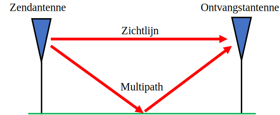
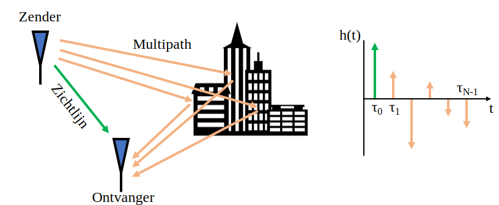
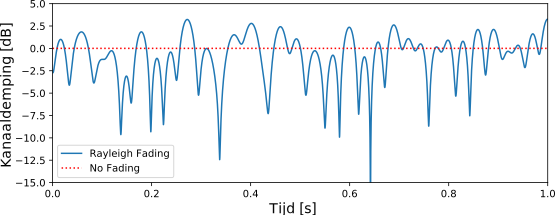

.. _multipath-chapter:

#######################
Multipath Fading
#######################

In dit hoofdstuk gaan we multipath behandelen, dit is een fenomeen bij draadloze systemen waar signalen de ontvanger via meerdere wegen bereiken.
Voor zover hebben we alleen "AWGN" kanalen behandeld; een kanaalmodel waaraan ruis wordt toegevoegd. Dat model is alleen goed voor signalen die over kabels lopen of via sommige satellieten.

*************************
Multipath
*************************

Elk realistisch draadloos-kanaal bevat meerdere "reflectors" waardoor RF-signalen gereflecteerd kunnen worden. Elk object dat tussen de zender (Tx) en ontvanger (Rx) staat kan voor extra wegen zorgen waarover het signaal reist. Het signaal ervaart via elke weg een andere faseverschuiving (vertraging) en demping (vermindering van amplitude). Al deze extra signalen worden bij de ontvanger samengevoegd. Ze kunnen constructief, destructief of beide worden samengevoegd. Dit concept waarin signalen meerdere wegen vinden wordt "multipath" genoemd. Er is een directe weg via de zichtlijn (line-of-sight: LOS) en dan zijn er alle andere signalen. In het voorbeeld wat hieronder staat laten we de zichtlijn zien en een enkele andere weg:

Destructieve interferentie vindt plaats wanneer de signalen ongelukkig samenkomen. Neem het voorbeeld van hierboven met slechts twee wegen. Afhankelijk van de frequentie en afstand is het mogelijk dat de twee signalen 180 graden uit fase lopen en bijna dezelfde amplitude hebben. Dit zou erin resulteren dat de twee signalen elkaar tenietdoen (zoals hieronder weergegeven). Misschien ben je deze constructieve en destructieve interferentie in de natuurkundelessen tegengekomen. Wanneer signalen destructief samenkomen noemen we dit in draadloze systemen "deep fade", omdat het signaal eventjes verdwijnt.

.. image:: ../_images/destructive_interference.svg
   :align: center 
   :target: ../_images/destructive_interference.svg

Signalen kunnen ook constructief optellen waardoor een extra sterk signaal wordt ontvangen. Elke weg leidt tot een andere fasedraaiing en demping wat we in het tijddomein kunnen weergeven als een "vermogensvertraging profiel" (Engels: power delay profile):

De snelste weg, dicht bij de y-as, zal altijd via de zichtlijn lopen (als er een is), want op geen manier kan een signaal via een andere weg sneller aankomen. Over het algemeen zal een later aangekomen signaal een kleinere amplitude hebben omdat dat signaal een langere weg heeft afgelegd.

*************************
Fading
*************************

Waar het op neer komt is dat we meestal een mix van constructieve en destructieve interferentie ondervinden, dat over de tijd varieert omdat Rx, Tx of de omgeving verplaatst/verandert. We gebruiken de term "fading" of vervaging om naar een multipath kanaal te wijzen dat over de tijd **verandert**. Daarom noemen we het vaak "multipath fading" (letterlijk vervaging via meerdere wegen) omdat dit over beide effecten gaat, de constructieve/destructieve interferentie en de veranderende omgeving. Dit zal leiden tot een signaal-ruisverhouding dat over de tijd varieert; meestal in de micro- tot milliseconden, afhankelijk van hoe snel de Tx/Rx bewegen. Hieronder zie je de SNR uitgezet in de tijd onder het effect van multipath fading.

.. image:: ../_images/multipath_fading.png
   :scale: 100 % 
   :align: center 

Vanuit het tijddomein bekeken zijn er twee typen fading/vervaging:

- **Langzame vervaging:** Het kanaal verandert niet binnen de duur van een datapakket. D.w.z., een diepe langzame vervaging zal een compleet pakket doen missen.
- **Snelle vervaging:** Het kanaal verandert sneller dan de duur van een pakket. Voorwaartse foutcorrectie, samen met het mixen van de data (interleaving), kan snelle vervaging overkomen.

Vanuit het frequentiedomein bekeken bestaan er ook twee typen fading/vervaging:

**Frequentieafhankelijke vervaging**: De constructieve/destructieve interferentie verandert ook binnen het frequentiebereik van het signaal. Een breedbandig signaal heeft een groot bereik aan frequenties. De golflengte beïnvloedt het type interferentie. Dus wanneer ons signaal een breed bereik aan frequenties heeft, heeft het ook een breed bereik aan golflengtes, de inverse van frequentie. Met als gevolg dat het kanaal andere eigenschappen heeft voor andere delen van ons signaal (in het frequentiedomein). Vandaar de naam frequentieafhankelijke vervaging.

**Vlakke vervaging**: Dit vindt plaats wanneer de bandbreedte van het signaal zo smal is, dat alle frequenties hetzelfde kanaal ervaren. Mocht er een "deep fade" plaatsvinden, dan kan dus heel het signaal vervagen voor de duur van de "deep fade".

De :red:`rode` vorm in het onderstaande figuur stelt ons signaal voor, de zwarte curve laat de huidige signaalcondities zien in het frequentiedomein. Omdat het smallere signaal dezelfde kanaalcondities ervaart over het hele bereik ervaart het "vlakke vervaging" of "flat fading" in het Engels. Het bredere signaal ervaart de frequentieafhankelijke vervaging een stuk sterker.

.. image:: ../_images/flat_vs_freq_selective.png
   :scale: 70 % 
   :align: center 

Hieronder wordt een 16 MHz breed signaal getoond dat continu wordt uitgezonden. Er zijn verschillende momenten waarin een deel van het signaal is verdwenen. Dit voorbeeld laat frequentieafhankelijke vervaging zien, het zorgt voor gaten in het signaal dat sommige frequenties laat verdwijnen en andere niet. 

.. image:: ../_images/fading_example.jpg
   :scale: 60 % 
   :align: center 
   
****************************
Rayleigh Vervaging Simuleren
****************************

Rayleigh vervaging wordt gebruikt om de vervaging over de tijd te modelleren in de situatie dat er geen duidelijke zichtlijn is. Wanneer er wel een duidelijke zichtlijn is, is Rican een geschikter model, maar wij focussen op Rayleigh.
We merken wel op dat Rayleigh en Rican geen andere verliezen meenemen, zoals de verliezen uit ons link budget of verliezen door hele grote obstakels tussen zender en ontvanger. Hun rol is alleen om de multipath fading te modelleren over de tijd, ontstaan door beweging en weerkaatsingen in de omgeving.

Het Rayleigh model levert veel theorieën, maar vertelt ons helaas niets over hoe we een kanaal moeten simuleren. Om Rayleigh vervaging in een simulatie toe te passen zullen we een van de vele gepubliceerde methoden moeten gebruiken. In de onderstaande Python-code gebruiken we de "som-van-sinusoïden" methode van Clarke.

Om een Rayleigh gemodelleerd kanaal op te kunnen zetten in Python, zullen we eerst moeten aangeven wat de maximale Dopplerverschuiving is in Hz. Dit hangt af van hoe snel de zender en/of ontvanger zich verplaatsen, aangegeven met :math:`\Delta v`. Wanneer de snelheid vergeleken met de lichtsnelheid klein is, wat altijd het geval zal zijn in draadloze communicatie, kan de Dopplerverschuiving als volgt worden berekend:

.. math::

  f_D = \frac{\Delta v f_c}{c} 
  
Hierbij is :math:`c` de lichtsnelheid, ongeveer 3e8 m/s, en :math:`f_c` de draaggolf-frequentie waarop wordt gezonden.

We moeten ook het aantal sinusoïden kiezen voor de simulatie, er is geen "correct" aantal omdat dit van de hoeveelheid reflecties in de omgeving afhangt, wat we nooit echt zullen weten. Als onderdeel van de berekening gaan we ervan uit dat de fase van elke reflectie uniform verdeeld is tussen 0 en :math:`2\pi`. De volgende code simuleert een Rayleigh kanaal volgens de methode van Clarke:

.. code-block:: python

    import numpy as np
    import matplotlib.pyplot as plt

    # Simulation Params, feel free to tweak these
    v_mph = 60 # velocity of either TX or RX, in miles per hour
    center_freq = 200e6 # RF carrier frequency in Hz
    Fs = 1e5 # sample rate of simulation
    N = 100 # number of sinusoids to sum

    v = v_mph * 0.44704 # convert to m/s
    fd = v*center_freq/3e8 # max Doppler shift
    print("max Doppler shift:", fd)
    t = np.arange(0, 1, 1/Fs) # time vector. (start, stop, step)
    x = np.zeros(len(t))
    y = np.zeros(len(t))
    for i in range(N):
        alpha = (np.random.rand() - 0.5) * 2 * np.pi
        phi = (np.random.rand() - 0.5) * 2 * np.pi
        x = x + np.random.randn() * np.cos(2 * np.pi * fd * t * np.cos(alpha) + phi)
        y = y + np.random.randn() * np.sin(2 * np.pi * fd * t * np.cos(alpha) + phi)

    # z is the complex coefficient representing channel, you can think of this as a phase shift and magnitude scale
    z = (1/np.sqrt(N)) * (x + 1j*y) # this is what you would actually use when simulating the channel
    z_mag = np.abs(z) # take magnitude for the sake of plotting
    z_mag_dB = 10*np.log10(z_mag) # convert to dB

    # Plot fading over time
    plt.plot(t, z_mag_dB)
    plt.plot([0, 1], [0, 0], ':r') # 0 dB
    plt.legend(['Rayleigh Fading', 'No Fading'])
    plt.axis([0, 1, -15, 5])
    plt.show()

Mocht je dit (vlakke vervagings)model willen gebruiken als onderdeel van een grotere simulatie, dan kun je simpelweg het ontvangen signaal vermenigvuldigen met het complexe getal :code:`z`. De waarde :code:`z` zou dan elke tijdstap geüpdatet worden. Op deze manier ervaren alle frequentiecomponenten van het signaal dus hetzelfde kanaal op elk moment in de tijd. Je simuleert dus **niet** frequentieafhankelijke vervaging omdat het een kanaal impulsrespons nodig heeft met meerdere coëfficiënten waar we nu niet op in gaan. Wanneer we de modulus van :code:`z` bekijken kunnen we de Rayleigh-vervaging over de tijd zien:

We zien een korte diepe vervaging en ook een deel waar het kanaal beter is dan als er geen vervaging was opgetreden.

****************************
Multipath Fading Overkomen
****************************

In de moderne communicatie zijn er manieren ontwikkeld om multipath fading aan te vechten.

CDMA
#####

3G gebruikt een code division multiple access (CDMA) techniek. Met CDMA neem je een signaal met kleine bandbreedte en je smeert het uit over een veel bredere bandbreedte voordat je het overstuurt (doormiddel van DSSS). Mocht er frequentieafhankelijke vervaging plaatsvinden dan is er een kleine kans dat alle frequenties zullen verdwijnen. Wanneer de ontvanger het uitsmeren van frequenties ongedaan maakt, wordt een diepe vervaging bijna tenietgedaan.

.. image:: ../_images/cdma.png
   :scale: 100 % 
   :align: center 

OFDM 
#####

4G, WiFi, en veel andere technieken maken gebruik van orthogonal frequency-division multiplexing (OFDM). OFDM maakt gebruik van sub-draaggolven waarmee we het signaal in het frequentiedomein opsplitsen in een hoop signalen met kleine bandbreedte die we samenproppen. Om nu multipath fading tegen te gaan kunnen we selectief data op een sub-draaggolf sturen, op zo'n manier dat frequenties die slechte condities ervaren geen data oversturen, en frequenties die uitstekende condities ervaren een hogere orde modulatieschema gaan gebruiken. Natuurlijk moet de ontvanger dan snel genoeg informatie over het kanaal kunnen terugsturen.
