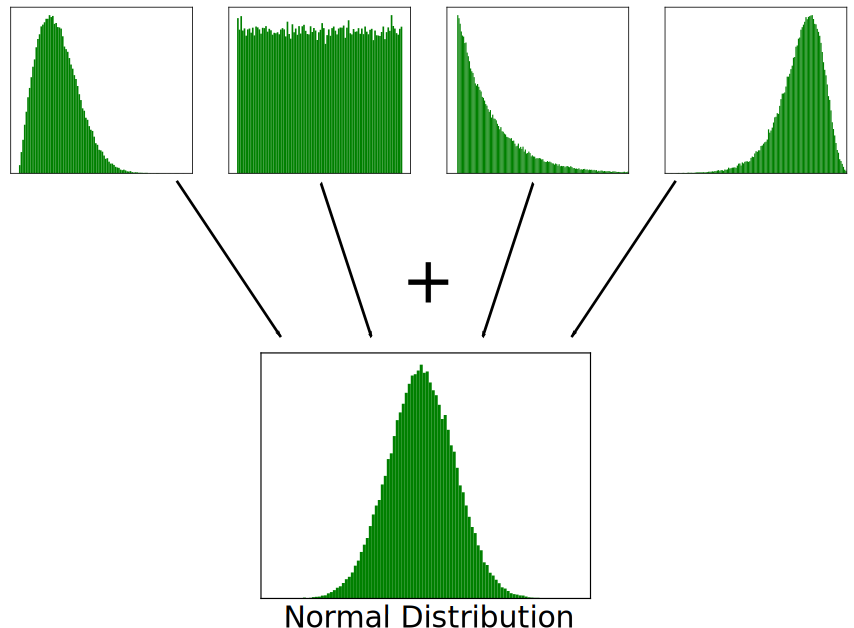

.. _noise-chapter:

#############
Ruis en dB
#############

In dit hoofdstuk behandelen we ruis, hoe het wordt gemodelleerd en hoe ermee wordt omgegaan in draadloze systemen.
Concepten als AWGN, complexe ruis en SNR/SINR komen langs.
Onderweg introduceren we ook decibellen (dB) omdat dit veel gebruikt wordt binnen draadloze communicatiesystemen en SDR.

************************
Gaussische Ruis
************************

De meeste mensen zijn bekend met het concept van ruis: ongewilde fluctuaties dat ons signaal kan overstemmen. Ruis ziet er ongeveer zo uit:

.. image:: ../_images/noise.png
   :scale: 70 % 
   :align: center 

We merken op dat het gemiddelde ruisniveau in het tijddomein-figuur nul is. 
Als de gemiddelde waarde niet nul zou zijn, dan hadden we de gemiddelde waarde, de offset, ervan af kunnen halen, en dan zouden we over zijn gebleven met een gemiddelde van nul. Ook merken we op dat de individuele punten in het figuur *niet* "uniform" verdeeld zijn, hogere waarden zijn minder aanwezig dan punten die dichter bij nul zitten.

We noemen dit "gaussische ruis".
Dat is een goed model voor het type ruis wat ontstaat door vele natuurlijke bronnen, zoals de thermische trilling van atomen binnen het silicium van de RF-componenten in onze ontvanger.
Volgens de **centrale limietstelling** zal de sommatie van vele stochastische/willekeurige processen altijd naar een gaussische verdeling convergeren, zelfs wanneer de individuele processen andere verdelingen hebben.

De gaussische verdeling wordt de "normale" verdeling genoemd.

De normale verdeling heeft twee parameters: gemiddelde/verwachtingswaarde en variantie.
We hebben al behandeld waarom het gemiddelde als nul kan worden gezien, omdat een statische afwijking altijd eraf kan worden gehaald.
De variantie verteld ons hoe "sterk" de ruis is.
Een hogere variantie zal lijden tot hogere nummers.
Om deze reden wordt het vermogen ook gedefinieerd door de variantie.

De variantie staat gelijk aan de standaard deviatie in het kwadraat (:math:`\sigma^2`).

************************
Decibellen (dB)
************************

We gaan een kort zijspoor in om dB te introduceren.
Als je van dB hebt gehoord, voel je dan vrij om dit deel over te slaan.

Het werken met dB is extreem handig wanneer we met kleine en grote getallen op hetzelfde moment werken, of gewoon een hoop supergrote getallen. Kijk eens naar voorbeelden 1 en 2 om te zien hoe moeizaam het is zonder dB te werken:

Voorbeeld 1: Signaal 1 heeft een vermogen van 2 Watt en de ruisvloer is 0.0000002 Watt.

Voorbeeld 2: Een vuilnisbelt is 100000 keer luider dan een stille omgeving, terwijl een kettingzaag 10000 keer luider is dan een vuilnisbelt (geluidsgolven).

Zonder dB, dus in normale "lineaire" termen, hebben we een hoop nullen nodig om de waarden te weergeven in voorbeelden 1 en 2.
Als we de waarden van signaal 1 zouden willen tonen in de tijd, dan zouden we de ruisvloer niet eens zien!
Als bijvoorbeeld de y-as van 0 tot 3 Watt loopt, dan zou de ruis te klein zijn om zichtbaar te worden in de grafiek.
Om beide waarden in dezelfde schaal te kunnen gebruiken, moeten we overgaan naar de logaritmische schaal.

Om het probleem van de juiste schaal in DSP nog duidelijker te maken, kijken we naar de onderstaande watervaldiagrammen van dezelfde drie signalen.
De linker kant is het originele signaal in de lineaire schaal, en de rechterkant laat de signalen zien in een logaritmische schaal (dB).
Beide representaties gebruiken dezelfde kleurcodering, blauw heeft de laagste waarde en geel de hoogste.
Je kunt in het linker figuur, in de lineaire schaal, het signaal nauwelijks zien.

.. image:: ../_images/linear_vs_log.png
   :scale: 70 % 
   :align: center 

We kunnen voor een gegeven waarde x, het met de volgende formule in dB zetten:

.. math::
    x_{dB} = 10 \log_{10} x

In Python:

.. code-block:: python

 x_db = 10.0 * np.log10(x)

Misschien heb je de :code:`10 *` als een :code:`20 *` gezien in andere domeinen.
Wanneer je met een of ander vermogen werkt, dan gebruik je 10, als je werkt met spanning of stroom dan gebruik je 20.
Binnen de DSP-wereld werken we meestal met vermogens.
Het is zelfs zo dat in heel dit boek we geen 20 in plaats van de 10 nodig hebben.

We kunnen terugrekenen van dB naar lineair (normale getallen) met:

.. math::
 
 x = 10^{x_{dB}/10}

In Python: 

.. code-block:: python

 x = 10.0 ** (x_db / 10.0)

Raak niet verstrikt in deze vergelijkingen, er is een concept waar het om draait.
In DSP werken we met enorm kleine getallen en enorm grote getallen samen (bijv. signaal- vergeleken met ruisvermogen).
Wanneer we in dB werken hebben we een groter dynamisch bereik om getallen uit te drukken in tekst of een grafiek.
Daarnaast geeft het een aantal andere voordelen zoals de mogelijkheid om ze bij elkaar op te tellen waar we normaal zouden vermenigvuldigen (zoals je zult zien in het :ref:`link-budgets-chapter` hoofdstuk).

Een aantal veel voorkomende fouten die nieuwelingen maken:

1. :math:`ln()=log^e()` gebruiken in plaats van :math:`log^{10}()`. Dit komt omdat in de meeste talen log() voor het natuurlijke logaritme wordt gebruikt.
2. Bij het gebruik van getallen of grafiekassen vergeten te melden dat het in dB is. Dit moet ergens aangegeven worden.
3. In dB waarden vermenigvuldigen/delen in plaats van optellen/aftrekken. Bijvoorbeeld:

.. image:: ../_images/db.png
   :scale: 80 % 
   :align: center 

Wat ook belangrijk is om te beseffen , is dat dB technisch gezien geen "eenheid" is. 
Een waarde in dB is eenheid-loos omdat het over een verhouding gaat, zoals wanneer iets 2x groter is, er is geen eenheid totdat ik je vertel over welke eenheid het gaat.
dB is relatief.
Wanneer men het over dB heeft in de context van audio, bedoelt men meestal dBA, wat wordt gebruikt voor volume (de A staat voor de eenheid).
In draadloze systemen gebruiken we meestal Watt om een vermogensniveau aan te geven.
Om die reden zie je misschien dBW als eenheid, wat relatief is aan 1 Watt.
Misschien zie je ook dBmW wat relatief is aan 1 mW (en wordt vaak als dBm geschreven).
Als iemand bijvoorbeeld zegt dat de zender is afgesteld op 3 dBW, dan gaat dat over :math:`10^{\frac{1}{3}}=1.995\approx 2` Watt.
Soms gebruiken we dB helemaal op zichzelf, dus relatief zonder eenheden.
Iemand zou bijv. kunnen zeggen dat "het ontvangen signaal 20 dB boven de ruisvloer staat".
Een kleine tip hierbij: 0 dBm = -30 dBW.

Hier zijn een aantal standaardwaarden die ik aanraad om te onthouden:

=======  =====
Lineair   dB
=======  ===== 
1x       0 dB 
2x       3 dB 
10x      10 dB 
0.5x     -3 dB  
0.1x     -10 dB
100x     20 dB
1000x    30 dB
10000x   40 dB
=======  ===== 

En om afsluitend deze nummers een context te geven staan hieronder wat voorbeeld vermogens in dBm:

=========== ===
80 dBm      Zendvermogen van een afgelegen FM-radio station
62 dBm      Max vermogen van een ham radiozender
60 dBm      Vermogen van een typische magnetron
37 dBm      Vermogen van een typische draagbare radiozender
27 dBm      Typisch zendvermogen van een mobiele telefoon
15 dBm      Typisch zendvermogen van Wifi
10 dBm      Bluetooth (v 4) max zendvermogen
-10 dBm     Max ontvangstvermogen voor Wifi
-70 dBm     Mogelijk ontvangstvermogen voor een ham signaal
-100 dBm    Minimale ontvangstvermogen voor Wifi
-127 dBm    Typisch ontvangstvermogen van GPS satellieten
=========== ===

****************************
Ruis in het frequentiedomein
****************************

In het :ref:`freq-domain-chapter` hoofdstuk hadden we het over Fourier-paren, bijv., hoe een tijddomein-signaal er in het frequentiedomein uitziet. Dus, hoe ziet gaussische ruis in het frequentiedomein eruit?
De komende grafieken laten gesimuleerde ruis in het tijddomein (boven) en de spectrale vermogensdichtheid (PSD) van de ruis (onder) zien.
De figuren komen uit GNU Radio.

.. image:: ../_images/noise_freq.png
   :scale: 110 % 
   :align: center 

We kunnen zien dat de ruis vrijwel vlak en gelijk is over alle frequenties.
Het blijkt dat gaussische ruis in het tijddomein ook gaussische ruis in het frequentiedomein is.
Waarom lijken de twee figuren dan niet op elkaar?
Dit komt doordat het frequentiedomein-figuur de modulus laat zien van de FFT, dus dat zal alleen positieve getallen opleveren.
En nog belangrijker, het gebruikt een logaritmische schaal om de waarden te weergeven in dB.
Anders hadden de figuren hetzelfde eruitgezien.
We kunnen dit zelf bewijzen door in Python wat ruis te genereren en daarna de FFT te nemen.

.. code-block:: python

 import numpy as np
 import matplotlib.pyplot as plt
 
 N = 1024 # aantal samples om te simuleren, kies zelf een waarde
 x = np.random.randn(N)
 plt.plot(x, '.-')
 plt.show()
 
 X = np.fft.fftshift(np.fft.fft(x))
 X = X[N//2:] # alleen de positieve frequenties // is een integer deling
 plt.plot(np.real(X), '.-') #reeele deel ipv lengte/modulus
 plt.show()

We merken op dat de randn() functie standaard een gemiddelde heeft van 0 en variantie van 1. Beide figuren zullen er ongeveer zo uitzien:

.. image:: ../_images/noise_python.png
   :scale: 100 % 
   :align: center 

We zouden de vlakke PSD van GNU Radio kunnen genereren door vervolgens de logaritme te nemen en te middelen.
Het ruissignaal wat we in de FFT stopten was een reëel signaal (i.p.v. complex), en de FFT van een reëel signaal zal symmetrisch zijn rondom het midden (0 Hz), vandaar dat we alleen het positieve deel namen (de 2e helft).
Maar waarom hadden we alleen "reële" ruis gegenereerd, en hoe werkt dat met complexe signalen?

*************************
Complexe Ruis
*************************

"Complexe Gaussische" ruis zullen we ervaren met signalen in de basisband; het ruisvermogen wordt evenredig verdeelt over de reële en imaginaire delen. 
Nog belangrijker is te beseffen dat de reële en imaginaire delen onafhankelijk van elkaar zijn; de waarde van het reële deel zegt niets over de waarde van het imaginaire deel.

In Python kunnen we complexe gaussische ruis genereren met:

.. code-block:: python

 n = np.random.randn() + 1j * np.random.randn()

Maar wacht! De bovenstaande vergelijking genereert niet dezelfde hoeveelheid ruisvermogen als :code:`np.random.randn()`.  
Het gemiddelde vermogen van een signaal met een gemiddelde van 0 (of ruis) kunnen we vinden met:

.. code-block:: python

 power = np.var(x)

Waar np.var() de variantie berekent.
Dit levert voor :code:`n` een signaalvermogen op van 2.
Om complexe ruis te generen meet een vermogen van 1 (wat dingen eenvoudiger maakt) moeten we het ruissignaal normaliseren met:

.. code-block:: python

 n = (np.random.randn(N) + 1j*np.random.randn(N))/np.sqrt(2) # AWGN with unity power

Om de complexe ruis te tonen in het tijddomein hebben we, zoals bij elk complex signaal, twee regels nodig:

.. code-block:: python

 n = (np.random.randn(N) + 1j*np.random.randn(N))/np.sqrt(2)
 plt.plot(np.real(n),'.-')
 plt.plot(np.imag(n),'.-')
 plt.legend(['real','imag'])
 plt.show()

.. image:: ../_images/noise3.png
   :scale: 80 % 
   :align: center 

Zoals je ziet zijn de reële en imaginaire delen compleet onafhankelijk.

Hoe ziet die gaussische ruis op een IQ-diagram eruit?
Zoals je weet laat het IQ-diagram het reële deel (horizontaal) en het imaginaire deel (verticaal) zien.
In dit geval hebben beide assen een onafhankelijke gaussische verdeling.

.. code-block:: python

 plt.plot(np.real(n),np.imag(n),'.')
 plt.grid(True, which='both')
 plt.axis([-2, 2, -2, 2])
 plt.show()

.. image:: ../_images/noise_iq.png
   :scale: 60 % 
   :align: center 

Dit ziet eruit zoals we het zouden verwachten; een willekeurige klodder met het midden rond 0+0j, de oorsprong.
Laten we voor de lol, om te kijken hoe het eruit ziet, wat ruis proberen toe te voegen aan een QPSK signaal:

.. image:: ../_images/noisey_qpsk.png
   :scale: 60 % 
   :align: center 

En wat als de ruis nog sterker is?

.. image:: ../_images/noisey_qpsk2.png
   :scale: 50 % 
   :align: center 

Nu beginnen we een gevoel te krijgen waarom het niet zo simpel is om draadloos data over te sturen.
We willen zoveel mogelijk bits per symbool versturen, maar als de ruis te groot is zullen we bij de ontvanger verkeerde bits krijgen.

*************************
AWGN
*************************

Additive White Gaussian Noise (AWGN) is een afkorting die je vaak in de DSP en SDR wereld zult tegenkomen.
GN, gaussische ruis, hebben we al behandeld.
'Additive' of toevoegend, betekent gewoon dat de ruis wordt toegevoegd aan ons ontvangen signaal.
'White' of wit, betekent dat het frequentiespectrum over het volledig geobserveerde bereik vlak is.
In de praktijk is het bijna altijd wit, of vrijwel wit.
In dit boek zullen we alleen AWGN in beschouwing nemen bij het behandelen van communicatieketens en ketenbudgetten e.d.
Niet-AWGN ruis is een vak apart.

*************************
SNR en SINR
*************************

Signal-to-Noise Ratio (SNR) of de signaalruisverhouding is hoe we het krachtverschil tussen het signaal en de ruis uitdrukken.
Het is een verhouding dus het heeft geen eenheid.
In de praktijk is SNR bijna altijd in dB.
Voor simulaties programmeren we onze signalen altijd op zo'n manier dat het een vermogen heeft van 1, of eenheidsvermogen.
Als we nu een SNR willen creëren van 10 dB in de simulatie, kunnen we simpelweg ruis genereren van -10 dB vermogen door bij het aanmaken van de ruis de variantie aan te passen.

.. math::
   \mathrm{SNR} = \frac{P_{signaal}}{P_{ruis}}

.. math::
   \mathrm{SNR_{dB}} = P_{signaal\_dB} - P_{ruis\_dB}

Als iemand het over "SNR = 0 dB" heeft, betekent het dat het signaal- en ruisvermogen gelijk zijn.
Een positieve SNR betekent dat het signaalvermogen groter is dan van de ruis, terwijl een negatieve SNR aangeeft dat het ruisvermogen groter is dan het signaalvermogen.
Het is meestal erg lastig om signalen met een negatieve SNR nog te kunnen detecteren.

Zoals eerder gezegd is het vermogen van een signaal gelijk aan de variantie van dat signaal. 
We zouden dus SNR kunnen uitdrukken in de verhouding van varianties:

.. math::
   \mathrm{SNR} = \frac{P_{signaal}}{P_{ruis}} = \frac{\sigma^2_{signaal}}{\sigma^2_{ruis}}

Signal-to-Interference-plus-noise verhouding (SINR) of signaal-tot-verstoring-plus-ruis is in essentie hetzelfde als SNR, maar je neemt in de deler ook de verstoring mee.

.. math::
   \mathrm{SINR} = \frac{P_{signaal}}{P_{verstoring} + P_{ruis}}

Wat die verstoring inhoudt, verschilt per toepassing/situatie, maar meestal gaat het om een ander ongewenst signaal wat het signaal van interesse verstoort op zo'n manier dat het niet weg te filteren is.

*************************
Extra leesmateriaal
*************************

Bronnen over AWGN, SNR, en variantie:

1. https://en.wikipedia.org/wiki/Additive_white_Gaussian_ruis
2. https://en.wikipedia.org/wiki/signaal-to-ruis_ratio
3. https://en.wikipedia.org/wiki/Variance
