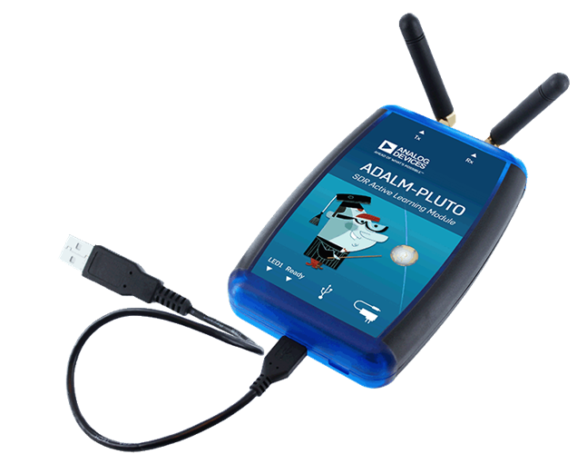
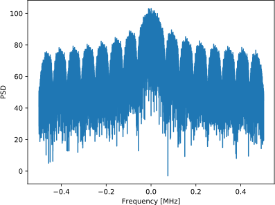

.. _pluto-chapter:

####################################
PlutoSDR in Python
####################################

   
Je zult in dit hoofdstuk leren om de Python API voor de `PlutoSDR <https://www.analog.com/en/design-center/evaluation-hardware-and-software/evaluation-boards-kits/adalm-pluto.html>`_ te gebruiken; een goedkope SDR van Analog Devices.  
We zullen de stappen behandelen om de drivers/software voor de PlutoSDR te kunnen draaien, en behandelen hoe je kunt zenden en ontvangen met de PlutoSDR in Python.

****************************
Software/Drivers Installatie
****************************

Een VM opzetten
###############
Terwijl de gegeven Python voorbeelden ook onder Windows, Mac en Linux zouden moeten werken, zijn de instructies in het specifiek geschreven voor Ubuntu 22. Als je moeite hebt om de software op jouw OS te installeren met behulp van `de instructies van Analog Devices <https://wiki.analog.com/university/tools/pluto/users/quick_start>`_, raad ik aan om een Ubuntu 22 VM te installeren met de instructies hieronder. Onder Windows 11 (en vanaf deze `update <https://support.microsoft.com/en-us/topic/november-15-2022-kb5020030-os-builds-19042-2311-19043-2311-19044-2311-and-19045-2311-preview-237a9048-f853-4e29-a3a2-62efdbea95e2>`_ ook onder windows 10) is een alternatieve route, Windows Subsystem for Linux (WSL) met Ubuntu 22. Dit draait vrij goed en ondersteund standaard al grafische linux applicaties. 

1. Installeer en open `VirtualBox <https://www.virtualbox.org/wiki/Downloads>`_.
2. Maak een nieuwe VM aan. Voor de geheugengrootte raad ik 50% van je RAM aan.
3. Creëer een dynamisch groeiende virtuele harde schijf, kies hiervoor VDI. 15 GB zou voldoende moeten zijn. Als je zeker wilt zijn kun je nog meer toekennen.
4. Download de `Ubuntu 22 Desktop .iso <https://ubuntu.com/download/desktop>`_
5. Start de VM. Kies het gedownloade .iso bestand als installatiemedium. Kies “install ubuntu”, met de standaard opties en klik op "continue" bij het venster wat je waarschuwt over de veranderingen. Kies een naam/wachtwoord en wacht op de VM om te installeren. Wanneer de installatie klaar is zal de VM herstarten. Schakel na de herstart de VM uit.
6. Ga naar de VM instellingen (het tandwieltje).
7. Onder system > processor > kies tenminste 3 processors. Als je een discrete videokaart hebt, dan kun je meer videogeheugen toekennen onder display > video memory.
8. Start jouw VM.
9. Ik raad ook aan om de "VM guest additions" te installeren. Ga binnen de VM naar Devices > Insert Guest Additions CD > druk op "run" in het nieuwe venster en volg de instructies. Herstart de VM. Je kunt het klembord delen met de Host via Devices > Shared Clipboard > Bidirectional.

PlutoSDR verbinden
###################

1. Drivers installeren
   
 A. Voor MacOS, onder systeem voorkeuren, zet "kernel extensions" aan. Installeer vervolgens HoRNDIS (Misschien moet je herstarten).
 B. Voor Windows kun je deze driver installeren: https://github.com/analogdevicesinc/plutosdr-m2k-drivers-win/releases/download/v0.7/PlutoSDR-M2k-USB-Drivers.exe
 C. Voor Linux zou je niets speciaals hoeven te doen.

2. Plug je Pluto in de host machine via USB. Gebruik de middelste usb poort van de Pluto want de andere is alleen voor voeding. Na het inpluggen van de Pluto wordt er een virtuele netwerkkaart aangemaakt, het verschijnt als een USB ethernet adapter.
3. Open jouw favoriete tool op de host machine (niet de VM) en ping 192.168.2.1. Zorg er eerst voor dat dit werkt voordat je verder gaat.
4. Open een nieuwe terminal binnen de VM
5. Ping 192.168.2.1. Als dat niet werk, los dat eerst op. Wanneer je, tijdens het pingen, de Pluto uit de computer haalt zou de ping geen antwoord meer moeten geven. Als het gewoon door blijft gaan dan zit er waarschijnlijk een ander apparaat op hetzelfde IP-adres. Je zult het adres van de Pluto (of het andere netwerkapparaat) moeten aanpassen.
6. Schrijf het juiste IP-adres van de Pluto ergens op, want dit hebben we nodig om later verbinding te maken.

PlutoSDR Driver installeren
###########################

De onderstaande terminal commando's (op de VM) zou de volgende zaken moeten installeren:

1. **libiio**, Analog Device’s “cross-platform” bibliotheek
2. **libad9361-iio**, AD9361 is de specifieke RF-chip binnen de PlutoSDR
3. **pyadi-iio**, de Pluto's Python API, *ons einddoel*, maar het is afhankelijk van de eerste twee

.. code-block:: bash

 sudo apt-get install build-essential git libxml2-dev bison flex libcdk5-dev cmake python3-pip libusb-1.0-0-dev libavahi-client-dev libavahi-common-dev libaio-dev
 cd ~
 git clone --branch v0.23 https://github.com/analogdevicesinc/libiio.git
 cd libiio
 mkdir build
 cd build
 cmake -DPYTHON_BINDINGS=ON ..
 make -j$(nproc)
 sudo make install
 sudo ldconfig
 
 cd ~
 git clone https://github.com/analogdevicesinc/libad9361-iio.git
 cd libad9361-iio
 mkdir build
 cd build
 cmake ..
 make -j$(nproc)
 sudo make install
 
 cd ~
 git clone --branch v0.0.14 https://github.com/analogdevicesinc/pyadi-iio.git
 cd pyadi-iio
 pip3 install --upgrade pip
 pip3 install -r requirements.txt
 sudo python3 setup.py install

PlutoSDR Drivers testen
##########################

Open een nieuwe terminal (in jouw VM) en type de volgende commando's:

.. code-block:: bash

 python3
 import adi
 sdr = adi.Pluto('ip:192.168.2.1') # of wat jouw Pluto's IP ook is
 sdr.sample_rate = int(2.5e6)
 sdr.rx()

Als je tot nu toe geen problemen ervaart dan kun je verder met de volgende stappen.

Pluto's IP Adres aanpassen
####################################

Mocht je om een of andere reden het standaard IP van 192.168.2.1 niet willen, dan kun je het IP met deze stappen aanpassen:

1. Bewerk het config.txt bestand op de PlutoSDR schijf (dus het USB-drive achtige ding wat tevoorschijn komt wanneer je de Pluto inplugt). Voer het nieuwe IP-adres in.
2. Werp de schijf uit maar laat de Pluto in de computer zitten! In Ubuntu 22 is er een naast de PlutoSDR device een uitwerp symbool, binnen de verkenner.
3. Wacht een paar seconden na het uitwerpen en plug daarna de Pluto uit en in de computer. Ga terug naar config.txt en verifieer dat de wijziging is opgeslagen.

Op dezelfde manier zou je de firmware van de Pluto kunnen updaten. Zie voor meer info https://wiki.analog.com/university/tools/pluto/users/firmware.

"Hack" de PlutoSDR voor een groter RF bereik
############################################

De PlutoSDR komt standaard met een beperkt frequentiebereik en beperkte sample-frequentie, maar de onderliggende chip kan veel hogere frequenties aan. Volg deze stappen om het volle frequentiebereik aan te zeten. Dit proces wordt door Analog Devices zelf uitgelegd dus heeft minimale risico's. De restricties zijn door Analog Devices aangezet omdat de specifieke chips niet voldeden aan de strenge performance-eisen op deze hogere frequenties. Maar als SDR studenten maken we ons niet zo druk over die performance-eisen.

Tijd om te hacken! Open een terminal (host of VM):

.. code-block:: bash

 ssh root@192.168.2.1

Het wachtwoord is analog.

Je zou een welkomst 'scherm' moeten zien. Je hebt nu geSSHd naar de linux-omgeving van de Pluto zelf!
Type de volgende commando's in:

.. code-block:: bash

 fw_setenv attr_name compatible
 fw_setenv attr_val ad9364
 fw_setenv compatible ad9364
 reboot

Nu moet het mogelijk zijn om af te stemmen op frequenties tussen de 70 MHz en 6 GHz, en een sample rate te gebruiken van 56 MHz! Joepie!

************************
Ontvangen
************************

Via de PlutoSDR's Python API is het simpel om samples te ontvangen. 
Voor elke SDR-applicatie wil je weten wat de middenfrequentie, sample-frequentie en versterking is, en of je eventueel automatic gain control (AGC) wilt gebruiken.
Er zijn andere details, maar deze drie parameters zijn essentieel voor de SDR om samples te kunnen ontvangen.
Sommige SDR's hebben een commando om te beginnen met het samplen, en anderen zoals de Pluto beginnen zodra je het initialiseert.
Op het moment dat de interne buffers van de Pluto vol zitten, dan zal het de oudste samples gaan verwijderen.
Alle SDR API's hebben een "ontvang samples" functie dat een stapel samples teruggeeft, en voor de Pluto is dit rx(), 
De hoeveelheid samples dat het teruggeeft is gedefinieerd door de buffergrootte wat van tevoren is ingesteld.

De onderstaande code gaat ervan uit dat je Pluto's Python API hebt geïnstalleerd.
Deze code initialiseert de Pluto, stelt de sample-frequentie in op 1 MHz, stelt de middenfrequentie in op 100 MHz en stelt de versterking in op 70 dB met AGC uitgeschakeld.
Het maakt meestal niets uit in welke volgorde je deze dingen doet.
In de onderstaande code vragen we de Pluto om 10000 samples per rx() functieaanroep.
We drukken de eerste 10 samples af.

.. code-block:: python

    import numpy as np
    import adi
    
    sample_rate = 1e6 # Hz
    center_freq = 100e6 # Hz
    num_samps = 10000 # aantal samples per rx() aanroep
    
    sdr = adi.Pluto()
    sdr.gain_control_mode_chan0 = 'manual'
    sdr.rx_hardwaregain_chan0 = 70.0 # dB
    sdr.rx_lo = int(center_freq)
    sdr.sample_rate = int(sample_rate)
    sdr.rx_rf_bandwidth = int(sample_rate) # kantelfrequentie = sample frequentie
    sdr.rx_buffer_size = num_samps
    
    samples = sdr.rx() # ontvang de samples van de Pluto
    print(samples[0:10])

Voor nu doen we niets interessants met deze samples, maar de rest van dit boek staat vol met Python code dat werkt met IQ-samples zoals we zojuist hebben ontvangen.

Ontvangstversterking
####################

De Pluto kan worden ingesteld op een vaste versterking of een automatische. Een automatische versterkingscontrole of automatic gain control (AGC) zal automatisch de versterking van de ontvanger aanpassen om een sterk signaalniveau te behouden (-12dBFS om exact te zijn).
AGC moet je niet verwarren met een analoog-naar-digitaal converter (ADC) dat het signaal digitaliseert.
Technisch gezien is de AGC een gesloten-lus feedbackschakeling dat de versterking beheert op basis van het ontvangen signaal met als doel om een constant vermogensniveau te behouden desondanks variërende ingangsvermogens.
Typisch zorgt de AGC ervoor dat het signaal de ADC niet overstuurt maar wel zo goed mogelijk het volledige bereik van de ADC gebruikt.

Het RFIC, binnen de PlutoSDR, heeft een AGC-module met een paar verschillende instellingen. 
(Een RFIC is een transceiver chip; het stuurt en ontvangt radiogolven.) 
Als eerste merken we op dat de Pluto ontvangstversterking een bereik heeft van 0 tot 74.5 dB.
In de "manual" of handmatige modus is de AGC uitgeschakeld, en moet je zelf instellen welke versterking de Pluto moet gebruiken. Bijv.:

.. code-block:: python

  
  sdr.gain_control_mode_chan0 = "manual" # zet AGC uit
  gain = 50.0 # toegestane bereik is 0 tot 74.5 dB
  sdr.rx_hardwaregain_chan0 = gain # stel ontvangstversterking in

Wanneer je de AGC wilt gebruiken kun je kiezen tussen twee modi:

1. :code:`sdr.gain_control_mode_chan0 = "slow_attack"`
2. :code:`sdr.gain_control_mode_chan0 = "fast_attack"`

En wanneer de AGC is aangezet hoef je geen waarde te geven voor :code:`rx_hardwaregain_chan0`. 
Deze waarde wordt genegeerd omdat de Pluto dan zelf de versterking voor het signaal regelt.
De Pluto heeft twee modi voor de AGC: fast attack (snel reageren) en slow attack (langzaam reageren).
De termen spreken voor zichzelf.
Fast attack modus reageert sneller op de signalen.
In andere woorden, de versterkingsfactor zal sneller veranderen wanneer het ingangssignaal verandert.
Het ingangsvermogen aanpassen is bijv. belangrijk voor tijd-divisie duplex (TDD) systemen. Deze gebruiken dezelfde frequentie voor zenden en ontvangen.
Als je voor deze situatie de AGC op fast attack zet dan wordt de demping van het signaal gelimiteerd.
Met beide modi, wanneer er geen signaal maar alleen ruis aanwezig is, zal de AGC de versterking maximaal maken; wanneer een signaal tevoorschijn komt, zal het de ontvanger (ADC) kort satureren tot de AGC kan reageren en de versterking doet zakken. Je kunt de huidige versterkingsfactor in real-time bekijken met:

.. code-block:: python
 
 sdr._get_iio_attr('voltage0','hardwaregain', False)

Voor meer informatie over de AGC binnen de Pluto refereren we naar de `RX Gain Control sectie van deze pagina: <https://wiki.analog.com/resources/tools-software/linux-drivers/iio-transceiver/ad9361>`_.

************************
Zenden
************************

Zorg ervoor, voordat je een signaal gaat versturen met jouw Pluto, dat je een SMA-kabel tussen de TX en ontvanger stopt.
Het is belangrijk dat je als beginner altijd eerst over een kabel zendt om zeker te zijn dat de SDR doet wat je wilt. Hou in dit geval het zendvermogen extreem laag om te voorkomen dat je de ontvanger sloopt. Een kabel heeft immers niet zoveel demping als een draadloos kanaal.
Mocht je een attenuator (demper) hebben (bijv. 30 dB), dan is dit een goed moment om het te gebruiken.
Als je niet een andere SDR of spectrum analyzer als ontvanger tot je beschikking hebt, dan zou je in theorie de RX-poort van dezelfde Pluto kunnen gebruiken, maar dat kan ingewikkeld worden.
Ik raad aan om een RTL-SDR van 20€ als ontvanger te gebruiken.

Zenden werkt bijna hetzelfde als ontvangen. In plaats dat we de SDR vertellen om samples te ontvangen, zullen we een bepaalde hoeveelheid samples geven om uit te zenden.
We stellen i.p.v. de :code:`rx_lo` de :code:`tx_lo` in, om aan te geven welke zendfrequentie we willen gebruiken.
De sample-rate is hetzelfde voor de RX en TX, dus die instelling blijft gelijk.
Een volledig voorbeeld waarin wordt gezonden is beneden te zien. Hier genereren we een sinusoïde van +100 kHz, en zenden het complexe signaal op een draaggolf van 915 MHz. De ontvanger ziet dan een draaggolf op 915.1 MHz. 
Er is geen praktische reden om dit zo te doen, we hadden een array van 1'en kunnen versturen op een zendfrequentie van 915.1e6 Hz. We wilden echter complexe samples genereren als voorbeeld.

.. code-block:: python
    
    import numpy as np
    import adi

    sample_rate = 1e6 # Hz
    center_freq = 915e6 # Hz

    sdr = adi.Pluto("ip:192.168.2.1")
    sdr.sample_rate = int(sample_rate)
    sdr.tx_rf_bandwidth = int(sample_rate) # filter kantelfrequentie, stel in gelijk aan sample rate
    sdr.tx_lo = int(center_freq)
    sdr.tx_hardwaregain_chan0 = -50 # tx demping, bereik is -90 tot 0 dB

    N = 10000 # aantal samples om te versturen
    t = np.arange(N)/sample_rate
    samples = 0.5*np.exp(2.0j*np.pi*100e3*t) # simuleer een sinusoide van 100 kHz, dan ziet de ontvanger het op 915.1 MHz
    samples *= 2**14 # De PlutoSDR verwacht samples met waarden tussen -2^14 en +2^14, niet -1 en +1

    # Stuur de samples 100 keer, dus 1 seconde totaal, als USB het kan bijhouden
    for i in range(100):
        sdr.tx(samples) # stuurt de N samples een keer

Nog wat opmerkingen over deze code. 
Eerst wil je de IQ samples tussen -1 en 1 simuleren, maar voor het versturen moeten we het vermenigvuldigen met 2^14 vanwege hoe Analog Devices de :code:`tx()` functie heeft geïmplementeerd.
Als je niet zeker weet wat de min/max waardes van je signaal zijn, kun je ze afdrukken met :code:`print(np.min(samples), np.max(samples))` of je schrijft een statement om zeker te zijn dat de samples nooit boven 1 of onder -1 komen (dit komt dan voor de 2^14 vermenigvuldiging).
De demping op het zendvermogen heeft een bereik van -90 tot 0 dB, waar 0 dB dus het hoogste zendvermogen oplevert.
We willen altijd met een laag zendvermogen beginnen en daarna, wanneer nodig, het laten toenemen.
De standaardwaarde van -50 dB is gelukkig al aan de lage (en juiste) kant.
Zet de waarde niet zomaar op 0 dB wanneer je niets ziet bij de ontvanger, er kunnen andere redenen zijn waarom dit zo is, en je wilt niet je ontvanger slopen.

Oneindig samples versturen
###############################

Als je voortdurend dezelfde set samples wilt versturen kun je, i.p.v. een for/while loop, de Pluto instrueren om dit te doen met een regel code:

.. code-block:: python

 sdr.tx_cyclic_buffer = True # Zet cyclic buffers aan

Hierna kun je op dezelfde manier samples versturen: :code:`sdr.tx(samples)` waarna de Pluto het oneindig blijft versturen, totdat het SDR-object wordt vernietigd.
Om een nieuwe set aan samples te versturen moet je dan eerst :code:`sdr.tx_destroy_buffer()` aanroepen, en daarna :code:`sdr.tx(samples)`.

Legaal door de lucht zenden
#################################
Onderstaande vertaling gaat over de regels in de VS. Voor Nederland is er de `telecommunicatiewet <https://wetten.overheid.nl/BWBR0009950/2022-05-01/>`_ met naar mijn weten vrijwel dezelfde conclusie als de rest van dit stuk. Er is ook de amateur zendband rond 433-435 MHz waar je met licentie mag zenden, `zie <https://wetten.overheid.nl/BWBR0036375/2021-06-18#Bijlagen>`_. 

Een veelvoorkomende vraag van studenten is op welke frequenties ze mogen zenden met een antenne (in de VS). Het korte antwoord is niet, zover ik weet. Meestal wordt er verwezen naar de wetten die zendvermogen beperken, `de FCC's "Title 47, Part 15" (47 CFR 15) regulations <https://www.ecfr.gov/cgi-bin/text-idx?SID=7ce538354be86061c7705af3a5e17f26&mc=true&node=pt47.1.15&rgn=div5>`_. 

Maar die regels zijn voor producenten die apparaten bouwen en verkopen die opereren in de ISM banden, de regels beschrijven hoe ze getest mogen worden. Een "Part 15" apparaat is er een waar je geen licentie voor nodig hebt om het te gebruiken, maar het apparaat zelf moet wel gecertificeerd zijn om te laten zien dat het aan de FCC-regels voldoet.

De wetten in "Part 15" specificeren wel een maximaal zend- en ontvangstvermogen voor de verschillende gebieden van het spectrum, maar niets slaat op een persoon die zendt met een SDR of zelfgebouwde zenders. De enige wet die ik kon vinden over niet-commerciële zenders gaat over lage vermogenszenders voor AM en FM in de AM/FM banden. Er is ook een sectie over "zelfgebouwde" apparaten maar er wordt specifiek gezegd dat dit niet geldt bij het gebruik van kits. Samenvattend, de FCC-wetten zijn niet zo simpel als "je mag op deze frequenties zenden maar onder dit vermogen", maar is meer een grote verzameling wetten voor het testen van producten.

Een andere manier om ernaar te kijken is om te zeggen "Nou, dit voldoet niet aan Part 15 maar laten we toch die regels volgen". Voor de 915 MHz ISM band is de regels dat "De veldsterkte van een uitstraling binnen de gespecificeerde frequentieband zal niet boven de 500 microvolt/meter op 30 meter afstand komen. Gemeten met officiële apparatuur.". Dus, zoals je kunt zien is het niet zo simpel als een maximaal zendvermogen in Watt.

Als je een amateur radio (ham) licentie hebt, dan mag je van de FCC bepaalde banden gebruiken voor amateur radio. Er zijn nog steeds regels om te volgen, en maximale zendvermogens, maar die zijn tenminste uitgedrukt in Watt van effectief uitgestraald vermogen. `Dit info-graphic <http://www.arrl.org/files/file/Regulatory/Band%20Chart/Band%20Chart%20-%2011X17%20Color.pdf>`_ laat zien welke banden beschikbaar zijn afhankelijk van je licentietype. Iedereen die geïnteresseerd is in zenden met SDR's raadt ik aan om hun HAM licentie te halen.

Als iemand meer details heeft over wat er wel en niet is toegestaan, email me alsjeblieft.

************************************************
Tegelijk zenden en ontvangen
************************************************

De tx_cyclic_buffer truc staat je toe om tegelijkertijd te zenden en te ontvangen door eerst de zender te starten, en daarna te gaan ontvangen. Het volgende stuk code geeft een werkend voorbeeld waarin een QPSK signaal wordt verstuurd in de 915 MHz band, wordt ontvangen, en de PSD ervan wordt weergeven.

.. code-block:: python

    import numpy as np
    import adi
    import matplotlib.pyplot as plt

    sample_rate = 1e6 # Hz
    center_freq = 915e6 # Hz
    num_samps = 100000 # aantal samples voor een aanroep van rx()

    sdr = adi.Pluto("ip:192.168.2.1")
    sdr.sample_rate = int(sample_rate)

    # Config Tx
    sdr.tx_rf_bandwidth = int(sample_rate) # filter kantelfrequentie, gelijk aan samplerate
    sdr.tx_lo = int(center_freq)
    sdr.tx_hardwaregain_chan0 = -50 # demping op zendvermogen

    # Config Rx
    sdr.rx_lo = int(center_freq)
    sdr.rx_rf_bandwidth = int(sample_rate)
    sdr.rx_buffer_size = num_samps
    sdr.gain_control_mode_chan0 = 'manual'
    sdr.rx_hardwaregain_chan0 = 0.0 # dB, maakt dit groter voor sterker ontvangst, kijk uit dat je de ADC niet overstuurt

    # Maak de symboolreeks om te versturen (QPSK, 16 samples per symbool)
    num_symbols = 1000
    x_int = np.random.randint(0, 4, num_symbols) # 0 tot 3
    x_degrees = x_int*360/4.0 + 45 # 45, 135, 225, 315 graden
    x_radians = x_degrees*np.pi/180.0 # sin() en cos() werken in radialen
    x_symbols = np.cos(x_radians) + 1j*np.sin(x_radians) # dit geeft de complexe QPSK symbolen
    samples = np.repeat(x_symbols, 16) # 16 samples per symbool (blokgolf)
    samples *= 2**14 # versterken voor de Pluto

    # Zender starten
    sdr.tx_cyclic_buffer = True # cyclic buffers aanzetten
    sdr.tx(samples) # start met zenden

    # Voor de zekerheid buffer leegmaken
    for i in range (0, 10):
        raw_data = sdr.rx()
        
    # samples ontvangen
    rx_samples = sdr.rx()
    print(rx_samples)

    # Stop zender
    sdr.tx_destroy_buffer()

    # Bereken de power spectral density (frequentiedomein van ons signaal)
    psd = np.abs(np.fft.fftshift(np.fft.fft(rx_samples)))**2
    psd_dB = 10*np.log10(psd)
    f = np.linspace(sample_rate/-2, sample_rate/2, len(psd))

    # Plot tijddomein
    plt.figure(0)
    plt.plot(np.real(rx_samples[::100]))
    plt.plot(np.imag(rx_samples[::100]))
    plt.xlabel("Tijd")

    # Plot freqdomein
    plt.figure(1)
    plt.plot(f/1e6, psd_dB)
    plt.xlabel("Frequentie [MHz]")
    plt.ylabel("PSD")
    plt.show()

Met een goede antenne of kabel zou je zoiets moeten zien:

Een goede oefening is om :code:`sdr.tx_hardwaregain_chan0` en :code:`sdr.rx_hardwaregain_chan0` langzaam te veranderen om zeker van te zijn dat je ontvangen signaal sterker of zwakker wordt zoals verwacht. 

************************
Referentie API
************************

Voor de volledige lijst van functies en instellingen die je kunt aanroepen kun je de `pyadi-iio Pluto Python code (AD936X) <https://github.com/analogdevicesinc/pyadi-iio/blob/master/adi/ad936x.py>`_ raadplegen.

************************
Python Oefeningen
************************

In plaats van de volledige code te geven, heb ik meerdere opdrachten gemaakt waar 99% van de code al is gegeven en de overige code simpel is om te maken. De opdrachten zijn niet bedoeld om moeilijk te zijn. Ze missen net genoeg code om je na te laten denken.

Opdracht 1: Bepaal de doorvoersnelheid van je USB-verbinding
############################################################

We gaan samples proberen te ontvangen en tegelijkertijd gaan we kijken hoeveel samples per seconde we door de USB 2.0 connectie kunnen duwen.

**Het is jouw taak om een Python script te schrijven dat bepaalt hoe snel de samples in Python binnenkomen. Dus tel het aantal samples wat binnenkomt en hou de tijd bij om de sample-rate te bepalen. Probeer daarna andere sample_rate's en buffer_size's te gebruiken om te zien wat de hoogste haalbare snelheid is.**

Vergeet niet wanneer je minder samples per seconde binnenkrijgt dan de ingestelde sample-rate, dat je samples aan het verliezen bent, wat hoogstwaarschijnlijk gebeurt op hoge snelheden. De Pluto gebruikt immers maar USB 2.0.

Het volgende stuk code is een mooi beginpunt maar bevat ook de benodigde instructies om deze opdracht af te ronden.

.. code-block:: python

 import numpy as np
 import adi
 import matplotlib.pyplot as plt
 import time
 
 sample_rate = 10e6 # Hz
 center_freq = 100e6 # Hz
 
 sdr = adi.Pluto("ip:192.168.2.1")
 sdr.sample_rate = int(sample_rate)
 sdr.rx_rf_bandwidth = int(sample_rate) # kantelfrequentie = sample-frequentie
 sdr.rx_lo = int(center_freq)
 sdr.rx_buffer_size = 1024 # bufferlengte Pluto
 samples = sdr.rx() # start met samples ontvangen

Om hiernaast bij te houden hoeveel tijd iets in beslag neemt kun je het volgende stukje code gebruiken:

.. code-block:: python

 start_time = time.time()
 # doe iets
 end_time = time.time()
 print('seconds elapsed:', end_time - start_time)

Nog wat hints om je op weg te helpen.

Hint 1: Je zult de regel "samples = sdr.rx()" in een loop meerdere keer moeten aanroepen (bijv., 100 keer). Telkens moet je tellen hoeveel samples je terugkrijgt en hoeveel tijd is verlopen.

Hint 2: Ook al probeer je het aantal samples per seconde te berekenen, dat betekent niet dat je ook precies 1 seconde aan samples moet ontvangen. Je kunt ook het aantal ontvangen samples delen door de verlopen tijd.

Hint 3: Begin met een sample_rate = 10e6 zoals de code laat zien, want dit is veel meer dan de USB 2.0 verbinding aan kan. Je kunt zien hoeveel data erdoorheen komt. Daarna kun je de rx buffergrootte aanpassen om te zien wat er gebeurt. Op het moment dat je een werkend script hebt en je hebt gespeeld met de rx_buffer_size dan kun je proberen de sample_rate aan te passen. Bepaal hoever je de sample-rate moet verlagen om 100% van de samples te kunnen ontvangen in Python.

Hint 4: In de loop waarin je sdr.rx() uitvoert wil je zo min mogelijk vertraging toevoegen. Ga geen intensieve functies aanroepen zoals print() binnen de loop.

Als resultaat krijg je een goed idee van de maximale doorvoersnelheid van USB 2.0. Je kunt online kijken om je bevindingen te verifiëren.

Als bonus: probeer eens de center_freq en rx_rf_bandwidth aan te passen om te zien hoe dat de snelheid beïnvloedt.

Opdracht 2: Maak een Spectrogram/Waterval
##########################################

Voor deze opdracht zul je een spectrogram of watervaldiagram moeten maken zoals besproken in het :ref:`freq-domain-chapter` hoofdstuk.  
Een spectrogram is niets meer dan een hoop FFT's die je, op elkaar gestapeld weergeeft. In andere woorden, het is een figuur waar 1 as de frequentie weergeeft en de andere as tijd.

In het :ref:`freq-domain-chapter` hoofdstuk hebben we de Python code gegeven om een FFT uit te voeren. Voor deze opdracht kun je de codevoorbeelden uit dat hoofdstuk en uit de vorige opdracht gebruiken.

Hints:

1. Maak sdr.rx_buffer_size gelijk aan de lengte van de FFT zodat je altijd 1 FFT uitvoert voor elke aanroep naar `sdr.rx()`.
2. Bouw een 2D array om alle FFT-resultaten in te bewaren. Dus 1 FFT per rij. Je kunt zo'n array met vullen met nullen: `np.zeros((num_rows, fft_size))`.  Je kunt rij ‘i’ van de array benaderen met: `waterfall_2darray[i,:]`.
3. `plt.imshow()` is een handige manier om een 2D array te weergeven in een figuur. De kleur wordt automatisch bepaalt aan de hand van de waarden.

Als een extra uitdaging kun je de spectrogram live laten updaten.
