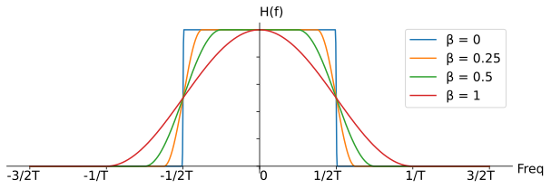
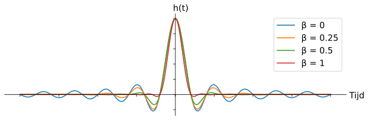

.. _pulse-shaping-chapter:

#######################
Pulse Shaping
#######################

Dit hoofdstuk gaat over pulsvorming, inter-symbool-interferentie, matched filters, en raised-cosine filters.
We zullen uiteindelijk Python gebruiken om pulsvorming toe te passen op BPSK-symbolen.
Je kunt dit hoofdstuk als deel 2 van het Filters hoofdstuk opvatten, waarin we een duik nemen in het vormgeven van pulsen.

**********************************
Inter-Symbool-Interferentie (ISI)
**********************************

In het :ref:`filters-chapter` hoofdstuk hebben we geleerd dat blokvormige symbolen/pulsen een groot deel van het spectrum gebruiken, en dat we het gebruik van het spectrum drastisch kunnen verminderen door het *vormgeven* van onze pulsen.
Maar, je kunt niet zomaar elk laagdoorlaatfilter toepassen want dan krijg je last van inter-symbool-interferentie (ISI). Dit is wanneer symbolen elkaar storen en overlappen.

Wanneer we digitale symbolen versturen, dan versturen we ze zij-aan-zij (i.t.t. een bepaalde tijd te wachten tussen pulsen). Wanneer je een pulsvormend filter toepast worden deze pulsen uitgerekt in het tijddomein (om het samen te drukken in frequentie), waardoor aangrenzende symbolen elkaar in de tijd overlappen. Dit overlappen is niet erg zolang het pulsvormende filter aan een eis voldoet: alle pulsen behalve een, moeten optellen tot 0 op elke veelvoud van de symboolperiode :math:`T`. Dit is het beste te begrijpen door een figuur:

.. image:: ../_images/pulse_train.svg
   :align: center 
   :target: ../_images/pulse_train.svg

Zoals je ziet is op elke interval van :math:`T` er maar een puls hoog, terwijl alle andere pulsen 0 zijn en de x-as kruisen. Wanneer de ontvanger het signaal sampled doet het dit op het perfecte moment (wanner de puls het hoogst is), dus alleen dat moment in tijd is belangrijk. Meestal vindt er nog een vorm van symboolsynchronisatie plaats bij de ontvanger om ervoor te zorgen dat de symbolen inderdaad bij de toppen wordt gesampled.

**********************************
Matched Filter
**********************************

Een truc dat in draadloze communicatie wordt toegepast heet matched filters (op elkaar afgestemde filters).
Om deze afstemming van filters te begrijpen zul je eerst deze twee punten moeten snappen:

1. De besproken pulsen hoeven *alleen bij de ontvanger* voor het samplen perfect te zijn uitgelijnd. Tot dat punt maakt het niet uit of er ISI plaatsvindt, de signalen kunnen met ISI zonder problemen door het luchtruim vliegen.

2. We willen een laagdoorlaatfilter bij de zender om te voorkomen dat ons signaal te veel van het spectrum gebruikt. De ontvanger heeft echter ook een laagdoorlaatfilter nodig om zoveel mogelijk ruis/interferentie op on signaal weg te filteren. Dit resulteert in een laagdoorlaatfilter bij de zender (Tx) alsmede de ontvanger (Rx). De ontvanger sampled het signaal dan na beide filters (en natuurlijk de effecten van het draadloze kanaal).

Wat we in moderne communicatie doen, is het opsplitsen van het vormgevende filter tussen Tx en Rx. Ze *moeten* niet identiek zijn, maar, theoretisch gezien, is het *optimaal* om identieke filters te gebruiken bij de aanwezigheid van AWGN, om de SNR te maximaliseren. Deze vorm van filteren heet het "matched filter" concept.

Een andere manier om hierover na te denken is dat de ontvanger het signaal correleert met een bekend signaal. Dit bekende signaal is in wezen de pulsen die worden verzonden, ongeacht de fase- en amplitudeverschuivingen die erop zijn toegepast. Bedenk dat filteren een convolutie actie is, wat in feite gewoon correlatie is (ze geven wiskundig gezien hetzelfde wanneer het voorbeeldsignaal symmetrisch is).
Dit correleren van het ontvangen is signaal met het voorbeeld geeft ons de beste kans om echt te ontvangen wat is verzonden, daarom is het optimaal.
Als analogie kun je denken aan een beeldherkenningssysteem dat gezichten zoekt aan de hand van een sjabloon- of voorbeeldgezicht en deze correleert (2D) met een figuur:

.. image:: ../_images/face_template.png
   :scale: 70 % 
   :align: center 

**********************************
Een filter opsplitsen
**********************************

Hoe splitsen we eigenlijk een filter in tweeën? Convolutie is associatief, dit betekend:

.. math::
 (f * g) * h = f * (g * h)

Stel dat :math:`f` onze ingang is, en :math:`g` en :math:`h` de filters.  Nu maakt het niet uit of we eerst :math:`f` filteren met :math:`g` en daarna met :math:`h`, of :math:`f` filteren met een enkel filter gelijk aan :math:`g * h`.

Als je nu ook bedenkt dat convolutie in het tijddomein gelijk is aan vermenigvuldigen in het frequentiedomein:

.. math::
 g(t) * h(t) \leftrightarrow G(f)H(f)

Dan komen we tot de conclusie dat we simpelweg de wortel kunnen nemen in het frequentiedomein om het filter op te splitsen. 

.. math::
 X(f) = X_H(f) X_H(f) \quad \mathrm{where} \quad X_H(f) = \sqrt{X(f)}

Hieronder zie je weer een simpel diagram van een zend- en ontvangstketen waarbij de een Raised-Cosine (RC) filter in tweeën is gesplitst tot twee Root Raised Cosine (RRC) filters; het filter van de zender dient om het signaal te vormen en bandbreedte te beperken, het filter bij de ontvanger dient om ruis- en interferentie te beperken. Samen zorgen ze ervoor dat het signaal bij de demodulator gevormd lijkt te zijn door een enkel RC-filter.

.. image:: ../_images/splitting_rc_filter.svg
   :align: center 
   :target: ../_images/splitting_rc_filter.svg

**********************************
Specifieke pulsvormende filters
**********************************

We weten nu dat we:

1. een filter willen ontwerpen dat de bandbreedte beperkt en dat alle pulsen (behalve een) optellen tot nul bij elke symboolperiode;

2. het filter willen opsplitsen en een helft bij de zender en de andere helft bij de ontvanger willen plaatsen.

Laten we eens naar wat specifieke filters kijken die aan deze eisen voldoen:

Raised-Cosine Filter
#########################

Het meest populaire pulsvormende filter lijkt het "raised-cosine" filter te zijn. Het is inderdaad een goed laagdoorlaatfilter en tegelijkertijd somt het inderdaad op tot 0 bij elke interval van :math:`T`.

.. image:: images/raised_cosine.svg
   :align: center 
   :target: images/raised_cosine.svg

Het bovenstaande figuur laat de impulsresponsie van het filter zien.
Met :math:`\beta` kun je de steilheid van het filter instellen in het tijddomein, en dus ook omgekeerd evenredig de steilheid in het frequentiedomein:

Het wordt een raised-cosine filter genoemd omdat bij een :math:`\beta=1` het frequentiedomein een halve cosinus laat zien, raised (opgeduwd) tot boven de x-as.

De impulsresponsie van het filter kun je beschrijven met:

.. math::
 h(t) = \frac{1}{T} \mathrm{sinc}\left( \frac{t}{T} \right) \frac{\cos\left(\frac{\pi\beta t}{T}\right)}{1 - \left( \frac{2 \beta t}{T}   \right)^2}

Je kunt `hier <https://en.wikipedia.org/wiki/Sinc_function>`_ meer lezen over de :math:`\mathrm{sinc}()` functie.

Dit is het raised-cosine filter. Die gaan we echter in tweeën splitsen en dan krijgen we het Root Raised Cosine (RRC) filter!

Root Raised-Cosine Filter
#########################

Bij de zender en ontvanger plaatsen we dus een RRC-filter. Zoals besproken vormen die samen weer een RC-filter.
Helaas wordt de impulsresponsie een rommel omdat we de wortel hebben genomen in het (complexe) frequentiedomein:

.. image:: ../_images/rrc_filter.png
   :scale: 70 % 
   :align: center 

Gelukkig wordt het filter zoveel toegepast dat er vele implementaties van te vinden zijn, zelfs `in Python <https://commpy.readthedocs.io/en/latest/generated/commpy.filters.rrcosfilter.html>`_.

Andere pulsvormende filters
###########################

Een ander filter wat aan de eisen voldoet is het Gaussische filter, met een impulsresponsie dat op een Gaussische functie lijkt.
Er is ook nog een sinc filter, een subset van het RC filter met :math:`\beta=0`. Dit is in feite de ideale vorm met een oneindige impulsresponsie en dus ook een filterovergang van praktisch 0 Hz in het frequentiedomein.

**********************************
Roll-Off Factor
**********************************

Laten we :math:`\beta` wat beter gaan bekijken.  
Het is een getal tussen de 0 en 1 en wordt de "roll-off", of soms "excess bandwith", factor genoemd. Dit bepaalt hoe snel het filter afzakt naar nul in het tijddomein. Om het als een filter te kunnen gebruiken moet de impulsresponsie naar 0 gaan aan beide kanten:

Als resultaat heeft het filter dus meer coëfficiënten nodig naargelang :math:`\beta` lager wordt.
Wanneer :math:`\beta` nul bereikt zal de impulsresponsie nooit meer afzwakken naar 0, dus in de praktijk proberen we :math:`\beta` zo dicht mogelijk bij de nul te krijgen, zonder andere problemen te veroorzaken.
Hoe langzamer de impulsresponsie afzwakt, hoe smaller de bandbreedte van het signaal voor een gegeven symboolsnelheid, wat natuurlijk altijd erg belangrijk is.

Je kunt de bandbreedte in Hz met deze veel gebruikte vergelijking vinden:

.. math::
    \mathrm{BW} = R_S(\beta + 1)

:math:`R_S` is de symboolsnelheid in Hz.  
Voor draadloze communicatie willen we meestal een "roll-off" tussen de 0.2 en 0.5 gebruiken. 
Een goede vuistregel is dat een signaal met een snelheid van :math:`R_s` Hz slecht een beetje meer dan :math:`R_s` aan spectrum zal innemen.
Dus wanneer we met QPSK een miljoen symbolen per seconde (MSps) versturen, zal het rond de 1.3 MHz aan bandbreedte innemen.
In geval van QPSK (2 bits per symbool) levert dat dan een doorvoersnelheid op van 2 Mbps, inclusief de overhead van kanaalcodering en pakketinformatie.

**********************************
Python Oefeningen
**********************************
Laten we eens met Python wat pulsen gaan vormgeven. We zullen hiervoor BPSK-symbolen gebruiken omdat dit reële symbolen zijn en we dus alleen het I-deel hoeven te weergeven, wat iets makkelijker is om te volgen.

.. todo - dit is nog een vage onderbouwing
We gaan 8 samples per symbool toepassen. In plaats van een blokgolf die varieert tussen 1 en -1 zullen we een rij aan pulsen gebruiken. Wanneer je een impuls in een filter stopt zul je de impulsresponsie eruit krijgen. Dus, als je een rij aan pulsen wilt hebben dan zul je het moeten opvullen met nullen zodat je niet een blokgolf krijgt.

.. code-block:: python

    import numpy as np
    import matplotlib.pyplot as plt
    from scipy import signal

    num_symbols = 10
    sps = 8

    bits = np.random.randint(0, 2, num_symbols) # De te verzenden bits

    x = np.array([])
    for bit in bits:
        pulse = np.zeros(sps)
        pulse[0] = bit*2-1 # alleen eerste waarde gelijk aan bitwaarde
        x = np.concatenate((x, pulse)) # de 8 samples toevoegen aan x
    plt.figure(0)
    plt.plot(x, '.-')
    plt.grid(True)
    plt.show()

.. image:: ../_images/pulse_shaping_python1.png
   :scale: 80 % 
   :align: center 

Op dit moment bestaan onze symbolen nog uit 1'en en -1'en.
Raak niet verstrikt in het feit dat we impulsen gebruiken, het is waarschijnlijk makkelijker om het te zien als een array:

.. code-block:: python

 bits: [0, 1, 1, 1, 1, 0, 0, 0, 1, 1]
 BPSK symbolen: [-1, 1, 1, 1, 1, -1, -1, -1, 1, 1]
 8 samples per symbool toepassen: [-1, 0, 0, 0, 0, 0, 0, 0, 1, 0, 0, 0, 0, 0, 0, 0, 1, 0, 0, 0, 0, 0, 0, 0, ...]

We zullen een RC-filter bouwen met een :math:`\beta` van 0.35 en 101 coëfficiënten zodat het signaal genoeg tijd heeft om naar 0 te gaan.
De RC vergelijking vraagt om een periodetijd met een tijdvector, maar voor het gemak zullen we uitgaan van een periodetijd van 1 seconde.
Dit betekent dat onze symboolperiode :math:`T_s` dan 8 is omdat we 8 samples per symbool hebben gebruikt.
Onze tijdvector zal dan gewoon een oplopende lijst van gehele getallen zijn.
Met de manier waarop de filtervergelijking werkt willen we het tijdstip 0 in het midden hebben. De 101 coëfficiënten zullen dan starten bij -51 en eindigen bij +52.

.. code-block:: python

    # het RC filter bouwen
    num_taps = 101
    beta = 0.35
    Ts = sps # sample rate is 1 Hz, periodetijd is 1, *symbool*periodetijd is 8
    t = np.arange(-51, 52) # neemt laatste nummer niet mee
    h = sps/Ts*np.sinc(t/Ts) * np.cos(np.pi*beta*t/Ts) / (1 - (2*beta*t/Ts)**2)
    plt.figure(1)
    plt.plot(t, h, '.')
    plt.grid(True)
    plt.show()

.. image:: ../_images/pulse_shaping_python2.png
   :scale: 80 % 
   :align: center 

De uitgang zakt zeker naar 0 aan beide kanten. De hoeveelheid samples per symbool bepaalt hoe smal dit filter lijkt en hoe snel het naar 0 afzwakt.
De bovenstaande impulsresponsie lijkt op een typisch laagdoorlaatfilter. Er is vrijwel geen onderscheid te maken tussen een vormgevend filter en een algemeen laagdoorlaatfilter.

Nu zullen we het filter toepassen op ons signaal :math:`x` en het resultaat bestuderen.
De for-loop tekent alleen wat extra lijntjes in het figuur, maak je hier niet druk om.

.. code-block:: python 
 
    # signaal x filteren.
    x_shaped = np.convolve(x, h)
    plt.figure(2)
    plt.plot(x_shaped, '.-')
    #wat lijntjes toevoegen op de juiste momenten
    for i in range(num_symbols):
        plt.plot([i*sps+num_taps//2,i*sps+num_taps//2], [0, x_shaped[i*sps+num_taps//2]])
    plt.grid(True)
    plt.show()

.. image:: ../_images/pulse_shaping_python3.svg
   :align: center 
   :target: ../_images/pulse_shaping_python3.svg

Het resultaat is een opsomming van alle impulsresponsies waarbij ongeveer de helft met -1 is vermenigvuldigd. Het ziet er ingewikkeld uit dus we zullen er samen doorheen lopen.

Als eerste zie je samples voor en achter de data vanwege hoe convolutie werkt. De extra samples worden wel meegestuurd, maar bevatten geen 'pieken' van de impulsen.

Als tweede zijn de verticale lijnen aangebracht voor de uitleg. Ze laten zien waar elk samplemoment :math:`T_s` plaatsvindt.
Het zijn de momenten waarop de ontvanger het signaal moet samplen. 
Op elk samplemoment is het signaal precies 1.0 of -1.0: het ideale tijdstip om te samplen.

Zouden we dit signaal moduleren op een draaggolf en verzenden, dan moet de ontvanger zelf bepalen waar de samplemomenten vallen met bijvoorbeeld een symboolsynchronisatie-algoritme. Mocht de ontvanger net te vroeg of te laat samples nemen dan krijgen we waarden die door ISI een beetje afwijken, mochten we veel te vroeg of laat samplen dan krijgen we alleen een boel rare getallen.

Hieronder laten we in een IQ-diagram zien hoe het op tijd (of niet) samplen eruitziet. 

.. image:: ../_images/symbol_sync1.png
   :scale: 50 % 
   :align: center 

Onderstaande diagram laat de ideale samplemomenten zien:

.. image:: ../_images/symbol_sync2.png
   :scale: 40 % 
   :align: center 

Vergelijk dat eens met de slechtste samplemomenten. We zien nu 3 clusters aan samples in het IQ-diagram. Doordat we midden elk symbool samplen krijgen we totaal verkeerde samples binnen.

.. image:: ../_images/symbol_sync3.png
   :scale: 40 % 
   :align: center 

En hier is nog een voorbeeld, ergens tussen bovenstaande voorbeelden in. Nu hebben we vier clusters. Met een hoge SNR zou deze timing net voldoende kunnen zijn, maar het wordt niet aangeraden.

.. image:: ../_images/symbol_sync4.png
   :scale: 40 % 
   :align: center 
