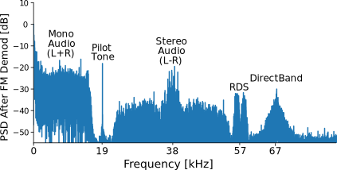
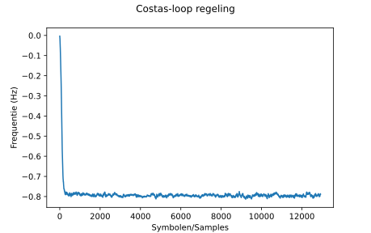

.. _rds-chapter:

##################
Compleet voorbeeld
##################

We zullen in dit hoofdstuk vele geleerde concepten samenbrengen en door een compleet voorbeeld heenlopen waarin we een echt digitaal signaal ontvangen en decoderen. We zullen kijken naar het Radio Data Systeem (RDS) wat een protocol is om kleine hoeveelheden informatie in een FM-signaal te stoppen, zoals de naam van het nummer. We zullen FM moeten demoduleren, verschuiven, filteren, decimeren, hersamplen, synchroniseren, decoderen en de bytes interpreteren. Er is sowieso een IQ-bestand beschikbaar waarmee je kunt testen wanneer je geen SDR klaar hebt liggen.

********************************
Introductie FM-Radio en RDS
********************************

Om RDS te kunnen begrijpen zullen we eerst kijken naar hoe een FM-signaal is opgebouwd.
Je bent waarschijnlijk al bekend met het audio gedeelte van een FM-signaal.
Naast de audio worden, in een FM-signaal, nog meer informatiecomponenten frequentie gemoduleerd.
In plaats van de signaalstructuur te Googelen kunnen we ook naar de PSD (spectrale vermogensdichtheid) kijken van een FM-signaal *na* demodulatie.
We bekijken enkel het positieve deel omdat een gedemoduleerd FM-signaal reëel is, zelfs als de ingang complex was.

.. _PSD:
.. figure:: ../_images/fm_psd.svg
   :align: center 
   :target: ../_images/fm_psd.svg

   PSD van gedemoduleerd FM-signaal

Door het signaal in het frequentiedomein te bekijken zien we de volgende signalen:

#. Een signaal met een hoog vermogen tussen 0 - 17 kHz
#. Een toon op 19 kHz
#. Gecentreerd op 38 kHz en ongeveer 30 kHz breed zien we een interessant symmetrisch signaal.
#. Een dubbel signaal gecentreerd op 57 kHz
#. Een enkel signaal gecentreerd op 67 kHz

Dit is alles wat we uit de PSD kunnen halen, en let op dat dit *na* de FM demodulatie is. De PSD voordat we het demoduleren ziet er als volgt uit, en dit vertelt ons vrijwel niets.

.. image:: ../_images/fm_before_demod.svg
   :align: center 
   :target: ../_images/fm_before_demod.svg
   
Toch is het belangrijk te beseffen dat wanneer je een signaal frequentiemoduleert, een hogere frequentie in de data ook een hogere frequentie in het FM-signaal zal opleveren.
Dus het signaal op 67 kHz zorgt ervoor dat de totale bandbreedte van het signaal toeneemt, de hoogste frequentiecomponent is ongeveer 75 kHz volgens figuur :numref:`PSD`.
Wanneer we `de bandbreedte-regel van Carson <https://en.wikipedia.org/wiki/Carson_bandwidth_rule>`_ op FM toepassen, zegt dit dat een FM-zender ongeveer 250 kHz aan spectrum inneemt. Om deze reden samplen we meestal op 250 kHz (vergeet niet dat bij kwadratuur/IQ-sampling de ontvangen bandbreedte gelijk is aan de samplerate).

Sommige lezers die gewend zijn om de FM-band met een SDR of spectrumanalyzer te bekijken herkennen het volgende diagram. Misschien denk je dat de blokkige signalen naast de FM-zenders RDS zijn.

.. image:: ../_images/fm_band_psd.png
   :scale: 80 % 
   :align: center 

Het blijkt dat deze blokkige signalen eigenlijk HD Radio zijn, een digitale versie van hetzelfde FM-radiosignaal (zelfde audio).
Deze digitale versie geeft de ontvanger een hogere kwaliteit audio, omdat digitale signalen geen analoge ruis bevatten zoals het analoge signaal.

Weer terug naar de 5 signalen die we in onze PSD herkenden; Het volgende diagram laat zien waar elk signaal voor wordt gebruikt:

We doorlopen deze signalen in willekeurige volgorde:

De mono en stereo audiosignalen bevatten gewoon de audio. Je kunt door middel van optellen of aftrekken de linker en rechter kanalen onderscheiden.

De toon op 19 kHz wordt gebruikt om het stereo signaal te kunnen demoduleren. Door het verdubbelen van de toon kun je het gebruiken als frequentie- en fasereferentie, het audiosignaal is namelijk gecentreerd op 38 kHz. Dit verdubbelen kun je doen door de samples te kwadrateren.

DirectBand werd in Noord-Amerika gebruikt als een datanetwerk van Microsoft. Ook bekend als "MSN direct" onder de consumenten.
Het verstuurde informatie naar apparaten zoals GPS ontvangers, horloges en weerstations. Je kon zelfs berichtjes ontvangen van Windows Live Messenger. De meest succesvolle toepassing was real-time verkeersinformatie voor Garmin GPS-ontvangers. Dit werd door miljoenen mensen gebruikt voordat smartphones breed beschikbaar waren. De service is in januari 2012 uitgeschakeld. Naar mijn weten is dit nooit in Nederland toegepast.

Als laatste komen we bij RDS waar de rest van het hoofdstuk om draait. Zoals in de PSD is te zien, is het ongeveer 4 kHz breed en is het rechts van het stereosignaal te vinden. Het is een digitaal communicatieprotocol waarmee FM-stations op lage snelheid informatie kunnen oversturen zoals de naam van het station, programma informatie, tijd en overige dingen. De standaard is gepubliceerd als IEC 62106 en kun je `hier terugvinden <http://www.interactive-radio-system.com/docs/EN50067_RDS_Standard.pdf>`_.

********************************
Het RDS-Signaal
********************************

We zullen in dit hoofdstuk Python toepassen om RDS te ontvangen. Om goed te begrijpen hoe je het ontvangt, is het verstandig om eerst uit te zoeken hoe het signaal wordt gevormd en uitgezonden.

Zender
#############

De RDS-informatie dat door een FM-station wordt verzonden (bijv. naam nummer) is gecodeerd in groepen van 8 bytes.
Elke set van 8 bytes, wat overeenkomt met 64 bits, wordt met 40 "controllebits" gegroepeerd. Deze 104 bits worden samen verzonden zonder enige vertraging tussen de groepen. De ontvanger moet dus de grens tussen de groepen zien te vinden. We gaan de details hierover bekijken wanneer we naar de ontvanger gaan.

Om deze bits draadloos te versturen gebruikt RDS BPSK. We hebben in het :ref:`modulation-chapter` hoofdstuk gezien dat dit een simpel modulatieschema is waarmee de fase van de draaggolf aan de enen en nullen wordt gekoppeld.
RDS maakt gebruik van differentiële codering zodat we niet langer zorgen hoeven te maken over een 180 graden fasedraaiing.
De BPSK-symbolen worden verstuurd op een snelheid van 1187.5 symbolen per seconde.
Omdat BPSK slechts 1 bit per symbool gebruikt komt dit neer op een transmissiesnelheid van ongeveer 1.2 kbps.
RDS gebruikt geen kanaalcodering (foutcorrectie) maar bevat wel een CRC-som om fouten te kunnen detecteren.
De ervaren BPSK-er vraagt zich misschien af waarom het signaal twee zijbanden heeft in figuur :numref:`PSD`; meestal heeft BPSK maar 1 zijband.
RDS blijkt het BPSK-signaal te dupliceren/spiegelen rondom 57 kHz voor extra redundantie. 
Wanneer we de Pythoncode gaan bekijken gebruiken we een filter om slechts een van deze BPSK-signalen te demoduleren.

Het dubbele BPSK-signaal wordt uiteindelijk in frequentie verschoven naar 57 kHz en aan alle andere componenten van het FM-signaal toegevoegd, voordat de frequentiemodulatie zelf plaatsvindt. 
FM-signalen worden, vergeleken met andere draadloze communicatie, uitgezonden op extreem hoge vermogens, tot 80 kW!
Om deze reden hebben veel SDR-gebruikers een band-stop-filter in serie met de antenne gezet om te voorkomen dat het FM-signaal andere signalen overstemt.

Ontvanger
############

De volgende stappen zijn nodig om RDS te demoduleren en decoderen. Je hoeft deze lijst niet te onthouden, we zullen elke stap gaan behandelen:

#. FM-signaal ontvangen (of lees een IQ-opname), meestal met een samplerate van 250 kHz
#. "kwadratuur demodulatie" toepassen om het FM-signaal te demoduleren
#. Frequentieverschuiving van 57 kHz toepassen zodat het RDS-signaal zich rond de 0 Hz bevindt.
#. Laagdoorlaatfilter toepassen om alleen RDS over te houden
#. Decimeren met 10, na het filteren werken we toch met lagere frequenties
#. Hersamplen naar 19 kHz zodat we een geheel getal aan samples per symbool hebben
#. Een van de RDS-signalen wegfilteren met een banddoorlaatfilter
#. Tijdsynchronisatie, met behulp van Mueller en Muller in dit voorbeeld
#. Fijne frequentiesynchronisatie m.b.v. een Costas-loopcomponent
#. BPSK demoduleren naar 1'en en 0'en.
#. Differentieel decoderen
#. De 1'en en 0'en groeperen in bytes
#. De bytes ontleden tot de uiteindelijke data

Het lijkt op een hoop stappen, maar RDS is een van de makkelijkste protocollen om te decoderen. Een modern protocol zoals wifi of 5G heeft een boek nodig om de PHY/MAC lagen uit te leggen.

We zullen nu gaan kijken naar de pythoncode waarmee we RDS kunnen ontvangen.
Deze code werkt met een `FM opname die je hier kunt vinden <https://github.com/versd/pysdr/blob/dutch/fm_1027mhz_250ksps?raw=true>`_, of met een eigen ontvangen signaal zolang de SNR maar hoog genoeg is. Je hoeft alleen af te stemmen op de middenfrequentie van het FM-station en te samplen op 250 kHz.
Om het signaalvermogen te maximaliseren helpt het om een dipoolantenne toe te passen met de juiste lengte (~1.5 meter), niet de 2.4 GHz antennes van de Pluto.
Daarentegen is FM wel een heel luid signaal, als je dicht bij een raam staat, of buiten, is de 2.4 GHz antenne waarschijnlijk genoeg om sterke FM stations te ontvangen.

In de volgende delen behandelen we telkens een klein stukje code, maar de totale code is ook aan het einde van dit hoofdstuk te vinden.
Elk deel zal een stuk code geven en uitleggen wat het doet.

********************************
Signaal ontvangen
********************************

.. code-block:: python

 import numpy as np
 from scipy.signal import resample_poly, firwin, bilinear, lfilter
 import matplotlib.pyplot as plt
 
 # Read in signal
 x = np.fromfile('/home/versd/Downloads/fm_1027mhz_250ksps', dtype=complex64)
 sample_rate = 250e3
 center_freq = 102.7e6

Hiermee lezen we de testopname in. De opname was gesampled op 250 kHz met een hoge SNR om RDS te kunnen decoderen. Je zult het pad naar het bestand moeten aanpassen voor jouw systeem. Je kunt natuurlijk ook een SDR gebruiken, alhoewel het zal helpen de code eerst te testen met de `FM opname die je hier kunt vinden <https://github.com/versd/pysdr/blob/dutch/fm_1027mhz_250ksps?raw=true>`_.
Door alle code heen zullen we :code:`x` gebruiken als het signaal. 

********************************
FM Demodulatie
********************************

.. code-block:: python

 # Kwadratuur Demod
 x = 0.5 * np.angle(x[0:-1] * np.conj(x[1:])) # zie https://wiki.gnuradio.org/index.php/Quadrature_Demod

Zoals aan het begin van het hoofdstuk is behandeld, wordt een FM-signaal gevormd door meerdere componenten te combineren en vervolgens te frequentiemoduleren om het door de lucht te zenden. De eerste stap is dus om die frequentiemodulatie ongedaan te maken.
Een andere manier om erover na te denken is dat de informatie in de frequentievariatie van het ontvangen signaal is gestopt, en we de informatie willen demoduleren zodat het in de amplitudeverschillen gaat zitten, en niet langer frequentie.
Let op dat de uitgang een reëel signaal is, terwijl de ingang complex was.

Wat deze enkele regel Python-code doet is de vermenigvuldiging uitrekenen tussen ons signaal en een vertraagde en geconjugeerde versie van ons signaal. Hierna berekent het de fase van elke sample van het resultaat, dit is het moment waar het signaal reëel wordt.
We kunnen als volgt bewijzen dat deze regel inderdaad de informatie uit de frequentievariatie onttrekt.
Neem een toon met frequentie :math:`f` en fase :math:`\phi` dat we kunnen uitdrukken als :math:`e^{j2 \pi (f t + \phi)}`.
Als we nu in de discrete tijd gaan denken, gebruiken we niet langer de continue :math:`t` maar maken we stappen van :math:`nT` met :math:`T` de duur van de stap.
Voor het gemak maken we :math:`T` gelijk aan 1 en kunnen dan de vergelijking schrijven als :math:`e^{j2 \pi (f n + \phi)}`.
Het geconjugeerde en vertraagde signaal is dan :math:`e^{-j2 \pi (f (n-1) + \phi)}`.
De regel wordt:

.. math:: 
    e^{j2 \pi (fn + \phi)}*e^{-j2 \pi (f(n-1) + \phi)}=e^{j2 \pi (fn-f(n-1) +\phi -\phi)} = e^{j2 \pi f}

Dit is mooi, want nu is :math:`\phi` verdwenen en de hoek van het complexe getal is gelijk aan de huidige frequentie :math:`f`.

Een bijkomend voordeel van frequentiemodulatie is dat variaties in de amplitude van het ontvangen signaal geen impact heeft op het volume van de audio, zoals bij AM radio wel het geval is. 

********************************
Frequentieverschuiving
********************************

.. code-block:: python

 # Freq verschuiven
 N = len(x)
 f_o = -57e3 # hoeveelheid in Hz
 t = np.arange(N)/sample_rate # tijdvector
 x = x * np.exp(2j*np.pi*f_o*t) # verschuiving

We gaan nu het signaal in frequentie naar beneden schuiven met 57 kHz. We kunnen hiervoor de :math:`e^{j2 \pi f_ot}` *truc* gebruiken uit het :ref:`sync-chapter` hoofdstuk waarbij :code:`f_o` de verschuiving is in Hz en :code:`t` de tijdvector. Dat de tijdvector bij 0 begint is niet belangrijk, wat wel belangrijk is, is dat de juiste periodetijd wordt gebruikt, de inverse van de samplefrequentie. 
Trouwens, omdat een reëel signaal gespiegeld is rond 0 Hz maakt het niet uit of we -57 of + 57 kHz verschuiven. Aan beide kanten van 0 Hz is het RDS-signaal te vinden.

********************************
RDS eruit filteren
********************************

.. code-block:: python

 # laagdoorlaatfilter
 taps = firwin(numtaps=101, cutoff=7.5e3, fs=sample_rate)
 x = np.convolve(x, taps, 'valid')

Nu zullen we alle signalen behalve RDS moeten wegfilteren. Omdat het RDS-signaal nu gecentreerd is rond 0 Hz willen we een laagdoorlaatfilter toepassen. We kunnen :code:`firwin()` gebruiken om de coëfficiënten van een FIR filter te berekenen. Het heeft alleen het aantal coëfficiënten en de kantelfrequentie nodig. De samplerate moet ook worden gegeven omdat de kantelfrequentie anders geen betekenis heeft voor firwin. Het resultaat is een symmetrisch laagdoorlaatfilter met reële coëfficiënten waarmee we het signaal kunnen convolueren. 
We kiezen :code:`'valid'` om randeffecten bij de convolutie te voorkomen, alhoewel het in dit geval niet echt uitmaakt omdat we toch een enorm lang signaal geven waardoor een paar gekke samples aan de randen weinig invloed heeft.

********************************
Met 10 decimeren
********************************

.. code-block:: python

 # Geen vouwvervorming meer dankzij het filter, nu decimeren met 10
 x = x[::10]
 sample_rate = 25e3

Telkens wanneer je een klein stuk van de originele bandbreedte overhoudt dankzij een filter (bijv. van 125 kHz *reële* bandbreedte naar 7.5 kHz), heeft het nut te decimeren. In het begin van het :ref:`sampling-chapter` hoofdstuk hebben we geleerd over de Nyquistfrequentie, en dat we een signaal met beperkte bandbreedte volledig kunnen opslaan, zolang we twee keer zo snel samplen als de hoogste frequentie in het signaal.
Dus, nu we ons laagdoorlaatfilter hebben toegepast is de hoogste frequentie ongeveer 7.5 kHz, en een samplerate van 15 kHz zou voldoende moeten zijn. Voor de zekerheid voegen we er nog een marge aan toe en gaan we een samplerate van 25 kHz gebruiken. Deze frequentie helpt later ook nog eens.

Om te decimeren kunnen we simpelweg 9 van de 10 samples weggooien. We hadden immers een frequentie van 250 kHz en we willen naar 25 kHz.
Dit lijkt in eerste instantie verwarrend, want 90% van de samples weggooien voelt alsof we informatie verliezen, maar als je het :ref:`sampling-chapter` hoofdstuk doorleest, zie je dat we echt niets verliezen vanwege het filter. Het laagdoorlaatfilter werkt als een anti-aliasing filter en vermindert de maximale frequentie en dus bandbreedte van het signaal.

Vanuit de code bekeken is dit de makkelijkste stap, maar vergeet niet de :code:`sample_rate` variabele nu ook aan te passen!

********************************
Hersamplen naar 19 kHz
********************************

.. code-block:: python

 # Hersamplen naar 19kHz
 x = resample_poly(x, 19, 25) # omhoog, beneden
 sample_rate = 19e3

In het :ref:`pulse-shaping-chapter` hoofdstuk is het concept van "samples per symbool" duidelijk gemaakt en hebben we gezien dat een volledig aantal samples per symbool handiger is dan een fractioneel aantal. 
Eerder is opgemerkt dat RDS met BPSK 1187.5 symbolen per seconde verstuurt.
Met een samplefrequentie van 25 kHz komt dit neer op 21.052631579 samples per symbool (denk hier even over na als je deze uitkomst niet volgt).
Wat we dus echt willen is een samplefrequentie dat een veelvoud is van 1187.5 Hz, maar wel voldoet aan Nyquist. In de vorige sectie hadden we besloten dat de samplefrequentie tenminste 15 kHz moest zijn en met een marge 25 kHz.

De gewenste samplefrequentie is nu afhankelijk van hoeveel samples per symbool we willen overhouden. Stel we willen 10 samples per symbool. De RDS-symboolfrequentie van 1187.5 maal 10 geeft ons een samplefrequentie van 11.875 kHz. Dit voldoet helaas niet aan Nyquist. Wat als we 13 samples per symbool proberen? Dan komen we uit op 15437.5 Hz. dit is wel boven de 15 kHz maar niet zo'n mooie frequentie. En wat als we de volgende macht van 2 proberen, dus 16 samples per symbool? 1187.5 maal 16 levert exact 19 kHz op! Dit nummer is geen toeval maar een protocol ontwerpkeuze.

Om de samplefrequentie nu van 25 kHz naar 19 kHz te brengen kunnen we :code:`resample_poly()` toepassen. Deze functie interpoleert met een gehele waarde, filtert, en decimeert met een gehele waarde. Dit is handig want nu kunnen we 25 en 19 gebruiken i.p.v. 25000 en 19000. Hadden we toch voor 13 samples per symbool gekozen, dan hadden we :code:`resample_poly()` niet kunnen gebruiken en zou alles veel lastiger worden.

Nogmaals, vergeet niet om de :code:`sample_rate` variabele aan te passen wanneer het is veranderd.

********************************
Banddoorlaatfilter
********************************

.. code-block:: python

 # Banddoorlaatfilter om 1 RDS BPSK signaal te isoleren
 taps = firwin(numtaps=501, cutoff=[0.05e3, 2e3], fs=sample_rate, pass_zero=False)
 x = np.convolve(x, taps, 'valid')

We weten dat RDS twee identieke BPSK signalen bevat gezien de vorm van de PSD (figuur :numref:`PSD`).  We moeten er een kiezen, dus we kiezen er willekeurig voor om het positieve deel te behouden door middel van een banddoorlaatfilter. Weer gebruiken we :code:`firwin()`, maar nu met  :code:`pass_zero=False` waarmee we aangeven dat het om een banddoorlaatfilter gaat. Er zijn dus twee kantelfrequenties nodig. Omdat we 0 Hz niet als kantelfrequentie kunnen opgeven, kiezen we voor 50 Hz. Als laatste verhogen we ook het aantal coëfficiënten zodat we een scherp filter krijgen. We kunnen deze instelling verifiëren door het filter in het tijd- en frequentiedomein te bekijken, d.m.v. de coëfficiënten en de FFT ervan. Zie dat de doorlaatband in het frequentiedomein tot bijna 0 Hz gaat.

.. image:: ../_images/bandpass_filter_taps.svg
   :align: center 
   :target: ../_images/bandpass_filter_taps.svg

.. image:: ../_images/bandpass_filter_freq.svg
   :align: center 
   :target: ../_images/bandpass_filter_freq.svg

Kanttekening: Op een gegeven moment zal ik dit filter vervangen met een echt matched filter (volgens mij gebruikt RDS een RRC filter). Met de firwin() aanpak kreeg ik dezelfde bitfout-frequentie als met GNU Radio's gematchte filter, dus het is duidelijk geen harde eis.

***********************************
Tijdsynchronisatie (Symbool-niveau)
***********************************

.. code-block:: python

 # Symbol sync, zoals uit het synchronisatie hoofdstuk sync chapter
 samples = x # zodat we met het synchronisatie hoofdstuk overeenkomen
 samples_interpolated = resample_poly(samples, 32, 1) # we interpoleren met 32, dit lijkt beter te werken dan 16
 sps = 16
 mu = 3 # eerste inschatting van faseafwijking
 out = np.zeros(len(samples) + 10, dtype=np.complex64)
 out_rail = np.zeros(len(samples) + 10, dtype=np.complex64) # oude waardes opslaan
 i_in = 0 # input samples index
 i_out = 2 # output index (eerste twee zijn 0)
 while i_out < len(samples) and i_in+32 < len(samples):
     out[i_out] = samples_interpolated[i_in*32 + int(mu*32)] #neem het `beste` sample
     out_rail[i_out] = int(np.real(out[i_out]) > 0) + 1j*int(np.imag(out[i_out]) > 0)
     x = (out_rail[i_out] - out_rail[i_out-2]) * np.conj(out[i_out-1])
     y = (out[i_out] - out[i_out-2]) * np.conj(out_rail[i_out-1])
     mm_val = np.real(y - x)
     mu += sps + 0.8*mm_val
     i_in += int(np.floor(mu)) # afronden naar geheel getal
     mu = mu - np.floor(mu) # fractie berekenen
     i_out += 1 # output index verhogen
 x = out[2:i_out] # pak alleen de nuttige data

Eindelijk kunnen we de symbool/tijdsynchronisatie gaan toepassen. We gebruiken exact dezelfde Mueller en Muller kloksynchronisatie code als uit het :ref:`sync-chapter` hoofdstuk. Je kunt dat lezen mocht je meer willen weten over deze code. We stellen het aantal samples per symbool (:code:`sps`) in op 16, zoals eerder besloten. Een mu versterking van 0.8 is met trial-en-error gevonden als een waarde die goed werkt met ons signaal. De uitgang krijgt 1 sample per symbool met "zachte" samples en een mogelijke frequentieafwijking. De volgende animatie kunnen we gebruiken om te verifiëren dat we BPSK-symbolen krijgen (met een frequentieverschuiving wat rotatie veroorzaakt):

.. image:: ../_images/constellation-animated.gif
   :scale: 80 % 
   :align: center 

Mocht je een eigen FM-signaal gebruiken, en je krijgt nu niet twee aparte clusters van complexe samples, dan kan het synchronisatie-algoritme van hierboven niet synchroniseren of je hebt in de eerdere stappen een fout gemaakt. Je hoeft de constellatie niet te animeren, maar probeer niet alle samples te weergeven want dan zie je alleen een cirkel. Als je 100 of 200 samples per keer laat zien dan heb je een beter gevoel of dat er twee clusters zijn of niet, zelfs als ze ronddraaien.

********************************
Fijne Frequentiesynchronisatie
********************************

.. code-block:: python

 # Fijne freq sync
 samples = x # om met het sync hoofdstuk overeen te komen
 N = len(samples)
 phase = 0
 freq = 0
 # deze parameters maken de regelaar sneller of langzamer (of instabiel)
 alpha = 100
 beta = 0.23
 out = np.zeros(N, dtype=np.complex64)
 freq_log = []
 for i in range(N):
     out[i] = samples[i] * np.exp(-1j*phase) # intgang corrigeren met geschatte afwijking
     error = np.real(out[i]) * np.imag(out[i]) # foutvergelijking voor BPSK
 
     # fase- en frequentieafwijking opnieuw bepalen
     freq += (beta * error)
     freq_log.append(freq * sample_rate / (2*np.pi)) # van rad/s naar Hz voor loggen
     phase += freq + (alpha * error)
 
     # Fase tussen 0 and 2pi forceren
     while phase >= 2*np.pi:
         phase -= 2*np.pi
     while phase < 0:
         phase += 2*np.pi
 x = out

We kopiëren ook de fijne frequentiesynchronisatie-code van het :ref:`sync-chapter` hoofdstuk.
We gebruiken dus een Costas-loop om enig overgebleven frequentieafwijking te corrigeren en BPSK uit te lijnen met de reële (I) as.
Alles wat overblijft op de Q as komt waarschijnlijk door ruis, als de lus goed is afgesteld.
Laten we dezelfde animatie als eerder bekijken maar met de frequentiesynchronisatie toegepast (het is gestopt met draaien!):

.. image:: ../_images/constellation-animated-postcostas.gif
   :scale: 80 % 
   :align: center 

We kunnen ook nog de geschatte frequentieafwijking over de tijd weergeven om te zien hoe de Costas-loop werkt. We hadden dit immers opgeslagen in de code. Het lijkt op een afwijking van ongeveer 0.8 Hz, mogelijk veroorzaakt door een oscillatorafwijking bij de zender, maar waarschijnlijk bij de ontvanger. Wanneer je een eigen signaal gebruikt zul je :code:`alpha` en :code:`beta` moeten aanpassen totdat je een vergelijkbaar figuur krijgt. Het zou redelijk snel moeten afregelen met minimale oscillaties. Wat na steady-state overblijft is jitter, niet oscillaties.

********************************
BPSK demoduleren
********************************

.. code-block:: python

 # Demod BPSK
 bits = (np.real(x) > 0).astype(int) # enen en nullen

BPSK demoduleren is op dit punt erg simpel geworden. Omdat elk sample een *zacht* symbool voorstelt hoeven we alleen nog maar te kijken of de sample boven of onder de 0 is. Het stukje :code:`.astype(int)` is zodat we een array van getallen krijgen, in plaats van booleaanse variabelen. Als je je afvraagt of onder/boven de nul een 1 of een 0 voorstelt, dan zul je in de volgende sectie zien dat dit niet uitmaakt!

********************************
Differentieel decoderen
********************************

.. code-block:: python

 # Differentieel decoderen, het maakt dan niet uit of alles 180 graden gedraaid is.
 bits = (bits[1:] - bits[0:-1]) % 2
 bits = bits.astype(np.uint8) # voor decoderen

Toen het BPSK-signaal werd opgezet, is differentiële codering gebruikt. Dit betekent dat elke 1 en 0 van de originele data op zo'n manier is opgezet dat een bit verandering een 1 oplevert, en geen verandering een 0. Het grote voordeel van differentiële codering is dat je geen zorgen meer hebt over een mogelijke 180 graden fasedraaiing. Je kijkt dus niet meer of een 1 groter of kleiner dan nul moet zijn, je kijkt nu alleen of er een verschil is geweest tussen 1 en 0. Dit concept is misschien makkelijker te begrijpen door naar voorbeelddata te kijken. Hieronder zie je 10 symbolen voor en na differentiële decodering:

.. code-block:: python

 [1 1 1 1 0 1 0 0 1 1] # voor differentiele decodering
 [- 0 0 0 1 1 1 0 1 0] # na differentiele decodering

********************************
RDS Decoderen
********************************

Nu we eindelijk onze bits aan informatie hebben kunnen we het gaan decoderen en zien wat het betekent.
Het enorme blok code wat hieronder is gegeven zullen we gebruiken om de 1'en en 0'en te decoderen naar groepen bytes.
Dit deel zou een stuk logischer worden al we eerst het zendende deel van RDS hadden gemaakt, maar accepteer voor nu dat RDS, groepen van 12 bytes gebruikt. De eerste 8 bytes geven de data aan, de laatste 4 bytes dienen voor synchronisatie. De laatste 4 bytes zijn niet noodzakelijk voor de volgende stap (het interpreteren van de data) dus dit wordt niet meegenomen in de uitgang. 
Dit blok code neemt de 1'en en 0'en van hierboven en geeft aan de uitgang een lijst van bytes (in groepen van 8). Dit is handig voor de volgende stap waarbij we door de lijst gaan, per groep van 8 bytes.

Het grootste gedeelte van de onderstaande code draait om het synchroniseren en de foutcontrole.
Het werkt in blokken van 104 bits waarbij elk blok succesvol is ontvangen of fouten bevat (CRC controle). Elke 50 blokken controleert het of er meer dan 35 blokken een fout hadden, waarna het de synchronisatie probeert te herstarten.
De CRC wordt uitgevoerd met een 10-bits controle, met de polynoom :math:`x^{10}+x^8+x^7+x^5+x^4+x^3+1`; dit vindt plaats wanneer :code:`reg` met 0x5B9 wordt geXORt, het binaire equivalent van de polynoom.
In Python kun je bitoperaties uitvoeren met :code:`& | ~ ^` voor de functies [and, or, not, xor], net als in C/C++.
Een bitverschuiving naar links is :code:`x << y` (het zelfde als x vermenigvuldigen met 2**y), en een bitverschuiving naar rechts is :code:`x >> y` (net als x delen door 2**y), net als in C/C++.  

Je **hoeft niet** door alle code heen te lopen, of iets ervan, zeker als je focust op het leren van de fysieke (PHY) laag i.r.t. DSP en SDR, dit betreft *geen* signaalbewerking.
De code is simpelweg een implementatie van een RDS-decodering en alleen toepasbaar op het RDS-protocol. 
Als je door dit hoofdstuk bent uitgeput, voel je dan vrij om dit enorme stuk code gewoon over te slaan.
Het heeft een vrij makkelijke functie maar lost het complex op.

.. code-block:: python

 # Constants
 syndrome = [383, 14, 303, 663, 748]
 offset_pos = [0, 1, 2, 3, 2]
 offset_word = [252, 408, 360, 436, 848]
 
 # see Annex B, page 64 of the standard
 def calc_syndrome(x, mlen):
     reg = 0
     plen = 10
     for ii in range(mlen, 0, -1):
         reg = (reg << 1) | ((x >> (ii-1)) & 0x01)
         if (reg & (1 << plen)):
             reg = reg ^ 0x5B9
     for ii in range(plen, 0, -1):
         reg = reg << 1
         if (reg & (1 << plen)):
             reg = reg ^ 0x5B9
     return reg & ((1 << plen) - 1) # select the bottom plen bits of reg
 
 # Initialize all the working vars we'll need during the loop
 synced = False
 presync = False
 
 wrong_blocks_counter = 0
 blocks_counter = 0
 group_good_blocks_counter = 0
 
 reg = np.uint32(0) # was unsigned long in C++ (64 bits) but numpy doesn't support bitwise ops of uint64, I don't think it gets that high anyway
 lastseen_offset_counter = 0
 lastseen_offset = 0
 
 # the synchronization process is described in Annex C, page 66 of the standard */
 bytes_out = []
 for i in range(len(bits)):
     # in C++ reg doesn't get init so it will be random at first, for ours its 0s
     # It was also an unsigned long but never seemed to get anywhere near the max value
     # bits are either 0 or 1
     reg = np.bitwise_or(np.left_shift(reg, 1), bits[i]) # reg contains the last 26 rds bits. these are both bitwise ops
     if not synced:
         reg_syndrome = calc_syndrome(reg, 26)
         for j in range(5):
             if reg_syndrome == syndrome[j]:
                 if not presync:
                     lastseen_offset = j
                     lastseen_offset_counter = i
                     presync = True
                 else:
                     if offset_pos[lastseen_offset] >= offset_pos[j]:
                         block_distance = offset_pos[j] + 4 - offset_pos[lastseen_offset]
                     else:
                         block_distance = offset_pos[j] - offset_pos[lastseen_offset]
                     if (block_distance*26) != (i - lastseen_offset_counter):
                         presync = False
                     else:
                         print('Sync State Detected')
                         wrong_blocks_counter = 0
                         blocks_counter = 0
                         block_bit_counter = 0
                         block_number = (j + 1) % 4
                         group_assembly_started = False
                         synced = True
             break # syndrome found, no more cycles
 
     else: # SYNCED
         # wait until 26 bits enter the buffer */
         if block_bit_counter < 25:
             block_bit_counter += 1
         else:
             good_block = False
             dataword = (reg >> 10) & 0xffff
             block_calculated_crc = calc_syndrome(dataword, 16)
             checkword = reg & 0x3ff
             if block_number == 2: # manage special case of C or C' offset word
                 block_received_crc = checkword ^ offset_word[block_number]
                 if (block_received_crc == block_calculated_crc):
                     good_block = True
                 else:
                     block_received_crc = checkword ^ offset_word[4]
                     if (block_received_crc == block_calculated_crc):
                         good_block = True
                     else:
                         wrong_blocks_counter += 1
                         good_block = False
             else:
                 block_received_crc = checkword ^ offset_word[block_number] # bitwise xor
                 if block_received_crc == block_calculated_crc:
                     good_block = True
                 else:
                     wrong_blocks_counter += 1
                     good_block = False
                 
             # Done checking CRC
             if block_number == 0 and good_block:
                 group_assembly_started = True
                 group_good_blocks_counter = 1
                 bytes = bytearray(8) # 8 bytes filled with 0s
             if group_assembly_started:
                 if not good_block:
                     group_assembly_started = False
                 else:
                     # raw data bytes, as received from RDS. 8 info bytes, followed by 4 RDS offset chars: ABCD/ABcD/EEEE (in US) which we leave out here
                     # RDS information words
                     # block_number is either 0,1,2,3 so this is how we fill out the 8 bytes
                     bytes[block_number*2] = (dataword >> 8) & 255
                     bytes[block_number*2+1] = dataword & 255
                     group_good_blocks_counter += 1
                     #print('group_good_blocks_counter:', group_good_blocks_counter)
                 if group_good_blocks_counter == 5:
                     #print(bytes)
                     bytes_out.append(bytes) # list of len-8 lists of bytes
             block_bit_counter = 0
             block_number = (block_number + 1) % 4
             blocks_counter += 1
             if blocks_counter == 50:
                 if wrong_blocks_counter > 35: # This many wrong blocks must mean we lost sync
                     print("Lost Sync (Got ", wrong_blocks_counter, " bad blocks on ", blocks_counter, " total)")
                     synced = False
                     presync = False
                 else:
                     print("Still Sync-ed (Got ", wrong_blocks_counter, " bad blocks on ", blocks_counter, " total)")
                 blocks_counter = 0
                 wrong_blocks_counter = 0

Hieronder zie je een voorbeelduitgang van deze stap. Het voorbeeld synchroniseert snel maar verliest de synchronisatie een paar keer om een of andere reden. Het kan nog steeds de data goed interpreteren zoals we later zien. Als je het downloadbare FM-signaal gebruikt zul je slechts de eerste paar regels van hieronder zien. De echte inhoud van de bytes lijkt gewoon op willekeurige nummers/karakters afhankelijk van hoe je ze weergeeft. In de volgende stap zetten we het om naar leesbare informatie!

.. code-block:: console

 Sync State Detected
 Still Sync-ed (Got  0  bad blocks on  50  total)
 Still Sync-ed (Got  0  bad blocks on  50  total)
 Still Sync-ed (Got  0  bad blocks on  50  total)
 Still Sync-ed (Got  0  bad blocks on  50  total)
 Still Sync-ed (Got  1  bad blocks on  50  total)
 Still Sync-ed (Got  5  bad blocks on  50  total)
 Still Sync-ed (Got  26  bad blocks on  50  total)
 Lost Sync (Got  50  bad blocks on  50  total)
 Sync State Detected
 Still Sync-ed (Got  3  bad blocks on  50  total)
 Still Sync-ed (Got  0  bad blocks on  50  total)
 Still Sync-ed (Got  0  bad blocks on  50  total)
 Still Sync-ed (Got  0  bad blocks on  50  total)
 Still Sync-ed (Got  0  bad blocks on  50  total)
 Still Sync-ed (Got  0  bad blocks on  50  total)
 Still Sync-ed (Got  0  bad blocks on  50  total)
 Still Sync-ed (Got  0  bad blocks on  50  total)
 Still Sync-ed (Got  0  bad blocks on  50  total)
 Still Sync-ed (Got  0  bad blocks on  50  total)
 Still Sync-ed (Got  0  bad blocks on  50  total)
 Still Sync-ed (Got  0  bad blocks on  50  total)
 Still Sync-ed (Got  0  bad blocks on  50  total)
 Still Sync-ed (Got  0  bad blocks on  50  total)
 Still Sync-ed (Got  0  bad blocks on  50  total)
 Still Sync-ed (Got  0  bad blocks on  50  total)
 Still Sync-ed (Got  0  bad blocks on  50  total)
 Still Sync-ed (Got  0  bad blocks on  50  total)
 Still Sync-ed (Got  0  bad blocks on  50  total)
 Still Sync-ed (Got  0  bad blocks on  50  total)
 Still Sync-ed (Got  0  bad blocks on  50  total)
 Still Sync-ed (Got  0  bad blocks on  50  total)
 Still Sync-ed (Got  2  bad blocks on  50  total)
 Still Sync-ed (Got  1  bad blocks on  50  total)
 Still Sync-ed (Got  20  bad blocks on  50  total)
 Lost Sync (Got  47  bad blocks on  50  total)
 Sync State Detected
 Still Sync-ed (Got  32  bad blocks on  50  total)
 
********************************
RDS Interpreteren
********************************

Nu we de bytes in groepen van 8 hebben verkregen, kunnen we de uiteindelijke data extraheren.
Dit wordt ook wel "parsen" genoemd en net als het vorige blok code is dit simpelweg een implementatie van het RDS-protocol, en niet belangrijk om te begrijpen. Gelukkig is het niet een groot stuk code als je de eerste twee tabellen weglaat. Dit zijn alleen look-up tabellen voor het type FM-kanaal en het dekkingsgebied.

Als je toch geïnteresseerd bent in hoe deze code werkt, geef ik hier wat extra informatie. Het protocol gebruikt het A/B vlaggetjes concept. Dit betekent dat sommige berichten gemarkeerd worden met een A en anderen met een B. Het interpreteren van de data hangt dan af van de vlag, deze is te vinden in de derde bit van de tweede byte. Het gebruikt ook verschillende type groepen wat gelijk is aan een berichttype. Hieronder bekijken we alleen berichten van type 2 wat de tekst bevat die het radiostation doorstuurt en wat je voorbij ziet komen op de autoradio.
Het kanaaltype en de regio kunnen we nog steeds vinden omdat dit in elk bericht zit.
Als laatste is het goed om te weten dat de string :code:`radiotext` wordt geinitialiseerd met alleen maar spaties. Het wordt langzaam opgevuld terwijl de data wordt geïnterpreteerd en wordt weer nul bij het ontvangen van een speciale reeks bytes. 
Andere mogelijke berichttypes zijn ["BASIC", "PIN/SL", "RT", "AID", "CT", "TDC", "IH", "RP", "TMC", "EWS", "EON"]. Het type "RT" is radiotext wat wij hieronder decoderen. Het RDS GNU Radio block geeft "BASIC" ook terug, maar met de stations die ik heb getest zat daar geen interessante informatie in, terwijl het onderstaande code wel een stuk groter zou maken.

.. code-block:: python

 # Annex F of RBDS Standard Table F.1 (North America) and Table F.2 (Europe)
 #              Europe                   North America
 pty_table = [["Undefined",             "Undefined"],
              ["News",                  "News"],
              ["Current Affairs",       "Information"],
              ["Information",           "Sports"],
              ["Sport",                 "Talk"],
              ["Education",             "Rock"],
              ["Drama",                 "Classic Rock"],
              ["Culture",               "Adult Hits"],
              ["Science",               "Soft Rock"],
              ["Varied",                "Top 40"],
              ["Pop Music",             "Country"],
              ["Rock Music",            "Oldies"],
              ["Easy Listening",        "Soft"],
              ["Light Classical",       "Nostalgia"],
              ["Serious Classical",     "Jazz"],
              ["Other Music",           "Classical"],
              ["Weather",               "Rhythm & Blues"],
              ["Finance",               "Soft Rhythm & Blues"],
              ["Children’s Programmes", "Language"],
              ["Social Affairs",        "Religious Music"],
              ["Religion",              "Religious Talk"],
              ["Phone-In",              "Personality"],
              ["Travel",                "Public"],
              ["Leisure",               "College"],
              ["Jazz Music",            "Spanish Talk"],
              ["Country Music",         "Spanish Music"],
              ["National Music",        "Hip Hop"],
              ["Oldies Music",          "Unassigned"],
              ["Folk Music",            "Unassigned"],
              ["Documentary",           "Weather"],
              ["Alarm Test",            "Emergency Test"],
              ["Alarm",                 "Emergency"]]
 pty_locale = 0 # set to 0 for Europe which will use first column instead
 
 # page 72, Annex D, table D.2 in the standard
 coverage_area_codes = ["Local",
                        "International",
                        "National",
                        "Supra-regional",
                        "Regional 1",
                        "Regional 2",
                        "Regional 3",
                        "Regional 4",
                        "Regional 5",
                        "Regional 6",
                        "Regional 7",
                        "Regional 8",
                        "Regional 9",
                        "Regional 10",
                        "Regional 11",
                        "Regional 12"]
 
 radiotext_AB_flag = 0
 radiotext = [' ']*65
 first_time = True
 for bytes in bytes_out:
     group_0 = bytes[1] | (bytes[0] << 8)
     group_1 = bytes[3] | (bytes[2] << 8)
     group_2 = bytes[5] | (bytes[4] << 8)
     group_3 = bytes[7] | (bytes[6] << 8)
      
     group_type = (group_1 >> 12) & 0xf # here is what each one means, e.g. RT is radiotext which is the only one we decode here: ["BASIC", "PIN/SL", "RT", "AID", "CT", "TDC", "IH", "RP", "TMC", "EWS", "___", "___", "___", "___", "EON", "___"]
     AB = (group_1 >> 11 ) & 0x1 # b if 1, a if 0
 
     #print("group_type:", group_type) # this is essentially message type, i only see type 0 and 2 in my recording
     #print("AB:", AB)
 
     program_identification = group_0     # "PI"
     
     program_type = (group_1 >> 5) & 0x1f # "PTY"
     pty = pty_table[program_type][pty_locale]
     
     pi_area_coverage = (program_identification >> 8) & 0xf
     coverage_area = coverage_area_codes[pi_area_coverage]
     
     pi_program_reference_number = program_identification & 0xff # just an int
     
     if first_time:
         print("PTY:", pty)
         print("program:", pi_program_reference_number)
         print("coverage_area:", coverage_area)
         first_time = False
 
     if group_type == 2:
         # when the A/B flag is toggled, flush your current radiotext
         if radiotext_AB_flag != ((group_1 >> 4) & 0x01):
             radiotext = [' ']*65
         radiotext_AB_flag = (group_1 >> 4) & 0x01
         text_segment_address_code = group_1 & 0x0f
         if AB:
             radiotext[text_segment_address_code * 2    ] = chr((group_3 >> 8) & 0xff)
             radiotext[text_segment_address_code * 2 + 1] = chr(group_3        & 0xff)
         else:
             radiotext[text_segment_address_code *4     ] = chr((group_2 >> 8) & 0xff)
             radiotext[text_segment_address_code * 4 + 1] = chr(group_2        & 0xff)
             radiotext[text_segment_address_code * 4 + 2] = chr((group_3 >> 8) & 0xff)
             radiotext[text_segment_address_code * 4 + 3] = chr(group_3        & 0xff)
         print(''.join(radiotext))
     else:
         pass
         #print("unsupported group_type:", group_type)

Hieronder zie je het resultaat met het downloadbare FM-signaal. Je ziet hoe het de radiostring opbouwt over meerdere berichten.

.. code-block:: console

    PTY: Pop Music
    program: 199
    coverage_area: Supra-regional
                                                                    
    OnAi                                                             
    OnAir: L                                                         
    OnAir: Lionh                                                     
    OnAir: Lionheart                                                 
    OnAir: Lionheart (fe                                             
    OnAir: Lionheart (fearle                                         
    OnAir: Lionheart (fearless)                                      
    OnAir: Lionheart (fearless) - Jo                                 
    OnAir: Lionheart (fearless) - Joel C                             
    OnAir: Lionheart (fearless) - Joel Corry                         
    OnAir: Lionheart (fearless) - Joel Corry & T                     
    OnAir: Lionheart (fearless) - Joel Corry & Tom G                 
    OnAir: Lionheart (fearless) - Joel Corry & Tom Grenn             
            nheart (fearless) - Joel Corry & Tom Grennan
            nheart (fearless) - Joel Corry & Tom Grennan
            nheart (fearless) - Joel Corry & Tom Grennan
            nheart (fearless) - Joel Corry & Tom Grennan
            nheart (fearless) - Joel Corry & Tom Grennan
            nheart (fearless) - Joel Corry & Tom Grennan
            nheart (fearless) - Joel Corry & Tom Grennan
            nheart (fearless) - Joel Corry & Tom Grennan
            nheart (fearless) - Joel Corry & Tom Grennan
            nheart (fearless) - Joel Corry & Tom Grennan
            nheart (fearless) - Joel Corry & Tom Grennan
            nheart (fearless) - Joel Corry & Tom Grennan
            nheart (fearless) - Joel Corry & Tom Grennan
            nheart (fearless) - Joel Corry & Tom Grennan
            nheart (fearless) - Joel Corry & Tom Grennan
            nheart (fearless) - Joel Corry & Tom Grennan
            nheart (fearless) - Joel Corry & Tom Grennan
            nheart (fearless) - Joel Corry & Tom Grennan                                    

********************************
Laatste code
********************************

Het is af! Alle bovenstaande code is samengevoegd tot de code hieronder. Het zou moeten werken met de `FM opname die je hier kunt vinden <https://github.com/versd/pysdr/blob/dutch/fm_1027mhz_250ksps?raw=true>`_ . Je zou ook je eigen signaal moeten kunnen gebruiken zolang de SNR hoog genoeg is, de middenfrequentie goed is afgesteld en je een samplefrequentie van 250 kHz hebt gebruikt.
Mocht je de code moeten tweaken om het werkend te krijgen met jouw opname of SDR, laat me dan weten wat je moest doen en je kunt het insturen als een pull-request op de `GitHub pagina <https://github.com/777arc/textbook>`_. Ook is `hier <https://github.com/777arc/textbook/blob/master/figure-generating-scripts/rds_demo.py>`_ een versie te vinden met een hoop code om de figuren uit dit hoofdstuk te genereren.

.. raw:: html

   

   
Uiteindelijke Code

   
.. code-block:: python

 import numpy as np
 from scipy.signal import resample_poly, firwin, bilinear, lfilter
 import matplotlib.pyplot as plt
 
 # Read in signal
 x = np.fromfile('/home/versd/Downloads/fm_1027mhz_250ksps', dtype=complex64)
 sample_rate = 250e3
 center_freq = 102.7e6

 # Kwadratuur Demod
 x = 0.5 * np.angle(x[0:-1] * np.conj(x[1:])) # zie https://wiki.gnuradio.org/index.php/Quadrature_Demod

 # Freq verschuiven
 N = len(x)
 f_o = -57e3 # hoeveelheid in Hz
 t = np.arange(N)/sample_rate # tijdvector
 x = x * np.exp(2j*np.pi*f_o*t) # verschuiving

 # laagdoorlaatfilter
 taps = firwin(numtaps=101, cutoff=7.5e3, fs=sample_rate)
 x = np.convolve(x, taps, 'valid')

 # Geen vouwvervorming meer dankzij het filter, nu decimeren met 10
 x = x[::10]
 sample_rate = 25e3

 # Hersamplen naar 19kHz
 x = resample_poly(x, 19, 25) # omhoog, beneden
 sample_rate = 19e3

 # Banddoorlaatfilter om 1 RDS BPSK signaal te isoleren
 taps = firwin(numtaps=501, cutoff=[0.05e3, 2e3], fs=sample_rate, pass_zero=False)
 x = np.convolve(x, taps, 'valid')

 # Symbol sync, zoals uit het synchronisatie hoofdstuk sync chapter
 samples = x # zodat we met het synchronisatie hoofdstuk overeenkomen
 samples_interpolated = resample_poly(samples, 32, 1) # we interpoleren met 32, dit lijkt beter te werken dan 16
 sps = 16
 mu = 3 # eerste inschatting van faseafwijking
 out = np.zeros(len(samples) + 10, dtype=np.complex64)
 out_rail = np.zeros(len(samples) + 10, dtype=np.complex64) # oude waardes opslaan
 i_in = 0 # input samples index
 i_out = 2 # output index (eerste twee zijn 0)
 while i_out < len(samples) and i_in+32 < len(samples):
     out[i_out] = samples_interpolated[i_in*32 + int(mu*32)] #neem het `beste` sample
     out_rail[i_out] = int(np.real(out[i_out]) > 0) + 1j*int(np.imag(out[i_out]) > 0)
     x = (out_rail[i_out] - out_rail[i_out-2]) * np.conj(out[i_out-1])
     y = (out[i_out] - out[i_out-2]) * np.conj(out_rail[i_out-1])
     mm_val = np.real(y - x)
     mu += sps + 0.8*mm_val
     i_in += int(np.floor(mu)) # afronden naar geheel getal
     mu = mu - np.floor(mu) # fractie berekenen
     i_out += 1 # output index verhogen
 x = out[2:i_out] # pak alleen de nuttige data

 sample_rate /= 16 # nu krijgen we 1187.5 kHz
 
 #Fijne freq sync
 samples = x # om met het sync hoofdstuk overeen te komen
 N = len(samples)
 phase = 0
 freq = 0
 # deze parameters maken de regelaar sneller of langzamer (of instabiel)
 alpha = 100
 beta = 0.23
 out = np.zeros(N, dtype=np.complex64)
 freq_log = []
 for i in range(N):
     out[i] = samples[i] * np.exp(-1j*phase) # intgang corrigeren met geschatte afwijking
     error = np.real(out[i]) * np.imag(out[i]) # foutvergelijking voor BPSK
 
     # fase- en frequentieafwijking opnieuw bepalen
     freq += (beta * error)
     freq_log.append(freq * sample_rate / (2*np.pi)) # van rad/s naar Hz voor loggen
     phase += freq + (alpha * error)
 
     # Fase tussen 0 and 2pi forceren
     while phase >= 2*np.pi:
         phase -= 2*np.pi
     while phase < 0:
         phase += 2*np.pi
 x = out

 # Demod BPSK
 bits = (np.real(x) > 0).astype(int) # enen en nullen

 # Differentieel decoderen, het maakt dan niet uit of alles 180 graden gedraaid is.
 bits = (bits[1:] - bits[0:-1]) % 2
 bits = bits.astype(np.uint8) # voor decoderen

 ###########
 # DECODER #
 ###########
 
 # Constants
 syndrome = [383, 14, 303, 663, 748]
 offset_pos = [0, 1, 2, 3, 2]
 offset_word = [252, 408, 360, 436, 848]
 
 # see Annex B, page 64 of the standard
 def calc_syndrome(x, mlen):
     reg = 0
     plen = 10
     for ii in range(mlen, 0, -1):
         reg = (reg << 1) | ((x >> (ii-1)) & 0x01)
         if (reg & (1 << plen)):
             reg = reg ^ 0x5B9
     for ii in range(plen, 0, -1):
         reg = reg << 1
         if (reg & (1 << plen)):
             reg = reg ^ 0x5B9
     return reg & ((1 << plen) - 1) # select the bottom plen bits of reg
 
 # Initialize all the working vars we'll need during the loop
 synced = False
 presync = False
 
 wrong_blocks_counter = 0
 blocks_counter = 0
 group_good_blocks_counter = 0
 
 reg = np.uint32(0) # was unsigned long in C++ (64 bits) but numpy doesn't support bitwise ops of uint64, I don't think it gets that high anyway
 lastseen_offset_counter = 0
 lastseen_offset = 0
 
 # the synchronization process is described in Annex C, page 66 of the standard */
 bytes_out = []
 for i in range(len(bits)):
     # in C++ reg doesn't get init so it will be random at first, for ours its 0s
     # It was also an unsigned long but never seemed to get anywhere near the max value
     # bits are either 0 or 1
     reg = np.bitwise_or(np.left_shift(reg, 1), bits[i]) # reg contains the last 26 rds bits. these are both bitwise ops
     if not synced:
         reg_syndrome = calc_syndrome(reg, 26)
         for j in range(5):
             if reg_syndrome == syndrome[j]:
                 if not presync:
                     lastseen_offset = j
                     lastseen_offset_counter = i
                     presync = True
                 else:
                     if offset_pos[lastseen_offset] >= offset_pos[j]:
                         block_distance = offset_pos[j] + 4 - offset_pos[lastseen_offset]
                     else:
                         block_distance = offset_pos[j] - offset_pos[lastseen_offset]
                     if (block_distance*26) != (i - lastseen_offset_counter):
                         presync = False
                     else:
                         print('Sync State Detected')
                         wrong_blocks_counter = 0
                         blocks_counter = 0
                         block_bit_counter = 0
                         block_number = (j + 1) % 4
                         group_assembly_started = False
                         synced = True
             break # syndrome found, no more cycles
 
     else: # SYNCED
         # wait until 26 bits enter the buffer */
         if block_bit_counter < 25:
             block_bit_counter += 1
         else:
             good_block = False
             dataword = (reg >> 10) & 0xffff
             block_calculated_crc = calc_syndrome(dataword, 16)
             checkword = reg & 0x3ff
             if block_number == 2: # manage special case of C or C' offset word
                 block_received_crc = checkword ^ offset_word[block_number]
                 if (block_received_crc == block_calculated_crc):
                     good_block = True
                 else:
                     block_received_crc = checkword ^ offset_word[4]
                     if (block_received_crc == block_calculated_crc):
                         good_block = True
                     else:
                         wrong_blocks_counter += 1
                         good_block = False
             else:
                 block_received_crc = checkword ^ offset_word[block_number] # bitwise xor
                 if block_received_crc == block_calculated_crc:
                     good_block = True
                 else:
                     wrong_blocks_counter += 1
                     good_block = False
                 
             # Done checking CRC
             if block_number == 0 and good_block:
                 group_assembly_started = True
                 group_good_blocks_counter = 1
                 bytes = bytearray(8) # 8 bytes filled with 0s
             if group_assembly_started:
                 if not good_block:
                     group_assembly_started = False
                 else:
                     # raw data bytes, as received from RDS. 8 info bytes, followed by 4 RDS offset chars: ABCD/ABcD/EEEE (in US) which we leave out here
                     # RDS information words
                     # block_number is either 0,1,2,3 so this is how we fill out the 8 bytes
                     bytes[block_number*2] = (dataword >> 8) & 255
                     bytes[block_number*2+1] = dataword & 255
                     group_good_blocks_counter += 1
                     #print('group_good_blocks_counter:', group_good_blocks_counter)
                 if group_good_blocks_counter == 5:
                     #print(bytes)
                     bytes_out.append(bytes) # list of len-8 lists of bytes
             block_bit_counter = 0
             block_number = (block_number + 1) % 4
             blocks_counter += 1
             if blocks_counter == 50:
                 if wrong_blocks_counter > 35: # This many wrong blocks must mean we lost sync
                     print("Lost Sync (Got ", wrong_blocks_counter, " bad blocks on ", blocks_counter, " total)")
                     synced = False
                     presync = False
                 else:
                     print("Still Sync-ed (Got ", wrong_blocks_counter, " bad blocks on ", blocks_counter, " total)")
                 blocks_counter = 0
                 wrong_blocks_counter = 0

 ###########
 # PARSER  #
 ###########

 # Annex F of RBDS Standard Table F.1 (North America) and Table F.2 (Europe)
 #              Europe                   North America
 pty_table = [["Undefined",             "Undefined"],
              ["News",                  "News"],
              ["Current Affairs",       "Information"],
              ["Information",           "Sports"],
              ["Sport",                 "Talk"],
              ["Education",             "Rock"],
              ["Drama",                 "Classic Rock"],
              ["Culture",               "Adult Hits"],
              ["Science",               "Soft Rock"],
              ["Varied",                "Top 40"],
              ["Pop Music",             "Country"],
              ["Rock Music",            "Oldies"],
              ["Easy Listening",        "Soft"],
              ["Light Classical",       "Nostalgia"],
              ["Serious Classical",     "Jazz"],
              ["Other Music",           "Classical"],
              ["Weather",               "Rhythm & Blues"],
              ["Finance",               "Soft Rhythm & Blues"],
              ["Children’s Programmes", "Language"],
              ["Social Affairs",        "Religious Music"],
              ["Religion",              "Religious Talk"],
              ["Phone-In",              "Personality"],
              ["Travel",                "Public"],
              ["Leisure",               "College"],
              ["Jazz Music",            "Spanish Talk"],
              ["Country Music",         "Spanish Music"],
              ["National Music",        "Hip Hop"],
              ["Oldies Music",          "Unassigned"],
              ["Folk Music",            "Unassigned"],
              ["Documentary",           "Weather"],
              ["Alarm Test",            "Emergency Test"],
              ["Alarm",                 "Emergency"]]
 pty_locale = 0 # set to 0 for Europe which will use first column instead
 
 # page 72, Annex D, table D.2 in the standard
 coverage_area_codes = ["Local",
                        "International",
                        "National",
                        "Supra-regional",
                        "Regional 1",
                        "Regional 2",
                        "Regional 3",
                        "Regional 4",
                        "Regional 5",
                        "Regional 6",
                        "Regional 7",
                        "Regional 8",
                        "Regional 9",
                        "Regional 10",
                        "Regional 11",
                        "Regional 12"]
 
 radiotext_AB_flag = 0
 radiotext = [' ']*65
 first_time = True
 for bytes in bytes_out:
     group_0 = bytes[1] | (bytes[0] << 8)
     group_1 = bytes[3] | (bytes[2] << 8)
     group_2 = bytes[5] | (bytes[4] << 8)
     group_3 = bytes[7] | (bytes[6] << 8)
      
     group_type = (group_1 >> 12) & 0xf # here is what each one means, e.g. RT is radiotext which is the only one we decode here: ["BASIC", "PIN/SL", "RT", "AID", "CT", "TDC", "IH", "RP", "TMC", "EWS", "___", "___", "___", "___", "EON", "___"]
     AB = (group_1 >> 11 ) & 0x1 # b if 1, a if 0
 
     #print("group_type:", group_type) # this is essentially message type, i only see type 0 and 2 in my recording
     #print("AB:", AB)
 
     program_identification = group_0     # "PI"
     
     program_type = (group_1 >> 5) & 0x1f # "PTY"
     pty = pty_table[program_type][pty_locale]
     
     pi_area_coverage = (program_identification >> 8) & 0xf
     coverage_area = coverage_area_codes[pi_area_coverage]
     
     pi_program_reference_number = program_identification & 0xff # just an int
     
     if first_time:
         print("PTY:", pty)
         print("program:", pi_program_reference_number)
         print("coverage_area:", coverage_area)
         first_time = False
 
     if group_type == 2:
         # when the A/B flag is toggled, flush your current radiotext
         if radiotext_AB_flag != ((group_1 >> 4) & 0x01):
             radiotext = [' ']*65
         radiotext_AB_flag = (group_1 >> 4) & 0x01
         text_segment_address_code = group_1 & 0x0f
         if AB:
             radiotext[text_segment_address_code * 2    ] = chr((group_3 >> 8) & 0xff)
             radiotext[text_segment_address_code * 2 + 1] = chr(group_3        & 0xff)
         else:
             radiotext[text_segment_address_code *4     ] = chr((group_2 >> 8) & 0xff)
             radiotext[text_segment_address_code * 4 + 1] = chr(group_2        & 0xff)
             radiotext[text_segment_address_code * 4 + 2] = chr((group_3 >> 8) & 0xff)
             radiotext[text_segment_address_code * 4 + 3] = chr(group_3        & 0xff)
         print(''.join(radiotext))
     else:
         pass
         #print("unsupported group_type:", group_type)

.. raw:: html

   

Als je het audiosignaal ook wilt demoduleren kun je dit toevoegen nadat je het signaal hebt ontvangen, met dank aan `Joel Cordeiro <http://github.com/joeugenio>`_ voor de code:

.. code-block:: python

 # Add the following code right after the "Acquiring a Signal" section
 
 from scipy.io import wavfile
 
 # Demodulation
 x = np.diff(np.unwrap(np.angle(x)))
 
 # De-emphasis filter, H(s) = 1/(RC*s + 1), implemented as IIR via bilinear transform
 bz, az = bilinear(1, [75e-6, 1], fs=sample_rate)
 x = lfilter(bz, az, x)
 
 # decimate by 6 to get mono audio
 x = x[::6]
 sample_rate_audio = sample_rate/6
 
 # normalize volume so its between -1 and +1
 x /= np.max(np.abs(x))
 
 # some machines want int16s
 x *= 32767
 x = x.astype(np.int16)
 
 # Save to wav file, you can open this in Audacity for example
 wavfile.write('fm.wav', int(sample_rate), x)

Het meest ingewikkelde deel is het de-emphasis filter, `waar je hier meer over kunt lezen <https://wiki.gnuradio.org/index.php/FM_Preemphasis>`_, maar die stap is optioneel als je het niet erg vindt dat de audio een slechte bas/treble balans heeft. Hieronder zie je de filterresponsie van het IIR filter. Het is meer een vormgevend filter dan een scherp filter.

.. image:: ../_images/fm_demph_filter_freq_response.svg
   :align: center 
   :target: ../_images/fm_demph_filter_freq_response.svg
   
********************************
Erkenningen
********************************

De meeste RDS-code is overgenomen van het RDS Out-Of-Tree blok voor GNU Radio. Dit heet `gr-rds <https://github.com/bastibl/gr-rds>`_, en is origineel gemaakt door Dimitrios Symeonidis en wordt onderhouden door Bastian Bloessl, dus ik wil deze auteurs de erkenning geven.
Om dit hoofdstuk op te zetten ben ik begonnen met gr-rds in GNU Radio. Met behulp van een werkende FM-opname ben ik langzaam elk blok gaan omzetten naar Python. Dit koste best veel tijd omdat er nuances bij de ingebouwde blokken zitten die makkelijk te missen zijn, en het omzetten van stream-achtige signaalbewerking naar een blok code in Python is zo simpel nog niet. GNU Radio is een geweldige tool voor dit soort prototyping en ik had dit nooit kunnen maken zonder GNU Radio.

********************************
Extra leesmateriaal
********************************

#. https://en.wikipedia.org/wiki/Radio_Data_System
#. `https://www.sigidwiki.com/wiki/Radio_Data_System_(RDS) <https://www.sigidwiki.com/wiki/Radio_Data_System_(RDS)>`_
#. https://github.com/bastibl/gr-rds
#. https://www.gnuradio.org/
