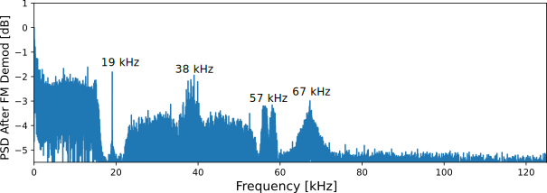
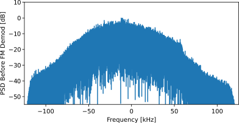
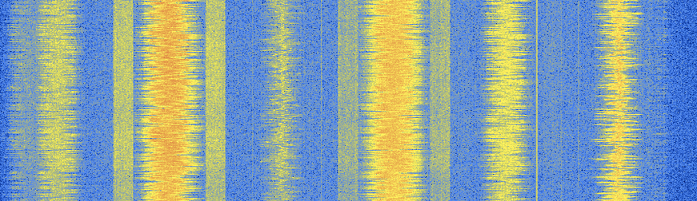
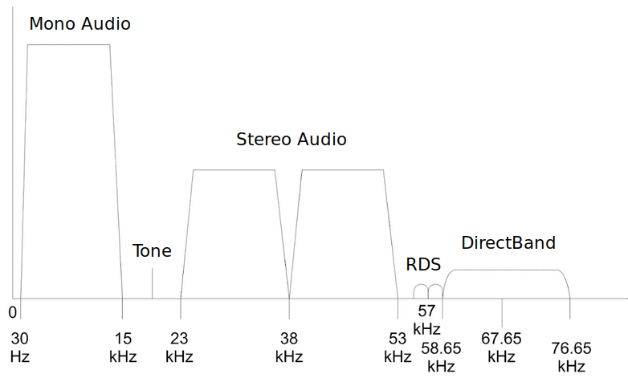
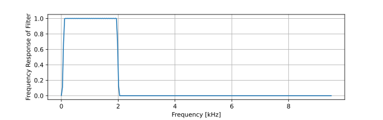
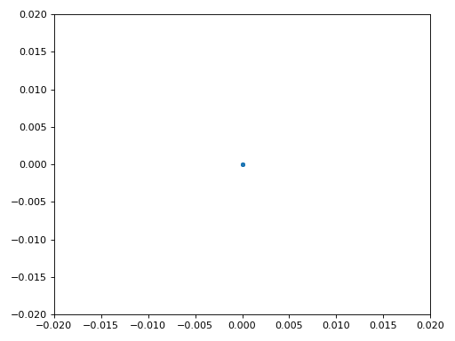
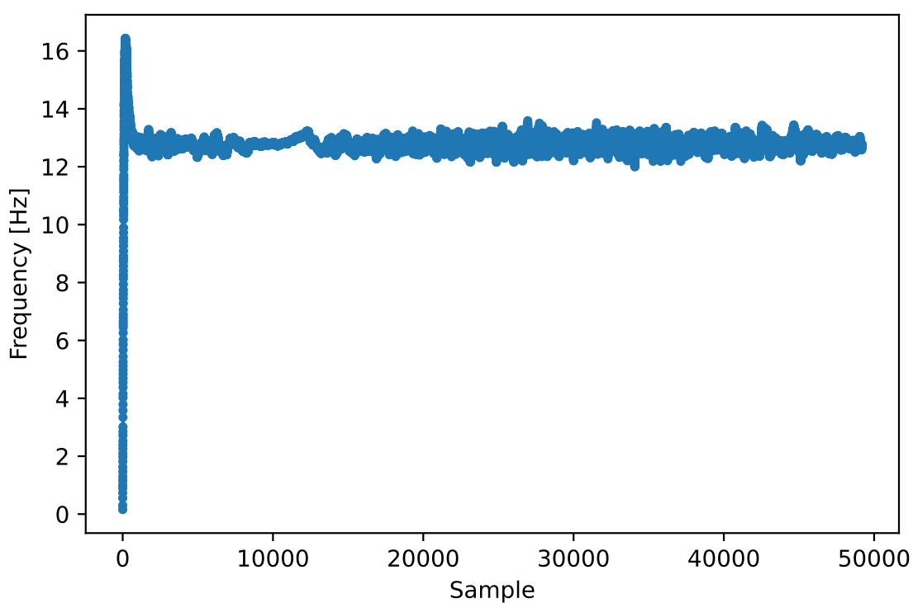

.. _rds-chapter:

##################
Compleet voorbeeld
##################

We zullen in dit hoofdstuk vele geleerde concepten samenbrengen en door een compleet voorbeeld heenlopen waarin we een echt digitaal signaal ontvangen en decoderen. We zullen kijken naar het Radio Data Systeem (RDS) wat een protocol is om kleine hoeveelheden informatie in een FM signaal te stoppen, zoals de naam van het nummer. We zullen FM moeten demoduleren, verschuiven, filteren, decimeren, hersamplen, synchroniseren, decoderen en de bytes interpreteren. Er is sowieso een IQ-bestand beschikbaar waarmee je kunt testen wanneer je geen SDR klaar hebt liggen.

********************************
Introductie FM Radio en RDS
********************************

Om RDS te kunnen begrijpen zullen we eerst kijken een een FM-signaal is opgebouwd.
Je bent waarschijnlijk al bekend met het audio gedeelte van een FM-signaal: een FM-gemoduleerd audiosignaal verstuurt op de frequentie van het station.
Naast de audio worden in een FM-signaal nog meer informatiecomponenten FM-gemoduleerd.
In plaats van 
To understand RDS we must first review FM radio broadcasts and how their signals are structured.  You are probably familiar with the audio portion of FM signals, which are simply audio signals frequency modulated and transmitted at center frequencies corresponding to the station's name, e.g., "WPGC 95.5 FM" is centered at exactly 95.5 MHz.  In addition to the audio portion, each FM broadcast contains some other components that are frequency modulated along with the audio.  Instead of just Googling the signal structure, let's take a look at the power spectral density (PSD) of an example FM signal, *after* the FM demodulation. We only view the positive portion because the output of FM demodulation is a real signal, even though the input was complex (we will view the code to perform this demodulation shortly). 

By looking at the signal in the frequency domain, we notice the following individual signals:

#. A high power signal between 0 - 17 kHz
#. A tone at 19 kHz
#. Centered at 38 kHz and roughly 30 kHz wide we see an interesting looking symmetric signal
#. Double-lobe shaped signal centered at 57 kHz
#. Single-lobe shaped signal centered at 67 kHz

This is essentially all we are able to determine by just looking at the PSD, and remember that this is *after* the FM demodulation.  The PSD before the FM demodulation looks like the following, which doesn't really tell us much.

   
That being said, it's important to understand that when you FM modulate a signal, a higher frequency in the data signal will lead to a higher frequency in the resulting FM signal.  So that signal centered at 67 kHz being present is increasing the total bandwidth occupied by the transmitted FM signal, as the maximum frequency component is now around 75 kHz as shown in the first PSD above.  `Carson's bandwidth rule <https://en.wikipedia.org/wiki/Carson_bandwidth_rule>`_ applied to FM tells us that FM stations occupy roughly 250 kHz of spectrum, which is why we usually sample at 250 kHz (recall that when using quadrature/IQ sampling, your received bandwidth equals your sampling rate).

As a quick aside, some readers may be familiar with looking at the FM band using an SDR or spectrum analyzer and seeing the following spectrogram, and thinking that the block-y signals adjacent to some of the FM stations are RDS.  

It turns out that those block-y signals are actually HD Radio, a digital version of the same FM radio signal (same audio content).  This digital version leads to a higher quality audio signal at the receiver because analog FM will always include some noise after demodulation, since it's an analog scheme, but the digital signal can be demodulated/decoded with zero noise, assuming there are zero bit errors.  

Back to the five signals we discovered in our PSD; the following diagram labels what each signal is used for.  

Going through each of these signals in no particular order:

The mono and stereo audio signals simply carry the audio signal, in a pattern where adding and subtracting them gives you the left and right channels.

The 19 kHz pilot tone is used to demodulate the stereo audio.  If you double the tone it acts as a frequency and phase reference, since the stereo audio signal is centered at 38 kHz.  Doubling the tone can be done by simply squaring the samples, recall the frequency shift Fourier property we learned about in the :ref:`freq-domain-chapter` chapter.

DirectBand was a North America wireless datacast network owned and operated by Microsoft, also called "MSN Direct" within consumer markets. DirectBand transmitted information to devices like portable GPS receivers, wristwatches, and home weather stations.  It even allowed users to receive short messages from Windows Live Messenger.  One of the most successful applications of DirectBand was realtime local traffic data displayed on Garmin GPS receivers, which were used by millions of people before smartphones became ubiquitous.  The DirectBand service was shut down on January 2012, which raises the question, why do we see it in our FM signal that was recorded after 2012?  My only guess is that most FM transmitters were designed and built way before 2012, and even without any DirectBand "feed" active, it still transmits something, perhaps pilot symbols.

Lastly, we come to RDS, which is the focus of the rest of this chapter.  As we can see in our first PSD, RDS is roughly 4 kHz in bandwidth (before it gets FM modulated), and sits in between the stereo audio and DirectBand signal.  It is a low data rate digital communications protocol that allows FM stations to include station identification, program information, time, and other miscellaneous information alongside the audio.  The RDS standard is published as IEC standard 62106 and can be `found here <http://www.interactive-radio-system.com/docs/EN50067_RDS_Standard.pdf>`_.

********************************
The RDS Signal
********************************

In this chapter we will use Python to receive RDS, but in order to best understand how to receive it, we must first learn about how the signal is formed and transmitted.  

Transmit Side
#############

The RDS information to be transmitted by the FM station (e.g., track name, etc.) is encoded into sets of 8 bytes.  Each set of 8 bytes, which corresponds to 64 bits, is combined with 40 "check bits" to make a single "group".  These 104 bits are transmitted together, although there is no gap of time between groups, so from the receiver's perspective it receives these bits nonstop and must determine the boundary between the groups of 104 bits.   We will see more details on the encoding and message structure once we dive into the receive side.

To transmit these bits wirelessly, RDS uses BPSK, which as we learned in the :ref:`modulation-chapter` chapter is a simple digital modulation scheme used to map 1's and 0's to the phase of a carrier.  Like many BPSK-based protocols, RDS uses differential coding, which simply means the 1's and 0's of data are encoded in changes of 1's and 0's instead, which lets you no longer care whether you are 180 degrees out of phase (more on this later).  The BPSK symbols are transmitted at 1187.5 symbols per second, and because BPSK carries one bit per symbol, that means RDS has a raw data rate of roughly 1.2 kbps (including overhead).  RDS does not contain any channel coding (a.k.a. forward error correction), although the data packets do contain a cyclic redundancy check (CRC) to know when an error occurred.   The experienced BPSK-er may be wondering why we saw a double-lobe shaped signal in the first PSD; BPSK usually has one main lobe.  It turns out RDS takes the BPSK signal and duplicates/mirrors it across the 57 kHz center frequency, for robustness through redundancy.  When we dive into the Python code used to receive RDS, one of our steps will involve filtering to isolate just one of these BPSK signals.

The final "double BPSK" signal is then frequency shifted up to 57 kHz and added to all the other components of the FM signal, before being FM modulated and transmitted over the air at the station's frequency.  FM radio signals are transmitted at an extremely high power compared to most other wireless communications, up to 80 kW!  This is why many SDR users have an FM-reject filter (i.e., a band-stop filter) in-line with their antenna; so FM does not add interference to what they are trying to receive.

While this was only a brief overview of the transmit side, we will be diving into more details when we discuss receiving RDS.

Receive Side
############

In order to demodulate and decode RDS, we will perform the following steps, many of which are transmit-side steps in reverse (no need to memorize this list, we will walk through each step individually below):

#. Receive an FM radio signal centered at the station's frequency (or read in an IQ recording), usually at a sample rate of 250 kHz
#. Demodulate the FM using what is called "quadrature demodulation"
#. Frequency shift by 57 kHz so the RDS signal is centered at 0 Hz
#. Low-pass filter, to filter out everything besides RDS
#. Decimate by 10 so that we can work at a lower sample rate, since we filtered out the higher frequencies anyway
#. Resample to 19 kHz which will give us an integer number of samples per symbol
#. Isolate one of the two RDS BPSK signals with a band-pass filter
#. Symbol-level time synchronization, using Mueller and Muller in this example
#. Fine frequency synchronization using a Costas loop
#. Demodulate the BPSK to 1's and 0's
#. Differential decoding, to undo the differential encoding that was applied
#. Decoding of the 1's and 0's into groups of bytes
#. Parsing of the groups of bytes into our final output

While this may seem like a lot of steps, RDS is actually one of the simplest wireless digital communications protocols out there.  A modern wireless protocol like WiFi or 5G requires a whole textbook to cover just the high-level PHY/MAC layer information.

We will now dive into the Python code used to receive RDS.  This code has been tested to work using an `FM radio recording you can find here <https://github.com/777arc/498x/blob/master/fm_rds_250k_1Msamples.iq?raw=true>`_, although you should be able to feed in your own signal as long as its received at a high enough SNR, simply tune to the station's center frequency and sample at a rate of 250 kHz.  To maximize the received signal power (e.g., if you are indoors), it helps to use a half-wave dipole antenna of the correct length (~1.5 meters), not the 2.4 GHz antennas that come with the Pluto.  That being said, FM is a very loud signal, and if you are near a window or outside, the 2.4 GHz antennas will likely be enough to pick up the stronger radio stations.  

In this section we will present small portions of the code individually, with discussion, but the same code is provided at the end of this chapter in one large block.  Each section will present a block of code, and then explain what it is doing.

********************************
Acquiring a Signal
********************************

.. code-block:: python

 import numpy as np
 from scipy.signal import resample_poly, firwin, bilinear, lfilter
 import matplotlib.pyplot as plt
 
 # Read in signal
 x = np.fromfile('/home/marc/Downloads/fm_rds_250k_1Msamples.iq', dtype=np.complex64)
 sample_rate = 250e3
 center_freq = 99.5e6

We read in our test recording, which was sampled at 250 kHz and centered on an FM station received at a high SNR.  Make sure to update the file path to reflect your system and where you saved the recording.  If you have an SDR already set up and working from within Python, feel free to receive a live signal, although it helps to have first tested the entire code with a `known-to-work IQ recording <https://github.com/777arc/498x/blob/master/fm_rds_250k_1Msamples.iq?raw=true>`_.  Throughout this code we will use :code:`x` to store the current signal being manipulated. 

********************************
FM Demodulation
********************************

.. code-block:: python

 # Quadrature Demod
 x = 0.5 * np.angle(x[0:-1] * np.conj(x[1:])) # see https://wiki.gnuradio.org/index.php/Quadrature_Demod

As discussed at the beginning of this chapter, several individual signals are combined in frequency and FM modulated to create what is actually transmitted through the air.  So the first step is to undo that FM modulation.  Another way to think about it is the information is stored in the frequency variation of the signal we receive, and we want to demodulate it so the information is now in the amplitude not frequency.  Note that the output of this demodulation is a real signal, even though we fed in a complex signal.

What this single line of Python is doing, is first calculating the product of our signal with a delayed and conjugated version of our signal.  Next, it finds the phase of each sample in that result, which is the moment at which it goes from complex to real.  To prove to ourselves that this gives us the information contained in the frequency variations, consider a tone at frequency :math:`f` with some arbitrary phase :math:`\phi`, which we can represent as :math:`e^{j2 \pi (f t + \phi)}`.  When dealing in discrete time, which uses an integer :math:`n` instead of :math:`t`, this becomes :math:`e^{j2 \pi (f n + \phi)}`.  The conjugated and delayed version is :math:`e^{-j2 \pi (f (n-1) + \phi)}`.  Multiplying these two together leads to :math:`e^{j2 \pi f}`, which is great because :math:`\phi` is gone, and when we calculate the phase of that expression we are left with just :math:`f`.

One convenient side effect of FM modulation is that amplitude variations of the received signal does not actually change the volume of the audio, unlike AM radio.  

********************************
Frequency Shift
********************************

.. code-block:: python

 # Freq shift
 N = len(x)
 f_o = -57e3 # amount we need to shift by
 t = np.arange(N)/sample_rate # time vector
 x = x * np.exp(2j*np.pi*f_o*t) # down shift

Next we frequency shift down by 57 kHz, using the :math:`e^{j2 \pi f_ot}` trick we learned in the :ref:`sync-chapter` chapter where :code:`f_o` is the frequency shift in Hz and :code:`t` is just a time vector, the fact it starts at 0 isn't important, what matters is that it uses the right sample period (which is inverse of sample rate).  As an aside, because it's a real signal being fed in, it doesn't actually matter if you use a -57 or +57 kHz because the negative frequencies match the positive, so either way we are going to get our RDS shifted to 0 Hz.

********************************
Filter to Isolate RDS
********************************

.. code-block:: python

 # Low-Pass Filter
 taps = firwin(numtaps=101, cutoff=7.5e3, fs=sample_rate)
 x = np.convolve(x, taps, 'valid')

Now we must filter out everything besides RDS. Since we have RDS centered at 0 Hz, that means a low-pass filter is the one we want.  We use :code:`firwin()` to design an FIR filter (i.e., find the taps), which just needs to know how many taps we want the filter to be, and the cutoff frequency.  The sample rate must also be provided or else the cutoff frequency doesn't make sense to firwin.  The result is a symmetric low-pass filter, so we know the taps are going to be real numbers, and we can apply the filter to our signal using a convolution.  We choose :code:`'valid'` to get rid of the edge effects of doing convolution, although in this case it doesn't really matter because we are feeding in such a long signal that a few weird samples on either edge isn't going to throw anything off.

********************************
Decimate by 10
********************************

.. code-block:: python

 # Decimate by 10, now that we filtered and there wont be aliasing
 x = x[::10]
 sample_rate = 25e3

Any time you filter down to a small fraction of your bandwidth (e.g., we started with 125 kHz of *real* bandwidth and saved only 7.5 kHz of that), it makes sense to decimate.  Recall the beginning of the :ref:`sampling-chapter` chapter where we learned about the Nyquist Rate and being able to fully store band-limited information as long as we sampled at twice the highest frequency. Well now that we used our low-pass filter, our highest frequency is about 7.5 kHz, so we only need a sample rate of 15 kHz.  Just to be safe we'll add some margin and use a new sample rate of 25 kHz (this ends up working well mathematically later on).  

We perform the decimation by simply throwing out 9 out of every 10 samples, since we previously were at a sample rate of 250 kHz and we want it to now be at 25 kHz.  This might seem confusing at first, because throwing out 90% of the samples feels like you are throwing out information, but if you review the :ref:`sampling-chapter` chapter you will see why we are not actually losing anything, because we filtered properly (which acted as our anti-aliasing filter) and reduced our maximum frequency and thus signal bandwidth.

From a code perspective this is probably the simplest step out of them all, but make sure to update your :code:`sample_rate` variable to reflect the new sample rate.

********************************
Resample to 19 kHz
********************************

.. code-block:: python

 # Resample to 19kHz
 x = resample_poly(x, 19, 25) # up, down
 sample_rate = 19e3

In the :ref:`pulse-shaping-chapter` chapter we solidified the concept of "samples per symbol", and learned the convenience of having an integer number of samples per symbol (a fractional value is valid, just not convenient).  As mentioned earlier, RDS uses BPSK transmitting 1187.5 symbols per second.  If we continue to use our signal as-is, sampled at 25 kHz, we'll have 21.052631579 samples per symbol (pause and think about the math if that doesn't make sense).  So what we really want is a sample rate that is an integer multiple of 1187.5 Hz, but we can't go too low or we won't be able to "store" our full signal's bandwidth.  In the previous subsection we talked about how we need a sample rate of 15 kHz or higher, and we chose 25 kHz just to give us some margin.

Finding the best sample rate to resample to comes down to how many samples per symbol we want, and we can work backwards.  Hypothetically, let us consider targeting 10 samples per symbol.  The RDS symbol rate of 1187.5 multiplied by 10 would give us a sample rate of 11.875 kHz, which unfortunately is not high enough for Nyquist.  How about 13 samples per symbol?  1187.5 multiplied by 13 gives us 15437.5 Hz, which is above 15 kHz, but quite the uneven number.  How about the next power of 2, so 16 samples per symbol?  1187.5 multiplied by 16 is exactly 19 kHz!  The even number is less of a coincidence and more of a protocol design choice.  

To resample from 25 kHz to 19 kHz, we use :code:`resample_poly()` which upsamples by an integer value, filters, then downsamples by an integer value.  This is convenient because instead of entering in 25000 and 19000 we can use 25 and 19.  If we had used 13 samples per symbol by using a sample rate of 15437.5 Hz, we wouldn't be able to use :code:`resample_poly()` and the resampling process would be much more complicated.

Once again, always remember to update your :code:`sample_rate` variable when performing an operation that changes it.

********************************
Band-Pass Filter
********************************

.. code-block:: python

 # Bandpass filter to isolate one RDS BPSK signal
 taps = firwin(numtaps=501, cutoff=[0.05e3, 2e3], fs=sample_rate, pass_zero=False)
 x = np.convolve(x, taps, 'valid')

Recall that RDS contains two identical BPSK signals, hence the shape we saw in the PSD at the beginning.  We have to choose one, so we will arbitrarily decide to keep the positive one with a band-pass filter.  We use :code:`firwin()` again, but note the :code:`pass_zero=False` which is how you indicate you want it to be a band-pass filter instead of low-pass, and there are two cutoff frequencies to define the band.  The signal is from roughly 0 Hz to 2 kHz but you can't specify a 0 Hz starting frequency so we use 0.05 kHz.  Lastly, we need to increase our number of taps, to get a steeper frequency response.  We can verify that these numbers worked by looking at our filter in the time domain (by plotting taps) and frequency domain (by taking FFT of taps).  Note how in the frequency domain, we reach near-zero response at about 0 Hz.

Side note: At some point I will update the filter above to use a proper matched filter (root-raised cosine I believe is what RDS uses), for conceptual sake, but I got the same error rates using the firwin() approach as GNU Radio's proper matched filter, so it's clearly not a strict requirement.

***********************************
Time Synchronization (Symbol-Level)
***********************************

.. code-block:: python

 # Symbol sync, using what we did in sync chapter
 samples = x # for the sake of matching the sync chapter
 samples_interpolated = resample_poly(samples, 32, 1) # we'll use 32 as the interpolation factor, arbitrarily chosen, seems to work better than 16
 sps = 16
 mu = 0.01 # initial estimate of phase of sample
 out = np.zeros(len(samples) + 10, dtype=np.complex64)
 out_rail = np.zeros(len(samples) + 10, dtype=np.complex64) # stores values, each iteration we need the previous 2 values plus current value
 i_in = 0 # input samples index
 i_out = 2 # output index (let first two outputs be 0)
 while i_out < len(samples) and i_in+32 < len(samples):
     out[i_out] = samples_interpolated[i_in*32 + int(mu*32)] # grab what we think is the "best" sample
     out_rail[i_out] = int(np.real(out[i_out]) > 0) + 1j*int(np.imag(out[i_out]) > 0)
     x = (out_rail[i_out] - out_rail[i_out-2]) * np.conj(out[i_out-1])
     y = (out[i_out] - out[i_out-2]) * np.conj(out_rail[i_out-1])
     mm_val = np.real(y - x)
     mu += sps + 0.01*mm_val
     i_in += int(np.floor(mu)) # round down to nearest int since we are using it as an index
     mu = mu - np.floor(mu) # remove the integer part of mu
     i_out += 1 # increment output index
 x = out[2:i_out] # remove the first two, and anything after i_out (that was never filled out)

We are finally ready for our symbol/time synchronization, here we will use the exact same Mueller and Muller clock synchronization code from the :ref:`sync-chapter` chapter, reference it if you want to learn more about how it works.  We set the sample per symbol (:code:`sps`) to 16 as discussed earlier.  A mu gain value of 0.01 was found via experimentation to work well.  The output should now be one sample per symbol, i.e., our output is our "soft symbols", with possible frequency offset included.  The following constellation plot animation is used to verify we are getting BPSK symbols (with a frequency offset causing rotation):

If you are using your own FM signal and are not getting two distinct clusters of complex samples at this point, it means either the symbol sync above failed to achieve sync, or there is something wrong with one of the previous steps.  You don't need to animate the constellation, but if you plot it, make sure to avoid plotting all the samples, because it will just look like a circle.  If you plot only 100 or 200 samples at a time, you will get a better feel for whether they are in two clusters or not, even if they are spinning.

********************************
Fine Frequency Synchronization
********************************

.. code-block:: python

 # Fine freq sync
 samples = x # for the sake of matching the sync chapter
 N = len(samples)
 phase = 0
 freq = 0
 # These next two params is what to adjust, to make the feedback loop faster or slower (which impacts stability)
 alpha = 8.0 
 beta = 0.002
 out = np.zeros(N, dtype=np.complex64)
 freq_log = []
 for i in range(N):
     out[i] = samples[i] * np.exp(-1j*phase) # adjust the input sample by the inverse of the estimated phase offset
     error = np.real(out[i]) * np.imag(out[i]) # This is the error formula for 2nd order Costas Loop (e.g. for BPSK)
 
     # Advance the loop (recalc phase and freq offset)
     freq += (beta * error)
     freq_log.append(freq * sample_rate / (2*np.pi)) # convert from angular velocity to Hz for logging
     phase += freq + (alpha * error)
 
     # Optional: Adjust phase so its always between 0 and 2pi, recall that phase wraps around every 2pi
     while phase >= 2*np.pi:
         phase -= 2*np.pi
     while phase < 0:
         phase += 2*np.pi
 x = out

We will also copy the fine frequency synchronization Python code from the :ref:`sync-chapter` chapter, which uses a Costas loop to remove any residual frequency offset, as well as align our BPSK to the real (I) axis, by forcing Q to be as close to zero as possible.  Anything left in Q is likely due to the noise in the signal, assuming the Costas loop was tuned properly.  Just for fun let's view the same animation as above except after the frequency synchronization has been performed (no more spinning!):

Additionally, we can look at the estimated frequency error over time to see the Costas loop working, note how we logged it in the code above.  It appears that there was about 13 Hz of frequency offset, either due to the transmitter's oscillator/LO being off or the receiver's LO (most likely the receiver).  If you are using your own FM signal, you may need to tweak :code:`alpha` and :code:`beta` until the curve looks similar, it should achieve synchronization fairly quickly (e.g., a few hundred symbols) and maintain it with minimal oscillation.  The pattern you see below after it finds its steady state is frequency jitter, not oscillation.

********************************
Demodulate the BPSK
********************************

.. code-block:: python

 # Demod BPSK
 bits = (np.real(x) > 0).astype(int) # 1's and 0's

Demodulating the BPSK at this point is very easy, recall that each sample represents one soft symbol, so all we have to do is check whether each sample is above or below 0.  The :code:`.astype(int)` is just so we can work with an array of ints instead of an array of bools.  You may wonder whether above/below zero represents a 1 or 0.  As you will see in the next step, it doesn't matter!

********************************
Differential Decoding
********************************

.. code-block:: python

 # Differential decoding, so that it doesn't matter whether our BPSK was 180 degrees rotated without us realizing it
 bits = (bits[1:] - bits[0:-1]) % 2
 bits = bits.astype(np.uint8) # for decoder

The BPSK signal used differential coding when it was created, which means that each 1 and 0 of the original data was transformed such that a change from 1 to 0 or 0 to 1 got mapped to a 1, and no change got mapped to a 0.  The nice benefit of using differential coding is so you don't have to worry about 180 degree rotations in receiving the BPSK, because whether we consider a 1 to be greater than zero or less than zero is no longer an impact, what matters is changing between 1 and 0.  This concept might be easier to understand by looking at example data, below shows the first 10 symbols before and after the differential decoding:

.. code-block:: python

 [1 1 1 1 0 1 0 0 1 1] # before differential decoding
 [- 0 0 0 1 1 1 0 1 0] # after differential decoding

********************************
RDS Decoding
********************************

We finally have our bits of information, and we are ready to decode what they mean!  The massive block of code provided below is what we will use to decode the 1's and 0's into groups of bytes.  This part would make a lot more sense if we first created the transmitter portion of RDS, but for now just know that in RDS, bytes are grouped into groups of 12 bytes, where the first 8 represent the data and the last 4 act as a sync word (called "offset words").  The last 4 bytes are not needed by the next step (the parser) so we don't include them in the output.  This block of code takes in the 1's and 0's created above (in the form of a 1D array of uint8's) and outputs a list of lists of bytes (a list of 8 bytes where those 8 bytes are in a list).  This makes it convenient for the next step, which will iterate through the list of 8 bytes, one group of 8 at a time.

Most of the actual decoding code below revolves around syncing (at the byte level, not symbol) and error checking.  It works in blocks of 104 bits, each block is either received correctly or in error (using CRC to check), and every 50 blocks it checks whether more than 35 of them were received with error, in which case it resets everything and attempts to sync again.  The CRC is performed using a 10-bit check, with polynomial :math:`x^{10}+x^8+x^7+x^5+x^4+x^3+1`; this occurs when :code:`reg` is xor'ed with 0x5B9 which is the binary equivalent of that polynomial.  In Python, the bitwise operators for [and, or, not, xor] are :code:`& | ~ ^` respectively, exactly the same as C++. A left bit shift is :code:`x << y` (same as multiplying x by 2**y), and a right bit shift is :code:`x >> y` (same as dividing x by 2**y), also like in C++.  

Note, you **do not** need to go through all of this code, or any of it, especially if you are focusing on learning the physical (PHY) layer side of DSP and SDR, as this does *not* represent signal processing.  This code is simply an implementation of a RDS decoder, and essentially none of it can be reused for other protocols, because it's so specific to the way RDS works.  If you are already somewhat exhausted by this chapter, feel free to just skip this enormous block of code that has one fairly simple job but does it in a complex manner.

.. code-block:: python

 # Constants
 syndrome = [383, 14, 303, 663, 748]
 offset_pos = [0, 1, 2, 3, 2]
 offset_word = [252, 408, 360, 436, 848]
 
 # see Annex B, page 64 of the standard
 def calc_syndrome(x, mlen):
     reg = 0
     plen = 10
     for ii in range(mlen, 0, -1):
         reg = (reg << 1) | ((x >> (ii-1)) & 0x01)
         if (reg & (1 << plen)):
             reg = reg ^ 0x5B9
     for ii in range(plen, 0, -1):
         reg = reg << 1
         if (reg & (1 << plen)):
             reg = reg ^ 0x5B9
     return reg & ((1 << plen) - 1) # select the bottom plen bits of reg
 
 # Initialize all the working vars we'll need during the loop
 synced = False
 presync = False
 
 wrong_blocks_counter = 0
 blocks_counter = 0
 group_good_blocks_counter = 0
 
 reg = np.uint32(0) # was unsigned long in C++ (64 bits) but numpy doesn't support bitwise ops of uint64, I don't think it gets that high anyway
 lastseen_offset_counter = 0
 lastseen_offset = 0
 
 # the synchronization process is described in Annex C, page 66 of the standard */
 bytes_out = []
 for i in range(len(bits)):
     # in C++ reg doesn't get init so it will be random at first, for ours its 0s
     # It was also an unsigned long but never seemed to get anywhere near the max value
     # bits are either 0 or 1
     reg = np.bitwise_or(np.left_shift(reg, 1), bits[i]) # reg contains the last 26 rds bits. these are both bitwise ops
     if not synced:
         reg_syndrome = calc_syndrome(reg, 26)
         for j in range(5):
             if reg_syndrome == syndrome[j]:
                 if not presync:
                     lastseen_offset = j
                     lastseen_offset_counter = i
                     presync = True
                 else:
                     if offset_pos[lastseen_offset] >= offset_pos[j]:
                         block_distance = offset_pos[j] + 4 - offset_pos[lastseen_offset]
                     else:
                         block_distance = offset_pos[j] - offset_pos[lastseen_offset]
                     if (block_distance*26) != (i - lastseen_offset_counter):
                         presync = False
                     else:
                         print('Sync State Detected')
                         wrong_blocks_counter = 0
                         blocks_counter = 0
                         block_bit_counter = 0
                         block_number = (j + 1) % 4
                         group_assembly_started = False
                         synced = True
             break # syndrome found, no more cycles
 
     else: # SYNCED
         # wait until 26 bits enter the buffer */
         if block_bit_counter < 25:
             block_bit_counter += 1
         else:
             good_block = False
             dataword = (reg >> 10) & 0xffff
             block_calculated_crc = calc_syndrome(dataword, 16)
             checkword = reg & 0x3ff
             if block_number == 2: # manage special case of C or C' offset word
                 block_received_crc = checkword ^ offset_word[block_number]
                 if (block_received_crc == block_calculated_crc):
                     good_block = True
                 else:
                     block_received_crc = checkword ^ offset_word[4]
                     if (block_received_crc == block_calculated_crc):
                         good_block = True
                     else:
                         wrong_blocks_counter += 1
                         good_block = False
             else:
                 block_received_crc = checkword ^ offset_word[block_number] # bitwise xor
                 if block_received_crc == block_calculated_crc:
                     good_block = True
                 else:
                     wrong_blocks_counter += 1
                     good_block = False
                 
             # Done checking CRC
             if block_number == 0 and good_block:
                 group_assembly_started = True
                 group_good_blocks_counter = 1
                 bytes = bytearray(8) # 8 bytes filled with 0s
             if group_assembly_started:
                 if not good_block:
                     group_assembly_started = False
                 else:
                     # raw data bytes, as received from RDS. 8 info bytes, followed by 4 RDS offset chars: ABCD/ABcD/EEEE (in US) which we leave out here
                     # RDS information words
                     # block_number is either 0,1,2,3 so this is how we fill out the 8 bytes
                     bytes[block_number*2] = (dataword >> 8) & 255
                     bytes[block_number*2+1] = dataword & 255
                     group_good_blocks_counter += 1
                     #print('group_good_blocks_counter:', group_good_blocks_counter)
                 if group_good_blocks_counter == 5:
                     #print(bytes)
                     bytes_out.append(bytes) # list of len-8 lists of bytes
             block_bit_counter = 0
             block_number = (block_number + 1) % 4
             blocks_counter += 1
             if blocks_counter == 50:
                 if wrong_blocks_counter > 35: # This many wrong blocks must mean we lost sync
                     print("Lost Sync (Got ", wrong_blocks_counter, " bad blocks on ", blocks_counter, " total)")
                     synced = False
                     presync = False
                 else:
                     print("Still Sync-ed (Got ", wrong_blocks_counter, " bad blocks on ", blocks_counter, " total)")
                 blocks_counter = 0
                 wrong_blocks_counter = 0

Below shows an example output from this decoding step, note how in this example it synced fairly quickly but then loses sync a couple times for some reason, although it's still able to parse all of the data as we'll see.  If you are using the downloadable 1M samples file, you will only see the first few lines below.  The actual contents of these bytes just look like random numbers/characters depending on how you display them, but in the next step we will parse them into human readable information!

.. code-block:: console

 Sync State Detected
 Still Sync-ed (Got  0  bad blocks on  50  total)
 Still Sync-ed (Got  0  bad blocks on  50  total)
 Still Sync-ed (Got  0  bad blocks on  50  total)
 Still Sync-ed (Got  0  bad blocks on  50  total)
 Still Sync-ed (Got  1  bad blocks on  50  total)
 Still Sync-ed (Got  5  bad blocks on  50  total)
 Still Sync-ed (Got  26  bad blocks on  50  total)
 Lost Sync (Got  50  bad blocks on  50  total)
 Sync State Detected
 Still Sync-ed (Got  3  bad blocks on  50  total)
 Still Sync-ed (Got  0  bad blocks on  50  total)
 Still Sync-ed (Got  0  bad blocks on  50  total)
 Still Sync-ed (Got  0  bad blocks on  50  total)
 Still Sync-ed (Got  0  bad blocks on  50  total)
 Still Sync-ed (Got  0  bad blocks on  50  total)
 Still Sync-ed (Got  0  bad blocks on  50  total)
 Still Sync-ed (Got  0  bad blocks on  50  total)
 Still Sync-ed (Got  0  bad blocks on  50  total)
 Still Sync-ed (Got  0  bad blocks on  50  total)
 Still Sync-ed (Got  0  bad blocks on  50  total)
 Still Sync-ed (Got  0  bad blocks on  50  total)
 Still Sync-ed (Got  0  bad blocks on  50  total)
 Still Sync-ed (Got  0  bad blocks on  50  total)
 Still Sync-ed (Got  0  bad blocks on  50  total)
 Still Sync-ed (Got  0  bad blocks on  50  total)
 Still Sync-ed (Got  0  bad blocks on  50  total)
 Still Sync-ed (Got  0  bad blocks on  50  total)
 Still Sync-ed (Got  0  bad blocks on  50  total)
 Still Sync-ed (Got  0  bad blocks on  50  total)
 Still Sync-ed (Got  0  bad blocks on  50  total)
 Still Sync-ed (Got  0  bad blocks on  50  total)
 Still Sync-ed (Got  2  bad blocks on  50  total)
 Still Sync-ed (Got  1  bad blocks on  50  total)
 Still Sync-ed (Got  20  bad blocks on  50  total)
 Lost Sync (Got  47  bad blocks on  50  total)
 Sync State Detected
 Still Sync-ed (Got  32  bad blocks on  50  total)
 
********************************
RDS Parsing
********************************

Now that we have bytes, in groups of 8, we can extract the final data, i.e., the final output that is human understandable.  This is known as parsing the bytes, and just like the decoder in the previous section, it is simply an implementation of the RDS protocol, and is really not that important to understand.  Luckily it's not a ton of code, if you don't include the two tables defined at the start, which are simply the lookup tables for the type of FM channel and the coverage area.

For those who want to learn how this code works, I'll provide some added information.  The protocol uses this concept of an A/B flag, which means some messages are marked A and others B, and the parsing changes based on which one (whether it's A or B is stored in the third bit of the second byte).  It also uses different "group" types which are analogous to message type, and in this code we are only parsing message type 2, which is the message type that has the radio text in it, which is the interesting part, it's the text that scrolls across the screen in your car.  We will still be able to parse the channel type and region, as they are stored in every message.  Lastly, note that :code:`radiotext` is a string that gets initialized to all spaces, gets filled out slowly as bytes are parsed, and then resets to all spaces if a specific set of bytes is received.  If you are curious what other message types exist, the list is: ["BASIC", "PIN/SL", "RT", "AID", "CT", "TDC", "IH", "RP", "TMC", "EWS", "EON"]. The message "RT" is radiotext which is the only one we decode.  The RDS GNU Radio block decodes "BASIC" as well, but for the stations I used for testing it didn't contain much interesting information, and would have added a lot of lines to the code below.

.. code-block:: python

 # Annex F of RBDS Standard Table F.1 (North America) and Table F.2 (Europe)
 #              Europe                   North America
 pty_table = [["Undefined",             "Undefined"],
              ["News",                  "News"],
              ["Current Affairs",       "Information"],
              ["Information",           "Sports"],
              ["Sport",                 "Talk"],
              ["Education",             "Rock"],
              ["Drama",                 "Classic Rock"],
              ["Culture",               "Adult Hits"],
              ["Science",               "Soft Rock"],
              ["Varied",                "Top 40"],
              ["Pop Music",             "Country"],
              ["Rock Music",            "Oldies"],
              ["Easy Listening",        "Soft"],
              ["Light Classical",       "Nostalgia"],
              ["Serious Classical",     "Jazz"],
              ["Other Music",           "Classical"],
              ["Weather",               "Rhythm & Blues"],
              ["Finance",               "Soft Rhythm & Blues"],
              ["Children’s Programmes", "Language"],
              ["Social Affairs",        "Religious Music"],
              ["Religion",              "Religious Talk"],
              ["Phone-In",              "Personality"],
              ["Travel",                "Public"],
              ["Leisure",               "College"],
              ["Jazz Music",            "Spanish Talk"],
              ["Country Music",         "Spanish Music"],
              ["National Music",        "Hip Hop"],
              ["Oldies Music",          "Unassigned"],
              ["Folk Music",            "Unassigned"],
              ["Documentary",           "Weather"],
              ["Alarm Test",            "Emergency Test"],
              ["Alarm",                 "Emergency"]]
 pty_locale = 1 # set to 0 for Europe which will use first column instead
 
 # page 72, Annex D, table D.2 in the standard
 coverage_area_codes = ["Local",
                        "International",
                        "National",
                        "Supra-regional",
                        "Regional 1",
                        "Regional 2",
                        "Regional 3",
                        "Regional 4",
                        "Regional 5",
                        "Regional 6",
                        "Regional 7",
                        "Regional 8",
                        "Regional 9",
                        "Regional 10",
                        "Regional 11",
                        "Regional 12"]
 
 radiotext_AB_flag = 0
 radiotext = [' ']*65
 first_time = True
 for bytes in bytes_out:
     group_0 = bytes[1] | (bytes[0] << 8)
     group_1 = bytes[3] | (bytes[2] << 8)
     group_2 = bytes[5] | (bytes[4] << 8)
     group_3 = bytes[7] | (bytes[6] << 8)
      
     group_type = (group_1 >> 12) & 0xf # here is what each one means, e.g. RT is radiotext which is the only one we decode here: ["BASIC", "PIN/SL", "RT", "AID", "CT", "TDC", "IH", "RP", "TMC", "EWS", "___", "___", "___", "___", "EON", "___"]
     AB = (group_1 >> 11 ) & 0x1 # b if 1, a if 0
 
     #print("group_type:", group_type) # this is essentially message type, i only see type 0 and 2 in my recording
     #print("AB:", AB)
 
     program_identification = group_0     # "PI"
     
     program_type = (group_1 >> 5) & 0x1f # "PTY"
     pty = pty_table[program_type][pty_locale]
     
     pi_area_coverage = (program_identification >> 8) & 0xf
     coverage_area = coverage_area_codes[pi_area_coverage]
     
     pi_program_reference_number = program_identification & 0xff # just an int
     
     if first_time:
         print("PTY:", pty)
         print("program:", pi_program_reference_number)
         print("coverage_area:", coverage_area)
         first_time = False
 
     if group_type == 2:
         # when the A/B flag is toggled, flush your current radiotext
         if radiotext_AB_flag != ((group_1 >> 4) & 0x01):
             radiotext = [' ']*65
         radiotext_AB_flag = (group_1 >> 4) & 0x01
         text_segment_address_code = group_1 & 0x0f
         if AB:
             radiotext[text_segment_address_code * 2    ] = chr((group_3 >> 8) & 0xff)
             radiotext[text_segment_address_code * 2 + 1] = chr(group_3        & 0xff)
         else:
             radiotext[text_segment_address_code *4     ] = chr((group_2 >> 8) & 0xff)
             radiotext[text_segment_address_code * 4 + 1] = chr(group_2        & 0xff)
             radiotext[text_segment_address_code * 4 + 2] = chr((group_3 >> 8) & 0xff)
             radiotext[text_segment_address_code * 4 + 3] = chr(group_3        & 0xff)
         print(''.join(radiotext))
     else:
         pass
         #print("unsupported group_type:", group_type)

Below shows the output of the parsing step for an example FM station.  Note how it has to build the radiotext string over multiple messages, and then it periodically clears out the string and starts again.  If you are using the 1M sample downloaded file, you will only see the first few lines below.

.. code-block:: console

 PTY: Top 40
 program: 29
 coverage_area: Regional 4
             ing.                                                 
             ing. Upb                                             
             ing. Upbeat.                                         
             ing. Upbeat. Rea                                     
                         
 WAY-                                                             
 WAY-FM U                                                         
 WAY-FM Uplif                                                     
 WAY-FM Uplifting                                                 
 WAY-FM Uplifting. Up                                             
 WAY-FM Uplifting. Upbeat                                         
 WAY-FM Uplifting. Upbeat. Re                                     
                                                                                      
 WayF                                                             
 WayFM Up                                                         
 WayFM Uplift                                                     
 WayFM Uplifting.                                                 
 WayFM Uplifting. Upb                                             
 WayFM Uplifting. Upbeat.                                         
 WayFM Uplifting. Upbeat. Rea                                     

********************************
Wrap-Up and Final Code
********************************

You did it!  Below is all of the code above, concatenated, it should work with the `test FM radio recording you can find here <https://github.com/777arc/498x/blob/master/fm_rds_250k_1Msamples.iq?raw=true>`_, although you should be able to feed in your own signal as long as its received at a high enough SNR, simply tune to the station's center frequency and sample at a rate of 250 kHz.  If you find you had to make tweaks to get it to work with your own recording or live SDR, let me know what you had to do, you can submit it as a GitHub PR at `the textbook's GitHub page <https://github.com/777arc/textbook>`_.  You can also find a version of this code with dozens of debug plotting/printing included, that I originally used to make this chapter, `here <https://github.com/777arc/textbook/blob/master/figure-generating-scripts/rds_demo.py>`_.  

.. raw:: html

   

   
Final Code

   
.. code-block:: python

 import numpy as np
 from scipy.signal import resample_poly, firwin, bilinear, lfilter
 import matplotlib.pyplot as plt

 # Read in signal
 x = np.fromfile('/home/marc/Downloads/fm_rds_250k_from_sdrplay.iq', dtype=np.complex64)
 sample_rate = 250e3
 center_freq = 99.5e6

 # Quadrature Demod
 x = 0.5 * np.angle(x[0:-1] * np.conj(x[1:])) # see https://wiki.gnuradio.org/index.php/Quadrature_Demod

 # Freq shift
 N = len(x)
 f_o = -57e3 # amount we need to shift by
 t = np.arange(N)/sample_rate # time vector
 x = x * np.exp(2j*np.pi*f_o*t) # down shift

 # Low-Pass Filter
 taps = firwin(numtaps=101, cutoff=7.5e3, fs=sample_rate)
 x = np.convolve(x, taps, 'valid')

 # Decimate by 10, now that we filtered and there wont be aliasing
 x = x[::10]
 sample_rate = 25e3

 # Resample to 19kHz
 x = resample_poly(x, 19, 25) # up, down
 sample_rate = 19e3

 # Bandpass filter (TODO: make it a proper matched filter with RRC, even though it's not required to function)
 taps = firwin(numtaps=501, cutoff=[0.05e3, 2e3], fs=sample_rate, pass_zero=False)
 x = np.convolve(x, taps, 'valid')

 # Symbol sync, using what we did in sync chapter
 samples = x # for the sake of matching the sync chapter
 samples_interpolated = resample_poly(samples, 32, 1) # we'll use 32 as the interpolation factor, arbitrarily chosen
 sps = 16
 mu = 0.01 # initial estimate of phase of sample
 out = np.zeros(len(samples) + 10, dtype=np.complex64)
 out_rail = np.zeros(len(samples) + 10, dtype=np.complex64) # stores values, each iteration we need the previous 2 values plus current value
 i_in = 0 # input samples index
 i_out = 2 # output index (let first two outputs be 0)
 while i_out < len(samples) and i_in+32 < len(samples):
     out[i_out] = samples_interpolated[i_in*32 + int(mu*32)] # grab what we think is the "best" sample
     out_rail[i_out] = int(np.real(out[i_out]) > 0) + 1j*int(np.imag(out[i_out]) > 0)
     x = (out_rail[i_out] - out_rail[i_out-2]) * np.conj(out[i_out-1])
     y = (out[i_out] - out[i_out-2]) * np.conj(out_rail[i_out-1])
     mm_val = np.real(y - x)
     mu += sps + 0.01*mm_val
     i_in += int(np.floor(mu)) # round down to nearest int since we are using it as an index
     mu = mu - np.floor(mu) # remove the integer part of mu
     i_out += 1 # increment output index
 x = out[2:i_out] # remove the first two, and anything after i_out (that was never filled out)

 # Fine freq sync
 samples = x # for the sake of matching the sync chapter
 N = len(samples)
 phase = 0
 freq = 0
 # These next two params is what to adjust, to make the feedback loop faster or slower (which impacts stability)
 alpha = 8.0 
 beta = 0.002
 out = np.zeros(N, dtype=np.complex64)
 freq_log = []
 for i in range(N):
     out[i] = samples[i] * np.exp(-1j*phase) # adjust the input sample by the inverse of the estimated phase offset
     error = np.real(out[i]) * np.imag(out[i]) # This is the error formula for 2nd order Costas Loop (e.g. for BPSK)
 
     # Advance the loop (recalc phase and freq offset)
     freq += (beta * error)
     freq_log.append(freq * sample_rate / (2*np.pi)) # convert from angular velocity to Hz for logging
     phase += freq + (alpha * error)
 
     # Optional: Adjust phase so its always between 0 and 2pi, recall that phase wraps around every 2pi
     while phase >= 2*np.pi:
         phase -= 2*np.pi
     while phase < 0:
         phase += 2*np.pi
 x = out

 # Demod BPSK
 bits = (np.real(x) > 0).astype(int) # 1's and 0's

 # Differential decoding, so that it doesn't matter whether our BPSK was 180 degrees rotated without us realizing it
 bits = (bits[1:] - bits[0:-1]) % 2
 bits = bits.astype(np.uint8) # for decoder

 ###########
 # DECODER #
 ###########
 
 # Constants
 syndrome = [383, 14, 303, 663, 748]
 offset_pos = [0, 1, 2, 3, 2]
 offset_word = [252, 408, 360, 436, 848]
 
 # see Annex B, page 64 of the standard
 def calc_syndrome(x, mlen):
     reg = 0
     plen = 10
     for ii in range(mlen, 0, -1):
         reg = (reg << 1) | ((x >> (ii-1)) & 0x01)
         if (reg & (1 << plen)):
             reg = reg ^ 0x5B9
     for ii in range(plen, 0, -1):
         reg = reg << 1
         if (reg & (1 << plen)):
             reg = reg ^ 0x5B9
     return reg & ((1 << plen) - 1) # select the bottom plen bits of reg
 
 # Initialize all the working vars we'll need during the loop
 synced = False
 presync = False
 
 wrong_blocks_counter = 0
 blocks_counter = 0
 group_good_blocks_counter = 0
 
 reg = np.uint32(0) # was unsigned long in C++ (64 bits) but numpy doesn't support bitwise ops of uint64, I don't think it gets that high anyway
 lastseen_offset_counter = 0
 lastseen_offset = 0
 
 # the synchronization process is described in Annex C, page 66 of the standard */
 bytes_out = []
 for i in range(len(bits)):
     # in C++ reg doesn't get init so it will be random at first, for ours its 0s
     # It was also an unsigned long but never seemed to get anywhere near the max value
     # bits are either 0 or 1
     reg = np.bitwise_or(np.left_shift(reg, 1), bits[i]) # reg contains the last 26 rds bits. these are both bitwise ops
     if not synced:
         reg_syndrome = calc_syndrome(reg, 26)
         for j in range(5):
             if reg_syndrome == syndrome[j]:
                 if not presync:
                     lastseen_offset = j
                     lastseen_offset_counter = i
                     presync = True
                 else:
                     if offset_pos[lastseen_offset] >= offset_pos[j]:
                         block_distance = offset_pos[j] + 4 - offset_pos[lastseen_offset]
                     else:
                         block_distance = offset_pos[j] - offset_pos[lastseen_offset]
                     if (block_distance*26) != (i - lastseen_offset_counter):
                         presync = False
                     else:
                         print('Sync State Detected')
                         wrong_blocks_counter = 0
                         blocks_counter = 0
                         block_bit_counter = 0
                         block_number = (j + 1) % 4
                         group_assembly_started = False
                         synced = True
             break # syndrome found, no more cycles
 
     else: # SYNCED
         # wait until 26 bits enter the buffer */
         if block_bit_counter < 25:
             block_bit_counter += 1
         else:
             good_block = False
             dataword = (reg >> 10) & 0xffff
             block_calculated_crc = calc_syndrome(dataword, 16)
             checkword = reg & 0x3ff
             if block_number == 2: # manage special case of C or C' offset word
                 block_received_crc = checkword ^ offset_word[block_number]
                 if (block_received_crc == block_calculated_crc):
                     good_block = True
                 else:
                     block_received_crc = checkword ^ offset_word[4]
                     if (block_received_crc == block_calculated_crc):
                         good_block = True
                     else:
                         wrong_blocks_counter += 1
                         good_block = False
             else:
                 block_received_crc = checkword ^ offset_word[block_number] # bitwise xor
                 if block_received_crc == block_calculated_crc:
                     good_block = True
                 else:
                     wrong_blocks_counter += 1
                     good_block = False
                 
             # Done checking CRC
             if block_number == 0 and good_block:
                 group_assembly_started = True
                 group_good_blocks_counter = 1
                 bytes = bytearray(8) # 8 bytes filled with 0s
             if group_assembly_started:
                 if not good_block:
                     group_assembly_started = False
                 else:
                     # raw data bytes, as received from RDS. 8 info bytes, followed by 4 RDS offset chars: ABCD/ABcD/EEEE (in US) which we leave out here
                     # RDS information words
                     # block_number is either 0,1,2,3 so this is how we fill out the 8 bytes
                     bytes[block_number*2] = (dataword >> 8) & 255
                     bytes[block_number*2+1] = dataword & 255
                     group_good_blocks_counter += 1
                     #print('group_good_blocks_counter:', group_good_blocks_counter)
                 if group_good_blocks_counter == 5:
                     #print(bytes)
                     bytes_out.append(bytes) # list of len-8 lists of bytes
             block_bit_counter = 0
             block_number = (block_number + 1) % 4
             blocks_counter += 1
             if blocks_counter == 50:
                 if wrong_blocks_counter > 35: # This many wrong blocks must mean we lost sync
                     print("Lost Sync (Got ", wrong_blocks_counter, " bad blocks on ", blocks_counter, " total)")
                     synced = False
                     presync = False
                 else:
                     print("Still Sync-ed (Got ", wrong_blocks_counter, " bad blocks on ", blocks_counter, " total)")
                 blocks_counter = 0
                 wrong_blocks_counter = 0

 ###########
 # PARSER  #
 ###########

 # Annex F of RBDS Standard Table F.1 (North America) and Table F.2 (Europe)
 #              Europe                   North America
 pty_table = [["Undefined",             "Undefined"],
              ["News",                  "News"],
              ["Current Affairs",       "Information"],
              ["Information",           "Sports"],
              ["Sport",                 "Talk"],
              ["Education",             "Rock"],
              ["Drama",                 "Classic Rock"],
              ["Culture",               "Adult Hits"],
              ["Science",               "Soft Rock"],
              ["Varied",                "Top 40"],
              ["Pop Music",             "Country"],
              ["Rock Music",            "Oldies"],
              ["Easy Listening",        "Soft"],
              ["Light Classical",       "Nostalgia"],
              ["Serious Classical",     "Jazz"],
              ["Other Music",           "Classical"],
              ["Weather",               "Rhythm & Blues"],
              ["Finance",               "Soft Rhythm & Blues"],
              ["Children’s Programmes", "Language"],
              ["Social Affairs",        "Religious Music"],
              ["Religion",              "Religious Talk"],
              ["Phone-In",              "Personality"],
              ["Travel",                "Public"],
              ["Leisure",               "College"],
              ["Jazz Music",            "Spanish Talk"],
              ["Country Music",         "Spanish Music"],
              ["National Music",        "Hip Hop"],
              ["Oldies Music",          "Unassigned"],
              ["Folk Music",            "Unassigned"],
              ["Documentary",           "Weather"],
              ["Alarm Test",            "Emergency Test"],
              ["Alarm",                 "Emergency"]]
 pty_locale = 1 # set to 0 for Europe which will use first column instead
 
 # page 72, Annex D, table D.2 in the standard
 coverage_area_codes = ["Local",
                        "International",
                        "National",
                        "Supra-regional",
                        "Regional 1",
                        "Regional 2",
                        "Regional 3",
                        "Regional 4",
                        "Regional 5",
                        "Regional 6",
                        "Regional 7",
                        "Regional 8",
                        "Regional 9",
                        "Regional 10",
                        "Regional 11",
                        "Regional 12"]
 
 radiotext_AB_flag = 0
 radiotext = [' ']*65
 first_time = True
 for bytes in bytes_out:
     group_0 = bytes[1] | (bytes[0] << 8)
     group_1 = bytes[3] | (bytes[2] << 8)
     group_2 = bytes[5] | (bytes[4] << 8)
     group_3 = bytes[7] | (bytes[6] << 8)
      
     group_type = (group_1 >> 12) & 0xf # here is what each one means, e.g. RT is radiotext which is the only one we decode here: ["BASIC", "PIN/SL", "RT", "AID", "CT", "TDC", "IH", "RP", "TMC", "EWS", "___", "___", "___", "___", "EON", "___"]
     AB = (group_1 >> 11 ) & 0x1 # b if 1, a if 0
 
     #print("group_type:", group_type) # this is essentially message type, i only see type 0 and 2 in my recording
     #print("AB:", AB)
 
     program_identification = group_0     # "PI"
     
     program_type = (group_1 >> 5) & 0x1f # "PTY"
     pty = pty_table[program_type][pty_locale]
     
     pi_area_coverage = (program_identification >> 8) & 0xf
     coverage_area = coverage_area_codes[pi_area_coverage]
     
     pi_program_reference_number = program_identification & 0xff # just an int
     
     if first_time:
         print("PTY:", pty)
         print("program:", pi_program_reference_number)
         print("coverage_area:", coverage_area)
         first_time = False
 
     if group_type == 2:
         # when the A/B flag is toggled, flush your current radiotext
         if radiotext_AB_flag != ((group_1 >> 4) & 0x01):
             radiotext = [' ']*65
         radiotext_AB_flag = (group_1 >> 4) & 0x01
         text_segment_address_code = group_1 & 0x0f
         if AB:
             radiotext[text_segment_address_code * 2    ] = chr((group_3 >> 8) & 0xff)
             radiotext[text_segment_address_code * 2 + 1] = chr(group_3        & 0xff)
         else:
             radiotext[text_segment_address_code *4     ] = chr((group_2 >> 8) & 0xff)
             radiotext[text_segment_address_code * 4 + 1] = chr(group_2        & 0xff)
             radiotext[text_segment_address_code * 4 + 2] = chr((group_3 >> 8) & 0xff)
             radiotext[text_segment_address_code * 4 + 3] = chr(group_3        & 0xff)
         print(''.join(radiotext))
     else:
         pass
         #print("unsupported group_type:", group_type)

.. raw:: html

   

Once again, the example FM recording known to work with this code `can be found here <https://github.com/777arc/498x/blob/master/fm_rds_250k_1Msamples.iq?raw=true>`_.

For those interested in demodulating the actual audio signal, just add the following lines right after the "Acquiring a Signal" section (special thanks to `Joel Cordeiro <http://github.com/joeugenio>`_ for the code):

.. code-block:: python

 # Add the following code right after the "Acquiring a Signal" section
 
 from scipy.io import wavfile
 
 # Demodulation
 x = np.diff(np.unwrap(np.angle(x)))
 
 # De-emphasis filter, H(s) = 1/(RC*s + 1), implemented as IIR via bilinear transform
 bz, az = bilinear(1, [75e-6, 1], fs=sample_rate)
 x = lfilter(bz, az, x)
 
 # decimate filter to get mono audio
 x = x[::6]
 sample_rate = sample_rate/6
 
 # normalizes volume
 x /= x.std() 
 
 # Save to wav file, you can open this in Audacity for example
 wavfile.write('fm.wav', int(sample_rate), x)

The most complicated part is the de-emphasis filter, `which you can learn about here <https://wiki.gnuradio.org/index.php/FM_Preemphasis>`_, although it's actually an optional step if you are OK with audio that has a poor bass/treble balance.  For those curious, here is what the frequency response of the `IIR <https://en.wikipedia.org/wiki/Infinite_impulse_response>`_ de-emphasis filter looks like, it doesn't fully filter out any frequencies, it's more of a "shaping" filter.

.. image:: ../_images/fm_demph_filter_freq_response.svg
   :align: center 
   :target: ../_images/fm_demph_filter_freq_response.svg
   
********************************
Acknowledgments
********************************

Most of the steps above used to receive RDS were adapted from the GNU Radio implementation of RDS, which lives in the GNU Radio Out-of-Tree Module called `gr-rds <https://github.com/bastibl/gr-rds>`_, originally created by Dimitrios Symeonidis and maintained by Bastian Bloessl, and I would like to acknowledge the work of these authors.  In order to create this chapter, I started with using gr-rds in GNU Radio, with a working FM recording, and slowly converted each of the blocks (including many built-in blocks) to Python.  It took quite a bit of time, there are some nuances to the built-in blocks that are easy to miss, and going from stream-style signal processing (i.e., using a work function that processes a few thousand samples at a time in a stateful manner) to a block of Python is not always straightforward.  GNU Radio is an amazing tool for this kind of prototyping and I would never have been able to create all of this working Python code without it.

********************************
Further Reading
********************************

#. https://en.wikipedia.org/wiki/Radio_Data_System
#. `https://www.sigidwiki.com/wiki/Radio_Data_System_(RDS) <https://www.sigidwiki.com/wiki/Radio_Data_System_(RDS)>`_
#. https://github.com/bastibl/gr-rds
#. https://www.gnuradio.org/
