.. _sampling-chapter:

##################
IQ-sampling
##################

We introduceren in dit hoofdstuk een concept genaamd IQ-sampling, of complex samplen of kwadratuur samplen. We zullen ook Nyquist, complexe nummers, RF-draaggolven, frequentieverschuiving en power spectral density behandelen. IQ-sampling is een vorm van samplen dat wordt uitgevoerd door een SDR en vele andere digitale ontvangers (en zenders). Het is een iets complexere versie van gewoon samplen (pun intended) dus we zullen er langzaam doorheen lopen, en met wat oefening zal het concept vast duidelijk worden.

*************************
Basis van samplen
*************************

Voordat we naar IQ-sampling springen, gaan we eerst discussiëren wat samplen eigenlijk inhoudt. Je bent waarschijnlijk al tegen samplen aangelopen zonder dat je het door had, door audio op te nemen met een microfoon. De microfoon is de omvormer dat geluidsgolven omzet naar een elektrisch signaal (een spanningsniveau). Het elektrische signaal wordt omgezet door een Analoog-naar-Digitaal omzetter (ADC) en produceert een digitale versie van de geluidsgolf. Om het nog simpeler te maken, de microfoon vangt de geluidsgolven op en zet deze om naar elektriciteit, de elektriciteit wordt vervolgens omgezet in getallen. De ADC gedraagt zich als een brug tussen de analoge en digitale domeinen. SDR's werken bijna hetzelfde. In plaats van een microfoon gebruiken ze een antenne, maar ze gebruiken ook ADC's. In beide gevallen wordt het spanningsniveau gesampled door een ADC. In het geval van een SDR is het radiogolven erin, getallen eruit.

Of we het hebben over geluids- of radiogolven, we moeten samplen als we een signaal digitaal willen opvangen, bewerken of opslaan. Dit samplen lijkt recht-door-zee maar er zit veel achter. Een meer technische manier om hierover na te denken is het pakken van waarden op vaste momenten in de tijd en die digitaal opslaan. Stel we hebben een willekeurige functie, :math:`S(t)`, kan alles voorstellen, en het is een continue functie dat we willen samplen:

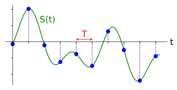

We slaan op vaste tijden van :math:`T` seconden, de **sample-periode**, de waarde op van :math:`S(T)`. De frequentie waarop we samplen, het aantal samples per seconde, is simpelweg :math:`\frac{1}{T}`. We noemen dit de **sample-frequentie**, de inverse van de sample-periode. Stel we hebben een sample-frequentie van 10 Hz, dan is de sample-periode 0.1 seconden; er zit 0.1 seconde tussen elk sample. In de praktijk zullen onze sample-frequenties lopen van de honderden kHz tot tientallen MHz of zelfs hoger. Wanneer we signalen samplen moeten we altijd op de sample-frequentie letten, dit is een erg belangrijke instelling.

Voor diegene die liever de wiskunde zien; Laat :math:`S_n` het sample :math:`n` voorstellen, meestal een geheel getal wat bij 0 start. Als we deze afspraak aanhouden dan kunnen we het samplen wiskundig beschrijven als :math:`S_n=S(nT)` voor integer waarden van :math:`n`. Dus we bekijken het analoge signaal :math:`S(t)` op intervallen van :math:`nT`.

*************************
Nyquist samplen
*************************

De grote vraag is altijd hoe snel we een gegeven signaal moeten samplen? Laten we eens kijken naar een signaal wat bestaat uit een sinus met frequentie f. Deze is in het groen hieronder te zien. Stel we samplen dit met een snelheid van Fs (samples zijn blauw). Wanneer we dat signaal samplen op een snelheid van f (dus Fs=f) dan krijgen we iets als dit:

.. image:: ../_images/sampling_Fs_0.3.svg
   :align: center 

De rode lijn in het bovenstaande figuur reconstrueert een andere (verkeerde) functie, wat mogelijk is met de opgeslagen samples. Dit geeft aan dat onze sample-snelheid te langzaam is, want de samples zouden kunnen toebehoren aan twee verschillende functies. Als we het originele signaal accuraat willen reconstrueren kunnen we deze ambiguïteit niet gebruiken. 

We gaan iets sneller samplen op Fs = 1.2f:

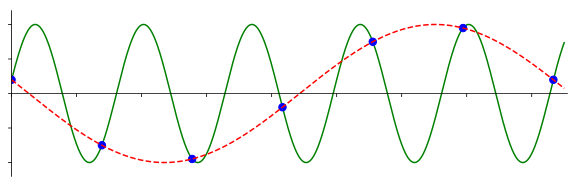

Nog steeds zou een ander signaal passen op deze samples. Deze ambiguïteit houdt in dat als iemand ons deze lijst van samples zou geven, we geen onderscheid zouden kunnen maken welke het originele signaal was.

Wat als we samplen op Fs = 1.5f:

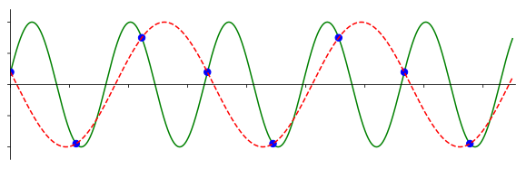

Nog steeds niet genoeg! Volgens een stuk DSP-theorie, waar we niet dieper op in gaan, moet je samplen met tenminste **twee** keer de frequentie van het signaal om deze ambiguïteit te kunnen voorkomen:

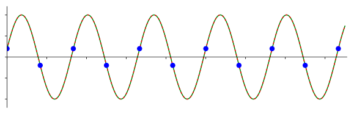

Nu is er geen ander sinusvormig signaal mogelijk wat op onze samples zou kunnen vallen, omdat we nu snel genoeg gesampled hebben (tenzij we *hogere* frequenties bekijken, maar dat behandelen we later).

Het bovenstaande signaal bestond slechts uit een sinus, meeste signalen bestaan uit vele frequentiecomponenten. Om een gegeven signaal accuraat te samplen moet de sample-frequentie "tenminste twee keer de frequentie van de maximale frequentiecomponent" zijn. Hier is een voorbeeld in het frequentiedomein, let op dat er altijd een ruisvloer zal zijn en de hoogste frequentie dus meestal een benadering is:

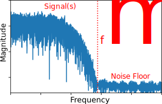
   
We moeten de hoogste frequentiecomponent vinden, verdubbelen, en op die snelheid of sneller samples nemen. De minimale snelheid waarmee we kunnen samplen wordt de Nyquist snelheid genoemd. In andere woorden, de Nyquist snelheid is de minimale snelheid waarop een signaal gesampled moet worden om alle informatie te behouden. Deze eigenschap is een extreem belangrijk stuk theorie binnen de DSP en SDR en dient als een brug tussen continue en discrete signalen.

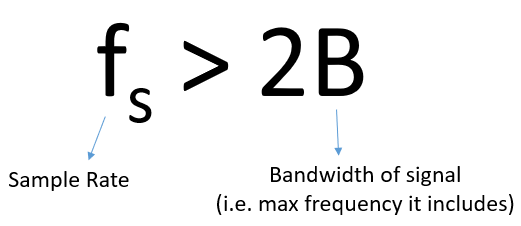

Wanneer we te langzaam samplen krijgen we een effect genaamd aliasing (Nederlands: vouwvervorming) waar we later meer over zullen leren, maar dit willen we altijd zien te voorkomen. Wat onze SDR's en bijna alle ontvangers doen, is eerst alles boven Fs/2 wegfilteren voordat er gesampled wordt. Wanneer we dan een signaal proberen te ontvangen en samplen met een te lage snelheid, dan zal het filter dat deel erboven wegkappen. Onze SDR's doen een hoop om ervoor te zorgen dat onze samples vrij zijn van vouwvervorming en andere imperfecties.

*************************
Kwadratuursamplen
*************************

De term "kwadratuur" betekent veel, maar in de context van DSP en SDR verwijst het naar twee golven die 90 graden uit fase lopen. 
Waarom 90 graden uit fase? 
Denk eraan dat wanneer twee golven 180 graden uit fase lopen, ze in feite dezelfde golf zijn, maar vermenigvuldigt met -1. 
Door 90 graden uit fase te lopen worden de signalen orthogonaal, en er zijn een hoop coole dingen die je kunt doen met orthogonale functies. Voor het gemak gebruiken we een sinus en cosinus voor onze golven die 90 graden uit fase lopen.

Laten we nu variabelen gebruiken om de **amplitude** van de sinus en cosinus aan te geven. We zullen :math:`I` voor de cos() en :math:`Q` voor sin() gebruiken:

.. math::
  I \cos(2\pi ft)
  
  Q \sin(2\pi ft)

Dit kunnen we ook grafisch weergeven door I en Q gelijk te stellen aan 1:

.. image:: ../_images/IQ_wave.png
   :scale: 70% 
   :align: center 

De cos() noemen we het "in fase" component, daarom de I, en de sin() is het 90 graden uit fase of "kwadratuur" component, vandaar de Q. Maar als je per ongeluk de Q aan de cos() en de I aan de sin() koppelt, dan maakt dat in de meeste situaties niets uit.

IQ-sampling is gemakkelijker te begrijpen bekeken vanuit de zender, dus vanuit het zenden van een RF signaal door de lucht. Wat we als zender doen is de sin() en cos() bij elkaar optellen. Laten we zeggen dat we het signaal x(t) willen versturen:

.. math::
  x(t) = I \cos(2\pi ft)  + Q \sin(2\pi ft)

Wat zou er gebeuren wanneer we een sinus en cosinus optellen? Of eigenlijk, wat zou we gebeuren wanneer we twee sinusoïden optellen die 90 graden uit fase lopen. In de onderstaande video zijn er sliders om I en Q mee aan te passen. Wat geplot wordt zijn de cosinus, sinus en de som van beide.

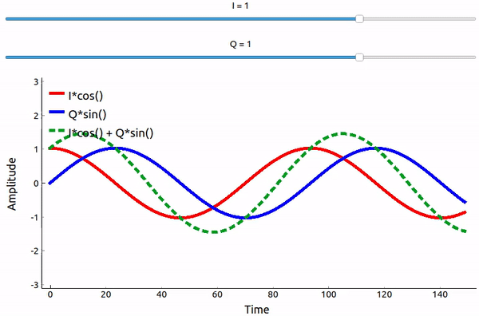

(De code voor deze Python app kun je hier vinden: `link <https://raw.githubusercontent.com/777arc/textbook/master/figure-generating-scripts/sin_plus_cos.py>`_)

Wat je hier uit moet onthouden is dat wanneer de cos() en sin() worden opgeteld, we een andere zuivere sinusoïde krijgen met een andere fase en amplitude. Daarnaast verschuift de fase wanneer we langzaam een van de twee delen groter of kleiner maken. De amplitude verandert ook mee. Dit is allemaal het gevolg van de goniometrische identiteit: :math:`a \cos(x) + b \sin(x) = A \cos(x-\phi)`, waar we dadelijk op terug komen.  Het "nut" van dit gedrag is dat we de fase en amplitude van de resulterende sinusoïde kunnen controleren door I en Q aan te passen (we hoeven niets de doen met de fase van cosinus of sinus). We kunnen bijvoorbeeld I en Q aanpassen op zo'n manier dat de amplitude constant blijft en de fase wordt wat we ook zouden willen. Omdat we weten dat we een sinusoïde signaal moeten versturen om het door de lucht te laten vliegen als een elektromagnetische golf, is deze mogelijkheid voor een zender extreem handig. Het is daarnaast veel makkelijker om twee amplitudes aan te passen en een optelling uit te voeren, dan amplitude en fase moeten aanpassen. Het resultaat is de onze zender er ongeveer zo uit zal zien:

.. image:: ../_images/IQ_diagram.png
   :scale: 80% 
   :align: center 

We hoeven alleen een cosinus te genereren en deze 90 graden op te schuiven om het Q gedeelte te krijgen.

*************************
Complexe Getallen
*************************

Uiteindelijk is de IQ-afspraak alleen een alternatieve manier om naar de modulus en fase te kijken, wat ons nu bij complexe getallen brengt en de manier waarop we die weergeven in het complexe vlak. Je hebt complexe getallen misschien al eerder gezien in andere vakken. Neem het complexe getal 0.7-0.4j als voorbeeld:

.. image:: ../_images/complex_plane_1.png
   :scale: 70% 
   :align: center

Een complex getal is niets meer dan twee getallen die samen zijn gevoegd, een reëel en een imaginair deel. Een complex getal heeft ook een modulus en fase, wat iets logischer is wanneer je het behandelt als een vector in plaats van een punt. De modulus is de lengte van de oorsprong tot het punt (dus de lengte van de vector), terwijl de fase de hoek is tussen de vector en 0 graden, de x-as:

.. image:: ../_images/complex_plane_2.png
   :scale: 70% 
   :align: center

Een sinusoïde op deze manier weergeven heet een "fasor diagram". We plotten simpelweg de complexe getallen en behandelen ze als vectoren. Maar wat is nu de modulus en fase van ons complexe getal 0.7-0.4j? Voor een gegeven complex getal waar :math:`a` het reële deel is en :math:`b` het imaginaire:

.. math::
  \mathrm{modulus} = \sqrt{a^2 + b^2} = 0.806
  
  \mathrm{fase} = \tan^{-1} \left( \frac{b}{a} \right) = -29.7^{\circ} = -0.519 \quad \mathrm{radians} 
  
In Python kun je np.abs(x) en np.angle(x) gebruiken voor de modulus en fase. De ingang kan een complex getal zijn of een array van complexe getallen, de uitgang zal een of meerdere **reële** (floating point) getallen bevatten. 

Ondertussen heb je misschien uitgevogeld hoe het fasor diagram relateert aan de IQ-afspraak: I is reëel en Q is imaginair. Wanneer we vanaf nu een complex vak tekenen zullen we I en Q gebruiken in plaat van reëel en imaginair. Maar het blijven complexe getallen!

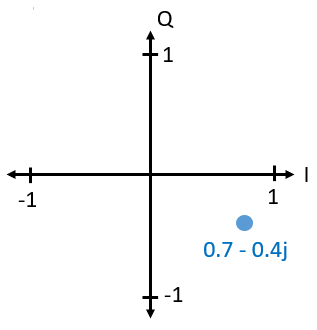

Stel we willen ons voorbeeldpunt 0.7-0.4j versturen.
Dan zenden we:

.. math::
  x(t) = I \cos(2\pi ft)  + Q \sin(2\pi ft)
  
  \quad \quad \quad = 0.7 \cos(2\pi ft) - 0.4 \sin(2\pi ft)

We kunnen de goniometrische identiteit :math:`a \cos(x) + b \sin(x) = A \cos(x-\phi)` gebruiken waar :math:`A` onze modulus is :math:`\sqrt{I^2 + Q^2}` en :math:`\phi` onze fase, dat is :math:`\tan^{-1} \left( Q/I \right)`.  Dan wordt de bovenstaande vergelijking:

.. math::
  x(t) = 0.806 \cos(2\pi ft + 0.519)

Zelfs al zijn met een complex getal gestart, we versturen iets reëels, wat goed is want we kunnen eigenlijk niet iets imaginairs uitzenden met een elektromagnetische golf. We gebruiken de imaginaire/complexe getallen alleen om aan te geven *wat* we versturen. We gaan het zo over de :math:`f` hebben.

**************************
Complexe getallen bij FFTs
**************************
We gingen bij de bovenstaande complexe getallen ervan uit dat het samples waren uit het tijddomein, maar je komt ook complexe getallen tegen bij het gebruik van een FFT. Toen we de Fourierreeks en FFT vorig hoofdstuk behandelden hebben we nog niet naar complexe getallen gekeken. Wanneer je de FFT neemt van een serie samples dan geeft dat de frequentiedomein-representatie. We hebben het erover gehad hoe de FFT uitvindt welke frequenties in een serie samples zitten (de modulus van de FFT gaf de kracht van elke frequentie aan). Maar wat de FFT daarnaast doet, is de vertraging (in de tijd) uitvogelen die op elk van deze frequenties toegepast moet worden, zodanig dat de set van sinusoïden opgeteld kunnen worden om het tijddomein-signaal weer te reconstrueren. Die vertraging is simpelweg de fase van de FFT. De uitgang van de FFT is een array van complexe getallen waarbij elk complex getal een modulus en fase geeft en de index van dat getal de frequentie. Als je dus sinusoïden genereert met die frequenties/fases/amplitudes en bij elkaar optelt, dan krijg je het originele tijddomein-signaal weer terug (of iets wat er erg op lijkt, en dat is waar Nyquist bij komt kijken).

*************************
Ontvangende kant
*************************
Laten we nu gaan kijken vanuit het perspectief van een radio-ontvanger die een signaal probeert te ontvangen (bijv. een FM radio signaal). Met IQ-sampling lijkt het diagram hierop:

.. image:: ../_images/IQ_diagram_rx.png
   :scale: 70% 
   :align: center

Er komt een reëel signaal onze antenne binnen, deze wordt omgezet in IQ waarden. We kunnen de I en Q takken apart samplen met twee ADC's en daarna dit combineren en opslaan als complexe getallen. In andere woorden, op elke tijdstap samplen we de I en de Q waarde en combineren ze in de vorm :math:`I + jQ` (dus een complex getal per IQ sample). Er zal altijd een "sample rate" of sample-snelheid zijn, de snelheid waarmee gesampled wordt. Sommige zouden zeggen "Ik heb mijn SDR op een sample-frequentie van 2 MHz lopen”. Dit betekent dat de SDR twee miljoen samples per seconde ontvangt.

Als iemand jou een stapel IQ-samples geeft, zal dat op een 1D array/vector lijken van complexe getallen. Dit punt, complex of niet, is waar dit hele hoofdstuk naar toe heeft gebouwd, en we zijn er eindelijk.

Door dit hele boek door, zul je **super** bekend raken met hoe IQ-samples werken, hoe je die ontvangt en verstuurt met een SDR, hoe je ze verwerkt in Python en hoe je ze kunt opslaan in een bestand voor later.

Nog een laatste belangrijke opmerking: Het figuur hierboven laat zien wat er **binnen** de SDR gebeurt. We hoeven niet zelf een sinus te genereren, op te schuiven met 90 graden, vermenigvuldigen of toevoegen -- de SDR doet dat voor ons. We vertellen de SDR op welke frequentie we willen samplen, of op welke frequentie we willen versturen. Aan de ontvangende kant zal de SDR ons voorzien van IQ-samples. Aan de kant van de zender moeten we de IQ-samples aanbieden. Dit zal van het datatype complexe ints of floats zijn.   
   
*************************************
Draaggolven en frequentieverschuiving
*************************************

Tot nu toe hebben we de frequentie nog niet behandelt, maar er was wel een :math:`f` in de vergelijkingen met de cos() en sin(). Deze frequentie is de frequentie waarop we echt een signaal door de lucht sturen (de frequentie van de elektromagnetische golf). Dit noemen we de "draaggolf" omdat het onze informatie draagt op een bepaalde frequentie. Wanneer we onze SDR afstellen op een bepaalde frequentie en samples ontvangen, dan wordt de informatie opgeslagen in I en Q; deze draaggolf verschijnt niet in I en Q.

.. This shows the carrier wave formula
.. tikz:: [font=\Large\bfseries\sffamily]
   \draw (0,0) node[align=center]{$A\cdot cos(2\pi ft+ \phi)$}
   (0,-2) node[align=center]{$\left(\sqrt{I^2+Q^2}\right)cos\left(2\pi ft + tan^{-1}(\frac{Q}{I})\right)$};
   \draw[->,red,thick] (-2,-0.5) -- (-2.5,-1.2);
   \draw[->,red,thick] (1.9,-0.5) -- (2.4,-1.5);
   \draw[->,red,thick] (0,-4) node[red, below, align=center]{Dit noemen we de draaggolf} -- (-0.6,-2.7);

.. .. image:: ../_images/carrier.png
..    :scale: 70% 
..    :align: center
   
Ter referentie, radiosignalen zoals FM-radio, WiFi, Bluetooth, LTE, GPS, etc., gebruiken meestal een frequentie (dus een draaggolf) tussen de 100 MHz en 6 GHz.  
Deze frequenties vliegen erg goed door de lucht, maar hebben niet een superlange antenne nodig of een hoop vermogen om te versturen of te ontvangen. Jouw magnetron maakt het eten warm met elektromagnetische golven op 2.5 GHz. Als de deur signalen zou lekken dan zou de magnetron jouw WiFi verstoren en misschien je huid verbranden. Een andere vorm van elektromagnetische golven is licht. Zichtbaar licht heeft een frequentie rond de 500 THz. Dit is zo hoog dat we geen antennes nodig hebben om licht te versturen. We gebruiken methoden zoals halfgeleider leds. Ze creëren licht wanneer een elektron tussen de atomaire banen van het halfgeleider materiaal springt, en de afstand die wordt gesprongen bepaalt de kleur. Technisch gezien worden frequenties tussen de 20 kHz en 300 GHz beschouwt als radiofrequenties (RF). Dit zijn de frequenties waarbij de energie van een oscillerende stroom door een geleider (antenne) uit kan stralen en door de ruimte bewegen. De meest nuttige frequenties voor moderne toepassingen liggen tussen de 100 MHz en 6 GHz. De frequenties daarboven wordt al decennia gebruikt door radar en satellietcommunicatie en worden nu ook toegepast in 5G "mmWave" (24 - 29 GHz) om de lagere frequenties een helpende hand te bieden en de snelheid te verhogen.

Wanneer we onze IQ-waarden snel veranderen en via onze draaggolf versturen wordt dit het "moduleren" van de draaggolf genoemd (met data of wat we ook willen). Wanneer we de I en Q aanpassen veranderen we dus de fase en amplitude van de draaggolf. Een andere optie is om de frequentie van de draaggolf aan te passen, dus een beetje hoger of lager, dat is wat een FM-zender doet.

Stel, als een simpel voorbeeld, we versturen het IQ sample 1+0j en vervolgens 0+1j. Dan gaan we van :math:`\cos(2\pi ft)` versturen naar :math:`\sin(2\pi ft)`, wat betekent dat onze draaggolf 90 graden van fase verandert wanneer we schakelen van het ene naar het andere sample.

Nu even terug naar samplen. Wat als we in plaats van samples ontvangen door het antennesignaal te vermenigvuldigen met een cos() en sin() en I en Q op te nemen, we het antennesignaal direct in een ADC zouden stoppen zoals we het hoofdstuk zijn begonnen. Stel de draaggolf is 2.4 GHz, zoals van WiFi of Bluetooth. Zoals we geleerd hebben zou dat betekenen dat we op 4.8 GHz moeten samplen. Dat is extreem snel! En een ADC die zo snel kan samplen kost duizenden euro's. In plaats hiervan verschuiven we het signaal eerst naar "beneden" zodat het signaal dat we willen samplen, gecentreerd is rond DC of 0 Hz. Deze verschuiving vindt plaats voor het samplen. We gaan van:

.. math::
  I \cos(2\pi ft)
  
  Q \sin(2\pi ft)
  
Naar alleen I en Q.

Laten we kijken hoe dit in het frequentiedomein eruitziet:

.. _verschuiving:
.. figure:: ../_images/downconversion.png
   :scale: 60% 
   :align: center

   Verschuiven naar 0 Hz

Wanneer we gecentreerd zouden zijn rond 0 Hz dan is de maximale frequentie niet langer 2.4 GHz maar afhankelijk van het signaal zelf, gezien we de draaggolf hebben verwijderd. De meeste signalen hebben tussen de 100 kHz en 40 MHz bandbreedte, dus door de verschuiving kunnen we samplen op een *veel* lagere snelheid. Zowel de B2X0 USRP's en PlutoSDR bevatten een RF IC die kan samplen op een frequentie tot 56 MHz, wat hoog genoeg is voor de meeste signalen die we tegen zullen komen.

Om te herhalen, dit proces van verschuiven doet onze SDR; als gebruiker van de SDR hoeven we niets anders te doen dan af te stemmen op de juiste frequentie. Het verschuiven naar beneden (en boven) wordt gedaan door een component genaamd mixer, meestal weergeven in diagrammen met een vermenigvuldigingssymbool in een cirkel. De mixer neemt een signaal aan de ingang en geeft een verschoven signaal aan de uitgang, en een derde signaal waar een oscillator op aan wordt gesloten. De frequentie van de oscillator bepaalt de frequentieverschuiving dat op het signaal wordt toegepast. De mixer is in essentie een vermenigvuldiging (herinner dat vermenigvuldigen met een sinusoïde een frequentieverschuiving veroorzaakt).

Als laatste vraag je je misschien af hoe snel signalen door de lucht bewegen. Herinner van de middelbare school natuurkundelessen dat radiogolven gewoon elektromagnetische golven zijn op lage frequenties (ergens tussen de 3 kHz en 80 GHz). Zichtbaar licht is een vorm van elektromagnetische golven, maar op veel hogere frequenties (400 THz tot 700 THz). Alle elektromagnetische golven bewegen zich met de lichtsnelheid, ongeveer 3e8m/s in de lucht of vacuüm. Omdat de snelheid altijd gelijk is, is de afstand die een enkele periode van de golf aflegt, afhankelijk van zijn frequentie. Dit noemen we de golflengte, aangegeven als :math:`\lambda`. Deze relatie heb je vast eerder gezien:

.. math::
 f = \frac{c}{\lambda}

Hier is :math:`c` de lichtsnelheid, meestal 3e8 wanneer :math:`f` in Hz wordt uitgedrukt en :math:`\lambda` in meters.  
In de draadloze communicatie is deze relatie belangrijk omdat wanneer we naar antennes kijken, om een bepaalde draaggolf te kunnen ontvangen, je een antenne nodig hebt die overeenkomt met de golflengte, :math:`\lambda`. Meestal is de antenne :math:`\lambda/2` of :math:`\lambda/4` in lengte.  Maar, onafhankelijk van de frequentie/golflengte, de informatie gedragen door dat signaal zal zich tussen zender en ontvanger altijd voortplanten met de snelheid van het licht. 
Om deze vertraging door de lucht te berekenen kun je een vuistregel gebruiken; licht legt ongeveer :math:`\frac{1}{3}m` per nanoseconde af. Een andere vuistregel is dat het signaal van een satelliet in geostationaire baan er ongeveer 0.25 seconden erover doet om de aarde te bereiken.

***************************
Architectuur van ontvangers
***************************

Het figuur uit de "ontvangende kant" sectie, laat zien hoe het signaal wordt verschoven en opgesplitst in I en Q. Deze opstelling wordt een "directe omzetting" genoemd, of "nul IF", want de RF-frequenties worden direct neerwaarts omgezet naar de laagfrequente "basisband" (Engels: baseband). Nog een optie is om de frequentieverschuiving niet te doen en zo snel te samplen, dat het alles opvangt tussen 0 Hz en 1/2 de sample-frequentie. Dit heet "direct samplen" of "directe RF" en heeft een extreem dure ADC-chip nodig. Een derde architectuur waar veel oude radio's op werken, heet "superheterodyne". Deze voert ook frequentieverschuiving uit maar niet naar 0 Hz. Het schuift het signaal naar een middenfrequentie of "intermediate frequency" (IF). Een low-noise amplifier (LNA) (Nederlands: lage ruis versterker) is simpelweg een versterker die is ontworpen om met hele lage ingangsvermogens te werken. Hier zijn de blokdiagrammen van de drie architectuuropstellingen (er bestaan hier ook variaties op):

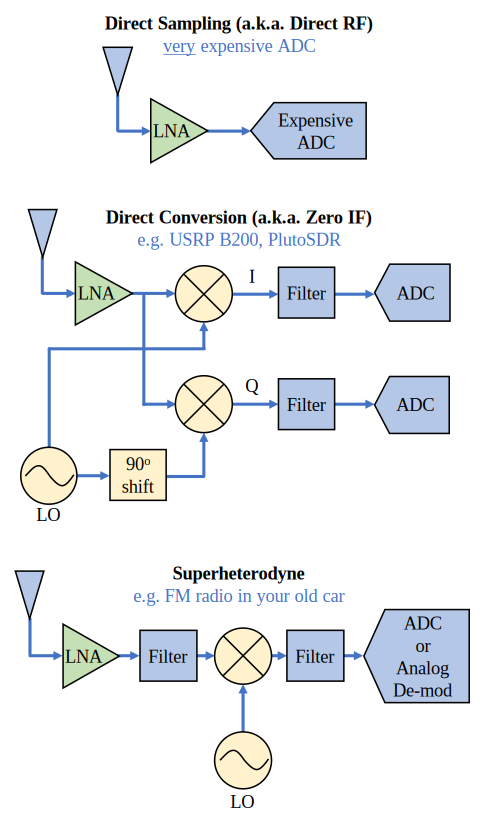

***********************************
Basisband- en Banddoorlaatsignalen
***********************************
We noemen de band waar het signaal rond de 0 Hz zit de "basisband". Andersom, "bandoorlaat" refereert naar wanneer een signaal nergens in de buurt van de 0 Hz zit, maar omhoog is geschoven met draadloze transmissie als doel. Iets als een *basisbandtransmissie* bestaat niet, want je kunt niet iets imaginairs versturen. Een signaal in de basisband kan perfect gecentreerd zijn rond 0 Hz net als de rechterkant van figuur :numref:`verschuiving`. Het signaal kan ook *in de buurt* van 0 Hz zitten, zoals de twee signalen hieronder. Die signalen worden nog steeds opgevat als basisband. Er is ook een banddoorlaatsignaal weergegeven, gecentreerd op een erg hoge frequentie :math:`f_c`.

.. image:: ../_images/baseband_bandpass.png
   :scale: 50% 
   :align: center

Misschien ben je ook de term "intermediate frequency" (IF) of tussenfrequentie tegengekomen; zie IF voor nu als een tussenstap tussen de basisband en RF/bandoorlaatband.

We maken, analyseren of slaan signalen op vanuit de basisband zodat we op een lagere sample-frequentie kunnen werken (zoals eerder uitgelegd). Hierbij is het belangrijk op te merken dat basisbandsignalen meestal complex zijn, terwijl bandoorlaatsignalen (dus te versturen RF signalen) reëel zijn. Als je erover nadenkt: signalen die door een antenne gaan moeten reëel zijn, je kunt geen complex/imaginair signaal uitzenden. Wanneer het negatieve en positieve deel van het frequentiespectrum niet precies hetzelfde zijn, dan weet je zeker dat het signaal complex is. Negatieve frequenties worden immers met complexe getallen weergegeven. In de werkelijkheid bestaan negatieve frequenties niet, alleen frequenties onder de draaggolf. 

Eerder speelden we met het complexe punt 0.7 - 0.4j, dat was in feite een sample van een basisbandsignaal. In de meeste gevallen, als je complexe samples (IQ-samples) ziet, ben je in de basisband bezig. Vanwege de hoeveelheid data dat het in beslag zou nemen, worden signalen zelden opgeslagen op RF-frequenties, en om het feit dat we meestal alleen geïnteresseerd zijn in een smal deel van het RF spectrum.

***************************
DC Piek
***************************

Wanneer je begint te werken met SDR's vind je meestal een grote piek in het midden van de FFT.
Dit heet een "DC-offset" of "DC-piek" of soms "LO lekkage", waar LO voor lokale oscillator staat.

Hier is een voorbeeld van zo’n DC-piek:

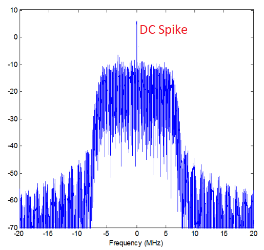
   
Omdat we SDR's afstellen op een middenfrequentie, komt het 0 Hz gedeelte van de FFT overeen met die middenfrequentie.
Maar die DC-piek betekent niet per se dat er energie op de middenfrequentie zit.
Wanneer alleen een DC-piek te zien is, en de rest van de FFT lijkt op ruis, dan is er hoogstwaarschijnlijk niet eens een signaal aanwezig op 0 Hz.

De DC-offset is een gevolg van directe conversie ontvangers, de architectuur die gebruikt wordt door SDR's zoals de PlutoSDR, RTL-SDR, LimeSDR, en veel Ettus USRP's. In directe conversie ontvangers verschuift een oscillator, de LO, het signaal van zijn frequentie naar de basisband. Met als resultaat dat lekkage van de LO in het midden van de waargenomen band verschijnt. LO-lekkage is de extra energie die ontstaat bij het combineren van frequenties. Het is moeilijk deze extra ruis te verwijderen omdat het dicht bij het gewenste uitgangssignaal zit. Veel RF ic's hebben DC offset filters ingebouwd, maar meestal moet er een signaal aanwezig zijn om te kunnen werken. Om deze reden is de DC-piek sterk aanwezig op het moment dat er geen signalen zijn.

Een snelle manier om met DC-offset om te gaan is om het signaal te oversamplen en de LO af te stellen naast de signaalfrequentie. Stel we willen 5 MHz van het spectrum rond 100 MHz bekijken. Wat we dan doen is samplen met bijvoorbeeld 20 MHz en afstellen op 95 MHz.

.. _afstellen:
.. figure:: ../_images/offtuning.png
   :scale: 40 %
   :align: center

   Afstellen naast de signaalfrequentie

Het blauwe vlak in figuur :numref:`afstellen` laat zien wat gesampled is door onze SDR, het groene vlak laat zien in welk deel van het spectrum we geïnteresseerd zijn. Onze LO is afgesteld op 95 MHz, omdat we de SDR zo hebben ingesteld. Gezien 95 MHz buiten het groene vlak valt, hebben we geen last van de DC-piek.

Nu is er een probleem: Als we inderdaad die 5 MHz band rond de 100 MHz willen hebben, moeten zelf een frequentieverschuiving, filter, en hersamplen uitvoeren (iets wat we later leren).
Gelukkig wordt dit proces van scheef afstellen, dus een LO-offset toepassen, gedaan binnen de SDR, zodat het automatisch de verschuiving naar/van de gewenste middenfrequentie voor je doet. Dit is een voordeel want dan hoeven we niet een hogere frequentie over onze USB of ethernetverbinding heen te sturen, want dit vormt vaak het knelpunt.

Dit onderdeel over DC-offsets is een goed voorbeeld in hoe dit boek verschilt van andere boeken. Het gemiddelde DSP boek behandelt wel samplen, maar slaat de implementatie specifieke dingen zoals DC pieken over, terwijl deze veel voorkomen in de praktijk.

****************************
samplen met onze SDR
****************************

SDR-specifieke informatie over samplen vind je in de volgende hoofdstukken:

* :ref:`pluto-chapter`
* :ref:`usrp-chapter`

*****************************
Gemiddelde Vermogen Berekenen
*****************************
We kunnen het gemiddelde vermogen van een discreet complex signaal, dus wat we zelf gesampled hebben, vinden door de modulus van elk sample te nemen, te kwadrateren en het gemiddelde te vinden:

.. math::
   P = \frac{1}{N} \sum_{n=1}^{N} |x[n]|^2

De absolute waarde van een complex getal is gewoon de modulus: :math:`\sqrt{I^2+Q^2}`

In Python zou je het gemiddelde vermogen als volgt bepalen:

.. code-block:: python

 avg_pwr = np.mean(np.abs(x)**2)

Er is een handige truc om het gemiddelde vermogen van een gesampled signaal te berekenen.
Als je signaal een gemiddelde heeft van nul -- wat bij SDR's het geval is (later zie je waarom) -- dan kan het signaalvermogen gevonden worden door de variantie van de samples te bepalen. In dit geval zou je het vermogen in Python zo kunnen berekenen:

.. code-block:: python

 avg_pwr = np.var(x) # (signaal zou grofweg een gemiddelde van 0 moeten hebben)

De reden waarom de variantie van de samples het gemiddelde vermogen berekent is vrij simpel: de vergelijking voor de variantie is :math:`\frac{1}{N}\sum^N_{n=1} |x[n]-\mu|^2` waar :math:`\mu` voor de gemiddelde waarde van het signaal staat. Die vergelijking ziet er bekend uit! Als :math:`\mu`  nul is, dan wordt de vergelijking voor de variantie gelijk aan de vergelijking waarmee het gemiddelde vermogen wordt gevonden. Je zou ook eerst het gemiddelde van de samples kunnen aftrekken en daarna de variantie uitrekenen.  Besef dan wel dat als het gemiddelde niet nul is, de variantie en vermogen niet overeenkomen.
 
**************************************
Power Spectral Density berekenen
**************************************

In het vorige hoofdstuk hebben we geleerd dat je een signaal met een FFT kunt omzetten naar het frequentiedomein, en dat het resultaat de Power Spectral Density (PSD) (Nederlands: densiteit van het vermogensspectrum) wordt genoemd.
Maar om de PSD van een stapel samples echt te vinden en te plotten, moeten we meer doen dan alleen een FFT nemen.
De volgende zes operaties zijn nodig om de PSD te bepalen:

1. Neem de FFT van onze samples. Met x samples is de lengte van de FFT standaard ook x. Laten we als voorbeeld de eerste 1024 samples gebruiken om een 1024-lengte FFT te maken. De uitgang bestaat dan uit 1024 complexe floats.
2. Neem de modulus van de FFT uitgang, dit geeft ons 1024 reële floats.
3. Kwadrateer de modulus vervolgens om vermogen te krijgen.
4. Normaliseren: Deel door de FFT lengte (:math:`N`) en sample-frequentie (:math:`Fs`).
5. Zet het om naar dB met behulp van :math:`10 \log_{10}()`; we bekijken PSD's altijd in de log-schaal.
6. Voer een FFT-shift uit, zoals is behandeld in het vorige hoofdstuk, om "0 Hz" in het midden, en de negatieve frequenties links van het midden, te plaatsen.

Die zes stappen in Python zien er zo uit:

.. code-block:: python

 Fs = 1e6 # Stel we samplen op 1 MHz
 # x bevat onze array van IQ samples
 N = 1024
 x = x[0:N] # We nemen slechts de FFT van de eerst 1024 samples
 PSD = np.abs(np.fft.fft(x))**2 / (N*Fs)
 PSD_log = 10.0*np.log10(PSD)
 PSD_shifted = np.fft.fftshift(PSD_log)
 
We kunnen optioneel ook een venster toepassen, zoals we hebben geleerd in :ref:`freq-domain-chapter` hoofdstuk. Het toepassen van dit venster zou net voor de regel met fft() moeten gebeuren.

.. code-block:: python

 # Voeg de volgende lijn toe na x = x[0:1024]
 x = x * np.hamming(len(x)) # Hamming-venster toepassen

Om nu deze PSD te plotten hebben we wel informatie nodig over de x-as.
Afgelopen hoofdstuk hebben we geleerd dat bij het samplen we enkel het spectrum tussen -Fs/2 en Fs/2 zien, waarbij Fs onze sample-frequentie is.
De resolutie die we halen in het frequentiedomein hangt af van de lengte van onze FFT, wat normaal gelijk is aan het aantal samples waarop we de FFT uitvoeren.
In dit geval komt dat neer op 1024 equidistante punten tussen -0.5 MHz en 0.5 MHz.
Als onze SDR was afgesteld op 2.4 GHz, zouden we de frequenties tussen 2.3995 GHz en 2.4005 GHz kunnen waarnemen.
Je kunt in python de x-as naar de echt waargenomen frequenties verschuiven:

.. code-block:: python
 
 center_freq = 2.4e9 # middenfrequentie waarop SDR is afgesteld
 f = np.arange(Fs/-2.0, Fs/2.0, Fs/N) # start, stop, step. rond 0 Hz
 f += center_freq # middenfrequentie erbij optellen
 plt.plot(f, PSD_shifted)
 plt.show()
 
Het resultaat is een prachtige PSD!

Mocht je de PSD willen vinden van miljoenen samples, neem dan niet een FFT van een miljoen punten, wat dat duurt voor eeuwig. Je zou dan een uitgang krijgen met een miljoen "frequentiepunten" (bins), dat is meer dan je op een plot kunt tonen.
In plaats daarvan kun je beter meerdere smalle PSD's uitvoeren en het gemiddelde nemen, of weergeven in een spectrogramplot.
Anderzijds, als je weet dat het signaal niet snel verandert, dan is het genoeg om een paar duizend samples te nemen en daar de PSD van te vinden; binnen het tijdbestek van een paar duizend samples ontvang je waarschijnlijk genoeg van het signaal om een mooie representatie te krijgen.

Hieronder staat de volledige broncode, inclusief het genereren van een signaal (complex exponent op 50 Hz) met ruis. Let op dat N, het aantal samples van het signaal, ook de lengte is van de FFT. We nemen de FFT over het hele gesimuleerde signaal.

.. code-block:: python

 import numpy as np
 import matplotlib.pyplot as plt
 
 Fs = 300 # sample-frequentie
 Ts = 1/Fs # periodetijd
 N = 2048 # aantal samples om te simuleren
 
 t = Ts*np.arange(N)
 x = np.exp(1j*2*np.pi*50*t) # simuleert sinusoide van 50 Hz
 
 n = (np.random.randn(N) + 1j*np.random.randn(N))/np.sqrt(2) # complexe ruis met eenheidsvermogen
 noise_power = 2
 r = x + n * np.sqrt(noise_power)
 
 PSD = np.abs(np.fft.fft(r))**2 / (N*Fs)
 PSD_log = 10.0*np.log10(PSD)
 PSD_shifted = np.fft.fftshift(PSD_log)
 
 f = np.arange(Fs/-2.0, Fs/2.0, Fs/N) # start, stop, stap
 
 plt.plot(f, PSD_shifted)
 plt.xlabel("Frequency [Hz]")
 plt.ylabel("Magnitude [dB]")
 plt.grid(True)
 plt.show()
 
Uitgang:

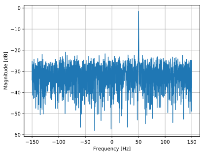

********************
Extra Leesmateriaal
********************

#. http://rfic.eecs.berkeley.edu/~niknejad/ee242/pdf/eecs242_lect3_rxarch.pdf

