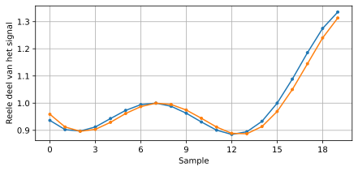
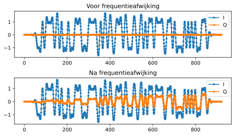
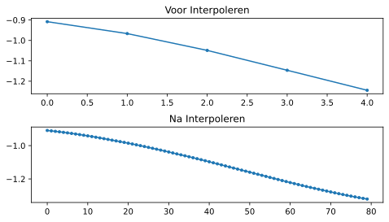
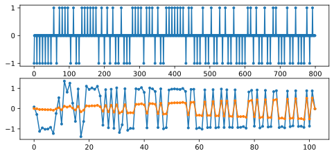
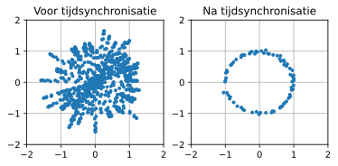
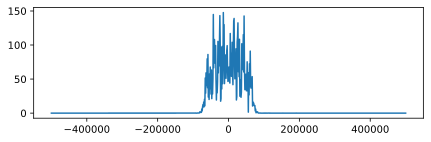
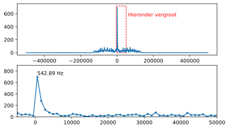
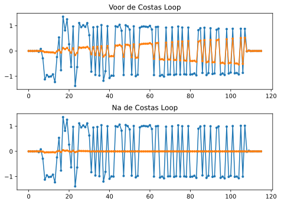
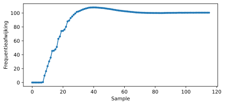
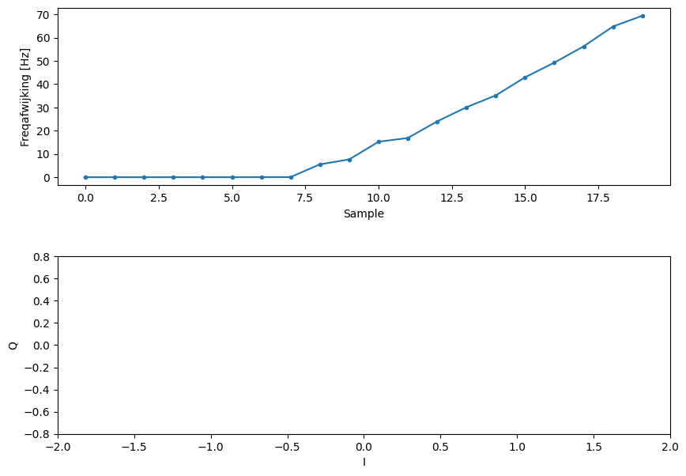

.. _sync-chapter:

################
Synchronisatie
################

Dit hoofdstuk gaat over het synchroniseren van draadloze signalen in tijd en frequentie. Hiermee corrigeren we frequentieafwijking en stellen het moment van samplen af op symbool niveau. We zullen de klokhersteltechniek van Mueller en Muller, en de Costas Loop, gebruiken in Python.

***************************
Introductie
***************************

We hebben besproken hoe je digitale signalen draadloos kunt versturen met een digitaal modulatieschema zoals QPSK en het toepassen van vormgevende filters om de bandbreedte te beperken. We kunnen kanaalcodering toepassen bij slechte signaalruisverhoudingen. 
Het zal sowieso helpen om zoveel mogelijk te filteren voordat we het signaal verwerken.
In dit hoofdstuk zullen we onderzoeken hoe synchronisatie wordt uitgevoerd aan de ontvangende kant. 
Synchronisatie is een reeks bewerkingen die plaatsvindt *vóór* demodulatie en kanaaldecodering.
Hieronder zie je de totale zender-kanaal-ontvanger keten waarbij de blokken die we in dit hoofdstuk zullen behandelen, geel zijn gemaakt. (Dit diagram is niet allesomvattend - de meeste systemen bevatten ook egalisatie en multiplexing).

.. [font=\sffamily\Large\bfseries]
.. tikz:: [font=\sffamily\large]
   \definecolor{yellowish}{HTML}{FFE699}
   \definecolor{grayish}{HTML}{D9D9D9} 
   \tikzset{
      rect/.style={
         align=center,
         text=black,		
         minimum width=2.5cm,
         minimum height=2cm}
   }
   \tikzset{
      done/.style={rect, fill=grayish }
   }
   \tikzset{
      todo/.style={rect, fill=yellowish}
   }
   \tikzset{
      arrow/.style={line width=1mm}
   }
   \node [done]  (codering) {Kanaal\\codering};
   \node [done, right=1.5cm of codering ]    (modulatie) {Modulatie};
   \node [done, right=1.5cm of modulatie	]  (pulse) {Pulsvorming};
   \node[rect, cloud, cloud puffs=15.7, cloud ignores aspect, minimum width=5cm, minimum height=2cm, align=center, fill=grayish, right=1.5cm of pulse] (channel) {Draadloos\\kanaal};
   \node [done] at (-4,-4)                   (matched) {Matched\\filter};
   \node [todo, right=0.5cm of matched]      (coarse) {Grove freq.-\\correctie};
   \node [todo, right=0.5cm of coarse]       (symbol) {Tijdsync};
   \node [todo, right=0.5cm of symbol]       (fine) {Fijne freq.-\\correctie};
   \node [done, right=0.5cm of fine]         (demod) {Demodulatie};
   \node [todo, right=0.5cm of demod]        (frame) {Frame-\\detectie};
   \node [done, right=0.5cm of frame]        (decodering) {Kanaal\\decodering};
   \draw [arrow, stealth-](codering.west) -- ++(-2,0) node[left]{\emph{bits}};
   \draw[arrow, -stealth] (codering.east)--  (modulatie.west);
   \draw[arrow, -stealth] (modulatie.east)-- (pulse.west);
   \draw[arrow, -stealth] (pulse.east)--     (channel.west);
   \draw[arrow, -stealth] (channel.south) -- ++(0,-0.5) -| (matched.north);
   \draw[arrow, -stealth] (matched.east) --  (coarse.west);
   \draw[arrow, -stealth] (coarse.east)--    (symbol.west);
   \draw[arrow, -stealth] (symbol.east)--    (fine.west);
   \draw[arrow, -stealth] (fine.east)--      (demod.west);
   \draw[arrow, -stealth] (demod.east) --    (frame.west);
   \draw[arrow, -stealth] (frame.east) --    (decodering.west);
   \draw[arrow, -stealth] (decodering.east) --++(1,0) node[right]{\emph{bits (hopelijk)}};

.. .. image:: ../_images/sync-diagram.svg
..    :align: center 
..    :target: ../_images/sync-diagram.svg

***************************
Draadloos kanaal simuleren
***************************

We zullen een realistischer kanaalmodel moeten gaan gebruiken voordat we het over synchronisatie gaan hebben. Zolang er geen willekeurige vertraging plaatsvindt is er namelijk geen synchronisatie nodig, of tenminste is het erg simpel om te synchroniseren (met de sampleklok). Je zou in dat geval alleen maar rekening hoeven houden met de vertraging die jouw filters introduceren. Naast een tijdsvertraging zullen we ook een frequentieafwijking simuleren; oscillators zijn immers niet perfect, er zal altijd een verschil zijn tussen de middenfrequentie van de zender en ontvanger.

We zullen eerst wat Python code gaan bekijken waarmee we een vertraging en frequentieafwijking kunnen simuleren. De code zal verder gaan waar het :ref:`pulse-shaping-chapter` is geeindigt; alle code uit dit hoofdstuk kun je erachter toevoegen. Voor het gemak is de code hier ook te vinden:

.. raw:: html

   

   
Python Code van het vorige hoofdstuk

.. code-block:: python

    import numpy as np
    import matplotlib.pyplot as plt
    from scipy import signal
    import math

    # symbolen genereren
    num_symbols = 100
    sps = 8
    bits = np.random.randint(0, 2, num_symbols) # De te verzenden bits
    pulse_train = np.array([])
    for bit in bits:
        pulse = np.zeros(sps)
        pulse[0] = bit*2-1 # alleen eerste waarde gelijk aan bitwaarde
        pulse_train = np.concatenate((pulse_train, pulse)) # de 8 samples toevoegen aan x

    # het RC filter bouwen
    num_taps = 101
    beta = 0.35
    Ts = sps # sample rate is 1 Hz, periodetijd is 1, *symbool*periodetijd is 8
    t = np.arange(-51, 52) # neemt laatste nummer niet mee
    h = np.sinc(t/Ts) * np.cos(np.pi*beta*t/Ts) / (1 - (2*beta*t/Ts)**2)

    # signaal x filteren.
    samples = np.convolve(pulse_train, h)

.. raw:: html

   

De code die te maken heeft met het weergeven van de figuren hebben we weg gelaten, we gaan ervan uit dat je nu hebt geleerd hoe je dat moet doen.
Om de figuren extra mooi te maken zoals in dit boek heb je veel extra code nodig, wat niet het leerdoel is.

Vetraging toevoegen
###################

We zouden makkelijk het signaal kunnen vertragen door de samples te verschuiven, maar dit simuleert alleen een vertraging dat een veelvoud is van onze sampletijd. Realistisch gezien zal de vertraging nooit exact gelijk zijn aan de sampletijd. We kunnen een willekeurige vertraging geven met een speciaal filter dat alle frequenties doorlaat maar de samples wel vertraagt met een fractie van de sampletijd. Je kunt het zien als een alles-doorlaatfiler dat een faseverschuiving introduceert op alle frequenties. (Een tijdsvertraging en faseverschuiving zijn immers hetzelfde!) De Python code van dit filter staat hieronder:

.. code-block:: python

    # filter maken en toepassen
    delay = 0.4 # fractie van de sampletijd
    N = 21 # aantal coefficienten
    n = np.arange(-N//2, N//2) # ...-3,-2,-1,0,1,2,3...
    h = np.sinc(n - delay) # coefficienten berekenen
    h *= np.hamming(N) # venster toepassen om beide kanten naar 0 te latten gaan
    h /= np.sum(h) # normaliseren zodat de versterking 1 is en we het signaal niet dempen
    samples = np.convolve(samples, h) # filter toepassen.

Zoals je ziet berekenen we de filtercoefficienten met behulp van de sinc() functie. Een sinc in het tijddomein is een rechthoek in het frequentiedomein en de rechthoek voor dit filter reikt over het hele frequentiebereik van ons signaal. Er is geen vervoming, alleen een vertraging. In dit voorbeeld is dat :math:`0.4*T_s`. Hou in je achterhoofd dat *elk* filter een vertraging toevoegt gelijk aan het aantal coefficienten/2 -1 vanwege de convolutieoperatie.

De vertraging is te zien wanneer we de in en uitgang van het filter weergeven. Als je alleen een paar symbolen bekijkt is het goed zichtbaar.

Frequentieafwijking introduceren
################################

Om het ontvangen signaal nog realistcher te maken kunnen we een frequentieafwijking toepassen. Stel we hebben een samplerate van 1 MHz gebruikt (dit is niet belangrijk maar maakt het vervolg wat makkelijker). Mochten we een frequentieverschuiving van 13 kHz (willekeurig gekozen) willen toepassen dan kan dat met deze code:

.. code-block:: python

   # freq afwijking
   fs = 1e6 # samplerate van 1 MHz
   fo = 13000 # offset 13 khz
   Ts = 1/fs # sampletijd
   t = np.arange(0, Ts*len(samples), Ts) # tijdvector
   samples = samples * np.exp(1j*2*np.pi*fo*t) # verschuiving
 
Dit figuur laat het signaal voor en na de frequentieverschuiving zien.
 

Tot nu toe konden we alleen het reele I-deel weergeve omdat we BPSK gebruiken. Maar nu we een frequentieverschuiving hebben geintroduceerd om een draadloos kanaal te simuleren verspreidt de energie zich over het I en Q deel. Dus vanaf nu moeten we beide delen weergeven. Voel je vrij een andere frequentieverschuiving te kiezen. Bij een verschuiving van 1 kHz zul je ook een sinusoide kunnen herkennen in de omlijning van het signaal; het varieert dan langzaam genoeg om een paar symbolen te overspannen.

Als je de code bestudeert zul je zien dat de samplerate niet helemaal arbitrair is, het is afhankelijk van het ratio tussen :code:`fo` en :code:`fs`.

Voor nu kun je de code beschouwen als de simulatie van een draadloos kanaal. De code komt na de zender maar voor de ontvanger. De kan van de ontvanger gaan we verder bestuderen in dit hoofdstuk.

***************************
Tijdsynchronisatie
***************************

Wanneer een signaal draadloos wordt verzonden ervaart het een willekeurige faseverschuiving vanwege de reistijd. We kunnen niet zomaar beginnen te samplen op onze samplefrequentie want dan zitten we hoogstwaarschijnlijk naast het juiste samplemoment zoals aan het eind van :ref:`pulse-shaping-chapter` is besproken. Bekijk de laatste drie figuren van dat hoofdstuk eens als je dit niet kunt volgen. Het doel is dus om origenele samplefrequentie en fase terug te vinden. Het wordt ook "clock-recovery" (herstellen van de klok) genoemd.

De meeste synchronisatietechnieken zijn gebaseerd op de phase locked loop (PLL); we zullen PLLs hier niet bespreken maar het is goed om te weten en je kunt er zelf informatie over opzoeken als je geinteresseerd bent. PLL's zijn closed-loop systemen die feedback gebruiken om voortdurend wat bij te stellen; in dit geval een tijdsvertraging om op de pieken te kunnen samplen.

Je kunt de synchronisatie zien als een blok welk een stroom aan samples ontvangt en uitstuurt, net als een filter. Dit blok wordt ingesteld met informatie over ons signaal, met name het aantal samples per symbool (onze beste inschatting). Het blok werkt als een decimator, de samplefrequnetie aan de uitgang is lager dan aan de ingang. We willen maar 1 sample per symbool hebben dus de factor is gelijk aan het aantal samples per symbool.
Als we 1M symbolen per seconde zenden, en het signaal bij de ontvanger samplen met 16 MHz, dan krijgen we 16 samples per symbool.
De ingangsfrequentie van het blok is dan 16 MHz maar de uitgang 1 MHz, gezien we maar 1 sample per symbool willen.

De meeste algoritmes leunen op het feit dat digitale symbolen stijgen en dalen en de overgang is het moment waarop we willen samplen. Anders verwoord, als we de absolute versie van ons signaal nemen dan willen we op de pieken samplen:

.. image:: ../_images/symbol_sync2.png
   :scale: 40 % 
   :align: center 

De meeste algoritmen zijn op een PLL gebaseerd en het verschil tussen ze is de vergelijking die de afwijking in de tijd (:math:`\mu`) probeert te corrigeren. De waarde van :code:`mu` wordt in elke iteratie van de loop geüpdatet. Je kunt het bekijken als de waarde die verteld hoeveel samples we het signaal moeten verschuiven om het "perfecte" samplemoment te vinden. Dus met een waard van :code:`mu = 3.61` zouden we de ingang 3.61 samples moeten verschuiven om correct te kunen samplen. Omdat we 8 samples per symbool hebben zou een :code:`mu>8` gewoon weer terugvouwen naar 0.

Het volgende stuk code implementeert het Mueller en Muller klokherstel algoritme. Je kunt het testen zolang je de frequentieverschuiving 0 laat; dit corrigeert alleen een faseverschuiving:

.. code-block:: python

    mu = 0 # Eerste inschatting
    out = np.zeros(len(samples) + 10, dtype=complex)
    out_rail = np.zeros(len(samples) + 10, dtype=complex) # stores values, each iteration we need the previous 2 values plus current value
    i_in = 0 # input samples index
    i_out = 2 # output index (eerste twee zijn 0)
    while i_out < len(samples) and i_in+16 < len(samples):
        out[i_out] = samples[i_in + int(mu)] # probeer het "beste" sample.
        out_rail[i_out] = int(np.real(out[i_out]) > 0) + 1j*int(np.imag(out[i_out]) > 0) #90,45,-45 of -90
        x = (out_rail[i_out] - out_rail[i_out-2]) * np.conj(out[i_out-1])
        y = (out[i_out] - out[i_out-2]) * np.conj(out_rail[i_out-1])
        mm_val = np.real(y - x)
        mu += sps + 0.3*mm_val
        i_in += int(np.floor(mu)) # het is een index dus afronden
        mu = mu - np.floor(mu) # getal achter de punt bepalen
        i_out += 1 # index uitgang ophogen
    out = out[2:i_out] # eerste 2 verwijderen, alles na i_out is niet gebruikt
    samples = out # samples zijn de uitgang

Het blok wordt de "ontvangen" samples gevoerd en geeft aan de uitgang 1 sample per keer (:code:`i_out` wordt telkens opgehoogd).
Het gebruikt niet alle ontvangen samples achter elkaar, maar slaat samples over in een poging sneller het juiste sample te vinden, op de piek van de puls.
Tijdens de herhaling probeert het langzaam met het symbool te synchroniseren door :code:`mu` aan te passen.
Als de synchronisatie volledig is zou de uitgang alleen samples moeten bevatten die op de juiste momenten zijn genomen.
De snelheid waarmee de lus reageert wordt bepaald door de 0.3 constante; een hogere waarde reageert heftiger of sneller, maar kan het systeem instabiel maken.

De volgende grafiek toont een voorbeelduitvoer waarbij we zowel de fractionele tijdvertraging als de frequentieverschuiving *uitgeschakeld* hebben. We tonen alleen I omdat Q nu uit nullen bestaat vanwege het gebrek aan frequentieverschuiving. De drie plots zijn op elkaar gestapeld om te laten zien hoe de bits verticaal zijn uitgelijnd.

**Top Plot**
    De originele BPSK symbolen, i.e., 1'en end -1'en.  Er zitten nullen tussen vanwege de 8 samples per symbool.
**Middle Plot**
    Na het vormgeven van de pulsen.
**Bottom plot**
    Na het uitvoeren van de Tijdsynchronisatie blijft er 1 sample per symbool over. Deze samples worden direct in de demodulator gestopt wat voor BPSK een vergelijking met 0 betekent.

.. image:: ../_images/time-sync-output.svg
   :align: center
   :target: ../_images/time-sync-output.svg

Als we kijken naar de uitgang van het synchronisatieblok in het onderste figuur, dan zien we dat het bijna 30 symbolen duurde voordat de juiste tijdvertraging was gevonden. Omdat een feedback-systeem altijd tijd nodig heeft om te reageren maken vele communicatieprotocolen gebruik van een "preamble" (Nederlands: reeks aan bits die het signaal voorgaan). Deze preamble bevat een synchronisatiesequentie: het verkondigt dat een nieuw pakketje is aangekomen, en geeft de ontvanger de tijd om te synchroniseren. Maar na ~30 symbolen werkt het perfect (in het figuur). Wat we over houden zijn perfecte 1'en en -1'en die overeenkomen met de verzonden data. Natuurlijk helpt het dat dit voorbeeld geen ruis had. Voel je vrij het ruisniveau en de tijdsvertraging aan te passen om te kijken hoe de synchronisatie werkt. In geval van QPSK zouden we met complexe getallen werken, maar de aanpak blijft hetzelfde.

****************************************
Tijdsynchronisatie met interpolatie
****************************************

Meestal interpoleren synchronisatieblokken de ingangssamples door een bepaald nummer, bijv. 16, zodanig dat het signaal ook een fractie van de sampletijd verschoven kan worden. De willekeurige vertraging dat een draadloos kanaal introduceert, is hoogstwaarschijnlijk niet perfect gelijk aan een veelvoud van de sampletijd. Dit zal helemaal niet het geval zijn wanneer we 2 of 4 samples per symbool ontvangen. Door de samples te interpoleren geeft het ons de mogelijkheid om "tussen" de samples te samplen om de uiterste piek van het symbool te vinden. De uitgang zal nog steeds 1 sample per symbool bevatten, het is de ingang dat geïnterpoleerd wordt.

De Python code voor tijdsynchronisatie dat we hierboven gebruikten bevat geen interpolatie. Om de code uit te breiden kun je de fractionele tijdvertraging aanzetten dat we aan het begin van dit hoofdstuk hebben geimplementeerd, dit geeft een realistischer beeld. Laat de frequentieverschuiving uit staan. Wanneer je de simulatie opnieuw uitrvoert zul je zien dat er nooit volledig gesynchroniseerd wordt met het signaal. Dit komt omdat we niet interpoleren en het dus niet mogelijk is om tussen de samples in te samplen. Laten we interpolatie toevoegen.

De snelste en makkelijkste manier om met Python een signaal te interpoleren is door gebruik te maken van scipy's :code:`signal.resample` of :code:`signal.resample_poly`. Beide functies bereiken hetzelfde, maar werken iets anders. We zullen de tweede functie toepassen omdat deze wat sneller is. We gaan een interpolatiefactor van 16 gebruiken, dus we voegen 15 extra samples tussen elke sample toe. Dit kan worden toegepast in 1 regel code en moet *voor* de tijdsynchronisatie worden toegevoegd. Het synchronisatie-algoritme moet ook iets aangepast worden. We kunnen het verschil bekijken:

.. code-block:: python

 samples_interpolated = signal.resample_poly(samples, 16, 1)
 
 # Plot the old vs new
 plt.figure('before interp')
 plt.plot(samples,'.-')
 plt.figure('after interp')
 plt.plot(samples_interpolated,'.-')
 plt.show()

Als we het *heel erg* vergroten dan zien we dat het hetzelfde signaal is, maar met 16x zoveel punten:

Hopelijk is de reden achter het interpoleren duidelijk aan het worden. De extra samples staan ons toe om ook een fractie van de sampletijd te kunnen zien. Naar het interpoleren van de samples zullen we ook twee regels van het synchronisatieblok moeten aanpassen. De eerste twee regels van de while loop worden dan:

.. code-block:: python

 while i_out < len(samples) and i_in*16+16 < len(samples):
   out[i_out] = samples[i_in*16 + int(mu*16)] # probeer het "beste" sample.

We hebben een aantal dingen aangepast. Als eerste kunnen we :code:`i_in` niet meer gebruiken als de sampleindex. We hebben nu 16 keer zoveel samples dus we moeten de index met 16 vermenigvuldigen. De loop past :code:`mu` aan. Dit stelt de vertraging voor dat we nodig hebben om correct te samplen. 
Eerder kon we niet een fractie van de sampletijd wachten, maar nu wel, in stappen van een 16e van de sampletijd. 
We vermenigvuldigen :code:`\mu` dus met 16 om uit te vogelen met hoeveel samples we ons geinterpoleerde signaal moeten vertragen.
Als deze paragraaf niet duidelijk is, probeer dan de initiele code met het commentaar nogmaals door te lezen.
Het is niet heel belangrijk dat je het algoritme snapt, maar wel de limitaties ervan.

Voel je vrij om met eigen interpolatiefactoren te spelen. Je kunt ook proberen om de frequentieverschuiving nu toe te passen, of ruis toe te voegen, om te zien hoe het synchronisatiealgoritme dit aanpakt (hint: misschien moet je die 0.3 factor ook aanpassen).

Als de een frequentieverschuiving toepassen van 1 kHz dan zie je de volgende reactie. We zullen beide I en Q moeten weergeven omdat een frequentieverschuiving toe hebben gevoegd (door een complex exponent):

Het is nu iets lastiger te zien maar de tijdsynchronisatie werkt nog steeds prima. Er is nu een sinusoide zichtbaar omdat we een frequentieverschuiving hebben geintroduceerd. In het volgende deel leren we hier mee om te gaan.

Het IQ-diagram (constellatie-diagram) is hieronder te zien van voor en na synchronisatie. Mocht je het zijn vergeten; je kunt een IQ-diagram maken d.m.v. een "scatter plot": :code:`plt.plot(np.real(samples), np.imag(samples), '.')`. In de animatie hebben we bewust de eerste en laatste 30 symbolen niet meegenomen omdat het algoritme toen nog niet klaar was met synchroniseren. De symbolen die overblijven zijn allemaal rond de eenheidscirkel verdeelt vanwege de frequentieverschuiving.

    

We kunnen nog meer leren wanneer we de constellatie over de tijd uitzetten. Aan het begin zie zijn de symbolen eventjes niet 0 of op de eenheidscirkel. Dat is de tijd die het synchronisatiealgoritme nodig heeft om de juiste tijdsvertraging te vinden. Het gebeurt in een korte tijd dus kijk goed! Het ronddraaien komt door de frequentieverschuiving. Frequentie is een constante verandering in de fase, dus een frequentieverschuiving resulteert in het ronddraaien van het BPSK-diagram, wat leid tot een cirkel in het statische diagram van hierboven.

.. image:: ../_images/time-sync-constellation-animated.gif
   :align: center 

Hopelijk heb je dankzij de animatie een beter beeld van wat er echt gebeurt , en een gevoel voor hoe het werkt. In de praktijk werkt de while loop alleen op een beperkt aantal samples (bijv. 1000) en zul je het herhaaldelijk moeten aanroepen. Tussen de aanroepen in moet je de waarde van :code:`mu` , en de laatste paar waarden van :code:`out` en :code:`out_rail` , moeten onthouden.

Nu gaan we ons druk maken over frequentiesynchronisatie, opgedeelt in grove en fijne synchronisatie. Meestal doen we eerst de grove en daarna de fijne.

**********************************
Grove Frequentiesynchronisatie
**********************************

Ook al stellen we de zender en ontvanger in op dezelfde frequentie, er zal altijd een klein frequentieverschil zijn vanwege imperfecte hardware (de oscillator) of het Doppler-effect vanwege beweging. Het frequentieverschil zal minimaal zijn vergeleken met de draaggolf, maar zelfs een klein verschil kan een digitaal signaal verpesten. De oscillator binnen de Pluto heeft bijvoorbeeld een nauwkeurigheid van 25 PPM. Dus als je op 2.4 GHz afstelt, dan zou dat er maximaal +/- 60 kHz naast kunnen zitten. De samples die we van de SDR krijgen zitten in de basisband, we zien dan het frequentieverschil ook in de basisband. Een BPSK signaal met een klein verschil in draaggolf ziet er ongeveer als het onderstaande figuur uit, wat duidelijk niet zo handig is voor de demodulatie. We zullen dus elke frequentieverschuiving moeten verwijderen voordat we demoduleren.

.. image:: ../_images/carrier-offset.png
   :scale: 60 % 
   :align: center 

Frequentiesynchronisatie wordt meestal opgedeeld in de grove en fijne sync, waar de grove synchronisatie grote verschillen, van een kHz of meer, kan corrigeren, en de fijne sync corrigeert het overgebleven verschil. Grove correctie gebeurt voor tijdsynchronisatie en fijne correctie erna.

Wiskundig gezien, als een basisband signaal :math:`s(t)` een frequentie(draaggolf)verschuiving ervaart van :math:`f_v` Hz, dan is het ontvangen signaal :math:`r(t)` uit te drukken als:

.. math::

 r(t) = s(t) e^{j2\pi f_v t} + n(t)

Waar :math:`n(t)` de ruis is.

De eerste truc voor grove instchatting van de frequentieafwijking, is om het kwadraat van ons signaal te nemen. Wanneer we de afwijking weten, dan kunnen we het ongedaan maken. We negeren de ruis voor nu om het simpel te houden:

.. math::

 r^2(t) = s^2(t) e^{j4\pi f_v t}

Wat zou er gebeuren wanneer we het kwadraat nemen van een QPSK signaal? Kwadrateren van complexe getallen geeft een interessant resultaat, met name wanneer we de constellatiediagrammen van BPSK en QPSK bekijken. De volgende animatie laat zien wat er gebeurt wanneer we QPSK twee maal kwadrateren. Er is bewust voor QPSK gekozen zodat je ziet dat eenmaal kwadrateren een BPSK signaal geeft. Als je het nog een keer kwadrateert zie je een cluster. (Dank aan Ventrella voor deze gave app http://ventrella.com/ComplexSquaring/ .)

.. image:: ../_images/squaring-qpsk.gif
   :scale: 80 % 
   :align: center 

En nog een keer met een kleine fasedraaing en amplitudeaanpassing om het realistischer te maken:
 
.. image:: ../_images/squaring-qpsk2.gif
   :scale: 80 % 
   :align: center 

Het resultaat blijft een cluster, maar nu met een fasedraaing. De clue is, dat wanneer je QPSK tweemaal kwadrateert (en BPSK eenmaal), het alle vier de clusters samenvoegt tot een cluster. Waarom is dit handig? Door het samenvoegen verwijderen we de modulatie. Nu alle punten in een cluster vallen houden we effectief een rij van constanten over voor :math:`s(t)`. Het enige wat dan overblijft is de sinusoide die wordt veroorzaakt door het frequentieverschil (en nog ruis maar dat negeren we voor nu). Het blijkt dat je een signaal N maal moet kwadrateren, waarbij N de orde van het modulatieschema is. Deze truc werkt dan alleen wanneer je van ten voren het modulatieschema kent. De algemene vergelijking wordt dan:

.. math::

 r^N(t) = s^N(t) e^{j2N\pi f_v t}

In het geval van BPSK hebben we een 2e orde modulatieschema, dus dan zou de vergelijking dit worden:

.. math::

 r^2(t) = s^2(t) e^{j4\pi f_v t}

We weten nu wat er met het :math:`s(t)` deel van de vergelijking, maar hoe zit het met het sinusoide deel (het complexe exponent)?
Zoals is te zien voegt het :math:`N` toe aan de vergelijking, dus in plaats van de originele frequentieveschuiving :math:`f_v` is het nu N keer zo veel: :math:`N\cdot f_v`. De makkelijkste manier om de waar :math:`N\cdot f_v` te vinden in Python is met behulp van de FFT. Laten we dat doen. We nemen weer ons BPSK signaal, maar in plaats van een fractionele vertraging gaan we nu een frequentieverschuiving toevoegen door het signaal te vermenigvuldigen met :math:`e^{j2\pi f_o t}` zoals we in het :ref:`filters-chapter` hadden gedaan.

Met behulp van de code uit het begin van dit hoofdstuk kun je een afwijking van 13 kHz aan ons signaal toevoegen. De afwijking wordt geintroduceerd door het kanaal. Je kunt het dus tussen de twee RRC filters, of na het enkele RC-filter toevoegen.

Laten we de FFT weergeven en kijken wat voor resultaat het kwadrateren geeft in het frequentiedomein. Je zou nu moeten weten hoe je een FFT uitvoert, inclusief de abs() en fftshift() functies. Het maakt in dit geval niet uit of je de log neemt, we zijn alleen geinteresseerd in waar de frequentiepiek zit. Niet hoe hoog het is is.

Eerst bekijken we het signaal zonder te kwadrateren, met een normale FFT:

.. code-block:: python

    psd = np.fft.fftshift(np.abs(np.fft.fft(samples)))
    f = np.linspace(-fs/2.0, fs/2.0, len(psd))
    plt.plot(f, psd)
    plt.show()

   
Er is helemaal geen draaggolf te herkennen, het wordt verborgen door ons signaal.

Nogmaals na het kwadrateren:

.. code-block:: python

    # Add this before the FFT line
    samples = samples**2

Door het figuur te vergroten kunnen we bepalen waar de piek zit:

Je zou het aantal symbolen kunnen vergroten (bijv. 1000 symbolen) zodat we genoeg samples hebben voor de FFT. Hoe meer samples de FFT gebruikt, hoe nauwkeuriger we de frequentieafwijking kunnen inschatten. Ter herinnering, de bovenstaande code moet *voor* de tijdsynchronisatie plaatsvinden. Deze kan immers niet goed omgaan met een grote frequentieafwijking.

De frequentiepiek verschijnt bij :math:`N\cdot f_v`. We moeten de bin (26.6 kHz) dus door 2 delen om :math:`f_v` te vinden. 13.3 kHz is bijzonder dicht bij de frequentieverschuiving die we hebben toegepast aan het begin van dit hoofdstuk. Als je een andere frequentie had gekozen is dat ook geen probleem, zolang je maar bewust bent wat het zou moeten zijn.

De maximale frequenties die we kunnen zien met een samplerate van 1 MHz zijn -500 kHz tot 500 kHz. Wanneer we ons signaal tot de macht N verheffen, dan kunnen we alleen nog de frequentieverschuivingen tot :math:`\frac{500e3}{N}` "zien", dus in het geval van BPSK +- 250 kHz. Voor QPSK slechts 125 kHz; zou de afwijking van de draaggolf groter zijn dan dit, dan kunnen we het niet meer vinden met deze techniek. Om je een gevoel te geven voor het Doppler-effect, als we op 2.4 GHz zouden zenden, en de zender of ontvanger gingen zo'n 100 km/u (het gaat om het relatieve verschil), dan levert dat een verschuiving op van ongeveer 215 Hz. De afwijking dat een goedkope oscillator introduceert is hoogstwaarschijnlijk de grootste bron van afwijking.

De afwijking ook echt corrigeren gebeurt op dezelfde manier als waarop we het hebben toegevoegd: vermenigvuldigen met een complex (negatieve) exponent.

.. code-block:: python

    max_freq = f[np.argmax(psd)]
    Ts = 1/fs #  sampletijd
    t = np.arange(0, Ts*len(samples), Ts) # tijdvector
    samples = samples * np.exp(-1j*2*np.pi*max_freq*t/2.0)

Het is aan jou of je de afwijking wilt corrigeren, of gewoon verlagen tot zo'n 500 Hz om te kijken hoe fijne synchronisatie daarmee omgaat. Daar gaan we nu naar kijken.

**********************************
Fine Frequency Synchronization
**********************************

We zullen nu overschakelen op fijne frequentiecorrectie. De vorige truc was open-lus en is alleen geschikt om een grove correctie uit te voeren. Voor de fijne correctie willen we terugkoppeling gaan toepassen in de vorm van een PLL. Het doel is om het frequentieverschil tot nul te brengen en te houden, zelfs wanneer het frequentieverschil over de tijd varieert. We zullen continu het verschil moeten bijhouden. Fijne synchronisatietechnieken werken het beste op symboolniveau zonder een tijdafwijking. De code die we hier behandelen komt dus *na* de tijdsynchronisatie.

We zullen de Costas-loop gaan toepassen. Dit is een soort PLL dat speciaal is ontwikkeld om een draaggolfafwijking te corrigeren bij digitale signalen zoals BPSK en QPSK. Het is uitgevonden door John P. Costas bij General Electric in de jaren 50 en heeft een enorme inpact gehad op moderne digitale communicatie. De Costas-loop zal niet alleen de frequentieafwijking corrigeren, maar ook elke faseverschuiving. Frequentie is gewoon een faseverandering dus ze kunnen beiden gevolgd worden. De Costat-loop kan worden samengevat met het volgende figuur (let op dat de halven zijn weggelaten uit de vergelijkingen omdat ze geen invloed hebben). 

.. image:: ../_images/costas-loop.svg
   :align: center 
   :target: ../_images/costas-loop.svg

De spanningsgestuurde oscillator (VCO) is gewoon een sin/cos signaalgenerator dat een frequentie gebruikt op basis van de ingang. In ons geval, omdat we een draadloos kanaal simuleren, is het geen spanning maar een niveau aangegeven door een variabele. Het bepaalt de frequentie en fase van de gegenereerde sinus en cosinus golven. Het vermenigvuldigt het ontvangen signaal met een zelf gegenereerde sinusoide in een poging de frequentie- en faseafwijking ongedaan te maken. Dit gedrag is vergelijkbaar met hoe een SDR een signaal naar de basisband verschuift en de I- en Q-takken maakt.

Hieronder is de code te vinden van de Costas-Loop:

.. code-block:: python

    N = len(samples)
    fase = 0
    freq = 0
    # Deze volgende twee parameters bepalen of de feedback loop sneller of langzamer reageert (wat de stabiliteit beinvloed)
    alpha = 0.132
    beta = 0.00932
    uit = np.zeros(N, dtype=complex)
    freq_log = []
    for i in range(N):
        uit[i] = samples[i] * np.exp(-1j*fase) # pas de ingang aan met de inverse van de geschatte faseafwijking
        fout = np.real(uit[i]) * np.imag(uit[i]) # De is de foutvergelijking voor de 2e orde Costas-loop (dus voor BPSK)
        
        # Update de fase en frequentie
        freq += (beta * fout)
        freq_log.append(freq * fs / (2*np.pi)) # zet hoekfrfequentie om naar Hz voor het loggen
        fase += freq + (alpha * fout)
        
        # Optioneel: zorg dat de fase tussen 0 en 2pi blijft
        while fase >= 2*np.pi:
            fase -= 2*np.pi
        while fase < 0:
            fase += 2*np.pi

    # druk frequentie over de tijd af om de voortgang te kunnen zien
    plt.plot(freq_log,'.-')
    plt.show()
    #als je verder wilt gaan met samples...
    #samples=uit

Er gebeurt een hoop dus laten we erdoorheen lopen. Sommige regels zijn eenvoudig en andere super ingewikkeld.
:code:`samples` is onze ingang, :code:`uit` onze uitgang.
:code:`fase` en :code:`freq` werken zoals de :code:`mu` bij het tijdsynchronisatievoorbeeld. 
Ze bevatten de huidig geschatte afwijking en elke iteratie worden de samples van de ingang vermenigvuldigt met :code:`np.exp(-1j*phase)`.
De :code:`fout` variabele kwantificeert de fout in de correctie, en voor een 2e orde Costat-loop is dit een simpele vergelijking. 
We vermenigvuldigen het reele deel van de sample (I) met het imaginaire deel (Q). Omdat het Q-deel 0 zou moeten zijn voor BPSK wordt de foutvergelijking geminimaliseerd wanneer er geen fase- of frequentieafwijking is.
De 4e orde vergelijking (QPSK) is nog steeds relatief simpel maar niet meer een regel gezien beide I en Q energie zullen bevatten, zelfs wanneer het signaal geen afwijking heeft. 
We gaan het nu niet toepassen, maar mocht je benieuwd zijn naar hoe de QPSK versie eruit ziet in code dan kun je hieronder klikken.

.. raw:: html

   

   
4e orde Costas-Loop foutvergelijking (voor de geinteresseerden)

.. code-block:: python

    # For QPSK
    def phase_detector_4(sample):
        if sample.real > 0:
            a = 1.0
        else:
            a = -1.0
        if sample.imag > 0:
            b = 1.0
        else:
            b = -1.0   
        return a * sample.imag - b * sample.real

.. raw:: html

   

De :code:`alpha` en :code:`beta` variabelen bepalen hoe snel de fase en frequentie worden geupdatet. Er is een reden waarom ik die twee aarden heb gekozen, maar dat gaan we niet behandelen. Als je nieuwsgierig bent kun je alpha en/of beta kunnen varieren om te kijken wat er gebeurt.

Iedere iteratie loggen we :code:`freq` naar het scherm zodat we responsie zien van het regelalgoritme bij het corrigeren van de frequentieafwijking. Om de frequentie in Hz te laten zien moeten we :code:`freq` vermenigvuldigen met de samplerate en door :math:`2\pi` delen. 
Mocht je eerste de time sync hebben uitgevoerd dan zul je :code:`freq` ook nog door :code:`sps` moeten delen omdat de originele samplerate :code:`sps` keer zo klein is.

Als laatste moet de berekende fase gecorrigeerd worden om het tussen 0 en :math:`2 \pi` te houden.

Het signaal voor en na onze Costas Loop ziet er dan zo uit:

De frequentieinschatting uitgezet over de tijd (een -300 Hz offset werdt voor dit voorbeeld gebruikt):

Het duurt bijna 70 samples voordat het algoritme de afwijking heeft gevonden. 
Je kunt zien dat de grove frequentiesynchronisatie nog steeds 300 Hz ernaast zat. De jouwe kan een andere waarde hebben. Zoals ik al eerder zei, kun je de grove frequentiesynchronisatie uitschakelen en de initiële frequentieafwijking instellen op elke gewenste waarde en kijken of de Costas Loop het kan corrigeren.

De Costas-loop heeft niet alleen de frequentieafwijking gecorrigeerd, maar ook ons BPSK signaal uitgelijnd met het I deel waardoor Q weer nul is geworden. Dit is een bijkomend voordeel van de Costas-loop, en maakt het in essentie ook onze demodulator. We hoeven alleen nog maar te kijken of het reele I-deel boven of onder de 0 is. Helaas weten we nog niet of de negatieve of positieve waarde correspondeert met 0 of 1 want er kan een inversie plaats hebben gevonden; de costas-loop kan dat in geen mogelijkheid weten. Hier komt differentiele codering om de hoek kijken. Dit verwijdert de twijfel omdat 1'en en 0'en nu worden gebaseerd op het feit dat er een verandering heeft plaatsgevonden, niet of het een -1 of +1 was. Wanneer de differentiele codering toepassen dan gebruiken we nog steeds BPSK. We zouden dit coderingsblok net voor de modulatie op de tx kant, en net na demodulatie op de rx kant , stoppen.

Hieronder zie je een animatie van de tijdsynchronisatie en frequentiecorrectie algoritmen, de tijdsynchronisatie gebeurd bijna meteen, maar de frequentiecorrectie heeft bijna de hele animatie nodig om de juist instelling te vinden. Dit komt omdat we een te lage waarde hadden gekozen voor :code:`alpha` en :code:`beta` (0.005 en 0.001). De code van deze animatie is hier te `vinden <https://github.com/777arc/textbook/blob/master/figure-generating-scripts/costas_loop_animation.py>`_. 

***************************
Frame-synchronisatie
***************************

We hebben behandeld hoe je een tijd-, frequentie- of faseafwijking in een ontvangen signaal kunt corrigeren. De meeste communicatieprotocollen sturen echter niet alleen data, maar maken gebruik van pakketten/frames. De ontvanger moet namelijk kunnen zien waar een frame start. Gewoonlijk is er een frame header (op de MAC laag) dat verteld hoeveel byts in het frame zitten. We kunnen die infroamtie gebruiken om te weten hoe lang het hele frame is in samples of symbolen. Desalniettemin is het vinden van de start van een frame een hele taak op zich. Hieronder zie je de structuur van een wifi-frame. Het valt op dat het eerste ding wat verstuurt wordt een PHY-laag header is, en de eerste helft van die header is een "preamble" (aankondiging).Deze preamble bevat een rij van bits die de ontvanger kan gebruiken om de start van een frame te herkennen. De preamble is van te voren bekend bij de ontvanger.

.. image:: ../_images/wifi-frame.png
   :scale: 60 % 
   :align: center 

Een veel gebruikte en logische methode om deze rij van bits de detecteren is door de ontvangen data te (kruis)corelleren met de bekende preamble. Wanneer de juiste rijs bits binnen komt dan lijkt de correlatie op de eigencorrelatie (maar met ruis). Om deze reden worden de preambles zo gekozen dat de eigencorrelatie mooie eigenschappen heeft. De autocorrelatie moet bijvoorbeeld alleen op plek 0 een piek geven, en niet op andere plekken. Een voorbeeld is een Barker code, i 802.11/wifi wordt een Barker code van lengte 11 toegepast voor de 1 en 2 Mbit.sec snelheden:

.. code-block::

    +1 +1 +1 −1 −1 −1 +1 −1 −1 +1 −1

In feite zouden dit 11 BPSK symbolen kunnen zijn. We kunnen de eigecorrelatie van deze rij gemakkelijk met Python vinden:

.. code-block:: python

    import numpy as np
    import matplotlib.pyplot as plt
    x = [1,1,1,-1,-1,-1,1,-1,-1,1,-1]
    plt.plot(np.correlate(x,x,'same'),'.-')
    plt.grid()
    plt.show()
    
.. image:: ../_images/barker-code.svg
   :align: center
   :target: ../_images/barker-code.svg

De piek is in het midden en 11 hoog (de lengte van de rij). Op alle andere vertragingen levert het -1 of 0 op. Dit werkt goed om de start van een frame te vinden omdat het in feite de energy van 11 symbolen integreert tot een piek van een enkele bit aan de uitgang van de kruiscorrelatie.
Het moeilijkste aan het detecteren van de start is om de juiste threshold te kiezen. Je wilt niet dat data dat geen onderdeel van het protocol is, toch een start aangeeft.
Dus naar de kruiscorrelatie zul je ook vermogen moeten gaan normaliseren, wat buiten de scope valt van dit boek. In het bepalen van de juiste threshold zul je een afweging moeten maken tussen de kans op detectie en de kans op een vals alarm. 
De frame-header bevat immers zelf ook informatie, dus bepaalde valse alarmen zijn niet erg; zodra je de header decodeert en de CRC faalt, dan weet je dat het geen frame was. 
Het zou erger zijn als je een frame helemaal mist.

Een andere sequentie van bits met hele goede eigencorrelatie-eigenschappen is de Zadoff-Chu reeks. Dit wordt in LTE toegepast. Zij hebben het voordeel dat ze in sets komen; er zijn meerdere verschillende sequenties die goede eigenschappen hebben, maar elkaar niet zullen triggeren (dus ook goede kruiscorrelatie eigenschappen ten opzicht van elkaar). Dankzij die feature kunnen verschillende telefoonmasten verschillende sequenties gebruiken zodat een telefoon niet alleen de start van een frame van detecteren, maar ook van welke mast het signaal komt.

