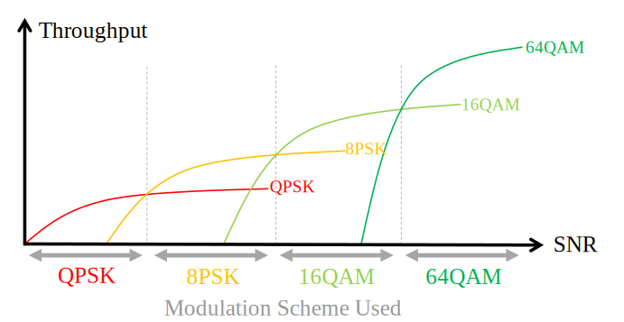
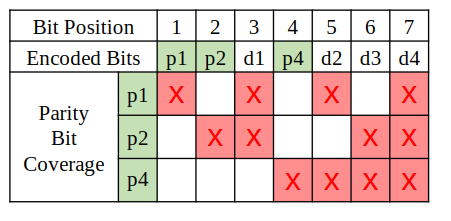
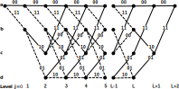
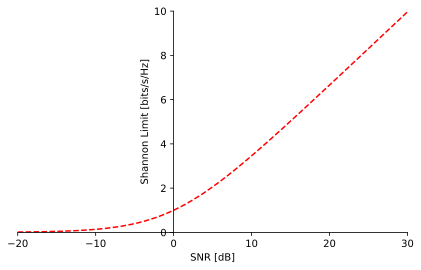

.. _channel-coding-chapter:

#####################
Канальне кодування
#####################

У цьому розділі ми знайомимо вас з основами кодування каналу, також відомого як корекція помилок під час передачі (FEC), межі Шеннона, кодами Хеммінга, Турбо-кодами та LDPC-кодами. Кодування каналу — це величезна галузь бездротових комунікацій та гілка "теорії інформації", яка є вивченням кількісної оцінки, зберігання та передачі інформації.

*************************************
Для чого потрібне канальне кодування
*************************************

Як ми вже дізналися :ref:`noise-chapter` з розділу про шуми, бездротові канали є шумними, і наші цифрові символи не досягнуть приймача в ідеальному стані. Якщо ви проходили курс з мережевих технологій, ви, можливо, вже знаєте про перевірку циклічним надлишком (CRC), яка **виявляє** помилки при прийомі. Мета кодування каналу полягає у виявленні  **і виправлені** помилок у приймачі. Якщо ми дозволимо певний простір для помилки, тоді ми можемо передавати дані за допомогою схеми модуляції вищого порядку, наприклад, не маючи обірваного з'єднання. Як візуальний приклад розгляньте наступні констеляції, які показують QPSK (ліворуч) та 16QAM (праворуч) під однаковим рівнем шуму. QPSK забезпечує 2 біти на символ, тоді як 16QAM має вдвічі більшу швидкість передачі даних при 4 бітах на символ. Але зверніть увагу на те, як у констеляції QPSK символи, як правило, не перетинають межу прийняття символів, або вісі x та y, що означає, що символи будуть прийняті правильно. Тим часом на графіку 16QAM є перекриття кластерів, і, як наслідок, буде багато неправильно прийнятих символів.

.. image:: ../_images/qpsk_vs_16qam.png
   :scale: 90 % 
   :align: center
   :alt: Порівняння шумного QPSK та 16QAM для демонстрації необхідності корекції помилок під час передачі, відомої як кодування каналу
   
Невдалий CRC зазвичай призводить до повторної передачі, принаймні при використанні протоколу, як-от TCP. Якщо Аліса надсилає повідомлення Бобу, ми б воліли, щоб Бобу не доводилося надсилати повідомлення назад Алісі з проханням повторно надіслати інформацію. Метою кодування каналу є передача **надлишкової** інформації. Надлишковість є запобіжником, який зменшує кількість помилкових пакетів, повторних передач або втрачених даних.

Ми обговорили, чому нам потрібне кодування каналу, тому давайте подивимося, де воно застосовується в ланцюжку передачі-прийому:

.. image:: ../_images/tx_rx_chain.svg
   :align: center 
   :target: ../_images/tx_rx_chain.svg
   :alt: Ланцюжок передачі-прийому бездротових комунікацій, який показує обидві сторони передавального пристрою

Зверніть увагу, що в ланцюжку передачі-прийому є декілька етапів кодування. Кодування джерела, наш перший крок, не те саме, що і кодування каналу; кодування джерела призначене для максимального стиснення даних, які потрібно передати, так само, як коли ви архівуєте файли, щоб зменшити займаний ними простір. Тобто вихідний сигнал блоку кодування джерела повинен бути **меншим** , ніж вхідні дані, але вихідний сигнал канального кодування буде більшим за його вхід, оскільки додається надлишковість.

***************************
Типи Кодів
***************************

Для канального кодування ми використовуємо "код корекції помилок". Цей код показує нам, які саме біти ми маємо передавати з урахуванням тих бітів, які нам потрібно передати. Найпростіший код називається "кодуванням повторення", і він полягає в тому, що ви просто повторюєте біт N разів поспіль. Для коду повторення-3 кожен біт передається тричі:

.. role::  raw-html(raw)
    :format: html

- 0 :raw-html:`&rarr;` 000
- 1 :raw-html:`&rarr;` 111

Повідомлення  10010110 передається як 111000000111000111111000 після канального кодування.

Деякі коди працюють з "блоками" вхідних бітів, а інші використовують підхід потоку. Коди, що працюють з блоками, даних певної довжини, називаються "Блоковими кодами", тоді як коди, що працюють з потоком бітів, де довжина даних є довільною, називаються "Конволюційними кодами". Це два основні типи кодів. Наш код повторення-3 є блоковим кодом, де кожен блок складається з трьох бітів.

До речі, ці коди корекції помилок не використовуються виключно в кодуванні каналів для бездротових з'єднань. Коли ви зберігаєте інформацію на жорсткий диск або SSD, вам не доводилося замислюватися, чому при зчитуванні інформації назад ніколи не виникає помилок у бітах? Запис та зчитування з пам'яті подібні до комунікаційної системи. Контролери жорстких дисків/SSD мають вбудовану корекцію помилок. Це непомітно для операційної системи і може бути приватним, оскільки все це вбудовано безпосередньо в жорсткий диск/SSD. Для портативних носіїв, таких як компакт-диски, корекція помилок повинна бути стандартизованою. Коди Ріда-Соломона були поширені в CD-ROM.

***************************
Коефіцієнт Кодування
***************************

Усі методи корекції помилок містять деяку форму надмірності. Це означає, що якщо ми хочемо передати 100 бітів інформації, нам дійсно доведеться відправити **більше ніж**  100 бітів.  "Коефіцієнт кодування" – це співвідношення кількості інформаційних бітів до загальної кількості відправлених бітів (тобто інформаційних плюс надлишкових бітів). Повертаючись до прикладу кодування з трьома повтореннями, якщо у мене є 100 бітів інформації, то ми можемо визначити наступне:

- 300 бітів відправляються
- Тільки 100 бітів представляють інформацію
- Коефіцієнт кодування = 100/300 = 1/3

Коефіцієнт кодування завжди буде меншим за 1, оскільки існує компроміс між надмірністю та пропускною здатністю. Нижчий коефіцієнт кодування означає більше надмірності та менше пропускної здатності.

***************************
Модуляція та Кодування
***************************

У розділі :ref:`modulation-chapter` ми розглядали шум у схемах модуляції. При низькому співвідношенні сигнал/шум (SNR) вам потрібна модуляція нижчого порядку (наприклад, QPSK), щоб впоратися з шумом, а при високому SNR можна використовувати модуляцію, таку як 256QAM, щоб отримати більше бітів за секунду. Канальне кодування працює за аналогічним принципом; ви хочете мати нижчі коефіцієнти кодування при низьких SNR та коефіцієнт кодування майже 1 при високих SNR. Сучасні комунікаційні системи мають набір комбінованих схем модуляції та кодування, які називаються MCS. Кожен MCS визначає схему модуляції та кодування, які повинні використовуватися при певних рівнях SNR.

Сучасні комунікації адаптивно змінюють MCS в реальному часі на основі умов бездротового каналу. Приймач надсилає зворотний зв'язок про якість каналу на передавач. Відгук повинен бути поділений до зміни якості бездротового каналу, що може статися протягом мілісекунд. Цей адаптивний процес призводить до максимально можливої пропускної здатності комунікацій та використовується сучасними технологіями, такими як LTE, 5G та WiFi. Нижче ви можете побачити візуалізацію зміни MCS базовою станцією під час передачі залежно від відстані користувача до станції.

.. image:: ../_images/adaptive_mcs.svg
   :align: center 
   :target: ../_images/adaptive_mcs.svg
   :alt: Схема модуляції та кодування (MCS), візуалізована за допомогою базової станції, де кожне кільце представляє межу схеми MCS, яка працює без помилок

Коли використовується адаптивний MCS, при побудові графіка пропускної здатності від SNR, ви отримуєте графік у формі сходинок, як показано нижче. Протоколи, такі як LTE, часто мають таблицю, яка вказує, який MCS слід використовувати при якому SNR.

***************************
Код Хеммінга
***************************

Давайте розглянемо прості коди корекції помилок. Код Хеммінга був першим незначним кодом, що був розроблений. В кінці 1940-х років Річард Хеммінг працював в лабораторіях Bell, використовуючи електромеханічний комп'ютер, що використовував перфокартки. Коли в машині виявлялися помилки, вона зупинялася, і операторам доводилося їх виправляти. Хеммінг був розчарований необхідністю починати свої програми заново через виявлені помилки. Він сказав: "Чорт візьми, якщо машина може виявити помилку, чому вона не може визначити положення помилки і виправити її?" Наступні кілька років він розробляв код Хеммінга, щоб комп'ютер міг робити саме це.

У кодах Хеммінга додаткові біти, які називаються бітами парності або контрольними бітами, додаються до інформації для забезпечення надлишковості. Всі позиції бітів, які є ступенями двійки, є бітами парності: 1, 2, 4, 8 тощо. Інші позиції бітів призначені для інформації. Таблиця під цим абзацом виділяє біти парності зеленим кольором. Кожен біт парності "покриває" всі біти, де побітове І (AND) парності і позиції біта не є нульовим, що позначено червоним Х нижче. Якщо ми хочемо використовувати біт даних, нам потрібні біти парності, які його покривають. Щоб мати можливість використовувати біт даних d9, нам потрібен біт парності p8 та всі попередні біти парності, отже, ця таблиця підказує нам, скільки бітів парності нам потрібно для певної кількості бітів. Цей шаблон продовжується нескінченно.

.. image:: ../_images/hamming.svg
   :align: center 
   :target: ../_images/hamming.svg
   :alt: Зразок коду Хеммінга, що демонструє, як працює покриття бітами парності.

Коди Хеммінга є блоковими кодами, тому вони працюють з N бітами даних за раз. Таким чином, з трьома бітами парності ми можемо працювати з блоками з чотирьох бітів даних за раз. Цю схему кодування помилок представляємо як Hamming(7,4), де перший аргумент — це загальна кількість переданих бітів, а другий аргумент — це біти даних.

Наступні три важливі властивості кодів Хеммінга:

- Мінімальна кількість змін бітів, необхідних для переходу від одного кодового слова до іншого, становить три
- Вони можуть виправляти однобітові помилки
- Вони можуть виявляти, але не виправляти двобітові помилки

Алгоритмічно процес кодування можна здійснити за допомогою простого множення матриць, використовуючи так звану "матрицю генератора". У наведеному нижче прикладі вектор 1011 є даними, які потрібно закодувати, тобто інформацією, яку ми хочемо надіслати отримувачу. 2D-матриця є матрицею генератора, яка визначає схему коду. Результат множення дає кодове слово для передачі.

.. image:: ../_images/hamming3.png
   :scale: 60 % 
   :align: center
   :alt: Matrix multiplication used to encode bits with a generator matrix, using Hamming codes

Мета занурення в коди Хеммінга полягає в тому, щоб дати уявлення про те, як працює кодування помилок. Блокові коди, як правило, слідують цьому типу схеми. Конволюційні коди працюють інакше, але ми не будемо зараз заглиблюватися в це; вони часто використовують декодування в стилі Трелліса, яке можна зобразити на діаграмі, що виглядає так:

*********************************************************
(М'яке проти жорсткого декодування) Soft vs Hard Decoding 
*********************************************************

Пам'ятайте, що на приймачі демодуляція відбувається перед декодуванням. Демодулятор може повідомити нам своє краще припущення щодо того, який символ був переданий, або він може вивести "м'яке" значення. Наприклад, для BPSK, замість того, щоб говорити нам 1 або 0, демодулятор може сказати 0.3423 або -1.1234, що є "м'яким" значенням символу. Зазвичай декодування розроблене для використання м'яких або жорстких значень.

- **Декодування за м'яким рішенням** – використовує м'які значення
- **Декодування за жорстким рішенням** – використовує лише 1 та 0

М'яке декодування є більш надійним, оскільки ви використовуєте всю доступну інформацію, але м'яке також значно складніше впровадити. Коди Хеммінга, про які ми говорили, використовували жорсткі рішення, тоді як конволюційні коди схильні використовувати м'які.

***************************
Ліміт Шеннона
***************************

Ліміт Шеннона або місткість Шеннона - це неймовірна теорія, яка повідомляє нас, скільки бітів за секунду безпомилкової інформації ми можемо передати:

.. math::
 C = B \cdot log_2 \left( 1 + \frac{S}{N}   \right)

- C – Ємність каналу [біти/сек]
- B – Ширина смуги каналу [Гц]
- S – Середня потужність отриманого сигналу [Вати]
- N – Середня потужність шуму [Вати]

Ця рівняння представляє найкраще, що може зробити будь-яка система модуляції сигналу при достатньо високому значенні SNR для безпомилкової роботи. Логічніше показувати межу в бітах/сек/Гц, тобто бітах на секунду на кількість спектра:

.. math::
 \frac{C}{B} = log_2 \left( 1 + \mathrm{SNR}   \right)

with SNR in linear terms (not dB).  However, when plotting it, we usually represent SNR in dB for convenience:

Якщо ви бачите графіки межі Шеннона десь, що виглядають трохи інакше, то, ймовірно, вони використовують ось "енергія на біт" або :math:E_b/N_0, що є просто альтернативою роботі з SNR.

Може допомогти спростити розуміння, коли SNR досить високий (наприклад, 10 дБ або вище), межа Шеннона може бути наближена як :math:`log_2 \left( \mathrm{SNR} \right)`, що приблизно дорівнює :math:`\mathrm{SNR_{dB}}/3` (`пояснено тут <https://en.wikipedia.org/wiki/Shannon%E2%80%93Hartley_theorem#Bandwidth-limited_case>`_).  Наприклад, при SNR 24 дБ ви отримуєте близько 8 біт/сек/Гц, тож якщо у вас є 1 МГц для використання, це 8 Мбіт/с. Ви можете подумати, що це лише теоретична межа, але сучасні комунікації досить близькі до цієї межі, тому це дає вам приблизне уявлення. Ви завжди можете поділити це число навпіл, щоб врахувати накладні витрати на пакети/кадри і неідеальну MCS.

Максимальна пропускна здатність WiFi 802.11n в діапазоні 2,4 ГГц (яка використовує канали шириною 20 МГц) за специфікаціями становить 300 Мбіт/с. Звичайно, ви можете сидіти поруч з маршрутизатором і отримати дуже високий SNR, можливо, 60 дБ, але для надійності/практичності максимальна пропускна здатність MCS (згадайте криву у вигляді сходинок, описану вище) малоймовірно, що вимагатиме такого високого SNR. Ви можете навіть переглянути список MCS для 802.11n <https://en.wikipedia.org/wiki/IEEE_802.11n-2009#Data_rates>. 802.11n підтримує до 64-QAM, і в поєднанні з кодуванням каналу вимагає SNR близько 25 дБ за цією таблицею <https://d2cpnw0u24fjm4.cloudfront.net/wp-content/uploads/802.11n-and-802.11ac-MCS-SNR-and-RSSI.pdf>. Це означає, що навіть при SNR 60 дБ ваш WiFi все ще буде використовувати 64-QAM. Таким чином, при 25 дБ ліміт Шеннона приблизно становить 8,3 біт/с/Гц, що при 20 МГц спектру дорівнює 166 Мбіт/с. Однак, коли враховується MIMO, що ми розглянемо в майбутньому розділі, ви можете отримати чотири таких потоки, що працюють паралельно, що дасть 664 Мбіт/с. Якщо це число поділити навпіл, ви отримаєте значення, дуже близьке до рекламованої максимальної швидкості 300 Мбіт/с для WiFi 802.11n в діапазоні 2,4 ГГц.

Доведення, що стоїть за межею Шеннона, досить складне; воно включає математику, яка виглядає так:

.. image:: ../_images/shannon_limit_proof.png
   :scale: 70 % 
   :align: center
   :alt: Приклад математики, яка включена в доведення межі Шеннона

Для отримання додаткової інформації дивіться `тут <https://en.wikipedia.org/wiki/Shannon%E2%80%93Hartley_theorem>`_.

***************************
Найсучасніші коди
***************************

Наразі найкращі схеми кодування каналів:

1. Турбо-коди, що використовуються в 3G, 4G, космічних апаратах NASA.
2. LDPC-коди, що використовуються в DVB-S2, WiMAX, IEEE 802.11n.

Обидва ці коди наближаються до межі Шеннона (тобто майже досягають її при певних SNR). Коди Хеммінга та інші простіші коди не наближаються до межі Шеннона. З точки зору досліджень, залишилося небагато можливостей для покращення самих кодів. Поточні дослідження більше зосереджені на підвищенні обчислювальної ефективності декодування та адаптації до зворотного зв'язку по каналу.

Коди з низькою щільністю перевірки парності (LDPC) є класом високоефективних лінійних блокових кодів. Вони були вперше представлені Робертом Г. Галлаґером у його докторській дисертації в 1960 році в MIT. Через обчислювальну складність їх реалізації, вони були ігноровані до 1990-х років! На момент написання цього тексту (2020) він ще живий, йому 89 років, і він отримав багато нагород за свою роботу (десятиліття після того, як він її виконав). LDPC не патентовані і тому вільні для використання (на відміну від турбо-кодів), що пояснює, чому вони використовувалися в багатьох відкритих протоколах.

Турбо-коди базуються на конволюційних кодах. Це клас кодів, який поєднує два або більше простіших конволюційних кодів та перемежувач. Основна патентна заявка на турбо-коди була подана 23 квітня 1991 року. Винахідники були французами, тому коли Qualcomm хотіла використовувати турбо-коди в CDMA для 3G, їм довелося створити платіжну патентну ліцензійну угоду з France Telecom. Основний патент закінчився 29 серпня 2013 року.
