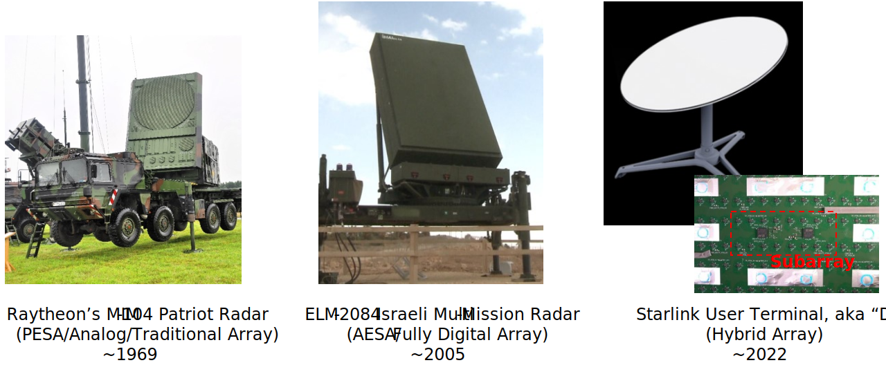
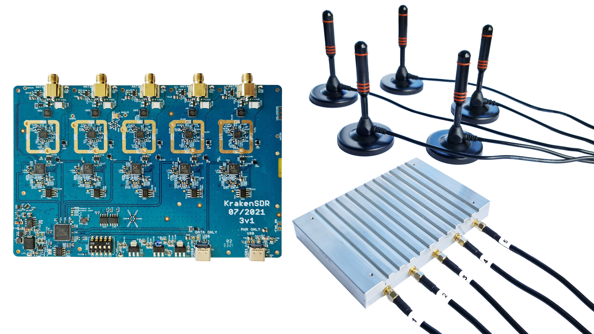
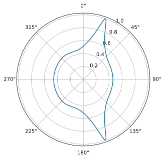
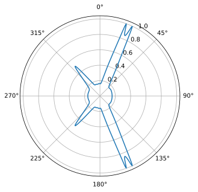
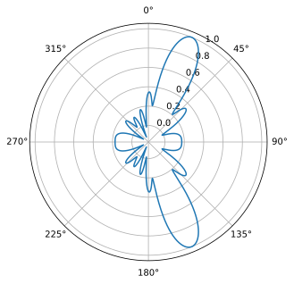
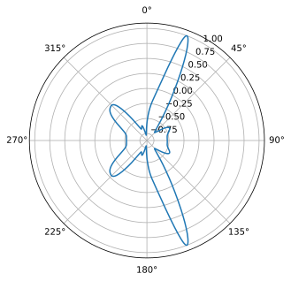
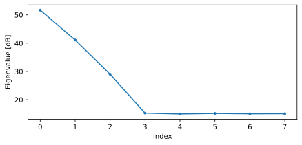
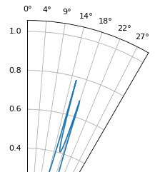

.. _doa-chapter:

####################################
DOA & Beamforming
####################################

У цій главі ми розглядаємо поняття формування променя, напрямку прильоту (DOA) і фазованих масивів загалом.  Обговорюються такі методи, як Capon і MUSIC, з використанням прикладів моделювання на Python. Ми порівнюємо формування променя з DOA і розглядаємо два різні типи фазованих решіток (пасивні решітки з електронним скануванням або PESA та активні решітки з електронним скануванням або AESA).

************************
Огляд та термінологія
************************

Фазована решітка, також відома як решітка з електронним керуванням, - це сукупність антен, які можуть використовуватися на стороні передачі або прийому для формування променів в одному або декількох бажаних напрямках.  Вони використовуються як у зв'язку, так і в радіолокації, і ви знайдете їх на землі, в повітрі та на супутниках.  

Фазовані антенні решітки можна розділити на три типи:

1. **Пасивні електронно-скановані решітки (PESA)**, також відомі як аналогові або традиційні фазовані решітки, в яких для керування променем використовуються аналогові фазообертачі.  На стороні прийому всі елементи підсумовуються після фазового зсуву (і, опціонально, регульованого посилення) і перетворюються в канал сигналу, який перетворюється вниз і приймається.  На стороні передачі відбувається зворотний процес: з цифрової сторони виводиться один цифровий сигнал, а на аналоговій стороні використовуються фазообертачі і каскади посилення для отримання вихідного сигналу, що йде на кожну антену.  Ці цифрові фазообертачі мають обмежену кількість бітів роздільної здатності та затримку керування.
2. **Активні електронно-скановані решітки (AESA)**, також відомі як повністю цифрові решітки, де кожен елемент має власний радіочастотний фронт, а формування діаграми спрямованості здійснюється повністю в цифровій області.  Це найдорожчий підхід, оскільки радіочастотні компоненти є дорогими, але він забезпечує набагато більшу гнучкість і швидкість, ніж PESA.  Цифрові решітки популярні серед SDR, хоча кількість каналів прийому або передачі SDR обмежує кількість елементів у вашому масиві.
3. **Гібридний масив**, який складається з підмасивів, які індивідуально нагадують PESA, де кожен підмасив має власний радіочастотний фронт, так само, як і в AESA.  Це найпоширеніший підхід для сучасних фазованих решіток, оскільки він забезпечує найкраще з обох світів.

Приклад кожного з типів наведено нижче.

нал користувача Starlink, також відомий як Dishy

У цій главі ми зосередимося на ЦОС для повністю цифрових решіток, оскільки вони більше підходять для моделювання і ЦОС, але в наступній главі ми попрацюємо з решіткою "Phaser" і SDR від Analog Devices, яка має 8 аналогових фазообертачів, що живлять "Плутон".

Зазвичай ми називаємо антени, з яких складається решітка, елементами, а іноді решітку називають "сенсором".  Ці елементи решітки найчастіше є всеспрямованими антенами, однаково віддаленими одна від одної як по лінії, так і в двох вимірах. 

Формувач променя - це, по суті, просторовий фільтр; він відфільтровує сигнали з усіх напрямків, окрім потрібного напрямку (напрямків).  Замість відводів ми використовуємо ваги (так звані коефіцієнти), що застосовуються до кожного елемента масиву.  Потім ми маніпулюємо вагами, щоб сформувати промінь (промені) масиву, звідси і назва - формування променя!  Ми можемо керувати цими променями (і нулями) надзвичайно швидко; швидше, ніж антенами з механічним шарнірним кріпленням, які можна розглядати як альтернативу фазованим решіткам.  Одна решітка може електронно відстежувати кілька сигналів одночасно, одночасно пригнічуючи перешкоди, якщо вона має достатньо елементів.  Зазвичай ми обговорюємо формування променя в контексті лінії зв'язку, де приймач має на меті отримати один або кілька сигналів з якомога вищим SNR. 

Підходи до формування променя зазвичай поділяють на традиційні та адаптивні.  При звичайному формуванні променя ви припускаєте, що вже знаєте напрямок приходу сигналу, який вас цікавить, і формувач променя підбирає ваги, щоб максимізувати посилення в цьому напрямку.  Це може бути використано на стороні прийому або передачі системи зв'язку.  Адаптивне формування променя, з іншого боку, передбачає постійне коригування вагових коефіцієнтів на основі вихідного сигналу формувача променя для оптимізації деяких критеріїв, часто з метою зведення до нуля перешкод.  Через замкнутий цикл і адаптивну природу адаптивне формування променя, як правило, використовується тільки на стороні прийому.  

Напрямок приходу (Direction-of-Arrival, DOA) в DSP/SDR відноситься до процесу використання масиву антен для оцінки DOA одного або декількох сигналів, отриманих цим масивом (на відміну від традиційного формування променя, де ми намагаємося отримати сигнал і, можливо, відкинути перешкоди).  Хоча DOA, безумовно, підпадає під парасольку формування променя, тому терміни можуть бути заплутані, просто знайте, що термін DOA буде використовуватися, якщо метою є знаходження кутів приходу одного або декількох сигналів, на відміну від формування променя, яке використовується як просторовий фільтр для виділення і прийому одного або декількох сигналів для демодуляції або іншої обробки.  Деякі методи, такі як MVDR, застосовуються як для DOA, так і для формування променя, тоді як інші, такі як MUSIC, призначені виключно для DOA.

Фазовані решітки і формування променя/DOA знаходять застосування у всіх видах застосувань, хоча найчастіше ви побачите їх у різних формах радарів, зв'язку mmWave в рамках 5G, супутниковому зв'язку і придушенні перешкод.  Будь-які додатки, які потребують антени з високим коефіцієнтом підсилення або швидко рухомої антени з високим коефіцієнтом підсилення, є хорошими кандидатами на використання фазованих решіток.

*******************
Вимоги до SDR
*******************

Як уже зазначалося, аналогові фазовані решітки включають аналоговий фазообертач (і, як правило, регульований коефіцієнт підсилення) на канал, тобто аналогова фазована решітка - це спеціальне обладнання, яке повинно йти разом з SDR.  З іншого боку, будь-яка SDR, що містить більше одного каналу, може використовуватися як цифрова решітка без додаткового обладнання, якщо канали фазово когерентні і дискретизуються з використанням одного і того ж тактового генератора, що, як правило, має місце для SDR, які мають кілька каналів прийому на борту.  Існує багато SDR, які містять **два** канали прийому, наприклад, Ettus USRP B210 і Analog Devices Pluto (2-й канал виводиться за допомогою роз'єму uFL на самій платі).  На жаль, вихід за межі двох каналів передбачає вихід у сегмент SDR вартістю понад $10 тис., принаймні з 2023 року, як, наприклад, USRP N310.  Основна проблема полягає в тому, що недорогі SDR, як правило, не можуть бути "зчеплені" разом для масштабування кількості каналів.  Винятком є KerberosSDR (4 канали) і KrakenSDR (5 каналів), які використовують декілька RTL-SDR, що мають спільний LO для формування недорогого цифрового масиву; недоліком є дуже обмежена частота дискретизації (до 2,56 МГц) і діапазон налаштування (до 1766 МГц).  Плата KrakenSDR і приклад конфігурації антени показані нижче.

У цій главі ми не використовуємо жодних конкретних SDR; натомість ми моделюємо прийом сигналів за допомогою Python, а потім розглядаємо DSP, який використовується для виконання променевого формування/DOA для числових масивів.

***************************
Математичний аналіз масивів
***************************

Щоб перейти до найцікавішого, нам доведеться трохи розібратися з математикою, але наступний розділ написаний таким чином, щоб математика була надзвичайно простою і супроводжувалася діаграмами, використовуючи лише найпростіші тригонометричні та експоненціальні властивості.  Важливо розуміти базову математику, яка лежить в основі того, що ми будемо робити в Python для виконання DOA.

Розглянемо одновимірний триелементний рівномірно розподілений масив:

.. image:: ../_images/doa.svg
   :align: center 
   :target: ../_images/doa.svg
      :alt: Діаграма, що показує напрямок приходу (DOA) сигналу, який падає на рівномірно розташовану антенну решітку, із зазначенням кута нахилу та відстані між елементами або діафрагмами

У цьому прикладі сигнал надходить з правого боку, тому першим він потрапляє на крайній правий елемент.  Давайте обчислимо затримку між моментом, коли сигнал потрапляє на цей перший елемент, і моментом, коли він досягає наступного елемента.  Ми можемо зробити це, сформувавши наступну тригонометричну задачу, спробуйте візуалізувати, як цей трикутник був сформований з наведеної вище діаграми.  Відрізок, виділений червоним кольором, показує відстань, яку повинен пройти сигнал *після* того, як він досягне першого елемента, перш ніж потрапить на наступний.

.. image:: ../_images/doa_trig.svg
   :align: center 
   :target: ../_images/doa_trig.svg
    :alt: Триг, пов'язаний з напрямком прибуття (DOA) рівномірно розташованого масиву

Якщо ви пам'ятаєте SOH CAH TOA, в даному випадку нас цікавить "прилегла" сторона і у нас є довжина гіпотенузи (:math:`d`), тому нам потрібно використовувати косинус:

.. math::
  \cos(90 - \theta) = \frac{\mathrm{adjacent}}{\mathrm{hypotenuse}}

Ми повинні знайти суміжність, оскільки саме вона покаже нам, яку відстань повинен пройти сигнал між потраплянням на перший і другий елемент, щоб він став суміжним :math:`= d \cos(90 - \theta)`.  Тепер існує тригонометрична тотожність, яка дозволяє нам перетворити це в сусідній :math:`= d \sin(\theta)`.  Однак це лише відстань, нам потрібно перетворити її на час, використовуючи швидкість світла: час, що минув :math:`= d \sin(\theta) / c` [секунди].  Це рівняння застосовується між будь-якими сусідніми елементами нашого масиву, хоча ми можемо помножити все це на ціле число для обчислення між несуміжними елементами, оскільки вони розташовані рівномірно (ми зробимо це пізніше).  

Тепер пов'яжемо цю математику тригонометрії та швидкості світла зі світом обробки сигналів.  Позначимо наш передавальний сигнал у базовій смузі :math:`s(t)` і він передається на деякій несучій, :math:`f_c`, тому передавальний сигнал має вигляд :math:`s(t) e^{2j \pi f_c t}`.  Скажімо, цей сигнал потрапляє на перший елемент у момент часу :math:`t = 0`, що означає, що він потрапляє на наступний елемент через :math:`d \sin(\theta) / c` [секунд], як ми обчислили вище.  Це означає, що 2-й елемент отримує:

.. math::
 s(t - \Delta t) e^{2j \pi f_c (t - \Delta t)}

.. math::
 \mathrm{where} \quad \Delta t = d \sin(\theta) / c

Нагадаємо, що коли у вас є часовий зсув, він віднімається від часового аргументу.

Коли приймач або SDR виконує процес пониження частоти для прийому сигналу, він по суті множить його на несучу, але у зворотному напрямку, тому після виконання пониження частоти приймач бачить:

.. math::
 s(t - \Delta t) e^{2j \pi f_c (t - \Delta t)} e^{-2j \pi f_c t}

.. math::
 = s(t - \Delta t) e^{-2j \pi f_c \Delta t}

Тепер ми можемо зробити невеликий трюк, щоб спростити це ще більше; розглянемо, як, коли ми робимо вибірку сигналу, його можна змоделювати, замінивши :math:`t` на :math:`nT`, де :math:`T` - період вибірки, а :math:`n` - це просто 0, 1, 2, 3...  Підставивши це, отримаємо :math:`s(nT - \Delta t) e^{-2j \pi f_c \Delta t}`. Що ж, :math:`nT` настільки більше за :math:`\Delta t`, що ми можемо позбутися першого доданка :math:`\Delta t` і залишимось з :math:`s(nT) e^{-2j \pi f_c \Delta t}`.  Якщо частота дискретизації коли-небудь стане достатньо швидкою, щоб наблизитися до швидкості світла на крихітній відстані, ми можемо повернутися до цього питання, але пам'ятайте, що наша частота дискретизації повинна бути лише трохи більшою за пропускну здатність сигналу, який нас цікавить.

Давайте продовжимо з цією математикою, але почнемо представляти речі в дискретних термінах, щоб це краще нагадувало наш код на Python.  Останнє рівняння можна представити наступним чином, давайте знову вставимо :math:`\Delta t`:

.. math::
 s[n] e^{-2j \pi f_c \Delta t}

.. math::
 = s[n] e^{-2j \pi f_c d \sin(\theta) / c}

Ми майже закінчили, але, на щастя, є ще одне спрощення, яке ми можемо зробити.  Згадайте співвідношення між центральною частотою і довжиною хвилі: :math:`\lambda = \frac{c}{f_c}` або форму, яку ми будемо використовувати: :math:`f_c = \frac{c}{\lambda}`.  Підставивши це, отримаємо:

.. math::
 s[n] e^{-2j \pi \frac{c}{\lambda} d \sin(\theta) / c}

.. math::
 = s[n] e^{-2j \pi d \sin(\theta) / \lambda}

У DOA нам подобається представляти :math:`d`, відстань між сусідніми елементами, як частку довжини хвилі (замість метрів), найпоширенішим значенням для :math:`d` під час проектування масиву є використання половини довжини хвилі. Незалежно від того, що таке :math:`d`, з цього моменту ми будемо представляти :math:`d` як частку довжини хвилі замість метрів, що спрощує рівняння і весь наш код:

.. math::
 s[n] e^{-2j \pi d \sin(\theta)}

Це для сусідніх елементів, для :math:`k`'-го елемента нам просто потрібно помножити :math:`d` на :math:`k`:

.. math::
 s[n] e^{-2j \pi d k \sin(\theta)}

І все готово! Це рівняння, наведене вище, є тим, що ви побачите у статтях DOA та повсюдних реалізаціях! Зазвичай ми називаємо цей експоненціальний член "коефіцієнтом масиву" (часто позначається як :math:`a`) і представляємо його як масив, одновимірний масив для одновимірної антенної решітки тощо.  У python :math:`a` це:

.. code-block:: python

 a = [np.exp(-2j*np.pi*d*0*np.sin(theta)), np.exp(-2j*np.pi*d*1*np.sin(theta)), np.exp(-2j*np.pi*d*2*np.sin(theta)), ...] # зверніть увагу на зростаюче k
 # або
 a = np.exp(-2j * np.pi * d * np.arange(Nr) * np.sin(theta)) # де Nr - кількість елементів приймальної антени

Зверніть увагу, що елемент 0 дає 1+0j (тому що :math:`e^{0}=1`); це має сенс, оскільки все вище було відносно цього першого елемента, тому він приймає сигнал як є, без будь-яких відносних фазових зсувів.  Це чисто математично, насправді будь-який елемент можна вважати еталонним, але, як ви побачите в нашому математичному коді пізніше, важлива різниця у фазі/амплітуді, отримана між елементами.  Це все відносно.

*******************
Отримання сигналу
*******************

Давайте використаємо концепцію коефіцієнта масиву для моделювання сигналу, що надходить на масив.  Для передавання сигналу ми поки що будемо використовувати просто тон:

.. code-block:: python

 import numpy as np
 import matplotlib.pyplot as plt
 
 sample_rate = 1e6
 N = 10000 # кількість семплів для симуляції
 
 # створюємо тон, який буде виступати в якості сигналу передавача
 t = np.arange(N)/sample_rate # вектор часу
 f_tone = 0.02e6
 tx = np.exp(2j * np.pi * f_tone * t)

Тепер змоделюємо антенну решітку, що складається з трьох всеспрямованих антен, розташованих в лінію, з відстанню між сусідніми антенами в 1/2 довжини хвилі (так званий "інтервал у півхвилі").  Ми змоделюємо сигнал передавача, що приходить на цю решітку під певним кутом, тета.  Розуміння коефіцієнта решітки :code:`a`, наведеного нижче, є причиною того, що ми пройшли через усю цю математику вище.

.. code-block:: python

 d = 0.5 # половина довжини хвилі
 Nr = 3
 theta_degrees = 20 # напрямок приходу (не соромтеся змінювати це значення, воно довільне)
 theta = theta_degrees / 180 * np.pi # перевести в радіани
 a = np.exp(-2j * np.pi * d * np.arange(Nr) * np.sin(theta)) # коефіцієнт масиву
 print(a) # зверніть увагу, що це масив 1х3, він комплексний і перший елемент 1+0j

Щоб застосувати коефіцієнт масиву, нам потрібно виконати матричне множення :code:`a` і :code:`tx`, тому спочатку перетворимо їх у матриці, як масиви NumPy, які не дозволяють нам виконувати одномірні матричні обчислення, які нам потрібні для формування променя/DOA.  Потім ми виконаємо матричне множення, зауважте, що символ @ у Python означає матричне множення (це фішка NumPy).  Ми також повинні перетворити :code:`a` з вектора-рядка у вектор-стовпець (уявіть, що він повертається на 90 градусів) так, щоб внутрішні розміри матричного множення збігалися.

.. code-block:: python

 a = np.asmatrix(a)
 tx = np.asmatrix(tx)

 r = a.T @ tx # не звертайте уваги на транспонування a, головне, що ми множимо коефіцієнт масиву на сигнал tx
 print(r.shape) # тепер r буде двовимірним масивом, 1D - час і 1D - просторовий вимір

Наразі :code:`r` є двовимірним масивом, розміром 3 x 10000, оскільки у нас є три елементи масиву і змодельовано 10000 відліків.  Ми можемо витягнути кожен окремий сигнал і побудувати графік перших 200 відліків, нижче ми покажемо лише дійсну частину, але є ще й уявна частина, як і у будь-якого сигналу базової смуги.  Однією з неприємних особливостей Python є необхідність перемикання на матричний тип для матричної математики, а потім повернення до звичайних масивів NumPy, тому нам потрібно додати .squeeze(), щоб повернути його до звичайного 1D масиву NumPy.

.. code-block:: python

 plt.plot(np.asarray(r[0,:]).squeeze().real[0:200]) # asarray і squeeze - це просто прикрість, яку нам доводиться робити, тому що ми прийшли з матриці
 plt.plot(np.asarray(r[1,:]).squeeze().real[0:200])
 plt.plot(np.asarray(r[2,:]).squeeze().real[0:200])
 plt.show()

.. image:: ../_images/doa_time_domain.svg
   :align: center 
   :target: ../_images/doa_time_domain.svg

Зверніть увагу на фазові зсуви між елементами, як ми і очікували (за винятком випадків, коли сигнал надходить на пряму видимість, коли він досягає всіх елементів одночасно і зсуву не буде, встановіть тета на 0, щоб побачити це).  Елемент 0 прибуває першим, а інші дещо затримуються.  Спробуйте змінити кут і подивіться, що станеться.

Єдине, що ми ще не зробили - додамо шум до отриманого сигналу.  AWGN з фазовим зсувом - це все ще AWGN, і ми хочемо застосувати шум після застосування коефіцієнта масиву, тому що кожен елемент відчуває незалежний шумовий сигнал.  

.. code-block:: python

 n = np.random.randn(Nr, N) + 1j*np.random.randn(Nr, N)
 r = r + 0.1*n # r та n рівні 3x10000

.. image:: ../_images/doa_time_domain_with_noise.svg
   :align: center 
   :target: ../_images/doa_time_domain_with_noise.svg

*******************
Базовий DOA
*******************

Досі ми симулювали прийом сигналу під певним кутом падіння.  У вашій типовій задачі DOA вам надаються зразки, і ви повинні оцінити кут приходу сигналу(ів).  Існують також проблеми, коли ви отримуєте кілька сигналів з різних напрямків, і один з них є сигналом інтересу (SOI), а інші можуть бути завадами або перешкодами, які вам потрібно обнулити, щоб виділити SOI з якомога вищим SNR.

Далі використаємо цей сигнал :code:`r`, але уявімо, що ми не знаємо, з якого напрямку приходить сигнал, спробуємо з'ясувати це за допомогою DSP і деякого коду на Python!  Почнемо зі "звичайного" підходу до формування променя, який передбачає сканування (вибірку) всіх напрямків приходу від -pi до +pi (від -180 до +180 градусів).  У кожному напрямку ми спрямовуємо масив у бік цього кута, застосовуючи ваги, пов'язані зі спрямуванням у цьому напрямку; застосування ваг дасть нам одномірний масив відліків, як якщо б ми отримували його за допомогою 1 спрямованої антени.  Ви, мабуть, починаєте розуміти, звідки з'явився термін "електрично керована решітка".  Цей звичайний метод формування променя передбачає обчислення середнього квадрата величини, як якщо б ми створювали енергетичний детектор.  Ми застосуємо ваги для формування променя і зробимо цей розрахунок під безліччю різних кутів, щоб перевірити, який кут дає нам максимальну енергію.

.. code-block :: python

 theta_scan = np.linspace(-1*np.pi, np.pi, 1000) # 1000 різних тет від -180 до +180 градусів
 results = []
 для theta_i в theta_scan:
     #print(theta_i)
     w = np.asmatrix(np.exp(-2j * np.pi * d * np.arange(Nr) * np.sin(theta_i)) # знайоме?
     r_weighted = np.conj(w) @ r # застосовуємо наші ваги, що відповідають напрямку theta_i
     r_weighted = np.asarray(r_weighted).squeeze() # повертаємо до нормального 1d масиву
     results.append(np.mean(np.abs(r_weighted)**2)) # детектор енергії

  # виводимо кут, який дав нам максимальне значення
 print(theta_scan[np.argmax(results)] * 180 / np.pi) # 19.99999999999998
 
 plt.plot(theta_scan*180/np.pi, results) # виводить кут у градусах
 plt.xlabel("Тета [градуси]")
 plt.ylabel("Метрика DOA")
 plt.grid()
 plt.show()

.. image:: ../_images/doa_conventional_beamformer.svg
   :align: center 
   :target: ../_images/doa_conventional_beamformer.svg

Ми знайшли наш сигнал!  Спробуйте збільшити кількість шуму, щоб довести його до межі, можливо, вам доведеться імітувати отримання більшої кількості відліків для низького SNR.  Також спробуйте змінити напрямок приходу.

Якщо ви віддаєте перевагу куту огляду на полярній ділянці, використовуйте наступний код:

.. code-block:: python

 fig, ax = plt.subplots(subplot_kw={'проекція': 'полярна'})
 ax.plot(theta_scan, results) # ПЕРЕКОНАЙТЕСЯ, ЩО ВИКОРИСТОВУЄМО RADIAN ДЛЯ POLAR
 ax.set_theta_zero_location('N') # робимо 0 градусів спрямованими вгору
 ax.set_theta_direction(-1) # збільшити за годинниковою стрілкою
 ax.set_rgrids([0,2,4,6,8]) 
 ax.set_rlabel_position(22.5) # відсунути мітки сітки від інших міток
 plt.show()

.. image:: ../_images/doa_conventional_beamformer_polar.svg
   :align: center 
   :target: ../_images/doa_conventional_beamformer_polar.svg
   :alt: Приклад полярної діаграми напрямку приходу (DOA), що показує діаграму спрямованості променя та неоднозначність на 180 градусів

******************************
Неоднозначність 180 градусів
******************************

Поговоримо про те, чому є другий пік на 160 градусах; ДН, яку ми змоделювали, становила 20 градусів, але це не випадково, що 180 - 20 = 160.  Уявіть собі три всеспрямовані антени в лінію, розміщені на столі.  Вісь антени розташована під кутом 90 градусів до осі решітки, як показано на першій діаграмі в цій главі.  Тепер уявіть собі передавач перед антенами, також на (дуже великому) столі, так, щоб його сигнал надходив під кутом +20 градусів від візування.  Що ж, решітка бачить той самий ефект, незалежно від того, чи надходить сигнал спереду або ззаду, фазова затримка однакова, як показано нижче: елементи решітки позначені червоним кольором, а два можливих DOA передавача - зеленим.  Тому, коли ми виконуємо алгоритм DOA, завжди буде існувати неоднозначність на 180 градусів, і єдиний спосіб обійти її - це мати 2D масив або другий 1D масив, розташований під будь-яким іншим кутом по відношенню до першого масиву.  Ви можете запитати, чи означає це, що ми можемо обчислювати тільки від -90 до +90 градусів, щоб заощадити обчислювальні цикли, і ви будете праві!

.. image:: ../_images/doa_from_behind.svg
   :align: center 
   :target: ../_images/doa_from_behind.svg

***********************
Зворотний бік масиву
***********************

Щоб продемонструвати наступну концепцію, давайте спробуємо змінити кут прильоту (AoA) від -90 до +90 градусів замість того, щоб залишити його постійним на рівні 20:

.. image:: ../_images/doa_sweeping_angle_animation.gif
   :scale: 100 %
   :align: center
  :alt: Анімація напрямку прибуття (DOA), що показує широку сторону масиву

Коли ми наближаємося до широкої сторони антенної решітки (так званий "кінець вогню"), тобто коли сигнал надходить на вісь решітки або поблизу неї, продуктивність падає.  Ми бачимо два основних погіршення: 1) головна пелюстка стає ширшою і 2) ми отримуємо неоднозначність і не знаємо, звідки надходить сигнал - зліва чи справа.  Ця неоднозначність додається до неоднозначності на 180 градусів, про яку ми говорили раніше, коли ми отримуємо додаткову пелюстку на 180 - тета, що призводить до того, що певні АП призводять до трьох пелюсток приблизно однакового розміру.  Ця широка неоднозначність має сенс, оскільки фазові зсуви, які відбуваються між елементами, ідентичні, незалежно від того, чи сигнал надходить з лівого або правого боку відносно осі решітки.  Як і у випадку з 180-градусною неоднозначністю, рішення полягає у використанні двовимірної решітки або двох одновимірних решіток під різними кутами.  Загалом, формування променя найкраще працює, коли кут ближчий до кута нахилу.

************************
Коли d не дорівнює λ/2
************************

Досі ми використовували відстань між елементами d, що дорівнює половині довжини хвилі.  Так, наприклад, решітка, призначена для 2,4 ГГц WiFi з відстанню λ/2, матиме відстань 3e8/2.4e9/2 = 12,5 см або близько 5 дюймів, що означає, що решітка з 4х4 елементів матиме розмір приблизно 15" x 15" x висоту антен.  Бувають випадки, коли масив не може забезпечити точну відстань λ/2, наприклад, коли простір обмежений, або коли один і той же масив повинен працювати на різних несучих частотах.

Дослідимо, коли інтервал більший за λ/2, тобто занадто великий, змінюючи d між λ/2 та 4λ.  Ми видалимо нижню половину полярного графіка, оскільки вона є дзеркальним відображенням верхньої.

.. image:: ../_images/doa_d_is_large_animation.gif
   :scale: 100 %
   :align: center
   :alt: Анімація напрямку приходу (DOA), яка показує, що відбувається, коли відстань d набагато більша за півхвилі

Як бачите, на додаток до неоднозначності на 180 градусів, яку ми обговорювали раніше, тепер ми маємо додаткову неоднозначність, і вона погіршується зі збільшенням d (утворюються зайві/неправильні пелюстки).  Ці додаткові пелюстки відомі як пелюстки решітки, і вони є результатом "просторового аліасингу".  Як ми дізналися з розділу :ref:`sampling-chapter`, коли ми робимо вибірку недостатньо швидко, ми отримуємо аліасинг.  Те ж саме відбувається і в просторовій області; якщо наші елементи не розташовані достатньо близько один до одного відносно несучої частоти сигналу, що спостерігається, ми отримуємо сміттєві результати в нашому аналізі.  Ви можете думати про відстань між антенами як про простір дискретизації!  У цьому прикладі ми бачимо, що пелюстки решітки не стають надто проблематичними, поки d > λ, але вони з'являються, як тільки ви перевищуєте відстань λ/2.

А що відбувається, коли d менше λ/2, наприклад, коли нам потрібно розмістити решітку в невеликому просторі?  Повторимо ту саму симуляцію:

.. image:: ../_images/doa_d_is_small_animation.gif
   :scale: 100 %
   :align: center
   :alt: Анімація напрямку приходу (DOA), яка показує, що відбувається, коли відстань d набагато менша за півхвилі

Хоча головна пелюстка стає ширшою зі зменшенням d, вона все ще має максимум при 20 градусах, і немає гратчастих пелюсток, тому теоретично це все ще має працювати (принаймні, при високому SNR).  Щоб краще зрозуміти, що відбувається, коли d стає занадто малим, повторимо експеримент, але з додатковим сигналом, що надходить з кута -40 градусів:

.. image:: ../_images/doa_d_is_small_animation2.gif
   :scale: 100 %
   :align: center
   :alt: Анімація напрямку приходу (DOA), яка показує, що відбувається, коли відстань d набагато менша за півхвилі і присутні два сигнали

Як тільки відстань стає меншою за λ/4, неможливо розрізнити два різні шляхи, і решітка працює погано.  Як ми побачимо далі в цій главі, існують методи формування променя, які забезпечують точніші промені, ніж звичайне формування променя, але утримання d якомога ближче до λ/2 залишатиметься актуальною темою.

*******************
Антени
*******************

Скоро буде!

* загальні типи антен, що використовуються для антенних решіток (наприклад, патч, монополь)

*******************
Кількість елементів
*******************

Скоро буде!

****************************************
Променеутворювач Capon's Beamformer
****************************************

У базовому прикладі DOA ми пройшлися по всіх кутах, помноживши :code:`r` на ваги :code:`w`, застосувавши до отриманого 1D масиву детектор енергії.  У цьому прикладі :code:`w` дорівнював коефіцієнту масиву, :code:`a`, тому ми просто множили :code:`r` на :code:`a`.  Тепер ми розглянемо формувач променя, який є дещо складнішим, але має тенденцію працювати набагато краще, який називається формувачем променя Капона, також відомим як формувач променя з мінімальною дисперсією без спотворень (MVDR).  Цей формувач променя можна узагальнити в наступному рівнянні:

.. math::
 \hat{\theta} = \mathrm{argmax}\left(\frac{1}{a^H R^{-1} a}\right)

де :math:`R` - коваріаційна матриця вибірки, обчислена множенням r на комплексне спряжене перенесення самої себе, :math:`R` = r r^H`, і результатом буде матриця розміром :code:`Nr` x :code:`Nr` (3x3 у прикладах, які ми розглядали до цього часу).  Ця коваріаційна матриця показує нам, наскільки подібні вибірки, отримані з трьох елементів, хоча для використання методу Кейпона нам не обов'язково повністю розуміти, як це працює.  У підручниках та інших джерелах ви можете побачити рівняння Кейпона з деякими членами в чисельнику; вони призначені виключно для масштабування/нормалізації і не змінюють результати.

Ми можемо досить легко реалізувати наведені вище рівняння на Python:

.. code-block:: python

 theta_scan = np.linspace(-1*np.pi, np.pi, 1000) # між -180 та +180 градусами
 results = []
 для theta_i у theta_scan:
     a = np.asmatrix(np.exp(-2j * np.pi * d * np.arange(Nr) * np.sin(theta_i)) # множник масиву
     a = a.T # має бути вектором-стовпчиком для математики нижче
 
     # Обчислити коваріаційну матрицю
     R = r @ r.H # повертає коваріаційну матрицю вибірок Nr x Nr
 
     Rinv = np.linalg.pinv(R) # псевдоінверсія має тенденцію працювати краще, ніж справжня інверсія
 
     metric = 1/(a.H @ Rinv @ a) # Метод Капона!
     metric = metric[0,0] # перетворюємо матрицю 1х1 у скаляр Python, хоча це все ще складно
     metric = np.abs(metric) # взяти величину
     metric = 10*np.log10(metric) # конвертуємо в дБ, щоб легше було бачити малі та великі пелюстки одночасно
     results.append(metric)
 
 results /= np.max(results) # нормалізуємо

При застосуванні до попереднього прикладу коду DOA ми отримаємо наступне:

Працює чудово, але щоб дійсно порівняти його з іншими методами, нам доведеться створити цікавішу задачу.  Давайте створимо симуляцію з 8-елементною решіткою, яка приймає три сигнали під різними кутами: 20, 25 і 40 градусів, причому сигнал під кутом 40 градусів приймається зі значно меншою потужністю, ніж два інших.  Нашою метою буде виявити всі три сигнали.  Код для генерації цього нового сценарію виглядає наступним чином:

.. code-block:: python

 Nr = 8 # 8 елементів
 theta1 = 20 / 180 * np.pi # перевести в радіани
 theta2 = 25 / 180 * np.pi
 theta3 = -40 / 180 * np.pi
 a1 = np.asmatrix(np.exp(-2j * np.pi * d * np.arange(Nr) * np.sin(theta1))
 a2 = np.asmatrix(np.exp(-2j * np.pi * d * np.arange(Nr) * np.sin(theta2))
 a3 = np.asmatrix(np.exp(-2j * np.pi * d * np.arange(Nr) * np.sin(theta3))
 # використовуємо 3 різні частоти
 r = a1.T @ np.asmatrix(np.exp(2j*np.pi*0.01e6*t)) + \
     a2.T @ np.asmatrix(np.exp(2j*np.pi*0.02e6*t)) + \
     0.1 * a3.T @ np.asmatrix(np.exp(2j*np.pi*0.03e6*t))
 n = np.random.randn(Nr, N) + 1j*np.random.randn(Nr, N)
 r = r + 0.04*n

І якщо ми запустимо наш формувач променя Capon's beamformer за цим новим сценарієм, то отримаємо наступні результати:

Він працює досить добре, ми бачимо два сигнали, отримані з різницею лише в 5 градусів, а також бачимо 3-й сигнал (при -40 або 320 градусах), який був отриманий на одну десяту потужності від інших.   Тепер запустимо простий формувач променя, який є просто детектором енергії, на цьому новому сценарії:

Хоча це може бути гарна фігура, вона зовсім не знаходить всі три сигнали...  Порівнюючи ці два результати, ми бачимо переваги використання складнішого формувача променя.  Існує набагато більше формувачів променя, але далі ми зануримося в інший клас формувачів променя, які використовують метод "підпростору", який часто називають адаптивним формуванням променя.  

******************
MUSIC
******************

Тепер ми перемкнемось і поговоримо про інший тип формувача променя. Всі попередні підпадали під категорію "затримка і сума", але зараз ми зануримося в "підпросторові" методи.  Вони передбачають поділ підпростору сигналу і підпростору шуму, тобто ми повинні оцінити, скільки сигналів надходить на масив, щоб отримати хороший результат.  MUltiple SIgnal Classification (MUSIC) - дуже популярний метод підпростору, який передбачає обчислення власних векторів коваріаційної матриці (що, до речі, є обчислювально інтенсивною операцією).  Ми розділимо власні вектори на дві групи: підпростір сигналу та підпростір шуму, а потім спроектуємо вектори керування в підпростір шуму і будемо шукати нулі.  Спочатку це може здатися заплутаним, і саме тому MUSIC схожа на чорну магію!

Основне рівняння MUSIC наступне:

.. math::
 \hat{\theta} = \mathrm{argmax}\left(\frac{1}{a^H V_n V^H_n a}\right)

де :math:`V_n` - це список власних векторів шумового підпростору, про який ми згадували (двовимірна матриця).  Його знаходять, спочатку обчислюючи власні вектори :math:`R`, що робиться просто :code:`w, v = np.linalg.eig(R)` у Python, а потім розбиваючи вектори (:code:`w`) на основі того, скільки сигналів, на нашу думку, отримує масив.  Існує трюк для оцінки кількості сигналів, про який ми поговоримо пізніше, але вона повинна бути між 1 і :code:`Nr - 1`.  Тобто, якщо ви проектуєте масив, при виборі кількості елементів ви повинні мати на один елемент більше, ніж очікувана кількість сигналів.  У наведеному вище рівнянні :math:`V_n` не залежить від коефіцієнта масиву :math:`a`, тому ми можемо його попередньо обчислити до того, як почнемо перебирати тета-цикл.  Повний код MUSIC виглядає наступним чином:

.. code-block:: python

 num_expected_signals = 3 # Спробуйте змінити це!
  
 # частина, яка не змінюється при зміні theta_i
 R = r @ r.H # Обчислюємо коваріаційну матрицю, це Nr x Nr
 w, v = np.linalg.eig(R) # розклад за власними значеннями, v[:,i] - власний вектор, що відповідає власному значенню w[i]
 eig_val_order = np.argsort(np.abs(w)) # знаходимо порядок величини власних значень
 v = v[:, eig_val_order] # сортуємо власні вектори за цим порядком
 # створюємо нову матрицю власних векторів, що представляє "шумовий підпростір", це просто решта власних значень
 V = np.asmatrix(np.zeros((Nr, Nr - num_expected_signals), dtype=np.complex64))
 for i in range(Nr - num_expected_signals):
    V[:, i] = v[:, i]
 
 theta_scan = np.linspace(-1*np.pi, np.pi, 1000) # від -180 до +180 градусів
 results = []
 for theta_i у theta_scan:
     a = np.asmatrix(np.exp(-2j * np.pi * d * np.arange(Nr) * np.sin(theta_i)) # множник масиву
     a = a.T
     metric = 1 / (a.H @ V @ V.H @ a) # Основне рівняння MUSIC
     metric = np.abs(metric[0,0]) # взяти амплітуду
     metric = 10*np.log10(metric) # перевести в дБ
     results.append(metric) 
 
 results /= np.max(results) # нормалізуємо

Запустивши цей алгоритм на складному сценарії, який ми використовували, ми отримали наступні дуже точні результати, що демонструють силу МУЗИКИ:

Що робити, якщо ми не знаємо, скільки сигналів присутні?  Є один трюк: відсортуйте власні значення від найбільшого до найменшого і побудуйте графік (може бути корисно побудувати графік у дБ):

.. code-block:: python

 plot(10*np.log10(np.abs(w)),'.-')

Власні значення, пов'язані з підпростором шуму, будуть найменшими, і всі вони матимуть однакове значення, тому ми можемо вважати ці низькі значення "шумовим рівнем", а будь-яке власне значення, що перевищує шумовий рівень, є сигналом.  Тут ми можемо чітко бачити, що отримуємо три сигнали, і відповідно налаштувати наш алгоритм MUSIC.  Якщо у вас не так багато семплів IQ для обробки або сигнали мають низький SNR, кількість сигналів може бути не такою очевидною.  Не соромтеся експериментувати, змінюючи :code:`num_expected_signals` між 1 і 7, ви побачите, що заниження кількості призведе до пропущених сигналів, тоді як завищення лише трохи погіршить продуктивність.

Ще один експеримент, який варто спробувати з MUSIC, - подивитися, наскільки близько (за кутом) два сигнали можуть зблизитися, але при цьому їх можна розрізнити; особливо добре для цього підпросторові методи.  На анімації нижче показано приклад, де один сигнал приходить під кутом 18 градусів, а інший повільно змінює кут приходу.

*******************
ESPRIT
*******************

Незабаром!

*******************
2D DOA
*******************

Скоро буде!

*******************
Steering Nulls
*******************

Скоро буде!

******************************************
Висновки та список використаної літератури
******************************************

Весь код на Python, включаючи код, що використовується для генерації малюнків/анімацій, можна знайти `на сторінці підручника на GitHub <https://github.com/777arc/textbook/blob/master/figure-generating-scripts/doa.py>`_.

* Реалізація DOA на GNU Radio - https://github.com/EttusResearch/gr-doa
* Реалізація DOA у KrakenSDR - https://github.com/krakenrf/krakensdr_doa/blob/main/_signal_processing/krakenSDR_signal_processor.py