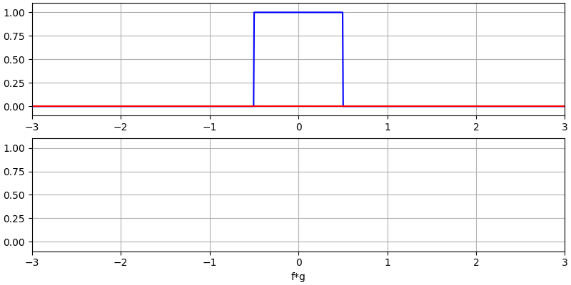
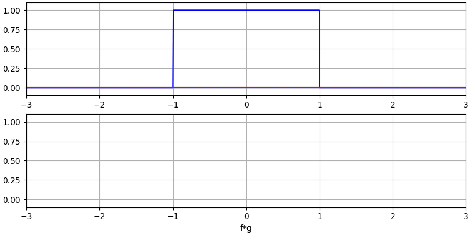
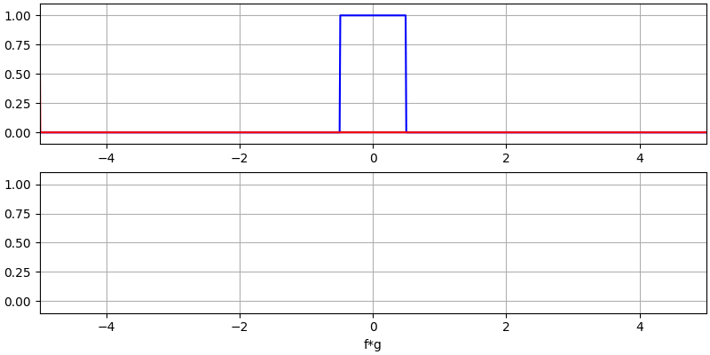
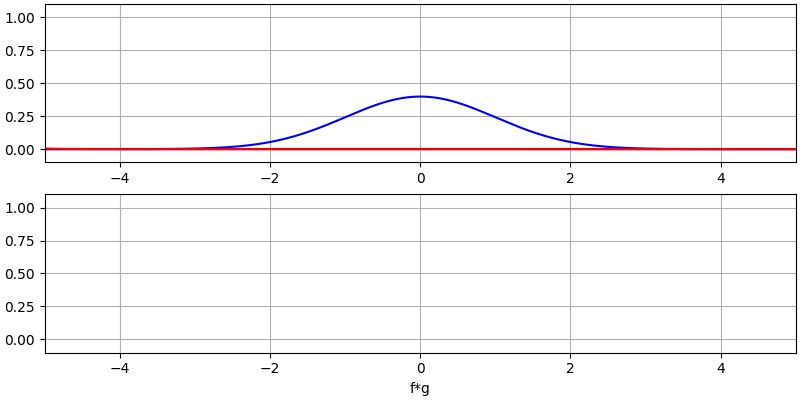

.. _filters-chapter:

#############
Фільтри
#############

У цій главі ми дізнаємося про цифрові фільтри за допомогою Python.  Ми розглянемо типи фільтрів (FIR/IIR та низькочастотні/високочастотні/смугові/смугоподібні), способи представлення фільтрів у цифровому вигляді, а також їхню конструкцію.  Ми закінчуємо вступом до формування імпульсів, який ми розглянемо в розділі :ref:`pulse-shaping-chapter`.

*************************
Основи фільтрів
*************************

Фільтри використовуються у багатьох дисциплінах. Наприклад, обробка зображень широко використовує двовимірні фільтри, де вхідними і вихідними даними є зображення.  Ви можете щоранку використовувати фільтр для приготування кави, який відфільтровує тверді частинки від рідини.  В DSP фільтри в першу чергу використовуються для

1. Розділення об'єднаних сигналів (наприклад, для виділення потрібного вам сигналу)
2. Видалення надлишкового шуму після отримання сигналу
3. Відновлення сигналів, які були певним чином спотворені (наприклад, звуковий еквалайзер є фільтром)

Безумовно, є й інші способи використання фільтрів, але ця глава призначена для того, щоб представити концепцію, а не пояснити всі способи, якими може відбуватися фільтрація.

Ви можете подумати, що нас цікавлять лише цифрові фільтри, адже цей підручник вивчає DSP. Однак важливо знати, що багато фільтрів будуть аналоговими, як ті, що стоять у наших SDR, розміщених перед аналого-цифровим перетворювачем (АЦП) на стороні приймача. На наступному зображенні порівнюється схема аналогового фільтра з блок-схемою, що представляє алгоритм цифрової фільтрації.

.. image:: ../_images/analog_digital_filter.png
   :scale: 70 % 
   :align: center
   :alt: Аналогові та цифрові фільтри
   
У DSP, де вхід і вихід є сигналами, фільтр має один вхідний сигнал і один вихідний сигнал:

.. tikz:: [font=\sffamily\Large, scale=2]
   \definecolor{babyblueeyes}{rgb}{0.36, 0.61, 0.83}
   \node [draw,
    color=white,
    fill=babyblueeyes,
    minimum width=4cm,
    minimum height=2.4cm
   ]  (filter) {Filter};
   \draw[<-, very thick] (filter.west) -- ++(-2,0) node[left,align=center]{Input\\(time domain)} ;
   \draw[->, very thick] (filter.east) -- ++(2,0) node[right,align=center]{Output\\(time domain)};   
   :libs: positioning
   :xscale: 80

Ви не можете подати два різних сигнали на один фільтр, не склавши їх попередньо або не виконавши якусь іншу операцію.  Аналогічно, на виході завжди буде один сигнал, тобто одномірний масив чисел.

Існує чотири основні типи фільтрів: низькочастотні, високочастотні, смугові та режекторні. Кожен тип модифікує сигнали, фокусуючись на різних діапазонах частот всередині них. Наведені нижче графіки демонструють, як частоти в сигналах фільтруються для кожного типу, спочатку представлені лише додатні частоти (простіше для розуміння), а потім також і від'ємні.

.. image:: ../_images/filter_types.png
   :scale: 70 % 
   :align: center
   :alt: Типи фільтрів, зокрема низькочастотний, високочастотний, смуговий та смуговий фільтр у частотній області

.. ПОЧАТОК ТИПІВ ФІЛЬТРІВ TIKZ
.. raw:: html

   <table><tbody><tr><td>

.. This draw the lowpass filter
.. tikz:: [font=\sffamily\large]    
   \draw[->, thick] (-5,0) -- (5,0) node[below]{Frequency};
   \draw[->, thick] (0,-0.5) node[below]{0 Hz} -- (0,5) node[left=1cm]{\textbf{Low-Pass}};
   \draw[red, thick, smooth] plot[tension=0.5] coordinates{(-5,0) (-2.5,0.5) (-1.5,3) (1.5,3) (2.5,0.5) (5,0)};
   :xscale: 100

.. raw:: html

   </td><td  style="padding: 0px">

.. це малює фільтр високих частот
.. tikz:: [font=\sffamily\large]    
   \draw[->, thick] (-5,0) -- (5,0) node[below]{Frequency};
   \draw[->, thick] (0,-0.5) node[below]{0 Hz} -- (0,5) node[left=1cm]{\textbf{High-Pass}};
   \draw[red, thick, smooth] plot[tension=0.5] coordinates{(-5,3) (-2.5,2.5) (-1.5,0.3) (1.5,0.3) (2.5,2.5) (5,3)};
   :xscale: 100

.. raw:: html

   </td></tr><tr><td>

.. це малює смуговий фільтр
.. tikz:: [font=\sffamily\large]    
   \draw[->, thick] (-5,0) -- (5,0) node[below]{Frequency};
   \draw[->, thick] (0,-0.5) node[below]{0 Hz} -- (0,5) node[left=1cm]{\textbf{Band-Pass}};
   \draw[red, thick, smooth] plot[tension=0.5] coordinates{(-5,0) (-4.5,0.3) (-3.5,3) (-2.5,3) (-1.5,0.3) (1.5, 0.3) (2.5,3) (3.5, 3) (4.5,0.3) (5,0)};
   :xscale: 100

.. raw:: html

   </td><td>

.. і нарешті смуговий фільтр
.. tikz:: [font=\sffamily\large]    
   \draw[->, thick] (-5,0) -- (5,0) node[below]{Frequency};
   \draw[->, thick] (0,-0.5) node[below]{0 Hz} -- (0,5) node[left=1cm]{\textbf{Band-Stop}};
   \draw[red, thick, smooth] plot[tension=0.5] coordinates{(-5,3) (-4.5,2.7) (-3.5,0.3) (-2.5,0.3) (-1.5,2.7) (1.5, 2.7) (2.5,0.3) (3.5, 0.3) (4.5,2.7) (5,3)};   
   :xscale: 100

.. raw:: html

   </td></tr></tbody></table>

.. .......................... кінець графіків фільтрів у tikz

Кожен фільтр дозволяє певним частотам залишатися в сигналі, блокуючи інші частоти.  Діапазон частот, які пропускає фільтр, називається "смугою пропускання", а "смуга затримки" - це те, що блокується.  У випадку низькочастотного фільтра, він пропускає низькі частоти і затримує високі, тому 0 Гц завжди буде в смузі пропускання.  Для фільтрів високих частот і смугових фільтрів 0 Гц завжди буде в смузі затримки.

Не плутайте ці типи фільтрації з алгоритмічною реалізацією фільтра (наприклад, IIR vs FIR).  Найпоширенішим типом на сьогоднішній день є фільтр нижніх частот (ФНЧ), оскільки ми часто представляємо сигнали в базовій смузі.  ФНЧ дозволяє нам відфільтрувати все "навколо" нашого сигналу, видаляючи надлишковий шум та інші сигнали.

*************************
Представлення фільтрів
*************************

Для більшості фільтрів, які ми побачимо (відомих як фільтри типу FIR, або фільтри зі скінченною імпульсною характеристикою), ми можемо представити сам фільтр за допомогою одного масиву плаваючих елементів.  Для симетричних у частотній області фільтрів ці числа будуть дійсними (а не комплексними), і їхня кількість, як правило, буде непарною.  Ми називаємо цей масив "відгалуженнями фільтра".  Ми часто використовуємо :math:`h` як символ для позначення відводів фільтра.  Ось приклад набору відгалужень фільтра, які визначають один фільтр:

.. code-block:: python

    h =  [ 9.92977939e-04  1.08410297e-03  8.51595307e-04  1.64604862e-04
     -1.01714338e-03 -2.46268845e-03 -3.58236429e-03 -3.55412543e-03
     -1.68583512e-03  2.10562324e-03  6.93100252e-03  1.09302641e-02
      1.17766532e-02  7.60955496e-03 -1.90555639e-03 -1.48306750e-02
     -2.69313236e-02 -3.25659606e-02 -2.63400086e-02 -5.04184562e-03
      3.08099470e-02  7.64264738e-02  1.23536693e-01  1.62377258e-01
      1.84320776e-01  1.84320776e-01  1.62377258e-01  1.23536693e-01
      7.64264738e-02  3.08099470e-02 -5.04184562e-03 -2.63400086e-02
     -3.25659606e-02 -2.69313236e-02 -1.48306750e-02 -1.90555639e-03
      7.60955496e-03  1.17766532e-02  1.09302641e-02  6.93100252e-03
      2.10562324e-03 -1.68583512e-03 -3.55412543e-03 -3.58236429e-03
     -2.46268845e-03 -1.01714338e-03  1.64604862e-04  8.51595307e-04
      1.08410297e-03  9.92977939e-04]

Example Use-Case
########################

Щоб дізнатися, як використовуються фільтри, давайте розглянемо приклад, де ми налаштовуємо наш SDR на частоту існуючого сигналу і хочемо ізолювати його від інших сигналів.  Пам'ятайте, що ми вказуємо нашому SDR, на яку частоту налаштуватися, але зразки, які він захоплює, знаходяться в базовій смузі, тобто сигнал буде відображатися з центром близько 0 Гц. Нам доведеться відстежувати, на яку частоту ми сказали SDR налаштуватися.  Ось що ми можемо отримати:

.. image:: ../_images/filter_use_case.png
   :scale: 70 % 
   :align: center
   :alt: GNU Графік у радіочастотній області сигналу, що нас цікавить, та завадового сигналу і рівня шуму

Оскільки наш сигнал вже відцентровано на постійному струмі (0 Гц), ми знаємо, що нам потрібен фільтр нижніх частот.  Ми повинні вибрати "частоту зрізу" (так звану кутову частоту), яка визначатиме, коли смуга пропускання переходить в смугу зупинки.  Частота зрізу завжди буде в одиницях Гц.  У цьому прикладі 3 кГц здається хорошим значенням:

.. image:: ../_images/filter_use_case2.png
   :scale: 70 % 
   :align: center 

Однак, за принципом роботи більшості фільтрів нижніх частот, межа від'ємних частот також буде -3 кГц.  Тобто, вона симетрична відносно постійного струму (пізніше ви зрозумієте чому).  Наші частоти зрізу виглядатимуть приблизно так (смуга пропускання - це область між ними):

.. image:: ../_images/filter_use_case3.png
   :scale: 70 % 
   :align: center 

Після створення та застосування фільтра з частотою зрізу 3 кГц, маємо:

.. image:: ../_images/filter_use_case4.png
   :scale: 70 % 
   :align: center 
   :alt: GNU Графік у радіочастотній області сигналу, що нас цікавить, та завадового сигналу і рівня шуму, з відфільтрованими завадами

Цей відфільтрований сигнал виглядатиме заплутано, доки ви не згадаєте, що наш рівень шуму *був* на зеленій лінії біля -65 дБ.  Незважаючи на те, що ми все ще бачимо сигнал перешкод з центром на частоті 10 кГц, ми *значно* зменшили потужність цього сигналу. Тепер вона нижча за рівень шуму!  Ми також видалили більшу частину шуму, що існував у смузі зупинки.

На додаток до частоти зрізу, інший основний параметр нашого фільтра низьких частот називається "ширина перехідного процесу".  Ширина переходу, яка також вимірюється в Гц, вказує фільтру, як швидко він повинен перейти від смуги пропускання до смуги зупинки, оскільки миттєвий перехід неможливий.

Давайте візуалізуємо ширину перехідного процесу.  На діаграмі нижче :green:`зелена` лінія представляє ідеальну реакцію для переходу між смугою пропускання і смугою зупинки, яка, по суті, має ширину переходу, рівну нулю.  Червона лінія демонструє результат реалістичного фільтра, який має деяку пульсацію і певну ширину перехідного процесу.

.. image:: ../_images/realistic_filter.png
   :scale: 100 % 
   :align: center
   :alt: Частотна характеристика фільтра нижніх частот, що показує пульсації та ширину перехідного процесу

Вам може бути цікаво, чому ми просто не встановили ширину переходу якомога меншою.  Причина в тому, що менша ширина перехідного процесу призводить до більшої кількості перемикань, а більша кількість перемикань означає більше обчислень - незабаром ми побачимо, чому.  Фільтр на 50 відгалужень може працювати цілий день, використовуючи 1% процесора Raspberry Pi.  Тим часом, фільтр на 50 000 відводів призведе до того, що ваш процесор вибухне!

Вам може бути цікаво, чому ми просто не встановили якомога меншу ширину переходу.  Причина в тому, що менша ширина переходу призводить до більшої кількості переходів, а більша кількість переходів означає більше обчислень - незабаром ми побачимо, чому.  Фільтр на 50 відгалужень може працювати цілий день, використовуючи 1% процесора Raspberry Pi.  Тим часом, фільтр на 50 000 відводів призведе до того, що ваш процесор вибухне!
Зазвичай ми використовуємо інструмент для створення фільтрів, потім дивимося, скільки відгалужень він видає, і якщо їх занадто багато (наприклад, більше 100), ми збільшуємо ширину переходу.  Звичайно, все залежить від програми та обладнання, на якому працює фільтр.

У наведеному вище прикладі фільтрації ми використовували відсічення 3 кГц і ширину переходу 1 кГц (на цих скріншотах важко визначити ширину переходу).  Отриманий фільтр мав 77 відводів.

Повернемося до представлення фільтрів.  Незважаючи на те, що ми можемо показати список відгалужень для фільтра, ми зазвичай представляємо фільтри візуально в частотній області.  Ми називаємо це "частотною характеристикою" фільтра, і вона показує нам поведінку фільтра в частотній області. Ось частотна характеристика фільтра, який ми щойно використовували:

.. image:: ../_images/filter_use_case5.png
   :scale: 100 % 
   :align: center 

Зауважте, що те, що я показую тут, не є сигналом - це лише представлення фільтра у частотній області.  Спочатку це може бути трохи важко зрозуміти, але коли ми подивимося на приклади і код, все стане зрозумілим.

Даний фільтр також має представлення в часовій області; його називають "імпульсною характеристикою" фільтра, тому що це те, що ви побачите в часовій області, якщо візьмете імпульс і пропустите його через фільтр. (Щоб дізнатися більше про те, що таке імпульс, погуглите "дельта-функція Дірака"). Для фільтра типу КІХ імпульсна характеристика - це просто самі відгалуження.  Для фільтра з 77 відгалуженнями, який ми використовували раніше, відгалуженнями є..:

.. code-block:: python

    h =  [-0.00025604525581002235, 0.00013669139298144728, 0.0005385575350373983,
    0.0008378280326724052, 0.000906112720258534, 0.0006353431381285191,
    -9.884083502996931e-19, -0.0008822851814329624, -0.0017323142383247614,
    -0.0021665366366505623, -0.0018335371278226376, -0.0005912294145673513,
    0.001349081052467227, 0.0033936649560928345, 0.004703888203948736,
    0.004488115198910236, 0.0023609865456819534, -0.0013707970501855016,
    -0.00564080523326993, -0.008859002031385899, -0.009428252466022968,
    -0.006394983734935522, 4.76480351940553e-18, 0.008114570751786232,
    0.015200719237327576, 0.018197273835539818, 0.01482443418353796,
    0.004636279307305813, -0.010356673039495945, -0.025791890919208527,
    -0.03587324544787407, -0.034922562539577484, -0.019146423786878586,
    0.011919975280761719, 0.05478153005242348, 0.10243935883045197,
    0.1458890736103058, 0.1762896478176117, 0.18720689415931702,
    0.1762896478176117, 0.1458890736103058, 0.10243935883045197,
    0.05478153005242348, 0.011919975280761719, -0.019146423786878586,
    -0.034922562539577484, -0.03587324544787407, -0.025791890919208527,
    -0.010356673039495945, 0.004636279307305813, 0.01482443418353796,
    0.018197273835539818, 0.015200719237327576, 0.008114570751786232,
    4.76480351940553e-18, -0.006394983734935522, -0.009428252466022968,
    -0.008859002031385899, -0.00564080523326993, -0.0013707970501855016,
    0.0023609865456819534, 0.004488115198910236, 0.004703888203948736,
    0.0033936649560928345, 0.001349081052467227, -0.0005912294145673513,
    -0.0018335371278226376, -0.0021665366366505623, -0.0017323142383247614,
    -0.0008822851814329624, -9.884083502996931e-19, 0.0006353431381285191,
    0.000906112720258534, 0.0008378280326724052, 0.0005385575350373983,
    0.00013669139298144728, -0.00025604525581002235]

І хоча ми ще не перейшли до дизайну фільтрів, ось код на Python, який згенерував цей фільтр:

.. code-block:: python

    import numpy as np
    from scipy import signal
    import matplotlib.pyplot as plt

    num_taps = 51 # it helps to use an odd number of taps
    cut_off = 3000 # Hz
    sample_rate = 32000 # Hz

    # create our low pass filter
    h = signal.firwin(num_taps, cut_off, nyq=sample_rate/2)

    # plot the impulse response
    plt.plot(h, '.-')
    plt.show()

Простий графік цього масиву з плаваючими числами дає нам імпульсну характеристику фільтра:

.. image:: ../_images/impulse_response.png
   :scale: 100 % 
   :align: center
   :alt: Приклад імпульсної характеристики фільтра з відображенням відводів у часовій області

А ось код, який було використано для створення частотної характеристики, показаної раніше.  Він трохи складніший, оскільки нам потрібно створити масив частот по осі x. 

.. code-block:: python

    # будуємо частотну характеристику
    H = np.abs(np.fft.fft(h, 1024)) # взяти 1024-точкове ШПФ та амплітуду
    H = np.fft.fftshift(H) # робимо 0 Гц в центрі
    w = np.linspace(-sample_rate/2, sample_rate/2, len(H)) # вісь x
    plt.plot(w, H, '.-')
    plt.show()

Реальні та комплексні фільтри
#############################

Фільтр, який я вам показав, має реальні відводи, але відводи можуть бути і складними.  Реальні чи комплексні відводи не обов'язково повинні відповідати сигналу, який ви пропускаєте через них, тобто ви можете пропустити комплексний сигнал через фільтр з реальними відводами і навпаки.  Коли відводи реальні, частотна характеристика фільтра буде симетричною навколо постійного струму (0 Гц).  Зазвичай ми використовуємо комплексні відводи, коли нам потрібна асиметрія, що трапляється не дуже часто.

.. намалюйте реальний та комплексний фільтр
.. tikz:: [font=\sffamily\Large,scale=2] 
   \definecolor{babyblueeyes}{rgb}{0.36, 0.61, 0.83}   
   \draw[->, thick] (-5,0) node[below]{$-\frac{f_s}{2}$} -- (5,0) node[below]{$\frac{f_s}{2}$};
   \draw[->, thick] (0,-0.5) node[below]{0 Hz} -- (0,1);
   \draw[babyblueeyes, smooth, line width=3pt] plot[tension=0.1] coordinates{(-5,0) (-1,0) (-0.5,2) (0.5,2) (1,0) (5,0)};
   \draw[->,thick] (6,0) node[below]{$-\frac{f_s}{2}$} -- (16,0) node[below]{$\frac{f_s}{2}$};
   \draw[->,thick] (11,-0.5) node[below]{0 Hz} -- (11,1);
   \draw[babyblueeyes, smooth, line width=3pt] plot[tension=0] coordinates{(6,0) (11,0) (11,2) (11.5,2) (12,0) (16,0)};
   \draw[font=\huge\bfseries] (0,2.5) node[above,align=center]{Example Low-Pass Filter\\with Real Taps};
   \draw[font=\huge\bfseries] (11,2.5) node[above,align=center]{Example Low-Pass Filter\\with Complex Taps};

Як приклад складних відгалужень, повернімося до прикладу фільтрації, за винятком того, що цього разу ми хочемо отримати інший сигнал, що заважає (без необхідності переналаштування радіоприймача).  Це означає, що нам потрібен смуговий фільтр, але не симетричний. Ми хочемо залишити (так званий "пропуск") лише частоти від 7 до 13 кГц (ми не хочемо також пропускати від -13 кГц до -7 кГц):

.. image:: ../_images/filter_use_case6.png
   :scale: 70 % 
   :align: center 

Один із способів створити такий фільтр - це створити фільтр нижніх частот з частотою зрізу 3 кГц, а потім зсунути його за частотою.  Пам'ятайте, що ми можемо зсунути частоту x(t) (у часовій області), помноживши її на :math:`e^{j2\pi f_0t}`.  У цьому випадку :math:`f_0` має дорівнювати 10 кГц, що зсуває наш фільтр на 10 кГц вгору. Нагадаємо, що в нашому Python-коді зверху :math:`h` було відгалуженням фільтра нижніх частот.  Для того, щоб створити наш смуговий фільтр, нам просто потрібно помножити ці відводи на :math:`e^{j2\pi f_0t}`, хоча це передбачає створення вектора для представлення часу на основі нашого періоду дискретизації (оберненого до частоти дискретизації):

.. code-block:: python

    # (h було знайдено за допомогою першого фрагмента коду)

    #  Зсуваємо фільтр за частотою множенням на exp(j*2*pi*f0*t)
    f0 = 10e3 # величина, на яку будемо зсувати
    Ts = 1.0/sample_rate # період дискретизації
    t = np.arange(0.0, Ts*len(h), Ts) # вектор часу. args are (start, stop, step)
    exponential = np.exp(2j*np.pi*f0*t) # це по суті комплексна синусоїда

    h_band_pass = h * exponential # робимо зсув

    # будуємо графік імпульсної характеристики
    plt.figure('impulse')
    plt.plot(np.real(h_band_pass), '.-')
    plt.plot(np.imag(h_band_pass), '.-')
    plt.legend(['real', 'imag'], loc=1)

    # будуємо частотну характеристику
    H = np.abs(np.fft.fft(h_band_pass, 1024)) # взяти 1024-точкове ШПФ та амплітуду
    H = np.fft.fftshift(H) # робимо 0 Гц по центру
    w = np.linspace(-sample_rate/2, sample_rate/2, len(H)) # вісь x
    plt.figure('freq')
    plt.plot(w, H, '.-')
    plt.xlabel('Frequency [Hz]')
    plt.show()

Нижче наведено графіки імпульсної та частотної характеристик:

.. image:: ../_images/shifted_filter.png
   :scale: 60 % 
   :align: center 

Оскільки наш фільтр не симетричний відносно 0 Гц, він повинен використовувати складні відгалуження. Тому нам потрібні дві лінії для відображення цих складних відгалужень.  Те, що ми бачимо на лівому графіку вище, все ще є імпульсною характеристикою.  Наш графік частотної характеристики - це те, що дійсно підтверджує, що ми створили саме такий фільтр, на який сподівалися, і що він відфільтрує все, окрім сигналу з центром близько 10 кГц.  Знову ж таки, пам'ятайте, що графік вище - це *не* реальний сигнал: це лише представлення фільтра.  Це може бути дуже складно зрозуміти, тому що коли ви застосовуєте фільтр до сигналу і будуєте графік вихідного сигналу в частотній області, в багатьох випадках він буде виглядати приблизно так само, як і частотна характеристика самого фільтра.

Якщо цей підрозділ додав плутанини, не хвилюйтеся, 99% часу ви все одно матимете справу з простими фільтрами нижніх частот з реальними відгалуженнями. 

*************************
Реалізація фільтрів
*************************

Ми не будемо заглиблюватися в реалізацію фільтрів. Я зосереджуся на проектуванні фільтрів (ви можете знайти готову до використання реалізацію на будь-якій мові програмування).  Наразі, ось один висновок: щоб відфільтрувати сигнал за допомогою КІХ-фільтра, ви просто згорнете імпульсну характеристику (масив відводів) з вхідним сигналом.  (Не хвилюйтеся, згортання буде описано в наступному розділі.) У дискретному світі ми використовуємо дискретне згортання (приклад нижче).  Трикутники, позначені як b - це відводи.  На блок-схемі квадрати, позначені :math:`z^{-1}` над трикутниками, означають затримку на один часовий крок.

.. image:: ../_images/discrete_convolution.png
   :scale: 80 % 
   :align: center
   :alt:  Реалізація фільтра зі скінченною імпульсною характеристикою (FIR) із затримками, відгалуженнями та підсумовуванням

Ви можете зрозуміти, чому ми називаємо ці фільтри "відгалуженнями", виходячи з того, як реалізовано сам фільтр. 

FIR vs IIR
##############

Існує два основних класи цифрових фільтрів: КІХ та ІКХ

1. Скінченна імпульсна характеристика (FIR)
2. Нескінченна імпульсна характеристика (IIR)

Ми не будемо заглиблюватися в теорію, але поки що просто запам'ятайте: FIR-фільтри легше спроектувати і вони можуть робити все, що завгодно, якщо ви використовуєте достатню кількість відгалужувачів.  IIR-фільтри складніші і можуть бути нестабільними, але вони більш ефективні (використовують менше процесора і пам'яті для даного фільтра). Якщо хтось просто дає вам список відгалужень, вважається, що це відгалуження для КІХ-фільтра.  Якщо вони починають згадувати "полюси", вони говорять про IIR-фільтри.  У цьому підручнику ми розглядатимемо саме БІХ-фільтри.

Нижче наведено приклад частотної характеристики для порівняння БІХ- та ІІХ-фільтрів, які виконують майже однакову фільтрацію; вони мають схожу ширину перехідної смуги, яка, як ми вже дізналися, визначає, скільки відгалужень потрібно для фільтрації.  FIR-фільтр має 50 відгалужень, а IIR-фільтр має 12 полюсів, що з точки зору необхідних обчислень дорівнює 12 відгалуженням.

.. image:: ../_images/FIR_IIR.png
   :scale: 70 % 
   :align: center
   :alt: Порівняння фільтрів зі скінченною імпульсною характеристикою (FIR) та нескінченною імпульсною характеристикою (IIR) за частотною характеристикою

Урок полягає в тому, що FIR-фільтр вимагає набагато більше обчислювальних ресурсів, ніж IIR-фільтр, щоб виконати приблизно ту саму операцію фільтрації.

Ось кілька реальних прикладів фільтрів FIR і IIR, які ви, можливо, використовували раніше.

Якщо ви обчислюєте "ковзне середнє" для списку чисел, то це буде просто КІХ-фільтр з відсіканням одиниць:
- h = [1 1 1 1 1 1 1 1 1 1 1] для фільтра ковзного середнього з розміром вікна 10.  Він також є фільтром низьких частот; чому це так?  Яка різниця між використанням одиниць і використанням відводів, що спадають до нуля?

.. raw:: html

   

   
Відповіді

Фільтр ковзного середнього - це фільтр низьких частот, оскільки він згладжує "високочастотні" зміни, і саме тому його зазвичай використовують.  Причина використання відгалужувачів, які затухають до нуля на обох кінцях, полягає в тому, щоб уникнути раптових змін на виході, наприклад, якщо сигнал, який фільтрується, деякий час був нульовим, а потім раптово підскочив вгору.

.. raw:: html

   
 </details

Тепер приклад IIR.  Хто-небудь з вас коли-небудь робив це: 

    x = x*0.99 + new_value*0.01

де 0.99 і 0.01 представляють швидкість оновлення значення (або швидкість розпаду, що одне і те ж).  Це зручний спосіб повільно оновлювати деяку змінну без необхідності запам'ятовувати останні кілька значень.  Це фактично різновид низькочастотного IIR-фільтра.  Сподіваюся, ви зрозуміли, чому IIR-фільтри мають меншу стабільність, ніж FIR-фільтри.  Значення ніколи не зникають повністю!

*******************************************
Інструменти для проектування фільтрів
*******************************************

На практиці більшість людей використовують інструмент для створення фільтрів або функцію в коді, яка створює фільтр.  Існує багато різних інструментів, але для студентів я рекомендую цей простий у використанні веб-додаток Пітера Ізи, який покаже вам імпульсну та частотну характеристику: http://t-filter.engineerjs.com.  Використовуючи значення за замовчуванням, принаймні на момент написання цієї статті, він налаштований на створення фільтра нижніх частот зі смугою пропускання від 0 до 400 Гц і смугою зупинки від 500 Гц і вище.  Частота дискретизації становить 2 кГц, тому максимальна частота, яку ми можемо "побачити" - 1 кГц.

.. image:: ../_images/filter_designer1.png
   :scale: 70 % 
   :align: center 

Натисніть кнопку "Дизайнерський фільтр", щоб створити відводи і побудувати частотну характеристику.

.. image:: ../_images/filter_designer2.png
   :scale: 70 
   :align: center 

Клацніть текст "Імпульсна характеристика" над графіком, щоб побачити імпульсну характеристику, яка є графіком відгалужень, оскільки це КІХ-фільтр.

.. image:: ../_images/filter_designer3.png
   :scale: 70 % 
   :align: center 

Ця програма навіть містить вихідний код C++ для реалізації та використання цього фільтра.  Веб-додаток не містить жодного способу проектування IIR-фільтрів, які загалом набагато складніше проектувати.

.. _convolution-section:

***********
Згортка
***********

Ми зробимо невеликий обхідний маневр, щоб представити оператор згортки. Ви можете пропустити цей розділ, якщо ви вже знайомі з ним.

Додавання двох сигналів є одним із способів об'єднання двох сигналів в один. У розділі :ref:`freq-domain-chapter` ми розглянули, як застосовується властивість лінійності при додаванні двох сигналів.  Згортка - це ще один спосіб об'єднання двох сигналів в один, але він дуже відрізняється від простого додавання.  Згортка двох сигналів схожа на ковзання одного по іншому та інтегрування.  Це *дуже* схоже на крос-кореляцію, якщо ви знайомі з цією операцією.  Насправді це еквівалентно крос-кореляції у багатьох випадках.  Ми зазвичай використовуємо символ ::code::`*` для позначення згортки, особливо у математичних рівняннях.

Я вважаю, що операцію згортки найкраще вивчати на прикладах.  У цьому першому прикладі ми згорнемо два прямокутних імпульси разом:

   
Ми маємо два вхідних сигнали (один червоний, один синій), а потім вихід згортки відображається чорним кольором.  Ви можете бачити, що результатом є інтеграція двох сигналів, коли один з них ковзає по іншому.  Оскільки це просто ковзне інтегрування, результатом є трикутник з максимумом у точці, де обидва квадратні імпульси ідеально вирівнялися.  

Давайте розглянемо ще кілька згорток:

|

|

Зверніть увагу, що гаусс, згорнутий з гаусом, є ще одним гаусом, але з ширшим імпульсом і меншою амплітудою.

Через цю "ковзаючу" природу, довжина вихідного сигналу фактично довша за вхідний.  Якщо один сигнал має :code:`M` відліків, а інший сигнал має :code:`N` відліків, згортка цих двох сигналів може дати :code:`N+M-1` відліків.  Однак у таких функціях, як :code:`numpy.convolve()` є можливість вказати, чи хочете ви отримати весь результат (:code:`max(M, N)` відліків), чи лише ті відліки, де сигнали повністю перекриваються (:code:`max(M, N) - min(M, N) + 1`, якщо вам цікаво).  Не потрібно зациклюватися на цих деталях. Просто знайте, що довжина результату згортки - це не просто довжина вхідних даних.

Так чому ж згортка важлива в DSP?  Для початку, щоб відфільтрувати сигнал, ми можемо просто взяти імпульсну характеристику цього фільтра і згорнути її з сигналом.  FIR-фільтрація - це просто операція згортки.

.. image:: ../_images/filter_convolve.png
   :scale: 70 % 
   :align: center 

Це може бути незрозуміло, оскільки раніше ми згадували, що згортка приймає два *сигнали*, а видає один.  Ми можемо розглядати імпульсну характеристику як сигнал, а згортка - це математичний оператор, який оперує двома одновимірними масивами.  Якщо один з цих одновимірних масивів є імпульсною характеристикою фільтра, інший одновимірний масив може бути фрагментом вхідного сигналу, і на виході ми отримаємо відфільтровану версію вхідного сигналу.

Давайте розглянемо ще один приклад, який допоможе зробити цей клік.  У наведеному нижче прикладі трикутник представлятиме імпульсну характеристику нашого фільтра, а сигнал :green:`зелений` - це наш сигнал, що фільтрується.

.. image:: ../_images/convolution.gif
   :scale: 70 % 
   :align: center 

Сигнал :red:`red` на виході є відфільтрованим сигналом.  

Питання: Яким типом фільтра був трикутник?

.. raw:: html

   

   
Відповіді

Він згладжував високочастотні складові зеленого сигналу (тобто різкі переходи квадрата), тому він діє як фільтр низьких частот.

.. raw:: html

   
 

Тепер, коли ми починаємо розуміти, що таке згортка, я представлю математичне рівняння для неї.  Зірочка (*) зазвичай використовується як символ згортки:

.. math::

 (f * g)(t) = \int f(\tau) g(t - \tau) d\tau
 
In this above expression, :math:`g(t)` is the signal or input that is flipped and slides across :math:`f(t)`, but :math:`g(t)` and :math:`f(t)` can be swapped and it's still the same expression.  Typically, the shorter array will be used as :math:`g(t)`.  Convolution is equal to a cross-correlation, defined as :math:`\int f(\tau) g(t+\tau)`, when :math:`g(t)` is symmetrical, i.e., it doesn't change when flipped about the origin.

******************************
Проектування фільтрів у Python
******************************

Зараз ми розглянемо один із способів самостійного проектування КІХ-фільтра на мові Python.  Хоча існує багато підходів до проектування фільтрів, ми будемо використовувати метод, який полягає в тому, що ми починаємо в частотній області і працюємо в зворотному напрямку, щоб знайти імпульсну характеристику. Зрештою, саме так виглядає наш фільтр (за допомогою його відводів).

Ви починаєте зі створення вектора бажаної частотної характеристики.  Давайте створимо фільтр низьких частот довільної форми, як показано нижче:

.. image:: ../_images/filter_design1.png
   :scale: 70 % 
   :align: center 

Код, який використовується для створення цього фільтра, досить простий:

.. code-block:: python

    import numpy as np
    import matplotlib.pyplot as plt
    H = np.hstack((np.zeros(20), np.arange(10)/10, np.zeros(20)))
    w = np.linspace(-0.5, 0.5, 50)
    plt.plot(w, H, '.-')
    plt.show()

:code:`hstack()` - це один зі способів конкатенації масивів у numpy.  Ми знаємо, що це призведе до створення фільтра зі складними відгалуженнями. Чому?

.. raw:: html

   

  
Відповідь

Він не симетричний відносно 0 Гц.

.. raw:: html

   
 

Наша кінцева мета - знайти відводи цього фільтра, щоб ми могли його використовувати.  Як нам отримати відгалуження, враховуючи частотну характеристику?  Як нам перетворити частотну область назад у часову?  Інверсне ШПФ (IFFT)!  Нагадаємо, що функція IFFT майже точно така ж, як і функція FFT.  Нам також потрібно зсунути нашу бажану частотну характеристику перед IFFT, а потім ще раз зсунути її після IFFT (ні, вони не скасовують один одного, але ви можете спробувати).  Цей процес може здатися заплутаним. Просто пам'ятайте, що ви завжди повинні робити FFT-зсув після FFT і IFF-зсув після IFFT.

.. code-block:: python

    h = np.fft.ifftshift(np.fft.ifft(np.fft.ifftshift(H))
    plt.plot(np.real(h))
    plt.plot(np.imag(h))
    plt.legend(['real','imag'], loc=1)
    plt.show()

.. image:: ../_images/filter_design2.png
   :scale: 90 
   :align: center 

Ми будемо використовувати ці крани, показані вище, як наш фільтр.  Ми знаємо, що імпульсна характеристика будується на основі відводів, тому те, що ми бачимо вище - це і є наша імпульсна характеристика.  Давайте візьмемо ШПФ наших відводів, щоб побачити, як насправді виглядає частотна область.  Ми зробимо ШПФ для 1024 точок, щоб отримати високу роздільну здатність:

.. code-block:: python

    H_fft = np.fft.fftshift(np.abs(np.fft.fft(h, 1024)))
    plt.plot(H_fft)
    plt.show()

.. image:: ../_images/filter_design3.png
   :scale: 70 
   :align: center 

Подивіться, що частотна характеристика не дуже пряма... вона не дуже добре відповідає нашому оригіналу, якщо ви пам'ятаєте форму, для якої ми спочатку хотіли зробити фільтр.  Основна причина полягає в тому, що наша імпульсна характеристика не закінчила затухати, тобто ліва і права частини не досягають нуля.  У нас є два варіанти, які дозволять йому спадати до нуля:

**Варіант 1:** Ми "вікні" нашу поточну імпульсну характеристику, щоб вона спадала до 0 з обох сторін.  Це передбачає множення нашої імпульсної характеристики на "віконну функцію", яка починається і закінчується на нулі.

.. code-block:: python

    # Після створення h за допомогою попереднього коду, створюємо і застосовуємо вікно
    window = np.hamming(len(h))
    h = h * window

.. image:: ../_images/filter_design4.png
   :scale: 70 
   :align: center 

**Варіант 2:** Ми повторно генеруємо нашу імпульсну характеристику, використовуючи більше точок, щоб вона встигла затухати.  Нам потрібно додати роздільну здатність до нашого оригінального масиву частотної області (це називається інтерполяція).

.. code-block:: python

    H = np.hstack((np.zeros(200), np.arange(100)/100, np.zeros(200)))
    w = np.linspace(-0.5, 0.5, 500)
    plt.plot(w, H, '.-')
    plt.show()
    # (решта коду не змінюється)

.. image:: ../_images/filter_design5.png
   :scale: 60 
   :align: center 

.. image:: ../_images/filter_design6.png
   :scale: 70 % 
   :align: center 

.. image:: ../_images/filter_design7.png
   :scale: 50 % 
   :align: center 

Обидва варіанти спрацювали.  Який би ви вибрали?  Другий метод призвів до більшої кількості відгалужень, але перший метод призвів до не дуже гострої АЧХ і не дуже крутого спаду.  Існує безліч способів спроектувати фільтр, кожен з яких має свої власні компроміси. Багато хто вважає проектування фільтрів мистецтвом.

*****************************
Вступ до формування імпульсів
*****************************

Ми коротко представимо дуже цікаву тему в рамках DSP - формування імпульсів. Пізніше ми розглянемо цю тему в окремій главі, див. :ref:`pulse-shaping-chapter`. Варто згадати її поряд з фільтрацією, оскільки формування імпульсів - це, зрештою, різновид фільтра, який використовується з певною метою і має особливі властивості.

Як ми вже дізналися, цифрові сигнали використовують символи для представлення одного або декількох бітів інформації.  Ми використовуємо схему цифрової модуляції, таку як ASK, PSK, QAM, FSK тощо, для модуляції несучої, щоб інформацію можна було передавати бездротовим способом.  Коли ми моделювали QPSK у розділі :ref:`modulation-chapter`, ми моделювали лише одну вибірку на символ, тобто кожне комплексне число, яке ми створили, було однією з точок на сузір'ї - це був один символ.  На практиці ми зазвичай генеруємо декілька відліків на символ, і це пов'язано з фільтрацією.

Ми використовуємо фільтри для створення "форми" наших символів, оскільки форма в часовій області змінює форму в частотній області.  Частотна область інформує нас про те, скільки спектру/пропускної здатності буде використовувати наш сигнал, і ми зазвичай хочемо мінімізувати її.  Важливо розуміти, що спектральні характеристики (частотна область) символів базової смуги не змінюються, коли ми модулюємо несучу; це просто зміщує базову смугу вгору по частоті, в той час як форма залишається незмінною, що означає, що кількість смуги пропускання, яку вона використовує, залишається незмінною.  Коли ми використовуємо 1 вибірку на символ, це схоже на передачу прямокутних імпульсів. Насправді BPSK з використанням 1 вибірки на символ - це просто квадратна хвиля випадкових 1 і -1:

.. image:: ../_images/bpsk.svg
   :align: center 
   :target: ../_images/bpsk.svg

І як ми вже з'ясували, прямокутні імпульси не є ефективними, оскільки вони використовують надмірну кількість спектру:

.. image:: ../_images/square-wave.svg
   :align: center 

Отже, ми "формуємо імпульс" цих символів, що виглядають як блоки, таким чином, щоб вони займали меншу смугу пропускання у частотній області.  Ми "формуємо імпульс" за допомогою фільтра низьких частот, оскільки він відкидає високочастотні компоненти наших символів.  Нижче показано приклад символів у часовій (вгорі) і частотній (внизу) областях до і після застосування фільтра, що формує імпульс:

.. image:: ../_images/pulse_shaping.png
   :scale: 70 
   :align: center 

|

.. image:: ../_images/pulse_shaping_freq.png
   :scale: 90 % 
   :align: center
   :alt: Демонстрація формування імпульсів радіочастотного сигналу для зменшення зайнятої смуги пропускання

Зверніть увагу, наскільки швидше падає частота сигналу. Бічні пелюстки стали на ~30 дБ нижчими після формування імпульсу; це в 1000 разів менше!  І що більш важливо, головна пелюстка вужча, тому використовується менше спектру для тієї ж кількості біт на секунду.

Наразі, майте на увазі, що поширені фільтри, що формують імпульс, включають в себе:

1. Фільтр підвищеної косинусоїди
2. Кореневий косинусоїдальний фільтр
3. Синусоїдальний фільтр
4. Гаусів фільтр

Ці фільтри зазвичай мають параметр, який ви можете регулювати для зменшення смуги пропускання.  Нижче показано часову та частотну області фільтра з підвищеною косинусністю з різними значеннями :math:`\beta`, параметра, який визначає, наскільки крутим є спадання.

.. image:: ../_images/pulse_shaping_rolloff.png
   :scale: 40 % 
   :align: center 

Ви можете бачити, що менше значення :math:`\beta` зменшує спектр, що використовується (для тієї ж кількості даних). Однак, якщо значення занадто мале, то часовим символам знадобиться більше часу, щоб розпастися до нуля. Насправді, коли :math:`\beta=0` символи ніколи не розпадаються повністю до нуля, що означає, що ми не можемо передавати такі символи на практиці.  Значення :math:`\beta` близько 0.35 є поширеним.

Ви дізнаєтеся набагато більше про формування імпульсів, зокрема про деякі особливі властивості, яким мають задовольняти фільтри, що формують імпульси, у розділі :ref:`pulse-shaping-chapter`.