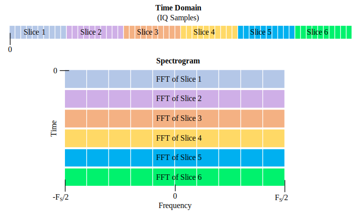
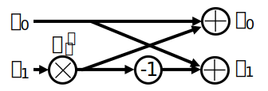
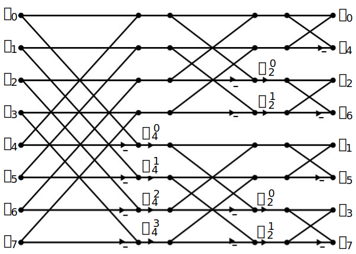
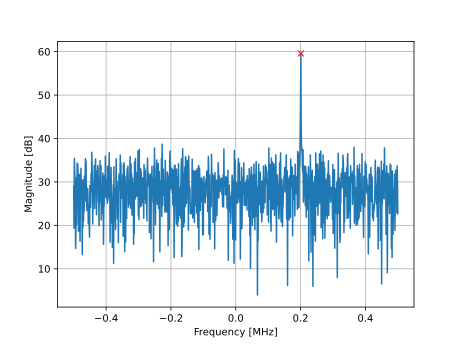

.. _freq-domain-chapter:

#####################
Частотний домен
#####################

Ця глава знайомить з частотною областю і охоплює ряди Фур'є, перетворення Фур'є, властивості Фур'є, ШПФ, вікна і спектрограми, використовуючи приклади з Python.  

Одним з найцікавіших побічних ефектів вивчення DSP і бездротового зв'язку є те, що ви також навчитеся мислити в частотній області.  Досвід більшості людей з "роботою" в частотній області обмежується регулюванням ручок низьких/середніх/високих частот в автомобільній аудіосистемі.  Досвід більшості людей з "переглядом" чогось в частотній області обмежується переглядом звукового еквалайзера, як у цьому кліпі:

.. image:: ../_images/audio_equalizer.webp
   :align: center
   
Наприкінці цього розділу ви зрозумієте, що насправді означає частотна область, як перетворювати час і частоту (а також що при цьому відбувається), і деякі цікаві принципи, які ми будемо використовувати під час вивчення DSP і SDR.  До кінця цього підручника ви станете майстром у роботі з частотною областю, гарантовано!

По-перше, чому нам подобається розглядати сигнали в частотній області?  Ось два приклади сигналів, показаних як в часовій, так і в частотній області.

.. image:: ../_images/time_and_freq_domain_example_signals.png
   :scale: 40 %
   :align: center
   :alt: Два сигнали в часовій області можуть виглядати як шум, але в частотній області ми бачимо додаткові особливості

Як ви можете бачити, в часовій області обидва сигнали виглядають як шум, але в частотній області ми бачимо різні особливості.  Все знаходиться в часовій області в своїй природній формі; коли ми робимо вибірки сигналів, ми будемо робити їх в часовій області, тому що ви не можете *безпосередньо* зробити вибірку сигналу в частотній області.  Але найцікавіші речі зазвичай відбуваються саме в частотній області. 

***************
Ряди Фур'є
***************

Основи частотної області починаються з розуміння того, що будь-який сигнал може бути представлений синусоїдальними хвилями, складеними разом.  Коли ми розкладаємо сигнал на складові синусоїди, ми називаємо це рядом Фур'є.  Ось приклад сигналу, який складається лише з двох синусоїд:

.. image:: ../_images/summing_sinusoids.svg
   :align: center
   :target: ../_images/summing_sinusoids.svg
   :alt: Простий приклад того, як сигнал може складатися з декількох синусоїд, демонструючи ряд Фур'є
   
Ось ще один приклад: червона крива нижче апроксимує пилкоподібну хвилю шляхом підсумовування 10 синусоїд.  Ми бачимо, що це не ідеальна реконструкція - для відтворення цієї пилкоподібної хвилі знадобилася б нескінченна кількість синусоїд через різкі переходи:

.. image:: ../_images/fourier_series_triangle.gif
   :scale: 70 %   
   :align: center
   :alt: Анімація розкладання у ряд Фур'є трикутної хвилі (так званої пилкоподібної)
   
Деякі сигнали вимагають більше синусоїд, ніж інші, а деякі вимагають нескінченної кількості, хоча їх завжди можна апроксимувати обмеженою кількістю.  Ось ще один приклад розбиття сигналу на серію синусоїд:

.. image:: ../_images/fourier_series_arbitrary_function.gif
   :scale: 70 %   
   :align: center  
   :alt: Анімація розкладання в ряд Фур'є довільної функції, що складається з прямокутних імпульсів

Щоб зрозуміти, як можна розкласти сигнал на синусоїди, або синусоїди, нам потрібно спочатку розглянути три атрибути синусоїди:

#. Амплітуда
#. Частота
#. Фаза

**Амплітуда** вказує на "силу" хвилі, тоді як **частота** - це кількість хвиль в секунду.  **Фаза** використовується для представлення того, як синусоїда зсунута у часі, в межах від 0 до 360 градусів (або від 0 до :math:`2\pi`), але вона повинна бути відносно чогось, щоб мати якесь значення, наприклад, два сигнали з однаковою частотою можуть бути на 30 градусів у протифазі один з одним.

.. image:: ../_images/amplitude_phase_period.svg
   :align: center
   :target: ../_images/amplitude_phase_period.svg
   :alt: Еталонна діаграма амплітуди, фази та частоти синусоїди (так званої синусоїди)
   
На цьому етапі ви, можливо, зрозуміли, що "сигнал" - це, по суті, просто функція, зазвичай представлена "в часі" (тобто на осі х). Іншим атрибутом, який легко запам'ятати, є **період**, який є оберненою величиною до **частоти**. Період синусоїди - це кількість часу в секундах, за який хвиля завершує один цикл.  Таким чином, одиницею частоти є 1/секунда, або Гц.
   
Коли ми розкладаємо сигнал на суму синусоїд, кожна з них матиме певну **амплітуду**, **фазу** і **частоту**.  Амплітуда кожної синусоїди покаже нам, наскільки сильна **частота** існувала у вихідному сигналі.  Не хвилюйтеся надто про **фазу** поки що, окрім усвідомлення того, що єдина різниця між sin() і cos() - це фазовий зсув (часовий зсув).

Важливіше зрозуміти концепцію, що лежить в основі, ніж самі рівняння, які потрібно розв'язати для ряду Фур'є, але для тих, хто цікавиться рівняннями, я відсилаю вас до стислого пояснення Вольфрама: https://mathworld.wolfram.com/FourierSeries.html.  

********************
Часово-частотні пари
********************

Ми з'ясували, що сигнали можуть бути представлені у вигляді синусоїд, які мають декілька атрибутів. Тепер давайте навчимося будувати графіки сигналів у частотній області. У той час як часова область демонструє, як сигнал змінюється з часом, частотна область показує, яка частина сигналу лежить на яких частотах. Замість осі абсцис - час, ми будемо відкладати частоту.  Ми можемо побудувати графік заданого сигналу як в часі, так і в частоті.  Для початку розглянемо кілька простих прикладів.

Ось як виглядає синусоїда з частотою f в часовій і частотній області:

.. image:: ../_images/sine-wave.png
   :scale: 70 % 
   :align: center
   :alt: Часо-частотна пара Фур'є синусоїди, яка є імпульсом у частотній області

Часова область має виглядати дуже знайомо. Це коливальна функція. Не турбуйтеся про те, в якій точці циклу вона починається або як довго триває.  Суть в тому, що сигнал має **єдину частоту**, тому ми бачимо один пік в частотній області.  На якій би частоті не коливалася ця синусоїда, ми побачимо пік у частотній області.  Математична назва такого піку називається "імпульс".

А що, якби ми мали імпульс у часовій області?  Уявіть собі звукозапис того, як хтось плескає в долоні або б'є молотком по цвяху.  Ця пара час-частота трохи менш інтуїтивно зрозуміла.

.. image:: ../_images/impulse.png
   :scale: 70 % 
   :align: center  
   :alt: Часово-частотна Фур'є-пара імпульсу в часовій області, яка є горизонтальною лінією (всі частоти) в частотній області

Як ми бачимо, пік/імпульс у часовій області є пласким у частотній області, і теоретично він містить кожну частоту. Теоретично ідеального імпульсу не існує, оскільки він мав би бути нескінченно коротким у часовій області.  Як і у випадку з синусоїдою, не має значення, де в часовій області відбувається імпульс.  Важливим висновком тут є те, що швидкі зміни в часовій області призводять до виникнення багатьох частот.

Далі давайте подивимося на часові та частотні діаграми прямокутної хвилі:

.. image:: ../_images/square-wave.svg
   :align: center 
   :target: ../_images/square-wave.svg
   :alt: Часово-частотна пара Фур'є квадратної хвилі, яка є синусоїдою (функцією sin(x)/x) у частотній області

Цей графік також менш інтуїтивно зрозумілий, але ми бачимо, що в частотній області є сильний пік, який знаходиться на частоті прямокутної хвилі, але з підвищенням частоти піків стає більше.  Це пов'язано зі швидкою зміною часової області, як і в попередньому прикладі.  Але частота не рівномірна. Вона має піки через певні проміжки часу, і рівень повільно спадає (хоча це буде тривати вічно).  Прямокутна хвиля в часовій області має вигляд sin(x)/x в частотній області (так звана синусоїдальна функція).

А що, якщо у нас є постійний сигнал у часовій області?  Постійний сигнал не має "частоти".   Давайте подивимося:

.. image:: ../_images/dc-signal.png
   :scale: 80 % 
   :align: center 
   :alt: Часово-частотна пара Фур'є сигналу постійного струму, який є імпульсом з частотою 0 Гц у частотній області

Оскільки частота відсутня, у частотній області ми маємо стрибок на частоті 0 Гц. Це має сенс, якщо ви подумаєте про це.  Частотна область не буде "порожньою", тому що це трапляється лише тоді, коли немає сигналу (тобто, часової області 0).  Ми називаємо 0 Гц у частотній області "постійним струмом", тому що він викликаний сигналом постійного струму в часі (постійним сигналом, який не змінюється).  Зауважте, що якщо ми збільшимо амплітуду нашого постійного сигналу в часовій області, стрибок на 0 Гц в частотній області також збільшиться.

Пізніше ми дізнаємося, що саме означає вісь y на графіку в частотній області, але поки що ви можете думати про неї як про своєрідну амплітуду, яка показує, яка частина цієї частоти була присутня в сигналі в часовій області.
   
*******************
Перетворення Фур'є
*******************

Математично "перетворення", яке ми використовуємо для переходу з часової області в частотну і назад, називається перетворенням Фур'є.  Воно визначається наступним чином:

.. math::
   X(f) = \int x(t) e^{-j2\pi ft} dt

Для сигналу x(t) ми можемо отримати частотну версію X(f), використовуючи цю формулу.  Ми будемо позначати часову версію функції через x(t) або y(t), а відповідну частотну версію через X(f) та Y(f).  Зверніть увагу, що "t" означає час, а "f" - частоту. "j" - це просто уявна одиниця. Ви могли бачити її як "i" на уроках математики в середній школі.  Ми використовуємо "j" в інженерії та комп'ютерних науках, тому що "i" часто позначає струм, а в програмуванні часто використовується як ітератор.

Повернення до часової області з частоти відбувається майже так само, за винятком масштабного коефіцієнта та від'ємного знаку:

.. math::
   x(t) = \frac{1}{2 \pi} \int X(f) e^{j2\pi ft} df

Зверніть увагу, що у багатьох підручниках та інших джерелах замість :math:`w` використовується :math:`2\pi f`. :math:`w` - кутова частота у радіанах за секунду, тоді як :math:`f` - у Гц.  Все, що вам потрібно знати, це те, що

.. math::
   \omega = 2 \pi f

Хоча це додає член :math:`2 \pi` до багатьох рівнянь, простіше дотримуватися частоти у Гц. Зрештою, ви будете працювати з Гц у вашій SDR програмі.

Наведене вище рівняння для перетворення Фур'є є неперервною формою, яку ви побачите лише у математичних задачах.  Дискретна форма набагато ближча до того, що реалізовано у коді:

.. math::
   X_k = \sum_{n=0}^{N-1} x_n e^{-\frac{j2\pi}{N}kn}
   
Зауважте, що основна відмінність полягає у тому, що ми замінили інтеграл на суму.  Індекс :math:`k` змінюється від 0 до N-1.  

Нічого страшного, якщо жодне з цих рівнянь не має для вас особливого значення. Насправді нам не потрібно використовувати їх безпосередньо, щоб робити круті речі з DSP і SDR!

*************************
Часо-частотні властивості
*************************

Раніше ми розглянули приклади того, як сигнали з'являються в часовій і частотній областях.  Зараз ми розглянемо п'ять важливих "властивостей Фур'є".  Це властивості, які говорять нам, що якщо ми зробимо ____ з нашим сигналом у часовій області, то ____ станеться з нашим сигналом у частотній області.  Це дасть нам важливе розуміння типу цифрової обробки сигналів (ЦОС), яку ми будемо виконувати з часовими сигналами на практиці.

1. Властивість лінійності:

.. math::
   a x(t) + b y(t) \leftrightarrow a X(f) + b Y(f)

Ця властивість, мабуть, найпростіша для розуміння.  Якщо ми додаємо два сигнали в часі, то частотна версія також буде двома частотними сигналами, доданими разом.  Вона також говорить нам, що якщо ми помножимо будь-який з них на коефіцієнт масштабування, частотна область також масштабуватиметься на ту саму величину.  Корисність цієї властивості стане більш очевидною, коли ми додамо разом кілька сигналів.

2. Властивість зсуву частоти:

.. math::
   e^{2 \pi j f_0 t}x(t) \leftrightarrow X(f-f_0)

Член зліва від x(t) - це те, що ми називаємо "комплексною синусоїдою" або "комплексною експонентою". Наразі, все, що нам потрібно знати, це те, що по суті це просто синусоїда з частотою :math:`f_0`.  Ця властивість говорить нам, що якщо ми візьмемо сигнал :math:`x(t)` і помножимо його на синусоїду, то у частотній області ми отримаємо :math:`X(f)`, тільки зсунутий на певну частоту, :math:`f_0`.  Цей зсув частоти може бути легше візуалізувати:

.. image:: ../_images/freq-shift.svg
   :align: center 
   :target: ../_images/freq-shift.svg
   :alt: Зображення частотного зсуву сигналу у частотній області

Зсув частоти є невід'ємною властивістю ЦОС, оскільки з багатьох причин нам може знадобитися зсув сигналів вгору або вниз по частоті. Ця властивість показує нам, як це зробити (помножити на синусоїду).  Ось ще один спосіб візуалізувати цю властивість:

.. image:: ../_images/freq-shift-diagram.svg
   :align: center
   :target: ../_images/freq-shift-diagram.svg
   :alt: Візуалізація зсуву частоти шляхом множення на синусоїду або синусоїду
   
3. Масштабування у властивості Time:

.. math::
   x(at) \leftrightarrow X\left(\frac{f}{a}\right)

У лівій частині рівняння ми бачимо, що ми масштабуємо наш сигнал x(t) у часовій області. Ось приклад масштабування сигналу в часі, а потім те, що відбувається з частотними версіями кожного з них.

.. image:: ../_images/time-scaling.svg
   :align: center
   :target: ../_images/time-scaling.svg
   :alt: Зображення властивості часового масштабування перетворення Фур'є як у часовій, так і у частотній області

Масштабування в часі, по суті, стискає або розширює сигнал по осі x.  Ця властивість говорить нам про те, що масштабування в часовій області спричиняє зворотне масштабування в частотній області.  Наприклад, коли ми передаємо біти швидше, ми повинні використовувати більшу пропускну здатність.  Ця властивість допомагає пояснити, чому сигнали з вищою швидкістю передачі даних займають більшу смугу пропускання/спектр.  Якби масштабування час-частота було пропорційним, а не обернено пропорційним, оператори стільникового зв'язку могли б передавати стільки біт в секунду, скільки вони хочуть, не платячи мільярди за спектр!  На жаль, це не так.

Ті, хто вже знайомий з цією властивістю, можуть помітити відсутність масштабного коефіцієнта; він не враховується заради простоти. Для практичних цілей це не має значення.

4. Згортання у властивості часу:

.. math::
   \int x(\tau) y(t-\tau) d\tau \leftrightarrow X(f)Y(f)
   
Вона називається властивістю згортки, тому що у часовій області ми згортуємо x(t) та y(t).  Можливо, ви ще не знаєте про операцію згортки, тому поки що уявіть її як крос-кореляцію, хоча ми зануримося у згортки глибше у :ref:`цьому розділі <згортка-розділ>`. Коли ми згортуємо часові сигнали, це еквівалентно перемноженню частотних версій цих двох сигналів.  Це дуже відрізняється від додавання двох сигналів.  Коли ви додаєте два сигнали, як ми бачили, нічого насправді не відбувається, ви просто додаєте частотні версії.  Але коли ви згортаєте два сигнали, ви ніби створюєте з них новий третій сигнал.  Згортання - це найважливіша техніка в DSP, хоча для того, щоб повністю її зрозуміти, ми повинні спочатку зрозуміти, як працюють фільтри.

Перш ніж ми продовжимо, щоб коротко пояснити, чому ця властивість настільки важлива, розглянемо таку ситуацію: у вас є один сигнал, який ви хочете отримати, і поруч з ним є сигнал, що заважає.

.. image:: ../_images/two-signals.svg
   :align: center
   :target: ../_images/two-signals.svg
   
Концепція маскування широко використовується у програмуванні, тому давайте використаємо її тут.  Що, якби ми могли створити маску нижче і помножити її на сигнал вище, щоб замаскувати той, який нам не потрібен?

.. image:: ../_images/masking.svg
   :align: center
   :target: ../_images/masking.svg

Зазвичай ми виконуємо операції DSP у часовій області, тому давайте скористаємося властивістю згортки, щоб побачити, як ми можемо зробити це маскування у часовій області.  Скажімо, що x(t) - це отриманий сигнал.  Нехай Y(f) - це маска, яку ми хочемо застосувати у частотній області.  Це означає, що y(t) є часовим представленням нашої маски, і якщо ми згорнемо її з x(t), ми зможемо "відфільтрувати" небажаний сигнал.

.. Це показує формулу несучої хвилі
.. tikz:: [font=\Large\bfseries\sffamily]
   \definecolor{babyblueeyes}{rgb}{0.36, 0.61, 0.83}
   \draw (0,0) node[align=center,babyblueeyes] {Наприклад, наш отриманий сигнал};
   \draw (0,-4) node[below, align=center,babyblueeyes] {Наприклад, маска}; 
   \draw (0,-2) node[align=center,scale=2]{$\int x(\tau)y(t-\tau)d\tau \leftrightarrow X(f)Y(f)$};   
   \draw[->,babyblueeyes,thick] (-4,0) -- (-5.5,-1.2);
   \draw[->,babyblueeyes,thick] (2.5,-0.5) -- (3,-1.3);
   \draw[->,babyblueeyes,thick] (-2.5,-4) -- (-3.8,-2.8);
   \draw[->,babyblueeyes,thick] (3,-4) -- (5.2,-2.8);
   :xscale: 70
   
Коли ми будемо обговорювати фільтрацію, властивість згортки матиме більше сенсу.

5. Властивість згортки за частотою:

Насамкінець, я хочу зазначити, що властивість згортки працює у зворотному напрямку, хоча ми не будемо використовувати її так часто, як властивість згортки у часовій області:

.. math::
   x(t)y(t) \leftrightarrow \int X(g) Y(f-g) dg

Існують і інші властивості, але наведені вище п'ять, на мою думку, є найбільш важливими для розуміння.  Навіть якщо ми не довели кожну з них, суть в тому, що ми використовуємо математичні властивості, щоб зрозуміти, що відбувається з реальними сигналами при аналізі та обробці.  Не зациклюйтеся на рівняннях. Переконайтеся, що ви розумієте опис кожної властивості.

*********************************
Швидке перетворення Фур'є (ШПФ)
*********************************

Тепер повернемося до перетворення Фур'є. Я показав вам рівняння для дискретного перетворення Фур'є, але 99.9% часу ви будете використовувати під час кодування функцію ШПФ, fft().  Швидке перетворення Фур'є (ШПФ) - це просто алгоритм для обчислення дискретного перетворення Фур'є.  Його було розроблено десятки років тому, і хоча існують різні варіанти реалізації, він все ще залишається лідером з обчислення дискретного перетворення Фур'є. Пощастило, враховуючи, що в його назві використано слово "Fast".

ШПФ - це функція з одним входом і одним виходом.  Вона перетворює сигнал з часу в частоту: 

.. image:: ../_images/fft-block-diagram.svg
   :align: center
   :target: ../_images/fft-block-diagram.svg
   :alt: ШПФ - це функція з одним входом (часова область) і одним виходом (частотна область) 
   
У цьому підручнику ми розглядатимемо лише одновимірні ШПФ (двовимірні використовуються для обробки зображень та інших застосувань). Для наших цілей вважатимемо, що функція ШПФ має один вхід: вектор відліків, і один вихід: частотну версію цього вектора відліків.  Розмір виходу завжди дорівнює розміру входу. Якщо я подам на вхід ШПФ 1,024 відліки, я отримаю 1,024 на виході.  Складність полягає в тому, що результат завжди буде в частотній області, а отже, "розмах" осі х, якщо ми побудуємо графік, не зміниться залежно від кількості відліків на вході в часовій області.  Давайте візуалізуємо це, подивившись на вхідні та вихідні масиви разом з одиницями виміру їхніх індексів:

.. image:: ../_images/fft-io.svg
   :align: center
   :target: ../_images/fft-io.svg
   :alt: Еталонна діаграма для вхідного (секунди) та вихідного (смуга пропускання) формату функції ШПФ, що показує частотні біни та дельта-t і дельта-f

Оскільки вихідні дані знаходяться в частотній області, діапазон осі х базується на частоті дискретизації, яку ми розглянемо в наступній главі.  Коли ми використовуємо більше відліків для вхідного вектора, ми отримуємо кращу роздільну здатність у частотній області (на додаток до обробки більшої кількості відліків за один раз).  Насправді ми не "бачимо" більше частот, маючи більший вхідний сигнал. Єдиний спосіб - збільшити частоту дискретизації (зменшити період дискретизації :math:`\Delta t`).

Як нам насправді побудувати цей вихід?  Для прикладу припустимо, що наша частота дискретизації становить 1 мільйон відліків за секунду (1 МГц).  Як ми дізнаємося з наступного розділу, це означає, що ми можемо бачити тільки сигнали з частотою до 0,5 МГц, незалежно від того, скільки відліків ми подаємо на ШПФ.  Вихідні дані ШПФ можна представити наступним чином:

.. image:: ../_images/negative-frequencies.svg
   :align: center
   :target: ../_images/negative-frequencies.svg
   :alt: Введення від'ємних частот

Це завжди так; на виході ШПФ завжди буде показано :math:`\text{-} f_s/2` до :math:`f_s/2`, де :math:`f_s` - частота дискретизації.  Тобто на виході завжди буде від'ємна частина і додатна частина.  Якщо вхідний сигнал комплексний, то від'ємна і додатна частини будуть відрізнятися, але якщо він дійсний, то вони будуть ідентичні. 

Щодо частотного інтервалу, то кожен бін відповідає :math:`f_s/N` Гц, тобто подача більшої кількості відліків на кожне ШПФ призведе до більш деталізованої роздільної здатності на виході.  Дуже незначна деталь, яку можна проігнорувати, якщо ви новачок: математично останній індекс не відповідає *точно* :math:`f_s/2`, скоріше це :math:`f_s/2 - f_s/N`, що для великого :math:`N` буде приблизно дорівнювати :math:`f_s/2`.

********************
Від'ємні частоти
********************

Що таке від'ємна частота?  Наразі просто знайте, що це пов'язано з використанням комплексних чисел (уявних чисел) - насправді не існує такого поняття, як "від'ємна частота", коли мова йде про передачу/прийом радіосигналів, це просто уявлення, яке ми використовуємо.  Ось інтуїтивний спосіб подумати про це.  Уявімо, що ми говоримо нашому SDR налаштуватися на 100 МГц (FM-діапазон) і робити вибірку на частоті 10 МГц.  Іншими словами, ми будемо переглядати спектр від 95 МГц до 105 МГц.  Можливо, там присутні три сигнали:

.. image:: ../_images/negative-frequencies2.svg
   :align: center
   :target: ../_images/negative-frequencies2.svg
   
Тепер, коли SDR видає нам зразки, це буде виглядати так:

.. image:: ../_images/negative-frequencies3.svg
   :align: center
   :target: ../_images/negative-frequencies3.svg
   :alt: Негативні частоти - це просто частоти нижче центральної (так званої несучої) частоти, на яку налаштовано радіоприймач

Пам'ятайте, що ми налаштували SDR на 100 МГц.  Отже, сигнал, який був на частоті близько 97,5 МГц, у цифровому вираженні виглядає як -2,5 МГц, що технічно є від'ємною частотою.  Насправді це просто частота, нижча за центральну частоту.  Це матиме більше сенсу, коли ми дізнаємося більше про дискретизацію і отримаємо досвід використання наших СПЗ.

*******************************
Порядок в часі не має значення
*******************************

Остання властивість перед тим, як ми перейдемо до ШПФ.  Функція ШПФ ніби "перемішує" вхідний сигнал, щоб сформувати вихідний, який має інший масштаб і одиниці виміру. Зрештою, ми більше не перебуваємо в часовій області.  Хороший спосіб зрозуміти цю різницю між областями - усвідомити, що зміна порядку, в якому все відбувається в часовій області, не змінює частотні компоненти в сигналі.  Тобто, ШПФ наступних двох сигналів матиме ті самі два піки, тому що сигнал - це просто дві синусоїди на різних частотах.  Зміна порядку появи синусоїд не змінює того факту, що це дві синусоїди на різних частотах.

.. image:: ../_images/fft_signal_order.png
   :scale: 50 % 
   :align: center
   :alt: При виконанні ШПФ на наборі відліків порядок у часі, у якому різні частоти зустрічаються у цих відліках, не змінює результуючий результат ШПФ

Технічно, фаза значень ШПФ зміниться через часовий зсув синусоїд.  Однак у перших кількох розділах цього підручника нас цікавитиме здебільшого величина ШПФ.

*******************
ШПФ у Python
*******************

Тепер, коли ми дізналися про те, що таке ШПФ і як представляється результат, давайте розглянемо код на Python і скористаємося функцією ШПФ Numpy, np.fft.fft().  Рекомендується використовувати повноцінну консоль/IDE Python на вашому комп'ютері, але в крайньому випадку ви можете скористатися веб-консоллю Python, посилання на яку знаходиться внизу навігаційної панелі зліва.

Спочатку нам потрібно створити сигнал у часовій області.  Не соромтеся скористатися власною консоллю Python. Для спрощення ми створимо просту синусоїду з частотою 0,15 Гц.  Ми також будемо використовувати частоту дискретизації 1 Гц, тобто в часі ми будемо робити відліки через 0, 1, 2, 3 секунди і т.д.

.. code-block:: python

 import numpy as np
 t = np.arange(100)
 s = np.sin(0.15*2*np.pi*t)

Якщо ми побудуємо графік :code:`s`, то він буде виглядати так:

.. image:: ../_images/fft-python1.png
   :scale: 70 
   :align: center 

Далі скористаємося функцією ШПФ Numpy:

.. code-block:: python

 S = np.fft.fft(s)

Якщо ми подивимось на :code:`S`, то побачимо, що це масив комплексних чисел:

.. code-block:: python

    S = array([-0.01865008 +0.00000000e+00j, -0.01171553 -2.79073782e-01j,0.02526446 -8.82681208e-01j, 3.50536075 -4.71354150e+01j, -0.15045671 +1.31884375e+00j, -0.10769903 +7.10452463e-01j, -0. 09435855 +5.01303240e-01j, -0.08808671 +3.92187956e-01j, -0.08454414 +3.23828386e-01j, -0.08231753 +2.76337148e-01j, -0.08081535 +2.41078885e-01j, -0.07974909 +2.13663710e-01j,.

Порада: незалежно від того, що ви робите, якщо ви коли-небудь зіткнетеся з комплексними числами, спробуйте обчислити амплітуду і фазу і подивіться, чи вони мають більше сенсу.  Давайте так і зробимо, і побудуємо графік амплітуди і фази.  У більшості мов для знаходження амплітуди комплексного числа є функція abs().  Функція для фази може бути різною, але у Python це :code:`np.angle()`.

.. code block:: python

 import matplotlib.pyplot as plt
 S_mag = np.abs(S)
 S_phase = np.angle(S)
 plt.plot(t,S_mag,'.-')
 plt.plot(t,S_phase,'.-')

.. image:: ../_images/fft-python2.png
   :scale: 80 % 
   :align: center 

Наразі ми не додаємо вісь x до графіків, а лише індекс масиву (рахуючи від 0).  З математичних міркувань, вихідні дані ШПФ мають наступний формат:

.. image:: ../_images/fft-python3.svg
   :align: center
   :target: ../_images/fft-python3.svg
   :alt: Організація виводу ШПФ перед виконанням зсуву ШПФ
   
Але ми хочемо мати 0 Гц (постійний струм) в центрі і від'ємні частоти зліва (це просто те, як ми любимо візуалізувати речі).  Отже, кожного разу, коли ми робимо ШПФ, нам потрібно виконати "зсув ШПФ", який є простою операцією перегрупування масиву, на кшталт кругового зсуву, але більше схожого на "покладіть це сюди, а це туди".  На наведеній нижче схемі повністю описано, що робить операція зсуву ШПФ:

.. image:: ../_images/fft-python4.svg
   :align: center
   :target: ../_images/fft-python4.svg
   :alt: Еталонна діаграма функції зсуву ШПФ, що показує додатні та від'ємні частоти та постійний струм

Для нашої зручності у Numpy є функція зсуву ШПФ, :code:`np.fft.fftshift()`.  Замініть рядок np.fft.fft() на:

.. code-block:: python

 S = np.fft.fftshift(np.fft.fft(s))

Нам також потрібно розібратися зі значеннями/мітками по осі x.  Пам'ятайте, що ми використовували частоту дискретизації 1 Гц для спрощення.  Це означає, що лівий край графіка частотної області буде -0,5 Гц, а правий - 0,5 Гц.  Якщо це незрозуміло, то стане зрозуміло після того, як ви прочитаєте розділ :ref:`sampling-chapter`.  Давайте дотримуватися цього припущення, що наша частота дискретизації становить 1 Гц, і побудуємо графік амплітуди і фази вихідного сигналу ШПФ з відповідною міткою на осі абсцис.  Ось остаточна версія цього прикладу на Python і результат:

.. code-block:: python

 import numpy as np
 import matplotlib.pyplot as plt
 
 Fs = 1 # Гц
 N = 100 # кількість точок для моделювання та розмір нашого ШПФ
 
 t = np.arange(N) # оскільки наша частота дискретизації 1 Гц
 s = np.sin(0.15*2*np.pi*t)
 S = np.fft.fftshift(np.fft.fft(s))
 S_mag = np.abs(S)
 S_phase = np.angle(S)
 f = np.arange(Fs/-2, Fs/2, Fs/N)
 plt.figure(0)
 plt.plot(f, S_mag, '.-')
 plt.figure(1)
 plt.plot(f, S_phase, '.-')
 plt.show()

.. image:: ../_images/fft-python5.png
   :scale: 80 % 
   :align: center 

Зверніть увагу, що ми бачимо наш пік на частоті 0.15 Гц, тобто на частоті, яку ми використовували при створенні синусоїди. Це означає, що наше ШПФ спрацювало!  Якби ми не знали коду, який використовувався для генерації синусоїди, а нам просто дали список зразків, ми могли б використати ШПФ для визначення частоти. Причина, чому ми бачимо пік на частоті -0,15 Гц, пов'язана з тим, що це був реальний сигнал, а не складний, і ми розглянемо це пізніше. 

******************************
Вікно
******************************

Коли ми використовуємо ШПФ для вимірювання частотних складових нашого сигналу, ШПФ припускає, що на нього подається фрагмент *періодичного* сигналу.  Він поводиться так, ніби поданий фрагмент сигналу продовжує повторюватися до нескінченності. Це як якщо б останній відлік фрагмента з'єднувався з першим відліком.  Це випливає з теорії, що лежить в основі перетворення Фур'є.  Це означає, що ми хочемо уникнути раптових переходів між першим і останнім відліком, тому що раптові переходи в часовій області виглядають як багато частот, а насправді наш останній відлік насправді не з'єднується з першим відліком.  Простіше кажучи, якщо ми робимо ШПФ зі 100 відліків, використовуючи :code:`np.fft.fft(x)`, ми хочемо, щоб :code:`x[0]` і :code:`x[99]` були рівними або близькими за значенням.

Ми компенсуємо цю циклічну властивість за допомогою "вікна".  Безпосередньо перед ШПФ ми множимо фрагмент сигналу на віконну функцію, яка може бути будь-якою функцією, що спадає до нуля на обох кінцях.  Це гарантує, що фрагмент сигналу буде починатися і закінчуватися на нулі і з'єднуватися.  До поширених віконних функцій належать функції Геммінга, Ганнінга, Блекмана та Кайзера.  Коли ви не застосовуєте жодної віконної функції, це називається використанням "прямокутного" вікна, тому що це схоже на множення на масив одиниць.   Ось як виглядають деякі віконні функції:

.. image:: ../_images/windows.svg
   :align: center
   :target: ../_images/windows.svg
   :alt: Функція вікон у часовій та частотній області для прямокутних, гаммінгових, ханнінгових, бартлетових, блекманівських та кайзерівських вікон

Простим підходом для початківців є використання вікна Гамінга, яке можна створити у Python за допомогою :code:`np.hamming(N)`, де N - це кількість елементів у масиві, що є розміром вашого ШПФ.  У наведеній вище вправі ми застосуємо вікно безпосередньо перед ШПФ. Після 2-го рядка коду ми б вставили

.. code-block:: python

 s = s * np.hamming(100)

Якщо ви боїтеся вибрати неправильне вікно, не бійтеся.  Різниця між Hamming, Hanning, Blackman і Kaiser дуже мінімальна у порівнянні з невикористанням вікна взагалі, оскільки всі вони звужуються до нуля з обох боків і вирішують основну проблему.

**********************
Визначення розміру ШПФ
**********************

Останнє, на що слід звернути увагу - це розмір ШПФ.  Найкращий розмір ШПФ завжди має порядок 2 через спосіб реалізації ШПФ.  Ви можете використовувати розмір, який не є порядком 2, але він буде повільнішим. Найпоширеніші розміри - від 128 до 4096, хоча ви, звичайно, можете використовувати більші.  На практиці нам, можливо, доведеться обробляти сигнали довжиною в мільйони або мільярди відліків, тому нам потрібно розбити сигнал і виконати багато ШПФ.  Це означає, що ми отримаємо багато результатів. Ми можемо або усереднити їх, або побудувати графік з часом (особливо якщо наш сигнал змінюється з часом).  Вам не обов'язково пропускати через ШПФ *кожну* вибірку сигналу, щоб отримати гарне представлення цього сигналу в частотній області. Наприклад, ви можете застосувати ШПФ лише до 1,024 з кожних 100 тис. відліків сигналу, і це, ймовірно, буде виглядати добре, якщо сигнал буде постійно увімкненим.

*********************
Спектрограма/Водоспад
*********************

Спектрограма - це графік, який показує зміну частоти з часом.  Це просто набір БПФ, складених разом (по вертикалі, якщо вам потрібна частота на горизонтальній осі).  Ми також можемо показати його в реальному часі, часто його називають водоспадом.  Аналізатор спектру - це частина обладнання, яка показує цю спектрограму/водоспад.  На схемі нижче показано, як масив зразків IQ можна розрізати, щоб сформувати спектрограму:

Оскільки спектрограма передбачає побудову двовимірних даних, вона фактично є тривимірною діаграмою, тому ми повинні використовувати кольорову карту для представлення значень ШПФ, які є "значеннями", які ми хочемо побудувати.  Ось приклад спектрограми, з частотою на горизонтальній осі/x і часом на вертикальній осі/y.  Синій колір представляє найнижчу енергію, а червоний - найвищу. Ми бачимо, що в центрі є сильний пік на постійному струмі (0 Гц) зі змінним сигналом навколо нього.  Синій колір представляє наш рівень шуму.

.. image:: ../_images/waterfall.png
   :scale: 120 % 
   :align: center 

Пам'ятайте, що це просто ряди БПФ, накладені один на одного, кожен ряд - це 1 БПФ (технічно, величина 1 БПФ).  Не забудьте розбити вхідний сигнал на відрізки, розмір яких дорівнює розміру вашого ШПФ (наприклад, 1024 відліки на відрізок).   Перш ніж перейти до коду для створення спектрограми, наведемо приклад сигналу, який ми будемо використовувати, це просто тон у білому шумі:

.. code-block:: python

 import numpy as np
 import matplotlib.pyplot as plt
 
 sample_rate = 1e6
 
 # Згенерувати тон плюс шум
 t = np.arange(1024*1000)/sample_rate # вектор часу
 f = 50e3 # частота тону
 x = np.sin(2*np.pi*f*t) + 0.2*np.random.randn(len(t))

Ось як це виглядає в часовій області (перші 200 відліків):

.. code-block:: python

 # імітуємо сигнал вище, або використовуємо свій власний сигнал
  
 fft_size = 1024
 num_rows = len(x) // fft_size # // цілочисельне ділення, яке округлюється вниз
 spectrogram = np.zeros((num_rows, fft_size))
 for i in range(num_rows):
     spectrogram[i,:] = 10*np.log10(np.abs(np.fft.fftshift(np.fft.fft(x[i*fft_size:(i+1)*fft_size])))**2)
 
 plt.imshow(spectrogram, aspect='auto', extent = [sample_rate/-2/1e6, sample_rate/2/1e6, 0, len(x)/sample_rate])
 plt.xlabel("Частота [МГц]")
 plt.ylabel("Час [с]")
 plt.show()

У результаті ми отримаємо наступну спектрограму, яка не є найцікавішою, оскільки немає жодних змін у часі.  Тут є два тони, тому що ми моделювали реальний сигнал, а реальні сигнали завжди мають від'ємний PSD, який збігається з додатним.  Більше цікавих прикладів спектрограм можна знайти на сайті https://www.IQEngine.org!

.. image:: ../_images/spectrogram.svg
   :align: center
   :target: ../_images/spectrogram.svg

*********************
Реалізація ШПФ
*********************

Незважаючи на те, що NumPy вже реалізував ШПФ за нас, корисно знати основи того, як він працює під капотом.  Найпопулярнішим алгоритмом ШПФ є алгоритм ШПФ Кулі-Тьюкі, вперше винайдений близько 1805 року Карлом Фрідріхом Гаусом, а потім перевідкритий і популяризований Джеймсом Кулі і Джоном Тьюкі в 1965 році.

Базова версія цього алгоритму працює на ШПФ розміру степеня два і призначена для складних вхідних даних, але також може працювати і з реальними вхідними даними.   Будівельний блок цього алгоритму відомий як "метелик", який по суті є ШПФ розміру N = 2, що складається з двох множень і двох підсумовувань: 

або

.. math::
   y_0 = x_0 + x_1 w^k_N

   y_1 = x_0 - x_1 w^k_N

де :math:`w^k_N = e^{j2\pi k/N}` відомі як твідл-фактори (:math:`N` - розмір під-шПФ, а :math:`k` - індекс).  Зауважте, що вхідні та вихідні дані мають бути комплексними, наприклад, :math:`x_0` може бути 0.6123 - 0.5213j, і суми/множники також є комплексними.

Алгоритм є рекурсивним і розбиває себе навпіл, поки не залишиться лише серія метеликів, це зображено нижче з використанням БПФ розміру 8:

Кожен стовпчик у цьому шаблоні є набором операцій, які можна виконувати паралельно, і виконується :math:`log_2(N)` кроків, тому обчислювальна складність ШПФ становить O(:math:`N\log N`), тоді як ДПФ - O(:math:`N^2`).

Для тих, хто вважає за краще думати кодом, а не рівняннями, нижче наведено просту реалізацію ШПФ на Python, а також приклад сигналу, що складається з тону і шуму, щоб спробувати ШПФ на ньому.

.. code-block:: python

 import numpy as np
 import matplotlib.pyplot as plt
 
 def fft(x):
     N = len(x)
     if N == 1:
         return x
     twiddle_factors = np.exp(-2j * np.pi * np.arange(N/2) / N)
     x_even = fft(x[::2]) # ура рекурсії!
     x_odd = fft(x[1::2])
     return np.concatenate([x_even + twiddle_factors * x_odd,
                            x_even - twiddle_factors * x_odd])
 
 # Імітуємо тон + шум
 sample_rate = 1e6
 f_offset = 0.2e6 # Зсув від несучої на 200 кГц
 N = 1024
 t = np.arange(N)/sample_rate
 s = np.exp(2j*np.pi*f_offset*t)
 n = (np.random.randn(N) + 1j*np.random.randn(N))/np.sqrt(2) # одиничний комплексний шум
 r = s + n # 0 dB SNR
 
 # Виконати fft, fftshift, перевести в дБ
 X = fft(r)
 X_shifted = np.roll(X, N/2) # еквівалентно np.fft.fftshift
 X_mag = 10*np.log10(np.abs(X_shifted)**2)
 
 # Виведення результатів на екран
 f = np.linspace(sample_rate/-2, sample_rate/2, N)/1e6 # plt у МГц
 plt.plot(f, X_mag)
 plt.plot(f[np.argmax(X_mag)], np.max(X_mag), 'rx') # показати max
 plt.grid()
 plt.xlabel('Частота [МГц]')
 plt.ylabel('Амплітуда [дБ]')
 plt.show()

Для тих, хто цікавиться реалізаціями на JavaScript та/або WebAssembly, зверніть увагу на бібліотеку `WebFFT <https://github.com/IQEngine/WebFFT>`_ для виконання ШПФ у веб- або NodeJS-додатках, вона містить кілька реалізацій, а також інструмент `benchmarking tool <https://webfft.com>`_ для порівняння продуктивності кожної реалізації.