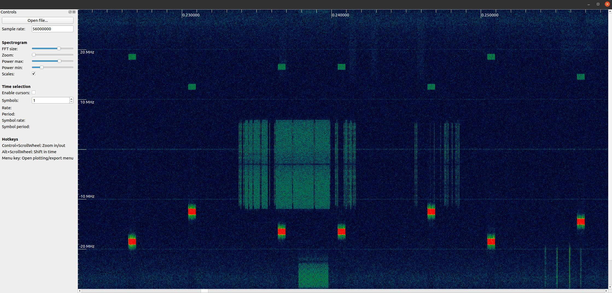
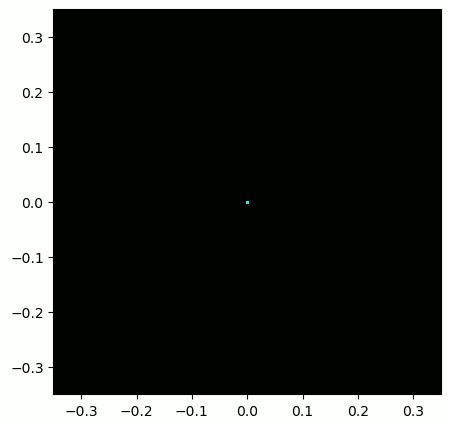

.. _iq-files-chapter:

##################
IQ Files and SigMF
##################

In all our previous Python examples we stored signals as 1D NumPy arrays of type "complex float".  In this chapter we learn how signals can be stored to a file and then read back into Python, as well as introduce the SigMF standard.  Storing signal data in a file is extremely useful; you may want to record a signal to a file in order to manually analyze it offline, or share it with a colleague, or build a whole dataset.

*************************
Binary Files
*************************

Recall that a digital signal at baseband is a sequence of complex numbers.

Example: [0.123 + j0.512,    0.0312 + j0.4123,    0.1423 + j0.06512, ...]

These numbers correspond to [I+jQ, I+jQ, I+jQ, I+jQ, I+jQ, I+jQ, I+jQ, ...]

When we want to save complex numbers to a file, we save them in the format IQIQIQIQIQIQIQIQ.  I.e., we store a bunch of floats in a row, and when we read them back we must separate them back into [I+jQ, I+jQ, ...].

While it's possible to store the complex numbers in a text file or csv file, we prefer to save them in what's called a "binary file" to save space.  At high sample rates your signal recordings could easily be multiple GB, and we want to be as memory efficient as possible.  If you have ever opened a file in a text editor and it looked incomprehensible like the screenshot below, it was probably binary.  Binary files contain a series of bytes, and you have to keep track of the format yourself.  Binary files are the most efficient way to store data, assuming all possible compression has been performed.  Because our signals usually appear like a random sequence of floats, we typically do not attempt to compress the data.  Binary files are used for plenty of other things, e.g., compiled programs (called "binaries").  When used to save signals, we call them binary "IQ files", utilizing the file extension .iq.

.. image:: ../_images/binary_file.png
   :scale: 70 % 
   :align: center 

In Python, the default complex type is np.complex128, which uses two 64-bit floats per sample.  But in DSP/SDR, we tend to use 32-bit floats instead because the ADCs on our SDRs don't have **that** much precision to warrant 64-bit floats.  In Python we will use **np.complex64**, which uses two 32-bit floats.  When you are simply processing a signal in Python it doesn't really matter, but when you go to save the 1d array to a file, you want to make sure it's an array of np.complex64 first.

*************************
Python Examples
*************************

In Python, and numpy specifically, we use the :code:`tofile()` function to store a numpy array to a file.  Here is a short example of creating a simple BPSK signal plus noise and saving it to a file in the same directory we ran our script from:

.. code-block:: python

    import numpy as np
    import matplotlib.pyplot as plt

    num_symbols = 10000

    x_symbols = np.random.randint(0, 2, num_symbols)*2-1 # -1 and 1's
    n = (np.random.randn(num_symbols) + 1j*np.random.randn(num_symbols))/np.sqrt(2) # AWGN with unity power
    r = x_symbols + n * np.sqrt(0.01) # noise power of 0.01
    print(r)
    plt.plot(np.real(r), np.imag(r), '.')
    plt.grid(True)
    plt.show()

    # Now save to an IQ file
    print(type(r[0])) # Check data type.  Oops it's 128 not 64!
    r = r.astype(np.complex64) # Convert to 64
    print(type(r[0])) # Verify it's 64
    r.tofile('bpsk_in_noise.iq') # Save to file

Now examine the details of the file produced and check how many bytes it is.  It should be num_symbols * 8 because we used np.complex64, which is 8 bytes per sample, 4 bytes per float (2 floats per sample).

Using a new Python script, we can read in this file using :code:`np.fromfile()`, like so:

.. code-block:: python

    import numpy as np
    import matplotlib.pyplot as plt

    samples = np.fromfile('bpsk_in_noise.iq', np.complex64) # Read in file.  We have to tell it what format it is
    print(samples)

    # Plot constellation to make sure it looks right
    plt.plot(np.real(samples), np.imag(samples), '.')
    plt.grid(True)
    plt.show()

A big mistake is to forget to tell np.fromfile() the file format. Binary files don't include any information about their format.  By default, np.fromfile() assumes it is reading in an array of float64s.

Most other languages have methods to read in binary files, e.g., in MATLAB you can use fread().  For visually analyzing an RF file see the section below.

If you ever find yourself dealing with int16's (a.k.a. short ints), or any other datatype that numpy doesn't have a complex equivalent for, you will be forced to read the samples in as real, even if they are actually complex.  The trick is to read them as real, but then interleave them back into the IQIQIQ... format yourself, a couple different ways of doing this are shown below:

.. code-block:: python

 samples = np.fromfile('iq_samples_as_int16.iq', np.int16).astype(np.float32).view(np.complex64)

or

.. code-block:: python

 samples = np.fromfile('iq_samples_as_int16.iq', np.int16)
 samples /= 32768 # convert to -1 to +1 (optional)
 samples = samples[::2] + 1j*samples[1::2] # convert to IQIQIQ...

*****************************
Visually Analyzing an RF File
*****************************

Although we learned how to create our own spectrogram plot in the :ref:`freq-domain-chapter` Chapter, nothing beats using an already created piece of software.  When it comes to analyzing RF recordings without having to install anything, the go-to website is `IQEngine <https://iqengine.org>`_ which is an entire toolkit for analyzing, processing, and sharing RF recordings.

For those who want a desktop app, there is also `inspectrum <https://github.com/miek/inspectrum>`_.  Inspectrum is a fairly simple but powerful graphical tool for scanning through an RF file visually, with fine control over the colormap range and FFT size (zoom amount).  You can hold alt and use the scrollwheel to shift through time.  It has optional cursors to measure the delta-time between two bursts of energy, and the ability to export a slice of the RF file into a new file.  For installation on Debian-based platforms such as Ubuntu, use the following commands:

.. code-block:: bash

 sudo apt-get install qt5-default libfftw3-dev cmake pkg-config libliquid-dev
 git clone https://github.com/miek/inspectrum.git
 cd inspectrum
 mkdir build
 cd build
 cmake ..
 make
 sudo make install
 inspectrum

   
*************************
Max Values and Saturation
*************************

When receiving samples off a SDR it's important to know the maximum sample value.  Many SDRs will output the samples as floats using a maximum value of 1.0 and minimum value of -1.0.  Other SDRs will give you samples as integers, usually 16-bit, in which case the max and min values will be +32767 and -32768 (unless otherwise specified), and you can choose to divide by 32,768 to convert them to floats from -1.0 to 1.0.  The reason to be aware of the maximum value for your SDR is due to saturation: when receiving an extremely loud signal (or if the gain is set too high), the receiver will "saturate" and it will truncate the high values to whatever the maximum sample value is.  The ADCs on our SDRs have a limited number of bits.  When making an SDR app it's wise to always be checking for saturation, and when it happens you should indicate it somehow.

A signal that is saturated will look choppy in the time domain, like this:

.. image:: ../_images/saturated_time.png
   :scale: 30 % 
   :align: center
   :alt: Example of a saturated receiver where the signal is clipped

Because of the sudden changes in time domain, due to the truncation, the frequency domain might look smeared.  In other words, the frequency domain will include false features; features that resulted from the saturation and are not actually part of the signal, which can throw people off when analyzing a signal. 

*****************************
SigMF and Annotating IQ Files 
*****************************

Since the IQ file itself doesn't have any metadata associated with it, it's common to have a 2nd file, containing information about the signal, with the same filename but a .txt or other file extension.  This should at a minimum include the sample rate used to collect the signal, and the frequency to which the SDR was tuned.  After analyzing the signal, the metadata file could include information about sample ranges of interesting features, such as bursts of energy.  The sample index is simply an integer that starts at 0 and increments every complex sample.  If you knew that there was energy from sample 492342 to 528492, then you could read in the file and pull out that portion of the array: :code:`samples[492342:528493]`.

Luckily, there is now an open standard that specifies a metadata format used to describe signal recordings, known as `SigMF <https://github.com/gnuradio/SigMF>`_.  By using an open standard like SigMF, multiple parties can share RF recordings more easily, and use different tools to operate on the same datasets, such as `IQEngine <https://iqengine.org/sigmf>`_.  It also prevents "bitrot" of RF datasets where details of the capture are lost over time due to details of the recording not being collocated with the recording itself.  

The most simple (and minimal) way to use the SigMF standard to describe a binary IQ file you have created is to rename the .iq file to .sigmf-data and create a new file with the same name but .sigmf-meta extension, and make sure the datatype field in the meta file matches the binary format of your data file.  This meta file is a plaintext file filled with json, so you can simply open it with a text editor and fill it out manually (later we will discuss doing this programmatically).  Here is an example .sigmf-meta file you can use as a template:

.. code-block::

 {
     "global": {
         "core:datatype": "cf32_le",
         "core:sample_rate": 1000000,
         "core:hw": "PlutoSDR with 915 MHz whip antenna",
         "core:author": "Art Vandelay",
         "core:version": "1.0.0"
     },
     "captures": [
         {
             "core:sample_start": 0,
             "core:frequency": 915000000
         }
     ],
     "annotations": []
 }

Note the :code:`core:cf32_le` indicates your .sigmf-data is of type IQIQIQIQ... with 32-bit floats, i.e., np.complex64 like we used previously.  Reference the specifications for other available datatypes, such as if you have real data instead of complex, or are using 16-bit integers instead of floats to save space.

Aside from datatype, the most important lines to fill out are :code:`core:sample_rate` and :code:`core:frequency`.  It is good practice to also enter information about the hardware (:code:`core:hw`) used to capture the recording, such as the SDR type and antenna, as well as a description of what is known about the signal(s) in the recording in :code:`core:description`.  The :code:`core:version` is simply the version of the SigMF standard being used at the time the metadata file was created.

If you are capturing your RF recording from within Python, e.g., using the Python API for your SDR, then you can avoid having to manually create these metadata files by using the SigMF Python package.  This can be installed on an Ubuntu/Debian based OS as follows:

.. code-block:: bash

 cd ~
 git clone https://github.com/gnuradio/SigMF.git
 cd SigMF
 sudo pip install .

The Python code to write the .sigmf-meta file for the example towards the beginning of this chapter, where we saved bpsk_in_noise.iq, is shown below:

.. code-block:: python

 import numpy as np
 import datetime as dt
 from sigmf import SigMFFile
 
 # <code from example>
 
 # r.tofile('bpsk_in_noise.iq')
 r.tofile('bpsk_in_noise.sigmf-data') # replace line above with this one
 
 # create the metadata
 meta = SigMFFile(
     data_file='example.sigmf-data', # extension is optional
     global_info = {
         SigMFFile.DATATYPE_KEY: 'cf32_le',
         SigMFFile.SAMPLE_RATE_KEY: 8000000,
         SigMFFile.AUTHOR_KEY: 'Your name and/or email',
         SigMFFile.DESCRIPTION_KEY: 'Simulation of BPSK with noise',
         SigMFFile.VERSION_KEY: sigmf.__version__,
     }
 )
 
 # create a capture key at time index 0
 meta.add_capture(0, metadata={
     SigMFFile.FREQUENCY_KEY: 915000000,
     SigMFFile.DATETIME_KEY: dt.datetime.utcnow().isoformat()+'Z',
 })
 
 # check for mistakes and write to disk
 meta.validate()
 meta.tofile('bpsk_in_noise.sigmf-meta') # extension is optional

Simply replace :code:`8000000` and :code:`915000000` with the variables you used to store sample rate and center frequency respectively. 

To read in a SigMF recording into Python, use the following code.  In this example the two SigMF files should be named :code:`bpsk_in_noise.sigmf-meta` and :code:`bpsk_in_noise.sigmf-data`.

.. code-block:: python

 from sigmf import SigMFFile, sigmffile
 
 # Load a dataset
 filename = 'bpsk_in_noise'
 signal = sigmffile.fromfile(filename)
 samples = signal.read_samples().view(np.complex64).flatten()
 print(samples[0:10]) # lets look at the first 10 samples
 
 # Get some metadata and all annotations
 sample_rate = signal.get_global_field(SigMFFile.SAMPLE_RATE_KEY)
 sample_count = signal.sample_count
 signal_duration = sample_count / sample_rate

For more details reference `the SigMF documentation <https://github.com/gnuradio/SigMF>`_.

A little bonus for those who read this far; the SigMF logo is actually stored as a SigMF recording itself, and when the signal is plotted as a constellation (IQ plot) over time, it produces the following animation:

The Python code used to read in the logo file (located `here <https://github.com/gnuradio/SigMF/tree/master/logo>`_) and produce the animated gif above is shown below, for those curious:

.. code-block:: python

 import numpy as np
 import matplotlib.pyplot as plt
 import imageio
 from sigmf import SigMFFile, sigmffile
 
 # Load a dataset
 filename = 'sigmf_logo' # assume its in the same directory as this script
 signal = sigmffile.fromfile(filename)
 samples = signal.read_samples().view(np.complex64).flatten()
 
 # Add zeros to the end so its clear when the animation repeats
 samples = np.concatenate((samples, np.zeros(50000)))
 
 sample_count = len(samples)
 samples_per_frame = 5000
 num_frames = int(sample_count/samples_per_frame)
 filenames = []
 for i in range(num_frames):
     print("frame", i, "out of", num_frames)
     # Plot the frame
     fig, ax = plt.subplots(figsize=(5, 5))
     samples_frame = samples[i*samples_per_frame:(i+1)*samples_per_frame]
     ax.plot(np.real(samples_frame), np.imag(samples_frame), color="cyan", marker=".", linestyle="None", markersize=1)
     ax.axis([-0.35,0.35,-0.35,0.35]) # keep axis constant
     ax.set_facecolor('black') # background color
     
     # Save the plot to a file
     filename = '/tmp/sigmf_logo_' + str(i) + '.png'
     fig.savefig(filename, bbox_inches='tight')
     filenames.append(filename)
 
 # Create animated gif
 images = []
 for filename in filenames:
     images.append(imageio.imread(filename))
 imageio.mimsave('/tmp/sigmf_logo.gif', images, fps=20)

