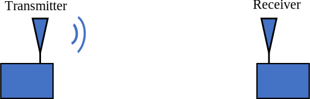

.. _link-budgets-chapter:

##################
Бюджети посилань
##################

У цій главі розглядаються бюджети каналів зв'язку, значна частина яких присвячена розумінню потужності передачі/прийому, втрат у тракті, коефіцієнту підсилення антени, шуму і SNR.  Ми закінчуємо прикладом побудови бюджету каналу зв'язку для ADS-B, тобто сигналів, які передаються комерційними літаками для обміну інформацією про своє місцезнаходження та іншою інформацією.  

*************************
Вступ
*************************

Бюджет лінії зв'язку - це облік всіх виграшів і втрат на шляху від передавача до приймача в системі зв'язку.  Бюджет каналу описує один напрямок бездротового зв'язку.  Більшість систем зв'язку є двонаправленими, тому має бути окремий бюджет для висхідної та низхідної лінії зв'язку.  "Результат" бюджету лінії зв'язку покаже вам приблизно, яке співвідношення сигнал/шум (скорочено SNR, яке використовується в цьому підручнику, або S/N) ви можете очікувати на вашому приймачі.  Подальший аналіз буде необхідний для того, щоб перевірити, чи є це SNR достатньо високим для вашого застосування.

Ви вивчаєте бюджети каналів зв'язку не для того, щоб мати можливість фактично скласти бюджет каналу зв'язку для певної ситуації, а для того, щоб вивчити і розвинути системну точку зору на бездротовий зв'язок.

Спочатку ми розглянемо бюджет потужності прийнятого сигналу, потім бюджет потужності шуму і, нарешті, об'єднаємо ці два бюджети, щоб знайти SNR (потужність сигналу, поділена на потужність шуму).

*************************
Бюджет потужності сигналу
*************************

Нижче показано найпростішу схему типового бездротового з'єднання.  У цій главі ми зосередимося на одному напрямку, тобто від передавача (Tx) до приймача (Rx).  Для даної системи ми знаємо потужність *передачі*; зазвичай це налаштування в передавачі.  Як визначити *прийняту* потужність на приймачі?

Для визначення отриманої потужності нам знадобляться чотири системні параметри, які наведено нижче з їхніми загальними скороченнями. У цьому розділі ми розглянемо кожен з них.

- **Pt** - Передавана потужність
- **Gt** - Коефіцієнт підсилення передавальної антени
- **Gr** - Коефіцієнт підсилення приймальної антени
- **Lp** - відстань між Tx і Rx (тобто, скільки втрат на бездротовому шляху)

.. image:: ../_images/tx_rx_system_params.svg
   :align: center 
   :target: ../_images/tx_rx_system_params.svg
   :alt: Зображено параметри у межах бюджету каналу зв'язку

Потужність передачі
#####################

Потужність передачі досить проста; це буде значення у ватах, дБВт або дБм (нагадаємо, що дБм - це скорочення від дБмВт).  Кожен передавач має один або кілька підсилювачів, і потужність передачі в основному залежить від цих підсилювачів.  Аналогією потужності передачі може бути номінальна потужність лампочки: чим вища потужність, тим більше світла вона випромінює.  Ось приклади приблизних значень потужності для різних технологій:

<<<<<<< HEAD
==================  ========= ==========
\                        Потужність 
------------------  --------------------
Bluetooth             10 мВт   -20 дБВт   
WiFi                 100 мВт   -10 дБВт
Базова станція LTE     1 Вт      0 дБВт
FM-станція            10 кВт    40 дБВт
==================  ========= ==========
=======
================== ======== =======
\ Потужність    
------------------ -----------------
Bluetooth           10 мВт  -20 дБВт   
WiFi               100 мВт  -10 дБВт
Базова станція LTE   1 Вт     0 дБВт
FM-станція          10 кВт   40 дБВт
================== ======== ========
>>>>>>> ceee1cb8483744518396b5e53955d51ad94ef4cf

Коефіцієнт підсилення антени
#############################

Коефіцієнт підсилення передавальної та приймальної антен має вирішальне значення для розрахунку бюджету лінії зв'язку. Що таке коефіцієнт підсилення антени, запитаєте ви?  Він вказує на спрямованість антени.  Ви можете бачити, що його називають коефіцієнтом підсилення потужності антени, але нехай це не вводить вас в оману, єдиний спосіб для антени мати більший коефіцієнт підсилення - це спрямувати енергію в більш сфокусовану область.

Коефіцієнт підсилення буде показано в дБ (без одиниць); не соромтеся дізнатися або нагадати собі, чому дБ без одиниць для нашого сценарію, в розділі :ref:`noise-chapter`.  Зазвичай антени бувають або всеспрямованими, тобто їхня потужність випромінюється в усіх напрямках, або спрямованими, тобто їхня потужність випромінюється у певному напрямку.  Якщо вони всеспрямовані, їхній коефіцієнт підсилення буде від 0 дБ до 3 дБ.  Спрямована антена має вищий коефіцієнт підсилення, зазвичай 5 дБ або вище, і десь до 60 дБ або близько того.

.. image:: ../_images/antenna_gain_patterns.png
   :scale: 80 % 
   :align: center 

Якщо використовується спрямована антена, вона повинна бути або встановлена в правильному напрямку, або прикріплена до механічного підвісу. Це також може бути фазована решітка, якою можна керувати електронно (тобто за допомогою програмного забезпечення).

.. image:: ../_images/antenna_steering.png
   :scale: 80 % 
   :align: center 
   
Всеспрямовані антени використовуються, коли неможливо спрямувати пристрій у правильному напрямку, як у вашому мобільному телефоні або ноутбуці.  У 5G телефони можуть працювати у вищих частотних діапазонах, таких як 28 ГГц (Verizon) і 39 ГГц (AT&T), використовуючи масив антен і електронне керування променем.

:: ../_images/atmospheric_attenuation.svg
   :align: center 
   :target: ../_images/atmospheric_attenuation.svg
   :alt: Графік залежності атмосферного загасання в дБ/км від частоти, що показує піки від H2O (вода) і O2 (кисень)

Рівняння потужності сигналу
############################

Тепер прийшов час скласти всі ці посилення і втрати разом, щоб обчислити потужність нашого сигналу на приймачі, :math:`P_r`:

.. math::
 P_r = P_t + G_t + G_r - L_p - L_{misc} \quad \mathrm{dBW}

Загалом, це просте рівняння. Ми додаємо прибутки і збитки. Дехто може навіть не вважати це рівнянням.  Зазвичай ми показуємо прибутки, збитки і загальну суму в таблиці, подібно до бухгалтерської звітності, ось так:

.. list-table::
   :widths: 15 10
   :header-rows: 0
   
   * - Pt = 1.0 Вт
     - 0 дБВт
   * - Gt = 100
     - 20.0 дБ
   * - Gr = 1
     - 0 дБ
   * - Lp
     - -162.0 дБ
   * - Lmisc
     - -1.0 дБ
   * - **Pr**
     - **-143.0 дБВт**

*************************
Бюджет шумопоглинання
*************************

Тепер, коли ми знаємо потужність прийнятого сигналу, давайте перейдемо до шуму, оскільки для розрахунку SNR нам потрібні обидва показники.  Ми можемо знайти прийнятий шум зі схожим бюджетом потужності.

Зараз саме час поговорити про те, звідки шум потрапляє в нашу лінію зв'язку.  Відповідь: **У приймачі!** Сигнал не спотворюється шумом, поки ми не підемо його приймати.  Дуже важливо зрозуміти цей факт! Багато студентів не зовсім його засвоюють, і в результаті роблять безглузді помилки.  Навколо нас у повітрі немає ніякого шуму. Шум виникає через те, що наш приймач має підсилювач та іншу електроніку, яка не є досконалою і не працює при температурі 0 градусів Кельвіна (К).

Популярне і просте формулювання бюджету шуму використовує підхід "kTB":

.. math::
 P_{noise} = kTB

- де :math:`k` - стала Больцмана = 1.38 x 10-23 Дж/К = **-228.6 дБВт/К/Гц**.  Для тих, кому цікаво, постійна Больцмана - це фізична константа, яка пов'язує середню кінетичну енергію частинок у газі з температурою газу.
- :math:`T` - шумова температура системи в К (хто-небудь пам'ятає кріокулери?), в значній мірі заснована на нашому підсилювачі.  Це термін, який найважче знайти, і зазвичай він дуже приблизний.  Ви можете заплатити більше за підсилювач з нижчою температурою шуму. 
- math:`B` - смуга пропускання сигналу в Гц, за умови, що ви відфільтровуєте шум навколо сигналу.  Отже, сигнал низхідної лінії зв'язку LTE шириною 10 МГц матиме значення :math:`B`, встановлене на 10 МГц, або 70 дБГц.

Віднімання (або додавання в дБ) кТБ дає потужність шуму, тобто нижній член нашого рівняння SNR.

*************************
SNR
*************************

Тепер, коли ми маємо обидва числа, ми можемо скористатися співвідношенням, щоб знайти SNR (див. розділ :ref:`noise-chapter` для отримання додаткової інформації про SNR):

.. math::
   \mathrm{SNR} = \frac{P_{signal}}{P_{noise}}

.. math::
   \mathrm{SNR_{dB}} = P_{signal\_dB} - P_{noise\_dB}

Зазвичай ми прагнемо отримати SNR > 10 дБ, хоча це залежить від конкретного застосування.  На практиці SNR можна перевірити, подивившись на БПФ прийнятого сигналу або обчисливши потужність з присутнім сигналом і без нього (нагадаємо, що дисперсія = потужність).  Чим вище SNR, тим більше бітів на символ ви можете обробляти без зайвих помилок.

*****************************************
Приклад бюджету каналу зв'язку: ADS-B
*****************************************

Автоматичне залежне спостереження-трансляція (ADS-B) - це технологія, яка використовується літаками для трансляції сигналів, що повідомляють про їхнє місцезнаходження та інший статус наземним станціям управління повітряним рухом та іншим повітряним суднам.  ADS-B є автоматичною, оскільки не вимагає участі пілота або зовнішнього втручання; вона залежить від даних з навігаційної системи літака та інших комп'ютерів.  Повідомлення не шифруються (ура!).  Наразі обладнання ADS-B є обов'язковим у частині повітряного простору Австралії, в той час як Сполучені Штати вимагають оснащення деяких літаків, залежно від їхнього розміру.

.. image:: ../_images/adsb.jpg
   :scale: 120 % 
   :align: center 
   
Фізичний (PHY) рівень ADS-B має наступні характеристики:

- Передається на частоті 1,090 МГц
- Смуга пропускання сигналу близько 2 МГц
- PPM модуляція
- Швидкість передачі даних 1 Мбіт/с, з повідомленнями від 56 до 112 мікросекунд
- Повідомлення містять 15 байт даних кожне, тому для отримання всієї інформації про літак зазвичай потрібно декілька повідомлень
- Багаторазовий доступ досягається шляхом трансляції повідомлень з періодом, який випадковим чином коливається між 0,4 і 0,6 секунди.  Ця рандомізація призначена для того, щоб запобігти накладанню всіх передач літаків одна на одну (деякі все одно можуть зіткнутися, але це не страшно)
- Антени ADS-B вертикально поляризовані
- Потужність передачі варіюється, але повинна бути в районі 100 Вт (20 дБВт)
- Коефіцієнт підсилення передавальної антени всеспрямований, але спрямований лише вниз, тому, скажімо, 3 дБ
- Приймачі ADS-B також мають всеспрямований коефіцієнт підсилення антени, тому, скажімо, 0 дБ

Втрати на шляху залежать від того, як далеко знаходиться літак від нашого приймача.  Наприклад, між Університетом Меріленда (де читався курс, на якому ґрунтується зміст цього підручника) і аеропортом BWI близько 30 км.  Давайте розрахуємо FSPL для цієї відстані і частоти 1090 МГц:

.. math::
    \mathrm{FSPL}_{dB} = 20 \log_{10} d + 20 \log_{10} f - 147.55 \left[ \mathrm{dB} \right]
    
    \mathrm{FSPL}_{dB} = 20 \log_{10} 30e3 + 20 \log_{10} 1090e6 - 147.55 \left[ \mathrm{dB} \right]

    \mathrm{FSPL}_{dB} = 122.7 \left[ \mathrm{dB} \right]

Інший варіант - залишити :math:`d` як змінну у бюджеті каналу і з'ясувати, на якій відстані ми зможемо чути сигнали, виходячи з необхідного SNR. 

Тепер, оскільки у нас точно не буде вільного місця, давайте додамо ще 3 дБ різних втрат.  Ми зробимо загальні втрати 6 дБ, щоб врахувати погане узгодження нашої антени і втрати в кабелі/конекторі.  Враховуючи всі ці критерії, наш бюджет сигнальної лінії виглядає наступним чином:

.. list-table::
   :widths: 15 10
   :header-rows: 0
   
   * - Pt
     - 20 dBW
   * - Gt
     - 3 dB
   * - Gr
     - 0 dB
   * - Lp
     - -122.7 dB
   * - Lmisc
     - -6 dB
   * - **Pr**
     - **-105.7 dBW**

Для нашого бюджету шуму:

- B = 2 МГц = 2e6 = 63 дБГц
- T ми повинні наблизити, скажімо, до 300 К, що становить 24,8 дБК.  Це буде залежати від якості приймача
- k завжди дорівнює -228,6 дБВт/К/Гц 

.. math::
 P_{шум} = k + T + B = -140.8 \quad \mathrm{dBW}
 
Отже, наш SNR становить -105.7 - (-140.8) = **35.1 дБ**.  Не дивно, що це величезне число, враховуючи, що ми стверджуємо, що знаходимося лише на відстані 30 км від літака у вільному просторі.  Якби сигнали ADS-B не могли досягати 30 км, то ADS-B не була б дуже ефективною системою - ніхто не чув би один одного, поки не опинився б дуже близько.  У цьому прикладі ми можемо легко декодувати сигнали; імпульсно-позиційна модуляція (ІПМ) є досить надійною і не вимагає такого високого SNR.  Складність полягає в тому, що ви намагаєтеся прийняти ADS-B, перебуваючи в класі, з антеною, яка дуже погано узгоджена, і потужною FM-радіостанцією поблизу, яка створює перешкоди.  Ці фактори можуть легко призвести до 20-30 дБ втрат.

Цей приклад насправді був лише приблизним розрахунком, але він продемонстрував основи створення бюджету каналу зв'язку та розуміння важливих параметрів каналу зв'язку.