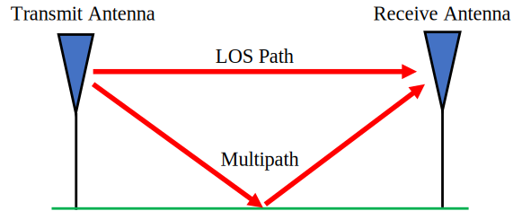
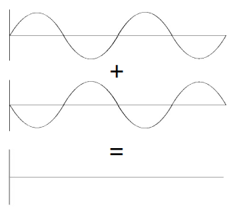
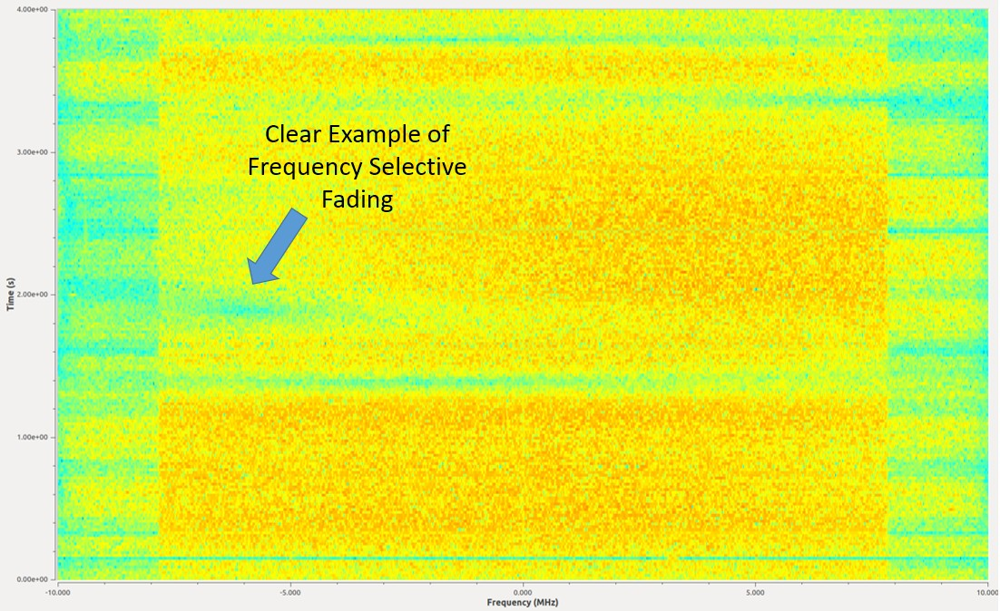
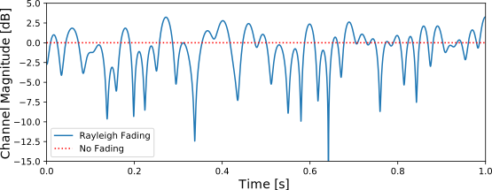

.. _multipath-chapter:

#######################
Multipath Fading
#######################

In this chapter we introduce multipath, a propagation phenomenon that results in signals reaching the receiver by two or more paths, which we experience in real-world wireless systems.  So far we have only discussed the "AWGN Channel", i.e., a model for a wireless channel where the signal is simply added to noise, which really only applies to signals over a cable and some satellite communications systems. 

*************************
Multipath
*************************

All realistic wireless channels include many "reflectors", given that RF signals bounce.  Any object between or near the transmitter (Tx) or receiver (Rx) can cause additional paths the signal travels along.  Each path experiences a different phase shift (delay) and attenuation (amplitude scaling).  At the receiver, all of the paths add up.  They can add up constructively, destructively, or a mix of both.  We call this concept of multiple signal paths "multipath".  There is the Line-of-Sight (LOS) path, and then all other paths.  In the example below, we show the LOS path and a single non-LOS path:

Destructive interference can happen if you get unlucky with how the paths sum together.  Consider the example above with just two paths.  Depending on the frequency and the exact distance of the paths, the two paths can be received 180 degrees out of phase at roughly the same amplitude, causing them to null out each other (depicted below).  You may have learned about constructive and destructive interference in physics class.  In wireless systems when the paths destructively combine, we call this interference "deep fade" because our signal briefly disappears.

Paths can also add up constructively, causing a strong signal to be received.  Each path has a different phase shift and amplitude, which we can visualize on a plot in the time domain called a "power delay profile":

.. image:: ../_images/multipath2.svg
   :align: center 
   :target: ../_images/multipath2.svg
   :alt: Multipath visualized including the power delay profile plot over time

The first path, the one closest to the y-axis, will always be the LOS path (assuming there is one) because there's no way for any other path to reach the receiver faster than the LOS path.  Typically the magnitude will decrease as the delay increases, since a path that took longer to show up at the receiver will have traveled further.

*************************
Fading
*************************

What tends to happen is we get a mix of constructive and destructive interference, and it changes over time as the Rx, Tx, or environment is moving/changing.  We use the term "fading" when referring to the effects of a multipath channel **changing** over time.  That's why we often refer to it as "multipath fading"; it's really the combination of constructive/destructive interference and a changing environment.  What we end up with is a SNR that varies over time; changes are usually on the order of milliseconds to microseconds, depending on how fast the Tx/Rx is moving.  Beneath is a plot of SNR over time in milliseconds that demonstrates multipath fading.

.. image:: ../_images/multipath_fading.png
   :scale: 100 % 
   :align: center
   :alt: Multipath fading causes deep fades or nulls periodically where the SNR drops extremely low

There are two types of fading from a **time** domain perspective:

- **Slow Fading:** The channel doesn't change within one packet's worth of data.  That is, a deep null during slow fading will wipe out the whole packet.
- **Fast Fading:** The channel changes very quickly compared to the length of one packet.  Forward error correction, combined with interleaving, can combat fast fading.

There are also two types of fading from a **frequency** domain perspective:

**Frequency Selective Fading**: The constructive/destructive interference changes within the frequency range of the signal.  When we have a wideband signal, we span a large range of frequencies.  Recall that wavelength determines whether it's constructive or destructive.  Well if our signal spans a wide frequency range, it also spans a wide wavelength range (since wavelength is the inverse of frequency).  Consequently we can get different channel qualities in different portions of our signal (in the frequency domain).  Hence the name frequency selective fading.

**Flat Fading**: Occurs when the signal's bandwidth is narrow enough that all frequencies experience roughly the same channel.  If there is a deep fade then the whole signal will disappear (for the duration of the deep fade).  

In the figure below, the :red:`red` shape shows our signal in the frequency domain, and the black curvy line shows the current channel condition over frequency.  Because the narrower signal is experiencing the same channel conditions throughout the whole signal, it's experiencing flat fading.  The wider signal is very much experiencing frequency selective fading.

.. image:: ../_images/flat_vs_freq_selective.png
   :scale: 70 % 
   :align: center
   :alt: Flat fading vs frequency selective fading

Here is an example of a 16 MHz wide signal that is continuously transmitting.  There are several moments in the middle where there's a period of time a piece of signal is missing.  This example depicts frequency selective fading, which causes holes in the signal that wipe out some frequencies but not others.

   
**************************
Simulating Rayleigh Fading
**************************

Rayleigh fading is used to model fading over time, when there is no significant LOS path.  When there is a dominant LOS path, the Rician fading model becomes more suitable, but we will be focusing on Rayleigh.  Note that Rayleigh and Rician models do not include the primarily path loss between the transmitter and receiver (such as the path loss calculated as part of a link budget), or any shadowing caused by large objects.  Their role is to model the multipath fading that occurs over time, as a result of movement and scatterers in the environment. 

There is a lot of theory that comes out of the Rayleigh fading model, such as expressions for level crossing rate and average fade duration.  But the Rayleigh fading model doesn't directly tell us how to actually simulate a channel using the model.  To generate Rayleigh fading in simulation we have to use one of many published methods, and in the following Python example we will be using Clarke's "sum-of-sinusoids" method.

To generate a Rayleigh fading channel in Python we need to first specify the max Doppler shift, in Hz, which is based on how fast the transmitter and/or receiver is moving, denoted :math:`\Delta v`.  When the velocity is small compared to the speed of light, which will always be the case in wireless communications, the Doppler shift can be calculated as:

.. math::

  f_D = \frac{\Delta v f_c}{c} 
  
where :math:`c` is the speed of light, roughly 3e8 m/s, and :math:`f_c` is the carrier frequency being transmitted on.  

We also choose how many sinusoids to simulate, and there's no right answer because it's based on the number of scatterers in the environment, which we never actually know.  As part of the calculations we assume the phase of the received signal from each path is uniformly random between 0 and :math:`2\pi`.  The following code simulates a Rayleigh fading channel using Clarke's method:

.. code-block:: python

    import numpy as np
    import matplotlib.pyplot as plt

    # Simulation Params, feel free to tweak these
    v_mph = 60 # velocity of either TX or RX, in miles per hour
    center_freq = 200e6 # RF carrier frequency in Hz
    Fs = 1e5 # sample rate of simulation
    N = 100 # number of sinusoids to sum

    v = v_mph * 0.44704 # convert to m/s
    fd = v*center_freq/3e8 # max Doppler shift
    print("max Doppler shift:", fd)
    t = np.arange(0, 1, 1/Fs) # time vector. (start, stop, step)
    x = np.zeros(len(t))
    y = np.zeros(len(t))
    for i in range(N):
        alpha = (np.random.rand() - 0.5) * 2 * np.pi
        phi = (np.random.rand() - 0.5) * 2 * np.pi
        x = x + np.random.randn() * np.cos(2 * np.pi * fd * t * np.cos(alpha) + phi)
        y = y + np.random.randn() * np.sin(2 * np.pi * fd * t * np.cos(alpha) + phi)

    # z is the complex coefficient representing channel, you can think of this as a phase shift and magnitude scale
    z = (1/np.sqrt(N)) * (x + 1j*y) # this is what you would actually use when simulating the channel
    z_mag = np.abs(z) # take magnitude for the sake of plotting
    z_mag_dB = 10*np.log10(z_mag) # convert to dB

    # Plot fading over time
    plt.plot(t, z_mag_dB)
    plt.plot([0, 1], [0, 0], ':r') # 0 dB
    plt.legend(['Rayleigh Fading', 'No Fading'])
    plt.axis([0, 1, -15, 5])
    plt.show()

If you are intending to use this channel model as part of a larger simulation, you would simply multiply the received signal by the complex number :code:`z`, representing flat fading.   The value :code:`z` would then update every time step.  This means all frequency components of the signal experience the same channel at any given moment in time, so you would **not** be simulating frequency selective fading, that requires a multi-tap channel impulse response which we will not get into in this chapter.  If we look at the magnitude of :code:`z`, we can see the Rayleigh fading over time:

Note the deep fades that occur briefly, as well as the small fraction of time where the channel is actually performing better than if there was no fading at all.  

****************************
Mitigating Multipath Fading
****************************

In modern communications, we have developed ways to combat multipath fading.  

CDMA
#####

3G cellular uses a technology called code division multiple access (CDMA).  With CDMA you take a narrowband signal and spread it over a wide bandwidth before transmitting it (using a spread spectrum technique called DSSS).  Under frequency selective fading, it's unlikely that all frequencies will be in a deep null at the same time.  At the receiver the spreading is reversed, and this de-spreading process greatly mitigates a deep null.

.. image:: ../_images/cdma.png
   :scale: 100 % 
   :align: center 

OFDM 
#####

4G cellular, WiFi, and many other technologies use a scheme called orthogonal frequency-division multiplexing (OFDM).  OFDM uses something called subcarriers, where we split up the signal in the frequency domain into a bunch of narrow signals squashed together.  To combat multipath fading we can avoid assigning data to subcarriers that are in a deep fade, although it requires the receiving end to send channel information back to the transmitter quick enough.  We can also assign high order modulation schemes to subcarriers with great channel quality to maximize our data rate.

