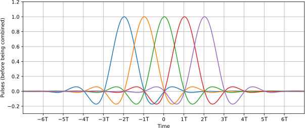
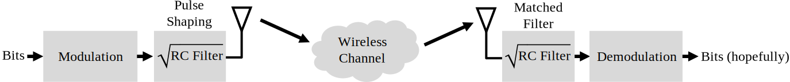
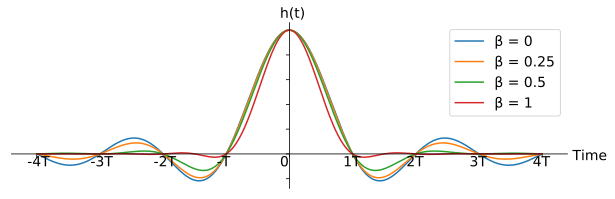
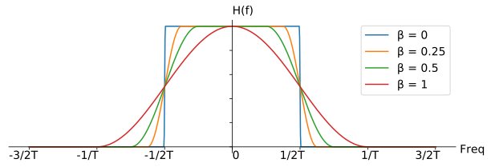
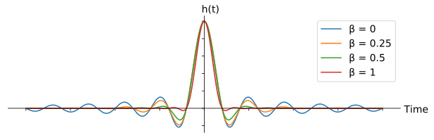
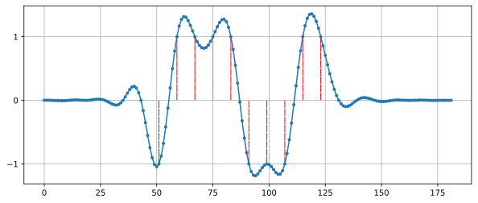

.. _pulse-shaping-chapter:

#######################
Pulse Shaping
#######################

У цій главі розглядається формування імпульсів, міжсимвольна інтерференція, узгоджена фільтрація та фільтри з підвищеною косинусністю.  Наприкінці ми використаємо Python для додавання формування імпульсів до символів BPSK.  Ви можете розглянути цей розділ у частині II розділу "Фільтри", де ми глибше зануримося у формування імпульсів.

**********************************
Міжсимвольна інтерференція (ISI)
**********************************

У розділі :ref:`filters-chapter` ми дізналися, що символи/імпульси блокової форми використовують надмірну кількість спектра, і ми можемо значно зменшити кількість спектра, що використовується, "формуючи" наші імпульси.  Однак, ви не можете використовувати будь-який низькочастотний фільтр, інакше ви можете отримати міжсимвольну інтерференцію (ISI), коли символи вливаються один в одного і заважають один одному.

Коли ми передаємо цифрові символи, ми передаємо їх один за одним (а не чекаємо деякий час між ними).  Коли ви застосовуєте фільтр, що формує імпульс, він подовжує імпульс у часовій області (щоб ущільнити його за частотою), що призводить до того, що сусідні символи накладаються один на одного.  Таке перекриття є нормальним, якщо ваш фільтр відповідає одному критерію: всі імпульси повинні дорівнювати нулю при кожному кратному періоді нашого символу :math:`T`, за винятком одного з імпульсів.  Найкраще цю ідею можна зрозуміти за допомогою наступної візуалізації:

Як ви можете бачити, на кожному інтервалі :math:`T` є один пік імпульсу, тоді як решта імпульсів дорівнює 0 (вони перетинають вісь x).  Коли приймач робить вибірку сигналу, він робить це в ідеальний момент часу (на піку імпульсів), тобто це єдиний момент часу, який має значення.  Зазвичай у приймачі є блок синхронізації символів, який забезпечує вибірку символів на піках.

**********************************
Узгоджений фільтр
**********************************

Один з трюків, який ми використовуємо в бездротовому зв'язку, називається узгодженою фільтрацією.  Щоб зрозуміти суть узгодженої фільтрації, ви повинні спочатку зрозуміти ці два моменти:

1. Імпульси, які ми обговорювали вище, повинні бути ідеально вирівняні лише на приймачі перед вибіркою.  До цього моменту не має значення, чи є ISI, тобто сигнали можуть летіти по повітрю з ISI і це нормально.

2. Нам потрібен фільтр низьких частот у передавачі, щоб зменшити кількість спектру, який використовує наш сигнал.  Але приймач також потребує низькочастотного фільтра, щоб усунути якомога більше шуму/перешкод поруч із сигналом.  В результаті ми маємо фільтр низьких частот на передавачі (Tx) і ще один на приймачі (Rx), а дискретизація відбувається після обох фільтрів (і впливу бездротового каналу).

Що ми робимо в сучасному зв'язку, так це ділимо фільтр формування імпульсів порівну між Tx і Rx.  Це не обов'язково повинні бути ідентичні фільтри, але теоретично оптимальним лінійним фільтром для максимізації SNR за наявності AWGN є використання *однакового* фільтра на Tx і Rx.  Ця стратегія називається концепцією "узгодженого фільтра".

Інший спосіб мислення про узгоджені фільтри полягає в тому, що приймач співвідносить отриманий сигнал з відомим шаблонним сигналом.  Шаблонний сигнал - це, по суті, імпульси, які надсилає передавач, незалежно від фазових/амплітудних зсувів, що застосовуються до них.  Нагадаємо, що фільтрація здійснюється шляхом згортки, яка по суті є кореляцією (насправді вони математично однакові, коли шаблон симетричний).  Цей процес кореляції отриманого сигналу з шаблоном дає нам найкращий шанс відновити те, що було надіслано, і саме тому він є теоретично оптимальним.  Як аналогію, уявіть собі систему розпізнавання зображень, яка шукає обличчя, використовуючи шаблон обличчя і двовимірну кореляцію:

.. image:: ../_images/face_template.png
   :scale: 70 
   :align: center 

**********************************
Розділення фільтра навпіл
**********************************

Як насправді розділити фільтр навпіл?  Згортання є асоціативним, що означає:

.. математично::
 (f * g) * h = f * (g * h)

Уявімо собі :math:`f` як наш вхідний сигнал, а :math:`g` і :math:`h` - це фільтри.  Фільтрація :math:`f` за допомогою :math:`g`, а потім :math:`h` - це те ж саме, що і фільтрація одним фільтром, рівним :math:`g * h`.

Також нагадаємо, що згортка у часовій області - це множення у частотній області:

.. math::
 g(t) * h(t) \leftrightarrow G(f)H(f)
 
Щоб розділити фільтр навпіл, можна взяти квадратний корінь з частотної характеристики.

.. math::
 X(f) = X_H(f) X_H(f) \quad \mathrm{де} \quad X_H(f) = \sqrt{X(f)}

Нижче показано спрощену схему ланцюга передачі та прийому з фільтром піднесеного косинуса (RC), розділеним на два фільтри кореневого піднесеного косинуса (RRC); той, що на стороні передачі, є фільтром формування імпульсів, а той, що на стороні прийому, є узгодженим фільтром.  Разом вони призводять до того, що імпульси на демодуляторі виглядають так, ніби вони були сформовані одним RRC-фільтром.

**********************************
Специфічні фільтри формування імпульсів
**********************************

Ми знаємо, що ми хочемо:

1. Спроектувати фільтр, який зменшує смугу пропускання нашого сигналу (щоб використовувати менше спектру) і всі імпульси, крім одного, повинні дорівнювати нулю через кожний символьний інтервал.

2. Розділити фільтр навпіл, помістивши одну половину в Tx, а іншу в Rx.

Давайте розглянемо деякі конкретні фільтри, які зазвичай використовуються для формування імпульсів.

Фільтр піднесеного косинуса
#########################

Найпопулярнішим фільтром, що формує імпульс, здається, є фільтр "піднесеного косинуса".  Це хороший фільтр низьких частот для обмеження смуги пропускання, яку займатиме наш сигнал, а також він має властивість обнулятися на інтервалах :math:`T`:

Зверніть увагу, що наведений вище графік наведено у часовій області. На ньому зображено імпульсну характеристику фільтра.  Параметр :math:`\beta` є єдиним параметром для фільтра піднесеного косинуса, і він визначає швидкість спадання фільтра в часовій області, яка буде обернено пропорційна швидкості спадання в частотній області:

Причина, чому він називається фільтром з піднятим косинусом, полягає в тому, що частотна область при :math:`\beta = 1` являє собою півперіод косинусоїдальної хвилі, піднятої вгору, щоб розташуватися на осі x.

Рівняння, яке визначає імпульсну характеристику фільтра з піднятими косинусами, має вигляд:

.. math::
 h(t) = \frac{1}{T} \mathrm{sinc}\left( \frac{t}{T} \right) \frac{\cos\left(\frac{\pi\beta t}{T}\right)}{1 - \left( \frac{2 \beta t}{T} \right)^2}

Більш детальну інформацію про функцію :math:`\mathrm{sinc}()` можна знайти `тут <https://en.wikipedia.org/wiki/Sinc_function>`_.

Пам'ятайте: ми ділимо цей фільтр між Tx і Rx порівну.  Введіть фільтр кореневого піднесеного косинуса (RRC)!

Фільтр кореневого піднесеного косинуса
#########################

Фільтр кореневого піднесеного косинуса (RRC) - це те, що ми фактично застосовуємо в наших Tx і Rx. Разом вони утворюють звичайний фільтр піднесеного косинуса, як ми вже обговорювали.  Оскільки поділ фільтра навпіл включає в себе квадратний корінь з частотної області, імпульсна характеристика стає трохи заплутаною:

.. image:: ../_images/rrc_filter.png
   :scale: 70 % 
   :align: center 

На щастя, цей фільтр широко використовується, і для нього існує багато реалізацій, зокрема `у Python <https://commpy.readthedocs.io/en/latest/generated/commpy.filters.rrcosfilter.html>`_.

Інші фільтри формування імпульсів
###########################

Інші фільтри включають фільтр Гауса, який має імпульсну характеристику, що нагадує функцію Гауса.  Існує також синусоїдальний фільтр, який еквівалентний фільтру піднесеного косинуса, коли :math:`\beta = 0`.  Синусоїдальний фільтр є більш ідеальним фільтром, тобто він усуває необхідні частоти без значної перехідної області.

**********************************
Коефіцієнт згортання
**********************************

Давайте розглянемо параметр :math:`\beta`.  Це число від 0 до 1, яке називають фактором "згортання" або іноді "надлишковою смугою пропускання".  Він визначає, як швидко у часовій області фільтр згортається до нуля.  Нагадаємо, що для використання в якості фільтра імпульсна характеристика повинна спадати до нуля з обох боків:

Чим нижче значення :math:`\beta`, тим більше потрібно відводів фільтра.  При :math:`\beta=0` імпульсна характеристика ніколи повністю не досягає нуля, тому ми намагаємося зробити :math:`\beta` якомога нижчою, не викликаючи інших проблем.  Чим меншим є спадання, тим більш компактним за частотою ми можемо створити наш сигнал для заданої швидкості передачі, що завжди важливо.

Загальне рівняння, яке використовується для наближеного обчислення смуги пропускання у Гц для заданої швидкості передачі символів і коефіцієнта рол-офф, має вигляд:

.. math::
    \mathrm{BW} = R_S(\beta + 1)

:math:`R_S` - це символьна швидкість у Гц.  Для бездротового зв'язку ми зазвичай використовуємо значення від 0,2 до 0,5.  Як правило, цифровий сигнал, який використовує частоту символів :math:`R_S`, займатиме трохи більше, ніж :math:`R_S` спектра, включаючи як позитивну, так і негативну частини спектра.  Після перетворення і передачі нашого сигналу, обидві сторони, безумовно, мають значення.  Якщо ми передаємо QPSK зі швидкістю 1 мільйон символів на секунду (MSps), це займе близько 1,3 МГц.  Швидкість передачі даних становитиме 2 Мбіт/с (нагадаємо, що QPSK використовує 2 біти на символ), включаючи всі накладні витрати, такі як кодування каналу і заголовки кадрів.

**********************************
Вправа на Python
**********************************

В якості вправи на Python давайте відфільтруємо і сформуємо деякі імпульси.  Ми будемо використовувати символи BPSK, щоб було легше візуалізувати - до етапу формування імпульсів, BPSK передбачає передачу 1 або -1 з частиною "Q", що дорівнює нулю.  З Q, що дорівнює нулю, ми можемо побудувати графік лише частини I, і на нього легше дивитися.

У цій симуляції ми використаємо 8 відліків на символ, і замість прямокутного сигналу, що складається з 1 та -1, ми використаємо імпульсну послідовність імпульсів.  Коли ви пропускаєте імпульс через фільтр, на виході виходить імпульсна характеристика (звідси і назва).  Тому, якщо ви хочете отримати серію імпульсів, вам потрібно використовувати імпульси з нулями між ними, щоб уникнути прямокутних імпульсів.

.. code-block:: python

    import numpy as np
    import matplotlib.pyplot as plt
    з scipy імпортуємо сигнал

    num_symbols = 10
    sps = 8

    bits = np.random.randint(0, 2, num_symbols) # Наші дані для передачі, 1 та 0

    x = np.array([])
    для біта в бітах:
        pulse = np.zeros(sps)
        pulse[0] = bit*2-1 # встановлюємо перше значення в 1 або -1
        x = np.concatenate((x, pulse)) # додаємо 8 відліків до сигналу
    plt.figure(0)
    plt.plot(x, '.-')
    plt.grid(True)
    plt.show()

.. image:: ../_images/pulse_shaping_python1.png
   :scale: 80 % 
   :align: center
   :alt: Послідовність імпульсів у часовій області, змодельована у Python

На цьому етапі наші символи все ще складаються з 1 та -1.  Не зациклюйтеся на тому, що ми використали імпульси.  Насправді, може бути простіше *не* візуалізувати реакцію на імпульси, а думати про неї як про масив:

.. code-block:: python

 бітів: [0, 1, 1, 1, 1, 0, 0, 0, 1, 1]
 BPSK символи: [-1, 1, 1, 1, 1, -1, -1, -1, 1, 1]
 Застосування 8 відліків на символ: [-1, 0, 0, 0, 0, 0, 0, 0, 1, 0, 0, 0, 0, 0, 0, 0, 1, 0, 0, 0, 0, 0, 0, 0, ...]

Ми створимо фільтр підвищеного косинуса, використовуючи :math:`\beta` 0.35, і зробимо його довжиною 101 відведення, щоб дати сигналу достатньо часу для затухання до нуля.  Хоча рівняння піднесеного косинуса запитує наш період символу і вектор часу :math:`t`, ми можемо припустити, що період **вибірки** дорівнює 1 секунді, щоб "нормалізувати" нашу симуляцію.  Це означає, що наш період символу :math:`Ts` дорівнює 8, оскільки ми маємо 8 відліків на символ.  Тоді наш вектор часу буде списком цілих чисел.  Зважаючи на те, як працює рівняння піднесеного косинуса, ми хочемо, щоб точка :math:`t=0` була в центрі.  Ми згенеруємо вектор часу довжиною 101, починаючи з -51 і закінчуючи +51.

.. code-block:: python

    # Створюємо наш фільтр підвищеного косинуса
    num_taps = 101
    beta = 0.35
    Ts = sps # Припустимо, що частота дискретизації дорівнює 1 Гц, період дискретизації дорівнює 1, період *символу* дорівнює 8
    t = np.arange(num_taps) - (num_taps-1)//2
    h = 1/Ts*np.sinc(t/Ts) * np.cos(np.pi*beta*t/Ts) / (1 - (2*beta*t/Ts)**2)
    plt.figure(1)
    plt.plot(t, h, '.')
    plt.grid(True)
    plt.show()

.. image:: ../_images/pulse_shaping_python2.png
   :scale: 80 % 
   :align: center 

Зверніть увагу, що вихідні дані однозначно спадають до нуля.  Той факт, що ми використовуємо 8 відліків на символ, визначає, наскільки вузьким виглядає цей фільтр і як швидко він спадає до нуля.  Наведена вище імпульсна характеристика виглядає як типовий низькочастотний фільтр, і ми не можемо визначити, що це саме фільтр, який формує імпульс, а не будь-який інший низькочастотний фільтр.

Нарешті, ми можемо відфільтрувати наш сигнал :math:`x` і дослідити результат.  Не зосереджуйтесь на введенні циклу for у наведеному коді.  Ми обговоримо, навіщо він тут, після блоку коду.

.. code-block:: python 
 
    # Фільтруємо наш сигнал, щоб застосувати формування імпульсу
    x_shaped = np.convolve(x, h)
    plt.figure(2)
    plt.plot(x_shaped, '.-')
    for i in range(num_symbols):
        plt.plot([i*sps+num_taps//2,i*sps+num_taps//2], [0, x_shaped[i*sps+num_taps//2]])
    plt.grid(True)
    plt.show()

Цей результуючий сигнал складається з багатьох наших імпульсних відгуків, приблизно половина з яких спочатку множиться на -1.  Це може виглядати складно, але ми пройдемо через це разом.

По-перше, через фільтр і спосіб роботи згортки є перехідні відліки до і після даних.  Ці додаткові відліки включаються в нашу передачу, але насправді вони не містять "піків" імпульсів.

Secondly, the vertical lines were created in the for loop for visualization's sake.  They are meant to demonstrate where intervals of :math:`Ts` occur.  These intervals represent where this signal will be sampled by the receiver.  Observe that for intervals of :math:`Ts` the curve has the value of exactly 1.0 or -1.0, making them the ideal points in time to sample.

If we were to upconvert and transmit this signal, the receiver would have to determine when the boundaries of :math:`Ts` are e.g., using a symbol synchronization algorithm.  That way the receiver knows *exactly* when to sample to get the right data.  If the receiver samples a little too early or late, it will see values that are slightly skewed due to ISI, and if it's way off then it will get a bunch of weird numbers.

Here is an example, created using GNU Radio, that illustrates what the IQ plot (a.k.a. constellation) looks like when we sample at the right and wrong times.  The original pulses have their bit values annotated.

.. image:: ../_images/symbol_sync1.png
   :scale: 50 % 
   :align: center 

The below graph represents the ideal position in time to sample, along with the IQ plot:

.. image:: ../_images/symbol_sync2.png
   :scale: 40 % 
   :align: center
   :alt: GNU Radio simulation showing perfect sampling as far as timing

Compare that to the worst time to sample.  Notice the three clusters in the constellation.  We are sampling directly in between each symbol; our samples are going to be way off.

.. image:: ../_images/symbol_sync3.png
   :scale: 40 % 
   :align: center 
   :alt: GNU Radio simulation showing imperfect sampling as far as timing

Here is another example of a poor sample time, somewhere in between our ideal and worst cases. Heed the four clusters.  With a high SNR we might be able to get away with this sampling time interval, though it isn't advisable.

.. image:: ../_images/symbol_sync4.png
   :scale: 40 % 
   :align: center 
   По-друге, вертикальні лінії були створені в циклі for для наочності.  Вони призначені для демонстрації того, де зустрічаються інтервали :math:`Ts`.  Ці інтервали показують, де цей сигнал буде дискретизовано приймачем.  Зверніть увагу, що для інтервалів :math:`Ts` крива має значення точно 1.0 або -1.0, що робить їх ідеальними моментами часу для дискретизації.

Якби ми хотіли перетворити і передати цей сигнал, приймач мав би визначити, коли знаходяться межі :math:`Ts`, наприклад, за допомогою алгоритму символьної синхронізації.  Таким чином, приймач знає, коли саме робити вибірку, щоб отримати правильні дані.  Якщо приймач зробить вибірку занадто рано або занадто пізно, він побачить значення, які будуть дещо викривлені через ISI, а якщо занадто пізно, то отримає купу дивних чисел.

Ось приклад, створений за допомогою GNU Radio, який ілюструє, як виглядає графік IQ (так зване сузір'я), коли ми робимо вибірки у правильний і неправильний час.  Оригінальні імпульси мають бітові значення з анотаціями.

.. image:: ../_images/symbol_sync1.png
   :scale: 50 % 
   :align: center 

Наведений нижче графік показує ідеальну позицію в часі для дискретизації, а також графік IQ:

.. image:: ../_images/symbol_sync2.png
   :scale: 40 % 
   :align: center
   :alt: Симуляція GNU Radio, яка демонструє ідеальну вибірку за часом

Порівняйте це з найгіршим часом для вибірки.  Зверніть увагу на три кластери у сузір'ї.  Ми робимо вибірку безпосередньо між кожним символом; наші вибірки будуть далекими від ідеальних.

.. image:: ../_images/symbol_sync3.png
   :scale: 40 % 
   :align: center 
   :alt: Симуляція GNU Radio, яка демонструє недосконалу вибірку за часом

Ось ще один приклад поганого часу дискретизації, десь між нашим ідеальним і найгіршим випадками. Зверніть увагу на чотири кластери.  З високим SNR ми могли б уникнути такого інтервалу часу вибірки, хоча це і не рекомендується.

.. image:: ../_images/symbol_sync4.png
   :scale: 40 % 
   :align: center 
   
Пам'ятайте, що наші значення Q не показані на часовому графіку, оскільки вони приблизно дорівнюють нулю, що дозволяє графіку IQ поширюватися лише по горизонталі.

Remember that our Q values are not shown on the time domain plot because they are roughly zero, allowing the IQ plots to spread horizontally only.
