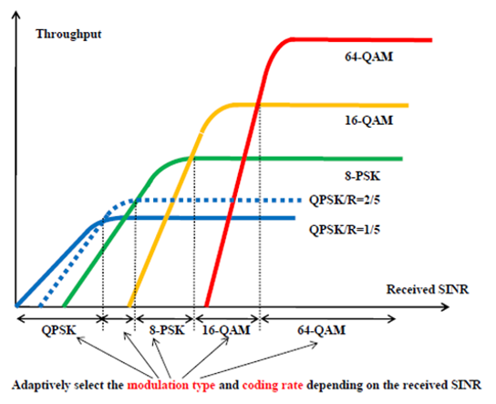
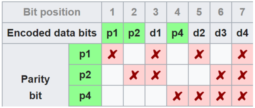

.. _channel-coding-chapter:

#####################
Channel Coding
#####################

In this chapter we introduce the basics of channel coding, a.k.a. forward error correction (FEC).  Channel coding is an enormous area within wireless communications.  It is a branch of "information theory", which is the study of the quantification, storage, and communication of information.

***************************
Why We Need Channel Coding
***************************

As we learned in the :ref:`noise-chapter` chapter, wireless channels are noisy, and our digital symbols won't reach the receiver perfectly.  If you have taken a networking course, you may already know about cyclic redundancy checks (CRCs), which **detect** errors at the receiving end.  The purpose of channel coding is to detect **and correct** errors at the receiver.  If we allow some room for error, then we can transmit at a higher order modulation scheme, for example, without having a broken link.  As a visual example, consider the following constellations showing QPSK (left) and 16QAM (right) under the same amount of noise.  QPSK provides 2 bits per symbol, while 16QAM is twice the data rate at 4 bits per symbol.  But note how in the QPSK constellation that the symbols tend to not pass the symbol decision boundary, or the x-axis and y-axis, which means the symbols will be received correctly.  Meanwhile in the 16QAM plot, there is overlap in the clusters, and, as a result, there will be many incorrectly received symbols.

.. image:: ../_static/qpsk_vs_16qam.png
   :scale: 90 % 
   :align: center 
   
A failed CRC usually results in a retransmission, at least when using a protocol like TCP.  If Alice is sending a message to Bob, we would rather not have to make Bob send a message back to Alice requesting the information again.  The purpose of channel coding is to transmit **redundant** information. The redundancy is a failsafe that reduces the amount of erroneous packets, retransmissions, or dropped data.

We discussed why we need channel coding, so let's see where it occurs in the transmit-receive chain:

.. image:: ../_static/tx_rx_chain.png
   :scale: 60 % 
   :align: center 

Observe that there are multiple encoding steps in the transmit-receive chain. Source coding, our first step, is not the same as channel coding; source coding is meant to compress the data to be transmitted as much as possible, just like when you zip files to reduce the space taken.  Namely the output of the source encoding block should be **smaller** than the data input, but the output of channel encoding will be larger than its input because redundancy is added.

***************************
Types of Codes
***************************

To perform channel coding we use an "error correction code".  This code tells us, given the bits we have to transmit, what bits do we actually transmit?  The most basic code is called "repetition coding", and it's when you simply repeat a bit N times in a row.  For repetition-3 code, one would transmit each bit three times:

.. role::  raw-html(raw)
    :format: html

- 0 :raw-html:`&rarr;` 000
- 1 :raw-html:`&rarr;` 111

The message 10010110 is transmitted as 111000000111000111111000 after channel encoding.

Some codes work on "blocks" of input bits, while others use a stream approach. Codes that work on blocks, data of a definite length, are called "Block Codes", while codes that work on a stream of bits, where data length is arbitrary, are called "Convolutional Codes".  These are the two primary types of codes.  Our repetition-3 code is a block code where each block is three bits.

As an aside, these error correction codes are not solely used in channel coding for wireless links.  Ever store information to a hard drive or SSD and wonder how there are never bit errors when reading information back off?  Writing, then reading, from memory is similar to a communication system.  Hard drive/SSD controllers have error correction built in. It's transparent to the OS and can be proprietary since it's all onboard the hard drive/SSD.  For portable media like CDs, the error correction must be standardized.  Reed-Solomon codes were common in CD-ROMs.

***************************
Code-Rate
***************************

All error correction includes some form of redundancy.  That means if we want to transmit 100 bits of information, we will have to actually send **more than** 100 bits.  "Code-rate" is the ratio between the number of information bits and the total number of bits sent (i.e., information plus redundancy bits).  Returning to the repetition-3 coding example, if I have 100 bits of information then we can determine the following:

- 300 bits are sent
- Only 100 bits represent information
- Code-rate = 100/300 = 1/3

The code-rate will always be less than 1, as there is a trade-off between redundancy and throughput.  A lower code-rate means more redundancy and less throughput.

***************************
Modulation and Coding
***************************

In the :ref:`modulation-chapter` chapter we tackled noise in modulation schemes. At a low SNR you need a low-order modulation scheme (e.g., QPSK) to deal with the noise, and at a high SNR you can use modulation like 256QAM to get more bits per second.  Channel coding is the same; you want lower code-rates at low SNRs, and at high SNRs you can use a code-rate of almost 1.  Modern communications systems have a set of combined modulation and coding schemes, called MCS.  Each MCS specifies a modulation scheme and a coding scheme to be used at specific noise levels.

Modern communications adaptively change the MCS in real-time based on the wireless channel conditions.  The receiver sends feedback about channel quality to the transmitter.  Feedback must be shared before the wireless channel quality changes, which could be on the order of ms.  This adaptive process leads to the highest throughput communications possible, and is used by modern technologies like LTE, 5G, and WiFi. Beneath is a visualization of a tower changing modulation schemes and coding rates during transmission.

.. image:: ../_static/adaptive_mcs.png
   :scale: 80 % 
   :align: center 

When using adaptive MCS, if you plot throughput over SNR, you get a staircase-shaped curve like the graph below.  Protocols like LTE often have a table indicating which MCS should be used at what SNR.

***************************
Hamming Code
***************************

Let's look at a simple error correcting codes.  Hamming Code was the first non-trivial code developed.  In the late 1940s Richard Hamming worked at Bell Labs, using an electromechanical computer that used punched paper tape.  When errors in the machine were detected, it would stop and operators would have to fix them. Hamming grew frustrated with having to restart his programs from scratch due to detected errors.  He said, "Damn it, if the machine can detect an error, why can't it locate the position of the error and correct it?"  He spent the next few years developing the Hamming Code so the computer could do exactly that.

In Hamming Codes, extra bits, called parity bits or check bits, are added to information for redundancy.  All bit positions that are powers of two are parity bits: 1, 2, 4, 8, and etc. The other bit positions are for information. The table beneath this paragraph highlighs parity bits in green.  Each parity bit "covers" all bits where the bitwise AND of the parity and the bit position is non-zero, marked with a red X below.  If we want to use a data bit, we need the parity bits that cover it.  To be able to go up to data bit d9, we need parity bit p8 and all the parity bits that come before it, so this table tells us how many parity bits we need for a certain number of bits.  This pattern continues indefinitely.

.. image:: ../_static/hamming.png
   :scale: 60 % 
   :align: center 

Hamming codes are block codes so they operate on N data bits at a time.  So with three parity bits we can operate on blocks of four data bits at a time.  We represent this error encoding scheme as Hamming(7,4), where the first argument is the total bits transmitted and the second argument is the bits of data.

The following are three important properties of Hamming codes:

- The minimal number of bit changes needed to go from any code word to any other code word is three
- It can correct one-bit errors
- It can detect but not correct two-bit errors

Algorithmically, the coding process can be done using a simple matrix multiply, using what is called the "generator matrix".  In the example below, the vector 1011 is the data to be encoded, i.e., the information we want to send to the receiver.  The 2D matrix is the generator matrix, and it defines the code scheme.  The result of the multiply provides the code word to transmit.

The point of diving into Hamming codes was to give a taste of how error coding works.  Block codes tend to follow this type of pattern.  Convolutional codes work differently, but we won't get into it here; they often use Trellis-style decoding, which can be displayed in a diagram that looks like this:

.. image:: ../_static/trellis.png
   :scale: 100 % 
   :align: center 

***************************
Soft vs Hard Decoding
***************************

Recall that at the receiver demodulation occurs before decoding.  The demodulator can tell us its best guess as to which symbol was sent, or it can output the "soft" value.  For BPSK, instead of telling us 1 or 0, the demodulator can say 0.3423 or -1.1234, whatever the "soft" value of the symbol was.  Typically the decoding is designed to use hard or soft values.

- **Soft decision decoding** – uses the soft values
- **Hard decision decoding** – uses only the 1s and 0s

Soft is more robust because you are using all of the information at your disposal, but soft is also much more complicated to implement.  The Hamming Codes we talked about used hard decisions, while convolutional codes tend to use soft.

***************************
Shannon Limit
***************************

The Shannon limit or Shannon capacity is an incredible piece of theory that tell us how many bits per second of error-free information we can send:

.. math::
 C = B \cdot log_2 \left( 1 + \frac{S}{N}   \right)

- C – Channel capacity [bits/sec]
- B – Bandwidth of channel [Hz]
- S – Average received signal power [watts]
- N – Average noise power [watts]

This equation represents the best any MCS can do when operating at a high enough SNR to be error-free.  It makes more sense to plot the limits in bits/sec/Hz, i.e., bits/sec per amount of spectrum:

.. math::
 \frac{C}{B} = log_2 \left( 1 + \mathrm{SNR}   \right)

When actually plotting it, we usually represent SNR in dB, using a log scale for the x-axis:

.. image:: ../_static/shannon_limit.svg
   :align: center 

If you see Shannon limit plots elsewhere that look a little different, they are probably using an x-axis of "energy per bit" or :math:`E_b/N_0`, which is just an alternative to working in SNR.

It might help simplify things to realize when the SNR is fairly high (e.g., 10 dB or higher), the Shannon limit can be approximated as :math:`log_2 \left( \mathrm{SNR_{dB}} \right)`, which is roughly :math:`(\mathrm{SNR_{dB}})/3`.  For example, at 24 dB SNR you're looking at 8 bits/sec/Hz, so if you have 1 MHz to use, that's 8 Mbps.  You might be thinking, "well that's just the theoretical limit", but modern communications get fairly close to that limit, so at a minimum it gives you a rough ballpark.  You can always cut that number in half to take into account packet/frame overhead and non-ideal MCS.

The max throughput of 802.11n WiFi operating in the 2.4 GHz band (which uses 20 MHz wide channels), according to the specs, is 300 Mbps.  Obviously you could sit right next to your router and get an extremely high SNR, maybe 60 dB, but to be reliable/practical the max throughput MCS (recall the staircase curve from above) is unlikely to require an SNR that high.  You can even take a look at the `MCS list for 802.11n <https://en.wikipedia.org/wiki/IEEE_802.11n-2009#Data_rates>`_.  802.11n goes up to 64-QAM, and combined with channel coding, it requires a SNR around 25 dB according to `this table <https://d2cpnw0u24fjm4.cloudfront.net/wp-content/uploads/802.11n-and-802.11ac-MCS-SNR-and-RSSI.pdf>`_.  That means, even at 60 dB SNR your WiFi will still use 64-QAM.  So at 25 dB the Shannon limit is roughly 8.3 bits/sec/Hz, which given 20 MHz of spectrum is 166 Mbps.  However, when you take into account MIMO, which we will cover in a future chapter, you can get four of those streams running in parallel, resulting in 664 Mbps.  Cut that number in half and you get something very close to the advertised max speed of 300 Mbps for 802.11n WiFi in the 2.4 GHz band.

The proof behind the Shannon limit is pretty crazy. It involves math that looks like this:

.. image:: ../_static/shannon_limit_proof.png
   :scale: 70 % 
   :align: center

For more information see `here <https://en.wikipedia.org/wiki/Shannon%E2%80%93Hartley_theorem>`_.

***************************
State of the Art Codes
***************************

Currently, the best channel coding schemes are:

1. Turbo codes, used in 3G, 4G, NASA’s spacecraft.
2. LDPC codes, used in DVB-S2, WiMAX, IEEE 802.11n.

Both of these codes approach the Shannon limit (i.e., almost hit it under certain SNRs).  Hamming codes and other simpler codes get nowhere near the Shannon limit.  From a research point of view, there is not much room left to improve in terms of the codes themselves.  Current research is focusing more on making the decoding more computationally efficient and adaptive to channel feedback.

Low-density parity-check (LDPC) codes are a class of highly efficient linear block codes.  They were first introduced by Robert G. Gallager in his PhD dissertation in 1960 at MIT.  Due to the computational complexity in implementing them, they were ignored until the 1990s!  He is 89 at the time of this writing (2020), is still alive, and has won many prizes for his work (decades after he did it).  LDPC is not patented and therefore free to use (unlike turbo codes), which is why it was used in many open protocols.

Turbo codes are based on convolutional codes.  It's a class of code that combines two or more simpler convolutional codes and an interleaver.  The fundamental patent application for turbo codes was filed on April 23, 1991.  The inventors were French, so when Qualcomm wanted to use turbo codes in CDMA for 3G they had to create a fee-bearing patent license agreement with France Telecom.  The primary patent expired August 29, 2013. 

