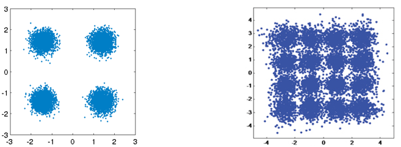
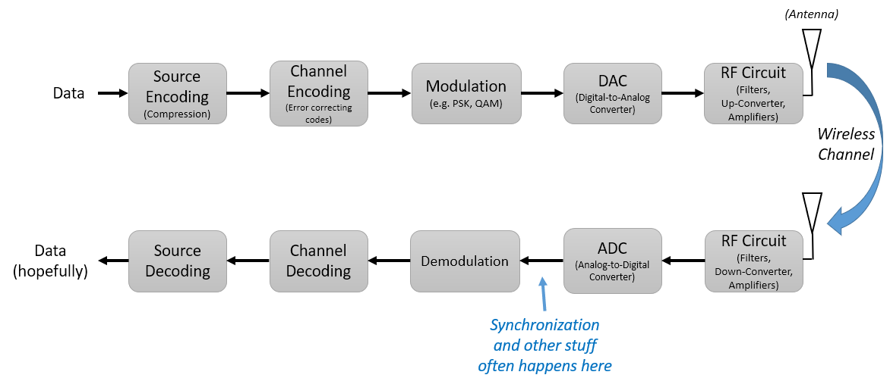
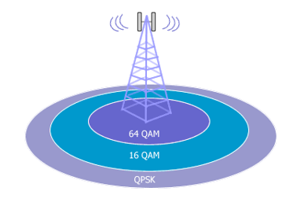
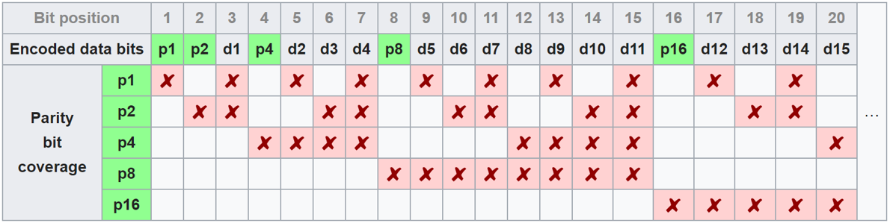
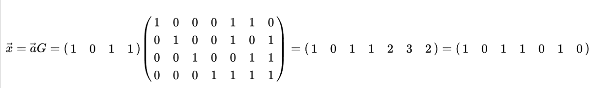
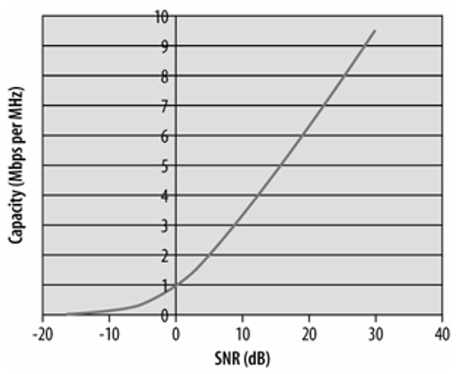
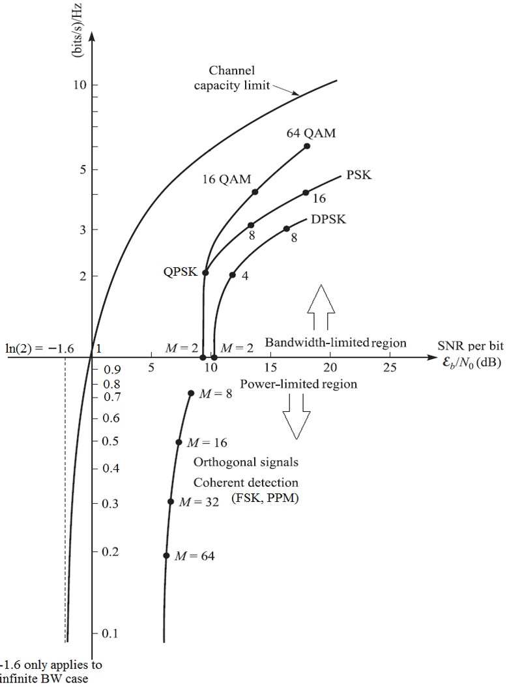
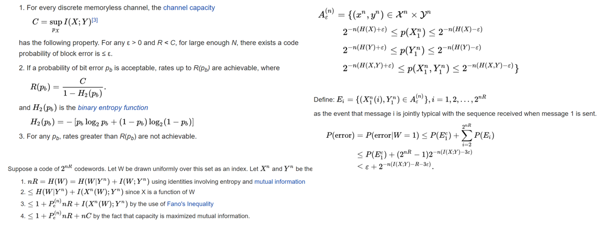

#####################
Channel Coding
#####################

In this chapter we take a brief look into the basics of channel coding, a.k.a. forward error correction (FEC).  Channel coding is an enormous area within wireless communications, and it really falls under the study of a branch called "information theory" which is the study of the quantification, storage, and communication of information.  

***************************
Why We Need Channel Coding
***************************

As we learned in the Noise chapter, wireless channels are noisy, and our digital symbols won't reach the receiver perfectly.  If you have taken a networking course you may already know about cyclic redundancy checks (CRCs) which **detect** errors at the receiving end.  The purpose of channel coding is to detect **and correct** errors at the receiver.  If we allow some room for error, then we can transmit at a higher order modulation scheme, for example, without having a broken link.  As a visual example, consider the following constellations showing QPSK (left) and 16QAM (right), under the same amount of noise.  QPSK provides 2 bits per symbol, 16QAM uses 4 bits per symbol, so twice the data rate.  But note how in the QPSK constellation, the symbols tend to not pass the symbol decision boundary which is the x-axis and y-axis for QPSK, which means the symbols will be received correctly.  Meanwhile in the 16QAM plot, there is overlap in the clusters and there will be many incorrectly received symbols. 

   
A failed CRC will usually result in a retransmission, at least when using a protocol like TCP.  If Alice is sending a message to Bob, we would rather not have to make Bob send a message back to Alice requesting the information again.  The main purpose of channel coding is to transmit **redundant** information to reduce the amount of erroneous packets, and reduce retransmissions or dropped data.  

We discussed why we need channel coding, but now let's see where it occurs in the transmit and receive chain:

Note that source coding is not the same as channel coding; source coding is meant to compress the data to be transmitted as much as possible, just like when you zip files to reduce the space taken.  I.e., the output of the Source Encoding block should be **smaller** than the input, but the output of Channel Encoding will be larger than the input because redundancy is added.

***************************
Types of Codes
***************************

To perform channel coding we use an "error correction code".  This code tells us, given what bits we have to transmit, what bits do we actually transmit?  The most basic code is called "repetition coding", and it's when you simply repeat the bit N times, in a row.  For the repetition-3 code, the code is simply:

.. role::  raw-html(raw)
    :format: html
	
- 0 :raw-html:`&rarr;` 000
- 1 :raw-html:`&rarr;` 111

So the message 10010110 is transmitted as 111000000111000111111000.  Some codes work on "blocks" of input bits, others use a stream approach. Codes that work on blocks are called "Block Codes", while codes that work on a stream of bits are called "Convolutional Codes".  These are the two primary types of codes.  Our repetition-3 code was a block code, and worked on blocks of three bits.

As an aside- these error correction codes are not just used in channel coding for wireless links.  Ever store information to a hard drive or SSD and wonder how there are never bit errors when reading information back off?  Writing, then reading, from memory is kind of like a communication system.  Hard drive/SSD controllers have error correction built in, it's transparent to the OS, and can be proprietary since it's all onboard the hard drive/SSD.  For portable media like CDs, the error correction must be standardized.  Reed Solomon codes were common in CD-ROMs.

***************************
Code-Rate
***************************

All error correction includes some form of redundancy.  That means if we want to transmit 100 bits of information, we will have to actually send **more than** 100 bits.  "Code-rate" is the ratio between the number of information bits and the total number of bits sent (i.e. information plus redundancy bits).  E.g. if I have 100 bits of information and I use repetition-3 coding:

- 300 bits are sent
- Only 100 bits represent information
- Code-rate = 100/300 = 1/3

The code rate will always be less than 1, and there is a trade-off between redundancy and throughput.  A lower code-rate means more redundancy and less throughput.

***************************
Modulation and Coding
***************************

In the Digital Modulation chapter we talked about how at low SNR you need a low-order modulation scheme (e.g. QPSK) to deal with the noise, and at high SNR you can use modulation like 256QAM to get more bits per second.  Channel coding is the same; you want lower code-rates at low SNR, and at high SNR you can use a code-rate of almost 1.  What modern communications systems do is have a set of combined modulation and coding schemes, called MCS.  Each MCS specifies a modulation scheme and a coding scheme, and there is a minimum SNR it works under.  

Modern communications adaptively change the MCS in real-time, based on the wireless channel conditions.  The receiver sends feedback to the transmitter, indicating the channel quality.  Feedback must be shared before the wireless channel changes, which could be on the order of ms.  This adaptive process leads to the highest throughput comms possible, and is used by modern technologies like LTE, 5G, and WiFi.

When using adaptive MCS, if you plot throughput over SNR, you get a staircase shaped curve.  Protocols like LTE often have a table indicating which MCS should be used at what SNR.

.. image:: ../_static/adaptive_mcs2.PNG
   :scale: 100 % 
   :align: center 

***************************
Hamming Code
***************************

Let's look at one of the simpler error correcting codes.  Hamming Code was the first non-trivial code developed.  In the late 1940s Richard Hamming was working at Bell Labs, using an electromechanical computer that used punched paper tape.  When errors in the machine were detected, it would stop and operators would have to come and fix it. Hamming grew frustrated with having to restart his programs from scratch due to detected errors.  He said, "Damn it, if the machine can detect an error, why can't it locate the position of the error and correct it?"  He spent the next few years developing the Hamming Code.

In Hamming Codes, extra bits are added for redundancy, and are called parity bits.  All bit positions that are powers of two are parity bits: 1, 2, 4, 8, etc,  highlighted in green below.  Each parity bit "covers" all bits where the bitwise AND of the parity and the bit position is non-zero, marked with a red X below.  If we want to use a data bit, we need the parity bits that cover it.  E.g. to be able to go up to data bit d9, we need parity bit p8 and all the parity bits that come before it, so this tells us how many parity bits we need for a certain number of bits.  This pattern continues indefinitely.  

Hamming codes are block codes so they operate on N data bits at a time.  So with 3 parity bits we can operate on blocks of four data bits at a time.  We call it Hamming(7,4), first arg is total bits transmitted, second arg is data bits. 

.. image:: ../_static/hamming2.PNG
   :scale: 80 % 
   :align: center 

The following are three important properties of Hamming codes:

- The minimal number of bit changes needed to go from any code word to any other code word is three
- It can correct one-bit errors
- It can detect but not correct two-bit errors

Algorithmically, the coding process can be done using a simple matrix multiply, using what is called the "generator matrix".  In the example below, the vector 1011 is the data to be encoded, i.e. the information we want to send to the receiver.  The 2D matrix is the generator matrix, and it defines the code scheme.  The result of the multiply provides the code word to transmit.

The point of diving into Hamming codes was to give a taste of how coding works.  Block codes tend to follow this type of pattern.  Convolutional codes work totally differently but we won't get into it here; they often use Trellis-style decoding, which often involves a diagram that looks like this:

.. image:: ../_static/trellis.PNG
   :scale: 100 % 
   :align: center 

***************************
Soft vs Hard Decoding
***************************

Recall that at the receiver, demodulation comes before decoding.  The demodulator can tell us its best guess as to which symbol was sent, or it can output the "soft" value.  E.g. for BPSK, instead of telling us 1 or 0, the demodulator can say 0.3423 or -1.1234, whatever the "soft" value of the symbol was.   Typically the decoding is designed to use hard or soft values.

- **Soft decision decoding** – uses the soft values
- **Hard decision decoding** – uses only the 1's and 0's

Soft is more robust because you are using all of the information at your disposal, but soft is also much more complicated to implement.  The Hamming Codes we talked about used hard decisions, convolutional codes tend to use soft. 

***************************
Shannon Limit
***************************

The Shannon limit is an incredible piece of theory, it tells us how many bits per second of error-free information we can send:

.. math::
 C = B \cdot log_2 \left( 1 + \frac{S}{N}   \right)

- C – Channel capacity [bits/sec]
- B – Bandwidth of channel [Hz]
- S – Average received signal power [watts]
- N – Average noise power [watts]

This equation represents the best any MCS can do, when operating at a high enough SNR to be error-free.  It makes more sense to plot bits/sec/Hz, i.e. bits/sec per amount of spectrum, and it's also more common to have SNR in dB, as we have learned:

.. math::
 \frac{C}{B} = log_2 \left( 1 + \mathrm{SNR_{dB}}   \right)

   
Another way to display the Shannon Limit is with the y-axis using log scale.  The points shown in the plot below assume no channel coding is used and the symbol error rate is 1e-5.  An interesting mathematical property of the Shannon limit is the asymptote at :math:`\ln(2)` when the bandwidth is not limited.

The proof behind the Shannon limit is pretty crazy, it involves math that looks like this:

***************************
State of the Art Codes
***************************

Currently, the best channel coding schemes are:

1. Turbo codes, used in 3G, 4G, NASA’s spacecraft and many other places.
2. LDPC codes, used in DVB-S2, WiMAX, IEEE 802.11n, and many others.

Both of these codes approach the Shannon Limit (i.e., almost hit it under certain SNRs).  Hamming codes and other simpler codes get no where near the Shannon Limit.  So from a research point of view, there is not a lot of room left to improve, in terms of the codes themselves.  Current research is focusing more on making the decoding more computationally efficient, and on the adaptive aspect.  

Low-density parity-check (LDPC) codes are a class of highly efficient linear block codes.  They were first introduced by Robert G. Gallager in his PhD dissertation in 1960 at MIT.  Due to the computational complexity in implementing them, they were ignored until the 1990s!  He is 89 at the time of writing this, still alive, and has won many prizes for his work (decades after he did it).  It is not patented, so free to use (unlike turbo codes), which is why it was used in many open protocols. 

Turbo codes are based on convolutional codes.  It's a class of code that combines two or more simpler convolutional codes and an interleaver.  The fundamental patent application for turbo codes was filed on April 23, 1991.  The inventors were French, so when Qualcomm wanted to use turbo codes in CDMA for 3G they had to create a fee-bearing patent license agreement with France Telecom.  The primary patent expired August 29, 2013. 

