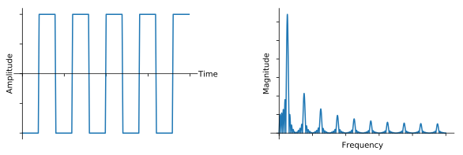
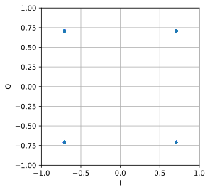
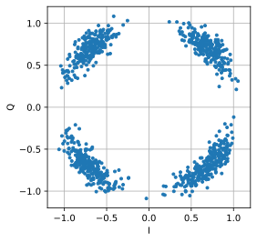

.. _modulation-chapter:

###################
Digital Modulation
###################

In this chapter we will discuss *actually transmitting data*!  We will design signals that convey "information", i.e., 1's and 0's.  The main goal of modulation is to squeeze as much data into the least amount of spectrum possible.  Technically speaking we want to maximize "spectral efficiency" in units bits/sec/Hz.  Transmitting 1's and 0's faster will increase the bandwidth of our signal (recall Fourier properties), which means more spectrum is used. We will also examine other techniques besides transmitting faster.  There will be many trade-offs when deciding how to modulate, but there will also be room for creativity.

*******************
Symbols
*******************
Term alert!  Our transmit signal is going to be made up of "symbols".  Each symbol will carry some number of bits of information, and we will transmit symbols back to back, thousands or even millions in a row.

As a simplified example, let's say we have a wire and are sending 1's and 0's using high and low voltage levels.  A symbol is one of those 1's or 0's:

.. image:: ../_images/symbols.png
   :scale: 60 % 
   :align: center 

In the above example each symbol represents one bit.  How can we convey more than one bit per symbol?  Let's study the signals that travel down Ethernet cables, which is defined in an IEEE standard called IEEE 802.3 1000BASE-T.  The common operating mode of ethernet uses a 4-level amplitude modulation (2 bits per symbol) with 8 ns symbols.

.. image:: ../_images/ethernet.svg
   :align: center 
   :target: ../_images/ethernet.svg

Take a moment to try to answer these questions:

1. How many bits per second are transmitted in the example shown above?
2. How many pairs of these data wires would be needed to transmit 1 gigabit/sec?
3. If a modulation scheme has 16 different levels, how many bits per symbol is that?
4. With 16 different levels and 8 ns symbols, how many bits per second is that?

.. raw:: html

   

   
Answers

1. 250 Mbps - (1/8e-9)*2
2. Four (which is what ethernet cables have)
3. 4 bits per symbol - log_2(16)
4. 0.5 Gbps - (1/8e-9)*4

.. raw:: html

   

*******************
Wireless Symbols
*******************
Question: Why can’t we directly transmit the ethernet signal shown in the figure above?  There are many reasons, the biggest two being:

1. Low frequencies require *huge* antennas
2. Square waves take an excessive amount of spectrum for the bits per second--recall from the :ref:`freq-domain-chapter` chapter that sharp changes in time domain use a large amount of bandwidth/spectrum:

   
What we do for wireless signals is start with a carrier, which is just a sinusoid.  E.g., FM radio uses a carrier like 101.1 MHz or 100.3 MHz.  We modulate that carrier in some way (there are many).  For FM radio it’s an analog modulation, not digital, but it’s the same concept as digital modulation.

In what ways can we modulate the carrier?  Another way to ask the same question: what are the different properties of a sinusoid?

1. Amplitude
2. Phase
3. Frequency

We can modulate our data onto a carrier by modifying any one (or more) of these three.  

****************************
Amplitude Shift Keying (ASK)
****************************

Amplitude Shift Keying (ASK) is the first digital modulation scheme we will discuss because amplitude modulation is the simplest to visualize of the three sinusoid properties.  We literally modulate the **amplitude** of the carrier.  Here is an example of 2-level ASK, called 2-ASK:

.. image:: ../_images/ASK.svg
   :align: center
   :target: ../_images/ASK.svg

Note how the average value is zero; we always prefer this whenever possible. 

We can use more than two levels, allowing for more bits per symbol.  Below shows an example of 4-ASK.  In this case each symbol carries 2 bits of information. 

.. image:: ../_images/generated/ask2.svg
   :align: center
   :target: ../_images/generated/ask2.svg

Question: How many symbols are shown in the signal snippet above?  How many bits are represented total?

.. raw:: html

   

   
Answers

20 symbols, so 40 bits of information

.. raw:: html

   

How do we actually create this signal digitally, through code?  All we have to do is create a vector with N samples per symbol, then multiply that vector by a sinusoid.  This modulates the signal onto a carrier (the sinusoid acts as that carrier).  The example below shows 2-ASK with 10 samples per symbol.  

.. image:: ../_images/generated/ask3.svg
   :align: center
   :target: ../_images/generated/ask3.svg

The top plot shows the discrete samples represented by red dots, i.e., our digital signal.  The bottom plot shows what the resulting modulated signal looks like, which could be transmitted over the air.  In real systems, the frequency of the carrier is usually much much higher than the rate the symbols are changing.  In this example there are only three cycles of the sinusoid in each symbol, but in practice there may be thousands, depending on how high in the spectrum the signal is being transmitted.

************************
Phase Shift Keying (PSK)
************************

Now let's consider modulating the phase in a similar manner as we did with the amplitude.  The simplest form is Binary PSK, a.k.a. BPSK, where there are two levels of phase:

1. No phase change
2. 180 degree phase change

Example of BPSK (note the phase changes):

.. image:: ../_images/bpsk.svg
   :align: center 
   :target: ../_images/bpsk.svg

It’s not very fun to look at plots like this:

.. image:: ../_images/bpsk2.svg
   :align: center 
   :target: ../_images/bpsk2.svg

Instead we usually represent the phase in the complex plane.  

***********************
IQ Plots/Constellations
***********************

You have seen IQ plots before in the complex numbers subsection of the :ref:`sampling-chapter` chapter, but now we will use them in a new and fun way.  For a given symbol, we can show the amplitude and phase on an IQ plot.  For the BPSK example we said we had phases of 0 and 180 degrees.  Let's plot those two points on the IQ plot. We will assume a magnitude of 1. In practice it doesn't really matter what magnitude you use; a higher value means a higher power signal, but you can also just increase the amplifier gain instead.

.. image:: ../_images/bpsk_iq.png
   :scale: 80 % 
   :align: center 

The above IQ plot shows what we will transmit, or rather the set of symbols we will transmit from.  It does not show the carrier, so you can think about it as representing the symbols at baseband.  When we show the set of possible symbols for a given modulation scheme, we call it the "constellation".  Many modulation schemes can be defined by their constellation.  

To receive and decode BPSK we can use IQ sampling, like we learned about last chapter, and examine where the points end up on the IQ plot.  However, there will be a random phase rotation due to the wireless channel because the signal will have some random delay as it passes through the air between antennas.  The random phase rotation can be reversed using various methods we will learn about later.  Here is an example of a few different ways that BPSK signal might show up at the receiver (this does not include noise):

.. image:: ../_images/bpsk3.png
   :scale: 60 % 
   :align: center 

Back to PSK.  What if we want four different levels of phase?  I.e., 0, 90, 180, and 270 degrees.  In this case it would be represented like so on the IQ plot, and it forms a modulation scheme we call Quadrature Phase Shift Keying (QPSK):

.. image:: ../_images/qpsk.png
   :scale: 60 % 
   :align: center 

For PSK we always have N different phases, equally spaced around 360 degrees for best results.  We often show the unit circle to emphasize that all points have the same magnitude:

.. image:: ../_images/psk_set.png
   :scale: 60 % 
   :align: center 

Question: What’s wrong with using a PSK scheme like the one in the below image?  Is it a valid PSK modulation scheme?

.. image:: ../_images/weird_psk.png
   :scale: 60 % 
   :align: center 

.. raw:: html

   

   
Answer

There is nothing invalid about this PSK scheme. You can certainly use it, but, because the symbols are not uniformly spaced, this scheme is not as effective as it could be. Scheme efficiency will become clear once we discuss how noise impacts our symbols.  The short answer is that we want to leave as much room as possible in between the symbols, in case there is noise, so that a symbol is not interpreted at the receiver as one of the other (incorrect) symbols.  We don't want a 0 being received as a 1.

.. raw:: html

   

Let's detour back to ASK for a moment.  Note that we can show ASK on the IQ plot just like PSK.  Here is the IQ plot of 2-ASK, 4-ASK, and 8-ASK, in the bipolar configuration, as well as 2-ASK and 4-ASK in the unipolar configuration.

.. image:: ../_images/ask_set.png
   :scale: 50 % 
   :align: center 

As you may have noticed, bipolar 2-ASK and BPSK are the same. A 180 degree phase shift is the same as multiplying the sinusoid by -1.  We call it BPSK, probably because PSK is used way more than ASK.

**************************************
Quadrature Amplitude Modulation (QAM)
**************************************
What if we combine ASK and PSK?  We call this modulation scheme Quadrature Amplitude Modulation (QAM). QAM usually looks something like this:

.. image:: ../_images/64qam.png
   :scale: 90 % 
   :align: center 
   
Here are some other examples of QAM:

.. image:: ../_images/qam.png
   :scale: 50 % 
   :align: center 

For a QAM modulation scheme, we can technically put points wherever we want to on the IQ plot since the phase *and* amplitude are modulated.  The "parameters" of a given QAM scheme are best defined by showing the QAM constellation. Alternatively, you may list the I and Q values for each point, like below for QPSK:

.. image:: ../_images/qpsk_list.png
   :scale: 80 % 
   :align: center 

Note that most modulation schemes, except the various ASKs and BPSK, are pretty hard to "see" in the time domain.  To prove my point, here is an example of QAM in time domain. Can you distinguish between the phase of each symbol in the below image? It's tough.

.. image:: ../_images/qam_time_domain.png
   :scale: 50 % 
   :align: center 

Given the difficulty discerning modulation schemes in the time domain, we prefer to use IQ plots over displaying the time domain signal.  We might, nonetheless, show the time domain signal if there's a certain packet structure or the sequence of symbols matters.

****************************
Frequency Shift Keying (FSK)
****************************

Last on the list is Frequency Shift Keying (FSK).  FSK is fairly simple to understand--we just shift between N frequencies where each frequency is one possible symbol.  However, because we are modulating a carrier, it’s really our carrier frequency +/- these N frequencies. E.g.. we might be at a carrier of 1.2 GHz and shift between these four frequencies:

1. 1.2005 GHz
2. 1.2010 GHz
3. 1.1995 GHz
4. 1.1990 GHz

The example above would be 4-FSK, and there would be two bits per symbol.  A 4-FSK signal in the frequency domain might look something like this:

.. image:: ../_images/generated/fsk.svg
   :align: center 
   :target: ../_images/generated/fsk.svg

If you use FSK, you must ask a critical question: What should the spacing between frequencies be?  We often denote this spacing as :math:`\Delta f` in Hz. We want to avoid overlap in the frequency domain, so :math:`\Delta f` must be large enough.  The width of each carrier in frequency is a function of our symbol rate.  More symbols per second means shorter symbols, which means wider bandwidth (recall the inverse relationship between time and frequency scaling).  The faster we transmit symbols, the wider each carrier will get, and consequently the larger we have to make :math:`\Delta f` to avoid overlapping carriers.  We won't go into any more details about the design of FSK in this textbook.

IQ plots can't be used to show different frequencies. They show magnitude and phase.  While it is possible to show FSK in the time domain, any more than 2 frequencies makes it difficult to distinguish between symbols:

.. image:: ../_images/fsk2.svg
   :align: center
   :target: ../_images/fsk2.svg

As an aside, note that FM radio uses Frequency Modulation (FM) which is like an analog version of FSK.  Instead of having discrete frequencies we jump between, FM radio uses a continuous audio signal to modulate the frequency of the carrier.  Below is an example of FM and AM modulation where the "signal" at the top is the audio signal being modulated onto to the carrier.

.. image:: ../_images/generated/Carrier_Mod_AM_FM.webp
   :align: center
   :target: ../_images/generated/Carrier_Mod_AM_FM.webp

In this textbook we are mainly concerned about digital forms of modulation.

*******************
Python Example
*******************

As a short Python example, let's generate QPSK at baseband and plot the constellation.

Even though we could generate the complex symbols directly, let's start from the knowledge that QPSK has four symbols at 90-degree intervals around the unit circle.  We will use 45, 135, 225, and 315 degrees for our points.  First we will generate random numbers between 0 and 3 and perform math to get the degrees we want before converting to radians.

.. code-block:: python

 import numpy as np
 import matplotlib.pyplot as plt
 
 num_symbols = 1000
 
 x_int = np.random.randint(0, 4, num_symbols) # 0 to 3
 x_degrees = x_int*360/4.0 + 45 # 45, 135, 225, 315 degrees
 x_radians = x_degrees*np.pi/180.0 # sin() and cos() takes in radians
 x_symbols = np.cos(x_radians) + 1j*np.sin(x_radians) # this produces our QPSK complex symbols
 plt.plot(np.real(x_symbols), np.imag(x_symbols), '.')
 plt.grid(True)
 plt.show()

Observe how all the symbols we generated overlap. There's no noise so the symbols all have the same value.  Let's add some noise:

.. code-block:: python

 n = (np.random.randn(num_symbols) + 1j*np.random.randn(num_symbols))/np.sqrt(2) # AWGN with unity power
 noise_power = 0.01
 r = x_symbols + n * np.sqrt(noise_power)
 plt.plot(np.real(r), np.imag(r), '.')
 plt.grid(True)
 plt.show()

.. image:: ../_images/generated/qpsk_python2.svg
   :align: center
   :target: ../_images/generated/qpsk_python2.svg

Consider how additive white Gaussian noise (AGWN) produces a uniform spread around each point in the constellation.  If there's too much noise then symbols start passing the boundary (the four quadrants) and will be interpreted by the receiver as an incorrect symbol.  Try increasing :code:`noise_power` until that happens.

For those interested in simulating phase noise, which could result from phase jitter within the local oscillator (LO), replace the :code:`r` with:

.. code-block:: python

 phase_noise = np.random.randn(len(x_symbols)) * 0.1 # adjust multiplier for "strength" of phase noise
 r = x_symbols * np.exp(1j*phase_noise)

.. image:: ../_images/generated/phase_jitter.svg
   :align: center
   :target: ../_images/generated/phase_jitter.svg

You could even combine phase noise with AWGN to get the full experience:

We're going to stop at this point.  If we wanted to see what the QPSK signal looked like in the time domain, we would need to generate multiple samples per symbol (in this exercise we just did 1 sample per symbol). You will learn why you need to generate multiple samples per symbol once we discuss pulse shaping.  The Python exercise in the :ref:`pulse-shaping-chapter` chapter will continue where we left off here.

