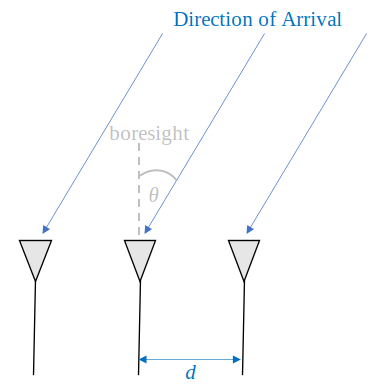
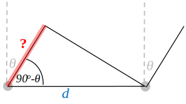
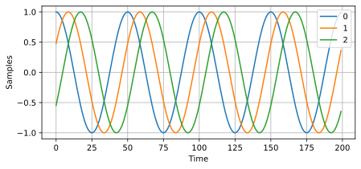
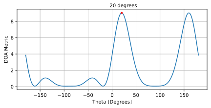
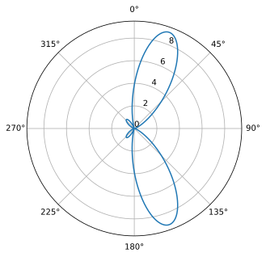
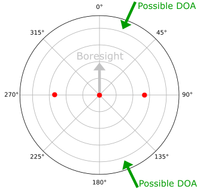
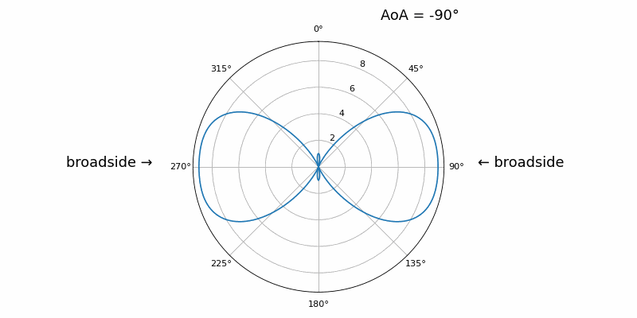
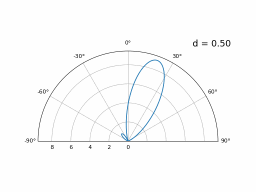
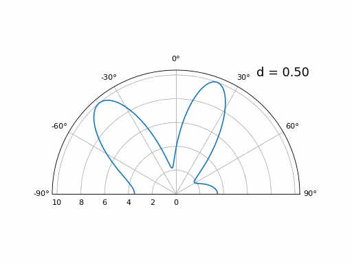

.. _doa-chapter:

####################################
DOA & Beamforming
####################################

Direction-of-Arrival (DOA) within DSP/SDR refers to the process of using an array of antennas to estimate the DOA of one or more signals received by that array.  Once we know the direction a signal of interest is arriving from, we can isolate it from other signals/interference/jamming.  It is just like isolating a signal in the frequency domain by filtering it, except we are now working in the spatial domain (you can certainly combine both!).  We typically refer to the antennas that make up an array as elements, and sometimes the array is called a "sensor" instead.  These array elements are most often omnidirectional antennas, equally spaced in either a line or across two dimensions.  DOA is a subset of beamforming techniques, where as the receiver, we are trying to steer a beam (our receiver's antenna beam) towards the direction of an emitter.  We may also steer a beam blindly across a wide range (e.g., 0 to 360 degrees) to figure out what signals are being received and from what direction.  

*******************
Array Factor Math
*******************

To get to the fun part we have to get through a little bit of math, but the following section has been written so that the math is extremely simple and has diagrams to go along with it, only the most basic trig and exponential properties are used.  It's important to understand the basic math behind what we'll do in Python to perform DOA.

Consider a 1D three-element uniformly spaced array:

In this example a signal is coming in from the right side, so it's hitting the right-most element first.  Let's calculate the delay between when the signal hits that first element and when it reaches the next element.  We can do this by forming the following trig problem, try to visualize how this triangle was formed from the diagram above.  The segment highlighted in red represents the distance the signal has to travel *after* it has reached the first element, before it hits the next one.

If you recall SOH CAH TOA, in this case we are interested in the "adjacent" side and we have the length of the hypotenuse (:math:`d`), so we need to use a cosine:

.. math::
  \cos(90 - \theta) = \frac{\mathrm{adjacent}}{\mathrm{hypotenuse}}

We must solve for adjacent, as that is what will tell us how far the signal must travel between hitting the first and second element, so it becomes adjacent :math:`= d \cos(90 - \theta)`.  Now there is a trig identity that lets us convert this to adjacent :math:`= d \sin(\theta)`.  This is just a distance though, we need to convert this to a time, using the speed of light: time elapsed :math:`= d \sin(\theta) / c` [seconds].  This equation applies between any adjacent elements of our array, although we can multiply the whole thing by an integer to calculate between non-adjacent elements since they are uniformly spaced (we'll do this later).  

Now to connect this trig and speed of light math to the signal processing world.  Let's denote our transmit signal at baseband :math:`s(t)` and it's being transmitting at some carrier, :math:`f_c` , so the transmit signal is :math:`s(t) e^{2j \pi f_c t}`.  Lets say this signal hits the first element at time :math:`t = 0`, which means it hits the next element after :math:`d \sin(\theta) / c` [seconds] like we calculated above.  This means the 2nd element receives:

.. math::
 s(t - \Delta t) e^{2j \pi f_c (t - \Delta t)}

.. math::
 \mathrm{where} \quad \Delta t = d \sin(\theta) / c

recall that when you have a time shift, it is subtracted from the time argument.

When the receiver or SDR does the downconversion process to receive the signal, its essentially multiplying it by the carrier but in the reverse direction, so after doing downconversion the receiver sees:

.. math::
 s(t - \Delta t) e^{2j \pi f_c (t - \Delta t)} e^{-2j \pi f_c t}

.. math::
 = s(t - \Delta t) e^{-2j \pi f_c \Delta t}

Now we can do a little trick to simplify this even further; consider how when we sample a signal it can be modeled by substituting :math:`t` for :math:`nT` where :math:`T` is sample period and :math:`n` is just 0, 1, 2, 3...  Substituting this in we get :math:`s(nT - \Delta t) e^{-2j \pi f_c \Delta t}`. Well, :math:`nT` is so much greater than :math:`\Delta t` that we can get rid of the first :math:`\Delta t` term and we are left with :math:`s(nT) e^{-2j \pi f_c \Delta t}`.  If the sample rate ever gets fast enough to approach the speed of light over a tiny distance, we can revisit this, but remember that our sample rate only needs to be a bit larger than the signal of interest's bandwidth.

Let's keep going with this math but we'll start representing things in discrete terms so that it will better resemble our Python code.  The last equation can be represented as the following, let's plug back in :math:`\Delta t`:

.. math::
 s[n] e^{-2j \pi f_c \Delta t}

.. math::
 = s[n] e^{-2j \pi f_c d \sin(\theta) / c}

We're almost done, but luckily there's one more simplification we can make.  Recall the relationship between center frequency and wavelength: :math:`\lambda = \frac{c}{f_c}` or the form we'll use: :math:`f_c = \frac{c}{\lambda}`.  Plugging this in we get:

.. math::
 s[n] e^{-2j \pi \frac{c}{\lambda} d \sin(\theta) / c}

.. math::
 = s[n] e^{-2j \pi d \sin(\theta) / \lambda}

In DOA what we like to do is represent :math:`d`, the distance between adjacent elements, as a fraction of wavelength (instead of meters), the most common value chosen for :math:`d` during the array design process is to use one half the wavelength. Regardless of what :math:`d` is, from this point on we're going to represent :math:`d` as a fraction of wavelength instead of meters, making the equation and all our code simpler:

.. math::
 s[n] e^{-2j \pi d \sin(\theta)}

This is for adjacent elements, for the :math:`k`'th element we just need to multiply :math:`d` times :math:`k`:

.. math::
 s[n] e^{-2j \pi d k \sin(\theta)}

And we're done! This equation above is what you'll see in DOA papers and implementations everywhere! We typically call that exponential term the "array factor" (often denoted as :math:`a`) and represent it as an array, a 1D array for a 1D antenna array, etc.  In python :math:`a` is:

.. code-block:: python

 a = [np.exp(-2j*np.pi*d*0*np.sin(theta)), np.exp(-2j*np.pi*d*1*np.sin(theta)), np.exp(-2j*np.pi*d*2*np.sin(theta)), ...] # note the increasing k
 # or
 a = np.exp(-2j * np.pi * d * np.arange(Nr) * np.sin(theta)) # where Nr is the number of receive antenna elements

Note how element 0 results in a 1+0j (because :math:`e^{0}=1`); this makes sense because everything above was relative to that first element, so it's receiving the signal as-is without any relative phase shifts.  This is purely how the math works out, in reality any element could be thought of as the reference, but as you'll see in our math/code later on, what matters is the difference in phase/amplitude received between elements.  It's all relative.

*******************
Receiving a Signal
*******************

Let's use the array factor concept to simulate a signal arriving at an array.  For a transmit signal we'll just use a tone for now:

.. code-block:: python

 import numpy as np
 import matplotlib.pyplot as plt
 
 sample_rate = 1e6
 N = 10000 # number of samples to simulate
 
 # Create a tone to act as the transmitter signal
 t = np.arange(N)/sample_rate # time vector
 f_tone = 0.02e6
 tx = np.exp(2j * np.pi * f_tone * t)

Now let's simulate an array consisting of three omnidirectional antennas in a line, with 1/2 wavelength between adjacent ones (a.k.a. "half-wavelength spacing").  We will simulate the transmitter's signal arriving at this array at a certain angle, theta.  Understanding the array factor :code:`a` below is why we went through all that math above.

.. code-block:: python

 d = 0.5 # half wavelength spacing
 Nr = 3
 theta_degrees = 20 # direction of arrival (feel free to change this, it's arbitrary)
 theta = theta_degrees / 180 * np.pi # convert to radians
 a = np.exp(-2j * np.pi * d * np.arange(Nr) * np.sin(theta)) # array factor
 print(a) # note that it's a 1x3, it's complex, and the first element is 1+0j

To apply the array factor we have to do a matrix multiplication of :code:`a` and :code:`tx`, so first let's convert both to matrices, as NumPy arrays which don't let us do 1D matrix math that we need for beamforming/DOA.  We then perform the matrix multiply, note that the @ symbol in Python means matrix multiply (it's a NumPy thing).  We also have to convert :code:`a` from a row vector to a column vector (picture it rotating 90 degrees) so that the matrix multiply inner dimensions match.

.. code-block:: python

 a = np.asmatrix(a)
 tx = np.asmatrix(tx)

 r = a.T @ tx  # dont get too caught up by the transpose a, the important thing is we're multiplying the array factor by the tx signal
 print(r.shape) # r is now going to be a 2D array, 1D is time and 1D is the spatial dimension

At this point :code:`r` is a 2D array, size 3 x 10000 because we have three array elements and 10000 samples simulated.  We can pull out each individual signal and plot the first 200 samples, below we'll plot the real part only, but there's also an imaginary part, like any baseband signal.  One annoying part of Python is having to switch to matrix type for matrix math, then having to switch back to normal NumPy arrays, we need to add the .squeeze() to get it back to a normal 1D NumPy array.

.. code-block:: python

 plt.plot(np.asarray(r[0,:]).squeeze().real[0:200]) # the asarray and squeeze are just annoyances we have to do because we came from a matrix
 plt.plot(np.asarray(r[1,:]).squeeze().real[0:200])
 plt.plot(np.asarray(r[2,:]).squeeze().real[0:200])
 plt.show()

Note the phase shifts between elements like we expect to happen (unless the signal arrives at boresight in which case it will reach all elements at the same time and there wont be a shift, set theta to 0 to see).  Element 0 appears to arrive first, with the others slightly delayed.  Try adjusting the angle and see what happens.

One thing we didn't bother doing yet- let's add noise to this received signal.  AWGN with a phase shift applied is still AWGN, and we want to apply the noise after the array factor is applied, because each element experiences an independent noise signal.  

.. code-block:: python

 n = np.random.randn(Nr, N) + 1j*np.random.randn(Nr, N)
 r = r + 0.1*n # r and n are both 3x10000

.. image:: ../_images/doa_time_domain_with_noise.svg
   :align: center 
   :target: ../_images/doa_time_domain_with_noise.svg

*******************
Basic DOA
*******************

So far this has been simulating the receiving of a signal from a certain angle of arrival.  In your typical DOA problem you are given samples and have to estimate the angle of arrival(s).  There are also problems where you have multiple received signals from different directions and one is the signal-of-interest (SOI) while another might be a jammer or interferer you have to null out to extract the SOI with at as high SNR as possible.

Next let's use this signal :code:`r` but pretend we don't know which direction the signal is coming in from, let's try to figure it out with DSP and some Python code!  We'll start with the "conventional" beamforming approach, which involves scanning through (sampling) all directions of arrival from -pi to +pi (-180 to +180 degrees).  At each direction we point the array towards that angle by applying the weights associated with pointing in that direction; applying the weights will give us a 1D array of samples, as if we received it with 1 directional antenna.  You're probably starting to realize where the term electrically steered array comes in.  This conventional beamforming method involves calculating the mean of the magnitude squared, as if we were making an energy detector.  We'll apply the beamforming weights and do this calculation at a ton of different angles, so that we can check which angle gave us the max energy.

.. code-block:: python

 theta_scan = np.linspace(-1*np.pi, np.pi, 1000) # 1000 different thetas between -180 and +180 degrees
 results = []
 for theta_i in theta_scan:
     #print(theta_i)
     w = np.asmatrix(np.exp(-2j * np.pi * d * np.arange(Nr) * np.sin(theta_i))) # look familiar?
     r_weighted = np.conj(w) @ r # apply our weights corresponding to the direction theta_i
     r_weighted = np.asarray(r_weighted).squeeze() # get it back to a normal 1d numpy array
     results.append(np.mean(np.abs(r_weighted)**2)) # energy detector
 
 # print angle that gave us the max value
 print(theta_scan[np.argmax(results)] * 180 / np.pi) # 19.99999999999998
 
 plt.plot(theta_scan*180/np.pi, results) # lets plot angle in degrees
 plt.xlabel("Theta [Degrees]")
 plt.ylabel("DOA Metric")
 plt.grid()
 plt.show()

We found our signal!  Try increasing the amount of noise to push it to its limit, you might need to simulate more samples being received for low SNRs.  Also try changing the direction of arrival.

If you prefer viewing angle on a polar plot, use the following code:

.. code-block:: python

 fig, ax = plt.subplots(subplot_kw={'projection': 'polar'})
 ax.plot(theta_scan, results) # MAKE SURE TO USE RADIAN FOR POLAR
 ax.set_theta_zero_location('N') # make 0 degrees point up
 ax.set_theta_direction(-1) # increase clockwise
 ax.set_rgrids([0,2,4,6,8]) 
 ax.set_rlabel_position(22.5)  # Move grid labels away from other labels
 plt.show()

********************
180 Degree Ambiguity
********************

Let's talk about why is there a second peak at 160 degrees; the DOA we simulated was 20 degrees, but it is not a coincidence that 180 - 20 = 160.  Picture three omnidirectional antennas in a line placed on a table.  The array's boresight is 90 degrees to the axis of the array, as labeled in the first diagram in this chapter.  Now imagine the transmitter in front of the antennas, also on the (very large) table, such that its signal arrives at a +20 degree angle from boresight.  Well the array sees the same effect whether the signal is arriving with respect to its front or back, the phase delay is the same, as depicted below with the array elements in red and the two possible transmitter DOA's in green.  Therefore, when we perform the DOA algorithm, there will always be a 180 degree ambiguity like this, the only way around it is to have a 2D array, or a second 1D array positioned at any other angle w.r.t the first array.  You may be wondering if this means we might as well only calculate -90 to +90 degrees to save compute cycles, and you would be correct!

***********************
Broadside of the Array
***********************

To demonstrate this next concept, let's try sweeping the angle of arrival (AoA) from -90 to +90 degrees instead of keeping it constant at 20:

As we approach the broadside of the array (a.k.a. endfire), which is when the signal arrives at or near the axis of the array, performance drops.  We see two main degredations: 1) the main lobe gets wider and 2) we get ambiguity and don't know whether the signal is coming from the left or the right.  This ambiguity adds to the 180 degree ambiguity discussed earlier, where we get an extra lobe at 180 - theta, causing certain AoA to lead to three lobes of roughly equal size.  This broadside ambiguity makes sense though, the phase shifts that occur between elements are identical whether the signal arrives from the left or right side w.r.t. the array axis.  Just like with the 180 degree ambiguity, the solution is to use a 2D array or two 1D arrays at different angles.  In general, beamforming works best when the angle is closer to the boresight.

*******************
When d is not λ/2
*******************

So far we have been using a distance between elements, d, equal to one half wavelength.  So for example, an array designed for 2.4 GHz WiFi with λ/2 spacing would have a spacing of 3e8/2.4e9/2 = 12.5cm or about 5 inches, meaning a 4x4 element array would be about 15" x 15" x the height of the antennas.  There are times when an array may not be able to achieve exactly λ/2 spacing, such as when space is restricted, or when the same array has to work on a variety of carrier frequencies.

Let's examine when the spacing is greater than λ/2, i.e., too much spacing, by varying d between λ/2 and 4λ.  We will remove the bottom half of the polar plot since it's a mirror of the top anyway.

As you can see, in addition to the 180 degree ambiguity we discussed earlier, we now have additional ambiguity, and it gets worse as d gets higher (extra/incorrect lobes form).  These extra lobes are known as grating lobes, and they are a result of "spatial aliasing".  As we learned in the :ref:`sampling-chapter` chapter, when we don't sample fast enough we get aliasing.  The same thing happens in the spatial domain; if our elements are not spaced close enough together w.r.t. the carrier frequency of the signal being observed, we get garbage results in our analysis.  You can think of spacing out antennas as sampling space!  In this example we can see that the grating lobes don't get too problematic until d > λ, but they will occur as soon as you go above λ/2 spacing.

Now what happens when d is less than λ/2, such as when we need to fit the array in a small space?  Let's repeat the same simulation:

While the main lobe gets wider as d gets lower, it still has a maximum at 20 degrees, and there are no grating lobes, so in theory this would still work (at least at high SNR).  Let's repeat this experiment but with an additional signal arriving from -40 degrees:

Once we get lower than λ/4 there is no distinguishing between the two different paths, and the array performs poorly.  As we will see later in this chapter, there are beamforming techniques that provide more precise beams than conventional beamforming, but keeping d as close to λ/2 as possible will continue to be a theme.

*******************
Coming Soon
*******************

* sdr requirements (phase coherent rx channels)
* uses in cellular and satellite ground stations and satellites
* common antenna types used for arrays (eg patch, monopole)
* Capons (aka MVDR) beamformer
* MUSIC (adaptive/subspace beamforming)
* number of elements
* recieve at the broadside of array
* 2D DOA example
* Steering nulls