.. _filters-chapter:

#############
Filters
#############

In this chapter we get introduced to filters.  We learn about the types of filters, how filters are represented digitally, and how they are designed.  We finish with an introduction to pulse shaping, a topic explored in depth in its own chapter.

*************************
Filter Basics
*************************

Filters are used in many disciplines, for example image processing makes heavy use of 2D filters, where the input and output are images.  You might use a filter every morning to make your coffee, which filters out solids from liquid.  In DSP, filters are primarily used for:

1. Separation of signals that have been combined (e.g. pulling out the signal you want)
2. Removing excess noise after receiving a signal
3. Restoration of signals that have been distorted in some way (e.g. an audio equalizer is a filter)

There are certainly other uses for filters.  

There are analog filters and digital filters.  You may think we only care about digital filters; this is a DSP based textbook after all, but it's also important to know that a lot of filters will be analog, such as filters in our SDRs that come before the analog-to-digital converter (ADC) on the receive side. 

.. image:: ../_static/analog_digital_filter.png
   :scale: 70 % 
   :align: center 
   
In DSP, where the input and output are signals, a filter has one input signal and one output signal:

.. image:: ../_static/filter.png
   :scale: 70 % 
   :align: center 

You cannot feed two different signals into a single filter, without adding them together first, or doing some other operation.  Likewise, the output will always be one signal, i.e. a 1D array of numbers.  

There are four basic types of filters: 

.. image:: ../_static/filter_types.png
   :scale: 70 % 
   :align: center 

(ADD DIAGRAM SHOWING NEGATIVE FREQS TOO)

Each filter lets certain frequencies through, and blocks other frequencies.  The range of frequencies it lets through is known as the "passband", and the "stopband" is what gets blocked.  In the case of the low-pass filter, it passes low frequencies and stops high frequencies, so 0 Hz will always be in the passband.  For a high-pass and band-pass filter, 0 Hz will always be in the stopband. 

Do not get this confused with the different types of filter implementation (e.g. IIR vs FIR).  The most common type by far is the low-pass filter (LPF), because we often represent signals at baseband, so the LPF lets us filter out everything "around" our signal, to get rid of excess noise and other signals.  

*************************
Filter Representation
*************************

For most filters we will see (known as FIR type filters), we can represent the filter itself with a single array of floats.  For symmetrical filters, these floats will be real (versus complex), and there will usually be an odd number of floats.  We call this array of floats the "filter taps".  We often use :math:`h` as the symbol for filter taps.  Here is an example of a set of filter taps, which define one filter:

.. code-block:: python

    h =  [ 9.92977939e-04  1.08410297e-03  8.51595307e-04  1.64604862e-04
     -1.01714338e-03 -2.46268845e-03 -3.58236429e-03 -3.55412543e-03
     -1.68583512e-03  2.10562324e-03  6.93100252e-03  1.09302641e-02
      1.17766532e-02  7.60955496e-03 -1.90555639e-03 -1.48306750e-02
     -2.69313236e-02 -3.25659606e-02 -2.63400086e-02 -5.04184562e-03
      3.08099470e-02  7.64264738e-02  1.23536693e-01  1.62377258e-01
      1.84320776e-01  1.84320776e-01  1.62377258e-01  1.23536693e-01
      7.64264738e-02  3.08099470e-02 -5.04184562e-03 -2.63400086e-02
     -3.25659606e-02 -2.69313236e-02 -1.48306750e-02 -1.90555639e-03
      7.60955496e-03  1.17766532e-02  1.09302641e-02  6.93100252e-03
      2.10562324e-03 -1.68583512e-03 -3.55412543e-03 -3.58236429e-03
     -2.46268845e-03 -1.01714338e-03  1.64604862e-04  8.51595307e-04
      1.08410297e-03  9.92977939e-04]

Example Use-Case
########################

To learn how filters are actually used, let's look an an example where we tune our SDR to a frequency we know a signal exists, and we want to isolate it from other signals.  Remember that we tell our SDR what frequency to tune to, but the samples it gives us are at baseband, so the signal will show up centered around 0 Hz, we just have to keep track of which frequency we told the SDR to tune to.  Here is what we might receive:

.. image:: ../_static/filter_use_case.png
   :scale: 70 % 
   :align: center 

Because our signal is already centered at DC (0 Hz), we know we want a low pass filter.  We must choose a "cutoff frequency" (a.k.a. corner frequency) which will determine when the passband transitions to stopband.  Cutoff frequency will always be in units of Hz.  In this example, 3 kHz seems like a good value:

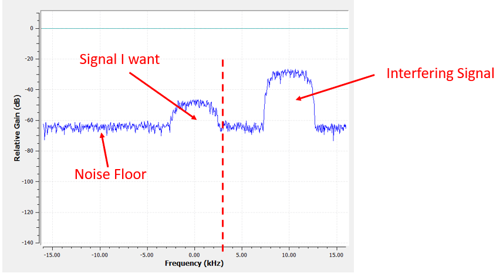

However, the way most low pass filters work, the negative frequency boundary will be -3 kHz as well.  I.e., it’s symmetrical around DC (later on you will see why).  So our cutoff frequencies will look something like this (the passband is the area in between):

.. image:: ../_static/filter_use_case3.png
   :scale: 70 % 
   :align: center 

After creating and applying the filter with a cutoff freq of 3 kHz, this is what we get:

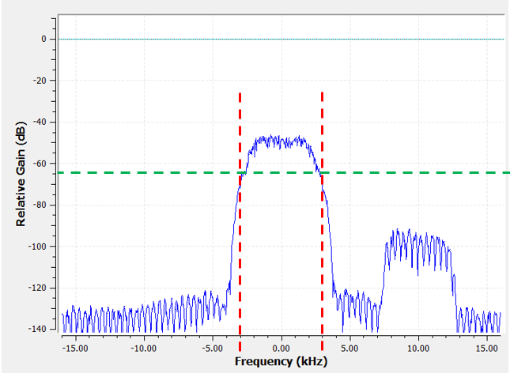

This filtered signal will look confusing until you recall that our noise floor *was* at the green line, around -65 dB.  So even though we can still see the signal centered at 10 kHz, we have *severely* decreased the power of that signal, to the point where it's now below where the noise floor was.  We also removed most of the noise that existed in the stopband.  

In addition to cutoff frequency, the other main parameter of our low-pass filter is called the "transition width".  Transition width is also in Hz, and it tells the filter how quickly it has to go between the passband and stopband, since an instant transition is impossible.  In the diagram below, :green:`green` is the ideal response, which essentially has a transition width of zero.  :red:`Red` is a realistic filter, which has some ripple and a certain transition width.

.. image:: ../_static/realistic_filter.png
   :scale: 100 % 
   :align: center 

You might be wondering why we wouldn't just set the transition width as small as possible.  The reason is mainly that a smaller transition width results in more taps, and more taps means more computations, we will see why shortly.  A 50 tap filter can run all day long using 1% of the CPU on a Raspberry Pi.  Meanwhile, a 50,000 tap filter will cause your CPU to explode!
Typically we use a filter designer tool, then see how many taps it outputs, and if it's way too many (e.g. more than 100) we increase the transition width.  It all depends on the application and hardware running the filter, of course.

In the filtering example above, we had used a cutoff of 3 kHz and a transition width of 1 kHz (it's hard to actually see the transition width just looking at these screenshots).  The resulting filter had 77 taps.

Back to filter representation.  Even though we might show the list of taps for a filter, we usually represent filters visually in the frequency domain.  We call this the "frequency response" of the filter, and it shows us the behavior of the filter in frequency..  E.g. this is the frequency response of the filter we were just using:

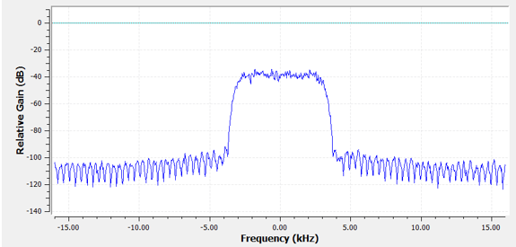

Note that what I'm showing here is *not* a signal, it's just the frequency domain representation of the filter.  That can be a little hard to wrap your head around at first, but as we look at examples and code, it will click.

A given filter also has a time domain representation; it’s called the "impulse response" of the filter, because it is what you see in the time domain if you take an impulse and put it through the filter (Google "Dirac delta function" for more info about what an impulse is). For an FIR type filter, the impulse response is simply the taps themselves.  For that 77 tap filter we used earlier, the taps are:

.. code-block:: python

    h =  [-0.00025604525581002235, 0.00013669139298144728, 0.0005385575350373983,
    0.0008378280326724052, 0.000906112720258534, 0.0006353431381285191,
    -9.884083502996931e-19, -0.0008822851814329624, -0.0017323142383247614,
    -0.0021665366366505623, -0.0018335371278226376, -0.0005912294145673513,
    0.001349081052467227, 0.0033936649560928345, 0.004703888203948736,
    0.004488115198910236, 0.0023609865456819534, -0.0013707970501855016,
    -0.00564080523326993, -0.008859002031385899, -0.009428252466022968,
    -0.006394983734935522, 4.76480351940553e-18, 0.008114570751786232,
    0.015200719237327576, 0.018197273835539818, 0.01482443418353796,
    0.004636279307305813, -0.010356673039495945, -0.025791890919208527,
    -0.03587324544787407, -0.034922562539577484, -0.019146423786878586,
    0.011919975280761719, 0.05478153005242348, 0.10243935883045197,
    0.1458890736103058, 0.1762896478176117, 0.18720689415931702,
    0.1762896478176117, 0.1458890736103058, 0.10243935883045197,
    0.05478153005242348, 0.011919975280761719, -0.019146423786878586,
    -0.034922562539577484, -0.03587324544787407, -0.025791890919208527,
    -0.010356673039495945, 0.004636279307305813, 0.01482443418353796,
    0.018197273835539818, 0.015200719237327576, 0.008114570751786232,
    4.76480351940553e-18, -0.006394983734935522, -0.009428252466022968,
    -0.008859002031385899, -0.00564080523326993, -0.0013707970501855016,
    0.0023609865456819534, 0.004488115198910236, 0.004703888203948736,
    0.0033936649560928345, 0.001349081052467227, -0.0005912294145673513,
    -0.0018335371278226376, -0.0021665366366505623, -0.0017323142383247614,
    -0.0008822851814329624, -9.884083502996931e-19, 0.0006353431381285191,
    0.000906112720258534, 0.0008378280326724052, 0.0005385575350373983,
    0.00013669139298144728, -0.00025604525581002235]

And even though we haven't gotten into filter design yet, here is the Python code that generated that filter:

.. code-block:: python

    import numpy as np
    from scipy import signal
    import matplotlib.pyplot as plt

    num_taps = 51 # it helps to use an odd number of taps
    cut_off = 3000 # Hz
    sample_rate = 32000 # Hz

    # create our low pass filter
    h = signal.firwin(num_taps, cut_off, nyq=sample_rate/2)

    # plot the impulse response
    plt.plot(h, '.-')
    plt.show()

Simply plotting this array of floats gives us the filter's impulse response:

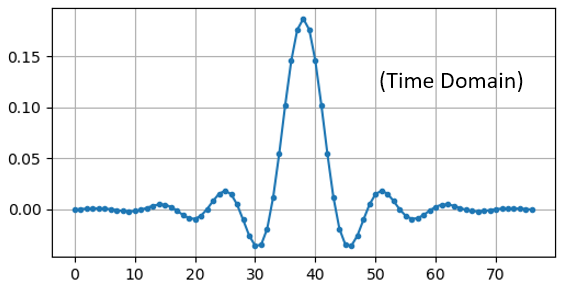

And here is the code that was used to produce the frequency response, shown earlier.  It's a little more complicated because we have to create the x-axis array of frequencies. 

.. code-block:: python

    # plot the frequency response
    H = np.abs(np.fft.fft(h, 1024)) # take the 1024-point FFT and magnitude
    H = np.fft.fftshift(H) # make 0 Hz in the center
    w = np.linspace(-sample_rate/2, sample_rate/2, len(H)) # x axis
    plt.plot(w, H, '.-')
    plt.show()

Real vs. Complex Filters
########################

The filter I showed you had real taps, but taps can also be complex.  Whether the taps are real or complex doesn't have to match the signal you put through it, i.e. you can put a complex signal through a filter with real taps and vise versa.  When the taps are real, the filter's frequency response will be symmetrical around DC (0 Hz).  So typically we use complex taps when we need asymmetry, which does not happen too often.

.. image:: ../_static/complex_taps.png
   :scale: 80 % 
   :align: center 

As an example of complex taps, let's go back to the filtering use-case, except this time let's say we want to receive the other signal (without having to re-tune the radio).  That means we want a band-pass filter, but not a symmetrical one, because we only want to keep (a.k.a "pass") frequencies between around 7 kHz to 13 kHz (we don't want to also pass -13 kHz to -7 kHz):

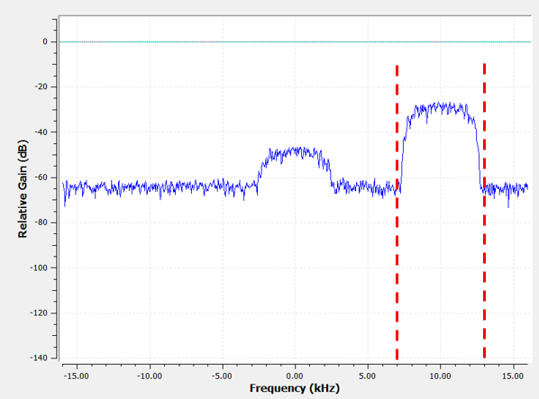

One way to design this kind of filter is to make a **low**-pass filter with a cutoff of 3 kHz and then frequency shift it.  Remember that we can frequency shift x(t) (time domain) by multiplying it by :math:`e^{j2\pi f_0t}`.  So in this case :math:`f_0` should be 10 kHz, that way it shifts our filter up by 10 kHz. Recall that in our Python code from above, h was the filter taps of the low-pass filter.  In order to create our band-pass filter we just have to multiply those taps by :math:`e^{j2\pi f_0t}`, although that involves creating a vector to represent time, based on our sample period (inverse of sample rate):

.. code-block:: python

    # (h was found using the first code snippet)

    # Shift the filter in frequency by multiplying by exp(j*2*pi*f0*t)
    f0 = 10e3 # amount we will shift
    Ts = 1.0/sample_rate # sample period
    t = np.arange(0.0, Ts*len(h), Ts) # time vector. args are (start, stop, step)
    exponential = np.exp(2j*np.pi*f0*t) # this is essentially a complex sine wave

    h_band_pass = h * exponential # do the shift

    # plot impulse response
    plt.subplot(121)
    plt.plot(np.real(h_band_pass), '.-')
    plt.plot(np.imag(h_band_pass), '.-')
    plt.legend(['real', 'imag'], loc=1)

    # plot the frequency response
    H = np.abs(np.fft.fft(h_band_pass, 1024)) # take the 1024-point FFT and magnitude
    H = np.fft.fftshift(H) # make 0 Hz in the center
    w = np.linspace(-sample_rate/2, sample_rate/2, len(H)) # x axis
    plt.subplot(122)
    plt.plot(w, H, '.-')
    plt.xlabel('Frequency [Hz]')
    plt.show()

The plot of the impulse response should look like this:

.. image:: ../_static/shifted_filter.png
   :scale: 60 % 
   :align: center 

Because our filter is not symmetrical around 0 Hz, it has to use complex taps, which means we need two lines to plot those complex taps.  What we see in the left-hand plot is still the impulse response.  Our frequency response plot is what really validates that we created the kind of filter we were hoping for, where it will filter out everything except the signal centered around 0 Hz.  Once again, remember that the plot above is *not* an actual signal, it's just a representation of the filter.  This can be very confusing, because when you apply the filter to the signal and plot the output, in the frequency domain, in many cases it will look roughly the same as the filter's frequency response itself.  

*************************
Filter Implementation
*************************

We aren't going to dive too deep into the implementation of filters, I rather focus on design of filters (you can find read-to-use implementations in any programming language anyway).  But for now, here is one take-away:  To filter a signal with an FIR filter, you simply convolve the impulse response (the array of taps) with the input signal.  So in the discrete world we use a discrete convolution (example below).  The b's are the taps.  :math:`z^{-1}` just means delay by one time step.  

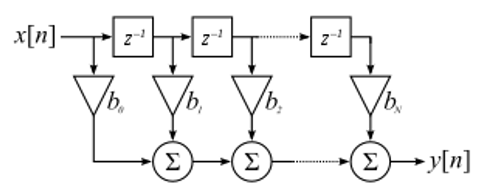

You might be able to see why we call them filter "taps" now, based on the way the filter itself is implemented. 

FIR vs. IIR
##############

There are two main classes of digital filters: FIR and IIR

1. Finite impulse response (FIR)
2. Infinite impulse response (IIR)

We won't get too deep into the theory, but for now just remember: FIR filters are easier to design, and can do anything you want if you use enough taps.  IIR filters are more complicated, have potential to be unstable, but are more efficient (use less CPU and memory for the given filter). If someone just gives you a list of taps, it's assumed they are taps for an FIR filter.  If they start mentioning "poles", they are talking about IIR filters.  We will stick with FIR filters in this textbook.

Below is an example frequency response, showing the comparison of an FIR and IIR filter that do almost exactly the same filtering; they have a similar transition-width, which as we learned will determine how many taps are required.  The FIR filter has 50 taps and the IIR filter has 12 poles, which is like having 12 taps in terms of computations required. 

.. image:: ../_static/FIR_IIR.png
   :scale: 70 % 
   :align: center 

The main take-away is that the FIR filter requires way more computational resources than the IIR, to perform roughly the same filtering operation. 

Here are some real-world examples of FIR and IIR filters that you may have used before.

If you do a "moving average" across a list of numbers, that's just an FIR filter with taps of 1's:
- h = [1 1 1 1 1 1 1 1 1 1] for a moving average filter with window size of 10.  It also happens to be a low pass type filter; why is that?  What's the difference between using 1's and using taps that decay to zero?

.. raw:: html

   

   
<a>Answers</a>

A moving average filter is a low pass filter because it smooths out "high frequency" changes, which is usually why people will use one.  The reason to use taps that decay to zero on both ends is to avoid a sudden change in the output, like if the signal being filtered was zero for a while and then suddenly jumped up. 

.. raw:: html

   

Now for an FIR example.  Have any of you ever done this: 

    x = x*0.99 + new_value*0.01

where the 0.99 and 0.01 represent the speed the value updates (or rate of decay, same thing).  It's a convenient way to slowly update some variable without having to remember the last several values.  This is actually a form of low pass IIR Filter.  Hopefully you can see why IIR filters have less stability than FIR.  Values never fully go away!

*************************
Filter Design Tools
*************************

In practice, most people will use a filter designer tool, or a function in code that designs the filter.  There are plenty of different tools, but for students I recommend this easy-to-use web app by Peter Isza that will show you impulse and frequency response: http://t-filter.engineerjs.com.  Using the default values, at the time of writing this at least, it's set up to design a low-pass filter with a passband from 0 to 400 Hz and stopband from 500 Hz and up.  The sample rate is 2 kHz, so the max frequency we can "see" is 1 kHz. 

.. image:: ../_static/filter_designer1.png
   :scale: 70 % 
   :align: center 

Click the "Design Filter" button to create the taps and plot the frequency response.

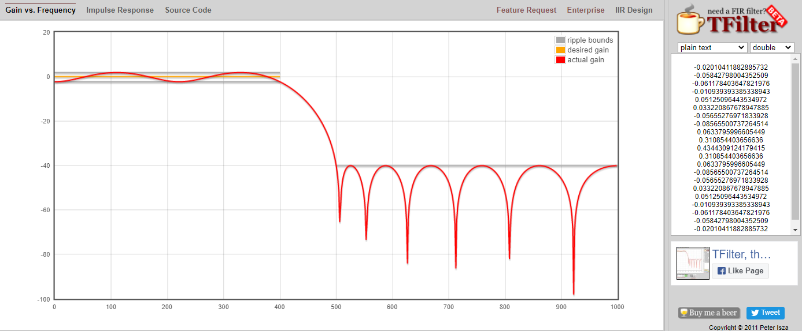

Click "Impulse Response" at the top to see the impulse response, which is just a plot of the taps, since this is an FIR filter.

.. image:: ../_static/filter_designer3.png
   :scale: 70 % 
   :align: center 

This app even includes the C++ source code to implement and use this filter.  Note that it does not include any way to design IIR filters, which are in general much more difficult to design.  

*************************
Convolution
*************************

We will take a brief detour to introduce the convolution operator, feel free to skip this section if you are already familiar with it.

Adding two signals together is one way of combining two signals into one, in the :ref:`freq-domain-chapter` chapter we talked about how the linearity property applies when adding two signals together.  Convolution is another way to combine two signals into one, but it is very different than simply adding them.  The convolution of two signals is like sliding one across the other and integrating.  It is *very* similar to a cross-correlation, if you are familiar with that operation, in fact it is equivalent to a cross-correlation in many cases.  

I believe the convolution operation is best learned through examples.  In this first example, we convolve two square pulses together:

.. image:: ../_static/convolution_animation1.gif
   :scale: 100 % 
   :align: center 
   
Because it's just a sliding integreation, the result is a triangle, with a maximum at the point where both square pulses lined up perfectly.  Let's look at what happens if we convolve a square pulse with a triangular pulse:

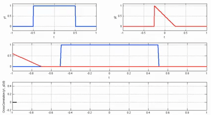

In both examples, we have two input signals (one red, one blue), and then the output of the convolution is displayed.  You can see that the output is the integration of the two signals as one slides across the other.  Because of this "sliding" nature, the length of the output is actually longer than the input.  If one signal is :code:`M` samples and the other signal is :code:`N` samples, the convolution of the two can produce :code:`N+M-1` samples.  However, functions such as :code:`numpy.convolve()` have a way to specify whether you want the whole output, or just :code:`max(M, N)` samples, or just the samples where the signals overlapped completely, which is :code:`max(M, N) - min(M, N) + 1` if you were curious.  No need to get caught up in this detail, just know that the length of the output of a convolution is not just the length of the inputs.  

So why does convolution matter in DSP?  Well for starters, to filter a signal, we can simply take the impulse response of that filter and convolve it with the signal.  It turns out FIR filtering is just a convolution operation.  

.. image:: ../_static/filter_convolve.png
   :scale: 70 % 
   :align: center 

This might be confusing because earlier we mentioned that convolution takes in two *signals* and outputs one signal.  Well we can treat the impulse response like a signal, convolution is just a math operator after all, which operates on two 1D arrays.  If one of those 1D arrays is the filter's impulse response, the other 1D array can be a piece of the input signal, and the output will be a filtered version of the input.  Let's see another example to help this click.  In the example below, the triangle will represent our filter's impulse response, and the :green:`green` signal is our signal being filtered.  

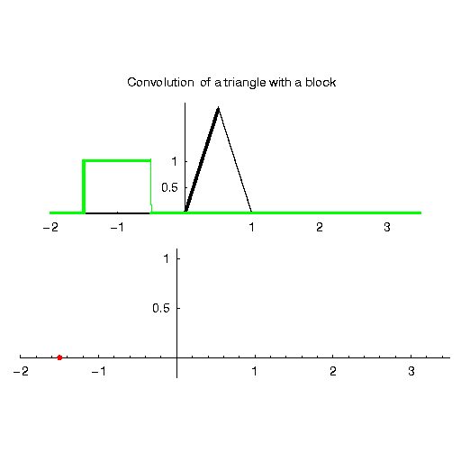

The :red:`red` output is the filtered signal.  

Question: What kind of filter was the triangle?  

.. raw:: html

   

   
<a>Answers</a>

It smoothed out the high frequency components of the green signal (i.e. the sharp transitions of the square) so it's acting as a low-pass filter.

.. raw:: html

   

Now that we are starting to understand convolution, I will present to you the mathematical equation for it.  The asterisk is typically used as the symbol for convolution:

.. math::

 (f * g)(t) = \int f(\tau) g(t - \tau) d\tau
 
In this above expression, :math:`g(t)` is the one that is flipped and slides across :math:`f(t)`, but they can be swapped and it's still the same expression.  Typically, the shorter array will be used as :math:`g(t)`.  Convolution is equal to a cross-correlation, defined as :math:`\int f(\tau) g(t+\tau)`, when :math:`g(t)` is symmetrical, i.e. when it doesn't change when flipped about the origin. 

*************************
Filter Design in Python
*************************

We will now talk about one way to design an FIR filter ourselves, in Python.  Note that there are many approaches to designing filters, in this example we will use the method of starting in the frequency domain and working backwards to find the impulse response, which is ultimately how our filter is represented (by its taps). 

You start by creating a vector of your desired frequency response.  As an example, let's design an arbitrarily shaped low-pass filter shown below:

.. image:: ../_static/filter_design1.png
   :scale: 70 % 
   :align: center 

And the code used to create this is fairly simple:

.. code-block:: python

    import numpy as np
    import matplotlib.pyplot as plt
    H = np.hstack((np.zeros(20), np.arange(10)/10, np.zeros(20)))
    w = np.linspace(-0.5, 0.5, 50)
    plt.plot(w, H, '.-')
    plt.show()

:code:`hstack()` is just one way to concatenate arrays in numpy.  We know this will lead to a filter with complex taps, why?

.. raw:: html

   

   
<a>Answer</a>

It's not symmetrical around 0 Hz

.. raw:: html

   

Our end goal is to find the taps of this filter so we can actually use it.  How do we get the taps, given the frequency response?  Well, how do we convert from the frequency domain back to the time domain?  Inverse FFT (IFFT)!  And recall that the IFFT function is almost exactly the same as the FFT function.  We also need to ifftshift our desired frequency response before the ifft, and then we need yet another iffshift after the ifft (no, they don't cancel themselves out, you can try).  This might seem confusing, but just remember that you always should fftshift after an fft, and iffshift after an ifft.  

.. code-block:: python

    h = np.fft.ifftshift(np.fft.ifft(np.fft.ifftshift(H)))
    plt.plot(np.real(h))
    plt.plot(np.imag(h))
    plt.legend(['real','imag'], loc=1)
    plt.show()

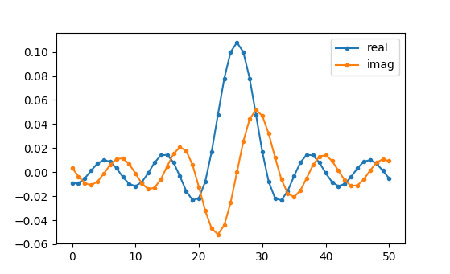

Now let's say we use these taps shown above as our filter.  We know that the impulse response is just plotting the taps, so what we see above *is* our impulse response.  Lets take the FFT of our taps to see what the frequency domain actually looks like.  We will do a 1024 point FFT to get a high resolution:

.. code-block:: python

    H_fft = np.fft.fftshift(np.abs(np.fft.fft(h, 1024)))
    plt.plot(H_fft)
    plt.show()

.. image:: ../_static/filter_design3.png
   :scale: 70 % 
   :align: center 

Note that it's not very straight... It doesn't match our original very well, recall the shape that we initially wanted to make a filter for.  A big reason is because our impulse response isn't done decaying, i.e. the left and right sides don't reach zero.  We have two options that will allow it to decay to zero:

**Option 1:** We "window" our current impulse response so that it decays to 0 on both sides.  This involves multiplying our impulse response with a "windowing function" that starts and ends at zero.

.. code-block:: python

    # After creating h using the previous code, create and apply the window
    window = np.hamming(len(h))
    h = h * window

.. image:: ../_static/filter_design4.png
   :scale: 70 % 
   :align: center 

**Option 2:** We re-generate our impulse response using more points so that it has time to decay.  To do this we need to add resolution to the original frequency domain array we started with (called interpolating).

.. code-block:: python

    H = np.hstack((np.zeros(200), np.arange(100)/100, np.zeros(200)))
    w = np.linspace(-0.5, 0.5, 500)
    plt.plot(w, H, '.-')
    plt.show()
    # (the rest of the code is the same)

.. image:: ../_static/filter_design5.png
   :scale: 60 % 
   :align: center 

.. image:: ../_static/filter_design6.png
   :scale: 70 % 
   :align: center 

|

.. image:: ../_static/filter_design7.png
   :scale: 50 % 
   :align: center 

Both options seemed to work.  Which one would you choose?  The second method resulted in more taps, but the first method resulting in a frequency response that wasn't very sharp, and the falling edge wasn't very steep.  There are many ways to design a filter, and many trade-offs along the way, many consider it an art.

*************************
Intro to Pulse Shaping
*************************

We will briefly introduce a very interesting topic within DSP, pulse shaping, a topic we explore in depth in its own chapter.  

As we learned, digital signals use symbols to represent one or more bits of information.  We use a digital modulation scheme like ASK, PSK, QAM, FSK, etc, to modulate a carrier so they can be sent wirelessly.  When we simulated QPSK in the :ref:`modulation-chapter` chapter, we only simulated one sample per symbol, i.e. each complex number we created was one of the points on the constellation, it was one symbol.  In practice we usually generate multiple samples per symbol, and the reason has to do with filtering. 

We use filters to craft the "shape" of our symbols, since the shape in the time domain will change the shape in the frequency domain.  The frequency domain is what tells us how much spectrum/bandwidth our signal is going to use, and we usually want to minimize it.  Now what's important to understand is that the spectral characteristics (frequency domain) of the baseband symbols doesn't change when we modulate a carrier, it just shifts it up in frequency, the shape stays the same, which means the amount of bandwidth it uses stays the same.  When we use 1 sample per symbol, it's kind of like transmitting square pulses, in fact BPSK using 1 sample per symbol *is* just a square wave of random 1's and -1's:

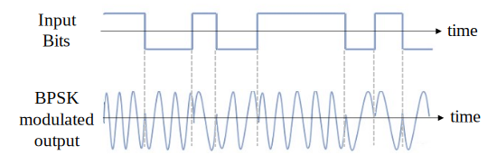

And as we have learned, square pulses are not the best, they use an excess amount of spectrum:

.. image:: ../_static/square-wave.svg
   :align: center 

So what we do is we "pulse shape" these blocky looking symbols so that they take up less bandwidth in the frequency domain.  We do this using a low-pass filter, because it will filter out the higher frequency components of our symbols.  Below shows an example of symbols in the time (top) and frequency (bottom) domain, before and after a pulse shaping filter has been applied:

.. image:: ../_static/pulse_shaping.png
   :scale: 70 % 
   :align: center 

|

.. image:: ../_static/pulse_shaping_freq.png
   :scale: 90 % 
   :align: center 

Note how much quicker the signal drops off in frequency; the sidelobes are around 30 dB lower after pulse shaping, that's 1000x less!  And more importantly, the main lobe is more narrow, so less spectrum is used for the same amount of bits per second.

For now, be aware that common pulse shaping filters include:

1. Raised-cosine filter
2. Root raised-cosine filter
3. Sinc filter
4. Gaussian filter

And these filters usually have some parameter you can adjust to tell it how tight you want the bandwidth.  For example, below shows the time and frequency domain of a raised-cosine filter with different values of :math:`\beta`, the parameter that defines how steep the roll-off is.

.. image:: ../_static/pulse_shaping_rolloff.png
   :scale: 40 % 
   :align: center 

You can see that a lower value of :math:`\beta` leads to less spectrum being used (for the same amount of data), but if you go too low then the time domain symbols take longer to decay to zero, in fact when :math:`\beta=0` they never fully decay to zero which means we can't actually transmit such symbols in practice.  A :math:`\beta` around 0.35 is common. 

You will learn a lot more about pulse shaping, including some special properties that pulse shaping filters must satisfy, in the :ref:`pulse-shaping-chapter` chapter.

