.. _freq-domain-chapter:

#####################
Frequency Domain
#####################

One of the coolest side effects of learning about DSP and wireless communications is that you will also learn to think in the frequency domain.  Most people's experience with *working* in the frequency domain is limited to adjusting the bass/mid/treble knobs on a car's audio system.  Most people's experience with *viewing* something in the frequency domain is limited to seeing an audio equalizer, such as this clip:

.. image:: ../_static/audio_equalizer.webp
   :align: center
   
In this chapter we cover what the frequency domain means, how to convert between time and frequency (plus what happens when we do so), and some interesting principles we will use later on.  By the end of this textbook, you will be a master at working in the frequency domain, guaranteed!

First, why do we like to look at signals in the frequency domain?  Well here are two example signals, shown in both the time and frequency domain.

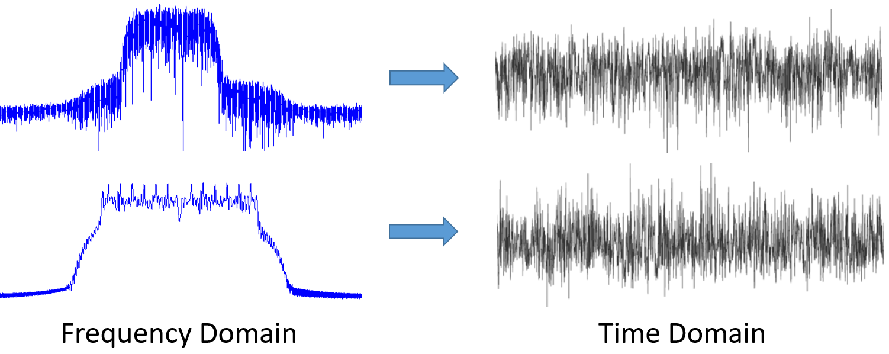

As you can see, in the time domain they both just kind of look like noise, but in the frequency domain we can see different features.  Everything is in the time domain in its natural form; when we sample signals we will be sampling them in the time domain, because you can't *directly* sample a signal in the frequency domain.  But the interesting stuff usually happens in the frequency domain. 

***************
Fourier Series
***************

The basics of the frequency domain start with understanding that any signal can be represented by sine waves summed together.  When we break a signal down into its composite sine waves, we call it a Fourier series.  Here is an example of a signal that is made up of only two sine waves:

.. image:: ../_static/summing_sinusoids.svg
   :align: center
   :target: ../_static/summing_sinusoids.svg
   
Here is another example; the red curve in the below approximates a sawtooth wave by summing up to 10 sine waves.  We can see that it's not a perfect reconstruction--it would take an infinite number of sine waves to reproduce this sawtooth wave due to the sharp transitions:

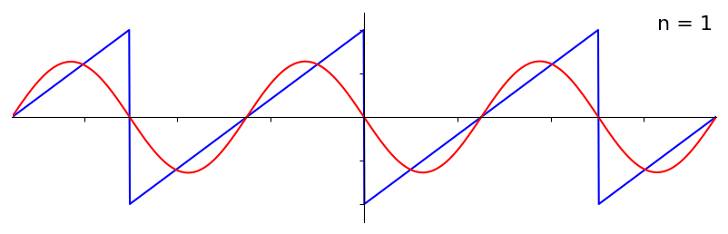
   
Some signals require more sine waves than others, and some require an infinite amount, although they can always be approximated with a limited number.  Here is another example of a signal being broken down into a series of sine waves:

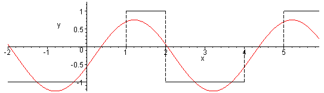

To understand how we can break down a signal into sine waves, or sinusoids, we need to first review the three attributes of a sine wave:

#. Amplitude
#. Phase
#. Frequency

**Amplitude** indicates the "strength" of the wave, while **phase** is used to represent how the sine wave is shifted in time, anywhere from 0 to 360 degrees (or 0 to :math:`2\pi`).  **Frequency** is the number of waves per second.

.. image:: ../_static/amplitude_phase_period.svg
   :align: center
   :target: ../_static/amplitude_phase_period.svg
   
At this point you may have realized that a "signal" is essentially just a function, usually represented "over time" (i.e., the x-axis). Another attribute that is easy to remember is **period**, which is the inverse of **frequency**. The **period** of a sinusoid is the amount of time, in seconds, for the wave to finish one cycle.  Thus, the unit of frequency is 1/seconds, or Hz.
   
When we decompose a signal into a summation of sine waves, each one will have a certain **amplitude**, **phase**, and **frequency**.  Each sine wave's **amplitude** will tell us how strong the **frequency** existed in the original signal.  Don't worry too much about **phase** for now, other than realizing that the only difference between sin() and cos() is a phase shift (time shift).

It's more important to understand the underlying concept than the actual equations to solve for a Fourier series, but for those who are interested in the equations I refer you to Wolfram's concise explaination: https://mathworld.wolfram.com/FourierSeries.html.  

********************
Time-Frequency Pairs
********************

We have established that signals can be represented as sine waves, which have several attributes. Now, let's learn to plot signals in the frequency domain. While the time domain demonstrates how a signal changes over time, the frequency domain displays how much of a signal rests in which frequencies. Instead of the x-axis being time it will be frequency.  We can plot a given signal in both time *and* frequency.  Let's look at some simple examples to start.

Here is what a sine wave, with frequency f, looks like in the time and frequency domain:

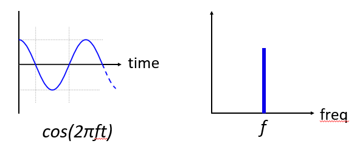

The time domain should look very familiar. It's an oscillating function. Don't worry about at what point in the cycle it starts or how long it lasts.  The take-away is that the signal has a **single frequency**, which is why we see a single spike/peak in the frequency domain.  Whichever frequency that sine wave oscillates at will be where we see the spike in the frequency domain.  The mathematical name for a spike like this is called an "impulse".

Now what if we had an impulse in the time domain?  Imagine a sound recording of someone clapping their hands or hitting a nail with a hammer.  This time-frequency pair is a little less intuitive.

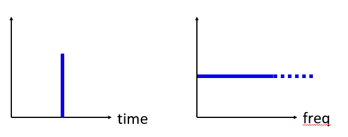

As we can see, a spike/impulse in the time domain is flat in the frequency domain, and theoretically it contains every frequency. There is no theoretically perfect impulse because it would have to be infinitely short in the time domain.  Like the sine wave, it doesn't matter where in the time domain the impulse happens.  The important take-away here is that quick changes in time domain result in many frequencies occurring.

Next let's look at the time and frequency domain plots of a square wave:

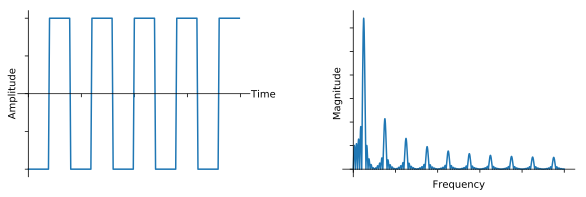
   
This one is also less intuitive, but we can see that the frequency domain has a strong spike at 10 Hz, which is the frequency of the square wave, but it also seems to keep going.  It is due to the quick change in time domain, just like in the previous example.  But it's not flat in frequency. It has spikes at intervals, and the level slowly decays (although it will continue forever).  A square wave in time domain has a sin(x)/x pattern in the frequency domain (a.k.a. the sinc function).

Now what if we have a constant signal in the time domain?  A constant signal has no "frequency".   Let's see:

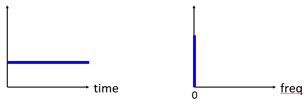
   
Because there is no frequency, in the frequency domain we have a spike at 0 Hz. It makes sense if you think about it.  The frequency domain is not going to be "empty" because that only happens when there is no signal present (i.e., time domain of 0s).  We call 0 Hz in the frequency domain "DC", because it's caused by a DC signal in time (a constant signal that doesn't change).  Note that if we increase the amplitude of our DC signal in the time domain, the spike at 0 Hz in the frequency domain will also increase.

Later on we will learn about what exactly the y-axis in the frequency domain plot means, but for now you can think of it as a sort of amplitude that tells you how much of that frequency was present in the time domain signal.
   
*****************
Fourier Transform
*****************

Mathematically, the "transform" we use to go from the time domain to the frequency domain and back is called the Fourier Transform.  It is defined as follows:

.. math::
   X(f) = \int x(t) e^{-j2\pi ft} dt

For a signal x(t) we can get the frequency domain version, X(f), using this formula.  We will represent the time domain version of a function with x(t) or y(t), and the corresponding frequency domain version with X(f) and Y(f).  Note the "t" for time, and "f" for frequency. The "j" is simply the imaginary number. You may have seen it as "i" in high school math class.  We use "j" in engineering and computer science because "i" is often referring to current, and in programming it's often used as an iterator.

To return to the time domain from frequency is almost the same, aside from a scaling factor and negative sign:

.. math::
   x(t) = \frac{1}{2 \pi} \int X(f) e^{j2\pi ft} df

Note that a lot of textbooks and other resources use :math:`w` in place of the :math:`2\pi f`.  :math:`w` is angular frequency in radians, while :math:`f` is in Hz.  All you have to know is that

.. math::
   \omega = 2 \pi f

Even though it adds a :math:`2 \pi` term to many equations, it's easier to stick with frequency in Hz. Ultimately you will work with Hz in your SDR application.

The above equation for the Fourier Transform is the continuous form, which you will only see in math problems.  The discrete form is much closer to what is implemented in code:

.. math::
   X_k = \sum_{n=0}^{N-1} x_n e^{-\frac{j2\pi}{N}kn}
   
Note that the main difference is we replaced the integral with a summation.  The index :math:`k` goes from 0 to N-1.  

It's OK if none of these equations mean much to you. We actually don't need to use them directly to do cool stuff with DSP and SDRs!

*************************
Time-Frequency Properties
*************************

Earlier we examined examples of how signals appear in the time domain and the frequency domain.  Now, we will cover five important "Fourier properties".  These are properties that tell us if we do ____ to our time domain signal, then ____ happens to our frequency domain signal.  It will give us an important insight into the type of Digital Signal Processing (DSP) we will perform on time domain signals in practice.

1. Linearity Property:

.. math::
   a x(t) + b y(t) \leftrightarrow a X(f) + b Y(f)

This property is probably the easiest to understand.  If we add two signals in time, then the frequency domain version will also be the two frequency domain signals added together.  It also tells us that if we multiply either one by a scaling factor, the frequency domain will also scale by the same amount.  The utility of this property will become more apparent when we add together multiple signals.

2. Frequency Shift Property:

.. math::
   e^{2 \pi j f_0 t}x(t) \leftrightarrow X(f-f_0)

The term to the left of x(t) is what we call a "complex sinusoid" or "complex exponential". For now, all we need to know is that it's essentially just a sine wave at frequency :math:`f_0`.  This property tells us that if we take a signal :math:`x(t)` and multiply it by a sine wave, then in the frequency domain we get :math:`X(f)` except shifted by a certain frequency, :math:`f_0`.  This shift in frequency may be easier to visualize:

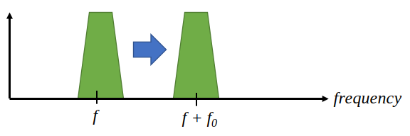

Frequency shift is integral to DSP because we will want to shift signals up and down in frequency for many reasons. This property tells us how to do that (multiply by a sine wave).  Here's another way to visualize this property:

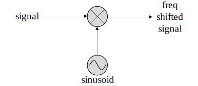
   
3. Scaling in Time Property:

.. math::
   x(at) \leftrightarrow X\left(\frac{f}{a}\right)

On the left hand side of the equation, we can see that we are scaling our signal x(t) in the time domain. Here is an example of a signal being scaled in time, and then what happens to the frequency domain versions of each one.

.. image:: ../_static/time-scaling.svg
   :align: center
   :target: ../_static/time-scaling.svg

Scaling in time essentially shrinks or expands the signal in the x-axis.  What this property tells us is that scaling in the time domain causes inverse scaling in the the frequency domain.  For example, when we transmit bits faster we have to use more frequencies.  The property helps to explain why higher data rate signals take up more bandwidth/spectrum.  If time-frequency scaling was proportional instead of inversely proportional, cellular carriers would be able to transmit all the bits per second they wanted without paying billions for spectrum!  Unfortunately that's not the case.

Those already familiar with this property may notice a scaling factor missing; it is left out for the sake of simplicity. For practical purposes it doesn't make a difference.

4. Convolution Property:

.. math::
   \int x(\tau) y(t-\tau) d\tau  \leftrightarrow X(f)Y(f)

It is called the convolution property because in the time domain we are convolving x(t) and y(t).  You may not know about the convolution operation yet, so for now imagine it like a cross-correlation. When we convolve time domain signals, it's equivalent to multiplying the frequency domain versions of those two signals.  It is very different from adding together two signals.  When you add two signals, as we saw, nothing really happens, you just add together the frequency domain version.  But when you convolve two signals, it's like creating a new third signal from them.  Convolution is the single most important technique in DSP, though we must understand how filters work first to fully grasp it.

Before we move on, to briefly explain why this property is so important, consider this situation: you have one signal you want to receive, and there is an interfering signal next to it.

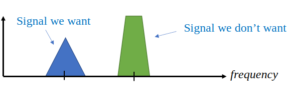
   
The concept of masking is heavily used in programming, so let's use it here.  What if we could create the mask below, and multiply it by the signal above in order to mask out the one we don't want?

.. image:: ../_static/masking.svg
   :align: center
   :target: ../_static/masking.svg

We usually perform DSP operations in the time domain, so let's utilize the convolution property to see how we can do this masking in the time domain.  Let's say that x(t) is our received signal.  Let Y(f) be the mask we want to apply in the frequency domain.  Well that means y(t) is the time domain representation of our mask, and if we convolve it with x(t), we can "filter out" the signal we don't want.

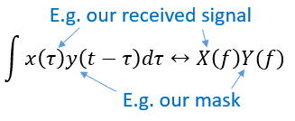
   
When we discuss filtering, the colvolution property will make more sense.

Lastly, I want to point out that the convolution property works in reverse, although we won't be using it as much as the time domain convolution:

.. math::
   x(t)y(t)  \leftrightarrow  \int X(g) Y(f-g) dg

There are other properties, but the above four are the most crucial to understand in my opinion.  Even though we didn't step through the proof for each property, the point is we use the mathematical properties to gain insight into what happens to real signals when we do analysis and processing.  Don't get caught up on the equations. Make sure you understand the description of each property.

******************************
Fast Fourier Transform (FFT)
******************************

Now back to the Fourier Transform. I showed you the equation for the discrete Fourier Transform, but what you will be using while coding 99.9% of the time will be the FFT function, fft().  The Fast Fourier Transform (FFT) is simply an algorithm to compute the discrete Fourier Transform.  It was developed decades ago, and even though there are variations on the implementation, it's still the reigning leader for computing a discrete Fourier transform. Lucky, considering they used "Fast" in the name.

The FFT is a function with one input and one output.  It converts a signal from time to frequency: 

.. image:: ../_static/fft-block-diagram.svg
   :align: center
   :target: ../_static/fft-block-diagram.svg
   
We will only be dealing with 1 dimension FFTs in this textbook (2D is used for image processing and other applications). For our purposes, think of the FFT function as having one input: a vector of samples, and one output: the frequency domain version of that vector of samples.  The size of the output is always the same as the size of the input. If I feed 1,024 samples into the FFT, I will get 1,024 out.  The confusing part is that the output will always be in the frequency domain, and thus the "span" of the x-axis if we were to plot it doesn't change based on the number of samples in the time domain input.  Let's visualize that by looking at the input and output arrays, along with the units of their indices:

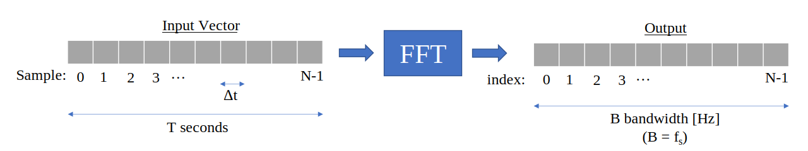

Because the output is in the frequency domain, the span of the x-axis is based on the sample rate, which we will cover next chapter.  When we use more samples for the input vector, we get a better resolution in the frequency domain (in addition to processing more samples at once).  We don't actually "see" more frequencies by having a larger input. The only way would be to increase the sample rate (decrease the sample period :math:`\Delta t`).

How do we actually plot this output?  As an example let's say that our sample rate was 1 million samples per second (1 MHz).  As we will learn next chapter, that means we can only see signals up to 0.5 MHz, regardless of how many samples we feed into the FFT.  The way the output of the FFT gets plotted is as follows:

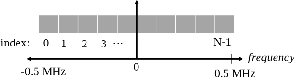

It is always the case; the output of the FFT will always show :math:`\text{-} f_s/2` to :math:`f_s/2` where :math:`f_s` is the sample rate.  The output will always have a negative portion and positive portion, assuming the input was a complex number (which tends to be the case in DSP).

********************
Negative Frequencies
********************

What in the world is a negative frequency?  For now, just know that they have to do with using complex numbers (imaginary numbers)--there isn't really such thing as a "negative frequency", it's just a representation we use.  Here's an intuitive way to think about it.  Consider we tell our SDR to tune to 100 MHz (the FM radio band) and sample at a rate of 10 MHz.  In other words, we will view the spectrum from 95 MHz to 105 MHz.  Perhaps there are three signals present:

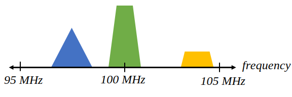
   
Now, when the SDR gives us the samples, it will appear like this:

.. image:: ../_static/negative-frequencies3.svg
   :align: center
   :target: ../_static/negative-frequencies3.svg

Remember that we tuned the SDR to 100 MHz.  So the signal that was at about 97.5 MHz shows up at -2.5 MHz, which is a negative frequency.  In reality it's just a frequency lower than the center frequency.  It will make more sense when we learn more about sampling and use our SDRs.

****************************
Order in Time Doesn't Matter
****************************
One last property before we jump into FFTs.  The FFT function sort of "mixes around" the input signal to form the output, which has a different scale and units. We are no longer in the time domain after all.  A good way to internalize this difference between domains is realizing that changing the order things happen in the time domain doesn't change the frequency components in the signal.  I.e., the FFT of the following two signals will both have the same two spikes because the signal is just two sine waves at different frequencies.  Changing the order the sine waves occur doesn't change the fact that they are two sine waves at different frequencies.

.. image:: ../_static/fft_signal_order.png
   :scale: 50 % 
   :align: center 
   
Technically, the phase of the FFT will change because of the time-shift of the sinusoids; however, 99% of the time we are only concerned with the magnitude of the FFT, as we will learn shortly.
   
*******************
FFT in Python
*******************

Now that we have learned about what an FFT is and how the output is represented, let's actually look at some Python code and use Numpy's FFT function, np.fft.fft().  It is recommended that you use a full Python console/IDE on your computer, but in a pinch you can use the online web-based Python console linked at the bottom of the navigation bar on the left.

First we need to create a signal in the time domain.  Feel free to follow along with your own Python console. To keep things simple, we will make a simple sine wave at 0.15 Hz.  We will also use a sample rate of 1 Hz, meaning in time we sample at 0, 1, 2, 3 seconds, etc.

.. code-block:: python

 import numpy as np
 t = np.arange(100)
 s = np.sin(0.15*2*np.pi*t)

If we plot s it looks like:

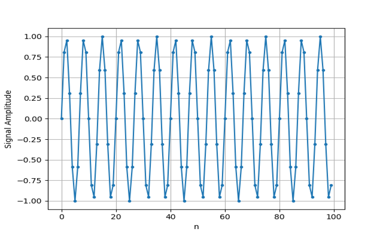

Next let's use Numpy's FFT function:

.. code-block:: python

 S = np.fft.fft(s)

If we look at S we see it's an array of complex numbers:

.. code-block:: python

    S =  array([-0.01865008 +0.00000000e+00j, -0.01171553 -2.79073782e-01j,0.02526446 -8.82681208e-01j,  3.50536075 -4.71354150e+01j, -0.15045671 +1.31884375e+00j, -0.10769903 +7.10452463e-01j, -0.09435855 +5.01303240e-01j, -0.08808671 +3.92187956e-01j, -0.08454414 +3.23828386e-01j, -0.08231753 +2.76337148e-01j, -0.08081535 +2.41078885e-01j, -0.07974909 +2.13663710e-01j,...

Hint: regardless of what you’re doing, if you ever run into complex numbers, try calculating the magnitude and the phase and see if they make more sense.  Let's do exactly that, and plot the magnitude and phase.  In most languages, abs() is a function for magnitude of a complex number.  The function for phase varies, but in Python it's :code:`np.angle()`.

.. code-block:: python

 import matplotlib.pyplot as plt
 S_mag = np.abs(S)
 S_phase = np.angle(S)
 plt.plot(t,S_mag,'.-')
 plt.plot(t,S_phase,'.-')

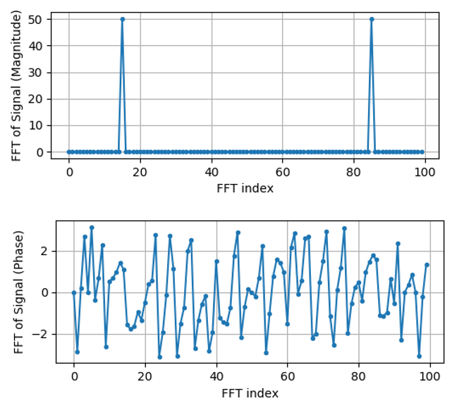

Right now we aren't providing any x-axis to the plots, it's just the index of the array (counting up from 0).  Due to mathematical reasons, the output of the FFT has the following format:

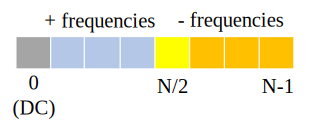
   
But we want 0 Hz (DC) in the center and negative freqs to the left (that's just how we like to visualize things).  So any time we do an FFT we need to perform an "FFT shift", which is just a simple array rearrangement operation, kind of like a circular shift but more of a "put this here and that there".  The diagram below fully defines what the FFT shift operation does:

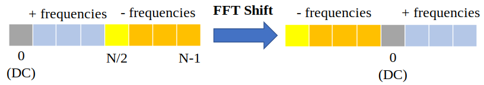

For our convenience, Numpy has an FFT shift function, :code:`np.fft.fftshift()`.  Replace the np.fft.fft() line with:

.. code-block:: python

 S = np.fft.fftshift(np.fft.fft(s))

We also need to figure out the x-axis values/label.  Recall that we used a sample rate of 1 Hz to keep things simple.  That means the left edge of the frequency domain plot will be -0.5 Hz and the right edge will be 0.5 Hz.  If that doesn't make sense, it will after you get through the chapter on :ref:`sampling-chapter`.  Let's stick to that assumption that our sample rate was 1 Hz, and plot the FFT output's magnitude and phase with a proper x-axis label.  Here is the final version of this Python example and the output:

.. code-block:: python

 import numpy as np
 import matplotlib.pyplot as plt
 
 t = np.arange(100)
 s = np.sin(0.15*2*np.pi*t)
 S = np.fft.fftshift(np.fft.fft(s))
 S_mag = np.abs(S)
 S_phase = np.angle(S)
 f = np.arange(-0.5,0.5,1/100.0)
 plt.figure(0)
 plt.plot(f, S_mag,'.-')
 plt.figure(1)
 plt.plot(f, S_phase,'.-')
 plt.show()

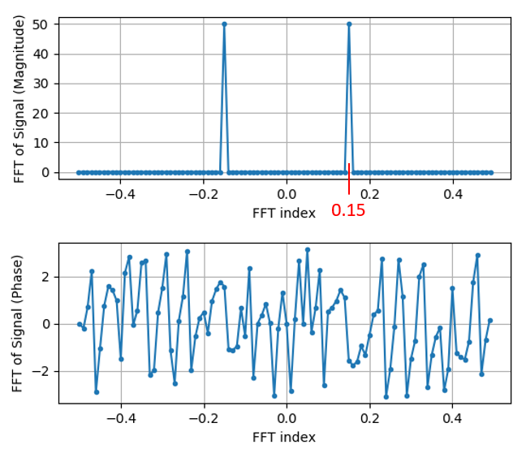

Note that we see our spike at 0.15 Hz, which is the frequency we used when creating the sine wave. So that means our FFT worked!  If we did not know the code used to generate that sine wave, but we were just given the list of samples, we could use the FFT to determine the frequency. The reason why we see a spike also at -0.15 Hz has to do with the fact it was a real signal, not complex, and we will get deeper into that later. 

******************************
Windowing
******************************

When we use an FFT to measure the frequency components of our signal, the FFT assumes that it's being given a piece of a *periodic* signal.  It behaves as if the piece of signal we provided continues to repeat indefintely. It's as if the last sample of the slice connects back to the first sample.  It stems from the theory behind the Fourier Transform.  It means that we want to avoid sudden transitions between the first and last sample because sudden transitions in the time domain look like many frequencies, and in reality our last sample doesn't actually connect back to our first sample.  To put it simply: if we are doing an FFT of 100 samples, using :code:`np.fft.fft(x)`, we want :code:`x[0]` and :code:`x[99]` to be equal or close in value.

The way we make up for this cyclic property is through "windowing".  Right before the FFT, we multiply the slice of signal by a window function, which is just any function that tapers to zero on both ends.  That ensures the slice of signal will begin and end at zero and connect.  Common window functions include Hamming, Hanning, Blackman, and Kaiser.  When you don't apply any windowing, it's called using a "rectangular" window because it's like multiplying by an array of ones.   Here is what several window functions look like:

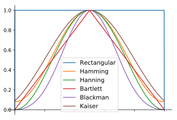

A simple approach for beginners is to just stick with a Hamming window, which can be created in Python with :code:`np.hamming(N)` where N is the number of elements in the array, which is your FFT size.  In the above exercise, we would apply the window right before the FFT. After the 2nd line of code we would insert:

.. code-block:: python

 s = s * np.hamming(100)

If you are afraid of choosing the wrong window, don't be.  The difference between Hamming, Hanning, Blackman, and Kaiser is very minimal compared to not using a window at all since they all taper to zero on both sides and solve the underlying problem.

*******************
FFT Sizing
*******************

The last thing to note is FFT sizing.  The best FFT size is always an order of 2 because of the way the FFT is implemented.  You can use a size that is not an order of 2, but it will be slower. Common sizes are between 128 and 4,096, although you can certainly go larger.  In practice we may have to process signals that are millions or billions of samples long, so we need to break up the signal and do many FFTs.  That means we will get many outputs. We can either average them up or plot them over time (especially when our signal is changing over time).  You don't have to put *every* sample of a signal through an FFT to get a good frequency domain representation of that signal. For example you could only FFT 1,024 out of every 100k samples in a signal and it will still probably look fine, as long as the signal is always on.

*********************
Spectrogram/Waterfall
*********************

A spectrogram is the plot that shows frequency over time.  We can also show it in real-time, often refered to as a waterfall.  A spectrum analyzer is the piece of equipment that shows this spectrogram/waterfall.  Here is an example of a spectrogram, with frequency on the horizontal/x-axis and time on the vertical/y-axis.  Blue represents the lowest energy and red is the highest. We can see that there is a strong spike at DC (0 Hz) in the center with a varying signal around it.  Blue represents our noise floor.

.. image:: ../_static/waterfall.png
   :scale: 120 % 
   :align: center 
