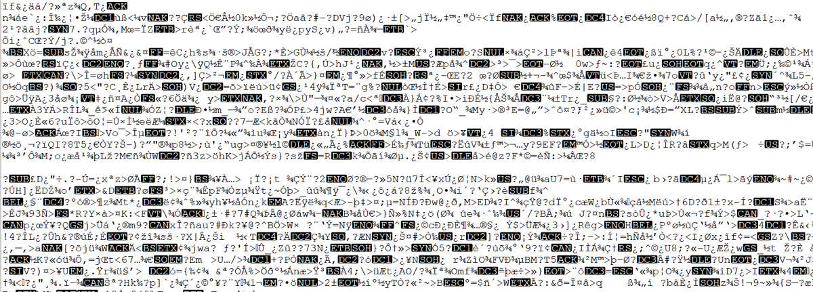
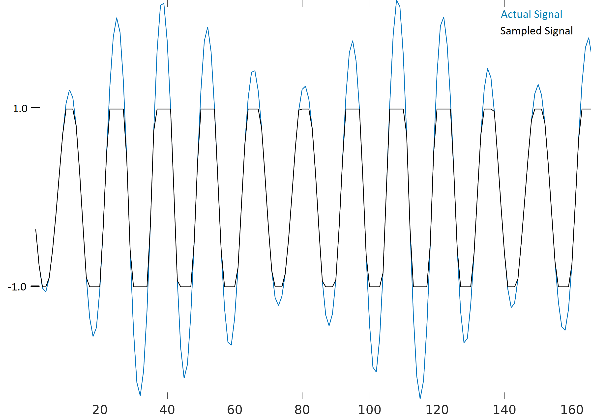

#############
IQ Files
#############

In our Python examples we have stored signals as 1d numpy arrays of type "complex float".  In this chapter we learn how signals can be stored to a file, and how to read them back into Python.  You may want to record a signal to a file in order to manually analyze it offline, or share it with a colleague. 

*************************
Binary Files
*************************

Recall that a digital signal at baseband is just a bunch of complex numbers,

Example: [0.123 + j0.512,    0.0312 + j0.4123,    0.1423 + j0.06512, ...]

These numbers correspond to [I+jQ, I+jQ, I+jQ, I+jQ, I+jQ, I+jQ, I+jQ, ...]

When we want to save complex numbers to a file, all we do is save them in the format IQIQIQIQIQIQIQIQ...  So it's just a bunch of floats in a row, and we know that the first one is an I (not that it really matters, if you swap every I and Q the signal will look roughly the same).

While it's possible to store these numbers in a text file, or csv file, we almost always prefer to save them in what's called a "binary file" in order to save space.  At high sample rates your signal recordings could easily be multiple GB, so we want to be as memory efficient as possible.  If you have ever opened a file in a text editor and it looked like the screenshot below, it was probably a binary file.  Binary files are just a series of bytes, and you have to keep track of the format yourself.  They are the most efficient way to store data, assuming all possible compression has been performed. Because our signals usually appear a lot like a random sequence of floats, we don't typically attempt to perform compression.  Binary files are used for plenty of other things, e.g. compiled programs (called "binaries").  When used to save signals we call them binary "IQ files", and often use the file extension .iq. 

In Python, the default complex type is np.complex128, which uses two 64-bit floats per sample.  But in DSP/SDR, we almost always use 32-bit floats instead, because the ADC's on our SDRs don't have **that** much precision to warrant 64-bit floats.  So in Python we will use **np.float64**, which use two 32-bit floats.  When you are just processing a signal in Python in doesn't really matter, but when you go to save the 1d array to a file, you want to make sure it's an array of np.float64 first.

*************************
Python Examples
*************************

In Python, and numpy specifically, we use the tofile() function to store a numpy array to a file.  Here is a short example of creating a simple BPSK signal plus noise and saving it to a file in the same directory we ran our script from.

.. code-block:: python

	import numpy as np
	import matplotlib.pyplot as plt
	
	num_symbols = 10000
	
	x_symbols = np.random.randint(0, 2, num_symbols)*2-1 # -1 and 1's
	n = (np.random.randn(num_symbols) + 1j*np.random.randn(num_symbols))/np.sqrt(2) # AWGN with unity power
	r = x_symbols + n * np.sqrt(0.01) # noise power of 0.01
	print(r)
	plt.plot(np.real(r), np.imag(r), '.')
	plt.grid(True)
	plt.show()
	
	# Now save to an IQ file
	print(type(r[0])) # Check data type.  Ooops it's 128 not 64!
	r = r.astype(np.complex64) # Convert to 64
	print(type(r[0])) # Verify it's 64
	r.tofile('bpsk_in_noise.iq') # Save to file

Now look at the details of the file that was produced and check how many bytes it is.  It should be num_symbols * 8, because we used np.complex64 which is 8 bytes per sample, 4 bytes per float (2 floats per sample).  

Using a new Python script, we can read in this file using np.fromfile(), like so:

.. code-block:: python

	import numpy as np
	import matplotlib.pyplot as plt
	
	samples = np.fromfile('bpsk_in_noise.iq', np.complex64) # Read in file.  We have to tell it what format it is
	print(samples)
	
	# Plot constellation to make sure it looks right
	plt.plot(np.real(samples), np.imag(samples), '.')
	plt.grid(True)
	plt.show()

A big mistake is to forget to tell np.fromfile() what the file format is, since binary files don't include any information about their format, and by default np.fromfile() assumes an array of float64's.

Most other languages have methods to read in binary files, e.g. in MATLAB you can use fread().

For those who have a PlutoSDR, the below code will grab a set of samples from the Pluto and save them to a file.  It tunes to 751 MHz which is an LTE signal in the US, and uses a sample rate of 5 MHz.  For a longer collect you will want to call :code:`sdr.rx()` multiple times and concatenate all the sample batches together.

.. code-block:: python

	import adi
	import numpy as np
	sdr = adi.Pluto('ip:192.168.2.1')
	sdr.sample_rate = int(5e6)
	sdr.rx_rf_bandwidth = int(5e6)
	sdr.rx_lo = int(751e6)
	sdr.gain_control_mode = "slow_attack" # automatic gain control
	samples = sdr.rx()
	samples = samples.astype(np.complex64) # by default numpy uses complex128
	samples.tofile('collect_751MHz.iq')

*************************
Max Values and Saturation
*************************

When receiving samples off an SDR it's important to know what the maximum sample value is.  Many SDRs will have a maximum value of 1.0 and minimum value of -1.0.  Some SDRs give you samples as integers, usually 16-bit, in which case the max and min values will be +32767 and -32768, and you will want to divide by 32768 to convert them to floats from -1.0 to 1.0.  The reason to be aware of what the maximum value is for your SDR, is because when an extremely loud signal gets received (or the gain is set too high), the receiver will "saturate" and it will truncate the high values to whatever the maximum sample value is.  This is all because the ADCs on our SDRs have a limited number of bits.  When making an SDR app it's wise to always be checking for saturating.

A signal that is saturated will look choppy in the time domain, like this:

And because of the sudden changes in time domain, due to the truncation, the frequency domain might look smeared.  In other words, the frequency domain will include false features; features that resulted from the saturation and are not actually part of the signal, which can throw people off. 

*************************
Annotating IQ Files
*************************

Since the IQ file itself doesn't have any metadata associated with it, it's common to have a 2nd file with the same filename but a .txt or other file extension, that contains information about the signal.  This should at a minimum include the sample rate used to collect the signal, and the frequency the SDR was tuned to.  After analyzing the signal, the metadata file could include information about sample ranges that included bursts of energy, for example.  The sample index is simply an integer that starts at 0, and increments every complex sample.  If you knew that there was energy from sample 492342 to 528492, then you could read in the file and pull out that portion of the array: :code:`samples[492342:528493]`.
