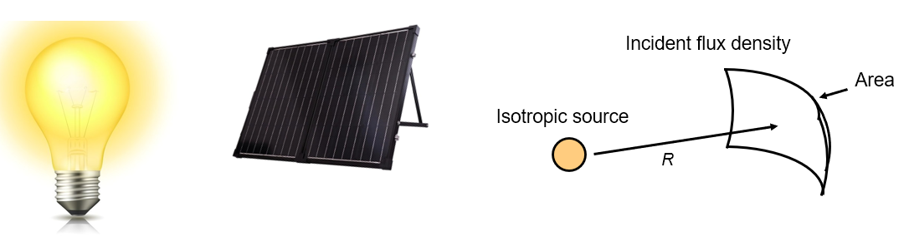
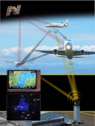

##################
Link Budgets
##################

*************************
Intro
*************************

A link budget is an accounting of all of the gains and losses from the transmitter, through the medium, to the receiver in a communication system.  Link budgets describe one direction of the wireless link.  Most communications systems are bidirectional, so there must be a separate uplink and downlink budget.  The "result" of the link budget will tell you roughly how much SNR you should expect to have at your receiver.  Further analysis would be needed to check if that SNR is high enough for your application.

You study link budgets not for the purpose of being able to actually make a link budget for some situation, but to learn, and develop a system-layer point of view of wireless communications.  

We will first go over the received signal power budget, then the noise power budget, and then combine the two to find SNR (signal power divided by noise power).  

*************************
Signal Power Budget
*************************

Below shows the most basic diagram of a generic wireless link.  In this chapter we will focus on one direction, i.e. from a transmitter (TX) to receiver (Rx).  We know the transmit power (it is usually a setting in the transmitter), so how do we figure out the received power at the receiver?

.. image:: ../_static/tx_rx_system.PNG
   :scale: 80 % 
   :align: center 

Let us define the following four system parameters:

- **Pt** - Transmit power
- **Gt** - Gain of transmit antenna
- **Gr** - Gain of receive antenna
- **Lp** - Distance between Tx and Rx (i.e. how much wireless path loss)

.. image:: ../_static/tx_rx_system_params.PNG
   :scale: 80 % 
   :align: center 

Transmit Power
#####################

Transmit power is fairly straightforward, it will be a value in watts, dBW, or dBm (recall dBm is shorthand for dBmW).  Every transmitter has one or more amplifiers, and the transmit power is mostly a function of those amplifiers.  Analogy- the watts of a lightbulb determine how much light it "transmits".  Examples of approximate max transmit power for different technologies:

==================  =====  =======
\                       Power    
------------------  --------------
Bluetooth           10 mW  -20 dBW   
WiFi                100mW  -10 dBW
LTE base-station    1W     0 dBW
FM station          10kW   40 dBW
==================  =====  =======

Antenna Gains
#####################

Transmit and receive antenna gains are very important, the numbers will be in dB (unitless).  Typically, antennas are either omnidirectional or directional.  If they are omnidirectional their gain will be 0 dB to 3 dB.  A directional antenna can have a gain anywhere up to 50 dB or so.  

.. image:: ../_static/antenna_gain_patterns.PNG
   :scale: 80 % 
   :align: center 

When a directional antenna is used, it must be either:

- installed facing the correct direction
- it could also be attached to a mechanical gimbal
- it could also be a phased array which can be electronically steered (i.e. in software)

.. image:: ../_static/antenna_steering.PNG
   :scale: 80 % 
   :align: center 
   
Omnidirectional antennas are used when pointing in the right direction is not possible, like your cellphone and laptop.  In 5G, phones can operate in the higher frequency bands like 28 GHz (Verizon) and 39 GHz (AT&T) using an array of antennas and beam steering.

If we are using a directional **transmit** antenna (e.g. 30 dB gain), then in our link budget we will assume the transmit antenna is pointed at the receiver.  Likewise, for the receive side.  If it's not pointed correctly then our link budget won't be accurate and there could be loss of comms (e.g. satellite dish on your roof gets hit by basketball and moves).  In general our link budgets assume ideal circumstances, but then add a miscellaneous loss to account for real-world factors.

Path Loss
#####################

As a signal moves through the air (or vacuum) it will reduce in strength.  Imagine holding a small solar panel up in front of a light bulb.  The further away the solar panel is, the less energy it will absorb from the light bulb.  Flux is a term in physics and mathematics- "How much stuff goes through your thing".  For us, the amount of electromagnetic field passing into our receive antenna.  We want to know how much power is lost, for a given distance.  

Free Space Path Loss (FSPL) tells us the path loss when there are no obstacles, in dB.  In its general form, :math:`\mathrm{FSPL} = ( 4\pi d / \lambda )^2`. Google Friis transmission formula for more info.  For generating link budgets, just use this equation:

.. math::
 \mathrm{FSPL}_{dB} = 20 \log_{10} d + 20 \log_{10} f - 147.55 \left[ dB \right]

:math:`d` is in meters and is the distance between the transmitter and receiver
:math:`f` is in Hz and is the carrier frequency.  In link budgets it will show up in dB, unitless because it is a loss.

There's only one problem with this simple equation; we won't always have free space between the transmitter and receiver.  E.g. indoors there is a lot of bouncing (most frequencies can go through walls, just not metal or thick masonry). For these situations there are various non-free-space models. a common one is the Okumura–Hata model, for cities and suburban areas (e.g. cellular):

.. math::
 L_{path} = 69.55 + 26.16 \log_{10} f - 13.82 \log_{10} h_B - C_H + \left[ 44.9 - 6.55 \log_{10} h_B \right] \log_{10} d

where :math:`L_{path}` is the path loss in dB, :math:`h_B` is the height of the transmit antenna above ground level in meters, :math:`f` is the carrier frequency in MHz, :math:`d` is the distance between Tx and Rx in km, and :math:`C_H` is called the "antenna high correction factor" and it's defined based on the size of city and carrier frequency range:

:math:`C_H` for small/medium cities:

.. math::
 C_H = 0.8 + (1.1 \log_{10} f - 0.7 ) h_M - 1.56 \log_{10} f

:math:`C_H` for large cities when :math:`f` is below 200 MHz:

.. math::
 C_H = 8.29 ( log_{10}(1.54 h_M))^2 - 1.1
 
:math:`C_H` for large cities when :math:`f` is above 200 MHz but less than 1.5 GHz:

.. math::
 C_H = 3.2 ( log_{10}(11.75 h_M))^2 - 4.97

where :math:`h_M` is the height of the reciving antenna above ground level in meters.  Don't worry if the above Okumura–Hata model seemed confusing, it is mainly shown here to demonstrate how non-free-space path loss models are much more complicated than our simple FSPL equation.  The final result of any of these models is a single number we can use for the path loss portion of our link budget.

Misc Losses
#####################

In our link budget we also want to take into account miscellaneous losses.  We will just lump these together into one term, usually somewhere between 1 – 3 dB.  Examples of misc. losses:

-Cable loss
-Atmospheric Loss
-Antenna pointing imperfections
-Rain

The plot below shows atmospheric loss in dB/km, over frequency (we will usually be < 40 GHz).  If you take some time to understand the y-axis you'll see that short range communications below 40 GHz, that are less than 1 km, have 1 dB or less of atmosphieric loss, and thus we can usually ignore it.  When atmospheric loss really comes into play is with satellite communications, where the signal has to travel many km through the air.

.. image:: ../_static/atmospheric_attenuation.PNG
   :scale: 80 % 
   :align: center 

Signal Power Equation
#####################

Now it's time to put all of these gains and losses together, to calculate our signal power at the receiver, :math:`P_r`:

.. math::
 P_r = P_t + G_t + G_r - L_p - L_{misc} \quad \mathrm{dBW}

Overall it's a pretty simple equation, we are just adding up gains/losses, some might not even consider it an equation at all.  We usually show it in a table, similar to accouting, like this:

.. list-table::
   :widths: 15 10
   :header-rows: 0
   
   * - Pt = 1.0 W
     - 0 dBW
   * - Gt = 100
     - 20.0 dB
   * - Gr = 1
     - 0 dB
   * - Lp
     - -162.0 dB
   * - Lmisc
     - -1.0 dB
   * - **Pr**
     - **-143.0 dBW**

*************************
Noise Power Budget
*************************

Now that we know the received signal power, let's switch to looking at the received noise, since we need both to calculate SNR after all.  We can find received noise with a similar style power budget. 

Now is a good time to talk about where noise enters our comms link.  Answer: At the receiver!  The signal is not corrupted with noise until we go to receive it.  This is *extremely* important to understand, many students don't quite internalize it, and end up making a foolish error as a result.  There is not noise floating around us in the air, the noise comes from the fact that our receiver has an amplifier and other electronics that are not perfect and not at 0 degrees kelvin.  

A popular and simple formulation for the noise budget uses the "kTB" approach:

.. math::
 P_{noise} = kTB

- :math:`k` – Boltzmann’s constant = 1.38 x 10-23 J/K = **-228.6 dBW/K/Hz**.  For anyone curious, Boltzmann’s constant is a physical constant relating the average kinetic energy of particles in a gas with the temperature of the gas.
- :math:`T` – System noise temperature in K (cryocoolers anyone?), largely based on our amplifier.  This is the term that is most difficult to find, and is usually very approximate.
- :math:`B` – Signal bandwidth in Hz, assuming you filter out the noise around your signal.  So an LTE downlink signal that is 10 MHz wide will have B set to 10 MHz, or 70 dBHz.

Multiplying out (or adding in dB) kTB gives our noise power, i.e. the bottom term of SNR (the top term is the signal power we calculated previously):

.. image:: ../_static/SNR.PNG
   :scale: 50 % 
   :align: center 

We typically shoot for an SNR > 10 dB, although it really depends on the application.  In practice, SNR can be verified by looking at the FFT of the received signal, or just calculating the power with and without the signal present (recall variance = power).  The higher the SNR, the more bits per symbol you can manage without too many errors.

***************************
Example Link Budget: ADS-B
***************************

Automatic Dependent Surveillance-Broadcast (ADS-B) is a technology used by aircraft to broadcast signals that share their position and other status with air traffic control ground stations as well as other aircraft.  ADS–B is automatic in that it requires no pilot or external input; it depends on data from the aircraft's navigation system and other computers.  The messages are not encrypted (yay!).  ADS–B equipment is currently mandatory in portions of Australian airspace, while the United States requires some aircraft to be equipped, depending on the size.

   
The Physical (PHY) Layer of ADS-B has the following characteristics:

- Transmitted on 1,090 MHz
- Signal has 50 kHz of bandwidth (which is very small)
- PPM modulation
- Messages carry 15 bytes of data each, so multiple messages are usually needed
- Multiple access is achieved by having messages broadcasted with a period that ranges randomly between 0.4 and 0.6 seconds.  This randomization is designed to prevent aircraft from having all of their transmissions on top of each other (some may still collide but that’s fine)
- ADS-B antennas are vertically polarized
- Transmit power – varies, but is about 200 W (23 dBW)
- Transmit antenna gain is omnidirectional but only pointed downward, so let's say 3 dB
- ADS-B receivers also have an omnidirectional antenna gain, so let's say 0 dB

The path loss depends on how far away the aircraft is from our receiver.  As an example, it's about 30 km between University of Maryland (where the course that this textbook's content originated from was taught) and BWI airport.  Another option is to leave this as a variable in the link budget and figure out how far away we can hear signals based on a required SNR.  If we assume FSPL, we can calulate the path loss easily:

.. math::
	\mathrm{FSPL}_{dB} = 20 \log_{10} d + 20 \log_{10} f - 147.55  \left[ \mathrm{dB} \right]
    
	\mathrm{FSPL}_{dB} = 20 \log_{10} 30e3 + 20 \log_{10} 1090e6 - 147.55  \left[ \mathrm{dB} \right]
	
	\mathrm{FSPL}_{dB} = 122.7 \left[ \mathrm{dB} \right]

Now because we definitely won't have free space, let's add another 3 dB of miscellaneous loss.  We will make the miscellaneous loss 6 dB total, to take into account our antenna not being well matched, and cable/connector losses.

.. list-table::
   :widths: 15 10
   :header-rows: 0
   
   * - Pt
     - 23 dBW
   * - Gt
     - 3 dB
   * - Gr
     - 0 dB
   * - Lp
     - -122.7 dB
   * - Lmisc
     - -6 dB
   * - **Pr**
     - **-102.7 dBW**

For our noise budget:

- B = 50 kHz = 50e3 = 47 dBHz
- T we have to approximate, lets say 75 K, it will vary based on quality of the receiver
- k is always -228.6 dBW/K/Hz 

.. math::
 P_{noise} = kTB = -106.6 dBW
 
Therefore our SNR is -102.7 – (-106.6) = **3.9 dB**.  So under this example we might barely be able to decode the signals; PPM modulation is fairly robust and does not require that high an SNR.  This example was really just a back-of-the-envelope calculation, but it demonstrated the basics of creating a link budget and understanding the important parameters of a comms link. 

