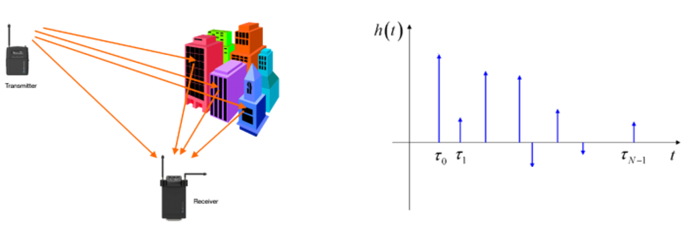
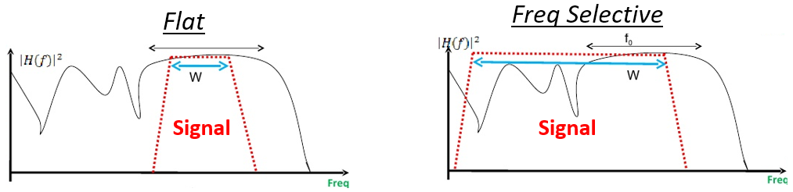

#######################
Multipath Fading
#######################

So far we have only discussed the "AWGN Channel", i.e. a model for a wireless channel where the signal is simply added to noise.  In this chapter we introduce multipath, which is a propagation phenomenon that results in signals reaching the receiver by two or more paths, and is what we experience in real-world wireless systems.

*************************
Multipath
*************************

All realistic wireless channels include many "reflectors", RF signals bounce after all.  Any object between or near the Tx or Rx can cause additional paths the signal travels along.  Each path experiences a different phase shift (delay) and attenuation (amplitude scaling).  At the receiver, all of the paths add up.  They can add up constructively, or destructively, or a mix of both.  We call this concept of multiple signal paths "multipath".  There is the Line-of-Sight (LOS) path, and then all other paths.  

.. image:: ../_static/multipath.PNG
   :scale: 70 % 
   :align: center 

Destructive interference can happen if you get unlucky with how the paths sum together.  Consider the example above with just two paths.  Depending on the frequency and the exact distance of the paths, the two paths can be received 180 degrees out of phase, at roughly the same amplitude, causing them to null out each other (depicted below).  You may have learned about constructive and destructive interference in Physics.  In wireless, when the paths descrutively combine, we call this being in a "deep fade", because our signal breifly disappears. 

.. image:: ../_static/destructive_interference.PNG
   :scale: 70 % 
   :align: center 

Paths can also add up constructively, causing a strong signal to be received.  Each path has a different phase shift and amplitude, which we can visualize on a plot:

*************************
Fading
*************************

What usually happens is we get a mix of constructive and destrucive intereference, and it changes over time as the RX, TX, or environment, is moving/changing.  We use the term "fading" when referring to the effects of a multipath channel over time.  So that's why we often refer to it as "multipath fading", it's really the combination of constructive/destructive intereference, and a changing environment. What we end up with is an SNR that varies over time; changes are usually on the order of milliseconds to microseconds, depending on how fast the TX/RX is moving:

.. image:: ../_static/multipath_fading.PNG
   :scale: 100 % 
   :align: center 

There are two types of fading from a time domain perspective:

- **Slow Fading:** The channel doesn't change within one packet's worth of data.  I.e. a deep null during slow fading will wipe out the whole packet.
- **Fast Fading:** The channel changes very quickly compared to the length of one packet.  Forward error correction, combined with interleaving, can combat fast fading.

There are also two types of fading from a frequency domain perspective:

**Frequency Selective Fading** means the constructive/destructive interference changes within the frequency range of the signal.  When we have a wideband signal, we span a large range of center frequencies.  Recall that wavelength determines whether it's constructive or destructive.  Well if our signal spans a wide frequency range, it also spans a wide wavelength range (since wavelegnth is the inverse of frequency).  This means we can get different channel qualities in different portions of our signal (in the frequency domain).  Hence the name frequency selective fading.

**Flat Fading** occurs when the signal's bandwidth is narrow enough that all frequencies experience roughly the same channel.  If there is a deep fade then the whole signal will disappear (for the duration of the deep fade).  

Here is an example of a 16 MHz wide signal, that is always on, but towards the middle you can see there's a period of time where a piece of signal is missing.  This is an example of frequency selective fading, it caused a hole in the signal. 

.. image:: ../_static/fading_example.PNG
   :scale: 60 % 
   :align: center 
   
   
****************************
Mitigating Multipath Fading
****************************

In modern communications, we have developed ways to combat multipath fading.  

CDMA
#####

3G cellular used a technology called code division multiple access (CDMA).  With CDMA you take a narrowband signal and spread it over a wide bandwidth before transmitting it (using a spread spectrum technique called DSSS).  Under frequency selective fading, it's unlikely that all frequencies will be in a deep null at the same time.  At the receiver, the spreading is reversed, and this de-spreading process greatly mitigates a deep null.

.. image:: ../_static/cdma.PNG
   :scale: 100 % 
   :align: center 

OFDM 
#####

4G cellular, WiFi, and many other technologies use something called OFDM.  OFDM uses something called subcarriers, where we split up the signal in the frequency domain to a bunch of narrow signals squashed together.  To combat multipath fading we can avoid assigning data to subcarriers that are in a deep fade, although this requires the receiving end to send channel information back to the transmitter quick enough.  We can also assign high order modulation schemes to subcarriers with great channel quality.  

