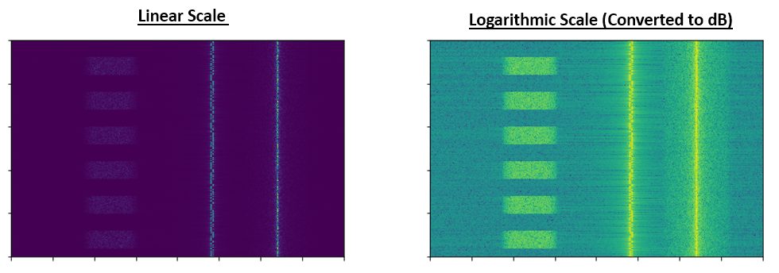
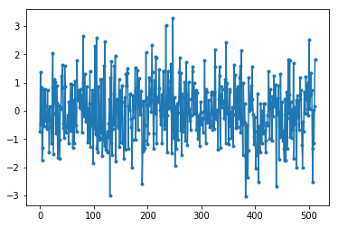
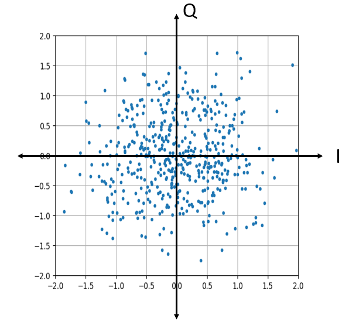
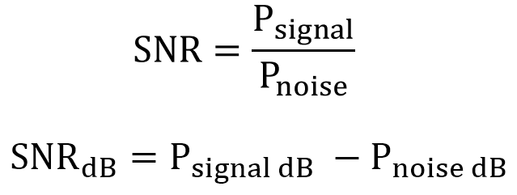

.. _noise-chapter:

#############
Noise and dB
#############

In this chapter we will discuss noise, including how it is modeled, and dealt with in a comms system.  We will also introduce dB along the way.

************************
Gaussian Noise
************************

Most people are aware of the concept of noise, and how it looks something like: 

.. image:: ../_static/noise.png
   :scale: 70 % 
   :align: center 

Note how the average value is zero.  If the average value wasn't zero then we could just subtract the average value, call it a bias, and we would be left with an average of zero.  Also note that the individual points are *not* "uniformly random", i.e. larger values are rarer, most of the points are closer to zero.

We call this type of noise "Gaussian noise", and it's a good model for the type of noise that comes from many natural sources, such as thermal vibrations of atoms in the silicon of our receiver's RF components.  The central limit theorem tells us that the summation of many random processes will tend to have a Gaussian distribution, even if the individual processes have some other distribution.  I.e., when we have a lot of random things happen, and they accumulate, the result appears Gaussian, even if the individual things are not.  

.. image:: ../_static/central_limit_theorem.webp
   :align: center 

The Gaussian distribution is also called the "Normal" distribution (recall bell curve).  

The Gaussian distribution has two parameters: mean and variance.  We already discussed how the mean can be considered zero, because you can always remove the mean if it's not zero.  The variance changes how "strong" the noise is, a higher variance will result in larger numbers.  It is for this reason that variance defines the noise power.  

Note that variance equals standard deviation squared (:math:`\sigma^2`).

************************
Decibels (dB)
************************

We are going to take a quick tangent to formally introduce dB.  You have probably heard of dB, and if you are already familiar with it feel free to skip this section. 

Working in dB is extremely useful when we need to deal with small numbers and big numbers at the same time, or just a bunch of really big numbers.  

Example 1: Signal 1 is received at 2 watts and the noise floor is at 0.0000002 watts.

Example 2: A garbage disposal is 100,000 times louder than a quiet rural area, and a chain saw is 10,000 times louder than a garbage disposal (in terms of power of sound waves).

Without dB, i.e. working in normal "linear" terms, we need to use a lot of 0's, and if we were to plot something like Signal 1 over time, we wouldn't even see the noise floor, because the scale of the y-axis might go from 0 to 3 watts for example, causing the noise to be too small to show up in the plot.  By using dB we are essentially just working in a log-scale.  Below is an example waterfall showing three signals, the left-hand side is the original signal, and the right-hand side shows it converted to dB.  Both use the exact same colormap, where blue is lowest value and yellow is highest.  Note how you can barely see the signal on the left, in the linear scale.

For a given value x, we can represent x in dB using the following formula:

.. math::
	x_{dB} = 10 \log_{10} x

In Python:  

.. code-block:: python

 x_db = 10.0 * np.log10(x)

You may have seen that :code:`10 *` be a :code:`20 *` in other domains.  Whenever you are dealing with a power of some sort, you use 10, and you use 20 if you are dealing with a voltage or current or some non-power value.  In DSP we are almost always dealing with a power, in fact there is not a single time in this whole textbook we need to use 20 instead of 10.

We convert from dB back to linear (normal numbers) using:

.. math::
    x = 10^{x_{dB}/10}
	
In Python: 

.. code-block:: python

 x = 10.0 ** (x_db / 10.0)

But don't get caught up in the formula, there is a key concept to take away here.  In DSP we deal with really big numbers and really small numbers together (e.g. the strength of a signal compared to the strength of the noise), and dB lets us have more dynamic range when we express numbers or plot them.  It also provides some conveniences like being able to add when we would normally multiply (as we will see in the :ref:`link-budgets-chapter` chapter).

Some common errors people will run into when new to dB are:

1. Using natural log instead of log base 10, because most programming language's log() function is actually the natural log.
2. Forgetting to include the dB when expressing a number or labeling an axis.  If we are in dB we need to identify it somewhere.
3. When you're in dB you add/subtract values instead of multiplying/dividing, e.g.:

.. image:: ../_static/db.png
   :scale: 60 % 
   :align: center 

It is also important to understand that dB is not technically a "unit".  A value in dB alone is unit-less, like if something is 2x larger, there are no units until I tell you the units.  dB is a relative thing.  In audio when they say dB they really mean dBA which is units for sound level (the A is the units). In wireless we typically refer to watts, to refer to an actual power level, so you might see dBW which is relative to 1 W, or dBmW (often written dBm for short) which is relative to 1 mW.   For example, someone might say "our transmitter is set to 3 dBW" (so 2 watts).  Sometimes we just say dB, meaning it is relative, there are no units, e.g. "our signal was received 20 dB above the noise floor".  A little tip: 0 dBm = -30 dBW.

Lastly, here are some common conversions that I would recommend remembering:

======  =====
Linear   dB
======  ===== 
1x      0 dB 
2x      3 dB 
10x     10 dB 
0.5x    -3 dB  
0.1x    -10 dB
100x    20 dB
1000x   30 dB
10000x  40 dB
======  ===== 

*************************
Noise in Frequency Domain
*************************

In the :ref:`freq-domain-chapter` chapter we looked at "Fourier pairs", i.e. what a certain time domain signal looks like in the frequency domain.  Well what does Gaussian noise look like in the frequency domain?  Below shows some simulated noise in the time domain, and then a plot of the Power Spectral Density (PSD) of that noise.  These plots were taken from GNU Radio.

.. image:: ../_static/noise_freq.png
   :scale: 110 % 
   :align: center 

We can see that it looks roughly the same across all frequencies, and is fairly flat.   It turns out that Gaussian noise in the time domain is also Gaussian noise in the frequency domain.  So why don't the two plots above look the same?  It's because the frequency domain plot is showing the magnitude of the FFT, so there will only be positive numbers, and it's using a log scale (it's showing the magnitude in dB).  Otherwise they would look the same.  We can prove this to ourselves by generating some noise (in the time domain) in Python and then taking the FFT.

.. code-block:: python

 import numpy as np
 import matplotlib.pyplot as plt
 
 x = np.random.randn(1024)
 plt.plot(x[0:512], '.-')
 plt.show() # show first 512 points
 
 X = np.fft.fftshift(np.fft.fft(x))
 X = X[512:] # only look at real portion
 plt.plot(X, '.-')
 plt.show()

Note that the randn() function uses mean = 0 and variance = 1 by default.  Both of the plots will look something like this:

You can then produce the flat PSD that we had in GNU Radio by taking the log, and averaging a bunch together.  The signal we generated and took the FFT of was a real signal (versus complex), and the FFT of any real signal will have matching negative and positive portions, so that's why we only saved the positive portion of the FFT output (the 2nd half).  But why did we only generate "real" noise, and how do complex signals work into this?

*************************
Complex Noise
*************************

"Complex Gaussian" noise is what we will experience when we have a signal at baseband; the noise power is split between the real and imaginary portions equally.  And most importantly, the real and imag parts are independent of each other; knowing the values of one doesn't give you the values of the other.

We can generate complex Gaussian noise in Python using:

.. code-block:: python

 n = np.random.randn() + 1j * np.random.randn()

But wait!  The equation above doesn't generate the same "amount" of noise as :code:`np.random.randn()`, in terms of power (known as noise power).  We can find the average power of a zero-mean signal (or noise) using:

.. code-block:: python

 power = np.var(x)

where np.var() is the function for variance.  It turns out that the power of our signal n is 2.  In order to generate complex noise with "unit power", i.e. a power of 1 (which makes things convenient), we have to use:

.. code-block:: python

 n = (np.random.randn(N) + 1j*np.random.randn(N))/np.sqrt(2) # AWGN with unity power

To plot complex noise in the time domain, like any complex signal we need two lines:

.. code-block:: python

 n = (np.random.randn(N) + 1j*np.random.randn(N))/np.sqrt(2)
 plt.plot(np.real(n),'.-')
 plt.plot(np.imag(n),'.-')
 plt.legend(['real','imag'])
 plt.show()

.. image:: ../_static/noise3.png
   :scale: 80 % 
   :align: center 

You can see that the real and imaginary portions are completely independent.

What does complex Gaussian noise look like on an IQ plot?  Remember the IQ plot shows the real portion (horizontal axis) and the imaginary portion (vertical axis), both of which are independent random Gaussians.

.. code-block:: python

 plt.plot(np.real(n),np.imag(n),'.')
 plt.grid(True, which='both')
 plt.axis([-2, 2, -2, 2])
 plt.show()

It looks how we would expect; a random blob centered around 0 + 0j, i.e. the origin.  Just for fun, let's try adding noise to a QPSK signal to see what the IQ plot looks like:

.. image:: ../_static/noisey_qpsk.png
   :scale: 60 % 
   :align: center 

Now what happens when the noise is stronger?  

.. image:: ../_static/noisey_qpsk2.png
   :scale: 50 % 
   :align: center 

We are starting to get a feel why transmitting data wireless isn't that simple, we want to send as many bits per symbol as we can, but if the noise is too high then we will get erroneous bits on the receiving end.  

*************************
AWGN
*************************

Additive White Gaussian Noise (AWGN) is an abbreviation you will hear a lot in the DSP and SDR world.  The GN, Gaussian Noise, we already discussed.  Additive just means the noise is being added to our received signal.  White means in the frequency domain, the spectrum is flat across our entire observation band.  It will almost always be white in practice, or approximately white.  In this textbook we will use AWGN as the only form of noise, when dealing with communications links and link budgets and such.  Non-AWGN noise tends to be a niche topic.

*************************
SNR
*************************

Signal-to-Noise Ratio (SNR) is how we will measure the differences in strength between the signal and noise, it's a ratio (so it's unit-less).  SNR is almost always in dB, in practice.  Often times in simulation we code in a way that our signals are unit power (power = 1).  That way, we can create an SNR of 10 dB by creating noise that is -10 dB in power, by adjusting the variance when we generate the noise.  

If someone says "SNR = 0 dB" it means the signal and noise power are the same.  A positive SNR means our signal is higher power than the noise, while a negative SNR means the noise is higher power.  Detecting signals at negative SNR is usually pretty tough.  

Like we mentioned before, the power in a signal is equal to the variance of the signal.  So we can represent SNR as the ratio of the signal variance to noise variance:

.. image:: ../_static/SNR2.png
   :scale: 40 % 
   :align: center 

*************************
External Resources
*************************

Further resources about AWGN, SNR, and variance:

1. https://en.wikipedia.org/wiki/Additive_white_Gaussian_noise
2. https://en.wikipedia.org/wiki/Signal-to-noise_ratio
3. https://en.wikipedia.org/wiki/Variance

