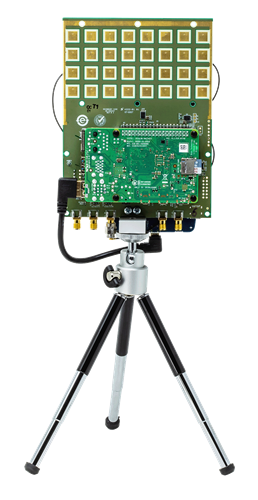
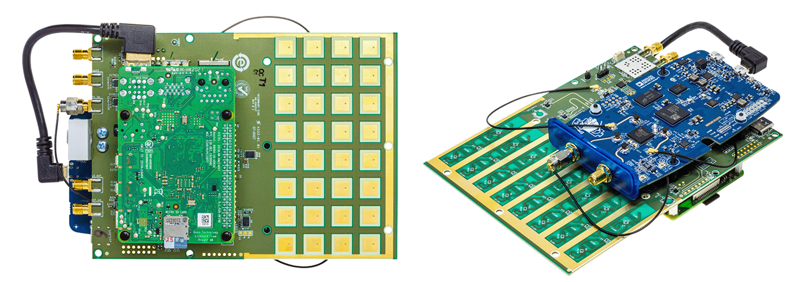
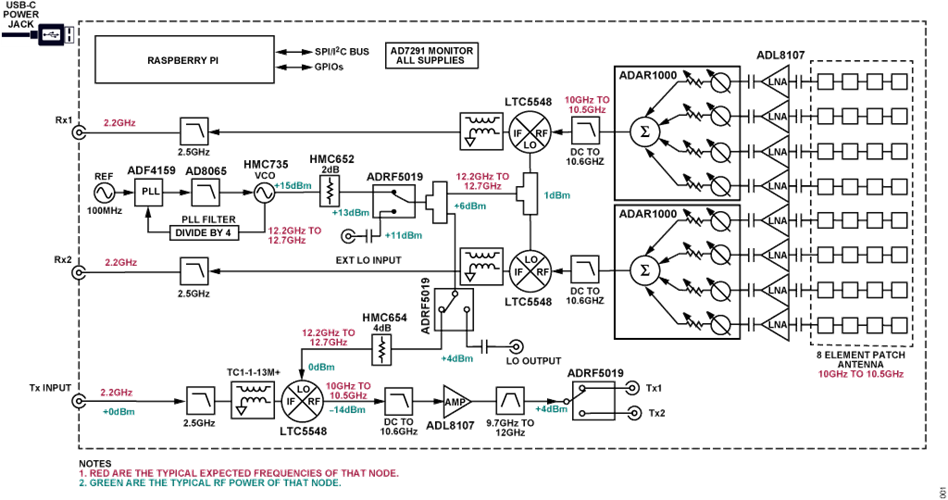
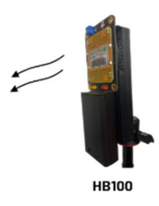
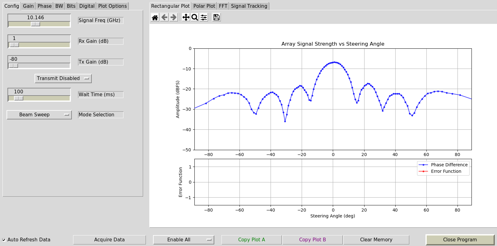
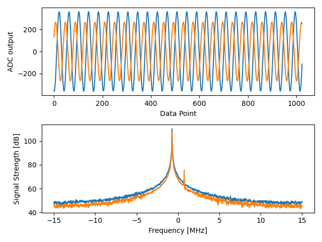
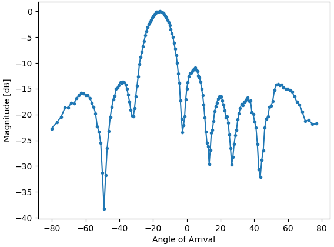
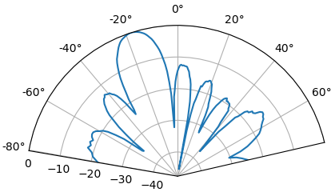
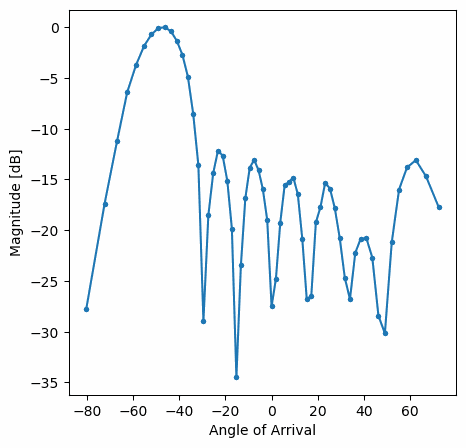
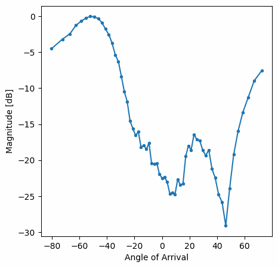

.. _phaser-chapter:

####################################
Phased Arrays with Phaser
####################################
   
In this chapter we use the `Analog Devices Phaser <https://wiki.analog.com/resources/eval/user-guides/circuits-from-the-lab/cn0566>`_, (a.k.a. CN0566 or ADALM-PHASER) which is an 8-channel low-cost phased array SDR that combines a PlutoSDR, Raspberry Pi, and ADAR1000 beamformers, designed to operate around 10.25 GHz.  We will cover the setup and calibration steps, and then go through some beamforming examples in Python.  For those that do not have a Phaser, we have included screenshots and animations of what the user would see.

************************
Intro to Phased Arrays
************************

---Short intro to phased arrays, and compare to digital beamforming---

************************
Hardware Overview
************************

The Phaser is a single board containing the phased array and a bunch of other components, with a Raspberry Pi plugged in on one side and a Pluto mounted to the other side.  The high-level block diagram is shown below.  Some items to note:

1. Even though it looks like a 32-element 2d array, it's really an 8-element 1d array
2. Both receive channels on the Pluto are used (the second channel uses a u.FL connector)
3. The LO onboard is used to downconvert the received signal from around 10.25 GHz to around 2 GHz, so that the Pluto can receive it
4. Each ADAR1000 has four phase shifters with adjustable gain, and all four channels are summed together before being sent to the Pluto
5. The Phaser essentially contains two "subarrays" which each subarray containing four channels
6. Not shown below are GPIO and serial signals from the Raspberry Pi used to control various components on the Phaser

.. image:: ../_images/phaser_components.png
   :scale: 40 % 
   :align: center
   :alt: The components of the Phaser (CN0566) including ADF4159, LTC5548, ADAR1000

For now let's ignore the transmit side of the Phaser, as in this chapter we will only be using the HB100 device as a test transmitter.  The ADF4159 is a frequency synthesizer that produces a tone up to 13 GHz in frequency, what we call the local oscillator or LO.  This LO is fed into a mixer, the LTC5548, which is able to do upconversion or downconversion, although we'll be using it for downconversion.  For downconversion it takes in the LO as well as a signal anywhere from 2 - 14 GHz, and multiplies the two together which performs a frequency shift.  The resulting downconverted signal can be anywhere from DC to 6 GHz, although we are going to target around 2 GHz.  The ADAR1000 is a 4-channel analog beamformer, so the Phaser utilizes two of them.  An analog beamformer has independently adjustable phase shifters and gain for each channel, allowing each channel to be time-delayed and attenuated before being summed together in the analog domain (resulting in a single channel).  On the Phaser, each ADAR1000 outputs a signal which gets downconverted and then received by the Pluto.  Using the Raspberry Pi we can control the phase and gain of all eight channels in realtime, to perform beamforming.  We also have the option to do two-channel digital beamforming/array processing, discussed in the next chapter.

For those interested, a slightly more detailed block diagram is provided below.

************************
SD Card Preparation
************************

We will assume you are using the Raspberry Pi onboard the Phaser (directly, with a monitor/keyboard/mouse).  This simplifies setup, as Analog Devices publishes a pre-built SD card image with all the necessary drivers and software.  You can download the SD card image and find SD imaging instructions `here <https://wiki.analog.com/resources/tools-software/linux-software/kuiper-linux>`_.  The image is based on Raspberry Pi OS and includes all the software you'll need already installed.  

************************
Hardware Preparation
************************

1. Connect Pluto's CENTER micro-USB port to Raspberry Pi
2. Optionally, carefully thread the tripod into the tripod mount
3. We will assume you're using an HDMI display, USB keyboard, and USB mouse connected to the Raspberry pi
4. Power the Pi and Phaser board through the type-C port of the Phaser (CN0566), i.e. do NOT connect a supply to the Raspberry Pi's USB C

************************
Software Install
************************

Once you have booted into the Raspberry Pi using the pre-build image, using the default user/pass analog/analog, it is recommended to run the following steps:

.. code-block:: bash

 wget https://github.com/mthoren-adi/rpi_setup_stuff/raw/main/phaser/phaser_sdcard_setup.sh
 sudo chmod +x phaser_sdcard_setup.sh
 ./phaser_sdcard_setup.sh
 sudo reboot
 
 sudo raspi-config

For more assistance setting up the Phaser, reference the `Phaser wiki quickstart page <https://wiki.analog.com/resources/eval/user-guides/circuits-from-the-lab/cn0566/quickstart>`_.

************************
HB100 Setup
************************

The HB100 that comes with the Phaser is a low-cost Doppler radar module that we will be using as a test transmitter, as it transmits a continuous tone around 10 GHz.  It runs off 2 AA batteries or a 3V benchtop supply, and when it's on it will have a solid red LED.

Because the HB100 is low-cost and uses cheap RF components, its transmit frequency varies from unit to unit, over hundreds of MHz, which is a range that is greater than the highest bandwidth we can receive using the Pluto (56 MHz).  So to make sure we are tuning our Pluto and downconverter in a manner that will always receive the HB100 signal, we must determine the HB100's transmit frequency.  This is done using an example app from Analog Devices, which performs a frequency sweep and calculates FFTs while looking for a spike.  Make sure your HB100 is on and in the general vicinity of the Phaser, and then run the utility with:

.. code-block:: bash

 cd ~/pyadi-iio/examples/phaser
 python phaser_find_hb100.py

It should create a file called hb100_freq_val.pkl in the same directory.  This file contains the HB100 transmit frequency in Hz (pickled, so not viewable in plaintext) which we will use in the next step.

************************
Calibration
************************

Lastly, we need to calibrate the phased array.  This requires holding the HB100 at the array's boresight (0 degrees).  The side of the HB100 with the barcode is the side that transmits the signal, so that face should be held a few feet away from the Phaser, right in-front and centered to it, and then pointed straight at the Phaser.  In the next step you can experiment with different angles and orientations, but for now let's run the calibration utility:

.. code-block:: bash

 python phaser_examples.py cal

This will create two more pickle files: phase_cal_val.pkl and gain_cal_val.pkl, in the same directory.  Each one contains an array of 8 numbers corresponding to the phase and gain tweaks needed to calibrate each channel.  These values are unique to each Phaser, as they can very during manufacturing.  Subsequent runs of this utility will lead to slightly different values which is normal.

************************
Pre-built Example App
************************

Now that we have calibrated our Phaser and found the HB100 frequency, we can run the example app that Analog Devices provides.

.. code-block:: bash

 python phaser_gui.py

If you check the "Auto Refresh Data" checkbox in the bottom-left it should begin running.  You should see something similar to the following when holding the HB100 in the Phaser's boresight.

************************
Phaser in Python
************************

We will now dive into the hands-on Python portion.  For those who don't have a Phaser, screenshots and animations are provided.

Initializing Phaser and Pluto
##############################

The following Python code sets up our Phaser and Pluto.  By this point you should have already run the calibration steps, which produce three pickle files.  Make sure you are running the Python script below from within the same directory as these pickle files.

There are a lot of settings to deal with, so it's OK if you don't absorb the entire code snippet below, just note that we are using a sample rate of 30 MHz, manual gain which we set very low, we set all of the element gains to the same value, and point the array towards boresight (0 degrees).  

.. code-block:: python

 import time
 import sys
 import matplotlib.pyplot as plt
 import numpy as np
 import pickle
 from adi import ad9361
 from adi.cn0566 import CN0566
 
 phase_cal = pickle.load(open("phase_cal_val.pkl", "rb"))
 gain_cal = pickle.load(open("gain_cal_val.pkl", "rb"))
 signal_freq = pickle.load(open("hb100_freq_val.pkl", "rb"))
 d = 0.014  # element to element spacing of the antenna
 
 phaser = CN0566(uri="ip:localhost")
 sdr = ad9361(uri="ip:192.168.2.1")
 phaser.sdr = sdr
 print("PlutoSDR and CN0566 connected!")
 
 time.sleep(0.5) # recommended by Analog Devices
 
 phaser.configure(device_mode="rx")
 
 # Set all antenna elements to half scale - a typical HB100 will have plenty of signal power.
 gain = 64 # 64 is about half scale
 for i in range(8):
     phaser.set_chan_gain(i, gain, apply_cal=False)
 
 # Aim the beam at boresight (zero degrees)
 phaser.set_beam_phase_diff(0.0)
 
 # Misc SDR settings, not super critical to understand
 sdr._ctrl.debug_attrs["adi,frequency-division-duplex-mode-enable"].value = "1"
 sdr._ctrl.debug_attrs["adi,ensm-enable-txnrx-control-enable"].value = "0" # Disable pin control so spi can move the states
 sdr._ctrl.debug_attrs["initialize"].value = "1"
 sdr.rx_enabled_channels = [0, 1] # enable Rx1 and Rx2
 sdr._rxadc.set_kernel_buffers_count(1) # No stale buffers to flush
 sdr.tx_hardwaregain_chan0 = int(-80) # Make sure the Tx channels are attenuated (or off)
 sdr.tx_hardwaregain_chan1 = int(-80)
 
 # These settings are basic PlutoSDR settings we have seen before
 sample_rate = 30e6
 sdr.sample_rate = int(sample_rate)
 sdr.rx_buffer_size = int(1024)  # samples per buffer
 sdr.rx_rf_bandwidth = int(10e6)  # analog filter bandwidth
 
 # Manually gain (no automatic gain control) so that we can sweep angle and see peaks/nulls
 sdr.gain_control_mode_chan0 = "manual"
 sdr.gain_control_mode_chan1 = "manual"
 sdr.rx_hardwaregain_chan0 = 10 # dB, 0 is the lowest gain.  the HB100 is pretty loud
 sdr.rx_hardwaregain_chan1 = 10 # dB
 
 sdr.rx_lo = int(2.2e9) # The Pluto will tune to this freq
 
 # Set the Phaser's PLL (the ADF4159 onboard) to downconvert the HB100 to 2.2 GHz plus a small offset
 offset = 1000000 # add a small arbitrary offset just so we're not right at 0 Hz where there's a DC spike
 phaser.lo = int(signal_freq + sdr.rx_lo - offset)

Receiving Samples from the Pluto
################################

At this point the Phaser and Pluto are configured and ready to go.  We can now start receiving data from the Pluto.  Let's grab a single batch of 1024 samples, then take the FFT of each of the two channels.

.. code-block:: python

 # Grab some samples (whatever we set rx_buffer_size to), remember we are receiving on 2 channels at the same time
 data = sdr.rx()
 
 # Take FFT
 PSD0 = 10*np.log10(np.abs(np.fft.fftshift(np.fft.fft(data[0])))**2)
 PSD1 = 10*np.log10(np.abs(np.fft.fftshift(np.fft.fft(data[1])))**2)
 f = np.linspace(-sample_rate/2, sample_rate/2, len(data[0]))
 
 # Time plot helps us check that we see the HB100 and that we're not saturated (ie gain isnt too high)
 plt.subplot(2, 1, 1)
 plt.plot(data[0].real) # Only plot real part
 plt.plot(data[1].real)
 plt.xlabel("Data Point")
 plt.ylabel("ADC output")
 
 # PSDs show where the HB100 is and verify both channels are working
 plt.subplot(2, 1, 2)
 plt.plot(f/1e6, PSD0)
 plt.plot(f/1e6, PSD1)
 plt.xlabel("Frequency [MHz]")
 plt.ylabel("Signal Strength [dB]")
 plt.tight_layout()
 plt.show()

What you see at this point will depend if your HB100 is on and where it's pointing.  If you hold it a few feet from the Phaser and point it towards the center, you should see something like this:

Note the strong spike near 0 Hz, the 2nd shorter spike is simply an artifact that can be ignored, since it's around 40 dB down.  The top plot, showing the time domain, displays the real part of the two channels, so the relative amplitude between the two will vary slightly depending on where you hold the HB100.

Performing Beamforming
##############################

Next, let's actually sweep the phase!  In the following code we sweep the phase from negative 180 to positive 180 degrees, at a 2 degree step.  Note that this is not the angle the beamformer points; it's the phase difference between adjacent channels.  We must calculate the angle of arrival corresponding to each phase step, using knowledge of the speed of light, the RF frequency of the received signal, and the Phaser's element spacing.  The phase difference between adjacent elements is given by:

.. math::

 \phi = \frac{2 \pi d}{\lambda} \sin(\theta_{AOA})

where :math:`\theta_{AOA}` is the angle of arrival of the signal with respect to boresight, :math:`d` is the antenna spacing in meters, and :math:`\lambda` is the wavelength of the signal. Using the formula for wavelength and solving for :math:`\theta_{AOA}` we get:

.. math::

 \theta_{AOA} = \sin^{-1}\left(\frac{c \phi}{2 \pi f d}\right)

You'll see this when we calculate :code:`steer_angle` below:

.. code-block:: python

 powers = [] # main DOA result
 angle_of_arrivals = []
 for phase in np.arange(-180, 180, 2): # sweep over angle
     print(phase)
     # set phase difference between the adjacent channels of devices
     for i in range(8):
         channel_phase = (phase * i + phase_cal[i]) % 360.0 # Analog Devices had this forced to be a multiple of phase_step_size (2.8125 or 360/2**6bits) but it doesn't seem nessesary
         phaser.elements.get(i + 1).rx_phase = channel_phase
     phaser.latch_rx_settings() # apply settings
 
     steer_angle = np.degrees(np.arcsin(max(min(1, (3e8 * np.radians(phase)) / (2 * np.pi * signal_freq * phaser.element_spacing)), -1))) # arcsin argument must be between 1 and -1, or numpy will throw a warning
     # If you're looking at the array side of Phaser (32 squares) then add a *-1 to steer_angle
     angle_of_arrivals.append(steer_angle) 
     data = phaser.sdr.rx() # receive a batch of samples
     data_sum = data[0] + data[1] # sum the two subarrays (within each subarray the 4 channels have already been summed)
     power_dB = 10*np.log10(np.sum(np.abs(data_sum)**2))
     powers.append(power_dB)
     # in addition to just taking the power in the signal, we could also do the FFT then grab the value of the max bin, effectively filtering out noise, results came out almost exactly the same in my tests
     #PSD = 10*np.log10(np.abs(np.fft.fft(data_sum * np.blackman(len(data_sum))))**2) # in dB
 
 powers -= np.max(powers) # normalize so max is at 0 dB
 
 plt.plot(angle_of_arrivals, powers, '.-')
 plt.xlabel("Angle of Arrival")
 plt.ylabel("Magnitude [dB]")
 plt.show()

For each :code:`phase` value (remember, this is the phase between adjacent elements) we set the phase shifters, after adding in the phase calibration values and forcing the degrees to be between 0 and 360.  We then grab one batch of samples with :code:`rx()`, sum the two channels, then calculate the power in the signal.  We then plot power over angle of arrival.  The result should look something like this:

In this example the HB100 was held slightly to the side of boresight.

If you want a polar plot you can instead using the following:

.. code-block:: python

 # Polar plot
 fig, ax = plt.subplots(subplot_kw={'projection': 'polar'})
 ax.plot(np.deg2rad(angle_of_arrivals), powers) # x axis in radians
 ax.set_rticks([-40, -30, -20, -10, 0])  # Less radial ticks
 ax.set_thetamin(np.min(angle_of_arrivals)) # in degrees
 ax.set_thetamax(np.max(angle_of_arrivals))
 ax.set_theta_direction(-1) # increase clockwise
 ax.set_theta_zero_location('N') # make 0 degrees point up
 ax.grid(True)
 plt.show()

By taking the max we can estimate the direction of arrival of the signal!

Realtime and with Spatial Tapering
##################################

Now let's take a moment to talk about spatial tapering.  So far we have left the gain adjustments of each channel to equal values, so that all eight channels get summed equally.  Just like we applied a window before taking an FFT, we can apply a window in the spatial domain by applying weights to these eight channels.  We'll use the exact same windowing functions like Hanning, Hamming, etc.  Let's also tweak the code to run in realtime so that it's a little more fun:

.. code-block:: python

 plt.ion() # needed for realtime view
 print("Starting, use control-c to stop")
 try:
     while True:
         powers = [] # main DOA result
         angle_of_arrivals = []
         for phase in np.arange(-180, 180, 6): # sweep over angle
             # set phase difference between the adjacent channels of devices
             for i in range(8):
                 channel_phase = (phase * i + phase_cal[i]) % 360.0 # Analog Devices had this forced to be a multiple of phase_step_size (2.8125 or 360/2**6bits) but it doesn't seem nessesary
                 phaser.elements.get(i + 1).rx_phase = channel_phase
            
             # set gains, incl the gain_cal, which can be used to apply a taper.  try out each one!
             gain_list = [127] * 8 # rectangular window          [127, 127, 127, 127, 127, 127, 127, 127]
             #gain_list = np.rint(np.hamming(8) * 127)         # [ 10,  32,  82, 121, 121,  82,  32,  10]
             #gain_list = np.rint(np.hanning(10)[1:-1] * 127)  # [ 15,  52,  95, 123, 123,  95,  52,  15]
             #gain_list = np.rint(np.blackman(10)[1:-1] * 127) # [  6,  33,  80, 121, 121,  80,  33,   6]
             #gain_list = np.rint(np.bartlett(10)[1:-1] * 127) # [ 28,  56,  85, 113, 113,  85,  56,  28]
             for i in range(8):
                 channel_gain = int(gain_list[i] * gain_cal[i])
                 phaser.elements.get(i + 1).rx_gain = channel_gain
 
             phaser.latch_rx_settings() # apply settings
 
             steer_angle = np.degrees(np.arcsin(max(min(1, (3e8 * np.radians(phase)) / (2 * np.pi * signal_freq * phaser.element_spacing)), -1))) # arcsin argument must be between 1 and -1, or numpy will throw a warning
             angle_of_arrivals.append(steer_angle) 
             data = phaser.sdr.rx() # receive a batch of samples
             data_sum = data[0] + data[1] # sum the two subarrays (within each subarray the 4 channels have already been summed)
             power_dB = 10*np.log10(np.sum(np.abs(data_sum)**2))
             powers.append(power_dB)
 
         powers -= np.max(powers) # normalize so max is at 0 dB
 
         # Realtime view
         plt.plot(angle_of_arrivals, powers, '.-')
         plt.xlabel("Angle of Arrival")
         plt.ylabel("Magnitude [dB]")
         plt.draw()
         plt.pause(0.001)
         plt.clf()
 
 except KeyboardInterrupt:
     sys.exit() # quit python

You should see a realtime version of the previous exercise.  Try switching which :code:`gain_list` is used, to play around with the different windows.  Here is an example of the Rectangular window (i.e., no windowing function):

and here is an example of the Hamming window:

Note the lack of sidelobes for Hamming.  In fact, every window aside from Rectangular will greatly reduce the sidelobes, but in return the main lobe will be a little wider.

************************
Next Steps
************************

In the next chapter we will cover digital beamforming, using pure simulation in Python, no Phaser needed!
