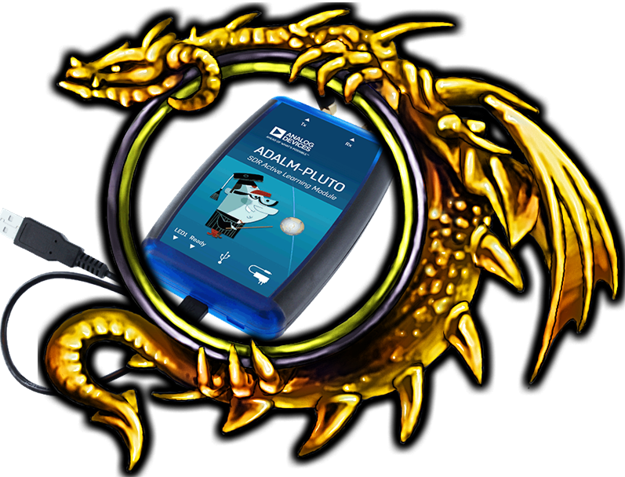

.. _pluto-adv-chapter:

####################################
PlutoSDR Advanced Topics
####################################

   
In this chapter we learn some more advanced topics related to the PlutoSDR.  

************************
Receive Gain
************************

The Pluto can be configured to either have a fixed receive gain or an automatic one. An automatic gain control (AGC) will automatically adjust the receive gain to maintain a strong signal level (-12dBFS for anyone who is curious).  AGC is not to be confused with the analog-to-digital converter (ADC) that digitizes the signal.  Technically speaking, AGC is a closed-loop feedback circuit that controls the amplifier's gain in response to the received signal.  Its goal is to maintain a constant output power level despite a varying input power level.  Typically, the AGC will adjust the gain to avoid saturating the receiver (i.e., hitting the upper limit of the ADC's range) while simultaneously allowing the signal to "fill in" as many ADC bits as possible.

The radio-frequency integrated circuit, or RFIC, inside the PlutoSDR has an AGC module with a few different settings.  (An RFIC is a chip that functions as a transceiver: it transmits and receives radio waves.)  First, note that the receive gain on the Pluto has a range from 0 to 74.5 dB.  When in "manual" AGC mode, the AGC is turned off, and you must tell the Pluto what receive gain to use, e.g.:

.. code-block:: python

  
  sdr.gain_control_mode_chan0 = "manual" # turn off AGC
  gain = 50.0 # allowable range is 0 to 74.5 dB
  sdr.rx_hardwaregain_chan0 = gain # set receive gain

If you want to enable the AGC, you must choose from one of two modes:

1. :code:`sdr.gain_control_mode_chan0 = "slow_attack"`
2. :code:`sdr.gain_control_mode_chan0 = "fast_attack"`

And with AGC enabled you don't provide a value to :code:`rx_hardwaregain_chan0`. It will get ignored because the Pluto itself adjusts the gain for the signal. The Pluto has two modes for AGC: fast attack and slow attack, as shown in the code snipped above. The difference between the two is intuitive, if you think about it. Fast attack mode reacts quicker to signals.  In other words, the gain value will change faster when the received signal changes level.  Adjusting to signal power levels can be important, especially for time-division duplex (TDD) systems that use the same frequency to transmit and receive. Setting the gain control to fast attack mode for this scenario limits signal attenuation.  With either mode, if there is no signal present and only noise, the AGC will max out the gain setting; when a signal does show up it will saturate the receiver briefly, until the AGC is able to react and ramp down the gain.  You can always check the current gain level in realtime with:

.. code-block:: python
 
 sdr._get_iio_attr('voltage0','hardwaregain', False)

For more details about the Pluto's AGC, such as how to change the advanced AGC settings, refer to `the "RX Gain Control" section of this page <https://wiki.analog.com/resources/tools-software/linux-drivers/iio-transceiver/ad9361>`_.

************************
Transmitting
************************

Before you transmit any signal with your Pluto, make sure to connect a SMA cable between the Pluto's TX port, and whatever device will be acting as the receiver.  It's important to always start by transmitting over a cable, especially while you are learning *how* to transmit, to make sure the SDR is behaving how you intend.  Always keep your transmit power extremely low, as to not overpower the receiver, since the cable does not attenuate the signal like the wireless channel does.  If you own an attenuator (e.g. 30 dB), now would be a good time to use it.  If you do not have another SDR or a spectrum analyzer to act as the receiver, in theory you can use the RX port on the same Pluto, but it can get complicated.  I would recommend picking up a $10 RTL-SDR to act as the receiving SDR.

Transmitting is very similar to receiving, except instead of telling the SDR to receive a certain number of samples, we will give it a certain number of samples to transmit.  Instead of :code:`rx_lo` we will be setting :code:`tx_lo`, to specify what carrier frequency to transmit on.  The sample rate is shared between the RX and TX, so we will be setting it like normal.  A full example of transmitting is shown below, where we generate a sinusoid at +100 kHz, then transmit the complex signal at a carrier frequency of 915 MHz, causing the receiver to see a carrier at 915.1 MHz.  There is really no practical reason to do this, we could have just set the center_freq to 915.1e6 and transmitted an array of 1's, but we wanted to generate complex samples for demonstration purposes. 

.. code-block:: python
    
    import numpy as np
    import adi

    sample_rate = 1e6 # Hz
    center_freq = 915e6 # Hz

    sdr = adi.Pluto("ip:192.168.2.1")
    sdr.sample_rate = int(sample_rate)
    sdr.tx_rf_bandwidth = int(sample_rate) # filter cutoff, just set it to the same as sample rate
    sdr.tx_lo = int(center_freq)
    sdr.tx_hardwaregain_chan0 = -50 # Increase to increase tx power, valid range is -90 to 0 dB

    N = 10000 # number of samples to transmit at once
    t = np.arange(N)/sample_rate
    samples = 0.5*np.exp(2.0j*np.pi*100e3*t) # Simulate a sinusoid of 100 kHz, so it should show up at 915.1 MHz at the receiver
    samples *= 2**14 # The PlutoSDR expects samples to be between -2^14 and +2^14, not -1 and +1 like some SDRs

    # Transmit our batch of samples 100 times, so it should be 1 second worth of samples total, if USB can keep up
    for i in range(100):
        sdr.tx(samples) # transmit the batch of samples once

Here are some notes about this code.  First, you want to simulate your IQ samples so that they are between -1 and 1, but then before transmitting them we have to scale by 2^14 due to how Analog Devices implemented the :code:`tx()` function.  If you are not sure what your min/max values are, simply print them out with :code:`print(np.min(samples), np.max(samples))` or write an if statement to make sure they never go above 1 or below -1 (assuming that code comes before the 2^14 scaling).  As far as transmit gain, the range is -90 to 0 dB, so 0 dB is the highest transmit power.  We always want to start at a low transmit power, and then work our way up if needed, so we have the gain set to -50 dB by default which is towards the low end.  Don't simply set it to 0 dB just because your signal is not showing up; there might be something else wrong, and you don't want to fry your receiver. 

If you want to continuously transmit the same set of samples on repeat, instead of using a for/while loop within Python like we did above, you can tell the Pluto to do so using just one line:

.. code-block:: python

 sdr.tx_cyclic_buffer = True # Enable cyclic buffers

You would then transmit your samples like normal: :code:`sdr.tx(samples)` just one time, and the Pluto will keep transmitting the signal indefinitely, until the sdr object destructor is called.  To change the samples that are being continuously transmitted, you cannot simply call :code:`sdr.tx(samples)` again with a new set of samples, you have to first call :code:`sdr.tx_destroy_buffer()`, then call :code:`sdr.tx(samples)`.

*****************************************
Transmitting and Receiving Simultaneously
*****************************************

Using the tx_cyclic_buffer trick you can easily receive and transmit at the same time, by kicking off the transmitter, then receiving. 
The following code shows a working example of transmitting a QPSK signal in the 915 MHz band, receiving it, and plotting the PSD.

.. code-block:: python

    import numpy as np
    import adi
    import matplotlib.pyplot as plt

    sample_rate = 1e6 # Hz
    center_freq = 915e6 # Hz
    num_samps = 100000 # number of samples per call to rx()

    sdr = adi.Pluto("ip:192.168.2.1")
    sdr.sample_rate = int(sample_rate)

    # Config Tx
    sdr.tx_rf_bandwidth = int(sample_rate) # filter cutoff, just set it to the same as sample rate
    sdr.tx_lo = int(center_freq)
    sdr.tx_hardwaregain_chan0 = -50 # Increase to increase tx power, valid range is -90 to 0 dB

    # Config Rx
    sdr.rx_lo = int(center_freq)
    sdr.rx_rf_bandwidth = int(sample_rate)
    sdr.rx_buffer_size = num_samps
    sdr.gain_control_mode_chan0 = 'manual'
    sdr.rx_hardwaregain_chan0 = 0.0 # dB, increase to increase the receive gain, but be careful not to saturate the ADC

    # Create transmit waveform (QPSK, 16 samples per symbol)
    num_symbols = 1000
    x_int = np.random.randint(0, 4, num_symbols) # 0 to 3
    x_degrees = x_int*360/4.0 + 45 # 45, 135, 225, 315 degrees
    x_radians = x_degrees*np.pi/180.0 # sin() and cos() takes in radians
    x_symbols = np.cos(x_radians) + 1j*np.sin(x_radians) # this produces our QPSK complex symbols
    samples = np.repeat(x_symbols, 16) # 16 samples per symbol (rectangular pulses)
    samples *= 2**14 # The PlutoSDR expects samples to be between -2^14 and +2^14, not -1 and +1 like some SDRs

    # Start the transmitter
    sdr.tx_cyclic_buffer = True # Enable cyclic buffers
    sdr.tx(samples) # start transmitting

    # Clear buffer just to be safe
    for i in range (0, 10):
        raw_data = sdr.rx()
        
    # Receive samples
    rx_samples = sdr.rx()
    print(rx_samples)

    # Stop transmitting
    sdr.tx_destroy_buffer()

    # Calculate power spectral density (frequency domain version of signal)
    psd = np.abs(np.fft.fftshift(np.fft.fft(rx_samples)))**2
    psd_dB = 10*np.log10(psd)
    f = np.linspace(sample_rate/-2, sample_rate/2, len(psd))

    # Plot time domain
    plt.figure(0)
    plt.plot(np.real(rx_samples[::100]))
    plt.plot(np.imag(rx_samples[::100]))
    plt.xlabel("Time")

    # Plot freq domain
    plt.figure(1)
    plt.plot(f/1e6, psd_dB)
    plt.xlabel("Frequency [MHz]")
    plt.ylabel("PSD")
    plt.show()

You should see something that looks like this, assuming you have proper antennas or a cable connected:

.. image:: ../_images/pluto_tx_rx.svg
   :align: center 

It is a good exercise to slowly adjust :code:`sdr.tx_hardwaregain_chan0` and :code:`sdr.rx_hardwaregain_chan0` to make sure the received signal is getting weaker/stronger as expected.

**********************************
Transmitting Over the Air Legally
**********************************

Countless times I have been asked by students what frequencies they are allowed to transmit on with an antenna (in the United States).  The short answer is none, as far as I am aware.  Usually when people point to specific regulations that talk about transmit power limits, they are referring to `the FCC's "Title 47, Part 15" (47 CFR 15) regulations <https://www.ecfr.gov/cgi-bin/text-idx?SID=7ce538354be86061c7705af3a5e17f26&mc=true&node=pt47.1.15&rgn=div5>`_.  But those are regulations for manufacturers building and selling devices that operate in the ISM bands, and the regulations discuss how they should be tested.  A Part 15 device is one where an individual does not need a license to operate the device in whatever spectrum it's using, but the device itself must be authorized/certified to show they are operating following FCC regulations before they are marketed and sold.  The Part 15 regulations do specify maximum transmit and received power levels for the different pieces of spectrum, but none of it actually applies to a person transmitting a signal with an SDR or their home-built radio.  The only regulations I could find related to radios that aren't actually products being sold were specific to operating a low-power AM or FM radio station in the AM/FM bands.  There is also a section on "home-built devices", but it specifically says it doesn't apply to anything constructed from a kit, and it would be a stretch to say a transmit rig using an SDR is a home-built device.  In summary, the FCC regulations aren't as simple as "you can transmit at these frequencies only below these power levels", but rather they are a huge set of rules meant for testing and compliance.

Another way to look at it would be to say "well, these aren't Part 15 devices, but let's follow the Part 15 rules as if they were".  For the 915 MHz ISM band, the rules are that "The field strength of any emissions radiated within the specified frequency band shall not exceed 500 microvolts/meter at 30 meters. The emission limit in this paragraph is based on measurement instrumentation employing an average detector."  So as you can see, it's not as simple as a maximum transmit power in watts.

Now, if you have your amateur radio (ham) license, the FCC allows you to use certain bands set aside for amateur radio.  There are still guidelines to follow and maximum transmit powers, but at least these numbers are specified in watts of 
effective radiated power.  `This info-graphic <http://www.arrl.org/files/file/Regulatory/Band%20Chart/Band%20Chart%20-%2011X17%20Color.pdf>`_ shows which bands are available to use depending on your license class (Technician, General and Extra).  I would recommend anyone interested in transmitting with SDRs to get their ham radio license, see `ARRL's Getting Licensed page <http://www.arrl.org/getting-licensed>`_ for more info. 

If anyone has more details about what is allowed and not allowed, please email me.

