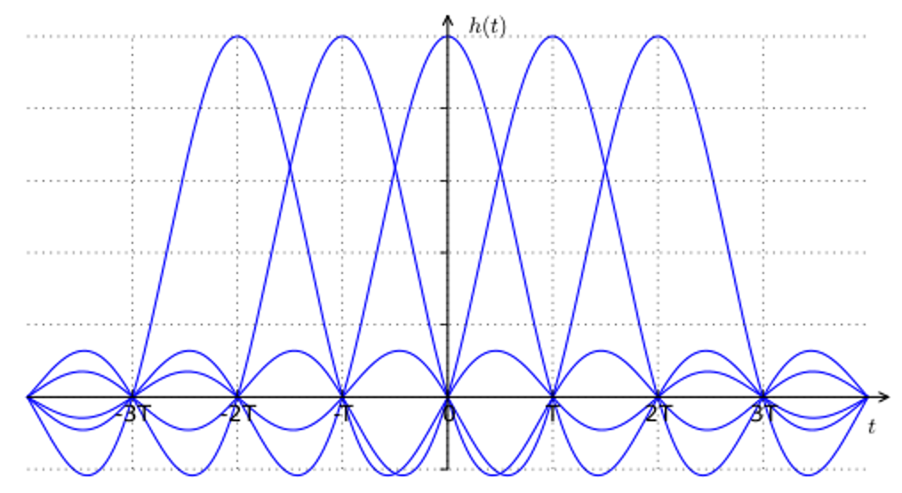
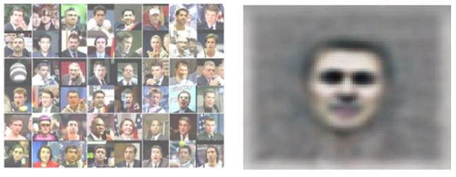
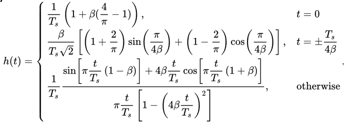
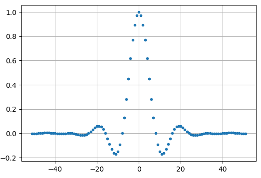
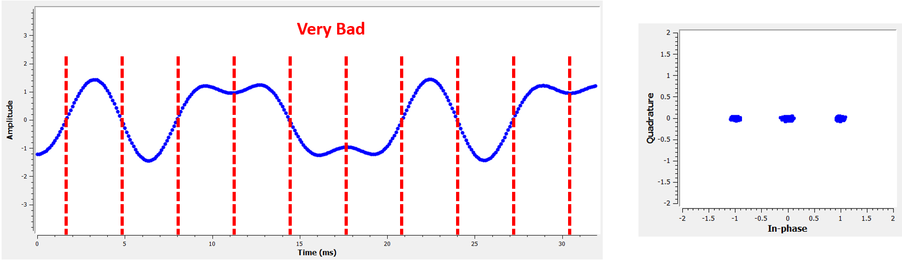

#######################
Pulse Shaping
#######################

You can consider this Part II of the Filters chapter, where we take a deeper dive into pulse shaping.

**********************************
Inter-Symbol-Interference (ISI)
**********************************

In the Filters chapter we learned that blocky shaped symbols/pulses use an excess amount of spectrum, and we can greatly reduce the amount of spectrum used by "shaping" our pulses.  But you can't just use any low-pass filter, or you might get inter-symbol-interference (ISI), which is when symbols bleed into each other and interfere with each other.

When we transmit digital symbols, we transmit them back-to-back (as opposed to waiting a while between symbols).  But when you apply a pulse-shaping filter, it elongates the pulse in the time domain (in order to condense it in frequency), which causes adjancent symbols to overlap with each other.  And this is fine, as long as your pulse shaping filter meets this one criterion: All of the pulses must add up to zero at every multiple of our symbol period T, except for one of the pulses.  This is best understood through the following visualization:

As you can see, at every interval of T, there is one peak of a pulse, and the rest of the pulses are at 0 (they cross the x-axis).  What happens at the receiver, is right before demodulation, the signal is sampled at the perfect time (at the peak of the pulses), so that is the only point in time which matters.  Usually there is a symbol synchronization block at the reciever that makes sure the symbols are sampled at the peaks.

**********************************
Matched Filter
**********************************

One trick we use in wireless communications is called matched filtering.  To understand matched filtering you must first understand these two points:

1. The pulses we discussed above only have to be aligned perfeclty at the receiver, right before the sampling occurs.  Until that point it doesn't really matter if there is ISI.  

2. We want a low-pass filter in our transmitter to reduce the amount of spectrum our signal uses.  But the receiver also needs a low-pass filter, to get rid of as much noise/interference next to the signal as possible.  So we have a low-pass filter at the Tx, another at the Rx, and sampling occurs after both filters (and the wireless channel's effects).   

What we do in modern comms is split the pulse shaping filter equally between the Tx and Rx.  They don't *have* to be identical filters, but theoretically, the optimal linear filter for maximizing the SNR in the presence of AWGN is to use the same filter at both the Tx and Rx.  This is called the "matched filter" concept.  

Another way of thinking about matched filters is that the receiver correlates the received signal with the known template signal.  The template signal is essentially the pulses the transmitter sends, irrespective of the phase/amplitude shifts applied to them.  Recall that filtering is done by convolution, which is essentially correlation (in fact they are mathematically the same when the template is symmetrical).  This process of correlating the received signal with the template gives us our best chance at recovering what was sent, and is why it's theoretically optimal.  As an analogy, think of an image recognition system that looks for faces using a template of a face, and a 2d correlation:

**********************************
Splitting a Filter in Half
**********************************

How do we actually split a filter in half?  Well convolution is associative, which means:

.. math::
 (f * g) * h = f * (g * h)

Let's imagine :math:`f` as our input signal, and :math:`g` and :math:`h` are filters.  Filtering :math:`f` with :math:`g`, and then :math:`h`, is the same as filtering with one filter equal to :math:`g * h`.  

Also, recall that convolution in time domain is multiplication in frequency domain:

.. math::
 g(t) * h(t) \leftrightarrow G(f)H(f)
 
To split a filter in half you can take the square root of the frequency response, since convolution in time domain is a multiply in the frequency domain:

.. math::
 X(f) = X_H(f) X_H(f) \quad \mathrm{where} \quad X_H(f) = \sqrt{X(F)}

**********************************
Specific Pulse Shaping Filters
**********************************

So we know that we want to design a filter that reduces the bandwidth of our signal (to use less spectrum), and all pulses except one should sum to zero every symbol interval.  We then want to take that filter, split it in half, and put one in the Tx and one in the Rx.  Let's look at some specific filters that are common to use for pulse-shaping.

Raised-Cosine Filter
#########################

The most popular pulse-shaping filter seems to be the "raised-cosine" filter.  It's a good low-pass filter for limiting the bandwidth our signal will occupy, and it also has the property of summing to zero at intervals of T:

.. image:: ../_static/raised_cosine.PNG
   :scale: 70 % 
   :align: center 

Note that the above plot is in the time domain, it shows the impulse response of the filter.  The :math:`\beta` parameter is the only parameter for the raised-cosine filter, and it determines how quickly the filter tapers off in the time domain, which will be inversely proportional with how quickly it tapers off in frequency:

.. image:: ../_static/raised_cosine_freq.PNG
   :scale: 50 % 
   :align: center 

And the reason it's called the raised-cosine filter is because the frequency domain when :math:`\beta = 1` is a half-cycle of a cosine wave, raised up to sit on the x-axis. 

The equation that defines the impulse response of the raised-cosine filter is:

.. math::
 h(t) = \frac{1}{T} \mathrm{sinc}\left( \frac{t}{T} \right) \frac{\cos\left(\frac{\pi\beta t}{T}\right)}{1 - \left( \frac{2 \beta t}{T}   \right)^2}

But remember, we split this filter between the Tx and Rx equally.  Enter the Root Raised Cosine (RRC) Filter!

Root Raised-Cosine Filter
#########################

The root raised-cosine (RRC) filter is what we actually implement in our Tx and Rx, combined they form a normal raised-cosine filter, as we discussed.  Because splitting a filter in half involves a frequency-domain square root, the impulse response gets a bit messy:

Luckily it's a heavily used filter and there are plenty of implementations, including in Python.  

Other Pulse-Shaping Filters
###########################

Other filters include the Gaussian filter, which has an impulse response resmbling a Gaussian function, as well as the sinc filter, which is equivalent to the raised-cosine filter when :math:`\beta = 0`, and is more of an idealistic filter.

**********************************
Roll-off Factor
**********************************

Let's look more into the parameter :math:`\beta`.  It is a number betwee 0 and 1, and is called the "roll-off" factor, or sometimes "excess bandwidth".  It determines how fast, in the time domain, the filter rolls off to zero.  Remember, to be used as a filter, the impulse response should decay to zero on both sides:

.. image:: ../_static/rrc_rolloff.PNG
   :scale: 80 % 
   :align: center 

This means more filter taps are required the lower :math:`\beta` gets, and when :math:`\beta = 0` the impulse response never fully hits zero.  I.e., the lower the roll-off, the more compact in frequency we can create our signal for a given symbol rate, which is always important.

A common equation used to approximate bandwidth, in Hz, used for a given symbol rate and roll-off factor is:

.. math::
	\mathrm{BW} = R_S(\beta + 1)

where :math:`R_S` is the symbol rate in Hz.  For wireless comms we usually like a roll-off between 0.2 and 0.5.  So as a rule of thumb, a digital signal that uses symbol rate :math:`R_S` is going to occupy a little more than :math:`R_S` worth of spectrum, and this includes both positive and negative portions of spectrum, because once we upconvert and transmit our signal, both sides exist.  So if we transmit QPSK at 1 million symbols per second (MSps), it will occupy around 1.3 MHz, and the data rate will be 2 Mbps, minus any overhead like channel coding and frame headers.

**********************************
Python Exercise
**********************************

As a Python exercise let's filter and shape some pulses.  We will use BPSK symbols so that it's easier to visualize, because prior to the pulse-shaping step, BPSK involves simply transmitting 1's or -1's, with the "Q" portion equal to zero.  With Q equal to zero we can just plot the I portion only, and it's easier to look at.

In this simulation we will use 8 samples per symbol, and instead of using a square-wave looking signal of 1's and -1's, we use a pulse train of impulses, because when you put an impulse through a filter, the output is the impulse response (hence the name).  So if you want a series of pulses, you want to use impulses with zeros in between, not square pulses.

.. code-block:: python

	import numpy as np
	import matplotlib.pyplot as plt
	from scipy import signal
	
	num_symbols = 10
	sps = 8
	
	bits = np.random.randint(0, 2, num_symbols) # Our data to be transmitted, 1's and 0's
	
	x = np.array([])
	for bit in bits:
	    pulse = np.zeros(sps)
	    pulse[0] = bit*2-1 # set the first value to either a 1 or -1
	    x = np.concatenate((x, pulse)) # add the 8 samples to the signal
	plt.figure(0)
	plt.plot(x, '.-')
	plt.grid(True)
	plt.show()

.. image:: ../_static/pulse_shaping_python1.PNG
   :scale: 80 % 
   :align: center 

At this point our symbols are still 1's and -1's, don't get too caught up in the fact we used impulses.  In fact it might be easier to *not* visualize it, and just think of it as an array:

.. code-block:: python

 bits: [0, 1, 1, 1, 1, 0, 0, 0, 1, 1]
 BPSK symbols: [-1, 1, 1, 1, 1, -1, -1, -1, 1, 1]
 Applying 8 samples per symbol: [-1, 0, 0, 0, 0, 0, 0, 0, 1, 0, 0, 0, 0, 0, 0, 0, 1, 0, 0, 0, 0, 0, 0, 0, ...]

We will create a raised-cosine filter, using a beta of 0.35, and make it 101 taps which will give it enough time to decay to zero.  The fact we are using 8 samples per symbol determines how narrow this filter appears, and how fast it decays to zero.  While the raised cosine equation asks for our symbol period, and a time vector (t), we can just assume a **sample** period of 1 second, to sort of "normalize" our simulation.  This means our symbol period (Ts) is 8, because we have 8 samples per symbol.  So our time vector will just be a list of integers.  With the way the raised-cosine equation works, we want t=0 to be in the center, so we will generate the 101-length time vector starting at -51 and ending on -51:

.. code-block:: python

	# Create our raised-cosine filter
	num_taps = 101
	beta = 0.35
	Ts = sps # Assume sample rate is 1 Hz, so sample period is 1, so *symbol* period is 8
	t = np.arange(-51, 52) # remember it's not inclusive of final number
	h = np.sinc(t/Ts) * np.cos(np.pi*beta*t/Ts) / (1 - (2*beta*t/Ts)**2)
	plt.figure(1)
	plt.plot(t, h, '.')
	plt.grid(True)
	plt.show()

Note how it definitely decays to zero.  The above impulse response looks like a typical low-pass filter, and there's really no way for us to know that it's a pulse-shaping specific filter versus any other low-pass filter.  

Lastly, we can filter our signal x and look at the result.  Don't get too caught up in the for loop below, we'll discuss why it's there.

.. code-block:: python 
 
	# Filter our signal, in order to apply the pulse shaping
	x_shaped = np.convolve(x, h)
	plt.figure(2)
	plt.plot(x_shaped, '.-')
	for i in range(num_symbols):
	    plt.plot([i*sps+num_taps//2+1,i*sps+num_taps//2+1], [min(x_shaped), max(x_shaped)])
	plt.grid(True)
	plt.show()

.. image:: ../_static/pulse_shaping_python3.PNG
   :scale: 60 % 
   :align: center 
  
This plot might look complicated, so let's step through it.  

First off, there are transient samples before and after the data, because of the filter and the way convolution works.  These extra samples get included in our transmission but they don't actually contain "peaks" of pulses.  

The verticle lines were creating in the for loop, and they are meant to show where intervals of Ts occur, which represents where this signal will actually be sampled by the receiver.  

Note how on intervals of Ts, the curve has the value of exactly 1.0 or -1.0, that's the biggest thing to take away here.  This signal is really just a bunch of our impulse responses summed together, with half of the multiplied by -1 first.

If we were to upconvert and transmit this signal, the reciever would have to figure out there the boundaries of Ts are, using a symbol synchronization algorithm, so that it knows exactly where to sample to get the right data.  If it samples a little too early or late, it will see values that are a bit skewed, and if it's way off then it will get a bunch of weird numbers.  Here is an example created using GNU Radio that shows what the IQ plot (a.k.a. constellation) looks like when we sample at the right and wrong time.  Here are the original pulses, with the bit values annotated:

.. image:: ../_static/symbol_sync1.PNG
   :scale: 50 % 
   :align: center 

And below shows the ideal position in time to sample, along with the IQ plot:

.. image:: ../_static/symbol_sync2.PNG
   :scale: 40 % 
   :align: center 

This shows the worst time to sample, note the three clusters:

This is somewhere in between, note the 4 clusters:

.. image:: ../_static/symbol_sync4.PNG
   :scale: 40 % 
   :align: center 
   
Besides demonstrating this symbol sync concept, the above three plots act as good practice for converting from a time domain plot to IQ plot.  All you have to do is look at the Y value where the dashed red lines hit the curve, and draw a dot.  Our Q values are not shown, they are roughly zero, hence why the IQ plots only spread horizontally. 
