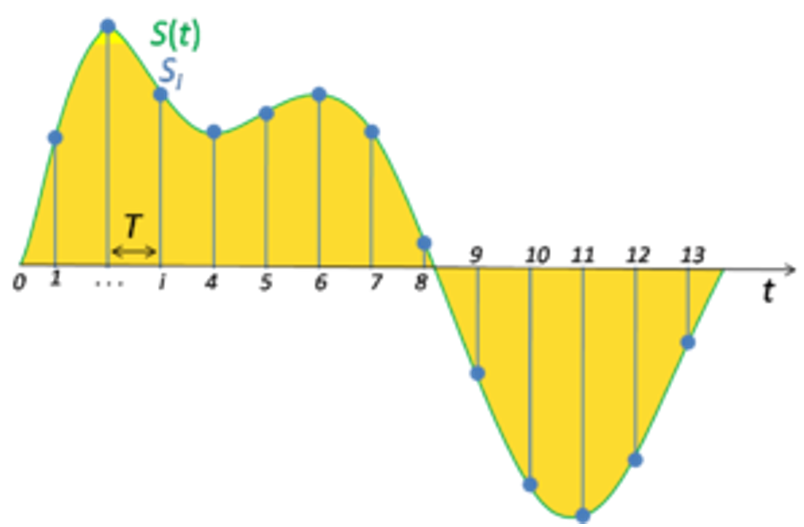
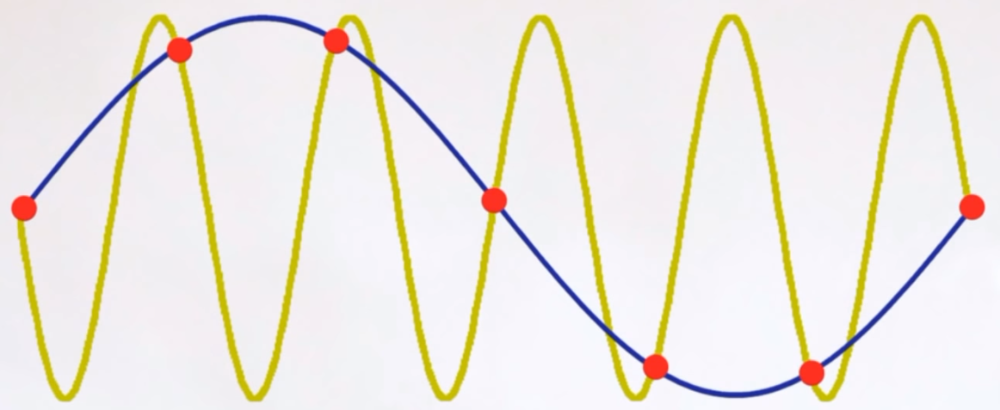
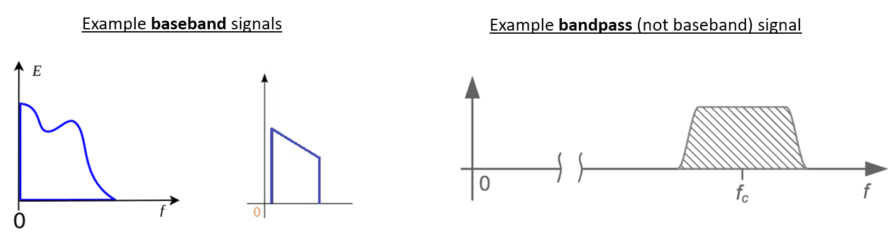
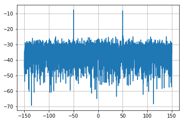

##################
IQ Sampling
##################

In this chapter we introduce something called IQ Sampling, a.k.a. complex sampling, a.k.a. quadrature sampling.  This is the form of sampling that an SDR performs, as well as many digital receivers (and transmitters) in general.  It's essentially a more complex version of regular digital sampling (pun intended).  

*************************
Sampling Basics
*************************

We will first talk about sampling in general, before jumping into IQ sampling.  

Whether we are talking about audio or RF signals, we must sample if we want to capture and process or save a signal digitally.  Sampling might seem straightforward, but there is a lot to it.  Sampling a signal simply means grabbing values at a moment in time, and saving them digitally. Let's say we have some random function, which could represent anything, and it's a continuous function that we want to sample:

   
An example of sampling is recording audio with a microphone.  The mic is a transducer that converts sound waves into an electric signal (a voltage level). Our SDRs are similar except instead of a mic, we have an antenna.  In both cases the voltage level is sampled with an analog-to-digital converter.  What comes out is just a bunch of numbers, either floats or ints.

When we sample something, we need to be mindful of the sample period, i.e. the time between samples are taken.  If you calculate the inverse of the sample period, you will get the sample rate, which is usually what we will use when talking about SDRs.

For a given signal, the big question often is, how fast must we sample?  Let's look at a signal that is just a sine wave, of frequency f.  If we sample that signal with a sample rate, Fs, equal to f, we will get something that looks like:

.. image:: ../_static/sampling1.png
   :scale: 70% 
   :align: center 

In yellow is the original sine wave we are sampling, red shows the samples, and then in blue we show a different (incorrect) function that could have lead to the same samples being recorded.  This indicates that our sample rate was too low.  Let's try sampling a little faster, at 1.2f:

Once again, there is a different signal that could fit in these samples, and that ambiguitity means that if someone gave us the list of samples, we wouldn't know which signal was the original one.  How about sampling at 1.5f:

.. image:: ../_static/sampling3.png
   :scale: 70% 
   :align: center 

Still not fast enough.  It turns out you have to sample at **twice** the frequency of the signal in order to remove the ambiguitity.  Or rather, twice the frequency of the maximum frequency component in our signal, because like we learned last chapter, a given signal can have many frequency components in it:

.. image:: ../_static/max_freq.png
   :scale: 70% 
   :align: center 
   
So we must identify the highest one, then double it, and make sure we sample at that rate or faster. The minimum frequency is known as the Nyquist Rate, and it's an extremely important piece of theory that shows up in more fields than just DSP and SDR.

.. image:: ../_static/nyquist_rate.png
   :scale: 70% 
   :align: center 

If we don't sample fast enough we get something called aliasing, which we will learn about later, but we try to avoid it at all costs.  In general, our SDRs will make sure that we are sampling fast enough to avoid aliasing, which means if we give our SDR a sample rate that's too low, we will simply cut off the signal (in frequency), and not be able to see the whole thing.  Our SDRs go to great lengths to provide us with samples free of aliasing and other imperfections. 

*************************
Quadrature Sampling
*************************

The term "quadrature" has many meanings, but in the context of DSP and SDR it refers to two waves that are 90 degrees out of phase.  Why 90 degrees out of phase?  Well we will see first hand, but first consider how two waves that are 180 degrees out of phase are essentially the same wave, with one multiplied by -1. By being 90 degrees out of phase they become orthogonal, and there's a lot of cool stuff you can do with orthogonal functions.  For the sake of simplicity, we use sine and cosine as our two sine waves that are 90 degrees out of phase:

.. image:: ../_static/quadrature.png
   :scale: 70% 
   :align: center 

Next let's assign variables to represent the amplitude of the sine and cosine.  We will use :math:`I` for the cos() and :math:`Q` for the sin():

.. math::
  I \cos(2\pi ft)
  
  Q \sin(2\pi ft)

We can see this visually by plotting I and Q equal to 1:

.. image:: ../_static/IQ_wave.png
   :scale: 70% 
   :align: center 

We call the cos() the "in phase" component, hence the name I, and the sin() is the 90 degrees out of phase or "quadrature" component, hence Q.  Although if you accidently mix it up and assign Q to the cos() and I to the sin(), it won't actually break anything for most situations. 

IQ sampling is more easily understoof by using the transmitter's point of view, i.e. considering the task of transmitting an RF signal through the air.  What we do as the transmitter is add the sin() and cos().  Let's say x(t) is our signal to transmit:

.. math::
  x(t) = I \cos(2\pi ft)  + Q \sin(2\pi ft)

What happens when we add a sin and cosine?  Or rather, what happens when we add two sinusoids that are 90 degrees out of phase?  In the video below, there is a slider for adjusting I and another for adjusting Q.  What is plotted are the cos, sin, and then the sum of the two.  

<insert video of gnuradio demo>

The important take-aways are that when we add the cos() and sin(), we get another pure sine wave with a different phase and amplitude. Also, the phase shifts as we slowly remove or add one of the two parts.  The amplitude also changes.  The "utility" of this behavior is that we can control the phase and amplitude of a resulting sine wave by adjusting the amplitudes I and Q.
E.g., we can adjust I and Q in a way that keeps the amplitude constant and makes the phase whatever we want.  As a transmitter this is extremely useful, because we know that we need to transmit a sinusoidal signal in order for it to fly through the air as an electromagnetic wave (because physics).  And it's much easier to adjust two amplitudes and perform an addition compared to adjusting an amplitude and a phase.  The result is that our transmitter will look something like this:

.. image:: ../_static/IQ_diagram.png
   :scale: 70% 
   :align: center 

We only need to generate one sine wave, and then just shift it by 90 degrees to get the Q portion.  

*************************
Complex Numbers
*************************

Ultimately, the IQ convention is just an alternative way of representing magnitude and phase, which brings us to complex numbers and the complex plane.  You may have seen this before in other classes, but we can represent a single complex number of a complex plane.  Let's take the complex number 0.7-0.4j as an example:

.. image:: ../_static/complex_plane_1.png
   :scale: 70% 
   :align: center

A complex number is really just two numbers together, a real and an imaginary portion.  But a complex number also has a magnitude and phase, which makes more sense if you think about it as a vector instead of a point. Magnitude is the length of the line between the origin and the point (i.e. length of the vector), while phase is the angle between the vector and 0 degrees, which we define as the positive real axis:

.. image:: ../_static/complex_plane_2.png
   :scale: 70% 
   :align: center

This is sometimes called a "phasor diagram" which sounds more complicated than it is.  It's really just plotting complex numbers and treating them as vectors.  Now what is the magnitude and phase of our example complex number 0.7-0.4j?  

.. math::
  \mathrm{magnitude} = \sqrt{a^2 + b^2} = 0.806
  
  \mathrm{phase} = \tan^{-1} \left( \frac{b}{a} \right) = -29.7^{\circ} = -0.519 \quad \mathrm{radians} 
  
In Python you can just use np.abs(x) and np.angle(x) for the magnitude and phase, the input can be a scalar or a vector of complex numbers, and the output will be a **real** number(s), i.e. floats. 

You may have figured out by now how this related back to IQ convention.  Well it's simple; I is real and Q is imaginary.  From this point on, when we draw the complex plane, we will label it with I and Q instead of real and imaginary.  They are still complex numbers!

.. image:: ../_static/complex_plane_3.png
   :scale: 70% 
   :align: center

Now let's say we want to transmit our example point 0.7-0.4j.  This means we will be transmitting:

.. math::
  x(t) = I \cos(2\pi ft)  + Q \sin(2\pi ft)
  
  x(t) = 0.7 \cos(2\pi ft) - 0.4 \sin(2\pi ft)
  
  x(t) = 0.806 \cos(2\pi ft - 0.519)

So even though we started with a complex number, what we are actually transmitting is real, which is good because you can't actually transmit something imaginary with electromagnetic waves.  We just use imaginary/complex numbers to represent *what* we are transmitting.  

*************************
Receiver Side
*************************

Now let's reverse everything and take the perspective of a radio receiver, that is trying to receive a signal (e.g. an FM radio signal).  Using IQ sampling, the diagram now looks like:

.. image:: ../_static/IQ_diagram_rx.png
   :scale: 70% 
   :align: center

What comes in is a real signal that was received by our antenna, and what comes out are IQ values.  What we do is sample the I and Q branch individually, using two analog to digital converters (ADCs), and then we combine the pairs and store them as complex numbers.  In other words, at each time step, you will sample one I value and one Q value, and combine them in the form :math:`I + jQ`, i.e. one complex number per IQ sample.  There will always be a "sample rate", the rate sampling is performed.  For example, someone migth say "I have an SDR running at 2 MHz sample rate" which just means it's receiving two million IQ samples per second.  If someone gives you a bunch of IQ samples, it will look like a 1D array/vector of complex numbers.  This is pretty much what this entire chapter has been leading up to, and we finally made it.  Throughout this textbook you will become **very** familiar with how IQ samples work, how to receive and transmit them with an SDR, how to process them in Python or GNU Radio, how to record them for later analysis, etc.  

One last important note: the figure above shows what's happening **inside** of the SDR, we don't actually have to generate a sine wave, shift by 90, multiply or add, the SDR does that for us.  We tell the SDR what frequency we want to sample at, or what frequency we want to transmit our samples at.  On the receiver side, the SDR will provide us the IQ samples, and then for the transmitting side we have to provide the SDR the IQ samples.  In terms of data type, they will either be complex ints or floats.  

**************************
Carrier and Downconversion
**************************

Up until this point we really didn't talk about frequency, but we saw there was an :math:`f` in the equations involving the cos() and sin().  This frequency is the frequency of the sine wave we actually send through the air, so the electromagnetic wave's frequency.  We call this the "carrier", because it carries our information (stored in I and Q) on a certain frequency. 

.. image:: ../_static/carrier.png
   :scale: 70% 
   :align: center
   
Just for reference, radio signals such as FM radio, WiFi, Bluetooth, LTE, GPS, etc, usually use a frequency (i.e. a carrier) between 100 MHz and 6 GHz.  These frequencies travel really well through the air, but don't require super long antennas or a ton of power to transmit on.  Your microwave cooks food with electromagnetic waves that are at 2.4 GHz, and if there is a leak in the door then your microwave will jam WiFi signals, and possibly also burn your skin.  Another form of electromagnetic waves is light, and visible light has a frequency of around 500 THz.  It's so high that we don't use traditional antennas to transmit light, we use other methods like LEDs that are semiconductor devices, that create light when electrons jump in between the atomic orbits of the semiconductor material.  But for frequencies below 100 GHz we tend to use normal antennas. 

When we change our IQ values really quickly and transmit our carrier, it's called "modulating" the carrier (with data or whatever we want).  Because when we change I and Q, we are changing the phase and amplitude of the carrier.  A third option is to change the frequency of the carrier, i.e. shift it slightly up or down, which is what FM radio does.  It turns out that a change in phase over time, is a change in frequency, but we won't dive into that concept quite yet.  

As a simple example, lets say we transmit the IQ sample 1+0j, and then we switch to transmitting 0+1j.  I.e. we go from sending :math:`\cos(2\pi ft)` to :math:`\sin(2\pi ft)`.  All that happens is our carrier shifts phase by 90 degrees when we switch from one sample to another. 

Now back to sampling for a second.  Instead of receiving a single by multiplying it by a cos() and sin() and then recording I and Q, what if we just fed it straight into a single analog to digital converter?  Well let's say the carrier frequency is 2.4 GHz, like WiFi or Bluetooth.  That means we would have to sample at 4.8 GHz, as we will see in the next subsection.  Well that's extremley fast, and an ADC that samples that fast costs thousands of dollars.  So what we do instead is "downconvert" the signal so that the signal we want to sample is centered around DC or 0 Hz, this happens before we do the sampling.  We go from 

.. math::
  I \cos(2\pi ft)
  
  Q \sin(2\pi ft)
  
to just I and Q.  Let's visualize this in the frequency domain:

.. image:: ../_static/downconversion.png
   :scale: 50% 
   :align: center

When we are centered around 0 Hz, the maximum frequency is no longer 2.4 GHz, but is simply based on the signal's characteristics, because we have removed the carrier.  Most signals are around 100 kHz to 20 MHz wide in bandwidth, so we are talking about sampling at a much much lower rate.  The PlutoSDR contains an RF integrated circuit (RFIC) that can sample up to 56 MHz, which is high enough for most signals we will encounter.

*************************
Baseband
*************************
When we discuss a signal centered around 0 Hz, we refer to this as "baseband". The opposite of baseband is called "bandpass", when a signal exists at some RF frequency, no where near 0 Hz.  A signal at baseband might be perfectly centered around 0 Hz like the right-hand portion of the figure above, or it might just be near 0 Hz, like the two signals shown below, which are still considered baseband.   Also shown is an example bandpass signal, centered at some very high frequency, denoted :math:`f_c`.  

You may also hear the term IF, which stands for intermediate frequency; for now think of this as some point in between baseband and bandpass/RF that the signal is converted to as an intermediate step. 

When we create, record, or analyze signals, we usually do it at baseband, because we can work at a lower sample rate (for reasons discussed in the previous subsection).  It is also important to note that baseband signals are often complex signals, while signals at bandpass (e.g. signals we actually transmit over RF) are real.  This makes sense, because the signal fed through an antenna must be real, you cannot directly transmit a complex/imaginary signal.  You will know a signal is definitely a complex signal if the negative frequency and positive frequency portions of the signal are not exactly the same, complex numbers are how we represent negative frequencies after all.  In reality there is no negative frequencies, it's just the portion of the signal that happened to be below the carrier frequency. 

*************************
DC Spike
*************************

Soon after you start playing around with SDRs, you will find that often, there will be a large spike in the center of the FFT.
This is called a "DC offset" or "DC spike" or sometimes "LO leakage" because the center of the FFT represents zero Hz, which is a constant "DC type" signal with no sinusoidal variations.  Here's an example:

.. image:: ../_static/dc_spike.png
   :scale: 50% 
   :align: center
   
Remember that because the SDR tunes to a center frequency, the 0 Hz portion of the FFT really corresponds to the center frequency.
That being said, a DC spike doesn't nessesarily mean there is energy at the center frequency.
If there is only a DC spike, and the rest of the FFT looks like noise, there is most likely not actually a signal present where it is showing you one.

A DC offset is a common artifact in direct conversion receivers, which is the architecture used for SDRs like the PlutoSDR, RTL-SDR, LimeSDR, and many Ettus USRPs.
In direct conversion receivers, there is an oscillator called the LO, which is used to down-convert the signal from its actual frequency to baseband.
As a result, leakage from this LO will show up in the center of the observed bandwidth.
Many RF integrated circuits (RFICs) have built-in automatic DC offset removal, but it typically requires a signal to be present to work.
That is why the DC spike will be very apparent when no signals are present.

A quick way around the DC offset issue is to oversample the signal and off-tune. 
As an example, lets say we want to view 5 MHz of spectrum at 100 MHz. 
Instead what we can do is sample at 20 MHz, at a center frequency of 95 MHz. 

.. image:: ../_static/offtuning.png
   :scale: 50 %
   :align: center
   
Our LO will be set to 95 MHz because that is the frequency we ask the SDR to tune to, which is outside the observation window we are interested in.
There is only one problem: if we want our signal to actually be centered at 100 MHz and only contain 5 MHz, we will have to perform a frequency shift, filter, and downsample ourself (something we will learn how to do later).
Fortunately, this process of offtuning, a.k.a applying an LO offset, is often built into the SDRs, where they will automatically do the offtuning and then shift the frequency to your desired center frequency automatically.  It's great when the SDR can do it internally because it means we don't have to send a higher sample rate over our USB or ethernet connection, which is usually the bottleneck for how high a sample rate we can use.  
   

**************************
Sampling Using our RTL-SDR
**************************

PlutoSDR in Python code?  Or GNU Radio? or both?

*************************
Calculating Average Power
*************************

For a discrete complex signal, i.e. one we have sampled, we can find the average power by taking the magnitude of each sample, squaring it, then finding the mean:

.. math::
   P = \frac{1}{N} \sum_{n=1}^{N} |x[n]|^2

Remember that the absolute value of a complex number is just the magnitude, i.e. :math:`\sqrt{I^2+Q^2}`

In Python this would look like:

.. code-block:: python

 avg_pwr = np.mean(np.abs(x)**2)
 
Note that energy and power are not the same thing.  Typically in SDR we talk in terms of power, not energy.
We will not go into it here, but in general, in signal processing you can calculate energy by dropping the square root that is always in power-related equations.
See <here> for a nice guide about the difference between power and energy in the context of wireless comms and SDR.

Here is a very useful trick for calculating the average power of a sampled signal.
If your signal has (roughly) zero mean, which is usually the case in SDR (we will see why later), then the signal power can be found by simplying taking the variance of the samples, e.g.:

.. code-block:: python

 avg_pwr = np.var(x) # (signal should have roughly zero mean)

The reason why is quite simple; the equation for variance is :math:`\frac{1}{N}\sum^N_{n=1} |x[n]-\mu|^2`
where :math:`\mu` is the signal's mean, so if :math:`\mu` is zero than it becomes equivalent to the equation for power.
You can also just subtract out the mean from the samples in your window of observation, then take variance.
 
**********************************
Calculating Power Spectral Density
**********************************

Last chapter we learned that we can convert a signal to the frequency domain using an FFT, and the result is called the Power Spectral Density (PSD).
All DSP engineers know this, but when it comes to actually finding the PSD of a batch of samples and plotting it, you need to do more than just take an FFT.
We must do the following six operations:

1. Take the FFT of our samples.  The FFT size will be the length of x by default, so lets only use the first 1024 samples as an example.  I've seen anywhere from 2^6 to 2^20 (64 to one million).  Using a power of two is most efficient.
2. Take the magnitude of our FFT results.  
3. Normalize; divide by our sample rate (:math:`F_s`)
4. Square the resulting magnitude, to get power instead of energy.
5. Convert to dB using :math:`10 \log_{10}()`, we always view PSDs in log scale.
6. Perform an FFT shift; it turns out that mathematically the FFT operation does not result in "0 Hz" in the center.  This operation just rearranges the array to fix that.

In Python this looks like:

.. code-block:: python

 Fs = 1e6 # lets say we sampled at 1 MHz
 x = np.fromfile('samples.iq', dtype=np.complex64) # replace with your method of getting samples
 x = x[0:1024] # we will only take the FFT of the first 1024 samples, see text below
 PSD = np.abs(np.fft.fft(x)/Fs)**2
 PSD_log = 10.0*np.log10(PSD)
 PSD_shifted = np.fft.fftshift(PSD_log)
 
And optionally we can apply a window, like we learned about last chapter:

.. code-block:: python

 # add the following line after doing x = x[0:1024]
 x = x * np.hamming(len(x)) # apply a Hamming window

Now to plot this PSD we need to know the values of the x-axis.  
As we learned last chapter, when we sample a signal, we only "see" the spectrum between -fs/2 and fs/2 where fs is our sample rate.
The resolution we achieve in the frequency domain depends on the size of our FFT, which by default is equal to the number of samples we perform the FFT operation on.
In this case our x-axis is 1024 equally spaced points between -0.5 MHz and 0.5 MHz.  
If we had tuned our SDR to 2.4 GHz then that means our observation window would be between 2399500000 and 2400500000 Hz.
In Python this looks like:

.. code-block:: python
 
 center_freq = 2.4e9 # frequency we tuned our SDR to
 f = np.linspace(center_freq - Fs/2.0, center_freq + Fs/2.0, 1024) # lazy method
 plt.plot(f, PSD_shifted)
 plt.show()
 
And we should be left with a beautiful PSD.  
If you want to find the PSD of millions of samples, don't just do a million-point FFT, because it will probably take forever, and it will give you an output of a million "frequency bins" which is too much to show in a plot. 
Instead I suggest doing multiple smaller PSDs and averaging them together, or displaying them using a Waterfall Plot.
Alternatively, if you know your signal is not changing, it's not a sin to only use a few thousand samples and just find the PSD of those, because within that time-frame of a few thousands samples you will likely capture enough of the signal to get a nice representation.

Here is a full example which also includes generating a signal and noise.  Note that N, the number of samples to simulate, becomes the FFT length because we take the FFT of the entire simulated signal.

.. code-block:: python

 import numpy as np
 import matplotlib.pyplot as plt
 
 Fs = 300 # sample rate
 Ts = 1/Fs # sample period
 N = 5048 # number of samples to simulate
 
 t = Ts*np.arange(N)
 x = np.sin(2*np.pi*50*t + 1) # simulates sinusoid at 50 Hz
 
 n = (np.random.randn(N) + 1j*np.random.randn(N))/np.sqrt(2) # AWGN with unity power
 noise_power = 2
 r = x + n * np.sqrt(noise_power)
 
 PSD = (np.abs(np.fft.fft(r))/N)**2
 PSD_log = 10.0*np.log10(PSD)
 PSD_shifted = np.fft.fftshift(PSD_log)
 
 f = np.linspace(Fs/-2.0, Fs/2.0, N) # lazy method
 
 plt.plot(f, PSD_shifted)
 plt.grid(True)
 plt.show()
 
Output:

