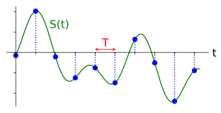
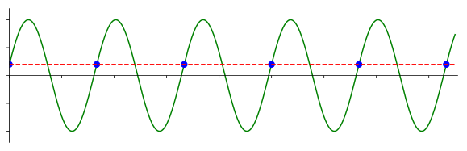
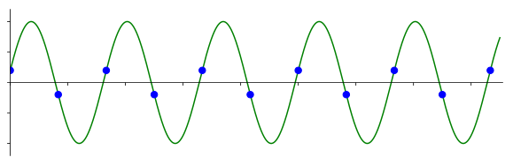
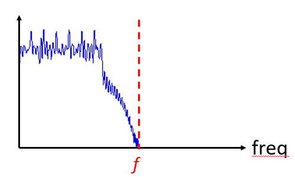
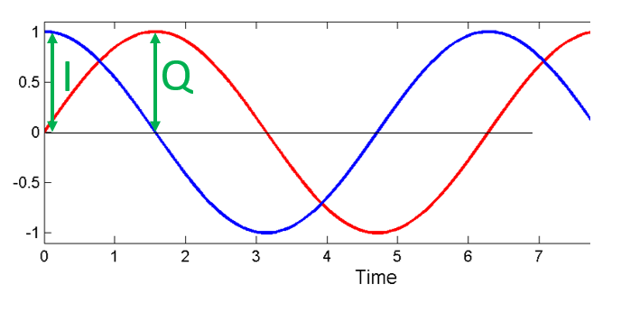
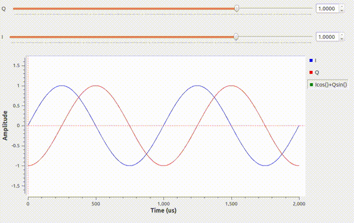
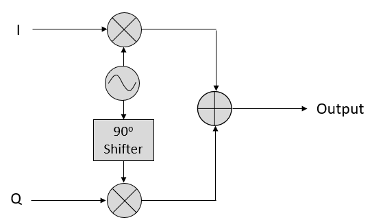

.. _sampling-chapter:

##################
IQ Sampling
##################

In this chapter we introduce a concept called IQ Sampling, a.k.a. complex sampling or quadrature sampling.  It is the form of sampling that an SDR performs, as well as many digital receivers (and transmitters).  It's just a slightly more complex version of regular digital sampling (pun intended).

*************************
Sampling Basics
*************************

Before jumping into IQ sampling, let's discuss what sampling actually means. You may have encountered sampling without realizing it by recording audio with a microphone. The microphone is a transducer that converts sound waves into an electric signal (a voltage level). That electric signal is transformed by an analog-to-digital converter, producing a digital representation of the sound wave. To simplify, the microphone captures sound waves that are converted into electricity, and that electricity in turn is converted into numbers. SDRs are surprisingly similar. Instead of a microphone, however, they utilize an antenna. In both cases, the voltage level is sampled with an analog-to-digital converter. For SDRs, think radio waves in then numbers out.

Whether we are dealing with audio or radio frequencies, we must sample if we want to capture, process, or save a signal digitally.  Sampling might seem straightforward, but there is a lot to it.  A more technical way to think of sampling a signal is grabbing values at moments in time and saving them digitally. Let's say we have some random function, :math:`S(t)`, which could represent anything, and it's a continuous function that we want to sample:

We record the value of :math:`S(t)` at regular intervals of :math:`T` seconds, known as the **sample period**.  The frequency at which we sample, i.e., the number of samples taken per second, is simply :math:`\frac{1}{T}`.  We call this the **sample rate**, and its the inverse of the sample period.  For example, if we have a sample rate of 10 Hz, then the sample period is 0.1 seconds; there will be 0.1 seconds between each sample.  In practice our sample rates will be on the order of hundreds of kHz to tens of MHz or even higher.  When we sample signals, we need to be mindful of the sample rate, it's a very important parameter. 

For those who prefer to see the math; let :math:`S_n` represent sample :math:`n`, usually an integer starting at 0. Using this convention, the sampling process can be represented mathematically as :math:`S_n = S(nT)` for integer values of :math:`n`.  I.e., we evaluate the analog signal :math:`S(t)` at these intervals of :math:`nT`.

*************************
Nyquist Sampling
*************************

For a given signal, the big question often is how fast must we sample?  Let's examine a signal that is just a sine wave, of frequency f, shown in green below.  Let's say we sample at a rate Fs (samples shown in blue).  If we sample that signal at a rate equal to f (i.e., Fs = f), we will get something that looks like:

The red dashed line in the above image reconstructs a different (incorrect) function that could have lead to the same samples being recorded. It indicates that our sample rate was too low because the same samples could have come from two different functions, leading to ambiguity. If we want to accurately reconstruct the original signal, we can't have this ambiguity.

Let's try sampling a little faster, at Fs = 1.2f:

.. image:: ../_static/sampling_Fs_0.36.svg
   :align: center 

Once again, there is a different signal that could fit these samples. This ambiguity means that if someone gave us this list of samples, we could not distinguish which signal was the original one based on our sampling.

How about sampling at Fs = 1.5f:

.. image:: ../_static/sampling_Fs_0.45.svg
   :align: center 

Still not fast enough!  According to a piece of DSP theory we won't dive into, you have to sample at **twice** the frequency of the signal in order to remove the ambiguity we are experiencing:

There's no incorrect signal this time because we sampled fast enough that no signal exists that fits these samples other than the one you see (unless you go *higher* in frequency, but we will discuss that later).

In the above example our signal was just a simple sine wave, most actual signals will have many frequency components to them.  To accurately sample any given signal, the sample rate must be "at least twice the frequency of the maximum frequency component".  Here's a way to visualize that:

   
We must identify the highest frequency component, then double it, and make sure we sample at that rate or faster.  The minimum rate in which we can sample is known as the Nyquist Rate.  In other words, the Nyquist Rate is the minimum rate at which a (finite bandwidth) signal needs to be sampled to retain all of its information.  It is an extremely important piece of theory within DSP and SDR that serves as a bridge between continuous and discrete signals.

.. image:: ../_static/nyquist_rate.png
   :scale: 70% 
   :align: center 

If we don't sample fast enough we get something called aliasing, which we will learn about later, but we try to avoid it at all costs.  What our SDRs do (and most receivers in general) is filter out everything above Fs/2 right before the sampling is performed. If we attempt to receive a signal with too low a sample rate, that filter will chop off part of the signal.  Our SDRs go to great lengths to provide us with samples free of aliasing and other imperfections.

*************************
Quadrature Sampling
*************************

The term "quadrature" has many meanings, but in the context of DSP and SDR it refers to two waves that are 90 degrees out of phase.  Why 90 degrees out of phase?  Consider how two waves that are 180 degrees out of phase are essentially the same wave with one multiplied by -1. By being 90 degrees out of phase they become orthogonal, and there's a lot of cool stuff you can do with orthogonal functions.  For the sake of simplicity, we use sine and cosine as our two sine waves that are 90 degrees out of phase.

Next let's assign variables to represent the **amplitude** of the sine and cosine.  We will use :math:`I` for the cos() and :math:`Q` for the sin():

.. math::
  I \cos(2\pi ft)
  
  Q \sin(2\pi ft)

We can see this visually by plotting I and Q equal to 1:

We call the cos() the "in phase" component, hence the name I, and the sin() is the 90 degrees out of phase or "quadrature" component, hence Q.  Although if you accidentally mix it up and assign Q to the cos() and I to the sin(), it won't make a difference for most situations. 

IQ sampling is more easily understood by using the transmitter's point of view, i.e., considering the task of transmitting a RF signal through the air.  What we do as the transmitter is add the sin() and cos().  Let's say x(t) is our signal to transmit:

.. math::
  x(t) = I \cos(2\pi ft)  + Q \sin(2\pi ft)

What happens when we add a sine and cosine?  Or rather, what happens when we add two sinusoids that are 90 degrees out of phase?  In the video below, there is a slider for adjusting I and another for adjusting Q.  What is plotted are the cosine, sine, and then the sum of the two.

The important take-aways are that when we add the cos() and sin(), we get another pure sine wave with a different phase and amplitude. Also, the phase shifts as we slowly remove or add one of the two parts.  The amplitude also changes.  The "utility" of this behavior is that we can control the phase and amplitude of a resulting sine wave by adjusting the amplitudes I and Q (we don't have to adjust the phase of the cosine or sine).  For example, we could adjust I and Q in a way that keeps the amplitude constant and makes the phase whatever we want.  As a transmitter this ability is extremely useful because we know that we need to transmit a sinusoidal signal in order for it to fly through the air as an electromagnetic wave (because physics).  And it's much easier to adjust two amplitudes and perform an addition operation compared to adjusting an amplitude and a phase.  The result is that our transmitter will look something like this:

We only need to generate one sine wave and shift it by 90 degrees to get the Q portion.

*************************
Complex Numbers
*************************

Ultimately, the IQ convention is an alternative way to represent magnitude and phase, which leads us to complex numbers and the ability to represent them on a complex plane.  You may have seen complex numbers before in other classes. Take the complex number 0.7-0.4j as an example:

.. image:: ../_static/complex_plane_1.png
   :scale: 70% 
   :align: center

A complex number is really just two numbers together, a real and an imaginary portion. A complex number also has a magnitude and phase, which makes more sense if you think about it as a vector instead of a point. Magnitude is the length of the line between the origin and the point (i.e., length of the vector), while phase is the angle between the vector and 0 degrees, which we define as the positive real axis:

.. image:: ../_static/complex_plane_2.png
   :scale: 70% 
   :align: center

This representation of a sinusoid is known as a "phasor diagram".  It's simply plotting complex numbers and treating them as vectors.  Now what is the magnitude and phase of our example complex number 0.7-0.4j?  For a given complex number where :math:`a` is the real part and :math:`b` is the imaginary part:

.. math::
  \mathrm{magnitude} = \sqrt{a^2 + b^2} = 0.806
  
  \mathrm{phase} = \tan^{-1} \left( \frac{b}{a} \right) = -29.7^{\circ} = -0.519 \quad \mathrm{radians} 
  
In Python you can use np.abs(x) and np.angle(x) for the magnitude and phase. The input can be a complex number or an array of complex numbers, and the output will be a **real** number(s) (of the data type float).

You may have figured out by now how this vector or phasor diagram relates to IQ convention: I is real and Q is imaginary.  From this point on, when we draw the complex plane, we will label it with I and Q instead of real and imaginary.  They are still complex numbers!

.. image:: ../_static/complex_plane_3.png
   :scale: 70% 
   :align: center

Now let's say we want to transmit our example point 0.7-0.4j.  We will be transmitting:

.. math::
  x(t) = I \cos(2\pi ft)  + Q \sin(2\pi ft)
  
  \quad \quad \quad = 0.7 \cos(2\pi ft) - 0.4 \sin(2\pi ft)
  
  \quad = 0.806 \cos(2\pi ft - 0.519)

Even though we started with a complex number, what we are transmitting is real, which is good because you can't actually transmit something imaginary with electromagnetic waves.  We just use imaginary/complex numbers to represent *what* we are transmitting.  We will talk about the :math:`f` shortly.

*************************
Receiver Side
*************************

Now let's take the perspective of a radio receiver that is trying to receive a signal (e.g., an FM radio signal).  Using IQ sampling, the diagram now looks like:

.. image:: ../_static/IQ_diagram_rx.png
   :scale: 70% 
   :align: center

What comes in is a real signal received by our antenna, and those are transformed into IQ values.  What we do is sample the I and Q branches individually, using two analog-to-digital converters (ADCs), and then we combine the pairs and store them as complex numbers.  In other words, at each time step, you will sample one I value and one Q value and combine them in the form :math:`I + jQ` (i.e., one complex number per IQ sample).  There will always be a "sample rate", the rate at which sampling is performed.  Someone might say, "I have an SDR running at 2 MHz sample rate." What they mean is that the SDR receives two million IQ samples per second.

If someone gives you a bunch of IQ samples, it will look like a 1D array/vector of complex numbers.  This point, complex or not, is what this entire chapter has been building to, and we finally made it.

Throughout this textbook you will become **very** familiar with how IQ samples work, how to receive and transmit them with an SDR, how to process them in Python, and how to save them to a file for later analysis.

One last important note: the figure above shows what's happening **inside** of the SDR. We don't actually have to generate a sine wave, shift by 90, multiply or add--the SDR does that for us.  We tell the SDR what frequency we want to sample at, or what frequency we want to transmit our samples at.  On the receiver side, the SDR will provide us the IQ samples. For the transmitting side, we have to provide the SDR the IQ samples.  In terms of data type, they will either be complex ints or floats.

**************************
Receiver Architectures
**************************

The figure in the above "Receiver Side" section demonstrates how the input signal is downconverted and split into I and Q.  This arrangement is called "direct conversion", or "zero IF", because the RF frequencies are being directly converted down to baseband.  Another option is to not downconvert at all and sample so fast to capture everything from 0 Hz to 1/2 the sample rate.  This strategy is called "direct sampling" or "direct RF", and it requires an extremely expensive ADC chip.  A third architecture, one that is popular because it's how old radios worked, is known as "superheterodyne". It involves downconversion but not all the way to 0 Hz. It places the signal of interest at an intermediate frequency, known as "IF".  Here are the block diagrams of these three architectures:

.. image:: ../_static/receiver_arch_diagram.svg
   :align: center
   
   
**************************
Carrier and Downconversion
**************************

Until this point we have not discussed frequency, but we saw there was an :math:`f` in the equations involving the cos() and sin().  This frequency is the frequency of the sine wave we actually send through the air (the electromagnetic wave's frequency).  We refer to it as the "carrier" because it carries our information (stored in I and Q) on a certain frequency.

.. image:: ../_static/carrier.png
   :scale: 70% 
   :align: center
   
For reference, radio signals such as FM radio, WiFi, Bluetooth, LTE, GPS, etc., usually use a frequency (i.e., a carrier) between 100 MHz and 6 GHz.  These frequencies travel really well through the air, but they don't require super long antennas or a ton of power to transmit or receive.  Your microwave cooks food with electromagnetic waves at 2.4 GHz. If there is a leak in the door then your microwave will jam WiFi signals and possibly also burn your skin.  Another form of electromagnetic waves is light. Visible light has a frequency of around 500 THz.  It's so high that we don't use traditional antennas to transmit light. We use  methods like LEDs that are semiconductor devices. They create light when electrons jump in between the atomic orbits of the semiconductor material, and the color depends on how far they jump.  Technically, radio frequency (RF) is defined as the range from roughly 20 kHz to 300 GHz. These are the frequencies at which energy from an oscillating electric current can radiate off a conductor (an antenna) and travel through space.  The 100 MHz to 6 GHz range are the more useful frequencies, at least for most modern applications.  Frequencies above 6 GHz have been used for radar and satellite communications for decades, and are now being used in 5G "mmWave" (24 - 29 GHz) to supplement the lower bands and increase speeds. 

When we change our IQ values quickly and transmit our carrier, it's called "modulating" the carrier (with data or whatever we want).  When we change I and Q, we change the phase and amplitude of the carrier.  Another option is to change the frequency of the carrier, i.e., shift it slightly up or down, which is what FM radio does. 

As a simple example, let's say we transmit the IQ sample 1+0j, and then we switch to transmitting 0+1j.  We go from sending :math:`\cos(2\pi ft)` to :math:`\sin(2\pi ft)`, meaning our carrier shifts phase by 90 degrees when we switch from one sample to another. 

Now back to sampling for a second.  Instead of receiving samples by multiplying what comes off the antenna by a cos() and sin() then recording I and Q, what if we fed the signal from the antenna into a single analog-to-digital converter, like in the direct sampling architecture we just discussed?  Say the carrier frequency is 2.4 GHz, like WiFi or Bluetooth.  That means we would have to sample at 4.8 GHz, as we learned.  That's extremely fast! An ADC that samples that fast costs thousands of dollars.  Instead, we "downconvert" the signal so that the signal we want to sample is centered around DC or 0 Hz. This downconversion happens before we sample.  We go from:

.. math::
  I \cos(2\pi ft)
  
  Q \sin(2\pi ft)
  
to just I and Q.

Let's visualize downconversion in the frequency domain:

.. image:: ../_static/downconversion.png
   :scale: 60% 
   :align: center

When we are centered around 0 Hz, the maximum frequency is no longer 2.4 GHz but is based on the signal's characteristics since we removed the carrier.  Most signals are around 100 kHz to 40 MHz wide in bandwidth, so through downconversion we can sample at a *much* lower rate. The PlutoSDR contains an RF integrated circuit (RFIC) that can sample up to 56 MHz, which is high enough for most signals we will encounter.

Just to reiterate, the downconversion process is performed by our SDR; as a user of the SDR we don't have to do anything other than tell it which frequency to tune to.

***********************************
Baseband and Bandpass Signals
***********************************
We refer to a signal centered around 0 Hz as being at "baseband".  Conversely, "bandpass" refers to when a signal exists at some RF frequency nowhere near 0 Hz, that has been shifted up for the purpose of wireless transmission.  There is no notion of a "baseband transmission", because you can't transmit something imaginary.  A signal at baseband may be perfectly centered at 0 Hz like the right-hand portion of the figure in the previous section. It might be *near* 0 Hz, like the two signals shown below. Those two signals are still considered baseband.   Also shown is an example bandpass signal, centered at a very high frequency denoted :math:`f_c`.

.. image:: ../_static/baseband_bandpass.png
   :scale: 50% 
   :align: center

You may also hear the term intermediate frequency (abbreviated as IF); for now, think of IF as an intermediate conversion step within a radio between baseband and bandpass/RF.

We tend to create, record, or analyze signals at baseband because we can work at a lower sample rate (for reasons discussed in the previous subsection).  It is important to note that baseband signals are often complex signals, while signals at bandpass (e.g., signals we actually transmit over RF) are real.  Think about it: because the signal fed through an antenna must be real, you cannot directly transmit a complex/imaginary signal.  You will know a signal is definitely a complex signal if the negative frequency and positive frequency portions of the signal are not exactly the same. Complex numbers are how we represent negative frequencies after all.  In reality there are no negative frequencies; it's just the portion of the signal below the carrier frequency.

***************************
DC Spike and Offset Tuning
***************************

Once you start working with SDRs, you will often find a large spike in the center of the FFT.
It is called a "DC offset" or "DC spike" or sometimes "LO leakage".

Here's an example of a DC spike:

.. image:: ../_static/dc_spike.png
   :scale: 50% 
   :align: center
   
Because the SDR tunes to a center frequency, the 0 Hz portion of the FFT corresponds to the center frequency.
That being said, a DC spike doesn't necessarily mean there is energy at the center frequency.
If there is only a DC spike, and the rest of the FFT looks like noise, there is most likely not actually a signal present where it is showing you one.

A DC offset is a common artifact in direct conversion receivers, which is the architecture used for SDRs like the PlutoSDR, RTL-SDR, LimeSDR, and many Ettus USRPs. In direct conversion receivers, an oscillator, the LO, downconverts the signal from its actual frequency to baseband. As a result, leakage from this LO appears in the center of the observed bandwidth. LO leakage is additional energy created through the combination of frequencies. Removing this extra noise is difficult because it is close to the desired output signal. Many RF integrated circuits (RFICs) have built-in automatic DC offset removal, but it typically requires a signal to be present to work. That is why the DC spike will be very apparent when no signals are present.

A quick way to handle the DC offset is to oversample the signal and off-tune it.
As an example, let's say we want to view 5 MHz of spectrum at 100 MHz.
Instead what we can do is sample at 20 MHz at a center frequency of 95 MHz.

.. image:: ../_static/offtuning.png
   :scale: 40 %
   :align: center
   
The blue box above shows what is actually sampled by the SDR, and the green box displays the portion of the spectrum we want.  Our LO will be set to 95 MHz because that is the frequency to which we ask the SDR to tune. Since 95 MHz is outside of the green box, we won't get any DC spike.

There is one problem: if we want our signal to be centered at 100 MHz and only contain 5 MHz, we will have to perform a frequency shift, filter, and downsample the signal ourselves (something we will learn how to do later). Fortunately, this process of offtuning, a.k.a applying an LO offset, is often built into the SDRs, where they will automatically perform offtuning and then shift the frequency to your desired center frequency.  We benefit when the SDR can do it internally: we don't have to send a higher sample rate over our USB or ethernet connection, which bottleneck how high a sample rate we can use.

This subsection regarding DC offsets is a good example of where this textbook differs from others. Your average DSP textbook will discuss sampling, but it tends not to include implementation hurdles such as DC offsets despite their prevalence in practice.

****************************
Sampling Using the PlutoSDR
****************************

Sampling using the PlutoSDR's Python API is straightforward.  With any SDR app we know we must tell it the center frequency, sample rate, and gain (or whether to use automatic gain control).  There might be other details, but those three parameters are necessary for the SDR to have enough information to receive samples.  Some SDRs have a command to tell it to start sampling, while others like the Pluto will start to sample as soon as you initialize it. Once the SDR's internal buffer fills up, the oldest samples are dropped.  All SDR APIs have some sort of "receive samples" function, and for the Pluto it's rx(), which returns a batch of samples.  The specific number of samples per batch is defined by the buffer size set beforehand.

Refer to the :ref:`pluto-chapter` chapter for installing the PlutoSDR software.  The code below assumes you have the Pluto's Python API installed.  This code initializes the Pluto, sets the sample rate to 1 MHz, sets the center frequency to 100 MHz, and sets the gain to 50 dB with automatic gain control turned off.  Note it usually doesn't matter the order in which you set the center frequency, gain, and sample rate.  In the code snippet below, we tell the Pluto that we want it to give us 10,000 samples per call to rx().

.. code-block:: python

    import numpy as np
    import adi
    
    sample_rate = 1e6 # Hz
    center_freq = 100e6 # Hz
    num_samps = 10000 # per call to rx()
    
    sdr = adi.Pluto()
    sdr.gain_control_mode = 'manual'
    sdr.rx_hardwaregain = 70.0 # dB
    sdr.rx_lo = int(center_freq)
    sdr.sample_rate = int(sample_rate)
    sdr.rx_rf_bandwidth = int(sample_rate) # filter width, just set it to the same as sample rate for now
    sdr.rx_buffer_size = num_samps
    
    samples = sdr.rx() # receive samples off Pluto
    print(samples)

For now we aren't going to do anything interesting with these samples.  Throughout this textbook we will swap between pure-Python examples and Python examples that include PlutoSDR code.  The PlutoSDR examples are written such that it should be straightforward to substitute in a different SDR's Python API. In other words, the code examples are meant to reinforce principles rather than specific techniques.

*************************
Calculating Average Power
*************************

For a discrete complex signal, i.e., one we have sampled, we can find the average power by taking the magnitude of each sample, squaring it, and then finding the mean:

.. math::
   P = \frac{1}{N} \sum_{n=1}^{N} |x[n]|^2

Remember that the absolute value of a complex number is just the magnitude, i.e., :math:`\sqrt{I^2+Q^2}`

In Python, calculating the average power will look like:

.. code-block:: python

 avg_pwr = np.mean(np.abs(x)**2)

Here is a very useful trick for calculating the average power of a sampled signal.
If your signal has roughly zero mean--which is usually the case in SDR (we will see why later)--then the signal power can be found by taking the variance of the samples. In these circumstances, you can calculate the power this way in Python:

.. code-block:: python

 avg_pwr = np.var(x) # (signal should have roughly zero mean)

The reason why the variance of the samples calculates average power is quite simple: the equation for variance is :math:`\frac{1}{N}\sum^N_{n=1} |x[n]-\mu|^2` where :math:`\mu` is the signal's mean. That equation looks familiar! If :math:`\mu` is zero then the equation to determine variance of the samples becomes equivalent to the equation for power.  You can also subtract out the mean from the samples in your window of observation, then take variance.  Just know that if the mean value is not zero, the variance and the power are not equal.
 
**********************************
Calculating Power Spectral Density
**********************************

Last chapter we learned that we can convert a signal to the frequency domain using an FFT, and the result is called the Power Spectral Density (PSD).
But to actually find the PSD of a batch of samples and plot it, we do more than just take an FFT.
We must do the following six operations to calculate PSD:

1. Take the FFT of our samples.  If we have x samples, the FFT size will be the length of x by default. Let's use the first 1,024 samples as an example to create a 1,024-size FFT.  The output will be 1,024 complex floats.
2. Take the magnitude of the FFT output, which provides us 1,024 real floats.
3. Normalize: divide by our sample rate (:math:`F_s`).
4. Square the resulting magnitude to get power.
5. Convert to dB using :math:`10 \log_{10}()`; we always view PSDs in log scale.
6. Perform an FFT shift, covered in the previous chapter, to move "0 Hz" in the center and negative frequencies to the left of center.

Those six steps in Python are:

.. code-block:: python

 Fs = 1e6 # lets say we sampled at 1 MHz
 # assume x contains your array of IQ samples
 x = x[0:1024] # we will only take the FFT of the first 1024 samples, see text below
 PSD = np.abs(np.fft.fft(x)/Fs)**2
 PSD_log = 10.0*np.log10(PSD)
 PSD_shifted = np.fft.fftshift(PSD_log)
 
Optionally we can apply a window, like we learned about in the :ref:`freq-domain-chapter` chapter. Windowing would occur right before the line of code with fft().

.. code-block:: python

 # add the following line after doing x = x[0:1024]
 x = x * np.hamming(len(x)) # apply a Hamming window

To plot this PSD we need to know the values of the x-axis.
As we learned last chapter, when we sample a signal, we only "see" the spectrum between -Fs/2 and Fs/2 where Fs is our sample rate.
The resolution we achieve in the frequency domain depends on the size of our FFT, which by default is equal to the number of samples on which we perform the FFT operation.
In this case our x-axis is 1,024 equally spaced points between -0.5 MHz and 0.5 MHz.
If we had tuned our SDR to 2.4 GHz, our observation window would be between 2.3995 GHz and 2.4005 GHz.
In Python, shifting the observation window will look like:

.. code-block:: python
 
 center_freq = 2.4e9 # frequency we tuned our SDR to
 f = np.linspace(center_freq - Fs/2.0, center_freq + Fs/2.0, 1024) # lazy method
 plt.plot(f, PSD_shifted)
 plt.show()
 
We should be left with a beautiful PSD!

If you want to find the PSD of millions of samples, don't do a million-point FFT because it will probably take forever. It will give you an output of a million "frequency bins", after all, which is too much to show in a plot.
Instead I suggest doing multiple smaller PSDs and averaging them together or displaying them using a spectrogram plot.
Alternatively, if you know your signal is not changing fast, it's adequate to use a few thousand samples and find the PSD of those; within that time-frame of a few thousand samples you will likely capture enough of the signal to get a nice representation.

Here is a full code example that includes generating a signal (complex exponential at 50 Hz) and noise.  Note that N, the number of samples to simulate, becomes the FFT length because we take the FFT of the entire simulated signal.

.. code-block:: python

 import numpy as np
 import matplotlib.pyplot as plt
 
 Fs = 300 # sample rate
 Ts = 1/Fs # sample period
 N = 2048 # number of samples to simulate
 
 t = Ts*np.arange(N)
 x = np.exp(1j*2*np.pi*50*t) # simulates sinusoid at 50 Hz
 
 n = (np.random.randn(N) + 1j*np.random.randn(N))/np.sqrt(2) # complex noise with unity power
 noise_power = 2
 r = x + n * np.sqrt(noise_power)
 
 PSD = (np.abs(np.fft.fft(r))/N)**2
 PSD_log = 10.0*np.log10(PSD)
 PSD_shifted = np.fft.fftshift(PSD_log)
 
 f = np.linspace(Fs/-2.0, Fs/2.0, N) # lazy method
 
 plt.plot(f, PSD_shifted)
 plt.xlabel("Frequency [Hz]")
 plt.ylabel("Magnitude [dB]")
 plt.grid(True)
 plt.show()
 
Output:

.. image:: ../_static/fft_example1.svg
   :align: center
