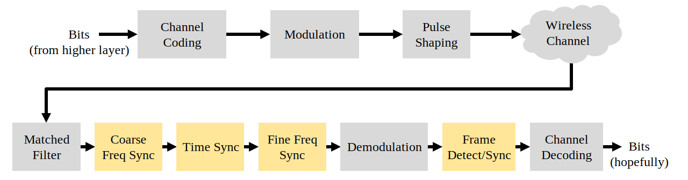
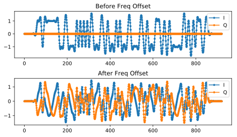
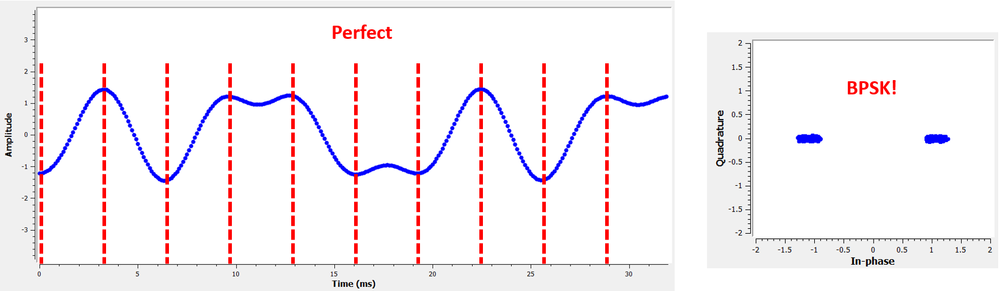
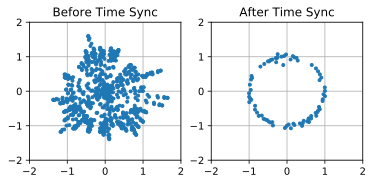
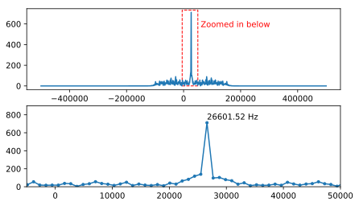
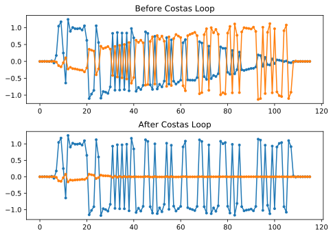

.. _sync-chapter:

################
Synchronization
################

***************************
Introduction
***************************

We have discussed how to transmit digitally over the air, utilizing a digital modulation scheme like QPSK and by applying pulse shaping to limit the signal bandwidth.  Channel coding can be used to deal with noisy channels, such as when you have low SNR at the receiver.  Filtering out as much as possible before digitally processing the signal always helps.  In this chapter we will investigate how synchronization is performed on the receiving end.  Synchronization is a set of processing that occurs *before* demodulation and channel decoding.  The overall tx-channel-rx chain is shown below, with the blocks discussed in this chapter highlighted in yellow.  (This diagram is not all-encompassing--most systems also include equalization and multiplexing).

***************************
Simulating Wireless Channel
***************************

Before we learn how to implement time and frequency synchronization, we need to make our simulated signals more realistic.  Without adding some random time delay, the act of synchronizing in time is trivial.  In fact, you only need to take into account the sample delay of any filters you use.  We also want to simulate a frequency offset because, as we will discuss, oscillators are not perfect; there will always be some offset between the transmitter and receiver's center frequency.

Let's examine Python code for simulating a non-integer delay and a frequency offset.  The Python code in this chapter will start from the code we wrote during the pulse shaping Python exercise (click below if you need it); you can consider it the starting point of the code in this chapter, and all new code will come after.

.. raw:: html

   

   
<a>Python Code from Pulse Shaping</a>

.. code-block:: python

    import numpy as np
    import matplotlib.pyplot as plt
    from scipy import signal
    import math

    # this part came from pulse shaping exercise
    num_symbols = 100
    sps = 8
    bits = np.random.randint(0, 2, num_symbols) # Our data to be transmitted, 1s and 0s
    pulse_train = np.array([])
    for bit in bits:
        pulse = np.zeros(sps)
        pulse[0] = bit*2-1 # set the first value to either a 1 or -1
        pulse_train = np.concatenate((pulse_train, pulse)) # add the 8 samples to the signal

    # Create our raised-cosine filter
    num_taps = 101
    beta = 0.35
    Ts = sps # Assume sample rate is 1 Hz, so sample period is 1, so *symbol* period is 8
    t = np.arange(-51, 52) # remember it's not inclusive of final number
    h = np.sinc(t/Ts) * np.cos(np.pi*beta*t/Ts) / (1 - (2*beta*t/Ts)**2)

    # Filter our signal, in order to apply the pulse shaping
    samples = np.convolve(pulse_train, h)

.. raw:: html

   

We will leave out the plotting-related code because by now you have probably learned how to plot any signal you want.  Making the plots look pretty, as they often do in this textbook, requires a lot of extra code that is not necessary to understand.

Adding a Delay
##############

We can easily simulate a delay by shifting samples, but it only simulates a delay that is an integer multiple of our sample period.  In the real world the delay will be some fraction of a sample period.  We can simulate the delay of a fraction of a sample by making a "fractional delay" filter, which passes all frequencies but delays the samples by some amount that isn't limited to the sample interval.  You can think of it as an all-pass filter that applies the same phase shift to all frequencies.  (Recall that a time delay and phase shift are equivalent.)  The Python code to create this filter is shown below:

.. code-block:: python

    # Create and apply fractional delay filter
    delay = 0.4 # fractional delay, in samples
    N = 21 # number of taps
    n = np.arange(N) # 0,1,2,3...
    h = np.sinc(n - delay) # calc filter taps
    h *= np.hamming(N) # window the filter to make sure it decays to 0 on both sides
    h /= np.sum(h) # normalize to get unity gain, we don't want to change the amplitude/power
    samples = np.convolve(samples, h) # apply filter

As you can see, we are calculating the filter taps using a sinc() function.  A sinc in the time domain is a rectangle in the frequency domain, and our rectangle for this filter spans the entire frequency range of our signal.  This filter does not reshape the signal, it just delays it in time.  In our example we are delaying by 0.3 of a sample.  Keep in mind that applying *any* filter delays a signal by half of the filter taps minus one, due to the act of convolving the signal through the filter.

If we plot the "before" and "after" of filtering a signal, we can observe the fractional delay.  In our plot we zoom into only a couple of symbols.  Otherwise, the fractional delay is not viewable.

.. image:: ../_static/fractional-delay-filter.svg
   :align: center
   :target: ../_static/fractional-delay-filter.svg

Adding a Frequency Offset
##########################

To make our simulated signal more realistic, we will apply a frequency offset.  Let's say that our sample rate in this simulation is 1 MHz (it doesn't actually matter what it is, but you'll see why it makes it easier to choose a number).  If we want to simulate a frequency offset of 13 kHz (some arbitrary number), we can do it via the following code:

.. code-block:: python

    # apply a freq offset
    fs = 1e6 # assume our sample rate is 1 MHz
    fo = 13000 # simulate freq offset
    Ts = 1/fs # calc sample period
    t = np.arange(0, Ts*len(samples), Ts) # create time vector
    samples = samples * np.exp(1j*2*np.pi*fo*t) # perform freq shift
 
Below demonstrates the signal before and after the frequency offset is applied.
 

We have not been graphing the Q portion since we were transmitting BPSK, making the Q portion always zero.  Now that we're adding a frequency shift to simulate wireless channels, the energy spreads across I and Q.  From this point on we should be plotting both I and Q.  Feel free to substitute a different frequency offset for your code.  If you lower the offset to around 1 kHz, you will be able to see the sinusoid in the envelope of the signal because it's oscillating slow enough to span several symbols.

As far as picking an arbitrary sample rate, if you scrutinize the code you will notice what matters is the ratio of :code:`fo` to :code:`fs`.

You can pretend that the two code blocks presented earlier simulate a the wireless channel.  The code should come after the transmit-side code (what we did in the pulse shaping chapter) and before the receive-side code, which is what we will explore the rest of this chapter.

***************************
Time Synchronization
***************************

When we transmit a signal wirelessly, it arrives at the receiver with a random phase shift due to time travelled.  We cannot just start sampling the symbols at our symbol rate because we are unlikely to sample it at the right spot in the pulse, as discussed at the end of the :ref:`pulse-shaping-chapter` chapter.  Review the three figures at the end of that chapter if you are not following.

Most timing synchronization techniques take the form of a phase lock loop (PLL); we won't study PLLs here but it's important to know the term, and you can read about them on your own if you are interested.  PLLs are closed-loop systems that use feedback to continuously adjust something; in our case, a time shift permits us to sample at the peak of the digital symbols.

You can picture timing recovery as a block in the receiver, which accepts a stream of samples and outputs another stream of samples (similar to a filter).  We program this timing recovery block with information about our signal, the most important being the number of samples per symbol (or our best guess at it, if we are not 100% sure what was transmitted).  This block acts as a "decimator", i.e., our sample output will be a fraction of the number of samples in.  We want one sample per digital symbol, so the decimation rate is simply the samples per symbol.  If the transmitter transmits at 1M symbols per second, and we sample at 16 Msps, we will receive 16 samples per symbol.  That will be the sample rate going into the timing sync block.  The sample rate coming out of the block will be 1 Msps because we want one sample per digital symbol.

Most timing recovery methods rely on the fact that our digital symbols rise and then fall, and the crest is the point at which we want to sample the symbol. To put it another way, we sample the maximum point after taking the absolute value:

There are many timing recovery methods, most resembling a PLL.  Generally the difference between them is the equation used to perform "correction" on the timing offset, which we denote as :math:`\mu` or :code:`mu` in code.  The value of :code:`mu` gets updated every loop iteration.  It is in units of symbols, and you can think of it as how much we have to shift by to be able to sample at the "perfect" time.  So if :code:`mu = 3.61` then that means we have to shift the input by 3.61 samples to sample at the right spot.  Because we have 8 samples per symbol, if :code:`mu` goes over 8 it will just wrap back around to zero.

The following Python code implements the Mueller and Muller clock recovery technique.

.. code-block:: python

    mu = 0 # initial estimate of phase of sample
    out = np.zeros(len(samples) + 10, dtype=np.complex)
    out_rail = np.zeros(len(samples) + 10, dtype=np.complex) # stores values, each iteration we need the previous 2 values plus current value
    i_in = 0 # input samples index
    i_out = 2 # output index (let first two outputs be 0)
    while i_out < len(samples) and i_in < len(samples):
        out[i_out] = samples[i_in + int(mu)] # grab what we think is the "best" sample
        out_rail[i_out] = int(np.real(out[i_out]) > 0) + 1j*int(np.imag(out[i_out]) > 0)
        x = (out_rail[i_out] - out_rail[i_out-2]) * np.conj(out[i_out-1])
        y = (out[i_out] - out[i_out-2]) * np.conj(out_rail[i_out-1])
        mm_val = np.real(y - x)
        mu += sps + 0.3*mm_val
        i_in += int(np.floor(mu)) # round down to nearest int since we are using it as an index
        mu = mu - np.floor(mu) # remove the integer part of mu
        i_out += 1 # increment output index
    out = out[2:i_out] # remove the first two, and anything after i_out (that was never filled out)

The timing recovery block is fed "received" samples, and it produces an output sample one at a time (note the :code:`i_out` being incremented by 1 each iteration of the loop).  The recovery block doesn't just use the "received" samples one after another because of the way the loop adjusts :code:`i_in`.  It will skip some samples in an attempt to pull the "correct" sample, which would be the one at the peak of the pulse.  As the loop processes samples it slowly synchronizes to the symbol, or at least it attempts to by adjusting :code:`mu`.  Given the code's structure, the integer part of :code:`mu` gets added to :code:`i_in`, and then removed from :code:`mu` (keep in mind that :code:`mm_val` can be negative or positive each loop).  Once it is fully synchronized, the loop should only pull the center sample from each symbol/pulse.  You can adjust the constant 0.3, which will change how fast the feedback loop reacts; a higher value will make it react faster, but with higher risk of stability issues.

The next plot shows an example output where we have *disabled* the fractional time delay as well as the frequency offset.  We only show I because Q is all zeroes with the frequency offset disabled.  The three plots are stacked on top of each other to show how the bits align vertically.

**Top Plot**
    Original BPSK symbols, i.e., 1s and -1s.  Recall that there are zeroes in between because we want 8 samples per symbol.
**Middle Plot**
    Samples after pulse shaping but before the synchronizer.
**Bottom plot**
    Output of the symbol synchronizer, which provides just 1 sample per symbol.  That is these samples can be fed directly into a demodulator, which for BPSK is checking whether the value is greater than or less than 0.

.. image:: ../_static/time-sync-output.svg
   :align: center
   :target: ../_static/time-sync-output.svg

Let's focus on the bottom plot, which is the output of the synchronizer.  It took nearly 30 symbols for the synchronization to lock into the right delay.  Due inevitably to the time it takes for synchronizers to lock in, many communications protocols use a preamble that contains a synchronization sequence: it acts as a way to announce that a new packet has arrived, and it gives the receiver time to sync to it.  But after these ~30 samples the synchronizer works perfectly.  We are left with perfect 1s and -1s that match the input data.  It helps that this example didn't have any noise added.  Feel free to add noise or time shifts and see how the synchronizer behaves.  If we were using QPSK then we would be dealing with complex numbers, but the approach would be the same.

****************************************
Time Synchronization with Interpolation
****************************************

Symbol synchronizers tend to interpolate the input samples by some number, e.g., 16, so that it's able to shift by a *fraction* of a sample.  The random delay caused by the wireless channel will unlikely be an exact multiple of a sample, so the peak of the symbol may not actually happen on a sample.  It is especially true in a case where there might only be 2 or 4 samples per symbol being received.  By interpolating the samples, it gives us the ability to sample "in between" actual samples, in order to hit the very peak of each symbol.  The output of the synchronizer is still only 1 sample per symbol. The input samples themselves are interpolated.

Our time synchronization Python code we have implemented above did not include any interpolation.  To expand our code, enable the fractional time delay that we implemented at the beginning of this chapter so our received signal has a more realistic delay.  Leave the frequency offset disabled for now.  If you re-run the simulation, you'll find that the synchronizer fails to fully synchronize to the signal.  That's because we aren't interpolating, so the code has no way to "sample between samples" to compensate for the fractional delay.  Let's add in the interpolation.

A quick way to interpolate a signal in Python is to use scipy's :code:`signal.resample` or :code:`signal.resample_poly`.  These functions both do the same thing but work differently under the hood.  We will use the latter function because it tends to be faster.  Let's interpolate by 16, i.e., we will be inserting 15 extra samples between each sample.  It can be done in one line of code, and it should happen *before* we go to perform time synchronization (prior to the large code snippet above).  Let's also plot the before and after to see the difference:

.. code-block:: python

 samples_interpolated = signal.resample_poly(samples, 16, 1)
 
 # Plot the old vs new
 plt.subplot(211)
 plt.plot(samples,'.-')
 plt.subplot(212)
 plt.plot(samples_interpolated,'.-')
 plt.show()

If we zoom *way* in, we see that it's the same signal, just with 16x as many points:

.. image:: ../_static/time-sync-interpolated-samples.svg
   :align: center
   :target: ../_static/time-sync-interpolated-samples.svg

Hopefully the reason we need to interpolate inside of the time-sync block is becoming clear.  These extra samples will let us take into account a fraction of a sample delay.  In addition to calculating :code:`samples_interpolated`, we also have to modify one line of code in our time synchronizer.  We will change the first line inside the while loop to become:

.. code-block:: python

 out[i_out] = samples_interpolated[i_in*16 + int(mu*16)]

We did a couple things here.  First, we can't just use :code:`i_in` as the input sample index anymore.  We have to multiply it by 16 because we interpolated our input samples by 16.  Recall that the feedback loop adjusts the :code:`mu` variable.  It represents the delay that leads to us sampling at the right moment.  Also recall that after we calculated the new value of :code:`mu`, we added the integer part to :code:`i_in`.  Now we will use the remainder part, which is a float from 0 to 1, and it represents the fraction of a sample we need to delay by.  Before we weren't able to delay by a fraction of a sample, but now we are, at least in increments of 16ths of a sample.  What we do is multiply :code:`mu` by 16 to figure out how many samples of our interpolated signal we need to delay by.  And then we have to round that number, since the value in the brackets ultimately is an index and must be an integer.  If this paragraph didn't make sense, try to go back to the initial Mueller and Muller clock recovery code, and also read the comments next to each line of code.

The actual plot output of this new code should look roughly the same as before.  All we really did was make our simulation more realistic by adding a fractional-sample delay, and then we added the interpolator to the synchronizer in order to compensate for that fractional sample delay.

Feel free to play around with different interpolation factors, i.e., change all the 16s to some other value.  You can also try enabling the frequency offset, or adding in white Gaussian noise to the signal before it gets received, to see how that impacts synchronization performance (hint: you might have to adjust that 0.3 multiplier).

If we enable only the frequency offset using a frequency of 1 kHz, we get the following time sync performance.  We have to show both I and Q now that we added a frequency offset:

.. image:: ../_static/time-sync-output2.svg
   :align: center
   :target: ../_static/time-sync-output2.svg

It might be hard to see, but the time sync is still working just fine.  It takes about 20 to 30 symbols before it's locked in.  However, there's a sinusoid pattern because we still have a frequency offset, and we will learn how to deal with it in the next section.

Below shows the IQ plot (a.k.a. constellation plot) of the signal before and after synchronization.  Remember you can plot samples on an IQ plot using a scatter plot: :code:`plt.plot(np.real(samples), np.imag(samples), '.')`.  In the animation below we have specifically left out the first 30 symbols.  They occurred before the time sync had finished.  The symbols left are all roughly on the unit circle due to the frequency offset.

    
To gain even more insight, we can look at the constellation over time to discern what's actually happening to the symbols.  At the very beginning, for a short period of time, the symbols are not 0 or on the unit circle.  That is the period in which time sync is finding the right delay.  It's very quick, watch closely!  The spinning is just the frequency offset.  Frequency is a constant change in phase, so a frequency offset causes spinning of the BPSK (creating a circle in the static/persistent plot above).

.. image:: ../_static/time-sync-constellation-animated.gif
   :align: center 

Hopefully by seeing an example of time sync actually happening, you have a feel for what it does and a general idea of how it works.  In practice, the while loop we created would only work on a small number of samples at a time (e.g., 1000).  You have to remember the value of :code:`mu` in between calls to the sync function, as well as the last couple values of :code:`out` and :code:`out_rail`.

Next we will survey frequency synchronization, which we split up into coarse and fine frequency sync.  Coarse usually comes before time sync, while fine comes after.

**********************************
Coarse Frequency Synchronization
**********************************

Even though we tell the transmitter and receiver to operate on the same center frequency, there is going to be a slight frequency offset between the two due to either imperfections in hardware (e.g., the oscillator) or a Doppler shift from movement.  This frequency offset will be tiny relative to the carrier frequency, but even a small offset can throw off a digital signal.  The offset will likely change over time, necessitating an always-running feedback loop to correct the offset.  As an example, the oscillator inside the Pluto has a max offset spec of 25 PPM.  That is 25 parts per million relative to the center frequency.  If you are tuned to 2.4 GHz, it would be +/- 60 kHz max offset.  The samples our SDR provides us are at baseband, making any frequency offset manifest in that baseband signal.  A BPSK signal with a small carrier offset will look something like the below time plot, which is obviously not great for demodulating bits.  We must remove any frequency offsets before demodulation.

.. image:: ../_static/carrier-offset.png
   :scale: 60 % 
   :align: center 

Frequency synchronization is usually broken down into coarse sync and fine sync, where coarse corrects large offsets on the order of kHz or more, while the fine sync corrects whatever is left.  Coarse happens before time sync, while fine happens after.

Mathematically, if we have a baseband signal :math:`s(t)` and it is experiencing a frequency (a.k.a. carrier) offset of :math:`f_o` Hz, we can represent what is received as:

.. math::

 r(t) = s(t) e^{j2\pi f_o t} + n(t)

where :math:`n(t)` is the noise.  

The first trick we will learn, in order to perform coarse frequency offset estimation (if we can estimate the offset frequency, then we can undo it), is to take the square of our signal.  Let's ignore noise for now, to keep the math simpler:

.. math::

 r^2(t) = s^2(t) e^{j4\pi f_o t}

Let's see what happens when we take the square of our signal :math:`s(t)` by considering what QPSK would do.  Squaring complex numbers leads to interesting behavior, especially when we are talking about constellations like BPSK and QPSK.  The following animation shows what happens when you square QPSK, then square it again.  I specifically used QPSK instead of BPSK because you can see that when you square QPSK once, you essentially get BPSK.  And then after one more square it becomes one cluster.  (Thank you to http://ventrella.com/ComplexSquaring/ who created this neat webapp.)

.. image:: ../_static/squaring-qpsk.gif
   :scale: 80 % 
   :align: center 
 
Let's watch what happens when our QPSK signal has a small phase rotation and magnitude scaling applied to it, which is more realistic:
 
.. image:: ../_static/squaring-qpsk2.gif
   :scale: 80 % 
   :align: center 

It still becomes one cluster, just with a phase shift.  The main take-away here is that if you square QPSK twice (and BPSK once), it will merge all four clusters of points into one cluster.  Why is that useful?  Well by merging the clusters we are essentially removing the modulation!  If all points are now in the same cluster, that's like having a bunch of constants in a row.  It's as if there is no modulation anymore, and the only thing left is the sinusoid caused by the frequency offset (we also have noise but let's keep ignoring it for now).  It turns out that you have to square the signal N times, where N is the order of the modulation scheme used, which means that this trick only works if you know the modulation scheme ahead of time.  The equation is really:

.. math::

 r^N(t) = s^N(t) e^{j2N\pi f_o t}

For our case of BPSK we have an order 2 modulation scheme, so we will use the following equation for our coarse frequency sync:

.. math::

 r^2(t) = s^2(t) e^{j4\pi f_o t}

We discovered what happens to the :math:`s(t)` portion of the equation, but what about the sinusoid part (a.k.a. complex exponential)?  As we can see, it is adding the :math:`N` term, which makes it equivalent to a sinusoid at a frequency of :math:`Nf_o` instead of just :math:`f_o`.  A simple method for figuring out :math:`f_o` is to take the FFT of the signal after we square it N times and seeing where the spike occurs.  Let's simulate it in Python.  We will return to generating our BPSK signal, and instead of applying a fractional-delay to it, we will apply a frequency offset by multiplying the signal by :math:`e^{j2\pi f_o t}` just like we did in chapter :ref:`filters-chapter` to convert a low-pass filter to a high-pass filter.

Using the code from the beginning of this chapter, apply a +13 kHz frequency offset to your digital signal.  It could happen right before or right after the fractional-delay is added; it doesn't matter which. Regardless, it must happen *after* pulse shaping but before we do any receive-side functions such as time sync.

Now that we have a signal with a 13 kHz frequency offset, let's plot the FFT before and after doing the squaring, to see what happens.  By now you should know how to do an FFT, including the abs() and fftshift() operation.  For this exercise it doesn't matter whether or not you take the log or whether you square it after taking the abs().

First look at the signal before squaring (just a normal FFT):

.. code-block:: python

    psd = np.fft.fftshift(np.abs(np.fft.fft(samples)))
    f = np.linspace(-fs/2.0, fs/2.0, len(psd))
    plt.plot(f, psd)
    plt.show()

.. image:: ../_static/coarse-freq-sync-before.svg
   :align: center
   :target: ../_static/coarse-freq-sync-before.svg
   
We don't actually see any peak associated with the carrier offset.  It's covered up by our signal.

Now with the squaring added (just a power of 2 because it's BPSK):

.. code-block:: python

    # Add this before the FFT line
    samples = samples**2

We have to zoom way in to see which frequency the spike is on:

You can try increasing the number of symbols simulated (e.g., 1000 symbols) so that we have enough samples to work with.  The more samples that go into our FFT, the more accurate our estimation of the frequency offset will be.  Just as a reminder, the code above should come *before* the timing synchronizer.

The offset frequency spike shows up at :math:`Nf_o`.  We need to divide this bin (26.6 kHz) by 2 to find our final answer, which is very close to the 13 kHz frequency offset we applied at the beginning of the chapter!  If you had played with that number and it's no longer 13 kHz, that's fine.  Just make sure you are aware of what you set it to.

Because our sample rate is 1 MHz, the maximum frequencies we can see are -500 kHz to 500 kHz.  If we take our signal to the power of N, that means we can only "see" frequency offsets up to :math:`500e3/N`, or in the case of BPSK +/- 250 kHz.  If we were receiving a QPSK signal then it would only be +/- 125 kHz, and carrier offset higher or lower than that would be out of our range using this technique.  To give you a feel for Doppler shift, if you were transmitting in the 2.4 GHz band and either the transmitter or receiver was traveling at 60 mph (it's the relative speed that matters), it would cause a frequency shift of 214 Hz.  The offset due to a low quality oscillator will probably be the main culprit in this situation.

Actually correcting this frequency offset is done exactly how we simulated the offset in the first place: multiplying by a complex exponential, except with a negative sign since we want to remove the offset.

.. code-block:: python

    max_freq = f[np.argmax(psd)]
    Ts = 1/fs # calc sample period
    t = np.arange(0, Ts*len(samples), Ts) # create time vector
    samples = samples * np.exp(-1j*2*np.pi*max_freq*t/2.0)

It's up to you if you want to correct it or change the initial frequency offset we applied at the start to a smaller number (like 500 Hz) to test out the fine frequency sync we will now learn how to do.

**********************************
Fine Frequency Synchronization
**********************************

Next we will switch gears to fine frequency sync.  The previous trick is more for coarse sink, and it's not a closed-loop (feedback type) operation.  But for fine frequency sync we will want a feedback loop that we stream samples through, which once again will be a form of PLL.  Our goal is to get the frequency offset to zero and maintain it there, even if the offset changes over time.  We have to continuously track the offset.  Fine frequency sync techniques work best with a signal that already has been synchronized in time at the symbol level, so the code we discuss in this section will come *after* timing sync.

We will use a technique called a Costas Loop.  It is a form of PLL that is specifically designed for carrier frequency offset correction for digital signals like BPSK and QPSK.  It was invented by John P. Costas at General Electric in the 1950s, and it had a major impact on modern digital communications.  The Costas Loop will remove the frequency offset while also fixing any phase offset.  The energy is aligned with the I axis.  Frequency is just a change in phase so they can be tracked as one.  The Costas Loop is summarized using the following diagram (note that 1/2s have been left out of the equations because they don't functionally matter).

.. image:: ../_static/costas-loop.svg
   :align: center 
   :target: ../_static/costas-loop.svg

The voltage controlled oscillator (VCO) is simply a sin/cos wave generator that uses a frequency based on the input.  In our case, since we are simulating a wireless channel, it isn't a voltage, but rather a level represented by a variable.  It determines the frequency and phase of the generated sine and cosine waves.  What it's doing is multiplying the received signal by an internally-generated sinusoid, in an attempt to undo the frequency and phase offset.  This behavior is similar to how an SDR downconverts and creates the I and Q branches.

Below is the Python code that is our Costas Loop:

.. code-block:: python

    N = len(samples)
    phase = 0
    freq = 0
    # These next two params is what to adjust, to make the feedback loop faster or slower (which impacts stability)
    alpha = 0.132
    beta = 0.00932
    out = np.zeros(N, dtype=np.complex)
    freq_log = []
    for i in range(N):
        out[i] = samples[i] * np.exp(-1j*phase) # adjust the input sample by the inverse of the estimated phase offset
        error = np.real(out[i]) * np.imag(out[i]) # This is the error formula for 2nd order Costas Loop (e.g. for BPSK)
        
        # Advance the loop (recalc phase and freq offset)
        freq += (beta * error)
        freq_log.append(freq / 50.0 * fs)
        phase += freq + (alpha * error)
        
        # Optional: Adjust phase so its always between 0 and 2pi, recall that phase wraps around every 2pi
        while phase >= 2*np.pi:
            phase -= 2*np.pi
        while phase < 0:
            phase += 2*np.pi

    # Plot freq over time to see how long it takes to hit the right offset
    plt.plot(freq_log,'.-')
    plt.show()

There is a lot here so let's step through it.  Some lines are simple and others are super complicated.  :code:`samples` is our input, and :code:`out` is the output samples.  :code:`phase` and :code:`frequency` are like the :code:`mu` from the time sync code.  They contain the current offset estimates, and each loop iteration we create the output samples by multiplying the input samples by :code:`np.exp(-1j*phase)`.  The :code:`error` variable holds the "error" metric, and for a 2nd order Costas Loop it's a very simple equation.  We multiply the real part of the sample by the imaginary part.  For a 4th order Costas Loop, it's still relatively simple but not quite one line.  If you are curious what it looks like click below, but we won't be using it in our code for now.

.. raw:: html

   

   
<a>Order 4 Costas Loop Error Equation (for those curious)</a>

.. code-block:: python

    # For QPSK
    def phase_detector_4(sample):
        if sample.real > 0:
            a = 1.0
        else:
            a = -1.0
        if sample.imag > 0:
            b = 1.0
        else:
            b = -1.0   
        return a * sample.imag - b * sample.real

.. raw:: html

   

The :code:`alpha` and :code:`beta` variables define how fast the phase and frequency update, respectively.  There is some theory behind why I chose those two values; however, we won't address it here.  If you are curious you can try tweaking :code:`alpha` and/or :code:`beta` to see what happens.

We log the value of :code:`freq` each iteration so we can plot it at the end, to see how the Costas Loop converges on the correct frequency offset.  We implement :code:`freq / 50.0 * fs` for display purposes only.  Because :code:`freq` in the loop is not in units of Hz, if we didn't care about plotting :code:`freq` we could leave that whole line out.

After recalculating phase, we add or remove enough :math:`2 \pi`'s to keep phase between 0 and :math:`2 \pi`,  which wraps phase around.

Our signal before and after the Costas Loop looks like this:

And the frequency offset estimation over time (y-axis is Hz):

.. image:: ../_static/costas-loop-freq-tracking.svg
   :align: center
   :target: ../_static/costas-loop-freq-tracking.svg

It takes nearly 70 samples for the algorithm to fully lock it on the frequency offset.  You can see that in my simulated example there were about -300 Hz left over after the coarse frequency sync.  Yours may vary.  Like I mentioned before, you can disable the coarse frequency sync and set the initial frequency offset to whatever value you want and see if the Costas Loop figures it out.

The Costas Loop, in addition to removing the frequency offset, aligned our BPSK signal to be on the I portion, making Q zero again.  It is a convenient side-effect from the Costas Loop, and it lets the Costas Loop essentially act as our demodulator.  Now all we have to do is take I and see if it's greater or less than zero.  We won't actually know how to make negative and positive to 0 and 1 because there may or may not be an inversion; there's no way for the Costas Loop (or our time sync) to know.  That is where differential coding comes into play.  It removes the ambiguity because 1s and 0s are based on whether or not the symbol changed, not whether it was +1 or -1.  If we added differential coding, we would still be using BPSK.  We would be adding a differential coding block right before modulation on the tx side and right after demodulation on the rx side.

***************************
Frame Synchronization
***************************

We have discussed how to correct any time, frequency, and phase offsets in our received signal.  But most modern communications protocols are not simply streaming bits at 100% duty cycle.  Instead, they use packets/frames.  At the receiver we need to be able to identify when a new frame begins.  Customarily the frame header (at the MAC layer) contains how many bytes are in the frame.  We can use that information to know how long the frame is, e.g., in units samples or symbols.  Nonetheless, detecting the start of frame is a whole separate task.  Below shows an example WiFi frame structure.  Note how the very first thing transmitted is a PHY-layer header, and the first half of that header is a "preamble".  This preamble contains a synchronization sequence that the receiver uses to detect start of frames, and it is a sequence known by the receiver beforehand.

.. image:: ../_static/wifi-frame.png
   :scale: 60 % 
   :align: center 

A common and straightforward method of detecting these sequences at the receiver is to cross-correlate the received samples with the known sequence.  When the sequence occurs, this cross-correlation resembles an autocorrelation (with noise added).  Typically the sequences chosen for preambles will have nice autocorrelation properties, such as the autocorrelation of the sequence creates a single strong spike at 0 and no other spikes.  One example is Barker codes, in 802.11/WiFi a length-11 Barker sequence is used for the 1 and 2 Mbit/sec rates:

.. code-block::

    +1 +1 +1 −1 −1 −1 +1 −1 −1 +1 −1

You can think of it as 11 BPSK symbols.  We can look at the autocorrelation of this sequence very easily in Python:

.. code-block:: python

    import numpy as np
    import matplotlib.pyplot as plt
    x = [1,1,1,-1,-1,-1,1,-1,-1,1,-1]
    plt.plot(np.correlate(x,x,'same'),'.-')
    plt.grid()
    plt.show()
    
.. image:: ../_static/barker-code.svg
   :align: center
   :target: ../_static/barker-code.svg

You can see it's 11 (length of the sequence) in the center, and -1 or 0 for all other delays.  It works well for finding the start of a frame because it essentially integrates 11 symbols worth of energy in an attempt to create a 1 bit spike in the output of the cross-correlation.  In fact, the hardest part of performing start-of-frame detection is figuring out a good threshold.  You don't want frames that aren't actually part of your protocol to trigger it.  That means in addition to cross-correlation you also have to do some sort of power normalizing, which we won't consider here.  In deciding a threshold, you have to make a trade-off between probability of detection and probability of false alarms.  Remember that the frame header itself will have information, so some false alarms are OK; you will quickly find it is not actually a frame when you go to decode the header and the CRC inevitably fails (because it wasn't actually a frame).  Yet while some false alarms are OK, missing a frame detection altogether is bad.

Another sequence with great autocorrelation properties is Zadoff-Chu sequences, which are used in LTE.  They have the benefit of being in sets; you can have multiple different sequences that all have good autocorrelation properties, but they won't trigger each other (i.e., also good cross-correlation properties, when you cross-correlate different sequences in the set).  Thanks to that feature, different cell towers will be assigned different sequences so that a phone can not only find the start of the frame but also know which tower it is receiving from.

