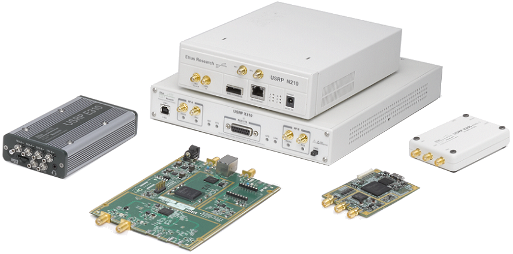

.. _usrp-chapter:

####################################
USRP in Python
####################################

   
In this chapter we learn how to use the UHD Python API to control and receive/transmit signals with a `USRP <https://www.ettus.com/>`_ which is a series of SDRs made by Ettus Research (now part of NI).  We will discuss transmitting and receiving on the USRP in Python, and dive into USRP-specific topics including stream args, subdevices, channels, 10 MHz and PPS synchronization.  

************************
Software/Drivers Install
************************

While the Python code provided in this textbook should work under Windows, Mac, and Linux, we will only be providing driver/API install instructions specific to Ubuntu 22 (although the instructions below should work on most Debian-based distributions).  We will start by creating an Ubuntu 22 VirtualBox VM; feel free to skip the VM portion if you already have your OS ready to go.  Alternatively, if you're on Windows 11, Windows Subsystem for Linux (WSL) using Ubuntu 22 tends to run fairly well and supports graphics out-of-the-box. 

Setting Up an Ubuntu 22 VM
##########################

(Optional)

1. Download Ubuntu 22.04 Desktop .iso- https://ubuntu.com/download/desktop
2. Install and open `VirtualBox <https://www.virtualbox.org/wiki/Downloads>`_.
3. Create a new VM.  For memory size, I recommend using 50% of your computer’s RAM.
4. Create the virtual hard disk, choose VDI, and dynamically allocate size.  15 GB should be enough. If you want to be really safe you can use more.
5. Start the VM. It will ask you for installation media. Choose the Ubuntu 22 desktop .iso file.  Choose “install ubuntu”, use default options, and a pop up will warn you about the changes you are about to make. Hit continue.  Choose name/password and then wait for the VM to finish initializing.  After finishing the VM will restart, but you should power off the VM after the restart.
6. Go into the VM settings (the gear icon).
7. Under system > processor > choose at least 3 CPUs.  If you have an actual video card then in display > video memory > choose something much higher.
8. Start up your VM.
9. For USB type USRPs you'll need to install VM guest additions. Within the VM go to Devices > Insert Guest Additions CD > hit run when a box pops up.  Follow the instructions. Restart the VM, then attempt to forward the USRP to the VM, assuming it shows up in the list under Devices > USB.  The shared clipboard can be enabled through Devices > Shared Clipboard > Bidirectional.

Installing UHD and Python API
#############################

The terminal commands below should build and install the latest version of UHD, including the Python API:

.. code-block:: bash

 sudo apt-get install git cmake libboost-all-dev libusb-1.0-0-dev python3-docutils python3-mako python3-numpy python3-requests python3-ruamel.yaml python3-setuptools build-essential
 cd ~
 git clone https://github.com/EttusResearch/uhd.git
 cd uhd/host
 mkdir build
 cd build
 cmake -DENABLE_TESTS=OFF -DENABLE_C_API=OFF -DENABLE_MANUAL=OFF ..
 make -j8
 sudo make install
 sudo ldconfig

For more help see Ettus' official `Building and Installing UHD from source <https://files.ettus.com/manual/page_build_guide.html>`_ page.  Note that there are also methods of installing the drivers that don't require building from source.

Testing UHD Drivers and Python API
###################################

Open a new terminal and type the following commands:

.. code-block:: bash

 python3
 import uhd
 usrp = uhd.usrp.MultiUSRP()
 samples = usrp.recv_num_samps(10000, 100e6, 1e6, [0], 50)
 print(samples[0:10])

If no errors occur, you are good to go!

Benchmarking USRP Speed in Python
#################################

(Optional)

If you used the standard from-source install, the following command should benchmark the receive rate of your USRP using the Python API.  If using 56e6 caused many dropped samples or overruns, try lowering the number.  Dropped samples aren't necessarily going to ruin anything, but it's a good way to test the inefficiencies that might come with using a VM or older computer, for example.  If using a B 2X0, a fairly modern computer with a USB 3.0 port running properly should manage to do 56 MHz without dropped samples, especially with num_recv_frames set so high.

.. code-block:: bash

 python /usr/lib/uhd/examples/python/benchmark_rate.py --rx_rate 56e6 --args "num_recv_frames=1000"

************************
Receiving
************************

Receiving samples off a USRP is extremely easy using the built-in convenience function "recv_num_samps()", below is Python code that tunes the USRP to 100 MHz, using a sample rate of 1 MHz, and grabs 10,000 samples off the USRP, using a receive gain of 50 dB:

.. code-block:: python

 import uhd
 usrp = uhd.usrp.MultiUSRP()
 samples = usrp.recv_num_samps(10000, 100e6, 1e6, [0], 50) # units: N, Hz, Hz, list of channel IDs, dB
 print(samples[0:10])

The [0] is telling the USRP to use its first input port, and only receive one channel worth of samples (for a B210 to receive on two channels at once, for example, you could use [0, 1]).  

Here's a tip if you are trying to receive at a high rate but are getting overflows (O's are showing up in your console).  Instead of :code:`usrp = uhd.usrp.MultiUSRP()`, use:

.. code-block:: python

 usrp = uhd.usrp.MultiUSRP("num_recv_frames=1000")

which makes the receive buffer much larger (the default value is 32), helping to reduce overflows.   The actual size of the buffer in bytes depends on the USRP and type of connection, but simply setting :code:`num_recv_frames` to a value much higher than 32 tends to help.

For more serious applications I recommend not using the convenience function recv_num_samps(), because it hides some of the interesting behavior going on under the hood, and there is some set up that happens each call that we might only want to do once at the beginning, e.g., if we want to receive samples indefinitely.  The following code has the same functionality as recv_num_samps(), in fact it's almost exactly what gets called when you use the convenience function, but now we have the option to modify the behavior:

.. code-block:: python

 import uhd
 import numpy as np
 
 usrp = uhd.usrp.MultiUSRP()
 
 num_samps = 10000 # number of samples received
 center_freq = 100e6 # Hz
 sample_rate = 1e6 # Hz
 gain = 50 # dB
 
 usrp.set_rx_rate(sample_rate, 0)
 usrp.set_rx_freq(uhd.libpyuhd.types.tune_request(center_freq), 0)
 usrp.set_rx_gain(gain, 0)
 
 # Set up the stream and receive buffer
 st_args = uhd.usrp.StreamArgs("fc32", "sc16")
 st_args.channels = [0]
 metadata = uhd.types.RXMetadata()
 streamer = usrp.get_rx_stream(st_args)
 recv_buffer = np.zeros((1, 1000), dtype=np.complex64)
 
 # Start Stream
 stream_cmd = uhd.types.StreamCMD(uhd.types.StreamMode.start_cont)
 stream_cmd.stream_now = True
 streamer.issue_stream_cmd(stream_cmd)
 
 # Receive Samples
 samples = np.zeros(num_samps, dtype=np.complex64)
 for i in range(num_samps//1000):
     streamer.recv(recv_buffer, metadata)
     samples[i*1000:(i+1)*1000] = recv_buffer[0]
 
 # Stop Stream
 stream_cmd = uhd.types.StreamCMD(uhd.types.StreamMode.stop_cont)
 streamer.issue_stream_cmd(stream_cmd)
 
 print(len(samples))
 print(samples[0:10])

With num_samps set to 10,000 and the recv_buffer set to 1000, the for loop will run 10 times, i.e., there will be 10 calls to streamer.recv.  Note that we hard-coded recv_buffer to 1000 but you can find the maximum allowed value using :code:`streamer.get_max_num_samps()`, which is often around 3000-something.  Also note that recv_buffer must be 2d because the same API is used when receiving multiple channels at once, but in our case we just received one channel, so recv_buffer[0] gave us the 1D array of samples that we wanted.  You don't need to understand too much about how the stream starts/stops for now, but know that there are other options besides "continuous" mode, such as receiving a specific number of samples and having the stream stop automatically.  Although we don't process metadata in this example code, it contains any errors that occur, among other things, which you can check by looking at metadata.error_code at each iteration of the loop, if desired (errors tend to also show up in the console itself, as a result of UHD, so don't feel like you have to check for them within your Python code).  

Receive Gain
############

The following list shows the gain range of the different USRPs, they all go from 0 dB to the number specified below.  Note that this is not dBm, it's essentially dBm combined with some unknown offset because these are not calibrated devices. 

* B200/B210/B200-mini: 76 dB
* X310/N210 with WBX/SBX/UBX: 31.5 dB
* X310 with TwinRX: 93 dB
* E310/E312: 76 dB
* N320/N321: 60 dB

You can also use the command :code:`uhd_usrp_probe` in a terminal and in the RX Frontend section it will mention the gain range.

When specifying the gain, you can use the normal set_rx_gain() function which takes in the gain value in dB, but you can also use set_normalized_rx_gain() which takes in a value from 0 to 1 and automatically converts it to the range of the USRP you're using.  This is convenient when making an app that supports different models of USRP.  The downside of using normalized gain is that you no longer have your units in dB, so if you want to increase your gain by 10 dB, for example, you now have to calculate the amount.

Automatic Gain Control
######################

Some USRPs, including the B200 and E310 series, support automatic gain control (AGC) which will automatically adjust the receive gain in response to the received signal level, in an attempt to best "fill" the ADC's bits.  AGC can be turned on using:

.. code-block:: python

 usrp.set_rx_agc(True, 0) # 0 for channel 0, i.e. the first channel of the USRP

If you have a USRP that does not implement an AGC, an exception will be thrown when running the line above.  With AGC on, setting the gain won't do anything. 

Stream Arguments
****************

In the full example above you'll see the line :code:`st_args = uhd.usrp.StreamArgs("fc32", "sc16")`.  The first argument is the CPU data format, which is the data type of the samples once they are on your host computer.  UHD supports the following CPU data types when using the Python API:

.. list-table::
   :widths: 15 20 30
   :header-rows: 1
   
   * - Stream Arg
     - Numpy Data Type
     - Description
   * - fc64
     - np.complex128
     - Complex-valued double-precision data
   * - fc32
     - np.complex64
     - Complex-valued single-precision data

You might see other options in documentation for the UHD C++ API, but these were never implemented within the Python API, at least at the time of this writing.

The second argument is the "over-the-wire" data format, i.e. the data type as the samples are sent over USB/Ethernet/SFP to the host.  For the Python API, the options are: "sc16", "sc12", and "sc8", with the 12 bit option only supported by certain USRPs.  This choice is important because the connection between the USRP and host computer is often the bottleneck, so by switching from 16 bits to 8 bits you might achieve a higher rate.  Also remember that many USRPs have ADCs limited to 12 or 14 bits, using "sc16" doesn't mean the ADC is 16 bits. 

For the channel portion of the :code:`st_args`, see the Subdevice and Channels subsection below.

************************
Transmitting
************************

Similar to the recv_num_samps() convenience function, UHD provides the send_waveform() function to transmit a batch of samples, an example is shown below.  If you specify a duration (in seconds) longer than the provided signal, it will simply repeat it.  It helps to keep the values of samples between -1.0 and 1.0.

.. code-block:: python

 import uhd
 import numpy as np
 usrp = uhd.usrp.MultiUSRP()
 samples = 0.1*np.random.randn(10000) + 0.1j*np.random.randn(10000) # create random signal
 duration = 10 # seconds
 center_freq = 915e6
 sample_rate = 1e6
 gain = 20 # [dB] start low then work your way up
 usrp.send_waveform(samples, duration, center_freq, sample_rate, [0], gain)

For details about how this convenience function works under the hood, see the source code `here <https://github.com/EttusResearch/uhd/blob/master/host/python/uhd/usrp/multi_usrp.py>`_. 

Transmit Gain
#############

Similar to the receive side, the transmit gain range varies based on USRP model, going from 0 dB to the specified number below:

* B200/B210/B200-mini: 90 dB
* N210 with WBX: 25 dB
* N210 with SBX or UBX: 31.5 dB
* E310/E312: 90 dB
* N320/N321: 60 dB

There is also a set_normalized_tx_gain() function if you would like to specify the transmit gain using the range 0 to 1. 

************************************************
Transmitting and Receiving Simultaneously
************************************************

If you want to transmit and receive using the same USRP at the same time, the key is to do it using multiple threads within the same process; the USRP can't span multiple processes.  For example, in the `txrx_loopback_to_file <https://github.com/EttusResearch/uhd/blob/master/host/examples/txrx_loopback_to_file.cpp>`_ C++ example a separate thread is created to run the transmitter, and the receiving is done in the main thread.  You can also just spawn two threads, one for transmit and one for receive, as is done in the `benchmark_rate <https://github.com/EttusResearch/uhd/blob/master/host/examples/python/benchmark_rate.py>`_ Python example.  A full example is not shown here, simply because it would be a fairly long example and Ettus' benchmark_rate.py can always act as a starting point for someone.

*********************************
Subdevice, Channels, and Antennas
*********************************

One common source of confusion when using USRPs is how to pick the right subdevice and channel ID.  You may have noticed in every example above we used channel 0, and did not specify anything related to subdev.  If you're using a B210 and just want to use RF:B instead of RF:A, all you have to do is choose channel 1 instead of 0.  But on USRPs like the X310 that have two daughterboard slots, you have to tell UHD whether you want to use slot A or B, and which channel on that daughterboard, for example:

.. code-block:: python

 usrp.set_rx_subdev_spec("B:0")

If you want to use the TX/RX port instead of RX2 (the default), it's as simple as:

.. code-block:: python

 usrp.set_rx_antenna('TX/RX', 0) # set channel 0 to 'TX/RX'

which essentially just controls an RF switch onboard the USRP, to route from the other SMA connector.

To receive or transmit on two channels at once, instead of using :code:`st_args.channels = [0]` you provide a list, such as :code:`[0,1]`.  The receive samples buffer will have to be of size (2, N) in this case, instead of (1,N).  Just remember that with most USRPs, both channels share an LO, so you cant tune to different frequencies at once.

**************************
Syncing to 10 MHz and PPS
**************************

One of the huge advantages of using a USRP over other SDRs is their ability to synchronize to an external source or onboard `GPSDO <https://www.ettus.com/all-products/gpsdo-tcxo-module/>`_, allowing multi-receiver applications such as TDOA.  If you have connected an external 10 MHz and PPS source to your USRP, you will want to make sure to call these two lines after initializing your USRP:

.. code-block:: python

 usrp.set_clock_source("external")
 usrp.set_time_source("external")

If you are using an onboard GPSDO, you will instead use:

.. code-block:: python

 usrp.set_clock_source("gpsdo")
 usrp.set_time_source("gpsdo")

On the frequency sync side there's not much else to do; the LO used in the USRP's mixer is now going to be tied to the external source or `GPSDO <https://www.ettus.com/all-products/gpsdo-tcxo-module/>`_.  But on the timing side, you may wish to command the USRP to start sampling exactly on the PPS, for example.  This can be done with the following code:

.. code-block:: python

 # copy the receive example above, everything up until # Start Stream

 # Wait for 1 PPS to happen, then set the time at next PPS to 0.0
 time_at_last_pps = usrp.get_time_last_pps().get_real_secs()
 while time_at_last_pps == usrp.get_time_last_pps().get_real_secs():
     time.sleep(0.1) # keep waiting till it happens- if this while loop never finishes then the PPS signal isn't there
 usrp.set_time_next_pps(uhd.libpyuhd.types.time_spec(0.0))
 
 # Schedule Rx of num_samps samples exactly 3 seconds from last PPS
 stream_cmd = uhd.types.StreamCMD(uhd.types.StreamMode.num_done)
 stream_cmd.num_samps = num_samps
 stream_cmd.stream_now = False
 stream_cmd.time_spec = uhd.libpyuhd.types.time_spec(3.0) # set start time (try tweaking this)
 streamer.issue_stream_cmd(stream_cmd)
 
 # Receive Samples.  recv() will return zeros, then our samples, then more zeros, letting us know it's done
 waiting_to_start = True # keep track of where we are in the cycle (see above comment)
 nsamps = 0
 i = 0
 samples = np.zeros(num_samps, dtype=np.complex64)
 while nsamps != 0 or waiting_to_start:
     nsamps = streamer.recv(recv_buffer, metadata)
     if nsamps and waiting_to_start:
         waiting_to_start = False
     elif nsamps:
         samples[i:i+nsamps] = recv_buffer[0][0:nsamps]
     i += nsamps

If it seems like it's not working, but is not throwing any errors, try changing that 3.0 number from anything between 1.0 and 5.0.  You can also check the metadata after the call to recv(), simply check :code:`if metadata.error_code != uhd.types.RXMetadataErrorCode.none:`.  
     
For debugging sake, you can verify the 10 MHz signal is showing up to the USRP by checking the return of :code:`usrp.get_mboard_sensor("ref_locked", 0)`.  If the PPS signal isn't showing up, you'll know it because the first while loop in the code above will never finish.
     
     
     
     
